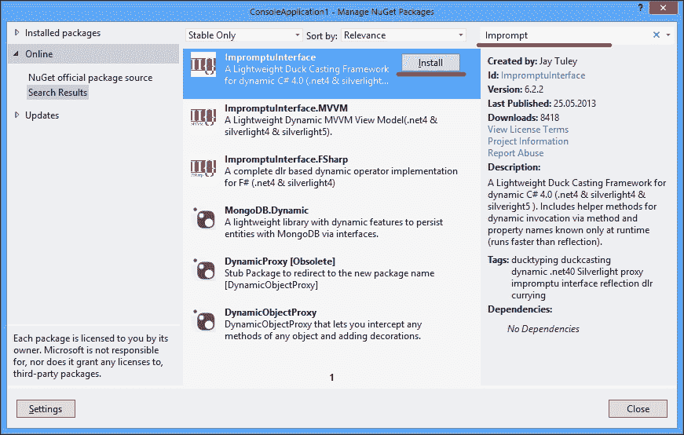

# 第五章使用 C# 5.0

在本章中，我们将介绍 C# 5.0 编程语言中的本机异步编程支持。您将了解以下内容：

*   使用 wait 操作符获取异步任务结果
*   在 lambda 表达式中使用 wait 运算符
*   在后续异步任务中使用 wait 操作符
*   使用 wait 操作符执行并行异步任务
*   异步操作中的异常处理
*   避免使用捕获的同步上下文
*   处理异步 void 方法
*   设计自定义等待类型
*   将动态类型与 wait 一起使用

# 导言

直到现在，我们还了解了 Task Parallel Library，这是微软最新的异步编程基础设施。它允许我们以模块化的方式设计程序，将不同的异步操作组合在一起。

不幸的是，在阅读这样的程序时，仍然很难理解实际的程序流程。在一个大型程序中，会有许多相互依赖的任务和延续，运行其他延续的延续，用于异常处理的延续，它们都集中在程序代码中非常不同的位置。因此，了解哪个操作先进行的顺序以及接下来会发生什么成为一个非常具有挑战性的问题。

另一个需要注意的问题是，是否将正确的同步上下文传播到每个可能接触用户界面控件的异步任务。仅允许从 UI 线程使用这些控件；否则，我们将得到一个多线程访问异常。

说到异常，我们还必须使用单独的继续任务来处理在一个或多个先行异步操作中发生的错误。这反过来会导致复杂的错误处理代码，这些代码通过代码中的不同部分传播，在逻辑上彼此不相关。

为了解决这些问题，C# 5.0 的作者引入了新的语言增强功能，称为**异步函数**。它们确实使异步编程变得简单，但同时，它是对 TPL 的更高级抽象。正如我们在[第 4 章](04.html "Chapter 4. Using Task Parallel Library")中提到的，*使用任务并行库*，抽象隐藏了重要的实现细节，使异步编程更容易，但代价是从程序员那里拿走了许多重要的东西。理解异步函数背后的概念对于创建健壮且可扩展的应用程序非常重要。

要创建一个异步函数，首先用`async`关键字标记一个方法。如果不先这样做，就不可能拥有异步属性或事件访问器方法和构造函数。代码如下所示：

```cs
async Task<string> GetStringAsync()
{
  await Task.Delay(TimeSpan.FromSeconds(2));
  return "Hello, World!";
}
```

另一个重要的事实是异步函数必须返回`Task`或`Task<T>`类型。可以使用`async void`方法，但最好使用`async Task`方法。使用`async void`函数的唯一合理选择是在应用程序中使用顶级 UI 控件事件处理程序。

在标记有`async`关键字的方法中，可以使用`await`操作符。此操作符对来自 TPL 的任务进行操作，并获取任务内部异步操作的结果。细节将在本章后面介绍。您不能在`async`方法之外使用`await`操作符；将出现编译错误。此外，异步函数的代码中至少应有一个`await`运算符。但是，这只会导致编译警告，而不是错误。

需要注意的是，此方法在调用`await`的行之后立即返回。在同步执行的情况下，执行线程将被阻塞 2 秒，然后返回结果。在这里，我们在执行`await`操作符后立即将工作线程返回到线程池时异步等待。2 秒钟后，我们再次从线程池中获取工作线程，并在其上运行异步方法的其余部分。这使我们能够在这 2 秒钟过去的同时重新使用这个工作线程来做一些其他工作，这对于应用程序的可伸缩性非常重要。借助异步函数，我们有一个线性程序控制流，但它仍然是异步的。这既很舒服又很令人困惑。本章中的方法将帮助您了解异步函数的每个重要方面。

### 注

根据我的经验，如果程序中有两个连续的`await`操作符，那么对程序如何工作存在一个常见的误解。许多人认为，如果我们在一个又一个异步操作上使用`await`函数，它们将并行运行。然而，它们实际上是按顺序运行的；第二个仅在第一个操作完成时启动。记住这一点非常重要，在本章后面，我们将详细介绍这一主题。

在 C# 5.0 中使用`async`和`await`有很多限制。例如，不可能将控制台应用程序的`Main`方法标记为`async`；您不能将`await`操作符放在`catch`、`finally`、`lock`或`unsafe`块中。异步函数上不允许有`ref`和`out`参数。有更多的微妙之处，但这些是要点。

异步函数在幕后由 C# 编译器转换为复杂的程序结构。我有意不详细描述这一点；生成的代码与另一个 C# 构造非常相似，称为**迭代器**，并作为一种状态机实现。由于许多开发人员已经开始在几乎所有方法上使用`async`修饰符，因此我想强调，如果一个方法不打算以异步或并行方式使用，那么将其标记为`async`是没有意义的。调用`async`方法会带来显著的性能损失，通常的方法调用速度将比使用`async`关键字标记的相同方法快 40 到 50 倍。请注意这一点。

在本章中，我们将学习使用 C# 5.0`async`和`await`关键字处理异步操作。我们将介绍如何顺序和并行地等待异步操作。我们将讨论如何在 lambda 表达式中使用`await`，如何处理异常，以及在使用`async void`方法时如何避免陷阱。为了结束本章，我们将深入研究同步上下文传播，并学习如何创建我们自己的等待对象，而不是使用任务。

# 使用 wait 操作符获取异步任务结果

本食谱介绍了使用异步函数的基本场景。我们将比较如何使用 TPL 和`await`操作符获得异步操作结果。

## 准备好了吗

要逐步完成此配方，您将需要 Visual Studio 2012。没有其他先决条件。此配方的源代码可在`BookSamples\Chapter5\Recipe1`中找到。

## 怎么做。。。

要使用`await`操作符获取异步任务结果，请执行以下步骤：

1.  启动 Visual Studio 2012。创建一个新的 C#**控制台应用程序**项目。
2.  在`Program.cs`文件中，添加以下`using`指令：

    ```cs
    using System;
    using System.Threading;
    using System.Threading.Tasks;
    ```

3.  在`Main`方法下方添加以下代码片段：

    ```cs
    static Task AsynchronyWithTPL()
    {
      Task<string> t = GetInfoAsync("Task 1");
      Task t2 = t.ContinueWith(task => Console.WriteLine(t.Result), TaskContinuationOptions.NotOnFaulted);
      Task t3 = t.ContinueWith(task => Console.WriteLine(t.Exception.InnerException), TaskContinuationOptions.OnlyOnFaulted);

      return Task.WhenAny(t2, t3);
    }

    async static Task AsynchronyWithAwait()
    {
      try
      {
        string result = await GetInfoAsync("Task 2");
        Console.WriteLine(result);
      }
      catch (Exception ex)
      {
        Console.WriteLine(ex);
      }
    }

    async static Task<string> GetInfoAsync(string name)
    {
      await Task.Delay(TimeSpan.FromSeconds(2));
      //throw new Exception("Boom!");

      return string.Format("Task {0} is running on a thread id{1}. Is thread pool thread: {2}", name,Thread.CurrentThread.ManagedThreadId,Thread.CurrentThread.IsThreadPoolThread);
    }
    ```

4.  在`Main`方法中添加以下代码片段：

    ```cs
    Task t = AsynchronyWithTPL();
    t.Wait();

    t = AsynchronyWithAwait();
    t.Wait();
    ```

5.  运行程序。

## 它是如何工作的。。。

当程序运行时，我们运行两个异步操作。其中一个是标准的 TPL 代码，第二个使用了新的`async`和`await`C# 特性。`AsynchronyWithTPL`方法启动一个运行2 秒的任务，然后返回一个包含工作线程信息的字符串。然后，我们定义一个 continuation 以在操作完成后打印出异步操作结果，另一个 continuation 以在发生错误时打印异常详细信息。最后，我们返回一个代表延续任务之一的任务，并在`Main`方法中等待其完成。

在`AsynchronyWithAwait`方法中，我们将`await`与任务一起使用，获得了相同的结果。这就好像我们只编写普通的同步代码一样——我们从任务中获取结果，打印出结果，如果任务完成时出现错误，则捕获异常。关键的区别在于我们实际上有一个异步程序。在使用`await`之后，C# 立即创建一个任务，该任务包含一个延续任务以及`await`操作符之后的所有剩余代码，并处理异常传播。然后，我们将此任务返回到`Main`方法，并等待它完成。

### 注

请注意，根据底层异步操作的性质和当前同步上下文，执行异步代码的确切方式可能有所不同。我们将在本章后面解释这一点。

因此，我们可以看到程序的第一部分和第二部分在概念上是等价的，但在第二部分中，C# 编译器隐式地处理异步代码。事实上，它甚至比第一部分更复杂，我们将在本章接下来的几个食谱中介绍细节。

请记住，不建议在 Windows GUI 或 ASP.NET 等环境中使用`Task.Wait`和`Task.Result`方法。如果程序员没有 100%意识到代码中到底发生了什么，这可能会导致死锁。当我们在 WPF 应用程序中使用`Task.Result`时，在[第 4 章](04.html "Chapter 4. Using Task Parallel Library")的*使用任务调度器*调整任务执行*使用任务并行库*的配方中说明了这一点。

要测试异常处理是如何工作的，只需取消注释`GetInfoAsync`方法内的`throw new Exception`行即可。

# 在 lambda 表达式中使用 wait 运算符

此配方将展示如何在 lambda 表达式中使用`await`。我们将编写一个使用`await`的匿名方法，并异步获取方法执行的结果。

## 准备好了吗

要逐步完成此步骤，您需要 Visual Studio 2012。没有其他先决条件。此配方的源代码可在`BookSamples\Chapter5\Recipe2`中找到。

## 怎么做。。。

要编写使用`await`的匿名方法，并使用 lambda 表达式中的`await`运算符异步获取方法执行的结果，请执行以下步骤：

1.  启动 Visual Studio 2012。创建一个新的 C#**控制台应用程序**项目。
2.  在`Program.cs`文件中，添加以下`using`指令：

    ```cs
    using System;
    using System.Threading;
    using System.Threading.Tasks;
    ```

3.  在`Main`方法下方添加以下代码片段：

    ```cs
    async static Task AsynchronousProcessing()
    {
      Func<string, Task<string>> asyncLambda = async name => {
        await Task.Delay(TimeSpan.FromSeconds(2));
        return string.Format("Task {0} is running on a threadid {1}. Is thread pool thread: {2}", name,Thread.CurrentThread.ManagedThreadId,Thread.CurrentThread.IsThreadPoolThread);
      };

      string result = await asyncLambda("async lambda");

      Console.WriteLine(result);
    }
    ```

4.  在`Main`方法中添加以下代码片段：

    ```cs
    Task t = AsynchronousProcessing();
    t.Wait();
    ```

5.  运行程序。

## 它是如何工作的。。。

首先，我们将异步函数移出到`AsynchronousProcessing`方法，因为我们不能将`async`与`Main`一起使用。然后，我们使用`async`关键字描述一个 lambda 表达式。由于无法从 lambda 本身推断任何 lambda 表达式的类型，因此我们必须显式地将其类型指定给 C# 编译器。在我们的例子中，类型意味着 lambda 接受一个字符串参数，并返回一个`Task<string>`对象。

然后，我们定义 lambda 表达式体。一个错误是，该方法被定义为返回一个`Task<string>`对象，但我们实际上返回一个字符串，并且没有编译错误！C# 编译器自动生成一个任务并返回给我们。

最后一步是等待异步 lambda 表达式执行并打印结果。

# 在后续异步任务中使用 wait 操作符

当我们在代码中有几个连续的`await`方法时，这个配方将显示程序是如何准确地流动的。我们将学习如何使用`await`方法读取代码，并理解`await`调用为何是异步操作。

## 准备好了吗

要逐步完成此步骤，您需要 Visual Studio 2012。没有其他先决条件。此配方的源代码可在`BookSamples\Chapter5\Recipe3`中找到。

## 怎么做。。。

要理解存在连续`await`方法的程序流，请执行以下步骤：

1.  启动 Visual Studio 2012。创建一个新的 C#**控制台应用程序**项目。
2.  在`Program.cs`文件中，添加以下`using`指令：

    ```cs
    using System;
    using System.Threading;
    using System.Threading.Tasks;
    ```

3.  在`Main`方法下方添加以下代码片段：

    ```cs
    static Task AsynchronyWithTPL()
    {
      var containerTask = new Task(() => { 
        Task<string> t = GetInfoAsync("TPL 1");
        t.ContinueWith(task => {
          Console.WriteLine(t.Result);
          Task<string> t2 = GetInfoAsync("TPL 2");
          t2.ContinueWith(innerTask =>Console.WriteLine(innerTask.Result),TaskContinuationOptions.NotOnFaulted |TaskContinuationOptions.AttachedToParent);
          t2.ContinueWith(innerTask =>Console.WriteLine(innerTask.Exception.InnerException),TaskContinuationOptions.OnlyOnFaulted |TaskContinuationOptions.AttachedToParent);
          },
          TaskContinuationOptions.NotOnFaulted |TaskContinuationOptions.AttachedToParent);

        t.ContinueWith(task =>Console.WriteLine(t.Exception.InnerException),TaskContinuationOptions.OnlyOnFaulted |TaskContinuationOptions.AttachedToParent);
      });

      containerTask.Start();
      return containerTask;
    }

    async static Task AsynchronyWithAwait()
    {
      try
      {
        string result = await GetInfoAsync("Async 1");
        Console.WriteLine(result);
        result = await GetInfoAsync("Async 2");
        Console.WriteLine(result);
      }
      catch (Exception ex)
      {
        Console.WriteLine(ex);
      }
    }

    async static Task<string> GetInfoAsync(string name)
    {
      Console.WriteLine("Task {0} started!", name);
      await Task.Delay(TimeSpan.FromSeconds(2));
      if(name == "TPL 2")
        throw new Exception("Boom!");
      return string.Format("Task {0} is running on a thread id{1}. Is thread pool thread: {2}",name, Thread.CurrentThread.ManagedThreadId,Thread.CurrentThread.IsThreadPoolThread);
    }
    ```

4.  在`Main`方法中添加以下代码片段：

    ```cs
    Task t = AsynchronyWithTPL();
    t.Wait();

    t = AsynchronyWithAwait();
    t.Wait();
    ```

5.  运行程序。

## 它是如何工作的。。。

当程序运行时，我们运行两个异步操作，就像在第一个配方中一样。然而，这次我们将从`AsynchronyWithAwait`方法开始。它看起来仍然像通常的同步代码；唯一的区别是两个`await`语句。最重要的一点是代码仍然是顺序的，`Async 2`任务只有在前一个任务完成后才会启动。当我们阅读代码时，程序流程非常清楚：我们看到什么先运行，然后看到什么。那么，这个程序是如何异步的呢？首先，它并不总是异步的。当我们使用`await`时，如果一个任务已经完成，我们将同步得到它的结果。否则，当我们在代码中看到一个`await`语句时，通常的方法是注意，此时该方法将立即返回，代码的其余部分将在延续任务中运行。因为我们不会阻止等待操作结果的执行，所以这是一个异步调用。当`AsynchronyWithAwait`方法中的代码正在执行时，我们可以执行任何其他任务，而不是在`Main`方法中调用`t.Wait`。但是，主线程必须等待所有异步操作完成，否则它们将在后台线程上运行时停止。

`AsynchronyWithTPL`方法模拟的程序流程与`AsynchronyWithAwait`方法相同。我们需要一个容器任务来同时处理所有相关任务。然后，我们开始主任务，并向其添加一组延续。当任务完成后，我们打印出结果；然后，我们再开始一个任务，在第二个任务完成后，该任务又有更多的继续工作。为了测试异常处理，我们在运行第二个任务时故意抛出一个异常，并将其信息打印出来。这组 continuations 创建了与第一个方法相同的程序流，当我们将其与`await`方法的代码进行比较时，我们可以看到它更易于阅读和理解。唯一的诀窍是记住异步并不总是意味着并行执行。

# 使用 wait 操作符执行并行异步任务执行

在这个配方中，我们将学习如何使用`await`并行运行异步操作，而不是通常的顺序执行。

## 准备好了吗

要逐步完成此步骤，您需要 Visual Studio 2012。没有其他先决条件。此配方的源代码可在`BookSamples\Chapter5\Recipe4`中找到。

## 怎么做。。。

要了解`await`运算符在并行异步任务执行中的用法，请执行以下步骤：

1.  启动 Visual Studio 2012。创建一个新的 C#**控制台应用程序**项目。
2.  在`Program.cs`文件中，添加以下`using`指令：

    ```cs
    using System;
    using System.Threading;
    using System.Threading.Tasks;
    ```

3.  在`Main`方法下方添加以下代码：

    ```cs
    async static Task AsynchronousProcessing()
    {
      Task<string> t1 = GetInfoAsync("Task 1", 3);
      Task<string> t2 = GetInfoAsync("Task 2", 5);

      string[] results = await Task.WhenAll(t1, t2);
      foreach (string result in results)
      {
        Console.WriteLine(result);
      }
    }

    async static Task<string> GetInfoAsync(string name, int seconds)
    {
      await Task.Delay(TimeSpan.FromSeconds(seconds));
      /*await Task.Run(() =>Thread.Sleep(TimeSpan.FromSeconds(seconds)));*/
      return string.Format("Task {0} is running on a thread id{1}. Is thread pool thread: {2}", name,Thread.CurrentThread.ManagedThreadId,Thread.CurrentThread.IsThreadPoolThread);
    }
    ```

4.  在`Main`方法中添加以下代码片段：

    ```cs
    Task t = AsynchronousProcessing();
    t.Wait();
    ```

5.  运行程序。

## 它是如何工作的。。。

这里我们定义了两个分别运行 3 秒和 5 秒的异步任务。然后，我们使用`Task.WhenAll`助手方法创建另一个任务，该任务仅在所有底层任务完成时才能完成。然后，我们等待这项联合任务的结果。5 秒后，我们得到所有结果，这意味着任务同时运行。

然而，有一个有趣的观察结果。当您运行该程序时，您可能会注意到两个任务都可能由线程池中的同一个工作线程提供服务。当我们并行运行这些任务时，这怎么可能呢？为了让事情变得更有趣，让我们注释掉`GetIntroAsync`方法中的`await Task.Delay`行，取消注释`await Task.Run`行，然后运行程序。

我们将看到，在这种情况下，这两个任务都将由不同的工作线程提供服务。不同之处在于`Task.Delay`在引擎盖下使用计时器，处理过程如下：我们从线程池中获取工作线程，它等待`Task.Delay`方法返回结果。然后，`Task.Delay`方法启动计时器，并指定一段代码，当计时器计算为`Task.Delay`方法指定的秒数时，该代码将被调用。然后我们立即将工作线程返回到线程池。当计时器事件运行时，我们再次从线程池中获取任何可用的工作线程（可能是我们第一次使用的同一个线程），并在其上运行提供给计时器的代码。

当我们使用`Task.Run`方法时，我们从线程池中获取一个工作线程，并将其阻塞数秒，这是`Thread.Sleep`方法提供的。然后，我们得到第二个工作线程并将其阻塞。在这个场景中，我们使用两个工作线程，它们什么也不做，在等待时无法执行任何其他任务。

我们将在[第 9 章](09.html "Chapter 9. Using Asynchronous I/O")*中详细讨论使用异步 I/O*的第一个场景，其中我们将讨论一组处理数据输入和输出的大型异步操作。尽可能使用第一种方法是创建可伸缩服务器应用程序的关键。

# 异步操作中异常的处理

此配方将描述如何使用 C# 中的异步函数处理异常。我们将学习如何处理聚合异常，以防将`await`用于多个并行异步操作。

## 准备好了吗

要逐步完成此步骤，您需要 Visual Studio 2012。没有其他先决条件。此配方的源代码可在`BookSamples\Chapter5\Recipe5`中找到。

## 怎么做。。。

要了解异步操作中异常的处理，请执行以下步骤：

1.  启动 Visual Studio 2012。创建一个新的 C#**控制台应用程序**项目。
2.  在`Program.cs`文件中，添加以下`using`指令：

    ```cs
    using System;
    using System.Threading;
    using System.Threading.Tasks;
    ```

3.  在`Main`方法下方添加以下代码片段：

    ```cs
    async static Task AsynchronousProcessing()
    {
      Console.WriteLine("1\. Single exception");

      try
      {
        string result = await GetInfoAsync("Task 1", 2);
        Console.WriteLine(result);
      }
      catch (Exception ex)
      {
        Console.WriteLine("Exception details: {0}", ex);
      }

      Console.WriteLine();
      Console.WriteLine("2\. Multiple exceptions");

      Task<string> t1 = GetInfoAsync("Task 1", 3);
      Task<string> t2 = GetInfoAsync("Task 2", 2);
      try
      {
        string[] results = await Task.WhenAll(t1, t2);
        Console.WriteLine(results.Length);
      }
      catch (Exception ex)
      {
        Console.WriteLine("Exception details: {0}", ex);
      }

      Console.WriteLine();
      Console.WriteLine("2\. Multiple exceptions with AggregateException");

      t1 = GetInfoAsync("Task 1", 3);
      t2 = GetInfoAsync("Task 2", 2);
      Task<string[]> t3 = Task.WhenAll(t1, t2);
      try
      {
        string[] results = await t3;
        Console.WriteLine(results.Length);
      }
      catch
      {
        var ae = t3.Exception.Flatten();
        var exceptions = ae.InnerExceptions;
        Console.WriteLine("Exceptions caught: {0}", exceptions.Count);
        foreach (var e in exceptions)
        {
          Console.WriteLine("Exception details: {0}", e);
          Console.WriteLine();
        }
      }
    }

    async static Task<string> GetInfoAsync(string name, int seconds)
    {
      await Task.Delay(TimeSpan.FromSeconds(seconds));
      throw new Exception(string.Format("Boom from {0}!", name));
    }
    ```

4.  在`Main`方法中添加以下代码片段：

    ```cs
    Task t = AsynchronousProcessing();
    t.Wait();
    ```

5.  运行程序。

## 它是如何工作的。。。

我们运行三个场景来说明在 C# 中使用`async`和`await`进行错误处理的最常见情况。第一种情况非常简单，与通常的同步代码几乎相同。我们只需使用`try`/`catch`语句并获取异常的详细信息。

一个非常常见的错误是在等待多个异步操作时使用相同的方法。如果我们像以前一样使用`catch`块，我们将只从底层`AggregateException`对象获得第一个异常。

要收集所有信息，我们必须使用等待任务的`Exception`属性。在第三个场景中，我们展平`AggregateException`层次结构，然后使用`AggregateException`的`Flatten`方法从中展开所有底层异常。

# 避免使用捕获的同步上下文

本食谱讲述了当使用`await`获取异步操作结果时，同步上下文行为的细节。我们将学习如何以及何时关闭同步上下文流。

## 准备好了吗

要逐步完成此步骤，您需要 Visual Studio 2012。没有其他先决条件。此配方的源代码可在`BookSamples\Chapter5\Recipe6`中找到。

## 怎么做。。。

要了解使用`await`时同步上下文行为的详细信息，并了解如何以及何时关闭同步上下文流，请执行以下步骤：

1.  启动 Visual Studio 2012。创建一个新的 C#**控制台应用程序**项目。
2.  Add references to Windows Presentation Foundation Library.
    1.  右键点击项目中的**参考**文件夹，选择**添加参考…**菜单选项。
    2.  添加对以下库的引用：**PresentationCore**、**PresentationFramework**、**System.Xaml**和**Windows.Base**。您可以在“引用管理器”对话框中使用搜索功能，如下所示：

    

3.  在的`Program.cs`文件中，添加以下`using`指令：

    ```cs
    using System;
    using System.Diagnostics;
    using System.Text;
    using System.Threading.Tasks;
    using System.Windows;
    using System.Windows.Controls;
    ```

4.  在`Main`方法下方添加以下代码片段：

    ```cs
    private static Label _label;

    async static void Click(object sender, EventArgs e)
    {
      _label.Content = new TextBlock {Text = "Calculating..."};
      TimeSpan resultWithContext = await Test();
      TimeSpan resultNoContext = await TestNoContext();
      /*TimeSpan resultNoContext = awaitTestNoContext().ConfigureAwait(false);*/
      var sb = new StringBuilder();
      sb.AppendLine(string.Format("With the context: {0}",resultWithContext));
      sb.AppendLine(string.Format("Without the context: {0}",resultNoContext));
      sb.AppendLine(string.Format("Ratio: {0:0.00}",resultWithContext.TotalMilliseconds/resultNoContext.TotalMilliseconds));
      _label.Content = new TextBlock {Text = sb.ToString()};
    }

    async static Task<TimeSpan> Test()
    {
      const int iterationsNumber = 100000;
      var sw = new Stopwatch();
      sw.Start();
      for (int i = 0; i < iterationsNumber; i++)
      {
        var t = Task.Run(() => { });
        await t;
      }
      sw.Stop();
      return sw.Elapsed;
    }

    async static Task<TimeSpan> TestNoContext()
    {
      const int iterationsNumber = 100000;
      var sw = new Stopwatch();
      sw.Start();
      for (int i = 0; i < iterationsNumber; i++)
      {
        var t = Task.Run(() => { });
        await t.ConfigureAwait(continueOnCapturedContext: false);
      }
      sw.Stop();
      return sw.Elapsed;
    }
    ```

5.  用以下代码片段替换方法`Main`：

    ```cs
    [STAThread]
    static void Main(string[] args)
    {
      var app = new Application();
      var win = new Window();
      var panel = new StackPanel();
      var button = new Button();
      _label = new Label();
      _label.FontSize = 32;
      _label.Height = 200;
      button.Height = 100;
      button.FontSize = 32;
      button.Content = new TextBlock {Text = "Start asynchronous operations"};
      button.Click += Click;
      panel.Children.Add(_label);
      panel.Children.Add(button);
      win.Content = panel;
      app.Run(win);

      Console.ReadLine();
    }
    ```

6.  运行程序。

## 它是如何工作的。。。

在本例中，我们将研究异步函数默认行为的一个最重要方面。我们已经从[第 4 章](04.html "Chapter 4. Using Task Parallel Library")、*使用任务并行库*了解了任务调度器和同步上下文。默认情况下，`await`操作符尝试捕获同步上下文，并在其上执行以下代码。正如我们已经知道的，这有助于我们通过使用用户界面控件来编写异步代码。此外，在使用`await`时，不会出现上一章中描述的死锁情况，因为我们在等待结果时不会阻塞 UI 线程。

这是合理的，但让我们看看可能会发生什么。在本示例中，我们以编程方式创建 Windows 演示基础应用程序并订阅其按钮单击事件。单击按钮时，我们运行两个异步操作。其中一个使用常规的`await`操作符，另一个使用`ConfigureAwait`方法，其中`false`作为参数值。它明确指示我们不应使用捕获的同步上下文在其上运行延续代码。在每个操作中，我们测量它们完成所需的时间，然后在主屏幕上显示相应的时间和比率。

因此，我们看到常规的`await`操作符需要更多的时间来完成。这是因为我们在 UI 线程上发布了十万个延续任务，它使用其消息循环异步处理这些任务。在这种情况下，我们不需要在 UI 线程上运行此代码，因为我们不从异步操作访问 UI 组件；使用`ConfigureAwait`和`false`将是一个更有效的解决方案。

还有一件事值得注意。只需单击按钮并等待结果，即可尝试运行该程序。现在再次执行相同的操作，但这次单击按钮并尝试以随机方式将应用程序窗口从一侧拖动到另一侧。您会注意到，捕获的同步上下文上的代码会变慢！这个有趣的副作用完美地说明了异步编程是多么危险。这种情况很容易发生，如果您以前从未经历过这样的行为，那么调试几乎是不可能的。

公平地说，让我们看看相反的情况。在前面的代码片段中，在`Click`方法中，取消注释注释了注释的行并注释了它的前一行。在运行应用程序时，我们将得到一个多线程控制访问异常，因为设置`Label`控制文本的代码不会发布到捕获的上下文上，而是在线程池工作线程上执行。

# 围绕异步 void 方法工作

这个食谱描述了为什么`async void`方法使用起来非常危险。我们将学习在什么情况下使用这种方法是可以接受的，以及在可能的情况下使用什么来代替。

## 准备好了吗

要逐步完成此步骤，您需要 Visual Studio 2012。没有其他先决条件。此配方的源代码可在`BookSamples\Chapter5\Recipe7`中找到。

## 怎么做。。。

要了解如何使用`async void`方法，请执行以下步骤：

1.  启动 Visual Studio 2012。创建一个新的 C#**控制台应用程序**项目。
2.  在`Program.cs`文件中，添加以下`using`指令：

    ```cs
    using System;
    using System.Threading;
    using System.Threading.Tasks;
    ```

3.  在`Main`方法下方添加以下代码片段：

    ```cs
    async static Task AsyncTaskWithErrors()
    {
      string result = await GetInfoAsync("AsyncTaskException",2);
      Console.WriteLine(result);
    }

    async static void AsyncVoidWithErrors()
    {
      string result = await GetInfoAsync("AsyncVoidException",2);
      Console.WriteLine(result);
    }

    async static Task AsyncTask()
    {
      string result = await GetInfoAsync("AsyncTask", 2);
      Console.WriteLine(result);
    }

    private static async void AsyncVoid()
    {
      string result = await GetInfoAsync("AsyncVoid", 2);
      Console.WriteLine(result);
    }

    async static Task<string> GetInfoAsync(string name,int seconds)
    {
      await Task.Delay(TimeSpan.FromSeconds(seconds));
      if(name.Contains("Exception"))
        throw new Exception(string.Format("Boom from {0}!",name));
      return string.Format("Task {0} is running on a thread id{1}. Is thread pool thread: {2}", name,Thread.CurrentThread.ManagedThreadId,Thread.CurrentThread.IsThreadPoolThread);
    }
    ```

4.  在`Main`方法中添加以下代码片段：

    ```cs
    Task t = AsyncTask();
    t.Wait();

    AsyncVoid();
    Thread.Sleep(TimeSpan.FromSeconds(3));

    t = AsyncTaskWithErrors();
    while(!t.IsFaulted)
    {
      Thread.Sleep(TimeSpan.FromSeconds(1));
    }
    Console.WriteLine(t.Exception);

    //try
    //{
    //  AsyncVoidWithErrors();
    //  Thread.Sleep(TimeSpan.FromSeconds(3));
    //}
    //catch (Exception ex)
    //{
    //  Console.WriteLine(ex);
    //}

    //int[] numbers = new[] {1, 2, 3, 4, 5};
    //Array.ForEach(numbers, async number => {
    //  await Task.Delay(TimeSpan.FromSeconds(1));
    //  if (number == 3) throw new Exception("Boom!");
    //  Console.WriteLine(number);
    //});

    Console.ReadLine();
    ```

5.  运行程序。

## 它是如何工作的。。。

当程序启动时，我们通过调用两个方法`AsyncTask`和`AsyncVoid`来启动两个异步操作。第一个方法返回一个`Task`对象，而另一个方法由于声明为`async void`而不返回任何内容。它们都会立即返回，因为它们是异步的，但是第一个任务可以通过返回的任务状态轻松监控，或者只需对其调用`Wait`方法即可。等待第二个方法完成的唯一方法是真正地等待一段时间，因为我们没有声明任何可以用来监视异步操作状态的对象。当然，可以使用某种共享状态变量并从`async void`方法设置，同时从`calling`方法检查，但最好只返回一个`Task`对象。

最危险的部分是异常处理。如果是`async void`方法，异常处理方法将被发布到当前同步上下文中；在我们的例子中，是一个线程池。线程池上未处理的异常将终止整个进程。可以使用`AppDomain.UnhandledException`事件截获未处理的异常，但无法从中恢复进程。要体验这一点，我们应该取消注释`Main`方法中的`try`/`catch`块，然后运行程序。

关于使用`async void`lambda 表达式的另一个事实是：它们与`Action`类型兼容，后者在标准.NET Framework 类库中被广泛使用。很容易忘记这个 lambda 内部的异常处理，这将再次导致程序崩溃。要查看此示例，请取消注释`Main`方法内的第二个注释掉的块。

我强烈建议只在 UI 事件处理程序中使用`async void`。在所有其他情况下，请使用返回`Task`的方法。

# 设计定制等待型

这个配方展示了如何设计一个与`await`操作符兼容的非常基本的等待类型。

## 准备好了吗

要逐步完成此步骤，您需要 Visual Studio 2012。没有其他先决条件。此配方的源代码可在`BookSamples\Chapter5\Recipe8`中找到。

## 怎么做。。。

要设计自定义等待类型，请执行以下步骤：

1.  启动 Visual Studio 2012。创建一个新的 C#**控制台应用程序**项目。
2.  在`Program.cs`文件中，添加以下`using`指令：

    ```cs
    using System;
    using System.Runtime.CompilerServices;
    using System.Threading;
    using System.Threading.Tasks;
    ```

3.  在`Main`方法下方添加以下代码片段：

    ```cs
    async static Task AsynchronousProcessing()
    {
      var sync = new CustomAwaitable(true);
      string result = await sync;
      Console.WriteLine(result);

      var async = new CustomAwaitable(false);
      result = await async;

      Console.WriteLine(result);
    }

    class CustomAwaitable
    {
      public CustomAwaitable(bool completeSynchronously)
      {
        _completeSynchronously = completeSynchronously;
      }

      public CustomAwaiter GetAwaiter()
      {
        return new CustomAwaiter(_completeSynchronously);
      }

      private readonly bool _completeSynchronously;
    }

    class CustomAwaiter : INotifyCompletion
    {
      private string _result = "Completed synchronously";
      private readonly bool _completeSynchronously;

      public bool IsCompleted { get {return _completeSynchronously; } }

      public CustomAwaiter(bool completeSynchronously)
      {
        _completeSynchronously = completeSynchronously;
      }

      public string GetResult()
      {
        return _result;
      }

      public void OnCompleted(Action continuation)
      {
        ThreadPool.QueueUserWorkItem( state => {
          Thread.Sleep(TimeSpan.FromSeconds(1));
          _result = GetInfo();
          if(continuation != null) continuation();
        });
      }

      private string GetInfo()
      {
        return string.Format("Task is running on a thread id{0}. Is thread pool thread: {1}", name,Thread.CurrentThread.ManagedThreadId,Thread.CurrentThread.IsThreadPoolThread);
      }
    }
    ```

4.  在`Main`方法中添加以下代码片段：

    ```cs
    Task t = AsynchronousProcessing();
    t.Wait();
    ```

5.  运行程序。

## 它是如何工作的。。。

为使与`await`操作员兼容，类型应符合 C# 5.0 规范中规定的多项要求。如果安装了 Visual Studio 2012，您可能会在`C:\Program Files\Microsoft Visual Studio 11.0\VC# \Specifications\1033`文件夹中找到规范文档（假设您使用了默认安装路径）。

在第 7.7.7.1 段中，我们找到了等待表达式的定义：

*等待表达式的任务要求是可等待的。如果满足以下条件之一，则表达式 t 是可等待的：*

*   *t 为编译时类型动态*
*   *t 有一个可访问的实例或扩展方法，名为 GetAwaiter，没有参数，也没有类型参数，返回类型 a，以下所有条件都适用：*
    *   *A 实现接口 System.Runtime.CompilerServices.INotifyCompletion（以下简称为 INotifyCompletion，简称为 INotifyCompletion）*
    *   *A 具有类型为 bool*的可访问、可读的实例属性 IsCompleted
    *   *A 有一个可访问的实例方法 GetResult，没有参数，也没有类型参数*

这些信息足以开始。首先，我们定义一个等待类型`CustomAwaitable`并实现`GetAwaiter`方法，该方法反过来返回一个`CustomAwaiter`类型的实例。`CustomAwaiter`实现`INotifyCompletion`接口；具有类型为`bool`的`IsCompleted`属性，具有返回类型为`string`的`GetResult`方法。最后，我们编写一段代码，创建两个`CustomAwaitable`对象并等待它们。

现在我们应该了解`await`表达式的计算方式。这一次，没有引用规范，以避免不必要的细节。基本上，如果`IsCompleted`属性返回`true`，我们就同步调用`GetResult`方法。如果操作已经完成，这将阻止我们为异步任务执行分配资源。我们通过向`CustomAwaitable`对象的构造函数方法提供`completeSynchronously`参数来涵盖此场景。

否则，我们向`CustomAwaiter`的`OnCompleted`方法注册一个回调操作，并启动异步操作。当它完成时，调用提供的回调，回调将通过调用`CustomAwaiter`对象上的`GetResult`方法得到结果。

### 注

此实现仅用于教育目的。无论何时编写异步函数，最自然的方法是使用标准的`Task`类型。只有当你有充分的理由不能使用`Task`，并且你确切知道自己在做什么时，你才应该定义自己的等待类型。

还有许多其他与设计定制等待类型相关的主题，例如`ICriticalNotifyCompletion`接口实现和同步上下文传播。在了解了等待类型的基本设计之后，您将能够使用 C 语言规范和其他信息源轻松找到所需的细节。但我想强调的是，你只需要使用`Task`类型，除非你有很好的理由不这样做。

# 使用带有等待的动态类型

这个配方展示了如何设计一个与`await`操作符和动态 C# type 兼容的非常基本的类型。

## 准备好了吗

要逐步完成此步骤，您需要 Visual Studio 2012。您需要访问 Internet 才能下载 NuGet 软件包。没有其他先决条件。此配方的源代码可在`BookSamples\Chapter5\Recipe9`中找到。

## 怎么做。。。

要了解如何将`dynamic`类型与`await`一起使用，请执行以下步骤：

1.  启动 Visual Studio 2012。创建一个新的 C#**控制台应用程序**项目。
2.  Add references to the **ImpromptuInterface** NuGet package by following these steps:
    1.  右键点击项目中的**参考**文件夹，选择 Manage NuGet Packages…（管理 NuGet 软件包…）菜单选项。
    2.  现在将您的首选引用添加到**ImpromptuInterface NuGet**包中。您可以在**管理 NuGet 软件包**对话框中使用搜索功能，如下所示：

    

3.  在`Program.cs`文件中，使用以下`using`指令：

    ```cs
    using System;
    using System.Dynamic;
    using System.Runtime.CompilerServices;
    using System.Threading;
    using System.Threading.Tasks;
    using ImpromptuInterface;
    ```

4.  在`Main`方法下方添加以下代码段：

    ```cs
    async static Task AsynchronousProcessing()
    {
      string result = await GetDynamicAwaitableObject(true);
      Console.WriteLine(result);

      result = await GetDynamicAwaitableObject(false);
      Console.WriteLine(result);
    }

    static dynamic GetDynamicAwaitableObject(bool completeSynchronously)
    {
      dynamic result = new ExpandoObject();
      dynamic awaiter = new ExpandoObject();

      awaiter.Message = "Completed synchronously";
      awaiter.IsCompleted = completeSynchronously;
      awaiter.GetResult = (Func<string>)(() => awaiter.Message);

      awaiter.OnCompleted = (Action<Action>) ( callback => 
        ThreadPool.QueueUserWorkItem(state => {
          Thread.Sleep(TimeSpan.FromSeconds(1));
          awaiter.Message = GetInfo();
          if (callback != null) callback();
        })
      );

      IAwaiter<string> proxy = Impromptu.ActLike(awaiter);

      result.GetAwaiter = (Func<dynamic>) ( () => proxy );

      return result;
    }

    static string GetInfo()
    {
      return string.Format("Task is running on a thread id {0}. Is thread pool thread: {1}",
          Thread.CurrentThread.ManagedThreadId, Thread.CurrentThread.IsThreadPoolThread);
    }

    public interface IAwaiter<T> : INotifyCompletion
    {
    bool IsCompleted { get; }

    T GetResult();
    }
    ```

5.  在`Main`方法中添加以下代码片段：

    ```cs
    Task t = AsynchronousProcessing();
    t.Wait();
    ```

6.  运行程序。

## 它是如何工作的。。。

在这里，我们重复前面配方中的技巧，但这次是借助动态表达式。我们可以在 NuGet 的帮助下实现这一目标，NuGet 是一个包含许多有用库的包管理器。这一次，我们将使用一个动态创建包装器的库，实现我们需要的接口。

首先，我们创建两个`ExpandoObject`类型的实例，并将它们分配给动态局部变量。这些变量将成为我们的等待对象和等待对象。因为等待对象只需要有`GetAwaiter`方法，所以提供它没有问题。`ExpandoObject`与`dynamic`关键字相结合，允许我们对其进行定制，通过分配相应的值来添加属性和方法。实际上，它是一个字典类型集合，具有类型为`string`的键和类型为`object`的值。如果您熟悉 JavaScript 编程语言，您可能会注意到这与 JavaScript 对象非常相似。

由于`dynamic`允许我们跳过 C# 中的编译时检查，`ExpandoObject`的编写方式是，如果将某个内容分配给属性，它将创建一个字典条目，其中键是属性名称，值是提供的任何值。当您尝试获取属性值时，它会进入字典并提供存储在相应字典条目中的值。如果值的类型为`Action`或`Func`，我们实际上存储了一个委托，而委托又可以像方法一样使用。因此，`dynamic`类型与`ExpandoObject`的组合允许我们创建一个对象，并为其动态提供属性和方法。

现在，我们需要构造等待者和等待对象。让我们从等待者开始。首先，我们提供一个名为`Message`的属性和该属性的初始值。然后，我们定义了`GetResult`方法，通过使用`Func<string>`类型，我们分配一个 lambda 表达式，该表达式返回`Message`属性值。接下来我们实现`IsCompleted`属性。如果设置为`true`，我们可以跳过剩余的工作，继续处理存储在`result`局部变量中的等待对象。我们只需要添加一个返回`dynamic`对象的方法，并从中返回我们的等待者。然后，我们可以使用`result`作为等待表达式；但是，它将同步运行。

主要的挑战是在动态对象上实现异步处理。C 语言规范规定等待者必须实现`INotifyCompletion`或`ICriticalNotifyCompletion`接口，而`ExpandoObject`没有实现。即使我们动态地实现`OnCompleted`方法，将其添加到 waiter 对象中，我们也不会成功，因为我们的对象没有实现上述任何一个接口。

为了解决这个问题，我们使用了从 NuGet 获得的`ImpromptuInterface`库。它允许我们使用`Impromptu.ActLike`方法动态创建将实现所需接口的代理对象。如果我们尝试创建一个实现`INotifyCompletion`接口的代理，我们仍然会失败，因为代理对象不再是动态的，并且这个接口只有`OnCompleted`方法，但没有`IsCompleted`属性或`GetResult`方法。作为最后一种解决方法，我们定义了一个通用接口`IAwaiter<T>`，它实现了`INotifyCompletion`，并添加了所有必需的属性和方法。现在，我们使用它来生成代理，并将`result`对象更改为返回代理，而不是从`GetAwaiter`方法返回 waiter。该计划现在起作用了；我们刚刚构造了一个在运行时完全动态的等待对象。