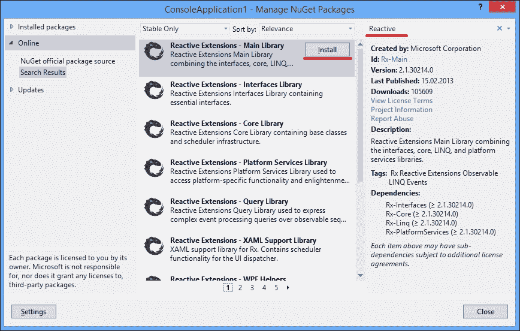

# 八、反应式扩展

在本章中，我们将看到另一个有趣的.NET 库，它帮助我们创建异步程序，即反应式扩展（或 Rx）。您将学习以下食谱：

*   将集合转换为异步`Observable`
*   书写习惯`Observable`
*   使用`Subjects`
*   创建一个`Observables`对象
*   对`Observable`集合使用 LINQ 查询
*   使用 Rx 创建异步操作

# 导言

正如我们已经了解到的，有几种方法可以在.NET 和 C# 中创建异步程序。其中之一是基于事件的异步模式，这在前面的章节中已经提到过。引入事件的最初目标是简化`Observer`设计模式的实现。此模式通常用于在对象之间实现通知。

当我们讨论任务并行库时，我们注意到事件的主要缺点是它们不能有效地相互组合。另一个缺点是基于事件的异步模式不应用于处理通知序列。假设我们有`IEnumerable<string>`，它给了我们字符串值。然而，当我们迭代它时，我们不知道一次迭代需要多少时间。它可能很慢，如果我们使用常规的`foreach`或其他同步迭代构造，我们将阻塞线程，直到得到下一个值。这种情况被称为基于**拉动的**方法，当我们作为客户从生产者那里拉动价值时。

相反的方法是当生产者通知客户端新值时基于推送的**方法**。这允许将工作转移给制作人，而客户可以在等待另一个值的时间内自由地做任何其他事情。因此，我们的目标是获得类似于异步版本的`IEnumerable`，它生成一个值序列，并在序列完成或抛出异常时通知消费者序列中的每个项目。

从版本 4.0 开始的.NET Framework 包含接口`IObservable<out T>`和`IObserver<in T>`的定义，它们共同表示基于异步推送的集合及其客户端。它们来自一个称为反应式扩展（或简称 Rx）的库，该库是在 Microsoft 内部创建的，用于帮助有效地组合事件序列，实际上是使用可观察集合的所有其他类型的异步程序。这些接口包含在.Net Framework 中，但它们的实现和所有其他机制仍然单独分布在 Rx 库中。

### 注

被动扩展首先是一个跨平台库。有用于.NET 3.5、Silverlight 和 Windows Phone 的库。它还有 JavaScript、Ruby 和 Python 版本。它也是开源的；您可以在 CodePlex 网站上找到.NET 的反应式扩展源代码，也可以在 GitHub 上找到其他实现。

最令人惊奇的是，可观察集合与 LINQ 兼容，因此，我们能够使用声明性查询以异步方式转换和组合这些集合。这也使得使用扩展方法向 Rx 程序添加功能成为可能，与通常 LINQ 提供程序中使用的方法相同。反应式扩展还支持从所有异步编程模式（包括异步编程模型、基于事件的异步模式和任务并行库）到可观察集合的转换，并且它支持自己运行异步操作的方式，这与 TPL 非常相似。

反应式扩展库是一个非常强大和复杂的工具，值得单独编写一本书。在本章中，我将回顾最有用的场景，即如何有效地处理异步事件序列。我们将观察反应式扩展框架的关键类型，学习创建序列并以不同的方式操作它们，最后，检查如何使用反应式扩展来运行异步操作并管理它们的选项。

# 将集合转换为异步可观测

本食谱介绍了如何从`Enumerable`类创建一个可观察的集合，以及如何异步处理。

## 准备好了吗

要逐步完成此步骤，您需要 Visual Studio 2012。不需要其他先决条件。此配方的源代码可在`BookSamples\Chapter8\Recipe1`中找到。

## 怎么做。。。

要了解如何从`Enumerable`类创建可观察集合并异步处理它，请执行以下步骤：

1.  启动 Visual Studio 2012。创建一个新的 C#**控制台应用程序**项目。
2.  Add reference to the **Reactive Extensions Main Library** NuGet package.
    1.  右键点击项目中的**参考**文件夹，选择**管理 NuGet Packages…**菜单选项。
    2.  现在将您的首选引用添加到**被动扩展-主库**NuGet 包中。您可以在**管理 NuGet 软件包**对话框中使用搜索，如下图所示：

    

3.  在的`Program.cs`文件中，添加以下`using`指令：

    ```cs
    using System;
    using System.Collections.Generic;
    using System.Reactive.Concurrency;
    using System.Reactive.Linq;
    using System.Threading;
    ```

4.  在`Main`方法下方添加以下代码片段：

    ```cs
    static IEnumerable<int> EnumerableEventSequence()
    {
      for (int i = 0; i < 10; i++)
      {
        Thread.Sleep(TimeSpan.FromSeconds(0.5));
        yield return i;
      }
    }
    ```

5.  在`Main`方法中添加以下代码片段：

    ```cs
    foreach (int i in EnumerableEventSequence())
    {
      Console.Write(i);
    }
    Console.WriteLine();
    Console.WriteLine("IEnumerable");

    IObservable<int> o = EnumerableEventSequence().ToObservable();
    using (IDisposable subscription = o.Subscribe(Console.Write))
    {
      Console.WriteLine();
      Console.WriteLine("IObservable");
    }

    o = EnumerableEventSequence().ToObservable().SubscribeOn(TaskPoolScheduler.Default);
    using (IDisposable subscription = o.Subscribe(Console.Write))
    {
      Console.WriteLine();
      Console.WriteLine("IObservable async");
      Console.ReadLine();
    }
    ```

6.  运行程序。

## 它是如何工作的。。。

我们使用`EnumerableEventSequence`方法模拟一个缓慢的可枚举集合。然后我们在通常的`foreach`循环中迭代它，我们可以看到它实际上很慢；我们等待每个迭代完成。

然后，借助反应式扩展库中的`ToObservable`扩展方法，我们将此可枚举集合转换为`Observable`。接下来，我们订阅这个可观察集合的更新，提供`Console.Write`方法作为操作，该操作将在集合的每次更新时执行。结果，我们得到了与以前完全相同的行为；我们等待每个迭代完成，因为我们使用主线程订阅更新。

### 注

我们将订阅对象包装成 using 语句。尽管并不总是必要的，但处理订阅是一种很好的做法，可以避免与生命周期相关的 bug。

为了使程序异步，我们使用为其提供 TPL 任务池调度器的`SubscribeOn`方法。此调度程序将把订阅放到 TPL 任务池中，从而从主线程卸载工作。这允许我们在集合更新时保持 UI 的响应性并执行其他操作。要检查此行为，可以从代码中删除最后一个`Console.ReadLine`调用。执行此操作时，我们立即完成主线程，这将强制所有后台线程（包括 TPL 任务池工作线程）也结束，并且我们将不会从异步集合中获得任何输出。

如果我们正在使用任何 UI 框架，我们必须仅从 UI 线程内与 UI 控件交互。为了实现这一点，我们应该使用`ObserveOn`方法和相应的调度器。对于 Windows 演示基础，我们有一个单独的 NuGET 包名为 RX XAML，或反应扩展 XAML 支持库中定义的 AUT1 T1 类和 AUT2 T2 扩展方法。对于其他平台，也有相应的单独 NuGet 包。

# 书写习惯可观察

本配方将描述如何实现`IObservable<in T>`和`IObserver<out T>`接口，以获得定制的可观察序列并正确使用它。

## 准备好了吗

要逐步完成此步骤，您需要 Visual Studio 2012。不需要其他先决条件。此配方的源代码可在`BookSamples\Chapter8\Recipe2`中找到。

## 怎么做。。。

为了理解实现`IObservable<in T>`和`IObserver<out T>`接口以获取自定义可观察序列并使用它，请执行以下步骤：

1.  启动 Visual Studio 2012。创建一个新的 C#**控制台应用程序**项目。
2.  添加对**被动扩展主库**NuGet 包的引用。请参阅*将集合转换为异步可观测*配方，了解如何执行此操作的详细信息。
3.  在`Program.cs`文件中，添加以下`using`指令：

    ```cs
    using System;
    using System.Collections.Generic;
    using System.Reactive.Concurrency;
    using System.Reactive.Disposables;
    using System.Reactive.Linq;
    using System.Threading;
    ```

4.  在`Main`方法下方添加以下代码片段：

    ```cs
    class CustomObserver : IObserver<int>
    {
      public void OnNext(int value)
      {
        Console.WriteLine("Next value: {0}; Thread Id: {1}", value, Thread.CurrentThread.ManagedThreadId);
      }

      public void OnError(Exception error)
      {
        Console.WriteLine("Error: {0}", error.Message);
      }

      public void OnCompleted()
      {
        Console.WriteLine("Completed");
      }
    }

    class CustomSequence : IObservable<int>
    {
      private readonly IEnumerable<int> _numbers;

      public CustomSequence(IEnumerable<int> numbers)
      {
        _numbers = numbers;
      }
      public IDisposable Subscribe(IObserver<int> observer)
      {
        foreach (var number in _numbers)
        {
          observer.OnNext(number);
        }
        observer.OnCompleted();
        return Disposable.Empty;
      }
    }
    ```

5.  在`Main`方法中添加以下代码片段：

    ```cs
    var observer = new CustomObserver();

    var goodObservable = new CustomSequence(new[] {1, 2, 3, 4, 5});
    var badObservable = new CustomSequence(null);

    using (IDisposable subscription = goodObservable.Subscribe(observer))
    {
    }

    using (IDisposable subscription = goodObservable.SubscribeOn(TaskPoolScheduler.Default).Subscribe(observer))
    {
      Thread.Sleep(100);
    }

    using (IDisposable subscription = badObservable.SubscribeOn(TaskPoolScheduler.Default).Subscribe(observer))
    {
      Console.ReadLine();
    }
    ```

6.  运行程序。

## 它是如何工作的。。。

在这里，我们首先实现我们的观察者，只需将可观察集合、错误或序列完成中的下一项信息打印到控制台。这是一个非常简单的消费者代码，没有什么特别之处。

有趣的部分是我们的可观察集合实现。我们接受将数字枚举到构造函数中，而不是故意检查它是否为 null。当我们有一个订阅的观察者时，我们迭代这个集合并通知观察者枚举中的每个项目。

然后我们演示实际订阅。可以看到，异步是通过调用`SubscribeOn`方法实现的，该方法是`IObservable`的扩展方法，包含异步订阅逻辑。我们不关心可观察集合中的异步性；我们使用反应式扩展库中的标准实现。

当我们订阅正常的可观察集合时，我们只是从中获取所有项目。它现在是异步的，因此我们需要等待一段时间，等待异步操作完成，然后才打印消息并等待用户输入。

最后，我们尝试订阅下一个可观察集合，在该集合中，我们对 null 枚举进行迭代，从而获得 null 引用异常。我们看到异常已被正确处理，并执行`OnError`方法打印出错误详细信息。

# 使用受试者

此配方展示了如何使用被动扩展库中的主题类型族。

## 准备好了吗

要逐步完成此步骤，您需要 Visual Studio 2012。不需要其他先决条件。此配方的源代码可在`BookSamples\Chapter8\Recipe3`中找到。

## 怎么做。。。

要了解被动扩展库中主题类型族的用法，请执行以下步骤：

1.  启动 Visual Studio 2012。创建一个新的 C#**控制台应用程序**项目。
2.  添加对**被动扩展主库**NuGet 包的引用。请参阅*将集合转换为异步可观测*的方法，了解如何执行此操作的详细信息。
3.  在`Program.cs`文件中，添加以下`using`指令：

    ```cs
    using System;
    using System.Reactive.Subjects;
    using System.Threading;
    ```

4.  在`Main`方法下方添加以下代码片段：

    ```cs
    static IDisposable OutputToConsole<T>(IObservable<T> sequence)
    {
      return sequence.Subscribe(obj => Console.WriteLine("{0}", obj), ex => Console.WriteLine("Error: {0}", ex.Message), () => Console.WriteLine("Completed"));
    }
    ```

5.  在`Main`方法中添加以下代码片段：

    ```cs
    Console.WriteLine("Subject");
    var subject = new Subject<string>();

    subject.OnNext("A");
    using (var subscription = OutputToConsole(subject))
    {
      subject.OnNext("B");
      subject.OnNext("C");
      subject.OnNext("D");
      subject.OnCompleted();
      subject.OnNext("Will not be printed out");
    }

    Console.WriteLine("ReplaySubject");
    var replaySubject = new ReplaySubject<string>();

    replaySubject.OnNext("A");
    using (var subscription = OutputToConsole(replaySubject))
    {
      replaySubject.OnNext("B");
      replaySubject.OnNext("C");
      replaySubject.OnNext("D");
      replaySubject.OnCompleted();
    }

    Console.WriteLine("Buffered ReplaySubject");
    var bufferedSubject = new ReplaySubject<string>(2);

    bufferedSubject.OnNext("A");
    bufferedSubject.OnNext("B");
    bufferedSubject.OnNext("C");
    using (var subscription = OutputToConsole(bufferedSubject))
    {
      bufferedSubject.OnNext("D");
      bufferedSubject.OnCompleted();
    }

    Console.WriteLine("Time window ReplaySubject");
    var timeSubject = new ReplaySubject<string>(TimeSpan.FromMilliseconds(200));

    timeSubject.OnNext("A");
    Thread.Sleep(TimeSpan.FromMilliseconds(100));
    timeSubject.OnNext("B");
    Thread.Sleep(TimeSpan.FromMilliseconds(100));
    timeSubject.OnNext("C");
    Thread.Sleep(TimeSpan.FromMilliseconds(100));
    using (var subscription = OutputToConsole(timeSubject))
    {
      Thread.Sleep(TimeSpan.FromMilliseconds(300));
      timeSubject.OnNext("D");
      timeSubject.OnCompleted();
    }

    Console.WriteLine("AsyncSubject");
    var asyncSubject = new AsyncSubject<string>();

    asyncSubject.OnNext("A");
    using (var subscription = OutputToConsole(asyncSubject))
    {
      asyncSubject.OnNext("B");
      asyncSubject.OnNext("C");
      asyncSubject.OnNext("D");
      asyncSubject.OnCompleted();
    }

    Console.WriteLine("BehaviorSubject");
    var behaviorSubject = new BehaviorSubject<string>("Default");
    using (var subscription = OutputToConsole(behaviorSubject))
    {
      behaviorSubject.OnNext("B");
      behaviorSubject.OnNext("C");
      behaviorSubject.OnNext("D");
      behaviorSubject.OnCompleted();
    }
    ```

6.  运行程序。

## 它是如何工作的。。。

在这个节目中，我们浏览了主题类型家族的不同变体。Subject 表示`IObservable`和`IObserver`实现。在不同的代理场景中，当我们想要将事件从多个源转换为一个流时，这非常有用，反之亦然，以便将事件序列广播给多个订阅者。受试者也非常方便地进行反应性扩展的实验。

让我们从基本主题类型开始。一旦订阅者订阅了事件序列，它就会将其重新传输给订阅者。在我们的例子中，`A`字符串不会被打印出来，因为订阅发生在它被传输之后。此外，当我们调用`Observable`上的`OnCompleted`或`OnError`方法时，它会停止事件序列的进一步翻译，因此最后一个字符串也不会被打印出来。

下一种类型`ReplaySubject`非常灵活，允许我们实现另外三种场景。首先，它可以缓存从广播开始的所有事件，如果我们稍后订阅，我们将首先获得所有之前的事件。第二个示例说明了这种行为。这里，我们将在控制台上拥有所有四个字符串，因为第一个事件将被缓存并转换到后一个订阅者。

然后我们可以为`ReplaySubject`指定缓冲区大小和时间窗口大小。在下一个示例中，我们将主题设置为具有两个事件的缓冲区。如果广播更多的事件，则只有最后两个事件将重新传输给订户。因此，这里我们不会看到第一个字符串，因为订阅时主题缓冲区中有`B`和`C`。时间窗口的情况也是如此。我们可以指定主题只缓存发生在某个时间之前的事件，丢弃旧的事件。因此，在第四个例子中，我们将只看到最后两个事件；较旧的事件不符合时间窗口限制。

`AsyncSubject`类似于任务并行库中的`Task`类型。它表示单个异步操作。如果发布了多个事件，它将等待事件序列完成，并仅向订阅服务器提供最后一个事件。

`BehaviorSubject`与`ReplaySubject`类型非常相似，但它只缓存一个值，并允许在我们尚未发送任何通知的情况下指定默认值。在上一个示例中，我们将看到打印出的所有字符串，因为我们提供了一个默认值，并且所有其他事件都在订阅之后发生。如果我们在`Default`事件下方向上移动`behaviorSubject.OnNext("B");`行，它将替换输出中的默认值。

# 创建可观察对象

此配方将描述创建`Observable`对象的不同方法。

## 准备好了吗

要逐步完成此步骤，您需要运行 Visual Studio 2012。不需要其他先决条件。此配方的源代码可在`BookSamples\Chapter8\Recipe4`中找到。

## 怎么做。。。

要了解创建`Observable`对象的不同方法，请执行以下步骤：

1.  启动 Visual Studio 2012。创建一个新的 C#**控制台应用程序**项目。
2.  添加对**被动扩展主库**NuGet 包的引用。请参阅*将集合转换为异步可观测*的方法，了解如何执行此操作的详细信息。
3.  在`Program.cs`文件中，添加以下`using`指令：

    ```cs
    using System;
    using System.Reactive.Disposables;
    using System.Reactive.Linq;
    using System.Threading;
    ```

4.  在`Main`方法下方添加以下代码片段：

    ```cs
    static IDisposable OutputToConsole<T>(IObservable<T> sequence)
    {
      return sequence.Subscribe(obj => Console.WriteLine("{0}", obj), ex => Console.WriteLine("Error: {0}", ex.Message), () => Console.WriteLine("Completed"));
    }
    ```

5.  在`Main`方法中添加以下代码片段：

    ```cs
    IObservable<int> o = Observable.Return(0);
    using (var sub = OutputToConsole(o));
    Console.WriteLine(" ---------------- ");

    o = Observable.Empty<int>();
    using (var sub = OutputToConsole(o));
    Console.WriteLine(" ---------------- ");

    o = Observable.Throw<int>(new Exception());
    using (var sub = OutputToConsole(o));
    Console.WriteLine(" ---------------- ");

    o = Observable.Repeat(42);
    using (var sub = OutputToConsole(o.Take(5)));
    Console.WriteLine(" ---------------- ");

    o = Observable.Range(0, 10);
    using (var sub = OutputToConsole(o));
    Console.WriteLine(" ---------------- ");

    o = Observable.Create<int>(ob => {
      for (int i = 0; i < 10; i++)
      {
        ob.OnNext(i);
      }
      return Disposable.Empty;
    });
    using (var sub = OutputToConsole(o)) ;
    Console.WriteLine(" ---------------- ");

    o = Observable.Generate(0 // initial state, i => i < 5 // while this is true we continue the sequence, i => ++i // iteration, i => i*2 // selecting result);
    using (var sub = OutputToConsole(o));
    Console.WriteLine(" ---------------- ");

    IObservable<long> ol = Observable.Interval(TimeSpan.FromSeconds(1));
    using (var sub = OutputToConsole(ol))
    {
      Thread.Sleep(TimeSpan.FromSeconds(3));
    };
    Console.WriteLine(" ---------------- ");

    ol = Observable.Timer(DateTimeOffset.Now.AddSeconds(2));
    using (var sub = OutputToConsole(ol))
    {
      Thread.Sleep(TimeSpan.FromSeconds(3));
    };
    Console.WriteLine(" ---------------- ");
    ```

6.  运行程序。

## 它是如何工作的。。。

在这里，我们将介绍创建`observables`的不同场景。大多数功能都是作为`Observable`类型的静态工厂方法提供的。前两个示例展示了如何创建一个生成单个值和一个不生成值的`Observable`方法。在下一个示例中，我们使用`Observable.Throw`构造一个`Observable`类，该类触发其观察者的`OnError`处理程序。

`Observable.Repeat`方法表示一个无止境的序列。此方法有不同的重载；在这里，我们通过重复 42 个值构建了一个无休止的序列。然后我们使用 LINQ 的`Take`方法从这个序列中提取五个元素。`Observable.Range`表示一系列值，与`Enumerable.Range`非常相似。

`Observable.Create`方法支持更多的自定义场景。有很多重载允许我们使用取消令牌和任务，但让我们看看最简单的一个。它接受一个函数，该函数接受一个 observer 实例，并返回一个表示订阅的`IDisposable`对象。如果我们有任何清理资源，我们可以在这里提供清理逻辑，但我们只返回一个空的一次性文件，因为我们实际上不需要它。

`Observable.Generate`是创建自定义序列的另一种方法。我们必须为一个序列提供一个初始值，然后是一个谓词，它决定我们是应该生成更多的项，还是完成序列。然后，我们提供了一个迭代逻辑，在我们的例子中，它增加了一个计数器。最后一个参数是选择器函数，允许我们自定义结果。

最后两种方法处理计时器。`Observable.Interval`开始产生具有`TimeSpan`周期的计时器滴答事件，`Observable.Timer`也指定启动时间。

# 对可观察集合使用 LINQ 查询

此配方显示了如何使用 LINQ 查询异步事件序列。

## 准备好了吗

要逐步完成此配方，您将需要 Visual Studio 2012。不需要其他先决条件。此配方的源代码可在`BookSamples\Chapter8\Recipe5`中找到。

## 怎么做。。。

要了解对可观察集合使用 LINQ 查询，请执行以下步骤：

1.  启动 Visual Studio 2012。创建一个新的 C#**控制台应用程序**项目。
2.  添加对**被动扩展主库**NuGet 包的引用。请参阅*将集合转换为异步可观测*的方法，了解如何执行此操作的详细信息。
3.  在`Program.cs`文件中，添加以下`using`指令：

    ```cs
    using System;
    using System.Reactive.Linq;
    ```

4.  在`Main`方法下方添加以下代码片段：

    ```cs
    static IDisposable OutputToConsole<T>(IObservable<T> sequence, int innerLevel)
    {
      string delimiter = innerLevel == 0 ? string.Empty : new string('-', innerLevel*3);
      return sequence.Subscribe(obj => Console.WriteLine("{0}{1}", delimiter, obj), ex => Console.WriteLine("Error: {0}", ex.Message), () => Console.WriteLine("{0}Completed", delimiter));
    }
    ```

5.  在方法中添加以下代码片段：

    ```cs
    IObservable<long> sequence = Observable.Interval(TimeSpan.FromMilliseconds(50)).Take(21);

    var evenNumbers = from n in sequencewhere n % 2 == 0select n;

    var oddNumbers = from n in sequencewhere n % 2 != 0select n;

    var combine = from n in evenNumbers.Concat(oddNumbers)select n;

    var nums = (from n in combinewhere n % 5 == 0select n).Do(n => Console.WriteLine("------Number {0} is processed in Do method", n));

    using (var sub = OutputToConsole(sequence, 0))
    using (var sub2 = OutputToConsole(combine, 1))
    using (var sub3 = OutputToConsole(nums, 2))
    {
      Console.WriteLine("Press enter to finish the demo");
      Console.ReadLine();
    }
    ```

6.  运行程序。

## 它是如何工作的。。。

对`Observable`事件序列使用 LINQ 的能力是被动扩展框架的主要优势。有许多不同的有用场景；不幸的是，不可能在这里全部展示。我试图提供一个简单但非常说明性的示例，该示例没有太多复杂的细节，并展示了 LINQ 查询在应用于异步可观察集合时如何工作的本质。

首先，我们创建一个`Observable`事件，它生成一个数字序列，每 50 毫秒一个数字，我们从零的初始值开始，取其中的 21 个事件。然后，我们将 LINQ 查询组合到该序列。首先，我们只从序列中选择偶数，然后只选择奇数，然后将这两个序列连接起来。

最后一个查询显示了如何使用非常有用的方法`Do`，该方法允许引入副作用，例如，记录结果序列中的每个值。要运行所有查询，我们创建嵌套订阅，并且由于序列最初是异步的，因此我们必须非常小心订阅的生存期。外部作用域表示对计时器的订阅，内部订阅分别处理组合序列查询和副作用查询。如果我们太早按*进入*，我们只是从计时器中取消订阅，从而停止演示。

当我们运行演示时，我们可以看到不同查询如何实时交互的实际过程。我们可以看到我们的查询是懒惰的，只有当我们订阅它们的结果时，它们才会开始运行。计时器事件序列打印在第一列中。当偶数查询得到偶数时，它也会使用`---`前缀将其打印出来，以区分此序列结果与第一个序列结果。最终查询结果将打印到右侧列。

当程序运行时，我们可以看到定时器序列、偶数序列和副作用序列并行运行。只有串联会等待偶数序列完成。如果我们不串联这些序列，我们将有四个平行的事件序列以最有效的方式相互作用！这显示了反应式扩展的真正威力，并且可能是深入学习此库的一个良好开端。

# 使用 Rx 创建异步操作

这个配方展示了如何从中创建`Observable`其他编程模式中定义的异步操作。

## 准备好了吗

要逐步完成此步骤，您需要 Visual Studio 2012。不需要其他先决条件。此配方的源代码可在`BookSamples\Chapter8\Recipe6`中找到。

## 怎么做。。。

要了解如何使用 Rx 创建异步操作，请执行以下步骤：

1.  启动 Visual Studio 2012。创建一个新的 C#**控制台应用程序**项目。
2.  添加对**被动扩展主库**NuGet 包的引用。请参阅*将集合转换为异步可观测*的方法，了解如何执行此操作的详细信息。
3.  在`Program.cs`文件中，添加以下`using`指令：

    ```cs
    using System;
    using System.Reactive;
    using System.Reactive.Linq;
    using System.Reactive.Threading.Tasks;
    using System.Threading;
    using System.Threading.Tasks;
    using System.Timers;
    using Timer = System.Timers.Timer;
    ```

4.  在`Main`方法下方添加以下代码片段：

    ```cs
    static async Task<T> AwaitOnObservable<T>(IObservable<T> observable)
    {
      T obj = await observable;
      Console.WriteLine("{0}", obj );
      return obj;
    }

    static Task<string> LongRunningOperationTaskAsync(string name)
    {
      return Task.Run(() => LongRunningOperation(name));
    }

    static IObservable<string> LongRunningOperationAsync(string name)
    {
      return Observable.Start(() => LongRunningOperation(name));
    }

    static string LongRunningOperation(string name)
    {
      Thread.Sleep(TimeSpan.FromSeconds(1));
      return string.Format("Task {0} is completed. Thread Id {1}", name, Thread.CurrentThread.ManagedThreadId);
    }

    static IDisposable OutputToConsole(IObservable<EventPattern<ElapsedEventArgs>> sequence)
    {
      return sequence.Subscribe(obj => Console.WriteLine("{0}", obj.EventArgs.SignalTime), ex => Console.WriteLine("Error: {0}", ex.Message), () => Console.WriteLine("Completed"));
    }

    static IDisposable OutputToConsole<T>(IObservable<T> sequence)
    {
      return sequence.Subscribe(
        obj => Console.WriteLine("{0}", obj), ex => Console.WriteLine("Error: {0}", ex.Message), () => Console.WriteLine("Completed"));
    }
    ```

5.  在`Main`方法中添加以下代码片段：

    ```cs
    IObservable<string> o = LongRunningOperationAsync("Task1");
    using (var sub = OutputToConsole(o))
    {
      Thread.Sleep(TimeSpan.FromSeconds(2));
    };
    Console.WriteLine(" ---------------- ");

    Task<string> t = LongRunningOperationTaskAsync("Task2");
    using (var sub = OutputToConsole(t.ToObservable()))
    {
      Thread.Sleep(TimeSpan.FromSeconds(2));
    };
    Console.WriteLine(" ---------------- ");

    AsyncDelegate asyncMethod = LongRunningOperation;

    // marked as obsolete, use tasks instead
    Func<string, IObservable<string>> observableFactory = Observable.FromAsyncPattern<string, string>(asyncMethod.BeginInvoke, asyncMethod.EndInvoke);
    o = observableFactory("Task3");
    using (var sub = OutputToConsole(o))
    {
      Thread.Sleep(TimeSpan.FromSeconds(2));
    };
    Console.WriteLine(" ---------------- ");

    o = observableFactory("Task4");
    AwaitOnObservable(o).Wait();
    Console.WriteLine(" ---------------- ");

    using (var timer = new Timer(1000))
    {
      var ot = Observable.FromEventPattern<ElapsedEventHandler, ElapsedEventArgs>(h => timer.Elapsed += h,h => timer.Elapsed -= h);
      timer.Start();

      using (var sub = OutputToConsole(ot))
      {
        Thread.Sleep(TimeSpan.FromSeconds(5));
      }
      Console.WriteLine(" ---------------- ");
      timer.Stop();
    }
    ```

6.  运行程序。

## 它是如何工作的。。。

这个配方展示了如何将不同类型的异步操作转换为`Observable`类。步骤 5 中的第一个代码段使用了`Observable.Start`方法，这与 TPL 中的`Task.Run`非常相似。它启动一个异步操作，给出一个字符串结果，然后完成。

### 注

我强烈建议使用任务并行库进行异步操作。反应式扩展也支持这种场景，但为了避免歧义，在谈到单独的异步操作时，最好坚持使用任务，而只有在需要处理事件序列时才使用 Rx。另一个建议是将每种类型的独立异步操作转换为任务，然后在需要时才将任务转换为`observable`类。

然后，我们对任务执行相同的操作，通过简单地调用`ToObservable`扩展方法将任务转换为`Observable`方法。步骤 5 中显示的下一个代码片段是关于将异步编程模型模式转换为`Observable`。通常，您会将 APM 转换为任务，然后将任务转换为`Observable`。但是，有一个直接转换，这个示例演示了如何运行异步委托并将其包装到`Observable`操作中。

步骤 5 中代码片段的下一部分显示我们能够`await`执行`Observable`操作。由于我们无法在`Main`等输入方法上使用`async`修饰符，因此我们引入了一个单独的方法，该方法返回一个任务，并在`Main`方法中等待该结果任务完成。

步骤 5 中代码片段的最后一部分是相同的，但现在我们将基于事件的异步模式直接转换为`Observable`类。我们创建一个计时器，并使用它的事件 5 秒钟。然后，我们处理计时器以清理资源。