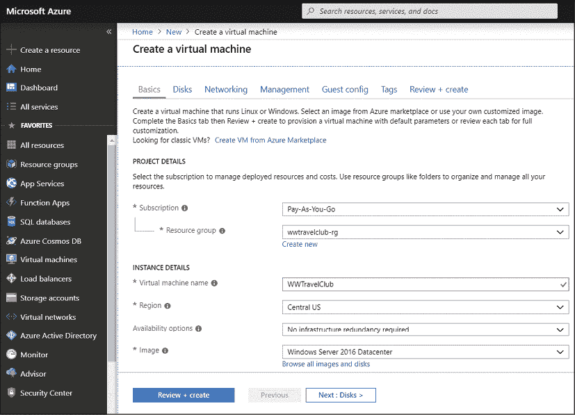
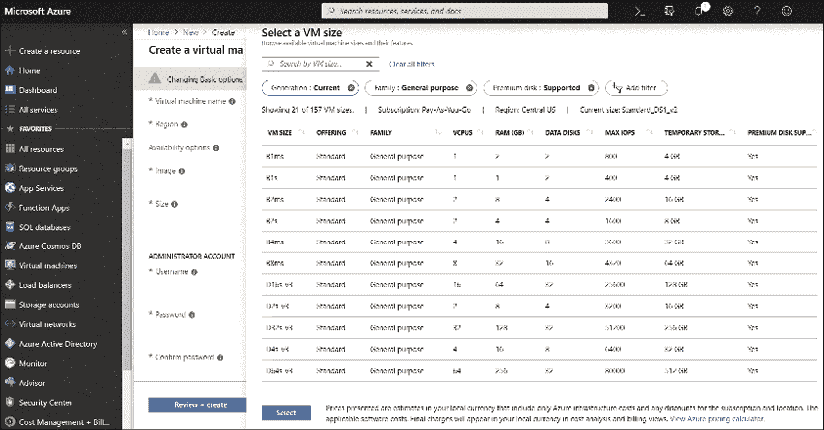
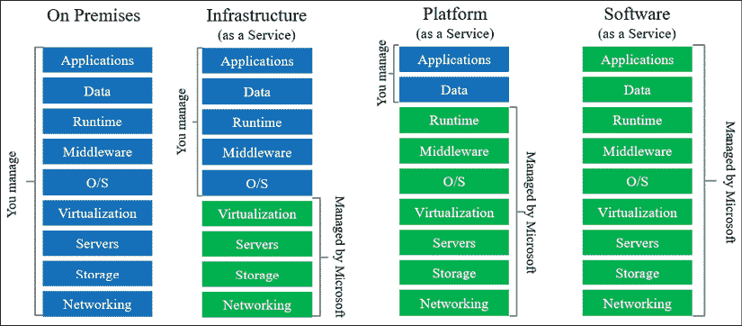
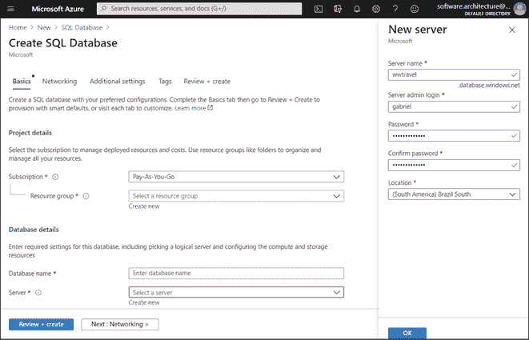
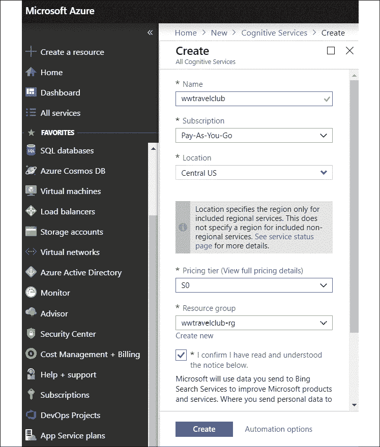

# 4.

# 决定基于云的最佳解决方案

在设计基于云的应用程序时，您必须了解不同的体系结构设计——从最简单到最复杂。本章讨论不同的软件架构模型，并教您如何在解决方案中利用云提供的机会。本章还将讨论在开发基础设施时，我们可以考虑的不同类型的云服务，理想的场景是什么，以及我们可以在哪里使用它们。

本章将介绍以下主题：

*   基础架构即服务解决方案
*   平台即服务解决方案
*   软件即服务解决方案
*   无服务器解决方案
*   如何使用混合解决方案以及为什么它们如此有用

值得一提的是，这些选项之间的选择取决于项目场景的不同方面。本章还将对此进行讨论。

# 技术要求

对于本章中的实际内容，您必须创建或使用 Azure 帐户。我们在*创建 Azure 帐户*部分的*第 1 章**了解软件架构*的重要性中解释了帐户创建过程。

# 不同的软件部署模型

云解决方案可以使用不同的模型进行部署。您决定部署应用程序的方式取决于与您合作的团队类型。在有基础设施工程师的公司，您可能会发现更多的人员使用**基础设施即服务**（**IaaS**。另一方面，在 IT 不是核心业务的公司，你会发现一堆**软件即服务**（**SaaS**系统。开发人员通常会决定使用**平台即服务**（**PaaS**选项），或者选择无服务器，因为在这种情况下，他们不需要交付基础设施。

作为一名软件架构师，您必须应对这种环境，并确保您不仅在解决方案的初始开发期间，而且在其维护期间，都在优化成本和工作因素。此外，作为架构师，您必须了解系统的需求，并努力将这些需求与同类最佳外围解决方案联系起来，以加快交付速度并使解决方案尽可能接近客户的规格。

## IaaS 和 Azure 机会

基础设施即服务是许多不同的云玩家提供的第一代云服务。它的定义在很多地方都很容易找到，但我们可以将其概括为“您在 Internet 上提供的计算基础设施”。正如我们在本地数据中心实现服务虚拟化一样，IaaS 还将为您提供云中的虚拟化组件，如服务器、存储和防火墙。

在 Azure 中，IaaS 模型提供了多个服务。其中大部分都是付费的，当涉及到测试时，您应该注意这一点。值得一提的是，本书并未详细描述 Azure 提供的所有 IaaS 服务。但是，作为一名软件架构师，您只需要了解您将发现以下服务：

*   **虚拟机**：Windows服务器、Linux、Oracle、数据科学、机器学习
*   **网络**：虚拟网络、负载均衡器、DNS 区域
*   **存储**：文件、表、数据库和Redis

要在 Azure 中创建任何服务，您必须找到最适合您需要的服务，然后创建资源。以下屏幕截图显示正在配置的 Windows Server 虚拟机。

<figure class="mediaobject"></figure>

图 4.1：在 Azure 中创建虚拟机

按照 Azure提供的向导设置您的虚拟机后，您将能够使用**远程桌面协议**（**RDP**连接到虚拟机。下一个屏幕截图显示了一些用于部署虚拟机的硬件选项。考虑到我们只需点击**选择**按钮即可获得的不同容量，我们很好奇地想一想。

<figure class="mediaobject"></figure>

图 4.2:Azure 中可用的虚拟机大小

如果你将交付硬件的本地速度与云速度进行比较，你会发现，在上市时间方面，没有什么比云更好的了。例如，屏幕截图底部显示的具有 64 个 CPU、256 GB RAM 和 512 GB 临时存储空间的**D64s_v3**机器可能在内部数据中心中找不到。此外，在某些用例中，这台机器在月内只会使用几个小时，因此不可能在本地场景中证明其购买的合理性。这就是云计算如此惊人的原因！

### IaaS 中的安全责任

关于 IaaS 平台，安全职责是另一个需要了解的重要事项。许多人认为，一旦你决定使用云计算，所有的安全都由提供商来完成。但是，正如您在下面的屏幕截图中所看到的，情况并非如此：

<figure class="mediaobject"></figure>

图 4.3：云计算中的安全管理

IaaS 将迫使您注意从操作系统到应用程序的安全性。在某些情况下，这是不可避免的，但您必须了解，这将增加您的系统成本。

如果您只想将已经存在的内部部署结构移动到云，IaaS 可能是一个不错的选择。由于 Azure 提供的工具以及所有其他服务，这实现了可伸缩性。但是，如果你想从零开始开发一个应用程序，你也应该考虑 Azure 上的其他选项。

让我们在下一节中看一下最快的系统之一，即 PaaS。

## PaaS–开发人员的机会世界

如果你正在学习或已经学习了软件架构，你可能会完全理解下一句话的含义：软件开发的世界要求高速！如果你同意这一点，你会喜欢 PaaS 的。

正如您在前面的屏幕截图中所看到的，PaaS 只允许您在更接近您的业务的方面担心安全性：您的数据和应用程序。对于开发人员来说，这意味着不必实现一系列使解决方案安全工作的配置。

安全处理不是 PaaS 的唯一优势。作为一名软件架构师，您可以将这些服务作为更快地提供更丰富解决方案的机会。上市时间肯定可以证明许多基于 PaaS 运行的应用程序的成本是合理的。

Azure 中现在有很多作为 PaaS 提供的服务，再次强调，本书的目的不是列出所有这些服务。然而，有些确实需要提及。列表不断增加，这里的建议是：尽可能多地使用和测试这些服务！确保您将提供更好的设计解决方案，并牢记这一思想。

另一方面，值得一提的是，使用 PaaS 解决方案，您将无法完全控制操作系统。事实上，在很多情况下，你甚至没有办法连接到它。这在大多数情况下都很好，但在某些调试情况下，您可能会错过此功能。好的方面是 PaaS 组件每天都在不断发展，微软最大的担忧之一就是让它们变得更加显眼。

以下章节展示了 Microsoft 为.NET web 应用提供的最常见的 PaaS 组件，如 Azure web 应用和 Azure SQL Server。我们还介绍了 Azure 认知服务，这是一个非常强大的 PaaS 平台，它展示了 PaaS 世界中的奇妙发展。我们将在本书的其余部分更深入地探讨其中一些。

### 网络应用

Web 应用是 PaaS 选项，可用于部署 Web 应用。您可以部署不同类型的应用程序，如.NET、.NET Core、Java、PHP、Node.js 和 Python。在*第 1 章**理解软件架构的重要性*中介绍了一个示例。

好的方面是，创建 web 应用不需要任何结构和/或 IIS web 服务器设置。在某些情况下，当您使用 Linux 托管.NET 应用程序时，您根本没有 IIS。

此外，web 应用程序有一个计划选项，您无需为使用付费。当然，也有一些限制，比如只运行 32 位应用程序，无法实现可伸缩性，但这对于原型设计来说是一个极好的场景。

### SQL 数据库

想象一下，如果您拥有 SQL server 的全部功能，而不需要为部署此数据库而支付大型服务器的费用，那么部署解决方案的速度会有多快。这适用于 SQL 数据库。有了它们，您可以使用 Microsoft SQL Server 执行最需要的操作—存储和数据处理。在这种情况下，Azure 负责备份数据库。

SQL 数据库甚至为您提供了自行管理性能的选项。这称为自动调谐。同样，使用 PaaS 组件，您将能够专注于对您的业务重要的方面：非常快的上市时间。

创建 SQL 数据库的步骤非常简单，就像我们以前看到的其他组件的步骤一样。但是，有两件事需要注意：服务器本身的创建和收费方式。

当您**创建资源**时，您可以在中搜索`SQL Database`，您将找到此向导来帮助您：

<figure class="mediaobject"></figure>

图 4.4：在 Azure 中创建 SQL 数据库

SQL 数据库依赖 SQL server 来承载它。因此，正如您所见，您必须创建（至少对于第一个数据库）一个`database.windows.net`服务器，您的数据库将托管在该服务器上。此服务器将提供使用当前工具（如 Visual Studio、SQL server Management Studio 和 Azure Data Studio）访问 SQL server 数据库所需的所有参数。值得一提的是，您有一系列关于安全性的功能，例如透明数据加密和 IP 防火墙。

一旦决定了数据库服务器的名称，您就可以选择对系统收费的定价层。特别是在 SQL 数据库中，有几种不同的定价选项，如下面的屏幕截图所示。您应该仔细研究每一个，因为根据您的情况，您可以通过优化定价层来节省资金：

<figure class="mediaobject"></figure>

图 4.5：配置 Azure SQL 数据库定价层

有关 SQL 配置的更多信息，您可以使用以下链接：[https://azure.microsoft.com/en-us/services/sql-database/](https://azure.microsoft.com/en-us/services/sql-database/) 。

配置完成后，您将能够以与在本地安装 SQL server 时相同的方式连接到此服务器数据库。您必须注意的唯一细节是 Azure SQL Server 防火墙的配置，但这非常容易设置，并且很好地演示了 PaaS 服务的安全性。

### Azure 认知服务

**人工智能**（**人工智能**）是软件架构中最常讨论的话题之一。我们离一个真正伟大的世界还有一步之遥，在这个世界上，人工智能将无处不在。要实现这一点，作为一名软件架构师，你不能将人工智能视为需要从头开始不断改造的软件。

Azure 认知服务可以帮助您做到这一点。在这组 API 中，您将找到开发愿景、知识、语音、搜索和语言解决方案的各种方法。其中一些需要经过培训才能实现，但这些服务也为此提供了 API。

从这个场景中可以看出 PaaS 的伟大之处。在内部部署或 IaaS 环境中准备应用程序所需执行的作业数量是巨大的。在 PaaS 中，您不必担心这一点。作为软件架构师，您完全专注于对您真正重要的事情：业务问题的解决方案。

在 Azure 帐户中设置 Azure 认知服务也非常简单。首先，您需要像任何其他 Azure 组件一样添加认知服务，如以下屏幕截图所示：

<figure class="mediaobject"></figure>

图 4.6：在 Azure 中创建认知服务 API

一旦完成此操作，您将能够使用服务器提供的 API。您将在所创建的服务中发现两个重要特性：端点和访问密钥。它们将在您的代码中用于访问 API。

<figure class="mediaobject"></figure>

图 4.7：创建的认知服务端点

下面的代码示例演示如何使用认知服务翻译句子。此翻译服务的主要概念是，您可以根据服务设置的键和区域发布您想要翻译的句子。以下代码使您能够向服务 API 发布请求：

```cs
private static async Task<string> PostAPI(string api, string key, string region, string textToTranslate)
{
   using var client = new HttpClient();
   using var request = new HttpRequestMessage(HttpMethod.Post, api);
   request.Headers.Add("Ocp-Apim-Subscription-Key", key);
   request.Headers.Add("Ocp-Apim-Subscription-Region", region);
   client.Timeout = TimeSpan.FromSeconds(5);
   var body = new[] { new { Text = textToTranslate } };
   var requestBody = JsonConvert.SerializeObject(body);
   request.Content = new StringContent(requestBody, Encoding.UTF8, "application/json");
   var response = await client.SendAsync(request);
      response.EnsureSuccessStatusCode();
        return await response.Content.ReadAsStringAsync();
} 
```

值得一提的是，前面的代码将允许您发布将任何文本翻译为任何语言的请求，前提是您在参数中定义它。以下是调用前一个方法的主程序：

```cs
static async Task Main()
{
   var host = "https://api.cognitive.microsofttranslator.com";
   var route = "/translate?api-version=3.0&to=es";
   var subscriptionKey = "[YOUR KEY HERE]";
   var region = "[YOUR REGION HERE]";

   var translatedSentence = await PostAPI(host + route,
   subscriptionKey,region, "Hello World!");

   Console.WriteLine(translatedSentence);

} 
```

欲了解更多信息，请访问[https://docs.microsoft.com/en-us/azure/cognitive-services/translator/reference/v3-0-languages](https://docs.microsoft.com/en-us/azure/cognitive-services/translator/reference/v3-0-languages) 。

这是一个完美的例子，说明了您可以如何轻松快速地使用此类服务来构建项目。此外，这种开发方法非常好，因为您使用的是一段已经过测试并被其他解决方案使用的代码。

## SaaS–只需登录并开始！

SaaS 可能是使用基于云的服务的最简单方式。云计算玩家为他们的终端用户提供了许多很好的解决公司常见问题的选择。

这类服务的一个很好的例子是 Office 365。这些平台的关键点在于，您不需要担心应用程序维护。这在您的团队完全专注于开发应用程序的核心业务的场景中尤其方便。例如，如果您的解决方案需要提供良好的报告，那么您可以使用 Power BI（包括在 Office 365 中）设计它们。

SaaS 平台的另一个很好的例子是 Azure DevOps。作为软件架构师，在 Azure DevOps 之前，您需要安装和配置 AutoT0Server ToeFoundation Server T1 T1（PosiT2A.TFS AutoT3）（或者甚至 Po.T4 旧的工具，如微软 VisualSuthCaseFe），以使您的团队与公共存储库和应用程序生命周期管理工具一起工作。

我们过去常常花费大量时间来准备安装 TFS 的服务器，或者升级并持续维护已经安装的 TFS。由于 SaaS Azure DevOps 的简单性，这已不再需要。

## 理解无服务器意味着什么

无服务器解决方案是一种解决方案，其重点不在于代码运行的位置。即使在“无服务器”解决方案中，也始终存在服务器。问题是，您只是不知道或不关心代码在哪一个上执行。

您现在可能认为无服务器只是另一种选择——当然，这是真的，因为这种体系结构并不能提供完整的解决方案。但这里的关键点是，在无服务器解决方案中，您有一个非常快速、简单和敏捷的应用程序生命周期，因为几乎所有无服务器代码都是无状态的，并且与系统的其余部分松散耦合。一些作者将其称为**功能即服务**（**FaaS**。

当然，服务器在某处运行。这里的关键点是，您不需要担心这一点，甚至不需要担心可伸缩性。这将使您能够完全专注于应用程序业务逻辑。同样，世界需要快速发展，同时也需要良好的客户体验。您越关注客户需求，效果越好！

在*第 10 章*中*使用 Azure 功能*时，您将探索 Microsoft 在 Azure 中提供的最佳无服务器实现之一–Azure 功能。在这里，我们将重点介绍如何开发无服务器解决方案，并了解它们的优缺点。

# 为什么混合应用程序在许多情况下如此有用？

混合解决方案是其部分不共享统一架构选择的解决方案；每个部分都有不同的架构选择。在云计算中，“混合”一词主要指将云子系统与本地子系统混合使用的解决方案。但是，它也可以指将 web 子系统与特定于设备的子系统（如手机或任何其他运行代码的设备）混合使用。

由于 Azure 可以提供的服务数量和可以实现的设计架构数量，混合应用程序可能是本章主要问题的最佳答案，即如何在项目中利用云提供的机会。如今，许多当前的项目正在从内部部署解决方案转向云架构，并且，根据您将在哪里交付这些项目，您仍然会发现许多关于移动到云的错误的先入之见。其中大多数与成本、安全性和服务可用性有关。

你需要明白这些先入为主的观念是有道理的，但不是人们的思维方式。当然，作为软件架构师，您不能忽视它们。尤其是在开发关键系统时，您必须决定是否一切都可以在云端进行，还是最好在边缘交付部分系统。

边缘计算范式是一种将系统的一部分部署在离所需位置更近的机器或设备上的方法。这有助于减少响应时间和带宽开销。

移动解决方案可以被视为混合应用程序的经典示例，因为它们混合了基于 web 的体系结构和基于设备的体系结构，以提供更好的用户体验。在很多情况下，您可以用响应性强的网站替换移动应用程序。然而，当涉及到界面质量和性能时，也许一个响应迅速的网站不会给最终用户他们真正需要的东西。

在下一节中，我们将讨论本书用例的实际示例。

# Book use case–哪一个是最好的云解决方案？

如果您回到*第 1 章**理解软件架构*的重要性，您将发现一个系统需求，该需求描述了 WWTravelClub 示例应用程序应该运行的系统环境。

SR_003：系统应在 Windows、Linux、iOS 和 Android 平台上运行。

乍一看，任何开发者都会说：网络应用。然而，作为软件架构师，iOS 和 Android 平台也需要您的关注。在这种情况下，就像在几种情况下一样，用户体验是项目成功的关键。决策不仅需要由开发速度驱动，还需要由提供良好用户体验所获得的好处驱动。

软件架构师在这个项目中必须做出的另一个决定与移动应用程序的技术有关，如果他们决定开发移动应用程序。同样，这将是混合应用程序和本机应用程序之间的选择，因为在这种情况下，可以使用 Xamarin 这样的跨平台解决方案。因此，对于移动应用程序，您还可以选择继续使用 C# 编写代码。

下面的屏幕截图代表了我们对 WWTravelClub 体系结构的第一选择。决定依赖 Azure组件与成本和维护考虑有关。本书后面将在*第 8 章*、*与 C#-实体框架核心*中的数据交互、*第 9 章*、*如何选择云中的数据存储*和*第 10 章*、*中讨论以下各项使用 Azure 功能*，以及选择的原因。目前，只要知道 WWTravelClub 是一个混合应用程序就足够了，它在手机上运行 Xamarin 应用程序，在服务器端运行 ASP.NET 核心 web 应用程序。

<figure class="mediaobject"></figure>

图 4.8:WWTravelClub 架构

正如您在图中所证实的，WWTravelClub 体系结构主要是使用 Azure 提供的 PaaS 和无服务器组件设计的。所有开发都将在 Azure DevOps SaaS Microsoft 平台上进行。

在我们与 WWTravelClub 的想象场景中，赞助商表示 WWTravelClub 团队中没有人专门从事基础设施建设。因此，软件架构使用 PaaS服务。考虑到这种情况和所需的开发速度，这些组件肯定会表现良好。

当我们浏览本书中讨论的章节和技术时，这种体系结构将改变和发展，而不受任何早期选择的限制。这是 Azure 和现代建筑设计提供的绝佳机会。随着解决方案的发展，您可以轻松地更改组件和结构。

# 总结

在本章中，您学习了如何在解决方案中利用云提供的服务，以及可以选择的各种选项。

本章介绍了在基于云的结构中交付相同应用程序的不同方法。我们还注意到微软向其客户提供所有这些选项的速度有多快，因为您可以在实际应用中体验所有这些选项，并选择最适合您需要的选项，因为没有*银弹*在所有情况下都能起作用。作为软件架构师，您需要分析您的环境和团队，然后决定在解决方案中实现的最佳云架构。

下一章将专门讨论如何构建一个由称为微服务的小型可伸缩软件模块组成的灵活体系结构。

# 问题

1.  为什么要在解决方案中使用 IaaS？
2.  为什么要在解决方案中使用 PaaS？
3.  为什么要在解决方案中使用 SaaS？
4.  为什么要在解决方案中使用无服务器？
5.  使用 Azure SQL Server 数据库的优势是什么？
6.  如何使用 Azure 加速应用程序中的 AI？
7.  混合体系结构如何帮助您设计更好的解决方案？

# 进一步阅读

您可以查看这些 web 链接，以决定本章中涉及的主题，您应该更深入地学习：

*   [https://visualstudio.microsoft.com/xamarin/](https://visualstudio.microsoft.com/xamarin/)
*   [https://www.packtpub.com/application-development/xamarin-cross-platform-application-development](https://www.packtpub.com/application-development/xamarin-cross-platform-application-development)
*   [https://www.packtpub.com/virtualization-and-cloud/learning-azure-functions](https://www.packtpub.com/virtualization-and-cloud/learning-azure-functions)
*   [https://azure.microsoft.com/overview/what-is-iaas/](https://azure.microsoft.com/overview/what-is-iaas/)
*   [https://docs.microsoft.com/en-us/azure/security/azure-security-iaas](https://docs.microsoft.com/en-us/azure/security/azure-security-iaas)
*   [https://azure.microsoft.com/services/app-service/web/](https://azure.microsoft.com/services/app-service/web/)
*   [https://azure.microsoft.com/services/sql-database/](https://azure.microsoft.com/services/sql-database/)
*   [https://azure.microsoft.com/en-us/services/virtual-machines/data-science-virtual-machines/](https://azure.microsoft.com/en-us/services/virtual-machines/data-science-virtual-machines/)
*   [https://docs.microsoft.com/azure/sql-database/sql-database-automatic-tuning](https://docs.microsoft.com/azure/sql-database/sql-database-automatic-tuning)
*   [https://azure.microsoft.com/en-us/services/cognitive-services/](https://azure.microsoft.com/en-us/services/cognitive-services/)
*   [https://docs.microsoft.com/en-us/azure/architecture/](https://docs.microsoft.com/en-us/azure/architecture/)
*   [https://powerbi.microsoft.com/](https://powerbi.microsoft.com/)
*   [https://office.com](https://office.com)
*   [https://azure.microsoft.com/en-us/overview/what-is-serverless-computing/](https://azure.microsoft.com/en-us/overview/what-is-serverless-computing/)
*   [https://azure.microsoft.com/en-us/pricing/details/sql-database/](https://azure.microsoft.com/en-us/pricing/details/sql-database/)
*   [https://www.packtpub.com/virtualization-and-cloud/professional-azure-sql-database-administration](https://www.packtpub.com/virtualization-and-cloud/professional-azure-sql-database-administration)