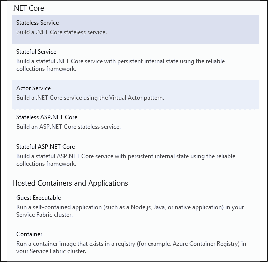
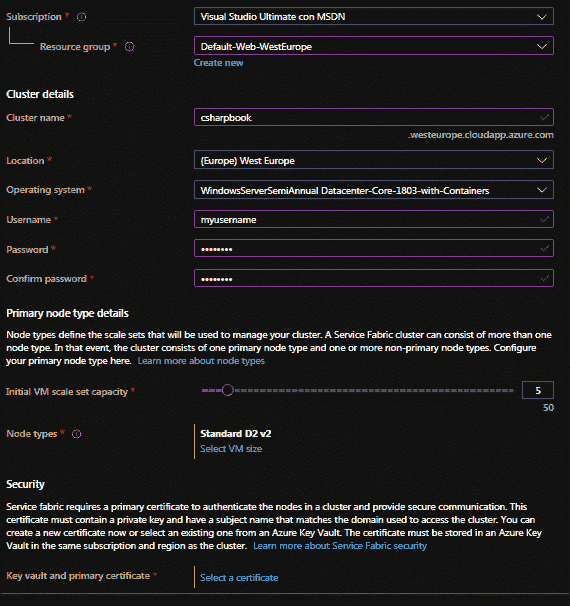
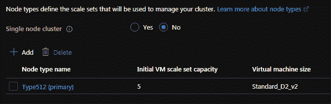
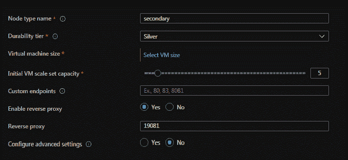
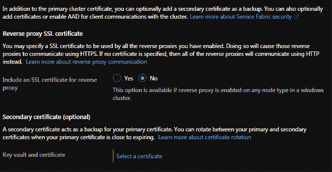

# 6.

# Azure 服务结构

本章专门介绍 Azure Service Fabric，它是 Microsoft 自以为是的微服务编排器。它在 Azure 上可用，但也可以下载 Service Fabric 软件，这意味着用户可以使用它定义自己的内部部署微服务群集。

虽然服务结构不像 Kubernetes 那样分散，但它具有更好的学习曲线，使您能够试验微服务的基本概念，并在很短的时间内构建复杂的解决方案。此外，它还提供了一个集成的部署环境，其中包括实现完整应用程序所需的一切。更具体地说，它还提供了其集成的通信协议，以及存储状态信息的简单可靠的方法。

在本章中，我们将介绍以下主题：

*   Visual Studio 对 Azure Service Fabric 应用程序的支持
*   如何定义和配置 Azure 服务结构群集
*   如何通过“记录微服务”用例对可靠服务及其通信进行编码

在本章结束时，您将了解如何实现基于 Azure Service Fabric 的完整解决方案。

# 技术要求

在本章中，您将要求：

*   Visual Studio 2019 免费社区版或更高版本，安装了所有数据库工具和 Azure 开发工作负载。
*   免费的 Azure 帐户。*第一章**中的*创建 Azure 帐户*部分*理解软件架构*的重要性，解释了如何创建 Azure 帐户。*
*   A local emulator for Azure Service Fabric to debug your microservices in Visual Studio. It is free and can be downloaded from [https://docs.microsoft.com/en-us/azure/service-fabric/service-fabric-get-started# install-the-sdk-and-tools](https://docs.microsoft.com/en-us/azure/service-fabric/service-fabric-get-started# install-the-sdk-and).

    为避免安装问题，请确保您的 Windows 版本是最新的。此外，emulator 使用 PowerShell 高权限级别命令，默认情况下，这些命令会被 PowerShell 阻止。要启用它们，您需要在 Visual Studio 软件包管理器控制台或任何 PowerShell 控制台中执行以下命令。必须以*管理员*身份启动 Visual Studio 或外部 PowerShell 控制台，才能成功执行以下命令：

    ```cs
    Set-ExecutionPolicy -ExecutionPolicy Unrestricted -Force -Scope CurrentUser 
    ```

## Visual Studio 对 Azure 服务结构的支持

Visual Studio 基于 Service Fabric 平台为微服务应用程序提供了一个特定的项目模板，您可以在其中定义各种微服务，配置它们，并将它们部署到 Azure Service Fabric，Azure Service Fabric 是一个微服务编排器。Azure 服务结构将在下一节中进行更详细的描述。

在本节中，我们将描述您可以在服务结构应用程序中定义的各种类型的微服务。本章最后一节将提供完整的代码示例。如果要在开发机器上调试微服务，需要安装本章技术要求中列出的 Service Fabric emulator。

在*Visual Studio 项目类型下拉过滤器*中选择**云**可以找到服务结构应用程序：

<figure class="mediaobject"></figure>

图 6.1：选择服务结构应用程序

选择项目并选择项目和解决方案名称后，您可以从各种服务中进行选择：

<figure class="mediaobject"></figure>

图 6.2：服务选择

NETCore下的所有项目都使用特定于 Azure 服务结构的微服务模型。来宾可执行文件在现有 Windows 应用程序周围添加了一个包装器，将其转换为可以在 Azure Service Fabric 中运行的微服务。容器应用程序支持在 Service Fabric 应用程序中添加任何 Docker 映像。所有其他选择都构建了一个模板，允许您使用特定于服务结构的模式对微服务进行编码。

如果选择**无状态服务**并填写所有请求信息，Visual Studio 将创建两个项目：一个包含整个应用程序配置信息的应用程序项目，以及您选择的特定服务的项目，该项目包含服务代码和特定于服务的配置。如果您想向应用程序添加更多微服务，请右键单击应用程序项目并选择**添加****新服务结构服务**。

如果右键单击解决方案并选择**添加****新建项目**，将创建一个新的 Service Fabric 应用程序，而不是将新服务添加到现有的应用程序中。

如果您选择**来宾可执行文件**，则需要提供以下内容：

*   服务名称。
*   包含主可执行文件及其正常工作所需的所有文件的文件夹。如果要在项目中创建此文件夹的副本或仅链接到现有文件夹，则需要此选项。
*   是添加到此文件夹的链接，还是将所选文件夹复制到 Service Fabric 项目中。
*   主可执行文件。
*   要在命令行上传递给该可执行文件的参数。
*   将哪个文件夹用作 Azure 上的工作文件夹。您希望使用包含主可执行文件（`CodeBase`）的文件夹、Azure Service Fabric 将在其中打包整个微服务的文件夹（`CodePackage`）或名为`Work`的新子文件夹。

如果您选择**容器**，您需要提供以下内容：

*   服务名称。
*   私有 Azure 容器注册表中 Docker 映像的完整名称。
*   将用于连接到 Azure 容器注册表的用户名。密码将在为用户名自动创建的应用程序配置文件的相同`RepositoryCredentials`XML 元素中手动指定。
*   可以访问服务的端口（主机端口）和主机端口必须映射到的容器内的端口（容器端口）。容器端口必须与 Docker 文件中公开并用于定义 Docker 映像的端口相同。

之后，您可能需要添加进一步的手动配置，以确保 Docker 应用程序正常工作。*进一步阅读*部分包含官方文档的链接，您可以在其中找到更多详细信息。

有五种类型的.NETCore本机服务结构服务。演员服务模式是卡尔·休伊特几年前构思的一种固执己见的模式。我们将不在这里讨论它，但*进一步阅读*部分包含一些链接，提供了有关这方面的更多信息。

剩下的四种模式是指 ASP.NET（核心）作为主要交互协议的使用（或不使用），以及服务是否具有内部状态。事实上，服务结构允许微服务使用分布式队列和字典，声明它们的微服务的所有实例都可以全局访问这些队列和字典，而不依赖于它们运行的硬件节点（它们被序列化并在需要时分发到所有可用实例）。

有状态模板和无状态模板主要在配置方面有所不同。所有本机服务都是只指定两个方法的类。有状态服务指定：

```cs
protected override IEnumerable<ServiceReplicaListener> CreateServiceReplicaListeners()
protected override async Task RunAsync(CancellationToken cancellationToken) 
```

而无状态服务指定：

```cs
protected override IEnumerable< ServiceInstanceListener > CreateServiceInstanceListeners()
protected override async Task RunAsync(CancellationToken cancellationToken) 
```

`CreateServiceReplicaListeners`和`CreateServiceInstanceListeners`方法指定微服务用于接收消息的侦听器列表以及处理这些消息的代码。监听器可以使用任何协议，但需要指定相对套接字的实现。

`RunAsync`包含后台线程的代码，这些线程异步运行由接收到的消息触发的任务。在这里，您可以构建运行多个托管服务的主机。

ASP.NETCore模板遵循相同的模式；但是，它们使用一个独特的基于 ASP.NETCore的侦听器，并且没有`RunAsync`实现，因为后台任务可以从 ASP.NETCore内部启动，而 ASP.NETCore的侦听器定义了一个完整的`WebHost`。但是，您可以向 VisualStudio 创建的`CreateServiceReplicaListeners`实现返回的侦听器数组中添加更多的侦听器，以及自定义的`RunAsync`覆盖。

值得指出的是，as`RunAsync`是可选的，由于 ASP.NETCore模板没有实现它，`CreateServiceReplicaListeners`和`CreateServiceInstanceListeners`也是可选的，例如，在计时器上操作的后台工作人员不需要实现任何一个。

关于 Service Fabric 的本机服务模式的更多细节将在下一节中提供，而完整的代码示例将在本章的*用例–记录微服务*部分中提供，该部分专门介绍本书的用例。

# 定义和配置 Azure 服务结构群集

Azure Service Fabric 是主要的 Microsoft orchestrator，它可以承载 Docker 容器、本机.NET应用程序和一个名为**可靠服务**的分布式计算模型。我们已经在*Visual Studio 对 Azure Service Fabric 的支持*一节中解释了如何创建包含这三种服务的应用程序。在本节中，我们将解释如何在 Azure 门户中创建Azure Service Fabric 群集，并提供有关可靠服务的更多详细信息。关于*可靠服务*的更多实际细节将在*用例-记录微服务*部分中描述的示例中提供。

您可以通过在 Azure 搜索栏中键入`Service Fabric`并选择**Service Fabric Cluster**进入 Azure 的 Service Fabric 部分。

此时将显示所有服务结构集群的摘要页面，在您的情况下，该页面应为空。单击**添加**按钮创建第一个集群时，将显示一个多步骤向导。以下小节描述了可用的步骤。

## 步骤 1–基本信息

以下屏幕截图显示了 Azure 服务结构的创建：

<figure class="mediaobject"></figure>

图 6.3:Azure 服务结构创建

在这里，您可以选择要用于将远程桌面连接到所有群集节点的操作系统、资源组、订阅、位置以及用户名和密码。

您需要选择一个集群名称，该名称将用于将集群 URI 组成为`<cluster name>.<location>.cloudapp.azure.com`，其中`location`是与您选择的数据中心位置关联的名称。让我们选择 Windows，因为服务结构主要是为 Windows 设计的。Linux 机器的更好选择是 Kubernetes，这将在下一章中介绍。

然后您需要选择您的节点类型，即您希望为主节点使用的虚拟机类型，以及初始规模集，即要使用的最大虚拟机数量。请选择一种便宜的节点类型，并且不要超过三个节点，否则您可能会很快浪费所有免费 Azure 信用。

有关节点配置的更多详细信息将在下一小节中给出。

最后，您可以选择一个证书来保护节点到节点的通信。我们点击**选择证书**链接，在打开的窗口中，选择自动创建新密钥库和新证书。更多安全信息将在*步骤 3–安全配置*部分提供。

## 步骤 2–群集配置

在第二步中，您可以微调集群节点类型和数量：

<figure class="mediaobject"></figure>

图 6.4：集群配置

更具体地说，在上一步中，我们选择了集群主节点。在这里，我们可以选择是否添加具有扩展容量的各种辅助节点。创建不同的节点类型后，可以将服务配置为仅在功能足以满足其需要的特定节点类型上运行。

我们点击**添加**按钮，添加一个新的节点类型：

<figure class="mediaobject"></figure>

图 6.5：添加新节点类型

不同节点类型的节点可以独立伸缩，**主节点**类型是 Azure Service Fabric 运行时服务的托管位置。对于每个节点类型，您可以指定机器类型（**耐久性层**）、机器尺寸（CPU 和 RAM）以及初始节点数。

您还可以指定从集群外部可见的所有端口（**自定义端点**。

托管在集群不同节点上的服务可以通过任何端口进行通信，因为它们是同一本地网络的一部分。因此，**自定义端点**必须声明需要接受集群外部流量的端口。**自定义端点**中公开的端口是集群的公共接口，可以通过集群 URI`<cluster name>.<location>.cloudapp.azure.com`访问。它们的流量会自动重定向到集群负载平衡器打开了相同端口的所有微服务。

为了理解**启用反向代理**选项，我们必须解释如何将通信发送到物理地址在其生命周期内发生变化的多个服务实例。在集群内，服务通过 URI（如`fabric://<application name>/<service name>`进行标识。也就是说，这个名称允许我们访问`<service name>`的几个负载平衡实例之一。然而，这些 URI 不能被通信协议直接使用。相反，它们用于从服务结构命名服务获取所需资源的物理 URI 及其所有可用端口和协议。

稍后，我们将学习如何使用*可靠服务*执行此操作。但是，此模型不适用于没有专门在 Azure Service Fabric 上运行的停靠服务，因为它们不知道特定于 Service Fabric 的命名服务和 API。

因此，Service Fabric 提供了另外两个选项，我们可以使用它们来标准化 URL，而不是直接与其命名服务交互的：

*   **DNS**：每个服务可以指定其`hostname`（也称为其**DNS 名称**）。DNS 服务负责将其转换为实际的服务 URL。例如，如果一个服务指定了一个`order.processing`DNS 名称，并且它在端口`80`上有一个 HTTP 端点和一个`/purchase`路径，那么我们可以通过`http://order.processing:80/purchase`到达该端点。默认情况下，DNS 服务处于活动状态，但您可以通过单击**配置高级设置**在辅助节点屏幕中显示高级设置选择，或转到**高级**选项卡来停用它。
*   **Reverse proxy**: Service Fabric's reverse proxy intercepts all the calls that have been directed to the cluster address and uses the name service to send them to the right application and service within that application. Addresses that are resolved by the reverse proxy service have the following structure: `<cluster name>.<location>.cloudapp.azure.com: <port>//<app name>/<service name>/<endpoint path>?PartitionKey=<value>& PartitionKind=value`. Here, partition keys are used to optimize stateful reliable services and will be explained at the end of this subsection. This means that stateless services lack the query string part of the previous address. Thus, a typical address that's solved by reverse proxy may be something similar to `myCluster.eastus.cloudapp.azure.com: 80//myapp/myservice/<endpoint path>?PartitionKey=A & PartitionKind=Named`. If the preceding endpoint is called from a service hosted on the same cluster, we can specify `localhost` instead of the complete cluster name (that is, from the same cluster, not from the same node): `localhost: 80//myapp/myservice/<endpoint path>?PartitionKey=A & PartitionKind=Named`. By default, reverse proxy is not enabled.

    由于我们将使用带有服务结构内置通信设施的服务结构可靠服务，并且由于这些内置通信设施不需要反向代理或 DNS，请避免更改这些设置。

    此外，如果您创建 Service Fabric 群集的唯一目的是在本章末尾的简单示例中进行试验，请仅使用主节点，并避免通过创建辅助节点浪费您的免费 Azure 信用。

## 步骤 3–安全配置

完成第二步后，我们将进入安全页面：

<figure class="mediaobject"></figure>

图 6.6：安全页面

我们已经在第一步中定义了主证书。在这里，您可以选择在主证书即将到期时使用的辅助证书。您还可以添加一个证书，用于在反向代理上启用 HTTPS 通信。因为在我们的示例中，我们将不使用停靠服务（因此我们不需要反向代理），所以我们不需要此选项。

此时，我们可以单击 review and create 按钮来创建集群。提交您的批准将创建群集。请注意：一个集群可能会在短时间内花费你的免费 Azure 信用，所以在测试时只需保持你的集群开启即可。之后，您应该删除它。

我们需要将主证书下载到开发机器上，因为我们需要它来部署应用程序。下载证书后，双击它即可将其安装到我们的计算机上。在部署应用程序之前，您需要在 Visual Studio Service Fabric 应用程序的**云发布配置文件**中插入以下信息（有关更多详细信息，请参阅本章的*用例–记录微服务*部分）：

```cs
<ClusterConnectionParameters 
    ConnectionEndpoint="<cluster name>.<location 
    code>.cloudapp.azure.com:19000"
    X509Credential="true"
    ServerCertThumbprint="<server certificate thumbprint>"
    FindType="FindByThumbprint"
    FindValue="<client certificate thumbprint>"
    StoreLocation="CurrentUser"
    StoreName="My" /> 
```

由于客户端（Visual Studio）和服务器都使用相同的证书进行身份验证，因此服务器和客户端指纹是相同的。证书指纹可以从 Azure 密钥库复制。值得一提的是，您还可以通过选择*步骤 3*中的相应选项，将特定于客户端的证书添加到主服务器证书中。

正如我们在*Visual Studio 对 Azure Service Fabric 的支持*小节中提到的，Azure Service Fabric 支持两种*可靠服务*：无状态和有状态。无状态服务要么不存储永久数据，要么将其存储在外部支持中，如 Redis 缓存或数据库中（有关 Azure 提供的主要存储选项，请参见*第 9 章*、*如何选择云中的数据存储*）。

另一方面，有状态服务使用特定于服务结构的分布式字典和队列。每个分布式数据结构都可以从服务的所有*相同*副本访问，但只允许一个副本（称为主副本）在其上写入，以避免对这些分布式资源的同步访问，这可能会造成瓶颈。

所有其他副本（称为辅助副本）只能从这些分布式数据结构中读取。

您可以通过查看代码从 Azure Service Fabric 运行时接收的上下文对象来检查副本是否是主副本，但通常不需要这样做。事实上，在声明服务端点时，需要声明只读的服务端点。只读端点应该接收请求，以便可以从共享数据结构中读取数据。因此，由于只为次副本激活只读端点，如果您正确地实现它们，则应该自动防止在有状态的次副本上执行写入/更新操作，而无需执行进一步的检查。

在有状态服务中，辅助副本支持读取操作的并行性，因此，为了获得写入/更新操作的并行性，为有状态服务分配了不同的数据分区。更具体地说，对于每个有状态服务，服务结构为每个分区创建一个主实例。然后，每个分区可能有几个辅助副本。

分布式数据结构在每个分区的主实例及其辅助副本之间共享。可以存储在有状态服务中的数据的整个范围在所选数量的分区之间进行分割，根据对要存储的数据使用哈希算法生成的分区键进行分割。

通常，分区键是属于在所有可用分区之间分割的给定间隔的整数。例如，可以通过对一个或多个字符串字段调用众所周知的哈希算法来生成分区键，以获得整数，然后对这些整数进行处理以获得唯一整数（例如，使用整数位上的异或操作）。然后，通过取整数除法的余数（例如，1000 除法的余数将是 0-999 区间内的整数），可以将该整数约束到为分区键选择的整数区间。确保所有服务使用完全相同的哈希算法非常重要，因此更好的解决方案是为所有服务提供一个公共哈希库。

假设我们需要四个分区，将使用 0-999 间隔内的整数键选择它们。在这里，服务结构将自动创建有状态服务的四个主要实例，并为它们分配以下四个分区密钥子间隔：0-249、250-499、500-749 和 750-999。

在代码中，需要计算发送到有状态服务的数据的分区键。然后，ServiceFabric 的运行时将为您选择正确的主实例。下面的部分提供了关于这一点以及如何在实践中使用可靠服务的更多实际细节。

# 用例–记录微服务

在本节中，我们将介绍一个基于微服务的系统，该系统在我们的 WWTravelClub 用例中记录与不同目的地相关的购买数据。特别是，我们将设计微服务，负责计算每个地点的每日收入。在这里，我们假设这些微服务从托管在同一 Azure Service Fabric 应用程序中的其他子系统接收数据。更具体地说，每个购买日志消息都由位置名称、总体包成本以及购买日期和时间组成。

作为第一步，让我们确保本章*技术要求*一节中提到的 Service Fabric emulator 已经安装并在您的开发机器上运行。现在，我们需要切换它，使其运行**5 个节点**：右键单击 Windows 通知区域中的小型服务结构群集图标，然后在打开的上下文菜单中，选择**切换群集模式**->**5 个节点**。

现在，我们可以按照*Visual Studio 对 Azure Service Fabric 的支持*部分中列出的步骤创建一个名为`PurchaseLogging`的 Service Fabric 项目。选择一个.NETCore有状态可靠服务，并将其命名为`LogStore`。

VisualStudio 创建的解决方案由一个`PurchaseLogging`项目和一个`LogStore`项目组成，前者代表整个应用程序，后者包含`PurchaseLogging`应用程序中包含的第一个微服务的实现。

在`PackageRoot`文件夹下，`LogStore`服务和每个可靠服务包含`ServiceManifest.xml`配置文件和一个`Settings.xml`文件夹（在`Config`子文件夹下）。`Settings.xml`文件夹包含一些将从服务代码中读取的设置。初始文件包含服务结构运行时所需的预定义设置。让我们添加一个新的`Settings`部分，如下代码所示：

```cs
<?xml version="1.0" encoding="utf-8" ?>
<Settings xmlns:xsd="http://www.w3.org/2001/XMLSchema" 
          xmlns:xsi="http://www.w3.org/2001/XMLSchema-instance" 
          >
<!-- This is used by the StateManager's replicator. -->
<Section Name="ReplicatorConfig">
<Parameter Name="ReplicatorEndpoint" Value="ReplicatorEndpoint" />
</Section>
<!-- This is used for securing StateManager's replication traffic. -->
<Section Name="ReplicatorSecurityConfig" />
<!-- Below the new Section to add -->
<Section Name="Timing">
<Parameter Name="MessageMaxDelaySeconds" Value="" />
</Section>
</Settings> 
```

我们将使用`MessageMaxDelaySeconds`的值来配置系统组件并确保消息的幂等性。设置值为空，因为当`PurchaseLogging`项目中包含的整个应用程序设置部署服务时，大多数设置都被覆盖。

`ServiceManifest.xml`文件包含许多由 Visual Studio 自动处理的配置标记，以及端点列表。两个端点是预配置的，因为它们由服务结构运行时使用。在这里，我们必须添加我们的微服务将侦听的所有端点的配置详细信息。每个端点定义具有以下格式：

```cs
<Endpoint Name="<endpoint name>" PathSuffix="<the path of the endpoint URI>" Protocol="<a protcol like Tcp, http, https, etc.>" Port="the exposed port" Type="<Internal or Input>"/> 
```

如果`Type`为`Internal`，则该端口将在集群本地网络内部打开；否则，该端口也将从集群外部可用。在前面的例子中，我们还必须在 Azure Service Fabric 群集的配置中声明该端口，否则群集负载平衡器/防火墙将不会向其转发消息。

公共端口可以直接从集群 URI（`<cluster name>.<location code>.cloudapp.azure.com`）访问，因为连接每个集群的负载平衡器将把它接收到的输入流量转发给它们。

在本例中，我们将不定义端点，因为我们将使用预定义的基于远程处理的通信，但我们将在本节稍后向您展示如何使用它们。

`PurchaseLogging`项目包含对*服务*解决方案资源管理器节点下`LogStore`项目的引用，并包含带有各种 XML 配置文件的各种文件夹。更具体地说，我们有以下文件夹：

*   `ApplicationPackageRoot`，其中包含名为`ApplicationManifest.xml`的整体应用程序清单。此文件包含一些初始参数定义，然后是进一步的配置。参数格式如下：

    ```cs
    <Parameter Name="<parameter name>" DefaultValue="<parameter definition>" /> 
    ```

*   定义后，参数可以替换文件其余部分中的任何值。参数值通过将参数名称括在方括号中引用，如以下代码所示：

    ```cs
    <UniformInt64Partition PartitionCount="[LogStore_PartitionCount]" LowKey="0" HighKey="1000" /> 
    ```

一些参数定义了每个服务的副本和分区的数量，并由 Visual Studio 自动创建。让我们用以下代码段中的值替换 Visual Studio 建议的这些初始值：

```cs
<Parameter Name="LogStore_MinReplicaSetSize" DefaultValue="1" />
<Parameter Name="LogStore_PartitionCount" DefaultValue="2" />
<Parameter Name="LogStore_TargetReplicaSetSize" DefaultValue="1" /> 
```

我们将只使用两个分区来向您展示分区是如何工作的，但是您可以增加这个值来提高写/更新并行性。`LogStore`服务的每个分区不需要多个副本，因为副本可以提高读取操作的性能，并且此服务不是为提供读取服务而设计的。在类似的情况下，您可以选择两到三个副本，以使系统具有冗余性，并对故障具有更强的鲁棒性。然而，我们留下了一个，因为这只是一个例子，我们不关心失败。

前面的参数用于定义`LogStore`服务在整个应用程序中的角色。此定义由 Visual Studio 在同一文件中自动生成，位于 Visual Studio 创建的初始定义下方，只是分区间隔更改为 0-1000：

```cs
<Service Name="LogStore" ServicePackageActivationMode="ExclusiveProcess">
<StatefulService ServiceTypeName="LogStoreType" 
    TargetReplicaSetSize=
    "[LogStore_TargetReplicaSetSize]" 
    MinReplicaSetSize="[LogStore_MinReplicaSetSize]">
<UniformInt64Partition PartitionCount="
        [LogStore_PartitionCount]" 
        LowKey="0" HighKey="1000" />
</StatefulService>
</Service> 
```

*   `ApplicationParameters`包含`ApplicationManifest.xml`中为各种部署环境定义的参数的可能覆盖：云（即实际的 Azure Service Fabric 群集）和具有一个或五个节点的本地模拟器。
*   `PublishProfiles`包含在`ApplicationParameters`文件夹处理的相同环境中发布应用程序所需的设置。您只需使用 Azure 服务结构 URI 的实际名称以及在 Azure 群集配置过程中下载的身份验证证书定制云发布配置文件：

    ```cs
    <ClusterConnectionParameters 
        ConnectionEndpoint="<cluster name>.<location 
        code>.cloudapp.azure.com:19000"
        X509Credential="true"
        ServerCertThumbprint="<server certificate thumbprint>"
        FindType="FindByThumbprint"
        FindValue="<client certificate thumbprint>"
        StoreLocation="CurrentUser"
        StoreName="My" /> 
    ```

完成申请所需遵循的其余步骤已分为几个小节。让我们从确保消息幂等性开始。

## 确保消息幂等性

由于负载平衡导致的故障或小超时，消息可能会丢失。在这里，我们将使用预定义的基于远程处理的通信，在发生故障时执行自动消息重试。但是，这可能会导致相同的消息被接收两次。由于我们是对采购订单的收入进行汇总，因此我们必须避免将同一笔采购进行多次汇总。

为此，我们将实现一个包含必要工具的库，以确保丢弃消息副本。

让我们向我们的解决方案中添加一个新的.NET 标准 2.0 库项目，名为**幂等胞糖醇**。现在，我们可以移除 Visual Studio 搭建的初始类。这个库需要一个对`LogStore`引用的`Microsoft.ServiceFabric.Services`NuGet 包的相同版本的引用，所以让我们验证版本号，并将相同的 NuGet 包引用添加到`IdempotencyTools`项目中。

确保消息幂等性的主要工具是`IdempotentMessage`类：

```cs
using System;
using System.Runtime.Serialization;
namespace IdempotencyTools
{
    [DataContract]
    public class IdempotentMessage<T>
    {
        [DataMember]
        public T Value { get; protected set; }
        [DataMember]
        public DateTimeOffset Time { get; protected set; }
        [DataMember]
        public Guid Id { get; protected set; }
        public IdempotentMessage(T originalMessage)
        {
            Value = originalMessage;
            Time = DateTimeOffset.Now;
            Id = Guid.NewGuid();
        }
    }
} 
```

我们添加了`DataContract`和`DataMember`属性，因为我们将用于所有内部消息的远程通信序列化程序需要它们。基本上，前面的类是一个包装器，它向传递给其构造函数的消息类实例添加一个`Guid`和一个时间标记。

`IdempotencyFilter`类使用分布式字典来跟踪它已经收到的消息。为避免此词典无限增长，会定期删除旧条目。太旧而无法在字典中找到的邮件将自动丢弃。

时间间隔条目保存在字典中，并通过`IdempotencyFilter`静态工厂方法传递，该方法将创建新的筛选器实例，同时还会传递字典名称和`IReliableStateManager`实例，这是创建分布式字典所需的：

```cs
public class IdempotencyFilter
{
    protected IReliableDictionary<Guid, DateTimeOffset> dictionary;
    protected int maxDelaySeconds;
    protected DateTimeOffset lastClear;
    protected IReliableStateManager sm;
    protected IdempotencyFilter() { }
    public static async Task<IdempotencyFilter> NewIdempotencyFilter(
        string name, 
        int maxDelaySeconds, 
        IReliableStateManager sm)
    {
        return new IdempotencyFilter()
            {
                dictionary = await
                sm.GetOrAddAsync<IReliableDictionary<Guid,
                DateTimeOffset>>(name),
                maxDelaySeconds = maxDelaySeconds,
                lastClear = DateTimeOffset.UtcNow,
                sm = sm,
            };
}
...
... 
```

字典包含消息`Guid`索引的每个消息时间标记，通过调用具有字典类型和名称的`IReliableStateManager`实例的`GetOrAddAsync`方法创建。`lastClear`包含删除所有旧消息的时间。

当新消息到达时，`NewMessage`方法检查是否必须丢弃它。如果消息必须丢弃，则返回`null`；否则，它会将新消息添加到字典中，并返回不带`IdempotentMessage`包装的消息：

```cs
public async Task<T> NewMessage<T>(IdempotentMessage<T> message)
{
    DateTimeOffset now = DateTimeOffset.Now;
    if ((now - lastClear).TotalSeconds > 1.5 * maxDelaySeconds)
    {
        await Clear();
    }
    if ((now - message.Time).TotalSeconds > maxDelaySeconds)
        return default(T);
    using (var tx = this.sm.CreateTransaction())
    {
        ...
        ...
    }
 } 
```

作为第一步，该方法验证是否是清除字典的时候，以及消息是否太旧。然后，它启动一个事务来访问字典。所有分布式字典操作必须包含在事务中，如下代码所示：

```cs
using (ITransaction tx = this.sm.CreateTransaction())
{
    if (await dictionary.TryAddAsync(tx, message.Id, message.Time))
    {
         await tx.CommitAsync();
         return message.Value;
    }
    else
    {
         return default;
    }
} 
```

如果在字典中找到消息`Guid`，则事务中止，因为字典不需要更新，并且方法返回`default(T)`，这实际上是`null`，因为消息不能被处理。否则，将消息条目添加到字典中，并返回未包装的消息。

`Clear`方法的代码可以在与本书相关联的 GitHub 存储库中找到。

## 互动图书馆

有些类型必须在所有微服务之间共享。如果内部通信是通过远程处理或 WCF 实现的，则每个微服务必须公开一个与其他微服务调用的所有方法的接口。此类接口必须在所有微服务之间共享。此外，对于所有通信接口，实现消息的类也必须在所有微服务（或其中的一些子集）之间共享。因此，所有这些结构都在微服务引用的外部库中声明。

现在，让我们在解决方案中添加一个名为`Interactions`的新.NET 标准 2.0 库项目。由于该库必须使用`IdempotentMessage`泛型类，因此我们必须将其添加为`IdempotencyTools`项目的引用。我们还必须添加对`Microsoft.ServiceFabric.Services.Remoting`NuGet 包中包含的远程通信库的引用，因为用于公开微服务远程方法的所有接口都必须继承此包中定义的`IService`接口。

`IService`是一个空接口，声明继承接口的通信角色。`Microsoft.ServiceFabric.Services.Remoting`NuGet 包版本必须与其他项目中声明的`Microsoft.ServiceFabric.Services`包版本匹配。

下面的代码展示了`LogStore`类需要实现的接口声明：

```cs
using System;
using System.Collections.Generic;
using System.Text;
using System.Threading.Tasks;
using IdempotencyTools;
using Microsoft.ServiceFabric.Services.Remoting;
namespace Interactions
{
    public interface ILogStore: IService
    {
        Task<bool> LogPurchase(IdempotentMessage<PurchaseInfo>
        idempotentMessage);
    }
} 
```

以下是`ILogStore`接口引用的`PurchaseInfo`消息类的代码：

```cs
using System;
using System.Collections.Generic;
using System.Runtime.Serialization;
using System.Text;
namespace Interactions
{
    [DataContract]
    public class PurchaseInfo
    {
        [DataMember]
        public string Location { get; set; }
        [DataMember]
        public decimal Cost { get; set; }
        [DataMember]
        public DateTimeOffset Time { get; set; }
    }
} 
```

现在，我们已经准备好实现我们的主`LogStore`微服务。

## 实现通信的接收端

为了实现`LogStore`微服务，我们必须添加对`Interaction`库的引用，该库将自动创建对远程处理库和`IdempotencyTools`项目的引用。

那么`LogStore`类必须实现`ILogStore`接口：

```cs
internal sealed class LogStore : StatefulService, ILogStore
...
...
private IReliableQueue<IdempotentMessage<PurchaseInfo>> LogQueue;
public async Task<bool>
    LogPurchase(IdempotentMessage<PurchaseInfo> idempotentMessage)
{
    if (LogQueue == null) return false;
    using (ITransaction tx = this.StateManager.CreateTransaction())
    {
        await LogQueue.EnqueueAsync(tx, idempotentMessage);
        await tx.CommitAsync();
        return true;
    }
} 
```

一旦服务接收到来自远程处理运行时的`LogPurchase`调用，它会将消息放入`LogQueue`中，以避免调用方保持阻塞状态，等待消息处理完成。通过这种方式，我们既实现了同步消息传递协议的可靠性（调用者知道消息已被接收），也实现了异步消息处理的性能优势，这是典型的异步通信。

作为所有分布式集合的最佳实践，`LoqQueue`是在`RunAsync`方法中创建的，因此如果在 Azure Service Fabric 运行时调用`RunAsync`之前到达第一个调用，`LogQueue`可能为空。在这种情况下，该方法返回`false`以表示服务尚未就绪，在这种情况下，发送方将稍等片刻，然后重新发送消息。否则，将创建一个事务以使新消息排队。

但是，如果我们不提供返回服务想要激活的所有侦听器的`CreateServiceReplicaListeners()`实现，我们的服务将不会收到任何通信。在远程通信的情况下，有一个预定义的方法来执行整个工作，因此我们只需要调用它：

```cs
protected override IEnumerable<ServiceReplicaListener>
    CreateServiceReplicaListeners()
{
    return this.CreateServiceRemotingReplicaListeners<LogStore>();
} 
```

这里，`CreateServiceRemotingReplicaListeners`是远程通信库中定义的扩展方法。它为主副本和辅助副本（用于只读操作）创建侦听器。在创建客户机时，我们可以指定其通信是仅针对主副本还是针对辅助副本。

如果要使用不同的侦听器，则必须创建一个`ServiceReplicaListener`实例的`IEnumerable`。对于每个侦听器，必须使用三个参数调用`ServiceReplicaListener`构造函数：

*   接收可靠服务上下文对象作为其输入并返回`ICommunicationListener`接口实现的函数。
*   侦听器的名称。当服务有多个侦听器时，第二个参数成为必需参数。
*   如果必须在辅助副本上激活侦听器，则为 true 的布尔值。

例如，如果我们希望同时添加自定义和 HTTP 侦听器，则代码如下所示：

```cs
return new ServiceReplicaListener[]
{
    new ServiceReplicaListener(context =>
    new MyCustomHttpListener(context, "<endpoint name>"),
    "CustomWriteUpdateListener", true),
    new ServiceReplicaListener(serviceContext =>
    new KestrelCommunicationListener(serviceContext, "<endpoint name>",
    (url, listener) =>
        {
           ...
        })
        "HttpReadOnlyListener",
    true)
}; 
```

`MyCustomHttpListener`是`ICommunicationListener`的自定义实现，`KestrelCommunicationListener`是基于 Kestrel 和 ASP.NETCore的预定义 HTTP 侦听器。以下是定义`KestrelCommunicationListener`侦听器的完整代码：

```cs
new ServiceReplicaListener(serviceContext =>
new KestrelCommunicationListener(serviceContext, "<endpoint name>", (url, listener) =>
{
    return new WebHostBuilder()
    .UseKestrel()
    .ConfigureServices(
        services => services
        .AddSingleton<StatefulServiceContext>(serviceContext)
        .AddSingleton<IReliableStateManager>(this.StateManager))
    .UseContentRoot(Directory.GetCurrentDirectory())
    .UseStartup<Startup>()
    .UseServiceFabricIntegration(listener, 
    ServiceFabricIntegrationOptions.UseUniqueServiceUrl)
    .UseUrls(url)
    .Build();
})
"HttpReadOnlyListener",
true) 
```

`ICommunicationListener`实现还必须有`Close`方法，该方法必须关闭打开的通信通道，以及`Abort`方法，该方法必须**立即**关闭通信通道（不紧急，即不通知连接的客户端等）。

现在我们已经打开了通信，可以实现服务逻辑了。

## 实现服务逻辑

当服务结构运行时调用`RunAsync`时，服务逻辑由作为独立线程启动的任务执行。当您只需要实现一个任务时，最好创建一个`IHost`并将所有任务设计为`IHostedService`实现。事实上，`IHostedService`实现是独立的软件块，更容易进行单元测试。在*第 5 章*的*使用通用主机*小节*将微服务架构应用于您的企业应用程序*中详细讨论了`IHost`和`IHostedService`。

在本节中，我们将实现在名为`ComputeStatistics`的`IHostedservice`中计算每个位置每日收入的逻辑，该逻辑使用分布式字典，其键为位置名称，其值为名为`RunningTotal`的类的实例。此类存储当前运行总数和正在计算的日期：

```cs
namespace LogStore
{
    public class RunningTotal
    {
        public DateTime Day { get; set; }
        public decimal Count { get; set; }
        public RunningTotal 
                Update(DateTimeOffset time, decimal value)
        {
            ...
        }
    }
} 
```

此类有一个`Update`方法，当收到新的购买消息时更新实例。首先，传入消息时间被标准化为通用时间。然后，提取该时间的日部分，并与当前运行合计的`Day`进行比较，如下代码所示：

```cs
public RunningTotal Update(DateTimeOffset time, decimal value)
        {
            var normalizedTime = time.ToUniversalTime();
            var newDay = normalizedTime.Date;           
           ... 
           ...
        } 
```

如果是新的一天，我们假设前一天的运行总计计算已经完成，`Update`方法将其返回到新的`RunningTotal`实例中，并重置`Day`和`Count`，以便计算新一天的运行总计。否则，新值将被添加到正在运行的`Count`中，并且该方法返回`null`，这意味着天总数还没有准备好。此实现可以在以下代码中看到：

```cs
public RunningTotal Update(DateTimeOffset time, decimal value)
{
    ...
    ...
    var result = newDay > Day && Day != DateTime.MinValue ? 
    new RunningTotal
    {
        Day=Day,
        Count=Count
    } 
    : null;
    if(newDay > Day) Day = newDay;
    if (result != null) Count = value;
    else Count += value;
    return result;
} 
```

`ComputeStatistics`的`IHostedService`实现需要一些参数才能正常工作，如下所示：

*   包含所有传入消息的队列
*   `IReliableStateManager`服务，以便它可以创建存储数据的分布式字典
*   `ConfigurationPackage`服务，以便它可以读取`Settings.xml`服务文件中定义的设置，以及可能在应用程序清单中覆盖的设置

当`IHost`通过依赖注入创建`ComputeStatistics`实例时，前面的参数必须在`ComputeStatistics`构造函数中传递。我们将在下一小节中回到`IHost`的定义。现在，让我们专注于`ComputeStatistics`构造函数及其字段：

```cs
namespace LogStore
{
    public class ComputeStatistics : BackgroundService
    {
        IReliableQueue<IdempotentMessage<PurchaseInfo>> queue;
        IReliableStateManager stateManager;
        ConfigurationPackage configurationPackage;
        public ComputeStatistics(
            IReliableQueue<IdempotentMessage<PurchaseInfo>> queue,
            IReliableStateManager stateManager,
            ConfigurationPackage configurationPackage)
        {
            this.queue = queue;
            this.stateManager = stateManager;
            this.configurationPackage = configurationPackage;
        } 
```

所有构造函数参数都存储在私有字段中，以便在调用`ExecuteAsync`时使用：

```cs
protected async override Task ExecuteAsync(CancellationToken stoppingToken)
{
    bool queueEmpty = false;
    var delayString=configurationPackage.Settings.Sections["Timing"]
        .Parameters["MessageMaxDelaySeconds"].Value;
    var delay = int.Parse(delayString);
    var filter = await IdempotencyFilter.NewIdempotencyFilterAsync(
        "logMessages", delay, stateManager);
    var store = await
        stateManager.GetOrAddAsync<IReliableDictionary<string, RunningTotal>>("partialCount");
....
... 
```

在进入循环之前，`ComputeStatistics`服务准备一些结构和参数。它声明队列不是空的，这意味着它可以开始对消息进行排队。然后，从服务设置中提取`MessageMaxDelaySeconds`并将其转换为整数。此参数的值在`Settings.xml`文件中保留为空。现在，是时候覆盖它并在`ApplicationManifest.xml`中定义它的实际值了：

```cs
<ServiceManifestImport>
<ServiceManifestRef ServiceManifestName="LogStorePkg" ServiceManifestVersion="1.0.0" />
<!--code to add start -->
<ConfigOverrides>
<ConfigOverride Name="Config">
<Settings>
<Section Name="Timing">
<Parameter Name="MessageMaxDelaySeconds" Value="[MessageMaxDelaySeconds]" />
</Section>
</Settings>
</ConfigOverride>
</ConfigOverrides>
<!--code to add end-->
</ServiceManifestImport> 
```

`ServiceManifestImport`在应用程序中导入服务清单并覆盖某些配置。每次更改其内容和/或服务定义以及在 Azure 中重新部署应用程序时，都必须更改其版本号，因为版本号更改会告诉 service Fabric 运行时要在群集中更改什么。版本号也显示在其他配置设置中。每次引用的实体发生更改时，都必须对其进行更改。

`MessageMaxDelaySeconds`与已接收消息的字典名称以及`IReliableStateManager`服务的实例一起传递给幂等过滤器的实例。最后，创建用于存储运行总计的主分布式字典。

在此之后，当`stoppingToken`发出信号时，即服务结构运行时发出停止服务的信号时，服务进入其循环并完成：

```cs
while (!stoppingToken.IsCancellationRequested)
    {
        while (!queueEmpty && !stoppingToken.IsCancellationRequested)
        {
            RunningTotal total = null;
            using (ITransaction tx = stateManager.CreateTransaction())
            {
                ...
                ... 
                ...
            }
        }
        await Task.Delay(100, stoppingToken);
        queueEmpty = false;
    }
} 
```

内部循环一直运行，直到队列变为空，然后退出并等待 100 毫秒，然后验证新消息是否已排队。

以下是包含在事务中的内部循环的代码：

```cs
RunningTotal finalDayTotal = null;
using (ITransaction tx = stateManager.CreateTransaction())
{
    var result = await queue.TryDequeueAsync(tx);
    if (!result.HasValue) queueEmpty = true;
    else
    {
        var item = await filter.NewMessage<PurchaseInfo>(result.Value);
        if(item != null)
        {
            var counter = await store.TryGetValueAsync(tx, 
            item.Location);
            //counter update
            ...
        }
        ...
        ...
    }
} 
```

在这里，服务正在尝试将消息出列。如果队列为空，则将`queueEmpty`设置为`true`退出循环；否则，它将通过幂等过滤器传递消息。如果消息在此步骤中幸存，它将使用它更新消息中引用的位置的运行总数。但是，分布式字典的正确操作要求每次更新条目时用新计数器替换旧计数器。因此，旧计数器被复制到新的`RunningTotal`对象中。如果我们调用`Update`方法，这个新对象可以用新数据更新：

```cs
 //counter update    
    var newCounter = counter.HasValue ? 
    new RunningTotal
    {
        Count=counter.Value.Count,
        Day= counter.Value.Day
    }
    : new RunningTotal();
    finalDayTotal = newCounter.Update(item.Time, item.Cost);
    if (counter.HasValue)
        await store.TryUpdateAsync(tx, item.Location, 
        newCounter, counter.Value);
    else
        await store.TryAddAsync(tx, item.Location, newCounter); 
```

然后，事务被提交，如下代码所示：

```cs
if(item != null)
{
  ...
  ...
}
await tx.CommitAsync();
if(finalDayTotal != null)
{
    await SendTotal(finalDayTotal, item.Location);
} 
```

当`Update`方法返回完整的计算结果时，即`total != null`时，调用以下方法：

```cs
protected async Task SendTotal(RunningTotal total, string location)
{
   //Empty, actual application would send data to a service 
   //that exposes daily statistics through a public Http endpoint
} 
```

`SendTotal`方法将总数发送到一个服务，该服务通过 HTTP 端点公开所有统计信息。在阅读了*第 14 章**之后，您可能希望通过连接到数据库的无状态 ASP.NET Core 微服务来实现类似的服务，该微服务采用.NET Core*的面向服务架构。无状态 ASP.NETCore服务模板会自动为您创建基于 ASP.NETCore的 HTTP 端点。

但是，由于此服务必须从`SendTotal`方法接收数据，因此它还需要基于远程的端点。因此，我们必须创建它们，就像我们为`LogStore`微服务所做的那样，并将基于远程的端点阵列与包含 HTTP 端点的现有阵列连接起来。

## 定义微服务的主机

现在我们已经准备好了定义微服务`RunAsync`方法的一切：

```cs
protected override async Task RunAsync(CancellationToken cancellationToken)
{
    LogQueue = await 
        this.StateManager
        .GetOrAddAsync<IReliableQueue
<IdempotentMessage<PurchaseInfo>>>("logQueue");
    var configurationPackage = Context
        .CodePackageActivationContext
        .GetConfigurationPackageObject("Config");
    ...
    ... 
```

这里创建服务队列，服务设置保存在`configurationPackage`中。

之后，我们可以创建`IHost`服务，正如我们在*第 5 章*的*使用通用主机*小节中所解释的，*将微服务架构应用于您的企业应用程序*：

```cs
var host = new HostBuilder()
    .ConfigureServices((hostContext, services) =>
    {
        services.AddSingleton(this.StateManager);
        services.AddSingleton(this.LogQueue);
        services.AddSingleton(configurationPackage);
        services.AddHostedService<ComputeStatistics>();
    })
    .Build();
await host.RunAsync(cancellationToken); 
```

`ConfigureServices`定义`IHostedService`实现所需的所有单例实例，因此它们被注入引用其类型的所有实现的构造函数中。然后，`AddHostedService`宣布了微服务的唯一`IHostedService`。一旦`IHost`构建完成，我们将运行它，直到`RunAsync`取消令牌发出信号。当取消令牌发出信号时，关闭请求将传递给所有`IHostedService`实现。

## 与服务进行通信

由于我们还没有实现整个购买逻辑，我们将实现一个无状态的微服务，它向`LogStore`服务发送随机数据。右键点击**解决方案浏览器**中的`PurchaseLogging`项目，选择**添加****服务结构服务**。然后，选择.NETCore无状态模板，并将新的微服务项目命名为`FakeSource`。

现在，让我们添加对`Interaction`项目的引用。在继续讨论服务代码之前，我们需要更新`ApplicationManifest.xml`中以及所有其他环境特定参数覆盖（云、一个本地群集节点、五个本地群集节点）中新创建服务的副本计数：

```cs
<Parameter Name="FakeSource_InstanceCount" DefaultValue="2" /> 
```

此假服务不需要侦听器，其`RunAsync`方法非常简单：

```cs
string[] locations = new string[] { "Florence", "London", "New York", "Paris" };
protected override async Task RunAsync(CancellationToken cancellationToken)
{
    Random random = new Random();
    while (true)
    {
        cancellationToken.ThrowIfCancellationRequested();
        PurchaseInfo message = new PurchaseInfo
        {
            Time = DateTimeOffset.UtcNow,
            Location= locations[random.Next(0, locations.Length)],
            Cost= 200m*random.Next(1, 4)
        };
        //Send message to counting microservices 
        ...
        ...
        await Task.Delay(TimeSpan.FromSeconds(1), cancellationToken);
    }
} 
```

在每个循环中，都会创建一条随机消息并发送给计数微服务。然后，线程休眠一秒钟并开始一个新循环。发送已创建消息的代码如下所示：

```cs
//Send message to counting microservices 
var partition = new ServicePartitionKey(Math.Abs(message.Location.GetHashCode()) % 1000);
var client = ServiceProxy.Create<ILogStore>(
    new Uri("fabric:/PurchaseLogging/LogStore"), partition);
try
{
    while (!await client.LogPurchase(new  
    IdempotentMessage<PurchaseInfo>(message)))
    {
        await Task.Delay(TimeSpan.FromMilliseconds(100),
        cancellationToken);
    }
}
catch
{
} 
```

这里，从位置字符串计算 0-9999 间隔内的键。我们使用了`GetHashCode`，因为我们确信所有涉及的服务都使用相同的.NETCore版本，因此我们确信它们使用相同的`GetHashCode`实现，以完全相同的方式计算散列。但是，一般来说，最好提供一个带有标准哈希代码实现的库。

这个整数被传递给`ServicePartitionKey`构造函数。然后，创建一个服务代理，并传递要调用的服务的 URI 和分区密钥。代理使用此数据向命名服务请求给定分区值的主实例的物理 URI。

`ServiceProxy.Create`还接受第三个可选参数，该参数指定代理发送的消息是否也可以路由到辅助副本。默认情况下，消息只路由到主实例。如果消息目标返回`false`，意味着它还没有准备好（请记住，`LogStore`消息队列尚未创建时，`LogPurchase`返回`false`，则在 100 毫秒后尝试相同的传输。

向远程处理目标发送消息非常容易。但是，其他通信侦听器要求发送方手动与命名服务交互以获取物理服务 URI。这可以通过以下代码完成：

```cs
ServicePartitionResolver resolver = ServicePartitionResolver.GetDefault();
ResolvedServicePartition partition =     
await resolver.ResolveAsync(new Uri("fabric:/MyApp/MyService"), 
    new ServicePartitionKey(.....), cancellationToken);
//look for a primary service only endpoint
var finalURI= partition.Endpoints.First(p =>
    p.Role == ServiceEndpointRole.StatefulPrimary).Address; 
```

此外，在通用通信协议的情况下，我们必须使用 Polly 等库手动处理故障和重试（参见*第 5 章*的*弹性任务执行*小节，*将微服务架构应用于您的企业应用程序*，以获取更多信息）。

## 测试应用程序

要测试应用程序，您需要以管理员权限启动 Visual Studio。因此，关闭 Visual studio，然后右键单击 Visual studio 图标并选择选项以管理员身份启动它。再次进入 Visual Studio 后，加载`PurchaseLogging`解决方案，并在`ComputeStatistics.cs`文件中放置断点：

```cs
total = newCounter.Update(item.Time, item.Cost);
if (counter.HasValue)...//put breakpoint on this line 
```

每次点击断点时，查看`newCounter`的内容，以验证所有位置的运行总数是如何变化的。在调试模式下启动应用程序之前，请确保本地群集正在运行五个节点。如果从一个节点更改为五个节点，则本地群集菜单将变灰，直到操作完成，因此请等待菜单正常化。

启动应用程序并构建应用程序后，将显示一个控制台，您将开始接收 Visual Studio 中已完成操作的通知。在所有节点上加载应用程序需要几分钟的时间；在此之后，您的断点应该开始被命中。

# 总结

在本章中，我们描述了如何在 VisualStudio 中定义 Service Fabric 解决方案，以及如何在 Azure 中设置和配置 Service Fabric 群集。

我们描述了服务结构构建块、可靠服务、各种类型的可靠服务以及它们在服务结构应用程序中的角色。

最后，我们通过实现一个服务结构应用程序将这些概念付诸实践。在这里，我们提供了关于每个可靠服务的体系结构以及如何组织和编码它们的通信的更多实用细节。

下一章将介绍另一个著名的微服务编排器 Kubernetes 及其在 Azure 云中的实现。

# 问题

1.  什么是可靠的服务？
2.  您能否列出不同类型的可靠服务及其在服务结构应用程序中的角色？
3.  什么是`ConfigureServices`？
4.  在定义 Azure 服务结构群集期间必须声明哪些类型的端口？
5.  为什么需要可靠的有状态服务的分区？
6.  我们如何声明远程通信必须由辅助副本寻址？其他类型的交流呢？

# 进一步阅读

*   Azure 服务结构的官方文档可在此处找到：[https://docs.microsoft.com/en-US/azure/service-fabric/](https://docs.microsoft.com/en-US/azure/service-fabric/) 。
*   Azure Service Fabric 可靠服务的官方文档可在此处找到：[https://docs.microsoft.com/en-us/azure/service-fabric/service-fabric-reliable-services-introduction](https://docs.microsoft.com/en-us/azure/service-fabric/service-fabric-reliable-services-introduction) 。
*   更多关于演员模型的信息可以在这里找到：[https://www.researchgate.NET/publication/234816174_Actors_A_conceptual_foundation_for_concurrent_object-oriented_programming](https://www.researchgate.NET/publication/234816174_Actors_A_conceptual_foundation_for_concurrent_obj) 。
*   可在 Azure Service Fabric 中实现的参与者模型的官方文档可在此处找到：[https://docs.microsoft.com/en-US/azure/service-fabric/service-fabric-reliable-actors-introduction](https://docs.microsoft.com/en-US/azure/service-fabric/service-fabric-reliable-actors-introduction) 。

微软还实现了一个高级参与者模型，该模型独立于服务结构。这就是所谓的奥尔良框架。有关奥尔良的更多信息，请访问以下链接：

*   **奥尔良——虚拟演员**：[https://www.microsoft.com/en-us/research/project/orleans-virtual-actors/?from=https%3A%2F%2Fresearch.microsoft.com%2Fen-美国%2F 项目%2 奥尔良%2F](https://www.microsoft.com/en-us/research/project/orleans-virtual-actors/?from=https%3A%2F%2Fresearch)。
*   **奥尔良****文件**[https://dotnet.github.io/orleans/docs/index.html](https://dotnet.github.io/orleans/docs/index.html)