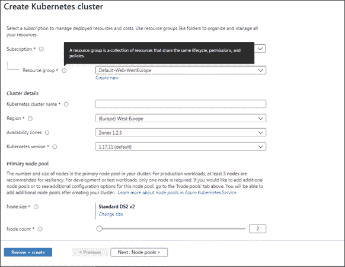
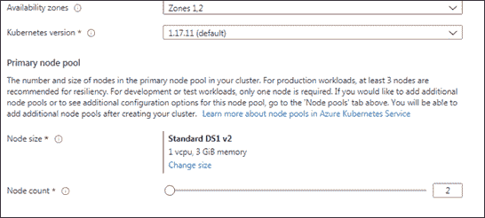
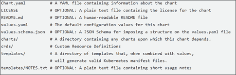

# 7.

# Azure Kubernetes 服务

本章专门介绍 Kubernetes microservices orchestrator，特别是它在 Azure 命名的 Azure Kubernetes 服务中的实现。本章解释了 Kubernetes 的基本概念，然后重点介绍了如何与 Kubernetes 集群交互，以及如何部署 Azure Kubernetes 应用程序。所有概念都通过简单的例子付诸实践。在处理本章之前，我们建议先阅读*第 5 章*、*将微服务架构应用于您的企业应用程序*，以及*第 6 章*、*Azure 服务结构*，因为它依赖于前面几章中解释的概念。

更具体地说，在本章中，您将了解以下主题：

*   库伯内特斯基础
*   与 Azure Kubernetes 群集交互
*   高级库伯内特斯概念

在本章结束时，您将了解如何实现和部署基于 Azure Kubernetes 的完整解决方案。

# 技术要求

*   Visual Studio 2019 免费社区版或更高版本，安装了所有数据库工具或任何其他`.yaml`文件编辑器，如 Visual Studio 代码。
*   免费的 Azure 帐户。*第一章**中的*创建 Azure 帐户*部分*理解软件架构*的重要性，解释了如何创建 Azure 帐户。*

本章代码见[https://github.com/PacktPublishing/Software-Architecture-with-C-9-and-.NET-5](https://github.com/PacktPublishing/Software-Architecture-with-C-9-and-.NET-5) 。

# 库伯内特斯基础

Kubernetes 是一种先进的开源编排器，您可以在专用计算机集群上本地安装它。在撰写本文时，它是应用最广泛的 orchestrator，因此 Microsoft也将其作为 Azure Service Fabric 的更好替代品提供，因为它目前是*事实上的*标准，并且可以依赖广泛的工具和应用程序生态系统。本节介绍 Kubernetes 的基本概念和实体。

Kubernetes 群集是运行 Kubernetes orchestrator 的虚拟机群集。对于 Azure 服务结构，组成集群的虚拟机称为节点。我们可以在 Kubernetes 上部署的最小软件单元不是单一的应用程序（如 Azure Service Fabric），而是称为 POD 的容器化应用程序的集合。虽然 Kubernetes 支持各种类型的容器，但最常用的容器类型是 Docker，我们在*第 5 章*中对其进行了分析，*将微服务架构应用于您的企业应用程序*，因此我们将仅讨论 Docker。

`pods`非常重要，因为属于同一 pod 的应用程序确保在同一节点上运行。这意味着它们可以轻松地通过本地主机端口进行通信。然而，不同 pod 之间的通信更为复杂，因为 pod 的 IP 地址是短暂的资源，因为 pod 没有运行它们的固定节点，而是由编排器从一个节点移动到另一个节点。此外，可以复制 pod 以提高性能，因此，一般来说，将消息寻址到特定 pod 是没有意义的，而只是寻址到同一 pod 的任何相同副本。

虽然在 Azure Service Fabric 中，基础设施会自动将虚拟网络地址提供给相同副本的组，但在 Kubernetes 中，我们需要定义称为服务的显式资源，这些资源由 Kubernetes 基础设施分配虚拟地址，并将其通信转发给相同的 POD 组。简而言之，服务是 Kubernetes 为 pod 副本集分配恒定虚拟地址的方法。

所有 Kubernetes 实体都可以被分配名值对，称为标签，用于通过模式匹配机制引用它们。更具体地说，选择器通过列出它们必须具有的标签来选择 Kubernetes 实体。

因此，例如，通过在服务定义中指定必须具有的标签来选择从同一服务接收流量的所有 POD。

服务将其流量路由到所有连接的吊舱的方式取决于吊舱的组织方式。无状态 POD 组织在所谓的`ReplicaSets`中，类似于 Azure 服务结构服务的无状态副本。作为 Azure Service Fabric 无状态服务，`ReplicaSets`有一个唯一的虚拟地址分配给整个组，流量在组的所有 POD 中平均分配。

有状态的 Kubernetes 吊舱副本被组织成所谓的`StatefulSets`。与 Azure Service Fabric 有状态服务类似，`StatefulSets`使用切分将流量分配到所有的 POD 中。出于这个原因，Kubernetes 服务为其连接的`StatefulSet`的每个 pod 分配不同的名称。这些名称如下所示：`basename-0.<base URL>`、`basename-1.<base URL>`、`basename-n.<base URL>`。通过这种方式，消息分片可以轻松完成，如下所示：

1.  每次必须将消息发送到由*N*副本组成的`StatefulSet`时，您都会计算一个介于 0 和*N*-1 之间的散列，比如说`x`。
2.  将后缀`x`添加到基名称以获取集群地址，例如`basename-x.<base URL>`。
3.  将消息发送到`basename-x.<base URL>`集群地址。

Kubernetes 没有预定义的存储设施，由于 POD 在可用节点之间移动，所以不能使用节点磁盘存储，所以长期存储必须提供分片云数据库或其他类型的云存储。当`StatefulSet`的每个 pod 都可以使用通常的连接字符串技术访问分片云数据库时，Kubernetes 提供了一种技术来抽象外部 Kubernetes 集群环境提供的类似磁盘的云存储。我们将在*高级 Kubernetes 概念*一节中介绍这些概念。

本简介中提到的所有 Kubernetes 实体都可以在`.yaml`文件中定义，一旦部署到 Kubernetes 集群，就会实际创建文件中定义的所有实体。下面的小节描述了`.yaml`文件，而随后的其他小节详细描述了迄今为止提到的所有基本 Kubernetes 对象，并解释了如何在`.yaml`文件中定义它们。在整个章节中，将进一步描述 Kubernetes 对象。

## .yaml 文件

`.yaml`文件，如 JSON 文件，是一种以人类可读的方式描述嵌套对象和集合的方法，但它们使用不同的语法。您有对象和列表，但对象属性不被`{}`包围，列表不被`[]`包围。相反，嵌套对象是通过简单地用空格缩进其内容来声明的。空间的数量可以自由选择，但一旦选择了，就必须始终如一地使用。

通过在列表项前面加连字符（`-`），可以将列表项与对象属性区分开来。

下面是一个涉及嵌套对象和集合的示例：

```cs
Name: Jhon
Surname: Smith
Spouse: 
  Name: Mary
  Surname: Smith
Addresses:
- Type: home
  Country: England
  Town: London
  Street: My home street
- Type: office
  Country: England
  Town: London
  Street: My home street 
```

前面的`Person`对象有一个`Spouse`嵌套对象和一个地址嵌套集合。

`.yaml`文件可以包含多个部分，每个部分定义不同的实体，由包含`---`字符串的行分隔。注释前面有一个`#`符号，必须在每个注释行上重复。

每一节都从 Kubernetes API 组和版本的声明开始。事实上，并非所有对象都属于同一个 API 组。对于属于`core`API 组的对象，我们可以只指定 API 版本，如下例所示：

```cs
apiVersion: v1 
```

而属于不同 API 组的对象也必须指定 API 名称，如下例所示：

```cs
apiVersion: apps/v1 
```

在下一小节中，我们将详细分析构建在它们之上的`ReplicaSets`和`Deployments`。

## 复制集和部署

Kubernetes应用程序最重要的构建块是`ReplicaSet`，即一个 pod 复制*n*次。但是，通常情况下，您会采用一个更复杂的对象，该对象构建在`ReplicaSet`——即`Deployment`之上。`Deployments`不仅创建`ReplicaSet`，还对其进行监控，以确保副本数量保持不变，与硬件故障和其他可能涉及`ReplicaSets`的事件无关。换句话说，它们是定义`ReplicaSets`和 POD 的声明性方式。

每个`Deployment`都有一个名称（`metadata->name`）、一个指定所需副本数量的属性（`spec->replicas`）、一个选择要监视的 pod 的键值对（`spec ->``selector-> matchLabels`）和一个指定如何构建 pod 副本的模板（`spec->template`：

```cs
apiVersion: apps/v1
kind: Deployment
metadata: 
  name: my-deployment-name
  namespace: my-namespace #this is optional
spec: 
   replicas: 3
   selector: 
     matchLabels: 
       my-pod-label-name: my-pod-label-value
         ...
   template:
      ... 
```

`namespace`是可选的，如果未提供，则假定名称空间为`default`。名称空间是分离 Kubernetes 集群对象的一种方式。例如，一个集群可以承载两个完全独立的应用程序的对象，每个应用程序放在一个单独的`namespace`中。

模板中缩进的是要复制的 pod 的定义。像`Deployments`这样的复杂对象也可以包含其他类型的模板，例如外部环境所需的磁盘状内存模板。我们将在*高级 Kubernetes 概念*一节中对此进行进一步讨论。

反过来，pod 模板包含一个带有标签的`metadata`部分，用于选择 pod，以及一个包含所有容器列表的`spec`部分：

```cs
metadata: 
  labels: 
    my-pod-label-name: my-pod-label-value
      ...
spec: 
  containers:
   ...
  - name: my-container-name
    image: <Docker imagename>
    resources: 
      requests: 
        cpu: 100m 
        memory: 128Mi 
      limits: 
        cpu: 250m 
        memory: 256Mi 
    ports: 
    - containerPort: 6379
    env: 
    - name: env-name
      value: env-value
       ... 
```

每个容器都有一个名称，并且必须指定用于创建容器的 Docker 映像的名称。如果 Docker 映像未包含在公共Docker 注册表中，则该名称必须是一个 URI，该 URI 还包括存储库位置。

然后，容器必须指定它们需要在`resources->requests`对象中创建的内存和 CPU 资源。只有当这些资源当前可用时，才会创建 pod 副本。相反，`resources->limits`对象指定容器副本实际可以使用的最大资源。如果在容器执行期间超过了这些限制，则会采取措施限制这些限制。更具体地说，如果超过 CPU 限制，则会限制容器（停止其执行以恢复其 CPU 消耗），而如果超过内存限制，则会重新启动容器。`containerPort`必须是容器暴露的端口。在这里，我们还可以指定进一步的信息，例如所使用的协议。

CPU 时间以毫核表示，其中 1000 毫核表示 100%的 CPU 时间，而内存以兆字节（*1Mi=1024*1024 字节*或其他单位表示。`env`列出要传递给容器的所有环境变量及其值。

容器和 pod 模板都可以包含更多字段，例如定义虚拟文件的属性，以及定义返回容器就绪状态和健康状态的命令的属性。我们将在*高级 Kubernetes 概念*一节中分析这些概念。

以下小节描述了用于存储状态信息的 pod 集。

## 状态集

`StatefulSets`与`ReplicaSet`非常相似，但`ReplicaSet`中的 POD 是无法区分的处理器，它们通过负载平衡策略并行贡献相同工作负载，而`StatefulSet`中的 POD 具有唯一的标识，并且只能通过分片贡献相同的工作负载。这是因为`StatefulSets`被设想为存储信息，而信息不能并行存储，只能通过切分的方式在多个存储中分割。

出于同样的原因，每个 pod 实例始终与它所需的任何虚拟磁盘空间相关联（请参见*高级 Kubernetes 概念*一节），因此每个 pod 实例负责写入特定的存储。

此外，`StatefulSets`pods 实例具有附加到它们的序号。它们按照这些数字顺序启动，并按相反顺序停止。如果`StatefulSet`包含*N*副本，则这些数字从零变为*N*-1。此外，通过以下方式将模板中指定的 pod 名称与实例序号链接，可以获得每个实例的唯一名称–`<pod name>-<instance ordinal>`。因此，实例名称将类似于`mypodname-0`、`mypodname-1`等等。我们将在*服务*小节中看到，实例名称用于为所有实例构建唯一的集群网络 URI，以便其他 POD 可以与`StatefulSets`POD 的特定实例通信。

以下是一个典型的`StatefulSet`定义：

```cs
apiVersion: apps/v1
kind: StatefulSet
metadata:
  name: my-stateful-set-name
spec:
  selector:
    matchLabels:
      my-pod-label-name: my-pod-label-value
...
  serviceName: "my-service-name"
  replicas: 3 
  template:
    ... 
```

模板部分与`Deployments`相同。与`Deployments`在概念上的主要区别在于`serviceName`字段。它指定必须与`StatefulSets`连接的服务的名称，以便为所有 pod 实例提供唯一的网络地址。我们将在*服务*小节中更详细地讨论这个问题。此外，通常，`StatefulSets`使用某种形式的存储。我们将在*高级 Kubernetes 概念*一节中详细讨论这一点。

还值得指出的是，`StatefulSets`的默认有序创建和停止策略可以通过为`spec->podManagementPolicy`属性指定显式的`Parallel`值（默认值为`OrderedReady`来更改。

以下小节描述如何为`ReplicaSets`和`StatefulSets`提供稳定的网络地址。

## 服务

由于 pod 实例可以在节点之间移动，因此它们没有固定的 IP 地址。服务负责为整个`ReplicaSet`分配一个唯一且稳定的虚拟地址，并负责对其所有实例的流量进行负载平衡。服务不是在集群中创建的软件对象，只是用于实现其功能所需的各种设置和活动的抽象。

服务在协议栈的第 4 级工作，因此它们理解 TCP 等协议，但无法执行 HTTP 特定的操作/转换，例如，确保安全的 HTTPS 连接。因此，如果需要在 Kubernetes 集群上安装 HTTPS 证书，则需要一个能够在协议栈的第 7 级进行交互的更复杂的对象。`Ingress`物体就是为此而设计的。我们将在下一小节中讨论这一点。

服务还负责为`StatefulSet`的每个实例分配唯一的虚拟地址。事实上，有各种各样的服务；一些是为`ReplicaSet`设计的，另一些是为`StatefulSet`设计的。

`ClusterIP`服务类型被分配一个唯一的集群内部 IP 地址。通过标签模式匹配指定连接到的`ReplicaSets`或`Deployments`。它使用 Kubernetes 基础设施维护的表来负载平衡它所连接的所有 pod 实例之间接收的流量。

因此，其他 POD 可以通过与分配有稳定网络名称`<service name>.<service namespace>.svc.cluster.local`的该服务交互来与连接到该服务的 POD 通信。由于它们只是分配了本地 IP 地址，因此无法从 Kubernetes 集群外部访问`ClusterIP`服务。以下是典型的`ClusterIP`服务的定义：

```cs
apiVersion: v1
kind: Service
metadata:
  name: my-service
  namespace: my-namespace
spec:
  selector:
    my-selector-label: my-selector-value
    ...
  ports:
    - name: http
      protocol: TCP
      port: 80
      targetPort: 9376
    - name: https
      protocol: TCP
      port: 443
      targetPort: 9377 
```

每个服务可以在多个端口上工作，并且可以将任何端口（`port`）路由到容器暴露的端口（`targetPort`）。然而，通常情况下，`port = targetPort`。端口可以指定名称，但这些名称是可选的。此外，协议的规范是可选的，在这种情况下，允许使用所有受支持的 4 级协议。`spec->selector`属性指定所有名称/值对，这些名称/值对为服务选择 POD，以将其接收的通信路由到。

由于`ClusterIP`服务无法从 Kubernetes 集群外部访问，因此我们需要其他服务类型在公共 IP 地址上公开 Kubernetes 应用程序。

`NodePort`-类型的服务是将 POD 暴露给外部单词的最简单方式。为了实现`NodePort`服务，Kubernetes 集群的所有节点上都打开了相同的端口`x`，每个节点将在此端口上接收的流量路由到新创建的`ClusterIP`服务。

反过来，`ClusterIP`服务将其流量路由到服务选择的所有 POD：

<figure class="mediaobject"></figure>

图 7.1：节点端口服务

因此，通过任何集群节点的公共 IP 与端口`x`进行通信即可访问连接到`NodePort`服务的 POD。当然，的整个过程是完全自动的，对开发者来说是隐藏的，开发者唯一关心的是获取端口号`x`在哪里转发外部流量。

`NodePort`服务的定义与`ClusterIP`服务的定义相同，唯一的区别在于它们为`spec->type`属性指定了`NodePort`的值：

```cs
...
spec:
  type: NodePort
  selector:
  ... 
```

默认情况下，为`Service`指定的每个`targetPort`自动选择 30000-327673 范围内的节点端口`x`。与每个`targetPort`关联的端口属性对于`NodePortServices`来说没有意义，因为所有流量都通过所选节点端口`x`，并且，按照惯例，设置为`targetPort`的相同值。开发者也可以通过`nodePort`属性直接设置节点端口`x`：

```cs
...
ports:
    - name: http
      protocol: TCP
      port: 80
      targetPort: 80
      nodePort: 30007
    - name: https
      protocol: TCP
      port: 443
      targetPort: 443
      nodePort: 30020
... 
```

当 Kubernetes 集群托管在云中时，更方便的方式是通过`LoadBalancer`服务对外公开一些 POD，在这种情况下，Kubernetes集群通过所选云提供商的 4 级负载平衡器对外公开。

`LoadBalancer`服务的定义与`ClusterIp`服务的定义相同，唯一的区别是`spec->type`属性必须设置为`LoadBalancer`：

```cs
...
spec:
  type: LoadBalancer
  selector:
  ... 
```

如果没有添加进一步的规范，则随机分配一个动态公共 IP。但是，如果需要云提供商的特定公共 IP 地址，则可以通过在`spec->loadBalancerIP`属性中指定它作为集群负载平衡器的公共 IP 地址：

```cs
...
spec:
  type: LoadBalancer
  loadBalancerIP: <your public ip>
  selector:
  ... 
```

在 Azure Kubernetes 中，还必须在注释中指定分配 IP 地址的资源组：

```cs
apiVersion: v1
kind: Service
metadata:
  annotations:
    service.beta.kubernetes.io/azure-load-balancer-resource-group: <IP resource group name>
  name: my-service name
... 
```

在 Azure Kubernetes 中，您可以保留动态 IP 地址，但您可以获得`<my-service-label>.<location>.cloudapp.azure.com`类型的公共静态域名，其中`<location>`是您为资源选择的地理标签。`<my-service-label>`是您验证过的标签，使以前的域名唯一。所选标签必须在服务的批注中声明，如下所示：

```cs
apiVersion: v1
kind: Service
metadata:
  annotations:
service.beta.kubernetes.io/azure-dns-label-name: <my-service-label>
  name: my-service-name
... 
```

`StatefulSets`不需要任何负载平衡，因为每个 pod 实例都有自己的标识，只需要为每个 pod 实例提供一个唯一的 URL 地址。这种独特的 URL 由所谓的 headless 服务提供。无头服务的定义类似于`ClusterIP`服务，唯一的区别是它们的`spec->clusterIP`属性设置为`none`：

```cs
...
spec:
clusterIP: none
  selector:
... 
```

无头服务处理的所有`StatefulSets`必须将服务名称放在其`spec-> serviceName`属性中，如*StatefulSets*小节所述。

无头服务为其处理的所有`StatefulSets`pod 实例提供的唯一名称为`<unique pod name>.<service name>.<namespace>.svc.cluster.local`。

服务只理解低级协议，如 TCP/IP，但大多数 web 应用程序都位于更复杂的 HTTP 协议上。这就是 Kubernetes提供名为`Ingresses`的更高级别实体的原因，这些实体构建在服务之上。下面的小节描述了这些内容，并解释了如何通过 7 级协议负载平衡器公开一组`pods`，它可以为您提供典型的 HTTP 服务，而不是通过`LoadBalancer`服务。

## 入口

`Ingresses`主要是构思的与 HTTP（S）一起工作。他们提供以下服务：

*   HTTPS 终止。它们接受 HTTPS 连接，并以 HTTP 格式将它们路由到云中的任何服务。
*   基于名称的虚拟主机。它们将多个域名与相同的 IP 地址关联，并将每个域或`<domain>/<path prefix>`路由到不同的群集服务。
*   负载平衡。

`Ingresses`依靠网络服务器提供上述服务。事实上，`Ingresses`只有在安装了`Ingress Controller`之后才能使用。`Ingress Controllers`是必须安装在集群中的自定义 Kubernetes 对象。它们处理 Kubernetes 和 web 服务器之间的接口，web 服务器可以是外部 web 服务器，也可以是`Ingress Controller`安装中的 web 服务器。

我们将在*高级 Kubernetes 概念*部分描述基于 NGINX web 服务器的`Ingress Controller`安装，作为使用 Helm 的一个示例。*进一步阅读*部分包含有关如何安装与外部 Azure 应用程序网关接口的`Ingress Controller`的信息。

HTTPS 终止和基于名称的虚拟主机可以在`Ingress`定义中以独立于所选`Ingress Controller`的方式进行配置，而实现负载平衡的方式取决于所选的具体`Ingress Controller`及其配置。在`Ingress`定义的`metadata-> annotations`字段中可以传递一些`Ingress Controller`配置数据。

基于名称的虚拟主机在入口定义的`spec>rules`部分中定义：

```cs
...
spec:
...
  rules:
  - host: *.mydomain.com
    http:
      paths:
      - path: /
        pathType: Prefix
        backend:
          service:
            name: my-service-name
            port:
              number: 80
  - host: my-subdomain.anotherdomain.com
... 
```

每个规则指定一个可选主机名，该主机名可以包含`*`通配符。如果未提供主机名，则该规则匹配所有主机名。对于每个规则，我们可以指定几个路径，每个重定向到不同的服务/端口对，其中服务通过其名称引用。与每个`path`的匹配方式取决于`pathType`的值；如果该值为`Prefix`，则指定的`path`必须是任何匹配路径的前缀。否则，如果该值为`Exact`，则必须精确匹配。匹配项区分大小写。

特定主机名上的 HTTPS 终止是通过将其与 Kubernetes 密码中编码的证书相关联来指定的：

```cs
...
spec:
...
  tls:
  - hosts:
      - www.mydomain.com
      secretName: my-certificate1
      - my-subdomain.anotherdomain.com
      secretName: my-certificate2
... 
```

HTTPS 证书可在[免费获取 https://letsencrypt.org/](https://letsencrypt.org/) 。该过程在网站上进行了解释，但基本上，与所有证书颁发机构一样，您提供了一个密钥，他们根据该密钥返回证书。还可以安装一个负责自动安装和更新证书的**证书管理器**。在*高级 Kubernetes 概念*一节中详细介绍了密钥/证书对在 Kubernetes 秘密字符串中的编码方式。

整体`Ingress`定义如下代码：

```cs
apiVersion: networking.k8s.io/v1
kind: Ingress
metadata:
  name: my-example-ingress
  namespace: my-namespace
spec:
  tls:
  ...
  rules:
... 
```

这里，`namespace`是可选的，如果没有指定，则假定为`default`。

在下一节中，我们将通过定义 Azure Kubernetes 集群并部署一个简单的应用程序来实践这里解释的一些概念。

# 与 Azure Kubernetes 群集交互

要创建一个**Azure Kubernetes 服务**（**AKS**集群，请在 Azure 搜索框中键入`AKS`，选择**Kubernetes 服务**，然后单击**添加**按钮。将出现以下表格：

<figure class="mediaobject"></figure>

图 7.2：创建 Kubernetes 群集

值得一提的是，您只需将鼠标悬停在任何带圆圈的**i**上，即可获得帮助，如前一屏幕截图所示。

通常，您需要指定订阅、资源组和区域。然后，您可以选择一个唯一的名称（**Kubernetes 集群名称**），以及要使用的 Kubernetes 版本。对于计算能力，要求您为每个节点（节点大小）和节点数选择一个机器模板。初始屏幕显示默认的三个节点。我们将其减少为两个，因为三个节点对于 Azure 免费积分来说太多了。另外，默认的虚拟机也应该换成更便宜的虚拟机，所以点击**更改大小**并选择**DS1 v2**。

**可用性区域**设置允许您将节点分布在多个地理区域，以获得更好的容错性。默认设置为三个区域。请将其更改为两个区域，因为我们只有两个节点。

在进行上述更改后，您应该会看到以下设置：

<figure class="mediaobject"></figure>

图 7.3：所选设置

现在您可以通过点击**查看+创建**按钮来创建集群。应该出现一个查看页面，确认并创建集群。

如果您点击**下一步**，您也可以定义其他节点类型，而不是**查看+创建**，然后您可以提供安全信息，即*服务主体*，并指定您是否希望启用基于角色的访问控制。在 Azure 中，服务主体是与可用于定义资源访问策略的服务关联的帐户。您还可以更改默认网络设置和其他设置。

部署可能需要一段时间（10-20 分钟）。之后，您将拥有第一个 Kubernetes 群集！在本章末尾，当不再需要群集时，请不要忘记删除它，以避免浪费您的 Azure 免费信用。

在下一小节中，您将学习如何通过 Kubernetes 的官方客户端 Kubectl 与集群交互。

## 使用 Kubectl

一旦创建了集群，您就可以与 Azure Cloud Shell 进行交互。单击 Azure 门户页面右上角的控制台图标。以下屏幕截图显示 Azure Shell 图标：

<figure class="mediaobject"></figure>

图 7.4:Azure 外壳图标

出现提示时，选择**Bash Shell**。然后会提示您创建存储帐户，请确认并创建它。

我们将使用这个外壳与我们的集群进行交互。外壳顶部有一个文件图标，我们将使用该图标上传`.yaml`文件：

<figure class="mediaobject"></figure>

图 7.5：如何在 Azure Cloud Shell 中上载文件

还可以下载名为 Azure CLI 的客户端，并将其安装到本地计算机上（请参阅[https://docs.microsoft.com/en-US/cli/azure/install-azure-cli](https://docs.microsoft.com/en-US/cli/azure/install-azure-cli) ），但在本例中，您还需要安装与 Kubernetes 集群交互所需的所有工具（Kubectl 和 Helm）预安装在 Azure 云 Shell 中的。

一旦创建了 Kubernetes 集群，就可以通过`kubectl`命令行工具与之交互。`kubectl`集成在 Azure Shell 中，因此您只需激活您的群集凭据即可使用它。可以使用以下 Cloud Shell 命令执行此操作：

```cs
az aks get-credentials --resource-group <resource group> --name <cluster name> 
```

前面的命令将自动创建的凭据存储在一个`/.kube/config`配置文件中，以使您能够与集群交互。从现在起，您可以发出您的`kubectl`命令，而无需进一步验证。

如果发出`kubectl get nodes`命令，您将获得所有 Kubernetes 节点的列表。通常，`kubectl get <object type>`列出给定类型的所有对象。您可以将其与`nodes`、`pods`、`statefulset`等一起使用。`kubectl get all`显示集群中创建的所有对象的列表。如果还添加特定对象的名称，则只会获得该特定对象的信息，如下所示：

```cs
kubectl get <object type><object name> 
```

如果您添加`--watch`选项，对象列表将不断更新，因此您可以看到所有选定对象的状态随时间而变化。按 Ctrl+c 可以离开此手表状态。

以下命令显示特定对象的详细报告：

```cs
kubectl describe <object name> 
```

`.yaml`文件中描述的所有对象，比如`myClusterConfiguration.yaml`，都可以通过以下命令创建：

```cs
kubectl create -f myClusterConfiguration.yaml 
```

然后，如果您修改`.yaml`文件，您可以使用`apply`命令在集群上反映所有修改，如下所示：

```cs
kubectl apply -f myClusterConfiguration.yaml 
```

`apply`执行与`create`相同的工作，但如果资源已经存在，`apply`将覆盖它，而`create`将退出并显示错误消息。

您可以通过将同一文件传递给`delete`命令来销毁使用`.yaml`文件创建的所有对象，如下所示：

```cs
kubectl delete -f myClusterConfiguration.yaml 
```

`delete`命令还可以传递一个对象类型和要销毁的该类型对象的名称列表，如下例所示：

```cs
kubectl delete deployment deployment1 deployment2... 
```

前面显示的`kubectl`命令应该足以满足大多数实际需要。有关更多详细信息，请参见*进一步阅读*部分，其中包含官方文件的链接。

在下一小节中，我们将使用`kubectl create`安装一个简单的演示应用程序。

## 部署演示留言簿应用程序

留言簿应用程序是 Kubernetes 官方文档示例中使用的演示应用程序。我们将使用它作为 Kubernetes 应用程序的示例，因为它的 Docker 映像已经在公共 Docker 存储库中可用，所以我们不需要编写软件。

Guestbook 应用程序存储访问酒店或餐厅的客户的意见。它由一个用`Deployment`实现的 UI 层和一个用基于 Redis 的内存存储实现的数据库层组成。反过来，Redis 存储由一个用于写/更新的唯一主存储和几个只读副本实现，这些副本始终基于 Redis，以实现读并行。写入/更新并行性可以通过几个分片的 Redis 主机来实现，但就应用程序的本质而言，写入操作不应占主导地位，因此在单个餐厅/酒店的实际情况下，单个主机数据库就足够了。整个应用程序由三个`.yaml`文件组成，您可以在与本书相关的 GitHub 存储库中找到这些文件。

以下是`redis-master.yaml`文件中包含的基于 Redis 的主存储器的代码：

```cs
apiVersion: apps/v1 
kind: Deployment
metadata:
  name: redis-master
  labels:
    app: redis
spec:
  selector:
    matchLabels:
      app: redis
      role: master
      tier: backend
  replicas: 1
  template:
    metadata:
      labels:
        app: redis
        role: master
        tier: backend
    spec:
      containers:
      - name: master
        image: k8s.gcr.io/redis:e2e
        resources:
          requests:
            cpu: 100m
            memory: 100Mi
        ports:
        - containerPort: 6379
---
apiVersion: v1
kind: Service
metadata:
  name: redis-master
  labels:
    app: redis
    role: master
    tier: backend
spec:
  ports:
  - port: 6379
    targetPort: 6379
  selector:
    app: redis
    role: master
    tier: backend 
```

该文件由两个对象定义组成，两个对象定义之间用一行分隔，该行仅包含`---`，即`.yaml`文件的对象定义分隔符。第一个对象是具有单个副本的`Deployment`，第二个对象是在内部`redis-master.default.svc.cluster.local`网络地址的`6379`端口上公开`Deployment`的`ClusterIPService`。`Deployment pod template`定义了三个`app`、`role`和`tier`标签及其值，这些标签在`selector`服务定义中用于将服务与`Deployment`中定义的唯一 pod 连接起来。

我们将`redis-master.yaml`文件上传到 Cloud Shell 上，然后使用以下命令将其部署到集群中：

```cs
kubectl create -f redis-master.yaml 
```

操作完成后，可以使用`kubectl get all`查看集群内容。

从属存储在`redis-slave.yaml`文件中定义，完全类似，唯一的区别是这次我们有两个副本和一个不同的 Docker 映像。

让我们也上载此文件，并使用以下命令部署它：

```cs
kubectl create -f redis-slave.yaml 
```

UI 层的代码包含在`frontend.yaml`文件中。`Deployment`有三个副本和不同的服务类型。让我们使用以下命令上载并部署此文件：

```cs
kubectl create -f frontend.yaml 
```

`frontend.yaml`文件中的服务代码值得分析：

```cs
apiVersion: v1
kind: Service
metadata:
  name: frontend
  labels:
    app: guestbook
    tier: frontend
spec:
  type: LoadBalancer
  ports:
  - port: 80
  selector:
    app: guestbook
    tier: frontend 
```

这种类型的服务属于`LoadBalancer`类型，因为它必须在公共 IP 地址上公开应用程序。要获取分配给服务然后分配给应用程序的公共 IP 地址，请使用以下命令：

```cs
kubectl get service 
```

前面的命令应显示所有已安装服务的信息。您应该在列表的`EXTERNAL-IP`列下找到公共 IP。如果只看到`<none>`值，请重复该命令，直到将公共 IP 地址分配给负载平衡器。

获得 IP 地址后，使用浏览器导航到此地址。应用程序主页现在应该出现了！

一旦您完成了应用程序的实验，请使用以下命令从集群中删除该应用程序，以避免浪费您的 Azure 免费信用（公共 IP 地址费用）：

```cs
kubectl delete deployment frontend redis-master redis-slave 
kubectl delete service frontend redis-master redis-slave 
```

在下一节中，我们将分析其他重要的 Kubernetes 特性。

# 高级库伯内特斯概念

在本节中，我们将讨论 Kubernetes 的其他重要功能，包括如何将永久存储分配给`StatefulSets`，如何存储密码、连接字符串或证书等机密，容器如何告知 Kubernetes 其健康状态，以及如何使用 Helm 处理复杂的 Kubernetes 包。所有科目都组织在专门的小节中。我们将从永久存储的问题开始。

## 需要永久储存的

由于 POD是在节点之间移动的，因此它们不能依赖于当前运行的节点提供的永久存储。这给我们留下了两个选择：

1.  **使用外部数据库**：借助数据库的帮助，`ReplicaSets`也可以存储信息。但是，如果我们在写/更新操作方面需要更好的性能，我们应该使用基于 Cosmos DB 或 MongoDB 等非 SQL 引擎的分布式分片数据库（参见*第 9 章*、*如何选择云中的数据存储*）。在这种情况下，为了最大限度地利用表分片，我们需要`StatefulSets`，其中每个`pod`实例处理不同的表分片。
2.  **使用云存储**：不是绑定到物理集群节点，云存储可以与`StatefulSets`的特定 pod 实例永久关联。

由于访问外部数据库不需要任何特定于 Kubernetes 的技术，但可以使用常用的连接字符串来完成，因此我们将集中讨论云存储。

Kubernetes 提供了一个名为**PersistentVolumeClaim**（**PVC**的存储抽象，它独立于底层存储提供程序。更具体地说，PVC 是与预定义资源匹配或动态分配的分配请求。当 Kubernetes 集群位于云中时，通常使用由云提供程序安装的动态提供程序执行的动态分配。

Azure 等云提供商提供不同的存储类别，具有不同的性能和成本。此外，PVC 还可以指定`accessMode`，可以是：

*   `ReadWriteOnce`-该卷可以通过单个`pod`以读写方式装入。
*   `ReadOnlyMany`-该卷可由多个 POD 以只读方式装入。
*   `ReadWriteMany`-卷可以通过多个 POD 以读写方式装入。

批量索赔可以添加到特定`spec->volumeClaimTemplates`对象中的`StatefulSets`：

```cs
volumeClaimTemplates:
-  metadata:
   name: my-claim-template-name
spec:
  resources:
    request:
      storage: 5Gi
  volumeMode: Filesystem
  accessModes:
    - ReadWriteOnce
  storageClassName: my-optional-storage-class 
```

`storage`属性包含存储要求。`volumeMode`设置为`Filesystem`是一个标准设置，这意味着存储器将作为文件路径可用。另一个可能的值是`Block`，它将内存分配为`unformatted`。`storageClassName`必须设置为云提供商提供的现有存储类。如果省略，将采用默认存储类。

可以使用以下命令列出所有可用的存储类：

```cs
kubectl get storageclass 
```

一旦`volumeClaimTemplates`定义了如何创建永久存储，那么每个容器都必须在`spec->containers->volumeMounts`属性中指定将永久存储附加到哪个文件路径：

```cs
...
volumeMounts
- name: my-claim-template-name
  mountPath: /my/requested/storage
  readOnly: false
... 
```

此处，`name`必须与 PVC 的名称相对应。

下面的小节显示了如何使用 Kubernetes 机密。

## 库伯内特斯的秘密

秘密是为保护它们而加密的一组密钥-值对。可以通过将每个值放入文件中，然后调用以下`kubectl`命令来创建它们：

```cs
kubectl create secret generic my-secret-name \
  --from-file=./secret1.bin \
  --from-file=./secret2.bin 
```

在这种情况下，文件名成为键，文件内容是值。

当值为字符串时，可以直接在`kubectl`命令中指定，如下所示：

```cs
kubectl create secret generic dev-db-secret \
  --from-literal=username=devuser \
  --from-literal=password=sdsd_weew1' 
```

在这种情况下，键和值会依次列出，并由`=`字符分隔。

定义后，可以在 pod 的`spec->volume`属性（`Deployment`或`StatefulSettemplate`中引用机密，如下所示：

```cs
...
volumes:
  - name: my-volume-with-secrets
    secret:
      secretName: my-secret-name
... 
```

之后，每个容器可以在`spec->containers->volumeMounts`属性中指定装入它们的路径：

```cs
...
volumeMounts:
    - name: my-volume-with-secrets
      mountPath: "/my/secrets"
      readOnly: true
... 
```

在前面的示例中，每个密钥都被视为具有相同密钥名称的文件。文件内容为秘密值，base64 编码。因此，读取每个文件的代码必须解码其内容（在.NET 中，`Convert.FromBase64`将完成这项工作）。

当机密包含字符串时，它们也可以作为环境变量在`spec->containers->env object`中传递：

```cs
env:
    - name: SECRET_USERNAME
      valueFrom:
        secretKeyRef:
          name: dev-db-secret
          key: username
    - name: SECRET_PASSWORD
      valueFrom:
        secretKeyRef:
          name: dev-db-secret
          key: password 
```

这里，`name`属性必须与机密`name`匹配。当容器承载 ASP.NET 核心应用程序时，将秘密作为环境变量传递是非常方便的，因为在这种情况下，环境变量在配置对象中都立即可用（请参见*第 15 章*中的*加载配置数据并与选项框架*部分一起使用），*展示 ASP.NET 核心 MVC*。

机密还可以使用以下`kubectl`命令对 HTTPS 证书的密钥/证书对进行编码：

```cs
kubectl create secret tls test-tls --key="tls.key" --cert="tls.crt" 
```

以这种方式定义的秘密可用于启用`Ingresses`中的 HTTPS 终止。在`Ingress`的`spec->tls->hosts->secretName`属性中放置秘密名称就足够了。

## 活跃度和准备度检查

Kubernetes 会自动监视所有容器，以确保它们仍然处于活动状态，并将其资源消耗保持在`spec->containers->resources->limits`对象中声明的限制范围内。当违反某些条件时，容器要么被限制，要么重新启动，或者整个 pod 实例在另一个节点上重新启动。Kubernetes 如何知道容器处于健康状态？虽然它可以使用操作系统检查节点的健康状态，但它没有适用于所有容器的通用检查。

因此，容器本身必须通知 Kubernetes 其健康状态，否则 Kubernetes 必须放弃验证。容器可以通过两种方式通知 Kubernetes 其健康状态，一种是声明返回健康状态的控制台命令，另一种是声明提供相同信息的端点。

这两个声明都在`spec->containers->livenessProb`对象中提供。控制台命令检查声明如下所示：

```cs
...
  livenessProbe:
    exec:
      command:
      - cat
      - /tmp/healthy
    initialDelaySeconds: 10
    periodSeconds: 5
 ... 
```

如果`command`返回`0`，则认为容器健康。在前面的示例中，我们假设容器中运行的软件在`/tmp/healthy`文件中记录其运行状况，以便`cat/tmp/healthy`命令返回它。`PeriodSeconds`是检查之间的时间，`initialDelaySeconds`是执行第一次检查之前的初始延迟。初始延迟始终是必要的，以便为容器提供启动时间。

端点检查非常类似：

```cs
...
  livenessProbe:
    exec:
      httpGet:
        path: /healthz
        port: 8080
        httpHeaders:
          - name: Custom-Health-Header
          value: container-is-ok
    initialDelaySeconds: 10
    periodSeconds: 5
 ... 
```

如果 HTTP 响应包含具有声明值的声明头，测试成功。您也可以使用纯 TCP 检查，如下所示：

```cs
...
  livenessProbe:
    exec:
      tcpSocket:
        port: 8080
    initialDelaySeconds: 10
    periodSeconds: 5
 ... 
```

在这种情况下，如果 Kubernetes 能够在声明的端口上打开到容器的 TCP 套接字，则检查将成功。

同样，容器安装后的准备状态通过准备状态检查进行监控。就绪性检查的定义与活动性检查的定义完全相同，唯一的区别是将`livenessProbe`替换为`readinessProbe`。

以下小节说明如何自动缩放`Deployments`。

## 自动缩放

为了适应负载的减少或增加，我们可以让 Kubernetes 自己决定副本的数量，以保持声明的资源消耗恒定，而不是手动修改`Deployment`中的副本数量。因此，例如，如果我们声明一个 10%的 CPU 消耗目标，当每个复制副本的平均资源消耗超过此限制时，将创建一个新的复制副本，而如果平均 CPU 低于此限制，则将销毁一个复制副本。用于监视副本的典型资源是 CPU 消耗，但我们也可以使用内存消耗。

自动缩放是通过定义一个`HorizontalPodAutoscaler`对象来实现的。以下是`HorizontalPodAutoscaler`定义的一个示例：

```cs
apiVersion: autoscaling/v2beta1
kind: HorizontalPodAutoscaler
metadata:
  name: my-autoscaler
spec:
  scaleTargetRef:
    apiVersion: extensions/v1beta1
    kind: Deployment
    name: my-deployment-name
  minReplicas: 1
  maxReplicas: 10
  metrics:
  - type: Resource
    resource:
      name: cpu
      targetAverageUtilization: 25 
```

`spec-> scaleTargetRef->name`指定要自动缩放的`Deployment`名称，而`targetAverageUtilization`指定目标资源（在本例中为 CPU）使用百分比（在本例中为 25%）。

以下小节简要介绍了 Helm 软件包管理器和 Helm 图表，并解释了如何在 Kubernetes 集群上安装 Helm 图表。给出了一个安装`Ingress Controller`的例子。

## 头盔-安装入口控制器

头盔图表是一种组织安装复杂 Kubernetes 应用程序的方法，其中包含多个`.yaml`文件。舵图是一组`.yaml`文件，组织成文件夹和子文件夹。以下是取自官方文件的舵图的典型文件夹结构：

<figure class="mediaobject"></figure>

图 7.6：舵图的文件夹结构

应用程序特定于的`.yaml`文件被放置在顶部`templates`目录中，而`charts`目录可能包含用作助手库的其他头盔图表。顶层的`Chart.yaml`文件包含软件包的一般信息（名称和说明），以及应用程序版本和掌舵图版本。以下是一个典型示例：

```cs
apiVersion: v2
name: myhelmdemo
description: My Helm chart
type: application
version: 1.3.0
appVersion: 1.2.0 
```

这里，`type`可以是`application`或`library`。只能部署`application`图表，而`library`图表是开发其他图表的实用工具。`library`图表放在其他掌舵图表的`charts`文件夹中。

为了配置每个特定的应用程序安装，Helm chart`.yaml`文件包含安装 Helm charts 时指定的变量。此外，Helm 图表还提供了一种简单的模板语言，该语言允许仅在满足依赖于输入变量的某些条件时才包含某些声明。顶层`values.yaml`文件声明了输入变量的默认值，这意味着开发人员只需要指定少数几个变量，这些变量需要不同于默认值的值。我们将不介绍舵图模板语言，但您可以在*进一步阅读*一节中提到的官方舵图文档中找到它。

掌舵图通常以类似于 Docker 图像的方式组织在公共或私有存储库中。有一个 Helm 客户端，您可以使用它从远程存储库下载包，并在 Kubernetes 集群中安装图表。Helm 客户端在 Azure Cloud Shell 中立即可用，因此您可以开始为 Azure Kubernetes 群集使用 Helm，而无需安装它。

在使用远程存储库的包之前，必须添加远程存储库，如下例所示：

```cs
helm repo add <my-repo-local-name> https://kubernetes-charts.storage.googleapis.com/ 
```

前面的命令提供远程存储库的包，并为其提供本地名称。之后，可以使用以下命令安装远程存储库的任何包：

```cs
helm install <instance name><my-repo-local-name>/<package name> -n <namespace> 
```

这里，`<namespace>`是安装应用程序的名称空间。通常，如果没有提供，`default`名称空间是假定的。`<instance name>`是您为已安装的应用程序指定的名称。您需要此名称，才能使用以下命令获取有关已安装应用程序的信息：

```cs
helm status <instance name> 
```

您还可以通过以下命令获得有关随 Helm 安装的所有应用程序的信息：

```cs
helm ls 
```

还需要应用程序名称，以便通过以下命令从集群中删除应用程序：

```cs
helm delete <instance name> 
```

当我们安装一个应用程序时，我们还可以提供一个包含我们想要覆盖的所有变量值的`.yaml`文件。我们还可以指定舵图的特定版本，否则将假定为最新版本。下面是一个同时覆盖版本和值的示例：

```cs
helm install <instance name><my-repo-local-name>/<package name> -f  values.yaml –version <version> 
```

最后，还可以通过`--set`选项提供值覆盖，如下所示：

```cs
...--set <variable1>=<value1>,<variable2>=<value2>... 
```

我们还可以使用`upgrade`命令升级现有安装，如下所示：

```cs
helm upgrade <instance name><my-repo-local-name>/<package name>... 
```

`upgrade`命令可以用`–f`选项或`--set`选项指定新的值覆盖，也可以用`--version`选项指定新的版本。

让我们使用 Helm为留言簿演示应用程序提供一个`Ingress`。更具体地说，我们将使用 Helm 安装基于 Nginx 的`Ingress-Controller`。应遵守的详细程序如下：

1.  添加远程存储库：

    ```cs
    helm repo add gcharts https://kubernetes-charts.storage.googleapis.com/ 
    ```

2.  安装`Ingress-Controller`：

    ```cs
    helm install ingress gcharts/nginx-ingress 
    ```

3.  安装完成后，如果您键入`kubectl get service`，您应该会在已安装的服务中看到已安装的`Ingress-Controller`条目。条目应包含公共 IP。请记下此 IP，因为它将是应用程序的公共 IP。
4.  打开`frontend.yaml`文件，删除`type: LoadBalancer`行。保存并将其上载到 Azure Cloud Shell。我们将前端应用程序的服务类型从`LoadBalancer`更改为`ClusterIP`（默认）。此服务将连接到您将要定义的新入口。
5.  使用`kubectl`部署`redis-master.yaml`、`redis-slave.yaml`和`frontend.yaml`，详见*部署演示留言簿应用程序*小节。创建一个`frontend-ingress.yaml`文件并在其中放置以下代码：

    ```cs
    apiVersion: extensions/v1beta1
    kind: Ingress
    metadata:
      name: simple-frontend-ingress
    spec:
      rules:
      - http:
          paths:
          - path:/
            backend:
              serviceName: frontend
              servicePort: 80 
    ```

6.  上传`frontend-ingress.yaml`到云 Shell 并使用以下命令进行部署：

    ```cs
    kubectl apply -f frontend-ingress.yaml 
    ```

7.  打开浏览器并导航到您在*步骤 3*中注释的公共 IP。在这里，您应该看到应用程序正在运行。

由于分配给`Ingress-Controller`的公共 IP 在 Azure 的 Azure*公共 IP 地址*部分可用（使用 Azure 搜索框查找），因此您可以在那里检索它并为其分配类型为`<chosen name>.<your Azure region>.cloudeapp.com`的主机名。

我们鼓励您将主机名分配给应用程序公共 IP，然后使用此主机名从[获取免费 HTTPS 证书 https://letsencrypt.org/](https://letsencrypt.org/) 。获得证书后，可以使用以下命令从中生成一个秘密：

```cs
kubectl create secret tls guestbook-tls --key="tls.key" --cert="tls.crt" 
```

然后您可以通过添加以下`spec->tls`部分，将前面的秘密添加到您的`frontend-ingress.yamlIngress`中：

```cs
...
spec:
...
  tls:
  - hosts:
      - <chosen name>.<your Azure region>.cloudeapp.com
secretName: guestbook-tls 
```

更正后，将文件上载到 Azure Cloud Shell，并使用以下内容更新之前的`Ingress`定义：

```cs
kubectl apply frontend-ingress.yaml 
```

此时，您应该能够使用 HTTPS 访问留言簿应用程序。

当你完成实验后，请不要忘记删除集群中的所有内容，以免浪费你的免费 Azure 信用。可以通过以下命令执行此操作：

```cs
kubectl delete frontend-ingress.yaml
kubectl delete frontend.yaml
kubectl delete redis-slave.yaml
kubectl delete redis-master.yaml
helm delete ingress 
```

# 总结

在本章中，我们描述了 Kubernetes 的基本概念和对象，然后解释了如何创建 Azure Kubernetes 集群。我们还展示了如何部署应用程序，以及如何使用一个简单的演示应用程序监视和检查集群的状态。

本章还介绍了更高级的 Kubernetes 功能，这些功能涵盖了实际应用中的一个基本角色，包括如何为运行在 Kubernetes 上的容器提供持久存储，如何通知 Kubernetes 容器的运行状况，以及如何提供高级 HTTP 服务，例如 HTTPS 和基于名称的虚拟主机。

最后，我们回顾了如何使用 Helm 安装复杂的应用程序，并简要介绍了 Helm 和 Helm 命令。

在下一章中，您将学习如何使用 Entity Framework 将.NET 应用程序与数据库连接起来。

# 问题

1.  为什么需要服务？
2.  为什么需要一个`Ingress`？
3.  为什么需要头盔？
4.  是否可以在同一`.yaml`文件中定义多个 Kubernetes 对象？如果是，如何进行？
5.  Kubernetes 如何检测容器故障？
6.  为什么需要持续的批量索赔？
7.  `ReplicaSet`和`StatefulSet`之间有什么区别？

# 进一步阅读

*   扩展本章所学知识的好书如下：[https://www.packtpub.com/product/hands-on-kubernetes-on-azure-second-edition/9781800209671](https://www.packtpub.com/product/hands-on-kubernetes-on-azure-second-edition/9781800209671) 。
*   Kubernetes 和`.yaml`文件的官方文件可在此处找到：[https://kubernetes.io/docs/home/](https://kubernetes.io/docs/home/) 。
*   有关舵和舵图的更多信息可在官方文件中找到。这篇文章写得非常好，包含了一些很好的教程：[https://helm.sh/](https://helm.sh/) 。
*   Azure Kubernetes 的官方文档可在此处找到：[https://docs.microsoft.com/en-US/azure/aks/](https://docs.microsoft.com/en-US/azure/aks/) 。
*   基于 Azure 应用程序网关的官方文档`Ingress Controller`可在此处获得：[https://github.com/Azure/application-gateway-kubernetes-ingress](https://github.com/Azure/application-gateway-kubernetes-ingress) 。
*   `Ingress`证书发布和更新可以自动进行，如下所述：[https://docs.microsoft.com/en-us/azure/application-gateway/ingress-controller-letsencrypt-certificate-application-gateway](https://docs.microsoft.com/en-us/azure/application-gateway/ingress-controller-letsencrypt-certificat) 。虽然该过程指定了基于 Azure 应用程序网关的入口控制器，但它适用于任何`Ingress Controller`。