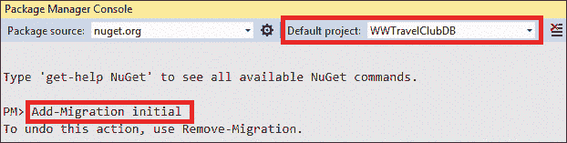

# 8.

# 与 C#实体框架核心中的数据交互

正如我们在*第 5 章**中提到的，将微服务架构应用到企业应用程序*中，软件系统被组织成多个层，每个层通过接口与上一层和下一层进行通信，而不依赖于该层的实现方式。当软件是业务/企业系统时，它通常至少包含三层：数据层、业务层和表示层。通常，每个层提供的接口以及层的实现方式取决于应用程序。

然而，事实证明，数据层提供的功能是相当标准的，因为它们只是将数据从数据存储子系统映射到对象，反之亦然。这导致了通用框架的概念，用于以实质上声明的方式实现数据层。这些工具称为**对象关系映射**（**ORM**工具，因为它们是基于关系数据库的数据存储子系统。但是，它们也可以很好地与分类为 NoSQL 数据库的现代非关系存储（如 MongoDB 和 Azure Cosmos DB）配合使用，因为它们的数据模型比纯关系模型更接近目标对象模型。

在本章中，我们将介绍以下主题：

*   了解 ORM 基础知识
*   配置实体框架核心
*   实体框架核心迁移
*   使用实体框架核心查询和更新数据
*   部署数据层
*   了解实体框架核心高级功能–全局过滤器

本章介绍了 ORM 以及如何配置它们，然后重点介绍实体框架核心，.NET5 中包含的 ORM。

# 技术要求

本章要求安装有所有数据库工具的免费 Visual Studio 2019 社区版或更高版本。

本章中的所有概念都将通过基于 WWTravelClub book 用例的实例加以澄清。您可以在[找到本章的代码 https://github.com/PacktPublishing/Software-Architecture-with-C-9-and-.NET-5](https://github.com/PacktPublishing/Software-Architecture-with-C-9-and-.NET-5) 。

# 了解 ORM 基础知识

ORMs 将关系数据库表映射到对象的内存集合中，其中对象属性对应于数据库表字段。C#中的类型，如布尔型、数值型和字符串，具有相应的 DB 类型。如果 guid 在映射的数据库中不可用，则 guid 等类型将映射到其等效的字符串表示形式。当日期/时间不包含时区信息时，所有日期和时间类型都映射到 C#`DateTime`，当日期/时间也包含显式时区信息时，所有日期和时间类型都映射到`DateTimeOffset`。任何 DB 持续时间都映射到一个`TimeSpan`。最后，单个字符根本不应该映射到 DB 字段。

由于大多数面向对象语言的字符串属性没有与其关联的长度限制（而 DB 字符串字段通常有长度限制），因此在 DB 映射配置中会考虑 DB 限制。通常，当需要指定 DB 类型和面向对象语言类型之间的映射选项时，这些选项将在映射配置中声明。

整个配置的定义方式取决于特定的 ORM。实体框架核心提供三种选择：

*   数据注释（属性属性）
*   名称约定
*   基于配置对象和方法的 fluent 配置界面

虽然 fluent 接口可用于指定任何配置选项，但数据注释和名称约定可用于较小的子集。

就我个人而言，我更喜欢在大多数设置中使用流畅的界面。我只在使用 ID 属性名指定主键时使用名称约定，因为我发现在更复杂的设置中也依赖名称约定是非常危险的。事实上，没有对名称约定进行编译时间检查，因此重新工程操作可能会错误地更改或破坏某些 ORM 设置。

我使用数据注释主要是为了指定属性可能值的约束，例如值的最大长度，或者属性是强制性的且不能为 null。事实上，这些约束限制了每个属性中指定的类型，因此将它们放置在应用它们的属性旁边可以提高代码的可读性。

所有其他设置通过使用 fluent 界面更好地分组和组织，以提高代码可读性和可维护性。

每个 ORM都使用称为**提供者**或**连接器**的 DB 特定适配器来适应特定的 DB 类型（Oracle、MySQL、SQL Server 等）。实体框架核心为大多数可用的 DB 引擎提供了提供者。

完整的供应商列表可在[找到 https://docs.microsoft.com/en-US/ef/core/providers/](https://docs.microsoft.com/en-US/ef/core/providers/) 。

适配器对于数据库类型的差异、处理事务的方式以及 SQL 语言未标准化的所有其他特性都是必需的。

表之间的关系用对象指针表示。例如，在一对多关系中，映射到关系的*一*侧的类包含一个集合，该集合由关系的*多*侧的相关对象填充。另一方面，映射到关系的*多*侧的类有一个简单属性，该属性在关系的*一*侧填充了一个唯一相关的对象。

整个数据库（或只是其中的一部分）由内存缓存类表示，该类包含映射到 DB 表的每个集合的属性。首先，对内存中缓存类的实例执行查询和更新操作，然后将该实例与数据库同步。

实体框架核心使用的内存缓存类称为`DbContext`，它还包含映射配置。更具体地说，特定于应用程序的内存缓存类是通过继承`DbContext`并将其添加到所有映射的集合和所有必要的配置信息中获得的。

综上所述，`DbContext`子类实例包含数据库的部分快照，这些快照与数据库同步以获取/更新实际数据。

DB 查询使用由内存中缓存类集合上的方法调用组成的查询语言执行。实际 SQL 是在同步阶段创建和执行的。例如，实体框架核心对映射到 DB 表的集合执行**语言集成查询**（**LINQ**）。

通常，LINQ 查询会产生`IEnumerable`实例，即当在查询结束时创建`IEnumerable`时，但当您实际尝试从`IEnumerable`检索集合元素时，不会计算其元素的集合。这称为延迟评估或延迟执行。其工作原理如下：

*   从`DbContext`的映射集合开始的 LINQ 查询会创建一个名为`IQueryable`的特定子类型`IEnumerable`。
*   `IQueryable`包含向数据库发出查询所需的所有信息，但实际的 SQL 是在检索`IQueryable`的第一个元素时生成并执行的。
*   通常，每个实体框架查询以一个`ToList`或`ToArray`操作结束，该操作将`IQueryable`转换为一个列表或数组，从而导致在数据库上实际执行查询。
*   如果预期查询只返回单个元素或根本不返回任何元素，我们通常会执行一个返回单个元素（如果有）或`null`的`SingleOrDefault`操作。

此外，更新、删除和向 DB 表中添加新实体都是通过在表示数据库表的`DbContext`集合属性上模拟这些操作来执行的。但是，只有在通过查询将实体加载到该内存集合中后，才能以这种方式更新或删除实体。更新查询要求根据需要修改实体的内存中表示形式，而删除查询要求从其内存中映射的集合中删除实体的内存中表示形式。在实体框架内核中，通过调用集合的`Remove(entity)`方法执行删除操作。

增加一个新实体没有进一步的要求。将新实体添加到内存集合就足够了。对各种内存集合执行的更新、删除和添加实际上通过显式调用 DB 同步方法传递给数据库。

例如，当您调用`DbContext.SaveChanges()`方法时，Entity Framework Core 会将`DbContext`实例上执行的所有更改传递给数据库。

在同步操作期间传递到数据库的更改在单个事务中执行。此外，对于具有事务显式表示的 ORM（如 Entity Framework Core），在事务范围内执行同步操作，因为它使用该事务，而不是创建新事务。

本章剩余部分将解释如何使用 EntityFramework 核心，以及基于本书 WWTravelClub 用例的一些示例代码。

# 配置实体框架核心

由于数据库处理仅限于专用的应用程序层，因此在单独的库中定义实体框架核心（`DbContext`是一种良好的做法。因此，我们需要定义一个.NET 核心类库项目。正如我们在*第 2 章*、*非功能需求*的*一书用例——了解.NET 核心项目*的主要类型中所讨论的，我们有两种不同类型的库项目：**.NET 标准**和**.NET（核心）**。

虽然.NET 核心库与特定的.NET 核心版本相关，但.NET 标准 2.0 库具有广泛的应用，因为它们适用于任何大于 2.0 的.NET 版本以及经典的.NET Framework 4.7.2 及更高版本。

然而，`Microsoft.EntityFrameworkCore`包的版本 5，即.NET5 附带的版本，仅依赖于.NET 标准 2.1。这意味着它不是设计用于特定的.NET（Core）版本，而是需要支持.NET 标准 2.1 的.NET Core 版本。因此，Entity Framework 5 可以与.NET 5 以及任何高于或等于 2.1 的.NET 核心版本一起正常工作。

由于我们的库不是通用库（它只是特定.NET 5 应用程序的一个组件），因此我们不必选择.NET 标准库项目，只需选择.NET 5 库即可。我们的.NET 5 库项目可以按如下方式创建和准备：

1.  打开 Visual Studio 并定义一个名为`WWTravelClubDB`的新解决方案，然后选择**类库（.NET Core）**以获得可用的最新.NET Core 版本。
2.  我们必须安装所有与实体框架核心相关的依赖项。安装所有必需的依赖项的最简单方法是为我们将要使用的数据库引擎的提供者添加 NuGet 包——在我们的例子中是 SQL Server——正如我们在*第 4 章*中提到的，*决定最佳的基于云的解决方案*。事实上，任何提供者都将安装所有必需的软件包，因为它们都是依赖项。那么，让我们添加`Microsoft.EntityFrameworkCore.SqlServer`的最新稳定版本。如果计划使用多个数据库引擎，还可以添加其他提供程序，因为它们可以并排工作。在本章后面，我们将安装其他 NuGet 软件包，其中包含处理实体框架核心所需的工具。然后，我们将解释如何安装处理实体框架核心配置所需的其他工具。
3.  让我们将默认的`Class1`类重命名为`MainDbContext`。这将自动添加到类库中。
4.  现在，我们将其内容替换为以下代码：

    ```cs
    using System;
    using Microsoft.EntityFrameworkCore;
    namespace WWTravelClubDB
    {
        public class MainDbContext: DbContext
        {
            public MainDbContext(DbContextOptions options)
                : base(options)
            {
            }
            protected override void OnModelCreating(ModelBuilder 
            builder)
            {
            } 
        }
    } 
    ```

5.  我们从`DbContext`继承，需要将`DbContextOptions`传递给`DbContext`构造函数。`DbContextOptions`包含数据库连接字符串等创建选项，具体取决于目标数据库引擎。
6.  所有映射到数据库表的集合都将添加为`MainDbContext`的属性。映射配置将在作为参数传递的`ModelBuilder`对象的帮助下在重写的`OnModelCreating`方法中定义。

下一步是创建表示所有 DB 表行的所有类。这些被称为**实体**。我们需要为每个要映射的 DB 表提供一个实体类。让我们在项目根目录中为它们创建一个`Models`文件夹。下一小节将解释如何定义所有必需的实体。

## 定义数据库实体

数据库设计与整个应用程序设计一样，是以迭代的方式组织的。让我们假设，在第一次迭代中，我们需要一个具有两个数据库表的原型：一个用于所有旅行包，另一个用于包引用的所有位置。每个包只包含一个位置，而单个位置可能包含多个包，因此两个表通过一对多关系连接。

那么，让我们从位置数据库表开始。正如我们在上一节末尾提到的，我们需要一个实体类来表示这个表的行。让我们调用`Destination`实体类：

```cs
namespace WWTravelClubDB.Models
{
    public class Destination
    {
        public int Id { get; set; }
        public string Name { get; set; }
        public string Country { get; set; }
        public string Description { get; set; }
    }
} 
```

所有 DB 字段必须由读/写 C#属性表示。假设每个目的地类似于一个城镇或地区，可以通过其名称和所在国家来定义，并且所有相关信息都包含在其`Description`中。在未来的迭代中，我们可能会添加更多的字段。`Id`是自动生成的密钥。

但是，现在，我们需要添加有关如何将所有字段映射到 DB 字段的信息。在 EntityFrameworkCore 中，所有原语类型都由所使用的特定于 DB 引擎的提供程序（在我们的示例中是 SQL Server 提供程序）自动映射到 DB 类型。

我们唯一关心的问题如下：

*   **字符串**的长度限制：可以通过对每个字符串属性应用足够的`MaxLength`和`MinLength`属性来考虑这些限制。所有对实体配置有用的属性都包含在`System.ComponentModel.DataAnnotations`和`System.ComponentModel.DataAnnotations.Schema`名称空间中。因此，将这两个元素都添加到所有实体定义中是一个很好的做法。
*   **指定哪些字段是必填字段，哪些字段是可选字段**：如果项目未使用新的可空引用类型功能，默认情况下，所有引用类型（例如所有字符串）都假定为可选字段，而所有值类型（例如数字和 GUID）都假定为必填字段。如果我们希望引用类型是强制性的，那么我们必须用`Required`属性来修饰它。另一方面，如果我们希望`T`类型属性是可选的，并且`T`是值类型，或者启用了可空引用类型特性，那么我们必须将`T`替换为`T?`。
*   **指定哪个属性表示主键**：可以通过使用`Key`属性装饰属性来指定该键。但是，如果没有找到`Key`属性，则将名为`Id`（如果有）的属性作为主键。在我们的例子中，不需要使用`Key`属性。

由于每个目的地位于一对多关系的*一*侧，因此必须包含相关包实体的集合；否则，我们将无法在 LINQ 查询的子句中引用相关的实体。

综合所有内容，`Destination`类的最终版本如下：

```cs
using System.Collections.Generic;
using System.ComponentModel.DataAnnotations;
using System.ComponentModel.DataAnnotations.Schema;
namespace WWTravelClubDB.Models
{
    public class Destination
    {
        public int Id { get; set; }
        [MaxLength(128), Required]
        public string Name { get; set; }
        [MaxLength(128), Required]
        public string Country { get; set; }
        public string Description { get; set; }
        public ICollection<Package> Packages { get; set; }
    }
} 
```

由于`Description`属性没有长度限制，因此将使用长度不定的 SQL Server`nvarchar(MAX)`字段实现。我们可以用类似的方式为`Package`类编写代码：

```cs
using System;
using System.ComponentModel.DataAnnotations;
using System.ComponentModel.DataAnnotations.Schema;
namespace WWTravelClubDB.Models
{
    public class Package
    {
        public int Id { get; set; }
        [MaxLength(128), Required]
        public string Name { get; set; }
        [MaxLength(128)]
        public string Description { get; set; }
        public decimal Price { get; set; }
        public int DurationInDays { get; set; }
        public DateTime? StartValidityDate { get; set; }
        public DateTime? EndValidityDate { get; set; }
        public Destination MyDestination { get; set; }
        public int DestinationId { get; set; }
    }
} 
```

每个套餐都有以天为单位的持续时间，以及套餐优惠有效的可选开始和停止日期。`MyDestination`以与`Destination`实体的多对一关系将包与其目的地连接，而`DestinationId`是同一关系的外部键。

虽然没有义务指定外部键，但这样做是一种良好的实践，因为这是指定关系某些属性的唯一方法。例如，在我们的例子中，因为`DestinationId`是`int`（值类型），所以它是必须的。因此，这里的关系是一对多，而不是（0，1）-对多。将`DestinationId`定义为`int?`而不是`int`，将使一对多关系变成（0，1）-对多关系。此外，正如我们将在本章后面看到的，外键的显式表示大大简化了更新操作和一些查询。

在下一节中，我们将解释如何定义表示数据库表的内存中集合。

## 定义映射的集合

定义了数据库行的所有面向对象表示的实体之后，我们需要定义表示数据库表本身的内存集合。正如我们在*理解 ORM 基础*一节中提到的，所有数据库操作都映射到这些集合上的操作（本章*使用实体框架核心*一节解释了如何查询和更新数据）。对于每个实体`T`，在我们的`DbContext`中添加`DbSet<T>`集合属性就足够了。通常，这些属性的名称都是通过实体名称的复数形式获得的。因此，我们需要在`MainDbContext`中添加以下两个属性：

```cs
public DbSet<Package> Packages { get; set; }
public DbSet<Destination> Destinations { get; set; } 
```

到目前为止，我们已经将数据库内容转换为属性、类和数据注释。然而，实体框架需要更多的信息来与数据库交互。下一小节将解释如何提供它。

## 完成映射配置

实体定义中无法指定的映射配置信息必须在`OnModelCreating DbContext`方法中添加。与实体`T`相关的每个配置信息都以`builder.Entity<T>()`开头，然后调用指定类型约束的方法。进一步的嵌套调用指定约束的进一步属性。例如，我们的一对多关系可以配置如下：

```cs
builder.Entity<Destination>()
    .HasMany(m => m.Packages)
    .WithOne(m => m.MyDestination)
    .HasForeignKey(m => m.DestinationId)
    .OnDelete(DeleteBehavior.Cascade); 
```

关系的双方通过我们添加到实体中的导航属性来指定。`HasForeignKey`指定外部键。最后，`OnDelete`指定删除目标时如何处理包。在我们的例子中，它执行与该目的地相关的所有包的级联删除。

同一配置可以从关系的另一端开始定义，即从`builder.Entity<Package>()`开始：

```cs
builder.Entity<Package>()
    .HasOne(m => m.MyDestination)
    .WithMany(m => m.Packages)
    .HasForeignKey(m => m.DestinationId)
    .OnDelete(DeleteBehavior.Cascade); 
```

唯一的区别是前面语句的`HasMany-WithOne`方法被`HasOne-WithMany`方法所取代，因为我们从关系的另一端开始。在这里，我们还可以选择每个十进制属性在其映射的数据库字段中表示的精度。默认情况下，小数由 18 位数字和 2 位小数表示。您可以通过以下方式更改每个属性的此设置：

```cs
...
.Property(m => m.Price)
        .HasPrecision(10, 3); 
```

`ModelBuilder builder`对象允许我们使用以下内容指定数据库索引：

```cs
builder.Entity<T>()
   .HasIndex(m => m.PropertyName); 
```

多属性索引定义如下：

```cs
builder.Entity<T>()
    .HasIndex("propertyName1", "propertyName2", ...); 
```

从版本 5 开始，还可以使用应用于类的属性定义索引。以下是单个属性索引的情况：

```cs
[Index(nameof(Property), IsUnique = true)]
public class MyClass
{
    public int Id { get; set; }
    [MaxLength(128)]
    public string Property { get; set; }
} 
```

以下是多属性索引的情况：

```cs
[Index(nameof(Property1), nameof(Property2), IsUnique = false)]
public class MyComplexIndexClass
{
    public int Id { get; set; }
    [MaxLength(64)]
    public string Property1 { get; set; }
    [MaxLength(64)]
    public string Property2 { get; set; }
} 
```

如果我们添加所有必要的配置信息，那么我们的`OnModelCreating`方法如下：

```cs
protected override void OnModelCreating(ModelBuilder builder)
{
    builder.Entity<Destination>()
        .HasMany(m => m.Packages)
        .WithOne(m => m.MyDestination)
        .HasForeignKey(m => m.DestinationId)
        .OnDelete(DeleteBehavior.Cascade);
    builder.Entity<Destination>()
        .HasIndex(m => m.Country);
    builder.Entity<Destination>()
        .HasIndex(m => m.Name);
    builder.Entity<Package>()
        .HasIndex(m => m.Name);
    builder.Entity<Package>()
        .HasIndex(nameof(Package.StartValidityDate),
                  nameof(Package.EndValidityDate));
} 
```

前面的示例显示了一对多关系，但实体框架 Core 5 也支持多对多关系：

```cs
 modelBuilder
        .Entity<Teacher>()
        .HasMany(e => e.Classrooms)
        .WithMany(e => e.Teachers) 
```

在前面的案例中，连接实体和数据库连接表是自动创建的，但您也可以将现有实体指定为连接实体。在上一个示例中，连接实体可能是教师在每个教室教授的课程：

```cs
modelBuilder
  Entity<Teacher>()
  .HasMany(e => e.Classrooms)
  .WithMany(e => e.Teachers)
      .UsingEntity<Course>(
           b => b.HasOne(e => e.Teacher).WithMany()
           .HasForeignKey(e => e.TeacherId),
           b => b.HasOne(e => e.Classroom).WithMany()
           .HasForeignKey(e => e.ClassroomId)); 
```

一旦您配置了 EntityFrameworkCore，我们就可以使用所有必须的配置信息来创建实际的数据库，并将所有需要的工具放置到位，以便随着应用程序的发展更新数据库的结构。下一节将解释如何进行。

# 实体框架核心迁移

现在我们已经配置了实体框架并定义了特定于应用程序的`DbContext`子类，我们可以使用实体框架核心设计工具生成物理数据库并创建实体框架核心与数据库交互所需的数据库结构快照。

实体框架核心设计工具必须作为 NuGet 软件包安装在每个需要它们的项目中。有两个等效选项：

*   **可在任何 Windows 控制台**中使用的工具：这些工具可通过`Microsoft.EntityFrameworkCore.Design`NuGet 软件包获得。所有实体框架核心命令都采用`dotnet ef .....`格式，因为它们包含在`ef`命令行的.NET 核心应用程序中。
*   **特定于 Visual Studio 软件包管理器控制台的工具**：这些工具包含在`Microsoft.EntityFrameworkCore.Tools`NuGet 软件包中。它们不需要`dotnet ef`前缀，因为它们只能从 Visual Studio 内部的**包管理器控制台**启动。

实体框架核心的设计工具在设计/更新过程中使用。该程序如下：

1.  我们根据需要修改`DbContext`和实体的定义。
2.  我们启动设计工具，要求实体框架核心检测和处理我们所做的所有更改。
3.  一旦启动，设计工具将更新数据库结构快照并生成一个新的*迁移*，也就是说，一个包含我们需要的所有指令的文件，以便修改物理数据库以反映我们所做的所有更改。
4.  我们启动另一个工具，用新创建的迁移更新数据库。
5.  我们测试新配置的 DB 层，如果需要新的更改，我们返回到*步骤 1*。
6.  当数据层准备就绪时，它将部署到暂存或生产中，所有迁移将再次应用到实际的暂存/生产数据库中。

在各种软件项目迭代和应用程序的生命周期中，这会重复多次。

如果我们操作一个已经存在的数据库，我们需要配置`DbContext`及其模型，以反映我们想要映射的所有表的现有结构。然后，如果我们想开始使用迁移，而不是继续直接更改数据库，我们可以使用`IgnoreChanges`选项调用设计工具，以便它们生成空迁移。此外，此空迁移必须传递到物理数据库，以便它可以将与物理数据库关联的数据库结构版本与数据库快照中记录的版本同步。此版本很重要，因为它决定了哪些迁移必须应用于数据库，哪些迁移已经应用。

整个设计过程需要一个测试/设计数据库，如果我们在现有数据库上操作，该测试/设计数据库的结构必须反映实际数据库–至少在我们想要映射的表方面。为了使设计工具能够与数据库交互，我们必须定义传递给`DbContext`构造函数的`DbContextOptions`选项。这些选项在设计时非常重要，因为它们包含测试/设计数据库的连接字符串。如果我们创建一个实现`IDesignTimeDbContextFactory<T>`接口的类，`T`是我们的`DbContext`子类，则可以告知设计工具我们的`DbContextOptions`选项：

```cs
using Microsoft.EntityFrameworkCore;
using Microsoft.EntityFrameworkCore.Design;
namespace WWTravelClubDB
{
    public class LibraryDesignTimeDbContextFactory
        : IDesignTimeDbContextFactory<MainDbContext>
    {
        private const string connectionString =
            @"Server=(localdb)\mssqllocaldb;Database=wwtravelclub;
                Trusted_Connection=True;MultipleActiveResultSets=true";
        public MainDbContext CreateDbContext(params string[] args)
        {
            var builder = new DbContextOptionsBuilder<MainDbContext>();

            builder.UseSqlServer(connectionString);
            return new MainDbContext(builder.Options);
        }
    }
} 
```

实体框架将使用`connectionString`在本地 SQL Server 实例中创建一个新数据库，该实例已安装在开发机器中，并与 Windows 凭据连接。您可以自由更改它以反映您的需要。

现在，我们已经准备好创建第一次迁移！让我们开始：

1.  让我们转到**包管理器控制台**并确保选择**WWTravelClubDB**作为我们的默认项目。
2.  Now, type `Add-Migration initial` and press Enter to issue this command. Verify that you added the `Microsoft.EntityFrameworkCore.Tools` NuGet package before issuing this command, otherwise you might get an "unrecognized command" error:

    <figure class="mediaobject"></figure>

    图 8.1：添加第一次迁移

    `initial`是我们第一次迁移的名字。所以，一般来说，这个命令是`Add-Migration <migration name>`。当我们对现有数据库进行操作时，我们必须将`-IgnoreChanges`选项添加到第一次迁移中（仅此而已），以便创建一个空迁移。在*进一步阅读*一节中可以找到对整套命令的引用。

3.  如果在创建迁移之后，但在将迁移应用到数据库之前，我们意识到我们犯了一些错误，那么我们可以使用`Remove-Migration`命令撤消我们的操作。如果迁移已经应用于数据库，那么纠正错误的最简单方法是对代码进行所有必要的更改，然后应用另一个迁移。
4.  执行`Add-Migration`命令后，我们的项目中会出现一个新文件夹：

    <figure class="mediaobject"></figure>

图 8.2：添加迁移命令创建的文件

`20201008150827_initial.cs`我们的迁移是用一种易懂的语言表达的。

您可以查看代码以验证一切正常，还可以修改迁移内容（只有在您足够专业、能够可靠地完成迁移的情况下）。每次迁移包含一个`Up`方法和一个`Down`方法。`Up`方法意味着迁移，而`Down`方法撤销其更改。因此，`Down`方法按相反顺序包含`Up`方法中包含的所有动作的反向动作。

`20201008150827_initial.Designer.cs`是您*不能*修改的 Visual Studio designer 代码，`MainDBContextModelSnapshot.cs`是整体数据库结构快照。如果添加进一步的迁移，将显示新的迁移文件及其设计器对应文件，并且将更新唯一的`MainDBContextModelSnapshot.cs`数据库结构快照，以反映数据库的整体结构。

在 Windows 控制台中键入`dotnet ef migrations add initial`可以发出相同的命令。但是，此命令必须从项目的根文件夹中发出（而不是从解决方案的根文件夹中发出）。

可以通过在 Package Manager 控制台中键入`Update-Database`将迁移应用于数据库。等效的 Windows 控制台命令为`dotnet ef database update`。让我们尝试使用此命令创建物理数据库！

下一小节将解释如何创建实体框架无法自动创建的数据库内容。之后，在下一节中，我们将使用实体框架的配置和使用`dotnet ef database update`生成的数据库来创建、查询和更新数据。

## 了解存储过程和直接 SQL 命令

一些数据库结构，例如存储过程，不能由我们前面描述的实体框架核心命令和声明自动生成。可以通过`migrationBuilder.Sql("<sql scommand>")`方法手动将通用 SQL 字符串等存储过程包含在`Up`和`Down`方法中。

最安全的方法是在不执行任何配置更改的情况下添加迁移，以便在创建迁移时迁移为空。然后，我们可以将必要的 SQL命令添加到本次迁移的空`Up`方法中，并在空`Down`方法中添加它们的相反命令。最好将所有 SQL 字符串放在资源文件（`.resx`文件）的属性中。

现在，您已经准备好通过实体框架核心与数据库交互。

# 使用实体框架核心查询和更新数据

为了测试我们的 DB 层，我们需要在解决方案中添加一个基于与我们的库相同的.NET 核心版本的控制台项目。让我们开始：

1.  让我们调用新的控制台项目`WWTravelClubDBTest`。
2.  现在，我们需要通过右键点击控制台项目的**引用**节点并选择**添加引用**来添加我们的数据层作为控制台项目的依赖项。
3.  删除`program.cs`文件中`Main`静态方法的内容，并开始写入以下内容：

    ```cs
    Console.WriteLine("program start: populate database, press a key to continue");
    Console.ReadKey(); 
    ```

4.  然后，在文件顶部添加以下名称空间：

    ```cs
    using WWTravelClubDB;
    using WWTravelClubDB.Models;
    using Microsoft.EntityFrameworkCore;
    using System.Linq; 
    ```

现在我们已经完成了测试项目的准备工作，我们可以尝试查询和数据更新。让我们首先创建一些数据库对象，即一些目的地和包。请按照以下步骤执行此操作：

1.  首先，我们必须使用适当的连接字符串创建`DbContext`子类的实例。我们可以使用与设计工具相同的`LibraryDesignTimeDbContextFactory`类来获得它：

    ```cs
    var context = new LibraryDesignTimeDbContextFactory()
        .CreateDbContext(); 
    ```

2.  只需将类实例添加到我们`DbContext`子类的映射集合中，即可创建新行。如果`Destination`实例有与其关联的包，我们只需将它们添加到其`Packages`属性

    ```cs
    var firstDestination= new Destination
    {
        Name = "Florence",
        Country = "Italy",
        Packages = new List<Package>()
        {
            new Package
            {
                Name = "Summer in Florence",
                StartValidityDate = new DateTime(2019, 6, 1),
                EndValidityDate = new DateTime(2019, 10, 1),
                DurationInDays=7,
                Price=1000
            },
            new Package
            {
                Name = "Winter in Florence",
                StartValidityDate = new DateTime(2019, 12, 1),
                EndValidityDate = new DateTime(2020, 2, 1),
                DurationInDays=7,
                Price=500
            }
        }
    };
    context.Destinations.Add(firstDestination);
    context.SaveChanges();
    Console.WriteLine(
        "DB populated: first destination id is "+
        firstDestination.Id);
    Console.ReadKey(); 
    ```

    中即可

不需要指定主键，因为它们是自动生成的，将由数据库填充。事实上，`SaveChanges()`操作将上下文与实际 DB 同步后，`firstDestination.Id`属性具有非零值。`Package`的主键也是如此。

当我们通过将一个实体（在我们的例子中为`Package`）插入父实体集合（在我们的例子中为`Packages`集合）来声明它是另一个实体（在我们的例子中为`Destination`）的子实体时，不需要显式设置它的外部键（在我们的例子中为`DestinationId`，因为它是由实体框架核心自动推断的。一旦创建并与`firstDestination`数据库同步，我们可以通过两种不同的方式添加更多的包：

*   创建一个`Package`类实例，将其`DestinationId`外键设置为`firstDestinatination.Id`并添加到`context.Packages`
*   创建一个`Package`类实例，无需设置其外键，然后将其添加到其父`Destination`实例的`Packages`集合中。

当子实体（`Package`与其父实体（`Destination`）一起添加并且父实体具有自动生成的主密钥时，后一个选项是唯一的可能性，因为在这种情况下，在我们执行添加时外部密钥不可用。在大多数其他情况下，前一个选项更简单，因为第二个选项要求父`Destination`实体连同其`Packages`集合一起加载到内存中，也就是说，与`Destination`对象关联的所有包一起加载（默认情况下，查询不会加载连接的实体）。

现在，假设我们想修改*佛罗伦萨*目的地，并给所有`Florence`套餐价格增加 10%。我们如何进行？按照以下步骤了解如何：

1.  首先，注释掉之前所有填充数据库的指令，同时保留`DbContext`创建指令。
2.  Then, we need to load the entity into memory with a query, modify it, and call `SaveChanges()` to synchronize our changes with the database.

    如果我们只想修改（比如）它的描述，下面这样的查询就足够了：

    ```cs
    var toModify = context.Destinations
        .Where(m => m.Name == "Florence").FirstOrDefault(); 
    ```

3.  我们需要加载默认情况下未加载的所有相关目标包。这可以通过`Include`子句完成，如下所示：

    ```cs
    var toModify = context.Destinations
        .Where(m => m.Name == "Florence")
        .Include(m => m.Packages)
        .FirstOrDefault(); 
    ```

4.  之后，我们可以修改说明和包装价格，如下所示：

    ```cs
    toModify.Description = 
      "Florence is a famous historical Italian town";
    foreach (var package in toModify.Packages)
       package.Price = package.Price * 1.1m;
    context.SaveChanges();
    var verifyChanges= context.Destinations
        .Where(m => m.Name == "Florence")
        .FirstOrDefault();
    Console.WriteLine(
        "New Florence description: " +
        verifyChanges.Description);
    Console.ReadKey(); 
    ```

如果`Include`方法包含的实体本身包含我们希望包含的嵌套集合，我们可以使用`ThenInclude`，如下所示：

```cs
.Include(m => m.NestedCollection)
.ThenInclude(m => m.NestedNestedCollection) 
```

由于实体框架总是试图在单个 SQL 查询中转换每个 LINQ，因此有时生成的查询可能过于复杂和缓慢。在这种情况下，从版本 5 开始，我们可以授予 Entity Framework 将 LinQ 查询拆分为多个 SQL 查询的权限，如下所示：

```cs
.AsSplitQuery().Include(m => m.NestedCollection)
.ThenInclude(m => m.NestedNestedCollection) 
```

通过使用`ToQueryString`方法检查 LinQ 查询生成的 SQL，可以解决性能问题：

```cs
var mySQL = myLinQQuery.ToQueryString (); 
```

从版本 5 开始，包含的嵌套集合也可以用`Where`进行过滤，如下图：

```cs
.Include(m => m.Packages.Where(l-> l.Price < x)) 
```

到目前为止，我们已经执行了查询，其唯一目的是更新检索到的实体。接下来，我们将解释如何检索将显示给用户和/或由复杂业务操作使用的信息。

## 将数据返回到表示层

为了使各层保持分离，并使查询适应每个*用例*实际需要的数据，DB 实体不会像发送到表示层那样发送。相反，数据被投影到更小的类中，这些类包含*用例*所需的信息。这些都是通过层的调用者方法实现的。将数据从一层移动到另一层的对象称为**数据传输对象**（**DTOs**。例如，让我们创建一个 DTO，其中包含在将包列表返回给用户时值得显示的摘要信息（我们假设，如果需要，用户可以通过单击他们感兴趣的包来获得更多详细信息）：

1.  Let's add a DTO to our WWTravelClubDBTest project that contains all the information that needs to be shown in a list of packages:

    ```cs
    namespace WWTravelClubDBTest
    {
        public class PackagesListDTO
        {
            public int Id { get; set; }
            public string Name { get; set; }
            public decimal Price { get; set; }
            public int DurationInDays { get; set; }
            public DateTime? StartValidityDate { get; set; }
            public DateTime? EndValidityDate { get; set; }
            public string DestinationName { get; set; }
            public int DestinationId { get; set; }
            public override string ToString()
            {
                return string.Format("{0}. {1} days in {2}, price: 
                {3}", Name, DurationInDays, DestinationName, Price);
            }
        }
    } 
    ```

    我们不需要在内存中加载实体，然后将它们的数据复制到 DTO 中，但由于 LINQ`Select`子句，数据库数据可以直接投影到 DTO 中。这将最小化与数据库交换的数据量。

2.  作为一个示例，我们可以用一个查询填充 DTO，该查询检查 8 月 10 日左右可用的所有软件包：

    ```cs
    var period = new DateTime(2019, 8, 10);
    var list = context.Packages
        .Where(m => period >= m.StartValidityDate
        && period <= m.EndValidityDate)
        .Select(m => new PackagesListDTO
        {
            StartValidityDate=m.StartValidityDate,
            EndValidityDate=m.EndValidityDate,
            Name=m.Name,
            DurationInDays=m.DurationInDays,
            Id=m.Id,
            Price=m.Price,
            DestinationName=m.MyDestination.Name,
            DestinationId = m.DestinationId
        })
        .ToList();
    foreach (var result in list)
        Console.WriteLine(result.ToString());
    Console.ReadKey(); 
    ```

3.  在`Select`子句中，我们还可以导航到任何相关实体以获取我们需要的数据。例如，前面的查询导航到相关的`Destination`实体以获取`Package`目的地名称。
4.  程序在每个`Console.ReadKey()`方法处停止，等待您按任意键。这样，您就有时间分析我们添加到`Main`方法中的所有代码片段生成的输出。
5.  现在，在解决方案资源管理器中右键单击WWTravelClubTest 项目，并将其设置为启动项目。然后，运行解决方案。

现在，我们将学习如何处理无法有效映射到表示数据库表的内存集合中的即时操作的操作。

## 发出直接 SQL 命令

通过使用 LINQ 查询数据库并更新内存中的实体，并不是所有的数据库操作都可以有效地执行。例如，使用单个 SQL 指令可以更有效地执行计数器增量。此外，如果我们定义足够的存储过程/SQL 命令，某些操作可以以可接受的性能执行。在这些情况下，我们被迫向数据库发出直接 SQL 命令，或者从实体框架代码调用数据库存储过程。有两种可能：执行数据库操作但不返回实体的 SQL 语句和返回实体的 SQL 语句。

不返回实体的 SQL 命令可以通过`DbContext`方法执行，如下所示：

```cs
int DbContext.Database.ExecuteSqlRaw(string sql, params object[] parameters) 
```

参数可以在字符串中引用为`{0}, {1}, ..., {n}`。每个`{m}`都被包含在`parameters`数组的`m`索引中的对象填充，该对象从.NET 类型转换为相应的 SQL 类型。该方法返回受影响的行数。

返回实体集合的 SQL 命令必须通过与这些实体关联的映射集合的`FromSqlRaw`方法发出：

```cs
context.<mapped collection>.FromSqlRaw(string sql, params object[] parameters) 
```

因此，例如，返回`Package`实例的命令如下所示：

```cs
var results = context.Packages.FromSqlRaw("<some sql>", par1, par2, ...).ToList(); 
```

SQL 字符串和参数在`ExecuteSqlRaw`方法中是这样工作的。以下是一个简单的例子：

```cs
var allPackages =context.Packages.FromSqlRaw(
    "SELECT * FROM Products WHERE Name = {0}",
    myPackageName) 
```

最好将所有 SQL 字符串放在资源文件中，并将所有的`ExecuteSqlRaw`和`FromSqlRaw`调用封装在`DbContext`子类中定义的公共方法中，以保持对实体框架核心数据层中特定数据库的依赖。

## 处理交易

对`DbContext`实例所做的所有更改在第一次`SaveChanges`调用时在单个事务中传递。但是，有时需要在同一事务中包含查询和更新。在这些情况下，我们必须显式地处理事务。如果我们将多个实体框架核心命令放在与事务对象关联的`using`块中，那么它们可以包含在事务中：

```cs
using (var dbContextTransaction = context.Database.BeginTransaction())
try{
   ...
   ...
   dbContextTransaction.Commit();
 }
 catch
 {
   dbContextTransaction.Rollback();
 } 
```

在前面的代码中，`context`是我们的`DbContext`子类的一个实例。在`using`块内部，可以通过调用其`Rollback`和`Commit`方法中止和提交事务。事务块中包含的任何`SaveChanges`调用都会使用它们已经在其中的事务，而不是创建新的事务。

# 部署数据层

当您的数据库层部署在生产或暂存中时，通常已经存在一个空数据库，因此您必须应用所有迁移以创建所有数据库对象。这可以通过调用`context.Database.Migrate()`来完成。`Migrate`方法应用尚未应用到数据库的迁移，因此在应用程序的生命周期内可以安全地调用多次。`context`是我们的`DbContext`类的一个实例，它必须通过一个具有足够权限的连接字符串来创建表并执行迁移中包含的所有操作。因此，通常，此连接字符串不同于我们在正常应用程序操作期间使用的字符串。

在 Azure 上部署 web 应用程序期间，我们有机会使用我们提供的连接字符串检查迁移。我们也可以在应用程序启动时通过调用`context.Database.Migrate()`方法手动检查迁移。这将在*第 15 章*中进行详细讨论，*介绍 ASP.NET 核心 MVC*，它专门用于 ASP.NET MVC web 应用程序。

对于桌面应用程序，我们可以在安装应用程序及其后续更新期间应用迁移。

在第一次安装应用程序和/或在后续的应用程序更新中，我们可能需要用初始数据填充一些表。对于 web 应用程序，此操作可以在应用程序启动时执行，而对于桌面应用程序，此操作可以包含在安装中。

可以使用实体框架核心命令填充数据库表。不过，首先，我们需要验证表是否为空，以避免多次添加相同的表行。这可以通过`Any()`LINQ 方法完成，如下代码所示：

```cs
if(!context.Destinations.Any())
{
    //populate here the Destinations table
} 
```

让我们来看看实体框架核心必须共享的一些高级特性。

# 了解实体框架的核心高级功能

值得一提的一个有趣的实体框架高级功能是 global filters，于 2017 年底推出。它们支持软删除和多租户表等由多个用户共享的技术，其中每个用户只需*查看*其记录。

全局过滤器是用`modelBuilder`对象定义的，该对象在`DbContext``OnModelCreating`方法中可用。此方法的语法如下所示：

```cs
modelBuilder.Entity<MyEntity>().HasQueryFilter(m => <define filter condition here>); 
```

例如，如果我们将一个`IsDeleted`属性添加到`Package`类中，我们可以通过定义以下过滤器来软删除一个`Package`，而无需将其从数据库中删除：

```cs
modelBuilder.Entity<Package>().HasQueryFilter(m => !m.IsDeleted); 
```

但是，过滤器包含`DbContext`属性。因此，例如，如果我们将`CurrentUserID`属性添加到`DbContext`子类（其值在`DbContext`实例创建后立即设置），那么我们可以向引用用户 ID 的所有实体添加如下过滤器：

```cs
modelBuilder.Entity<Document>().HasQueryFilter(m => m.UserId == CurrentUserId); 
```

使用前面的过滤器后，当前登录的用户只能访问他们自己的文档（那些有`UserId`的文档）。类似的技术在多租户应用程序的实现中非常有用。

另一个值得一提的有趣特性是将实体映射到不可更新的数据库查询，这是在版本 5 中引入的。

定义实体时，可以显式定义映射数据库表的名称或映射的可更新视图的名称：

```cs
 modelBuilder.Entity<MyEntity1>().ToTable("MyTable");
 modelBuilder.Entity<MyEntity2>().ToView("MyView"); 
```

当实体映射到视图时，数据库迁移不会生成任何表，因此数据库视图必须由开发人员手动定义。

如果我们想要映射出实体的视图不可更新，LinQ 将无法使用它将更新传递给数据库。在这种情况下，我们可以将同一实体同时映射到视图和表：

```cs
modelBuilder.Entity<MyEntity>().ToTable("MyTable").ToView("MyView"); 
```

实体框架将使用视图进行查询，使用表进行更新。当我们创建数据库表的较新版本时，这非常有用，但我们也希望在所有查询中从旧版本的表中获取数据。在这种情况下，我们可以定义一个视图，该视图从旧表和新表中获取数据，但只在新表上传递所有更新。

# 总结

在本章中，我们介绍了 ORM 基础的要点以及它们为什么如此有用。然后，我们描述了实体框架核心。特别是，我们讨论了如何使用类注释以及`DbContext`子类中包含的其他声明和命令配置数据库映射。

然后，我们讨论了如何借助迁移自动创建和更新物理数据库结构，以及如何通过 Entity Framework Core 查询和传递更新到数据库。最后，我们学习了如何通过实体框架核心传递直接 SQL 命令和事务，以及如何部署基于实体框架核心的数据层。

本章还回顾了最新 Entity Framework 核心版本中引入的两个高级功能。

在下一章中，我们将讨论 Entity Framework Core 如何与 NoSQL 数据模型一起使用，以及在云中，特别是 Azure 中可用的各种类型的存储选项。

# 问题

1.  实体框架核心如何适应几种不同的数据库引擎？
2.  如何在实体框架核心中声明主键？
3.  如何在实体框架核心中声明字符串字段的长度？
4.  实体框架核心中的索引是如何声明的？
5.  如何在实体框架核心中声明关系？
6.  两个重要的迁移命令是什么？
7.  默认情况下，相关实体是否由 LINQ 查询加载？
8.  是否可以在不是数据库实体的类实例中返回数据库数据？如果是，如何进行？
9.  如何在生产和暂存中应用迁移？

# 进一步阅读

*   有关迁移命令的更多详细信息，请参见[https://docs.microsoft.com/en-US/ef/core/miscellaneous/cli/index](https://docs.microsoft.com/en-US/ef/core/miscellaneous/cli/index) 以及其中包含的其他链接。
*   有关实体框架核心的更多详细信息，请参见 Microsoft 官方文档：[https://docs.microsoft.com/en-us/ef/core/](https://docs.microsoft.com/en-us/ef/core/) 。
*   这里可以找到一组详尽的复杂 LINQ 查询示例：[https://code.msdn.microsoft.com/101-LINQ-Samples-3fb9811b](https://code.msdn.microsoft.com/101-LINQ-Samples-3fb9811b) 。