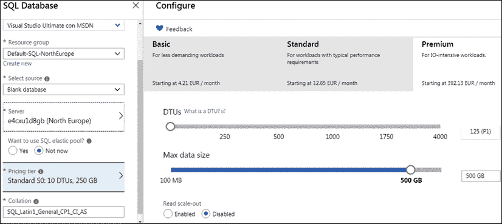
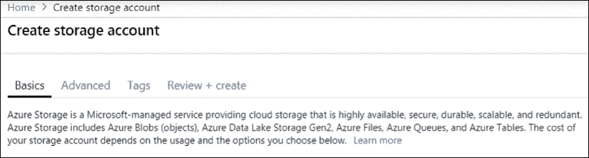
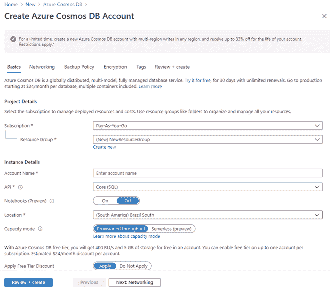
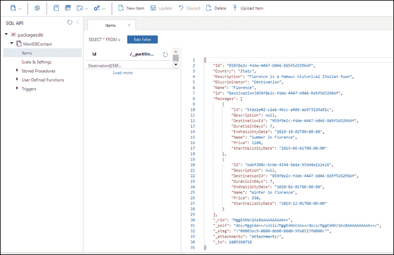

# 9

# 如何选择云中的数据存储

Azure 和其他云一样，提供了广泛的存储设备。最简单的方法是定义一组托管在云中的可扩展虚拟机，我们可以在其中实现自定义解决方案。例如，我们可以在云托管虚拟机上创建 SQL Server 群集，以提高可靠性和计算能力。然而，通常情况下，定制架构并不是最佳解决方案，也没有充分利用云基础设施提供的机会。

因此，本章将不讨论此类定制架构，而是主要关注云和 Azure 上可用的各种**平台即服务**（**PaaS**存储产品。这些产品包括基于普通磁盘空间、关系数据库、NoSQL 数据库和内存数据存储（如 Redis）的可扩展解决方案。

选择更合适的存储类型不仅要基于应用程序的功能需求，还要基于性能和扩展需求。事实上，虽然在处理资源时向外扩展会导致性能的线性提高，但向外扩展存储资源并不一定意味着性能的可接受提高。简而言之，无论您复制了多少数据存储设备，如果多个请求影响相同的数据块，它们将始终排队等待相同的时间来访问它！

向外扩展数据会导致读取操作吞吐量线性增加，因为每个副本都可以服务于不同的请求，但这并不意味着写入操作的吞吐量增加相同，因为同一数据块的所有副本都必须更新！因此，需要更复杂的技术来扩展存储设备，而且并非所有存储引擎都能同样好地扩展。

关系数据库在所有场景中都不能很好地扩展。因此，在选择存储引擎和 SaaS 产品时，扩展需求和按地理位置分布数据的需求起着至关重要的作用。

在本章中，我们将介绍以下主题：

*   为了不同的目的理解不同的存储库
*   选择关系存储还是 NoSQL 存储
*   Azure Cosmos DB–管理多大陆数据库的机会
*   用例–存储数据

让我们开始吧！

# 技术要求

本章要求您具备以下条件：

*   Visual Studio 2019 免费社区版或更高版本，安装了所有数据库工具组件。
*   免费的 Azure 帐户。在*第 1 章*中的*创建 Azure 帐户*小节*理解软件架构*的重要性，解释了如何创建 Azure 帐户。
*   为了获得更好的开发体验，我们建议您也安装 Cosmos DB 的本地仿真器，可在[找到 https://aka.ms/cosmosdb-emulator](https://aka.ms/cosmosdb-emulator) 。

# 为了不同的目的理解不同的存储库

本节介绍最流行的数据存储技术提供的功能。我们主要关注他们能够满足的功能需求。性能和向外扩展特性将在下一节中进行分析，这一节将专门用于比较关系数据库和 NoSQL 数据库。

在 Azure 中，可以通过在所有 Azure 门户页面顶部的搜索栏中键入产品名称来找到各种产品。

以下小节描述了我们可以在 C#项目中使用的各种数据库。

## 关系数据库

关系数据库是最常见和最受研究的存储类型。随着它们的出现，社会不断发展，保证了高水平的服务和不可计数的存储数据。已经设计了几十个应用程序来在这种数据库中存储数据，我们可以在银行、商店、行业等中找到它们。在关系数据库中存储数据时，基本原则是定义要保存在每个数据库中的实体和属性，定义这些实体之间的正确关系。

几十年来，关系数据库是设计伟大项目的唯一选择。世界上许多大公司都建立了自己的数据库管理系统。Oracle、MySQL 和 MS SQL Server 将被许多人列为您可以信任的存储数据的工具。

通常，云提供几种数据库引擎。Azure 提供了多种流行的数据库引擎，如 Oracle、MySQL 和 SQL Server（Azure SQL）。

关于 Oracle 数据库引擎，Azure 提供了安装了各种 Oracle 版本的可配置虚拟机，您可以通过在 Azure 门户搜索栏中键入`Oracle`后得到的建议轻松验证这些虚拟机。Azure 费用不包括 Oracle 许可证；它们只包括计算时间，所以您必须将自己的许可证带到 Azure。

使用 Azure 上的 MySQL，您需要付费使用私有服务器实例。您产生的费用取决于您拥有的内核数量、必须分配的内存量以及备份保留时间。

MySQL 实例是冗余的，您可以选择本地冗余或地理分布冗余：

<figure class="mediaobject"></figure>

图 9.1：在 Azure 上创建 MySQL 服务器

Azure SQL 是最灵活的产品。在这里，您可以配置每个数据库使用的资源。创建数据库时，您可以选择将其放置在现有的服务器实例上或创建新实例。在定义解决方案时，您可以选择几个定价选项，Azure 会不断增加这些选项，以确保您能够在云中处理数据。基本上，它们因您需要的计算能力而异。

例如，在**数据库事务单元**（**DTU**模型中，费用基于已保留的数据库存储容量以及由参考工作负载确定的 I/O 操作、CPU 使用和内存使用的线性组合。大致上，当您增加 DTU 时，最大数据库性能会线性增加。

<figure class="mediaobject"></figure>

图 9.2：创建 Azure SQL 数据库

您还可以通过启用读取扩展来配置数据复制。这样，您可以提高读取操作的性能。每个产品级别（基本、标准和高级）的备份保留期都是固定的。

如果您为**选择**是**想要使用 SQL 弹性池？**，数据库将添加到弹性池中。添加到同一弹性池中的数据库将共享它们的资源，因此数据库未使用的资源可以在其他数据库的 CPU 使用高峰期间使用。值得一提的是，弹性池只能包含托管在同一服务器实例上的数据库。弹性池是优化资源使用以降低成本的有效方法。

## NoSQL 数据库

关系数据库给软件架构师带来的最大挑战之一是我们如何处理数据库结构模式的变化。本世纪初所需的灵活变化带来了使用一种称为 NoSQL 的新数据库样式的机会。NoSQL 数据库有几种类型，如下所示：

*   **面向文档的数据库**：最常见的数据库之一，在这里，您拥有称为文档的关键而复杂的数据。
*   **图形数据库**：社交媒体倾向于使用此类数据库，因为数据存储为图形。
*   **键值数据库**：一个有用的数据库，用于实现缓存，因为您有机会存储键值对。
*   **宽列存储数据库**：一个数据库，其中每行相同的列可以存储不同的数据。

在 NoSQL 数据库中，关系表被包含异构 JSON 对象的更通用的集合所取代。也就是说，集合没有预定义的结构和具有长度约束的预定义字段（对于字符串），但可以包含任何类型的对象。与每个集合关联的唯一结构约束是充当主键的属性的名称。

更具体地说，每个集合条目可以包含嵌套在对象属性中的嵌套对象和对象集合，即，在关系数据库中，包含在不同表中并通过外部键连接的相关实体。在 NoSQL 中，数据库可以嵌套在其父实体中。由于集合条目包含复杂的嵌套对象，而不是简单的属性/值对，因此与关系数据库一样，条目不是元组或行，而是*文档*。

属于同一集合或不同集合的文档之间不能定义任何关系和/或外部键约束。如果一个文档的某个属性中包含另一个文档的主键，则此操作将自行承担风险。开发人员有责任维护和保存这些一致的引用。

最后，因为 NoSQL 存储非常便宜，所以整个二进制文件可以存储为 Base64 字符串形式的文档属性值。开发人员可以定义规则来决定在集合中索引哪些属性。由于文档是嵌套对象，因此属性是树路径。通常，默认情况下，所有路径都被索引，但您可以指定要索引的路径和子路径的集合。

NoSQL 数据库可以使用 SQL 子集查询，也可以使用基于 JSON 的语言查询，其中查询是 JSON 对象，其路径表示要查询的属性，其值表示已应用于它们的查询约束。

在一对多关系的帮助下，可以在关系数据库中模拟在文档中嵌套子对象的可能性。然而，对于关系数据库，我们不得不重新定义所有相关表的确切结构，而 NoSQL 集合不会对它们包含的对象施加任何预定义的结构。唯一的限制是每个文档必须为主键属性提供唯一的值。因此，当对象的结构极其多变时，NoSQL 数据库是唯一的选择。

然而，选择它们通常是因为它们扩展读写操作的方式，更一般地说，是因为它们在分布式环境中的性能优势。下一节将讨论它们的性能特性，并将其与关系数据库进行比较。

图形数据模型是完全非结构化文档的极端情况。整个数据库是一个图形，查询可以在其中添加、更改和删除图形文档。

在本例中，我们有两种文档：节点和关系。虽然关系具有定义良好的结构（由关系连接的节点的主键加上关系的名称），但节点根本没有结构，因为属性及其值在节点更新操作期间添加在一起。图形数据模型是用来表示人们和他们操纵的对象（媒体、帖子等）的特征，以及他们在*社交应用程序*中的关系。Gremlin 语言是专门用来查询图形数据模型的。在本章中我们将不讨论这一点，但可在*进一步阅读*一节中找到参考资料。

NoSQL 数据库将在本章的其余部分进行详细分析，这些部分专门描述 Azure Cosmos DB 并将其与关系数据库进行比较。

## 雷迪斯

Redis 是一种基于键值对的分布式并发内存存储，支持分布式排队。它可以用作永久内存存储和数据库数据的 web 应用程序缓存。或者，它可以用作预渲染内容的缓存。

Redis 还可用于存储 web 应用程序的用户会话数据。事实上，ASP.NET 核心支持会话数据，以克服 HTTP 协议是无状态的这一事实。更具体地说，在页面更改之间保存的用户数据在服务器端存储（如 Redis）中进行维护，并通过存储在 Cookie 中的会话密钥进行索引。

在云中与 Redis 服务器的交互通常基于提供易于使用界面的客户端实现。.NET 和.NET 核心的客户端可通过`StackExchange.Redis`NuGet 包获得。`StackExchange.Redis`客户的基本操作已记录在[中 https://stackexchange.github.io/StackExchange.Redis/Basics](https://stackexchange.github.io/StackExchange.Redis/Basics) ，而完整文档可在[找到 https://stackexchange.github.io/StackExchange.Redis](https://stackexchange.github.io/StackExchange.Redis) 。

在 Azure 上定义 Redis 服务器的用户界面非常简单：

<figure class="mediaobject"></figure>

图 9.3：创建 Redis 缓存

**定价层**下拉列表允许我们选择一个可用的内存/复制选项。有关如何使用 Azure Redis 凭据和`StackExchange.Redis`.NET 核心客户端的 URI 的快速入门指南，请访问[https://docs.microsoft.com/en-us/azure/azure-cache-for-redis/cache-dotnet-core-quickstart](https://docs.microsoft.com/en-us/azure/azure-cache-for-redis/cache-dotnet-core-quickstart) 。

## Azure 存储帐户

所有云都提供可扩展且冗余的通用磁盘内存，您可以将其用作虚拟机中的虚拟磁盘和/或外部文件存储。Azure*存储账户*磁盘空间也可以在**表**和**队列**中结构化。如果需要廉价的 BLB 存储，请考虑使用此选项。然而，正如我们前面提到的，还有更复杂的选择。根据您所处的场景，Azure NoSQL 数据库比表更好，Azure Redis 比 Azure 存储队列更好。

<figure class="mediaobject"></figure>

图 9.4：创建存储帐户

在本章的其余部分中，我们将重点介绍 NoSQL 数据库以及它们与关系数据库的区别。接下来，我们将看看如何选择其中一个。

# 在结构化存储和 NoSQL 存储之间进行选择

作为一个软件架构师，您可以考虑结构化和 NoSQL 存储的一些方面，以便为您确定最佳的存储选项。在许多情况下，两者都是必要的。这里的关键点肯定是如何组织您的数据以及数据库将变得多大。

在上一节中，我们指出，当数据几乎没有预定义的结构时，应首选 NoSQL 数据库。NoSQL 数据库不仅使变量属性靠近其所有者，而且还使一些相关对象靠近，因为它们允许相关对象嵌套在属性和集合中。

非结构化数据可以在关系数据库中表示，因为元组`t`的变量属性可以放在包含`t`的属性名称、属性值和外部键的连接表中。但是，此场景中的问题是性能。事实上，属于单个对象的属性值将分布在整个可用内存空间中。在一个小数据库中，*所有可用内存空间*表示距离很远，但在同一个磁盘上；在更大的数据库中，这意味着距离很远，但在不同的磁盘单元中；在分布式云环境中，这意味着距离很远，但在不同的服务器中——可能是地理分布的服务器中。

在 NoSQL 数据库设计中，我们总是试图将所有可能一起处理的相关对象放在一个条目中。访问频率较低的相关对象放在不同的条目中。由于外部键约束不会自动执行，NoSQL 事务非常灵活，因此开发人员可以在性能和一致性之间选择最佳折衷方案。

因此，我们可以得出结论，当通常一起访问的表可以紧密地存储在一起时，关系数据库表现良好。另一方面，NoSQL 数据库会自动确保相关数据保持在一起，因为每个条目都将其相关的大部分数据作为嵌套对象保存在其中。因此，当 NoSQL 数据库分布到不同的内存和不同的地理分布服务器时，它们的性能会更好。

不幸的是，扩展存储写入操作的唯一方法是根据*碎片键*的值跨多个服务器拆分集合项。例如，我们可以将所有包含以**A**开头的用户名的记录放在一台服务器上，将包含以**B**开头的用户名的记录放在另一台服务器上，以此类推。这样，具有不同起始字母的用户名的写入操作可以并行执行，从而确保写入吞吐量随服务器数量线性增加。

但是，如果一个*碎片*集合与多个其他集合相关，则无法保证相关记录将放在同一台服务器上。此外，在不同的服务器上放置不同的集合而不使用集合切分可以线性地增加写入吞吐量，直到达到每个服务器一个集合的限制，但这并不能解决在不同的服务器上强制执行多个操作以检索或更新通常一起处理的数据的问题。

如果对相关分布式对象的访问必须是事务性的，并且/或者必须确保不违反结构约束（例如外部键约束），那么这个问题将对关系数据库的性能造成灾难性的影响。在这种情况下，必须在事务期间阻止所有相关对象，以防止其他请求在耗时的分布式操作的整个生命周期内访问它们。

NoSQL 数据库不会遇到这个问题，并且在分片和按写比例输出时表现更好。这是因为它们不会将相关数据分发到不同的存储单元，而是将它们存储为同一数据库条目的嵌套对象。另一方面，它们面临不同的问题，比如默认情况下不支持交易。

值得一提的是，在某些情况下，关系数据库可以很好地执行分片。典型的实例是多租户应用程序。在多租户应用程序中，所有条目集合都可以划分为称为**租户**的非重叠集合。只有属于同一租户的条目可以相互引用，因此，如果所有集合根据其对象租户以相同的方式进行切分，则所有相关记录最终都会在同一个切分中，即在同一服务器中，并且可以有效地进行导航。

多租户应用程序在云中并不少见，因为向多个不同用户提供相同服务的所有应用程序通常都实现为多租户应用程序，其中每个租户对应一个用户订阅。因此，关系数据库被设想为在云中工作，例如 Azure SQL Server，并且通常为多租户应用程序提供分片选项。通常，分片不是云服务，必须使用数据库引擎命令定义。在这里，我们将不描述如何使用 Azure SQL Server 定义碎片，但*进一步阅读*部分包含指向 Microsoft 官方文档的链接。

总之，关系数据库提供了一个纯逻辑的数据视图，它独立于数据的实际存储方式，并使用声明性语言来查询和更新数据。这简化了开发和系统维护，但在需要写扩展的分布式环境中可能会导致性能问题。在 NoSQL 数据库中，您必须手动处理有关如何存储数据的更多细节，以及所有更新和查询操作的一些过程细节，但这允许您在需要读写扩展的分布式环境中优化性能。

在下一节中，我们将介绍 Azure Cosmos DB，它是 Azure NoSQL 的主要产品。

# Azure Cosmos DB–管理多大陆数据库的机会

Azure Cosmos DB 是 Azure 的主要 NoSQL 产品。Azure Cosmos DB 有自己的接口，是 SQL 的子集，但它可以配置 MongoDB 接口。还可以将其配置为可以使用 Gremlin 查询的图形数据模型。Cosmos DB 允许复制以实现容错和读取扩展，并且副本可以按地理位置分布以优化通信性能。此外，您还可以指定将所有副本放置在哪个数据中心。用户还可以选择启用所有副本的写操作，以便在执行写操作的地理区域内可以立即进行写操作。写放大是通过分片实现的，用户可以通过定义要用作分片键的属性来配置分片。

## 创建 Azure Cosmos DB 帐户

您可以通过在 Azure 门户搜索栏中键入`Cosmos DB`并单击**添加**来定义 Cosmos DB 帐户。将出现以下页面：

<figure class="mediaobject"></figure>

图 9.5：创建 Azure Cosmos DB 帐户

您选择的帐户名在资源 URI 中用作`{account_name}.documents.azure.com`。**API**下拉菜单允许您选择您喜欢的接口类型（例如，SQL、MongoDB 或 Gremlin）。然后，您可以决定主数据库将放置在哪个数据中心，以及是否要启用地理分布的复制。启用地理分布复制后，您可以选择要使用的复制副本数量和放置位置。

微软一直在改进许多 Azure 服务。在撰写本书时，容量模式和笔记本电脑的无服务器选项已进入预览阶段。保持任何 Azure 组件新功能更新的最佳方法是不时查看其文档。

**多区域写入**切换允许您在地理分布的副本上启用写入。如果您不这样做，所有写入操作都将路由到主数据中心。最后，您还可以在创建过程中定义备份策略和加密。

## 创建 Azure Cosmos 容器

创建帐户后，选择**Data Explorer**在其中创建数据库和容器。容器是提供吞吐量和存储的可伸缩性单位。

由于数据库只有一个名称而没有配置，因此您可以直接添加容器，然后添加要放置容器的数据库：

<figure class="mediaobject"></figure>

图 9.6：在 Azure Cosmos DB 中添加容器

在这里，您可以决定用于分片的数据库和容器名称以及属性（分区键）。因为 NoSQL 条目是对象树，所以属性名被指定为路径。您还可以添加其值要求唯一的属性。

但是，唯一性 ID 会在每个分片中进行检查，因此此选项仅在某些情况下有用，例如多租户应用程序（其中每个租户包含在单个分片中）。费用取决于您选择的收集吞吐量。

在这里，您需要根据自己的需要确定所有资源参数的目标。吞吐量以每秒请求单位表示，其中每秒请求单位定义为每秒执行 1KB 读取时的吞吐量。因此，如果您选中*供应数据库吞吐量*选项，则所选吞吐量将与整个数据库共享，而不是保留为单个集合。

## 访问 Azure 宇宙数据

创建 Azure Cosmos 容器后，您将能够访问数据。要获取连接信息，您可以选择**键**菜单。在那里，您将从应用程序中看到连接 Cosmos DB 帐户所需的所有信息。**连接信息页面**将为您提供账户 URI 和两个连接密钥，可以互换使用以连接账户。

<figure class="mediaobject"></figure>

图 9.7：连接信息页面

还有具有只读权限的密钥。每个密钥都可以重新生成，每个帐户都有两个等价的密钥，就像许多其他 Azure 组件一样。这种方法能够有效地处理操作；也就是说，当一个密钥被更改时，另一个密钥被保留。因此，现有应用程序可以在升级到新密钥之前继续使用其他密钥。

## 定义数据库一致性

考虑到您处于分布式数据库的上下文中，Azure Cosmos DB 允许您定义您将拥有的默认读取一致性级别。通过在 Cosmos DB 帐户的主菜单中选择**默认一致性**，您可以选择要应用于所有容器的默认复制一致性。

可以从 Data Explorer 或通过编程在每个容器中重写此默认值。读/写操作中的一致性问题是数据复制的结果。更具体地说，如果在接收到不同部分更新的不同副本上执行读取操作，则各种读取操作的结果可能不一致。

以下是可用的一致性级别。这些都是从最弱到最强排列的：

*   **最终**：经过足够的时间后，如果没有进一步的写入操作，则所有读取收敛并应用所有写入。写入顺序也不能保证，因此在处理写入时，您也可能最终读取比以前读取的版本更早的版本。
*   **一致前缀**：在所有副本上以相同的顺序执行所有写入操作。因此，如果存在`n`写入操作，则对于小于或等于`n`的一些`m`，每次读取都与应用第一次`m`写入的结果一致。
*   **会话**：这与一致性前缀相同，但也保证每个写入者在所有后续读取操作中看到自己写入的结果，并且每个读取者的后续读取是一致的（相同的数据库或更新版本）。
*   **有界陈旧性**：这与延迟时间`Delta`或多个操作`N`相关。每次读取都会看到在时间`Delta`之前（或最后一次`N`操作之前，执行的所有写入操作的结果。也就是说，其读取与所有写入的结果收敛，最大时间延迟为`Delta`（或最大操作延迟为`N`。
*   **强**：这是有界陈腐结合`Delta = 0`。这里，每次读取都反映了以前所有写入操作的结果。

可获得最强的一致性，但不利于性能。默认情况下，一致性设置为**会话**，这是一致性和性能之间的良好折衷。较低级别的一致性在应用程序中很难处理，通常只有在会话为只读或只读时才可以接受。

如果您在数据库容器的**数据浏览器**菜单中选择**设置**选项，您可以配置要索引的路径以及要应用于每个路径的每个数据类型的索引类型。该配置由一个 JSON 对象组成。让我们分析一下它的各种特性：

```cs
{
    "indexingMode": "consistent",
    "automatic": true,
    ... 
```

如果将`indexingMode`设置为`none`而不是`consistent`，则不会生成索引，集合可以用作键值字典，由集合主键索引。在这个场景中，没有生成**次**索引，因此无法有效地搜索主键。当`automatic`设置为`true`时，所有文档属性都会自动索引：

```cs
{
    ...
    "includedPaths": [
        {
            "path": "/*",
            "indexes": [
                {
                    "kind": "Range",
                    "dataType": "Number",
                    "precision": -1
                },
                {
                    "kind": "Range",
                    "dataType": "String",
                    "precision": -1
                },
                {
                    "kind": "Spatial",
                    "dataType": "Point"
                }
            ]
        }
    ]
},
... 
```

`IncludedPaths`中的每个条目指定一个路径模式，例如`/subpath1/subpath2/?`（设置仅适用于`/subpath1/subpath2/property`）或`/subpath1/subpath2/*`（设置适用于以`/subpath1/subpath2/`开头的所有路径）。

当设置必须应用于集合属性中包含的子对象时，模式包含`[]`符号；例如，`/subpath1/subpath2/[]/?`、`/subpath1/subpath2/[]/childpath1/?`等等。设置指定要应用于每个数据类型（字符串、数字、地理点等）的索引类型。比较操作需要范围索引，而如果需要相等比较，则哈希索引更有效。

可以指定精度，即所有索引键中使用的最大字符数或位数。`-1`表示最大精度，始终建议：

```cs
 ...
    "excludedPaths": [
   {
            "path": "/\"_etag\"/?"
        }
    ] 
```

`excludedPaths`中包含的路径根本没有索引。也可以通过编程方式指定索引设置。

在这里，您有两个连接到 Cosmos DB 的选项：使用其官方客户端的版本作为首选编程语言，或者使用 Cosmos DB 的实体框架核心提供程序。在下面的小节中，我们将了解这两个选项。然后，我们将通过一个实际的例子来描述如何使用 COSMOSDB 的实体框架核心提供者。

## Cosmos 数据库客户端

用于.NET 5 的 Cosmos DB 客户端可通过`Microsoft.Azure.Cosmos`NuGet 包获得。它提供了对所有 Cosmos DB 功能的完全控制，而 Cosmos DB 实体框架提供程序更易于使用，但隐藏了 Cosmos DB 的一些特性。按照以下步骤通过.NET5 的官方 COSMOSDB 客户端与 COSMOSDB 交互。

下面的代码示例显示了使用客户机组件创建数据库和容器的过程。任何操作都需要创建客户端对象。不要忘记，当您不再需要客户端时，必须通过调用其`Dispose`方法（或通过在`using`语句中包含引用它的代码）来处理客户端：

```cs
 public static async Task CreateCosmosDB()
{
    using var cosmosClient = new CosmosClient(endpoint, key);
    Database database = await 
        cosmosClient.CreateDatabaseIfNotExistsAsync(databaseId);
    ContainerProperties cp = new ContainerProperties(containerId,
        "/DestinationName");
    Container container = await database.CreateContainerIfNotExistsAsync(cp);
    await AddItemsToContainerAsync(container);
} 
```

在集合创建过程中，您可以传递一个`ContainerProperties`对象，您可以在其中指定一致性级别、如何索引属性以及所有其他集合功能。

然后，您必须定义与您需要在集合中操作的 JSON 文档结构相对应的.NET 类。如果类属性名称与 JSON 名称不相等，还可以使用`JsonProperty`属性将它们映射为 JSON 名称：

```cs
public class Destination
{
    [JsonProperty(PropertyName = "id")]
    public string Id { get; set; }
    public string DestinationName { get; set; }
    public string Country { get; set; }
    public string Description { get; set; }
    public Package[] Packages { get; set; }
} 
```

一旦你有了所有必要的类，你就可以使用客户端方法来`ReadItemAsync`、`CreateItemAsync`和`DeleteItemAsync`。您还可以使用接受 SQL 命令的`QueryDefinition`对象查询数据。您可以在[找到此库的完整介绍 https://docs.microsoft.com/en-us/azure/cosmos-db/sql-api-get-started](https://docs.microsoft.com/en-us/azure/cosmos-db/sql-api-get-started) 。

## Cosmos DB 实体框架核心提供程序

实体框架核心的 CosmosDB 提供程序包含在`Microsoft.EntityFrameworkCore.Cosmos`NuGet 包中。一旦您将其添加到项目中，您就可以按照*第 8 章**中使用 SQL Server 提供程序与 C#–实体框架核心*中的数据交互的方式进行操作，但有一些区别。让我们看看：

*   因为 Cosmos DB 数据库没有要更新的结构，所以没有迁移。相反，他们有一种方法可以确保创建数据库以及所有必要的集合：

    ```cs
    context.Database.EnsureCreated(); 
    ```

*   默认情况下，`DBContext`中的`DbSet<T>`属性映射到唯一的容器，因为这是最便宜的选项。您可以通过使用以下配置说明明确指定要将某些实体映射到哪个容器来覆盖此默认值：

    ```cs
    builder.Entity<MyEntity>()
         .ToContainer("collection-name"); 
    ```

*   实体类上唯一有用的注释是`Key`属性，当主键未被调用`Id`时，该属性成为必需的。
*   主键必须是字符串，不能自动递增，以避免分布式环境中的同步问题。通过生成 guid 并将其转换为字符串，可以确保主键的唯一性。
*   定义实体之间的关系时，可以指定一个实体或实体集合由另一个实体拥有，在这种情况下，它与父实体一起存储。

在下一节中，我们将介绍 Cosmos DB 的实体框架提供程序的用法。

# 用例–存储数据

现在我们已经学会了如何使用 NoSQL，我们必须确定 NoSQL 数据库是否适合我们的书用例 WWTravelClub 应用程序。我们需要存储以下数据系列：

*   **关于可用目的地和包裹的信息**：由于包裹和目的地不经常变化，因此读取该数据的相关操作。但是，必须尽可能快地从世界各地访问它们，以确保用户在浏览可用选项时获得愉快的用户体验。因此，具有地理分布副本的分布式关系数据库是可能的，但不是必需的，因为包可以存储在便宜的 NoSQL 数据库中的目的地内。
*   **目的地审查**：在这种情况下，分布式写操作具有不可忽略的影响。此外，由于评论通常不会更新，因此大多数文章都是附加内容。添加从分片中受益匪浅，不会像更新那样导致一致性问题。因此，此数据的最佳选择是 NoSQL 集合。
*   **预订**：在这种情况下，一致性错误是不可接受的，因为它们可能导致超售。读和写的影响相当，但我们需要可靠的事务和良好的一致性检查。幸运的是，数据可以组织在多租户数据库中，租户是目的地，因为属于不同目的地的预订信息是完全不相关的。因此，我们可以使用分片 SQL Azure 数据库实例。

总之，第一个和第二个要点中的数据的最佳选项是 Cosmos DB，而第三个要点中的数据的最佳选项是 Azure SQL Server。实际应用可能需要对所有数据操作及其频率进行更详细的分析。在某些情况下，值得为各种可能的选项实现原型，并在所有选项上使用典型工作负载执行性能测试。

在本节剩余部分中，我们将把*第 8 章**中提到的与 C#–实体框架核心*中的数据交互的目的地/包数据层迁移到 Cosmos DB。

## 用 Cosmos DB 实现目的地/包数据库

让我们转到我们在*第 8 章*中构建的数据库示例*与 C#–实体框架核心*中的数据交互，通过以下步骤转到 CosmosDB：

1.  首先，我们需要制作一份 WWTravelClubDB 项目的副本，并制作`WWTravelClubDBCosmo`新的根文件夹。
2.  打开项目并删除 migrations 文件夹，因为不再需要迁移。
3.  我们需要用 Cosmos DB 提供程序替换 SQL Server 实体框架提供程序。要执行此操作，请转到**管理 NuGet 软件包**并卸载`Microsoft.EntityFrameworkCore.SqlServer`NuGet 软件包。然后，安装`Microsoft.EntityFrameworkCore.Cosmos`NuGet 包。
4.  然后，对`Destination`和`Package`实体执行以下操作：
    *   删除所有数据批注。
    *   将`[Key]`属性添加到它们的`Id`属性中，因为这是 Cosmos DB 提供程序必须执行的。
    *   将`Package`和`Destination`的`Id`属性的类型以及`PackagesListDTO`类的类型从`int`转换为`string`。我们还需要将`Package`和`PackagesListDTO`类中的`DestinationId`外部引用转换为`string`。事实上，分布式数据库中键的最佳选择是从 GUID 生成的字符串，因为当表数据分布在多个服务器之间时，很难维护标识计数器。
5.  在文件`MainDBContext`中，我们需要指定与目的地相关的包必须存储在目的地文档本身中。这可以通过将`OnModelCreatingmethod`方法中的目的包关系配置替换为以下代码来实现：

    ```cs
    builder.Entity<Destination>()
        .OwnsMany(m =>m.Packages); 
    ```

6.  在这里，我们必须将`HasMany`替换为`OwnsMany`。没有与`WithOne`等价的内容，因为一旦拥有一个实体，它必须只有一个所有者，`MyDestination`属性包含指向父实体的指针这一事实从它的类型可以明显看出。Cosmos DB 也允许使用`HasMany`，但在这种情况下，这两个实体不是一个嵌套在另一个中。还有一种`OwnOne`配置方法，用于将单个实体嵌套在其他实体中。
7.  实际上，`OwnsMany`和`OwnsOne`都可用于关系数据库，但在这种情况下，`HasMany`和`HasOne`之间的区别在于，子实体自动包含在所有返回其父实体的查询中，而无需指定`Include`LINQ 子句。但是，子实体仍然存储在单独的表中。
8.  必须修改`LibraryDesignTimeDbContextFactory`才能使用 Cosmos DB 连接数据，如下代码所示：

    ```cs
    using Microsoft.EntityFrameworkCore;
    using Microsoft.EntityFrameworkCore.Design;
    namespace WWTravelClubDB
    {
        public class LibraryDesignTimeDbContextFactory
            : IDesignTimeDbContextFactory<MainDBContext>
        {
            private const string endpoint = "<your account endpoint>";
            private const string key = "<your account key>";
            private const string databaseName = "packagesdb";
            public "MainDBContext CreateDbContext"(params string[] args)
            {
                var builder = new DbContextOptionsBuilder<Main
    DBContext>();
    builder.UseCosmos(endpoint, key, databaseName);
                return new MainDBContext(builder.Options);
            }
        }
    } 
    ```

9.  最后，在我们的测试控制台中，我们必须使用 GUID 显式创建所有实体主键：

    ```cs
    var context = new LibraryDesignTimeDbContextFactory()
        .CreateDbContext();
    context.Database.EnsureCreated();
    var firstDestination = new Destination
    {
        Id = Guid.NewGuid().ToString(),
        Name = "Florence",
        Country = "Italy",
        Packages = new List<Package>()
        {
        new Package
        {
            Id=Guid.NewGuid().ToString(),
            Name = "Summer in Florence",
            StartValidityDate = new DateTime(2019, 6, 1),
            EndValidityDate = new DateTime(2019, 10, 1),
            DuratioInDays=7,
            Price=1000
        },
        new Package
        {
            Id=Guid.NewGuid().ToString(),
            Name = "Winter in Florence",
            StartValidityDate = new DateTime(2019, 12, 1),
            EndValidityDate = new DateTime(2020, 2, 1),
            DuratioInDays=7,
            Price=500
        }
        }
    }; 
    ```

10.  在这里，我们调用`context.Database.EnsureCreated()`而不是应用迁移，因为我们只需要创建数据库。一旦创建了数据库和集合，我们就可以从 Azure 门户微调它们的设置。希望 Cosmos DB Entity Framework 核心提供程序的未来版本将允许我们指定所有集合选项。
11.  最后，必须修改以`context.Packages.Where...`开头的最终查询，因为查询不能以嵌套在其他文档中的实体（在本例中为`Packages`实体）开头。因此，我们必须从`DBContext`中唯一的根`DbSet<T>`属性开始查询，即`Destinations`。借助`SelectMany`方法，我们可以从列出外部集合转移到列出所有内部集合，该方法对所有嵌套的`Packages`集合执行逻辑合并。但是由于`CosmosDB`SQL 不支持`SelectMany`，我们必须在`AsEnumerable()`客户端强制模拟`SelectMany`，如下代码所示：

    ```cs
    var list = context.Destinations
        .AsEnumerable() // move computation on the client side
        .SelectMany(m =>m.Packages)
        .Where(m => period >= m.StartValidityDate....)
        ... 
    ```

12.  查询的剩余部分保持不变。如果您现在运行该项目，您应该会看到与 SQL Server 相同的输出（主键值除外）。
13.  在执行程序后，转到您的 Cosmos DB 帐户。您应该看到如下内容：

    <figure class="mediaobject"></figure>

图 9.8：执行结果

包已根据需要嵌套在其目的地中，Entity Framework Core 创建了一个与`DBContext`类同名的唯一集合。

如果您想继续对 CosmosDB 开发进行实验，而不浪费您所有的免费 Azure 门户积分，您可以在以下链接安装 Cosmos DB 模拟器：[https://aka.ms/cosmosdb-emulator](https://aka.ms/cosmosdb-emulator) 。

# 总结

在本章中，我们查看了 Azure 中可用的主要存储选项，并了解了何时使用它们。然后，我们比较了关系数据库和 NoSQL 数据库。我们指出，关系数据库提供了自动一致性检查和事务隔离，但 NoSQL 数据库更便宜，性能更好，特别是当分布式写操作占平均工作负载的很大比例时。

然后，我们描述了 Azure 的主要 NoSQL 选项 Cosmos DB，并解释了如何配置它以及如何连接客户端。

最后，我们学习了如何使用实体框架核心与 Cosmos DB 交互，并查看了一个基于 WWTravelClubDB 用例的实际示例。在这里，我们学习了如何为应用程序中涉及的所有数据族决定关系数据库和 NoSQL 数据库。通过这种方式，您可以选择一种数据存储，以确保在每个应用程序中的数据一致性、速度和并行数据访问之间实现最佳折衷。

在下一章中，我们将学习有关无服务器和 Azure 功能的所有内容。

# 问题

1.  Redis 是关系数据库的有效替代品吗？
2.  NoSQL 数据库是关系数据库的有效替代品吗？
3.  在关系数据库中，什么操作更难扩展？
4.  NoSQL 数据库的主要弱点是什么？他们的主要优势是什么？
5.  您能列出所有 Cosmos DB 一致性级别吗？
6.  我们可以在 Cosmos DB 中使用自动递增整数键吗？
7.  哪个实体框架配置方法用于将实体存储在其相关父文档中？
8.  可以使用 Cosmos DB 高效地搜索嵌套集合吗？

# 进一步阅读

*   在本章中，我们没有讨论如何使用 Azure SQL 定义分片。如果您想了解更多信息，请访问官方文档的链接：[https://docs.microsoft.com/en-us/azure/sql-database/sql-database-elastic-scale-introduction](https://docs.microsoft.com/en-us/azure/sql-database/sql-database-elastic-scale-introduction) 。
*   Cosmos DB 在本章中有详细描述，但更多详细信息可在官方文件中找到：[https://docs.microsoft.com/en-us/azure/cosmos-db/](https://docs.microsoft.com/en-us/azure/cosmos-db/) 。
*   以下是对由 Cosmos DB 支持的 Gremlin 语言的引用：[http://tinkerpop.apache.org/docs/current/reference/#graph-遍历步骤](http://tinkerpop.apache.org/docs/current/reference/#graph-traversal-steps)。
*   以下是 Cosmos DB 图形数据模型的一般说明：[https://docs.microsoft.com/en-us/azure/cosmos-db/graph-introduction](https://docs.microsoft.com/en-us/azure/cosmos-db/graph-introduction) 。
*   有关如何使用 Cosmos DB 官方.NET 客户端的详细信息，请访问[https://docs.microsoft.com/en-us/azure/cosmos-db/sql-api-dotnetcore-get-started](https://docs.microsoft.com/en-us/azure/cosmos-db/sql-api-dotnetcore-get-started) 。我们在本章中提到的`MvcControlsToolkit.Business.DocumentDB`NuGet 包的一个很好的介绍是*Fast Azure Cosmos DB 开发以及 DNCMagazine 第 34 期中包含的 DocumentDB 包*文章。可从[下载 https://www.dotnetcurry.com/microsoft-azure/aspnet-core-cosmos-db-documentdb](https://www.dotnetcurry.com/microsoft-azure/aspnet-core-cosmos-db-documentdb) 。