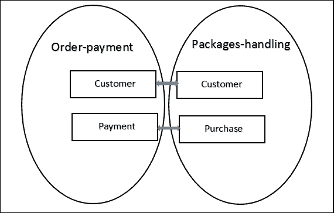
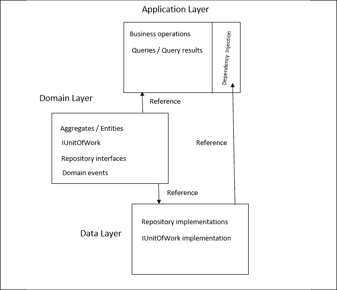
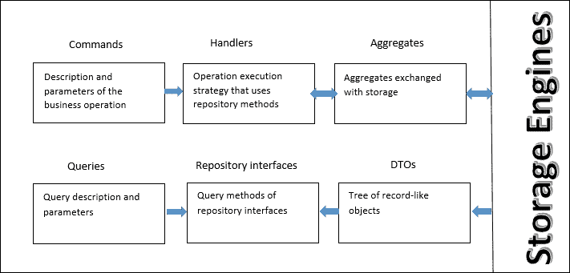
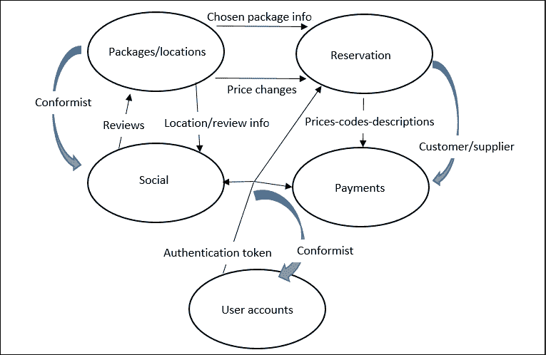

# 十二、了解软件解决方案中的不同领域

本章致力于一种被称为**领域驱动设计**（**DDD**的现代软件开发技术，该技术由 Eric Evans 首次提出。尽管 DDD 已经存在了 15 年多，但它在过去几年中取得了巨大成功，因为它能够处理两个重要问题。

第一个问题是复杂系统的建模。没有一位专家对整个领域有深入的了解；相反，这种知识在几个人之间被分割。正如我们将看到的，DDD 通过将整个 CI/CD 周期分成独立的部分，分配给不同的团队来解决这个问题。这样，每个团队只需与特定领域的专家互动，就可以专注于特定的知识领域。

DDD 很好地处理的第二个问题是有几个开发团队的大型项目。一个项目被分成几个团队的原因有很多，最常见的原因是团队的规模以及其所有成员具有不同的技能和/或不同的位置。事实上，经验已经证明，超过 6-8 人的团队并不有效，而且，很明显，不同的技能和地点会阻止紧密互动的发生。团队分裂防止了项目中所有相关人员之间的紧密互动。

反过来，上述两个问题的重要性在过去几年中也有所增加。软件系统一直占据着每个组织内部的大量空间，它们变得越来越复杂，地理分布也越来越广。与此同时，对频繁更新的需求增加，以便这些复杂的软件系统能够适应快速变化的市场的需求。

这些问题导致了更复杂的 CI/CD 周期的概念和复杂分布式架构的采用，这些架构可以利用可靠性、高吞吐量、快速更新和逐渐演化遗留子系统的能力。是的，我们谈论的是我们在*第 5 章**中分析的微服务和基于容器的架构，将微服务架构应用于您的企业应用*。

在这个场景中，实现复杂的软件系统是很常见的，这些系统具有相关的快速 CI/CD 周期，这总是需要更多的人来开发和维护它们。反过来，这就需要适合高复杂性领域的技术以及几个松散耦合的开发团队的合作。

在本章中，我们将分析与 DDD 相关的基本原则、优势和常见模式，以及如何在解决方案中使用它们。更具体地说，我们将涵盖以下主题：

*   什么是软件域？
*   理解领域驱动设计
*   使用坚实的原则来映射你的领域
*   用例理解用例的领域

让我们开始吧。

# 技术要求

本章要求安装了所有数据库工具的 Visual Studio 2019 免费社区版或更高版本。

本章中的所有代码片段都可以在与本书[相关的 GitHub 存储库中找到 https://github.com/PacktPublishing/Software-Architecture-with-C-9-and-.NET-5](https://github.com/PacktPublishing/Software-Architecture-with-C-9-and-.NET-5) 。

# 什么是软件域？

正如我们在*第 2 章*、*非功能性需求*和*第 3 章*、*中所讨论的，用 Azure DevOps*记录需求，从领域专家到开发团队的知识转移在软件设计中起着基础性作用。开发人员尝试与专家交流，并用领域专家和利益相关者能够理解的语言描述他们的解决方案。然而，通常情况下，同一个词在组织的不同部分具有不同的含义，而看似相同的概念实体在不同的上下文中具有完全不同的形状。

例如，在我们的 WWTravelClub 用例中，订单支付和包处理子系统为客户使用完全不同的模型。订单支付以客户的支付方式和货币、银行账户和信用卡为特征，而包裹处理更关注过去访问和/或购买过的位置和包裹、用户的偏好及其地理位置。此外，虽然订单支付指的是各种概念，其语言我们可以粗略地定义为**银行语言**，但包裹处理使用的语言是旅行社/运营商的典型语言。

处理这些差异的经典方法是使用一个名为**customer**的独特抽象实体，它将订单付款视图和包裹处理视图投影到两个不同的视图中。每个投影操作从**客户**抽象实体中获取一些操作和属性，并更改它们的名称。由于领域专家只给我们提供投影视图，作为系统设计者，我们的主要任务是创建一个能够解释所有视图的概念模型。下图显示了如何处理不同的视图：

<figure class="mediaobject"></figure>

图 12.1：创建独特的模型

经典方法的主要优点是，我们对领域的数据有一个独特而连贯的表示。如果这个概念模型建立成功，所有操作都将有一个正式的定义和目的，整个抽象将是整个组织工作方式的合理化，可能会突出和纠正错误，并简化一些程序。

然而，这种方法的缺点是什么？

当软件的目的地是整个组织的一小部分时，或者当软件自动化了足够小的数据流百分比时，急剧采用新的单片数据模型可能会在小型组织中产生可接受的影响。然而，如果软件成为一个复杂的地理分布的组织的主干，急剧的变化将变得不可接受和不可行。结构复杂的公司需要从旧组织逐步过渡到新组织。反过来，只有旧的数据模型可以与新的数据模型共存，并且组织的各个组成部分都可以以自己的速度变化，也就是说，组织的每个组成部分都可以独立于其他组成部分而发展，才有可能逐步过渡。

此外，随着软件系统复杂性的增加，还会出现以下几个问题：

*   **一致性问题**：获得数据的唯一一致性视图变得更加困难，因为当我们将这些任务分解为更小、松散耦合的任务时，我们无法保持复杂性。
*   **更新**困难：随着复杂性的增加，需要频繁的系统更改，但很难更新和维护唯一的全局模型。此外，由系统小部分中的更改引入的 bug/错误可能会通过唯一共享模型传播到整个组织。
*   **团队组织问题**：系统建模必须在多个团队之间进行拆分，只有松散耦合的任务才能交给单独的团队；如果两个任务是强耦合的，则需要将它们分配给同一个团队。
*   **并行性问题**：需要转向基于微服务的架构，这使得独特数据库的瓶颈更加难以接受。
*   **语言问题**：随着系统的发展，我们需要与更多的领域专家交流，每个人都说不同的语言，每个人对该数据模型有不同的看法。因此，我们需要将我们独特的模型的属性和操作翻译成更多的语言，以便能够与它们进行通信。

随着系统的发展，处理成百上千个字段的记录变得更加低效。这种低效性源于数据库引擎，它无法有效地处理包含多个字段的大记录（内存碎片、相关索引过多等问题）。然而，主要的低效率发生在**对象关系映射**（**ORMs**）和业务层中，这些层被迫在更新操作中处理这些大记录。事实上，虽然查询操作通常只需要从存储引擎检索到的几个字段，但更新和业务处理涉及整个实体。

随着数据存储子系统中流量的增长，我们需要在所有数据操作中实现读取和更新/写入并行。正如我们在*第 9 章*中所讨论的，*如何选择您在云中的数据存储*，虽然读取并行性很容易通过数据复制实现，但写入并行性需要分片，并且很难分片唯一的单片式紧密连接的数据模型。

这些问题是 DDD 在过去几年取得成功的原因，因为它们的特点是更复杂的软件系统成为整个组织的支柱。下一节将详细讨论 DDD 的基本原则。

# 理解领域驱动设计

DDD 是关于构建一个独特的域模型，该模型将所有视图保持为单独的模型。因此，整个应用域被划分为更小的域，每个域都有一个单独的模型。这些独立的域称为**有界上下文**。每个领域都有的特点，即专家们所说的语言，用于命名所有领域概念和操作。因此，每个领域定义了一种由专家和开发团队使用的通用语言，称为**通用语言**。翻译不再需要了，如果开发团队使用接口作为其代码的基础，领域专家就能够理解和验证它们，因为所有操作和属性都是用专家使用的相同语言表示的。

在这里，我们摆脱了一个繁琐的独特抽象模型，但现在我们有几个独立的模型，我们需要以某种方式进行关联。DDD 建议它将处理所有这些分离的模型，即所有有界上下文，如下所示：

*   每当语言术语的含义发生变化时，我们需要添加有界上下文边界。例如，在 WWTravelClub 用例中，订单支付和包处理属于不同的有界上下文，因为它们赋予**客户**一词不同的含义。
*   我们需要显式地表示有界上下文之间的关系。不同的开发团队可能在不同的有界上下文上工作，但是每个团队必须清楚地了解它所处理的有界上下文和所有其他模型之间的关系。因此，这种关系在一个独特的文档中表示，并与每个团队共享。
*   我们需要使所有有界上下文与 CI 保持一致。组织会议并构建简化的系统原型，以验证所有有界上下文的一致性，也就是说，所有有界上下文都可以集成到所需的应用行为中。

下面的图显示了我们在上一节中讨论的 WWTravelClub 示例如何随着 DDD 的采用而发生变化：

<figure class="mediaobject"></figure>

图 12.2:DDD 限定上下文之间的关系

每个有界上下文的客户实体之间存在关系，而处理有界上下文的包的购买实体与支付相关。识别在各种有界上下文中相互映射的实体是正式定义表示上下文之间所有可能通信的接口的第一步。

例如，从前面的图中，我们知道付款是在购买之后完成的，因此我们可以推断订单付款绑定上下文必须具有为特定客户创建付款的操作。在此域中，如果新客户不存在，则会创建新客户。购买后立即触发付款创建操作。由于购买物品后会触发多个操作，因此我们可以使用*第 11 章*、*设计模式和.NET 5 实现*中介绍的发布者/订阅者模式来实现与购买事件相关的所有通信。这些在 DDD 中称为**域事件**。使用事件实现有界上下文之间的通信非常常见，因为它有助于保持有界上下文松散耦合。

一旦在有界上下文接口中定义的事件或操作的实例跨越上下文边界，它将立即转换为接收上下文的通用语言。重要的是，在输入数据开始与其他域实体交互之前执行此转换，以避免其他域的通用语言受到额外上下文术语的污染。

每个有界上下文实现必须包含一个数据模型层，该层完全用有界上下文通用语言（类和接口名称以及属性和方法名称）表示，不受其他有界上下文通用语言的污染，也不受编程技术人员的污染。这对于确保与领域专家的良好沟通以及确保将领域规则正确转换为代码以便领域专家能够轻松验证这些规则是必要的。

当通信语言和目标普适语言之间存在严重不匹配时，将在接收边界上下文边界上添加反破坏层。此反腐败层的唯一目的是执行语言翻译。

包含所有有界上下文的表示以及有界上下文的相互关系和接口定义的文档称为**上下文映射**。上下文之间的关系包含组织约束，这些约束指定了在不同有界上下文中工作的团队之间需要的合作类型。这种关系不会约束有界上下文接口，但会影响它们在软件 CI/CD 周期中的发展方式。它们代表了团队合作的模式。最常见的模式如下：

*   **搭档**：这是 Eric Evans 建议的原始模式。这两个团队在交付方面相互依赖。换句话说，它们一起决定，如果需要，在软件 CI/CD 周期中更改有界上下文的相互通信规范。
*   **客户/供应商开发团队**：在这种情况下，一个团队作为客户，另一个团队作为供应商。这两个团队都定义了有界上下文的客户端接口和一些自动验收测试来验证它。之后，供应商可以独立工作。当客户的有界上下文是调用由另一个有界上下文公开的接口方法的唯一活动部分时，此模式起作用。这对于订单支付和包处理上下文之间的交互是足够的，因为订单支付的功能从属于包处理的需要，因此订单支付充当供应商。当可以应用此模式时，它将两个有界上下文完全解耦。
*   **合规者**：与客商类似，但在这种情况下，客商方接受由供方强加的接口，没有协商阶段。此模式与其他模式相比没有任何优势，但有时我们会被迫进入模式所描述的情况，因为供应商的受限上下文是在先前存在的产品中实现的，不能进行太多的配置/修改，或者因为它是我们不想修改的遗留子系统。

值得指出的是，只有当得到的有界上下文是松散耦合的时，有界上下文中的分离才是有效的；否则，通过将整个系统分解为子部分而实现的复杂性降低将被协调和通信过程的复杂性所压倒。

但是，如果使用语言标准定义了有界上下文，即只要**泛在语言**发生变化，就会添加有界上下文边界，实际情况应该是这样。事实上，组织子部分之间的松散交互可能会产生不同的语言，因为每个子部分内部的交互越紧密，与其他子部分的交互越松散，每个子部分最终定义和使用的内部语言就越多，这与其他子部分使用的语言不同。

此外，所有人类组织都可以通过进化为松散耦合的子部分来成长，这与复杂软件系统可以作为松散耦合的子模块的协作来实现的原因相同：这是人类能够应对复杂性的唯一方式。由此，我们可以得出结论，复杂的组织/人工系统总是可以分解为松散耦合的子部分。我们只需要了解*如何*。

除了我们到目前为止提到的基本原则之外，DDD 还提供了一些基本原语来描述每个有界上下文，以及一些实现模式。虽然有界上下文原语是 DDD 不可分割的一部分，但这些模式是我们可以在实现中使用的有用的启发式方法，因此一旦我们选择采用 DDD，它们在某些或所有有界上下文中的使用就不是强制性的。

在下一节中，我们将描述原语和模式。

# 实体和值对象

DDD 实体表示具有定义良好的标识的域对象，以及在其上定义的所有操作。它们与其他更为经典的方法没有太大区别。此外，DDD 实体是存储层设计的起点。

的主要区别在于 DDD 强调其面向对象的本质，而其他方法主要将其用作**记录**，其属性可以在没有太多约束的情况下写入/更新。另一方面，DDD 对它们强制执行强有力的可靠原则，以确保只有某些信息封装在它们内部，并且只有某些信息可以从外部访问，规定允许对它们执行哪些操作，并设置适用于它们的业务级验证标准。

换句话说，DDD 实体比基于记录的方法的实体更丰富。在其他方法中，操作实体的操作在实体外部定义在表示业务和/或域操作的类中。在 DDD 中，这些操作作为其类方法移动到实体定义中。这样做的原因是，它们提供了更好的模块化，并将相关的软件块保持在同一个位置，以便易于维护和测试。

出于同样的原因，业务验证规则在 DDD 实体内部移动。DDD 实体验证规则是业务级别的规则，因此它们不能与数据库完整性规则或用户输入验证规则混淆。它们通过编码表示的对象必须遵守的约束，有助于实体表示域对象的方式。在.NET（Core）中，业务验证可以使用以下技术之一进行：

*   在修改实体的所有类方法中调用验证方法
*   将验证方法挂接到所有属性设置器
*   使用自定义验证属性装饰类和/或其属性，然后在每次修改时调用实体上的`System.ComponentModel.DataAnnotations.Validator`类的`TryValidateObject`静态方法

一旦检测到，验证错误必须以某种方式处理；也就是说，必须中止当前操作，并且必须将错误报告给相应的错误处理程序。处理验证错误的最简单方法是引发异常。这样，两个目的都很容易实现，我们可以选择在何处拦截和处理它们。不幸的是，正如我们在*第 2 章**非功能性需求*的*部分中所讨论的，在编程时需要考虑的性能问题，异常意味着巨大的性能损失，因此，通常会考虑不同的选项。在正常的控制流中处理错误会破坏模块化，方法是将处理错误所需的代码散布到导致错误的所有方法堆栈中，代码上有一组永无止境的条件。因此，需要更复杂的选择。*

异常的一个很好的替代方法是将错误通知给依赖项注入引擎中定义的错误处理程序。在确定范围后，在处理每个请求时返回相同的服务实例，以便控制整个调用堆栈的执行的处理程序可以在控制流返回时检查可能的错误，并适当地处理这些错误。不幸的是，这种复杂的技术不能立即中止操作的执行或将其返回给控制处理程序。这就是为什么在这种情况下建议使用异常，尽管它们存在性能问题。

不能将业务级验证与输入验证混淆，这将在*第 15 章**介绍 ASP.NETCore MVC*中进行更详细的讨论，因为这两种类型的验证具有不同和互补的目的。当业务级验证规则对域规则进行编码时，输入验证强制执行每个输入的格式（字符串长度、正确的电子邮件和 URL 格式等），确保提供了所有必要的输入，强制执行所选的用户-机器交互协议，并提供快速、即时的反馈，驱动用户与系统交互。

由于 DDD 实体必须具有定义良好的标识，因此它们必须具有充当主键的属性。覆盖所有 DDD 实体的`Object.Equals`方法是很常见的，只要两个对象具有相同的主键，它们就会被视为相等。这可以通过让所有实体从抽象`Entity`类继承来轻松实现，如下代码所示：

```cs
public abstract class Entity<K>: IEntity<K>
    where K: IEquatable<K>
{

    public virtual K Id { get; protected set; }
    public bool IsTransient()
    {
        return Object.Equals(Id, default(K));
    }
    public override bool Equals(object obj)
    {
        return obj is Entity<K> entity &&
          Equals(entity); 
    }
    public bool Equals(IEntity<K> other)
    {
        if (other == null || 
            other.IsTransient() || this.IsTransient())
            return false;
        return Object.Equals(Id, other.Id);
    }
    int? _requestedHashCode;
    public override int GetHashCode()
    {
        if (!IsTransient())
        {
            if (!_requestedHashCode.HasValue)
                _requestedHashCode = HashCode.Combine(Id);
            return _requestedHashCode.Value;
        }
        else
            return base.GetHashCode();
    }
    public static bool operator ==(Entity<K> left, Entity<K> right)
    {
        if (Object.Equals(left, null))
            return (Object.Equals(right, null));
        else
            return left.Equals(right);
    }
    public static bool operator !=(Entity<K> left, Entity<K> right)
    {
        return !(left == right);
    }
} 
```

值得指出的是，一旦我们在`Entity`类中重新定义了`Object.Equals`方法，我们还可以重写`==`和`!=`操作符。

只要实体最近创建且未记录在永久存储器中，`IsTransient`谓词就会返回`true`，因此其主键仍然未定义。

在.NET 中，一个很好的实践是，每当您重写类的`Object.Equals`方法时，您也会重写它的`Object.GetHashCode`方法，这样类实例就可以有效地存储在数据结构（如字典和集合）中。这就是`Entity`类重写它的原因。

还值得实现一个定义`Entity<K>`所有属性/方法的`IEntity<K>`接口。每当我们需要在接口后面隐藏数据类时，这个接口都很有用。

另一方面，值对象表示不能用数字或字符串编码的复杂类型。因此，它们没有标识，也没有主密钥。它们没有定义操作，是不可变的；也就是说，一旦它们被创建，它们的所有字段都可以读取，但不能修改。出于这个原因，它们通常使用具有受保护/私有 setter 的属性的类进行编码。当两个值对象的所有独立属性相等时，它们被认为是相等的（有些属性不是独立的，因为它们只是以不同的方式显示由其他属性编码的数据，如`DateTime`的记号及其日期和时间字段的表示）。

值类型很容易用 C# 9`record`类型实现，因为所有`record`类型都会自动重写`Equals`方法，以便它逐个属性进行比较。此外，`record`类型的行为类似于`structs`，在每次分配时都会创建一个新实例。然而，记录类型也是不可变的；也就是说，一旦初始化，更改其值的唯一方法就是创建一个新实例。以下是如何修改`record`的示例：

```cs
var modifiedAddress = myAddress with {Street = "new street"} 
```

以下是如何定义`record`的示例：

```cs
public record Address
{
   public string Country {get; init;}
   public string Town {get; init;}
   public string Street {get; init;}
} 
```

`init`关键字使`record`类型属性不可变，因为它意味着它们只能初始化。

典型的价值对象包括以数字和货币符号表示的成本、以经度和纬度表示的位置、地址和联系信息。当存储引擎的接口是实体框架时，我们在*第 8 章*中分析，*与 C#–实体框架核心*中的数据交互，*第 9 章*中分析，*如何选择您在云中的数据存储*，值对象通过`OwnsMany`和`OwnsOne`关系与使用的实体连接。事实上，这种关系也接受没有定义主键的类。

当存储引擎是 NoSQL 数据库时，值对象存储在使用它们的实体的记录中。另一方面，在关系数据库的情况下，它们可以使用分离的表来实现，这些表的主键由实体框架自动处理，并且对开发人员隐藏（没有属性被声明为主键），或者在`OwnsOne`的情况下，它们被展平并添加到与使用它们的实体关联的表中。

# 使用坚实的原则来映射你的领域

在下面的小节中，我们将描述一些常用于 DDD 的模式。其中一些可以在所有项目中采用，而另一些只能用于特定的有界上下文。总体思路是将业务层分为两层：

*   应用层
*   域层

这里，域层是基于泛在语言的数据层的抽象。在这里，DDD 实体和值对象与检索和保存它们的操作的抽象一起定义。这些操作是在底层数据层（本例中为实体框架）中实现的接口中定义的。

相反，应用层定义了使用域层接口的操作，以获取 DDD 实体和值对象，并对其进行操作以实现应用业务逻辑。

正如我们将在本章后面看到的，通常只使用在数据层中实现的接口来实现域层。因此，数据层必须有对域层的引用，因为它必须实现其接口，而应用层是每个域层接口通过应用层依赖注入引擎的记录与其实现连接的地方。更具体地说，应用层引用的唯一数据层对象是这些仅在依赖项注入引擎中引用的接口实现。

每个应用层操作都需要依赖引擎提供的接口，使用它们获取 DDD 实体和值对象，对它们进行操作，并可能通过相同的接口保存它们。下图显示了本节讨论的三个层之间的关系：

<figure class="mediaobject"></figure>

图 12.3：各层之间的关系

因此，域层包含域对象的表示、对其使用的方法、验证约束及其与各种实体的关系。为了增加模块化和解耦，实体之间的通信通常使用事件编码，即使用发布者/订阅者模式。这意味着实体更新可以触发已连接到业务操作的事件，这些事件会作用于其他实体。

这种分层架构允许我们在不影响域层的情况下更改整个数据层，域层只取决于域规范和语言，而不取决于数据处理的技术细节。

应用层包含可能影响多个实体的所有操作的定义，以及应用所需的所有查询的定义。业务操作和查询都使用域层中定义的接口与数据层交互。

但是，当业务操作使用这些接口操作和交换实体时，查询发送查询规范，并从中接收通用**数据传输对象**（**DTO**）。事实上，查询的目的只是向用户显示数据，而不是对其进行操作；因此，查询操作不需要包含所有方法、属性和验证规则的整个实体，而只需要属性元组。

业务操作由其他层（通常是表示层）或通信操作调用。业务操作也可能与当某些实体被其他操作修改时触发的事件挂钩。

综上所述，应用层在域层定义的接口上操作，而不是直接与数据层实现交互，这意味着应用层与数据层是解耦的。更具体地说，数据层对象仅在依赖项注入引擎定义中提到。所有其他应用层组件都引用在域层中定义的接口，依赖项注入引擎注入适当的实现。

应用层通过以下一种或多种模式与其他应用组件通信：

*   它公开了通信端点上的业务操作和查询，例如 HTTP Web API（请参见*第 14 章*、*应用具有.NETCore的面向服务架构*。在这种情况下，表示层可以连接到此端点或其他端点，而这些端点又从该端点和其他端点获取信息。从多个端点收集信息并在唯一端点中公开它们的应用组件称为网关。它们可以是定制的，也可以是通用的，例如 Ocelot。
*   它被直接实现表示层的应用引用为库，例如 ASP.NETCore MVC Web 应用。
*   它不会通过端点公开所有信息，并将它处理/创建的一些数据传递给其他应用组件，而这些组件反过来又公开端点。这种通信通常使用发布者/订阅者模式来实现，以增加模块化。

在描述这些模式之前，我们需要理解聚合的概念。

# 聚集体

到目前为止，我们已经讨论了由基于 DDD 的业务层处理的作为**单元**的实体。但是，可以操纵多个实体并将其制成单个实体。其中一个例子是采购订单及其所有项目。事实上，独立于所属订单处理单个订单项目是毫无意义的。这是因为订单项实际上是订单的子部分，而不是独立的实体。

没有任何交易会影响单个订单项目，而不会影响该项目所在的订单。想象一下，同一家公司中有两个不同的人试图增加水泥总量，但一个增加了 1 型水泥（项目 1）的数量，而另一个增加了 2 型水泥（项目 2）的数量。如果每个项目作为一个独立实体处理，两个数量都将增加，这可能会导致采购订单不一致，因为水泥总量将增加两倍。

另一方面，如果整个订单及其所有订单项都是由两个人在每个事务中加载和保存的，那么这两个人中的一个将覆盖另一个的更改，因此无论是谁进行最终更改，都将设置他们的需求。在 web 应用中，不可能在用户看到和修改采购订单的整个时间内锁定采购订单，因此使用乐观并发策略。如果数据层基于**实体框架**（**EF**核心），我们可以使用 EF 并发检查属性。如果我们用`[ConcurrencyCheck]`属性修饰属性，当 EF 保存更改时，事务将中止，并且当用`[ConcurrencyCheck]`修饰的属性的数据库中的值与读取实体时检索到的值不同时，将生成并发异常。

例如，在每个采购订单中添加一个饰有`[ConcurrencyCheck]`的版本号，并执行以下操作即可：

1.  在不打开任何交易的情况下读取订单，并对其进行更新。
2.  在保存更新后的采购订单之前，我们增加计数器。
3.  当我们保存所有更改时，如果其他人在我们能够保存更改之前增加了此计数器，则会生成并发异常并中止操作。
4.  从*步骤 1*重复，直到没有并发异常发生。

也可以使用自动生成的`TimeStamp`代替计数器。然而，正如我们不久将看到的，我们需要计数器来实现**命令查询责任分离**（**CQRS**模式。

采购订单及其所有子部分（订单项）称为**聚合**，而订单实体称为聚合的根。聚合总是有根的，因为它们是由**子部分**关系连接的实体层次结构。

由于每个聚合表示单个复杂实体，因此它上的所有操作都必须由唯一的接口公开。因此，聚合根通常表示整个聚合，并且对聚合的所有操作都定义为根实体的方法。

当使用聚合模式时，在业务层和数据层之间传输的信息单元称为聚合、查询和查询结果。因此，聚合将取代单个实体。

我们在*第 8 章*、*与 C#–实体框架核心*中的数据交互以及*第 9 章*、*如何选择您在云中的数据存储*中看到的 WWTravelClub 位置和包实体呢？包是否是根在其相关位置的唯一聚合的一部分？不事实上，位置很少更新，对包所做的更改对其位置或与同一位置关联的其他包没有影响。

# 存储库和工作单元模式

repository 模式是一种以实体为中心的定义域层接口的方法：每个聚合都有自己的存储库接口，用于定义如何检索和保存它，并定义涉及聚合中实体的所有查询。每个存储库接口的数据层实现称为存储库。

使用存储库模式，每个操作都有一个易于找到的位置，必须在其中定义：操作所使用的聚合接口，或者在查询的情况下，包含查询根实体的聚合。

通常，跨越多个聚合并相应地使用多个不同存储库接口的应用层操作必须在唯一的事务中执行。**工作单元**模式是一种保持域层与底层数据层独立性的解决方案。它指出，每个存储库接口还必须包含对表示当前事务标识的工作单元接口的引用。这意味着具有相同工作单元引用的多个存储库属于同一事务。

存储库和工作单元模式都可以通过定义一些种子接口来实现：

```cs
public interface IUnitOfWork 
{ 
    Task<bool> SaveEntitiesAsync();
    Task StartAsync();
    Task CommitAsync();
    Task RollbackAsync();
}
public interface IRepository<T>: IRepository
{
   IUnitOfWork UnitOfWork { get; }
} 
```

所有存储库接口都继承自`IRepository<T>`并将`T`绑定到它们关联的聚合根，而工作单元只是实现`IUnitOfWork`。在使用实体框架时，`IUnitOfWork`通常是用`DBContext`实现的，这意味着`SaveEntitiesAsync()`可以执行其他操作，然后调用`DBContext``SaveChangeAsync`方法，将所有挂起的更改保存在一个事务中。如果需要在从存储引擎检索某些数据时启动更广泛的事务，则必须由应用层处理程序启动并提交/中止，应用层处理程序在`IUnitOfWork``StartAsync`、`CommitAsync`和`RollbackAsync`方法的帮助下处理整个操作。`IRepository<T>`继承自空`IRepository`接口，以帮助自动发现存储库。与本书关联的 GitHub 存储库包含一个`RepositoryExtensions`类，其`AddAllRepositories``IServiceCollection`扩展方法自动发现程序集中包含的所有存储库实现，并将它们添加到依赖项注入引擎。

以下是基于存储库和工作单元模式的应用层/域层/数据层架构图：

<figure class="mediaobject"></figure>

图 12.4：层责任和相互参考

避免直接引用存储库实现的主要优点是，如果我们模拟这些接口，可以轻松测试各种模块。域层中提到的域事件是实现*理解域驱动设计*一节中提到的不同有界上下文之间通信的事件。

# DDD 实体和实体框架核心

DDD 要求实体的定义方式与*第 8 章*中*实体与 C#–实体框架核心*中数据交互的定义方式不同。事实上，实体框架实体是公共属性的记录式列表，几乎没有方法，而 DDD 实体应该有编码域逻辑、更复杂的验证逻辑和只读属性的方法。虽然可以在不破坏实体框架操作的情况下添加进一步的验证逻辑和方法，但添加不能映射到数据库属性的只读属性可能会产生必须充分处理的问题。防止属性映射到数据库非常简单，我们需要做的只是用`NotMapped`属性修饰它们。

只读属性的问题稍微复杂一些，可以通过三种基本方式解决：

*   **将 EF 实体映射到不同的类**。将 DDD 实体定义为不同的类，并在实体返回/传递到存储库方法时向它们复制数据。这是最简单的解决方案，但需要编写一些代码，以便在两种格式之间转换实体。DDD 实体在域层中定义，而 EF 实体继续在数据层中定义。这是一个更干净的解决方案，但它在代码编写和维护方面都会造成不小的开销。我建议您在使用多种复杂方法进行复杂聚合时使用它。
*   **将表字段映射到私有属性**。让实体框架核心将字段映射到私有类字段，这样您就可以通过编写自定义 getter 和/或 setter 来决定如何将它们公开给属性。为这些私有字段提供`_<property name>`名称或`_<property name in camel case>`名称就足够了，实体框架将使用它们而不是它们的关联属性。在这种情况下，域层中定义的 DDD 实体也用作数据层实体。这种方法的主要缺点是我们不能使用数据注释来配置每个属性，因为 DDD 实体不能依赖于底层数据层的实现方式。因此，我们必须在`OnModelCreating``DbContext`方法中配置所有数据库映射。这是一个更简单的解决方案，但它生成的代码不可读且难以维护，因此我不建议采用它。
*   **将 DDD 定义为接口**。将每个实体框架类及其所有公共属性隐藏在一个接口后面，该接口在需要时仅公开属性获取程序。接口在域层中定义，而实体继续在数据层中定义。在这种情况下，存储库必须公开一个返回接口实现的`Create`方法；否则，更高层将无法创建可添加到存储引擎的新实例，因为无法使用`new`创建接口。当有几个简单实体时，这是我更喜欢的解决方案。

例如，假设我们想为*第 8 章*的*定义 DB entities*小节中定义的`Destination`类定义一个名为`IDestination`的 DDD 接口，*与 C#–Entity Framework Core*中的数据交互，假设我们想公开`Id`，`Name`和`Country`属性为只读，因为一旦创建了目的地，就不能再修改。在这里，让`Destination`实现`IDestination`并在`IDestination`中将`Id`、`Name`和`Country`定义为只读即可：

```cs
public interface IDestination
{ 
    int Id { get; }
    string Name { get; }   
    string Country { get; }
    string Description { get; set; }
    ...
} 
```

现在我们已经讨论了 DDD 的基本模式以及如何调整实体框架以满足 DDD 的需求，我们可以讨论更高级的 DDD 模式。在下一节中，我们将介绍 CQRS 模式。

# 命令查询责任分离（CQRS）模式

在其一般形式中，此模式的使用非常简单：使用不同的结构来存储和查询数据。这里，关于如何存储和更新数据的要求与查询的要求不同。在 DDD 的情况下，存储单元是**聚合**，因此添加、删除和更新涉及聚合，而查询通常涉及从多个聚合中获取的属性的或多或少复杂的转换。

此外，通常我们不会对查询结果执行业务操作。我们只是用它们来计算其他数据（平均值、总和等等）。因此，虽然更新需要具有完全面向对象语义（方法、验证规则、封装信息等）的实体，但查询结果只需要属性/值对集，因此只有公共属性而没有方法的**数据传输对象**（**DTO**）工作良好。

在其常见形式中，该图案可描述如下：

<figure class="mediaobject"></figure>

图 12.5：命令和查询处理

这样做的主要好处是，查询结果的提取不需要经过实体和聚合的构造，但查询中显示的字段必须从存储引擎中提取并投影到特定的 DTO 中。如果使用 LINQ 实现查询，我们需要使用`Select`子句将必要的属性投影到 DTO 中：

```cs
ctx.MyTable.Where(...)....Select(new MyDto{...}).ToList(); 
```

然而，在更复杂的情况下，cqr 可以以更强的形式实现。也就是说，我们可以使用不同的有界上下文来存储预处理的查询结果。当查询涉及存储在由不同分布式微服务处理的不同有界上下文中的数据时，这种方法很常见。

事实上，另一个选项是聚合器微服务，它查询所有必要的微服务，以便组装每个查询结果。然而，递归调用其他微服务来构建答案可能会导致不可接受的响应时间。此外，分解一些预处理可以确保更好地利用可用资源。此模式的实现如下所示：

1.  查询处理委托给专门的微服务。
2.  每个查询处理 microservice 对它必须处理的每个查询都使用一个数据库表。在那里，它存储查询返回的所有字段。这意味着查询不是在每次请求时计算的，而是预先计算并存储在特定的数据库表中。显然，具有子集合的查询需要额外的表，每个子集合一个表。
3.  处理更新的所有微服务将所有更改转发给感兴趣的查询处理微服务。记录进行了版本控制，因此接收更改的查询处理微服务可以将它们以正确的顺序应用于查询处理表。事实上，由于为了提高性能，通信是异步的，因此无法确保更改以与发送相同的顺序接收。
4.  每个查询处理微服务接收到的更改都会在它们等待应用更改时被缓存。只要更改的版本号紧跟在应用的最后一个更改之后，它就会应用于正确的查询处理表。

使用这种更强形式的 CQRS 模式将通常的本地数据库事务转换为复杂的耗时分布式事务，因为单个查询预处理器微服务中的故障会使整个事务失效。正如我们在*第 5 章*中所解释的*将微服务架构应用于您的企业应用*中，由于性能原因，实现分布式事务通常是不可接受的，有时甚至根本不受支持，因此，常见的解决方案是放弃立即保持总体一致的数据库的想法，并接受每次更新后总体数据库最终将保持一致。暂时性故障可以通过我们在*第 5 章*中分析的重试策略来解决，*将微服务架构应用到您的企业应用*中，而永久性故障则是通过对已经提交的本地事务执行纠正操作来处理的，而不是假装实现一个全局分布式事务。

正如我们在*第 5 章**中所讨论的，将微服务架构应用于企业应用*，微服务之间的通信通常通过发布者/订阅者模式实现，以改进微服务分离。

此时，您可能会问以下问题：

“*为什么我们在得到所有预处理的查询结果后还要保留原始数据？我们永远不会用它来回答查询！*

这个问题的部分答案如下：

*   它们是我们可能需要从失败中恢复的真相的来源。
*   我们需要它们在添加新查询时计算新的预处理结果。
*   我们需要他们来处理新的更新。事实上，处理更新通常需要从数据库中检索一些数据，可能会显示给用户，然后进行修改。例如，要修改现有采购订单中的一个项目，我们需要整个订单，以便我们可以向用户显示它并计算更改，以便我们可以将其转发给其他微服务。此外，无论何时修改或向存储引擎添加数据，都必须验证整个数据库的一致性（唯一键约束、外键约束等）。

在下一节中，我们将描述用于处理跨多个聚合和多个有界上下文的操作的通用模式。

# 命令处理程序和域事件

为了保持聚合分离，通常通过事件与其他聚合和其他有界上下文进行交互。在处理每个聚合时，存储创建的所有事件，而不是立即执行它们，这是一种良好的做法，以防止事件执行干扰正在进行的聚合处理。通过将以下代码添加到本章*实体和值对象*小节中定义的抽象`Entity`类中，可以轻松实现这一点，如下所示：

```cs
public List<IEventNotification> DomainEvents { get; private set; }
public void AddDomainEvent(IEventNotification evt)
{
    DomainEvents ??= new List<IEventNotification>(); 
    DomainEvents.Add(evt);
}
public void RemoveDomainEvent(IEventNotification evt)
{
    DomainEvents?.Remove(evt);
} 
```

这里，`IEventNotification`是一个空接口，用于将类标记为事件。

事件处理通常在更改存储在存储引擎中之前立即执行。因此，在命令处理程序调用每个`IUnitOfWork`实现的`SaveEntitiesAsync()`方法之前（请参见*存储库和工作单元模式*小节），是执行事件处理的好地方。类似地，如果事件处理程序可以创建其他事件，则必须在处理完所有聚合后处理这些事件。

对事件`T`的订阅可以作为`IEventHandler<T>`接口的实现提供：

```cs
public interface IEventHandler<T>: IEventHandler
    where T: IEventNotification
{
    Task HandleAsync(T ev);
} 
```

类似地，业务操作可以通过`command`对象来描述，该对象包含操作的所有输入数据，而实现实际操作的代码可以通过`ICommandHandler<T>`接口的实现来提供：

```cs
public interface ICommandHandler<T>: ICommandHandler
    where T: ICommand
{
    Task HandleAsync(T command);
} 
```

这里，`ICommand`是一个空接口，用于将类标记为命令。`ICommandHandler<T>`和`IEventHandler<T>`是我们在*第 11 章*、*设计模式和.NET 5 实现*中描述的命令模式的示例。

每个`ICommandHandler<T>`都可以在依赖注入引擎中注册，以便需要执行命令`T`的类可以在其构造函数中使用`ICommandHandler<T>`。通过这种方式，我们将命令（T3 类）的抽象定义与其执行方式分离。

同样的构造不能应用于事件`T`及其`IEventHandler<T>`，因为当触发事件时，我们需要检索`IEventHandler<T>`的多个实例，而不仅仅是一个实例。我们需要这样做，因为每个事件可能有多个订阅。然而，几行代码就可以很容易地解决这个难题。首先，我们需要定义一个类，该类承载给定事件类型的所有处理程序：

```cs
public class EventTrigger<T>
        where T: IEventNotification
    {
        private IEnumerable<IEventHandler<T>> handlers;
        public EventTrigger(IEnumerable<IEventHandler<T>> handlers)
        {
            this.handlers = handlers;
        }
        public async Task Trigger(T ev)
        {
            foreach (var handler in handlers)
                await handler.HandleAsync(ev);
        }
    } 
```

其思想是每个需要触发事件`T`的类都需要`EventTrigger<T>`，然后将要触发的事件传递给其`Trigger`方法，该方法反过来调用所有处理程序。

然后，我们需要在依赖注入引擎中注册`EventTrigger<T>`。一个好主意是定义我们可以调用的依赖项注入扩展来声明每个事件，如下所示：

```cs
 service.AddEventHandler<MyEventType, MyHandlerType>() 
```

此`AddEventHandler`扩展必须自动为`EventTrigger<T>`生成依赖项注入定义，并且必须处理用`AddEventHandler`为每种类型`T`声明的所有处理程序。

以下扩展类为我们实现了这一点：

```cs
public static class EventDIExtensions
{
    public static IServiceCollection AddEventHandler<T, H>
        (this IServiceCollection services)
        where T : IEventNotification
        where H: class, IEventHandler<T> 
    {
        services.AddScoped<H>();
        services.TryAddScoped(typeof(EventTrigger<>));
        return services;
    }
    ...
    ...
} 
```

传递给`AddEventHandler`的`H`类型记录在依赖项注入引擎中，第一次调用`AddEventHandler`时，也会将`EventTrigger<>`添加到依赖项注入引擎中。然后，当依赖项注入引擎需要一个`EventTrigger<T>`实例时，所有添加到依赖项注入引擎的`IEventHandler<T>`类型都会被创建、收集并传递给`EventTrigger(IEnumerable<IEventHandler<T>> handlers)`构造函数。

当程序启动时，所有的`ICommandHandler<T>`和`IEventHandler<T>`实现都可以通过反射检索并自动注册。为了帮助自动发现，它们继承自`ICommandHandler`和`IEventHandler`，这两个接口都是空接口。在本书的 GitHub 存储库中提供的`EventDIExtensions`类包含自动发现和注册命令处理程序和事件处理程序的方法。GitHub 存储库还包含一个`IEventMediator`接口及其`EventMediator`实现，该接口的`TriggerEvents(IEnumerable<IEventNotification> events)`方法从依赖项注入引擎的参数中检索与事件相关的所有处理程序，并执行它们。将`IEventMediator`注入类中足以触发事件。`EventDIExtensions`还包含一个扩展方法，用于发现实现空`IQuery`接口的所有查询，并将它们添加到依赖项注入引擎。

`MediatR`NuGet 包给出了一个更复杂的实现。下一小节专门讨论 CQRS 模式的极端实现。

# 事件源

事件来源是更强大的 CQR 形式的一个极端实现。当原始有界上下文数据库根本不用于检索信息，而只是作为**真相来源**时，它非常有用，即用于故障恢复和软件维护。在本例中，我们不更新数据，只需添加描述所执行操作的事件：删除`record Id 15`，将名称更改为`John in Id 21`，等等。这些事件会立即发送到所有相关的有界上下文，在出现故障和/或添加新查询的情况下，我们所要做的就是重新处理其中的一些。如果事件是幂等的，也就是说，如果多次处理同一事件具有处理一次的相同效果，则事件重新处理不会导致问题。

正如*第 5 章**将微服务架构应用于企业应用*中所述，幂等性是通过事件进行通信的微服务的标准要求。

虽然到目前为止，我们所描述的所有技术都可以在每种类型的项目中使用，只要稍作修改，事件源需要进行深入分析，然后才能采用，因为在某些情况下，它可能会产生比它所能解决的问题更大的问题。为了了解它被误用时可能导致的问题，假设我们将其应用于在被批准之前已被多个用户修改和验证的采购订单。由于采购订单需要在更新/验证之前进行检索，因此采购订单的有界上下文不能仅用作真相来源，因此不应将事件源应用于采购订单。如果不是这样，那么我们可以对其应用事件源，在这种情况下，每次更新订单时，我们的代码将被迫从记录的事件重建整个订单。

其用法的一个例子是我们在*第 5 章*末尾描述的收入记录系统*将微服务架构应用于您的企业应用*。单个收入通过事件源记录，然后发送到我们在*第 5 章**中将微服务架构应用到您的企业应用*中所述的微服务，而企业应用反过来使用它们预处理未来查询，即计算每日收入。

在下一节中，我们将学习如何应用 DDD 来定义本书的 WWTravelClub 用例的有界上下文。在*第 15 章**展示 ASP.NETCore MVC*的*用例——在 ASP.NETCore MVC*中实现 web 应用中，可以找到如何实现使用本书中描述的大多数模式和代码的有界上下文的完整示例。

# 用例–了解用例的领域

从*第一章*中*案例研究-介绍世界野生旅游俱乐部*一节中列出的需求，*理解软件架构*的重要性，以及*第九章*中*用例-存储数据*一节中的分析，*如何选择您在云中的数据存储*我们知道 WWTravelClub 系统由以下部分组成：

*   有关可用目的地和包的信息。我们在*第 9 章**如何选择云中的数据存储*中实现了该子系统数据层的第一个原型。
*   预订/采购订单子系统。
*   与专家/评审子系统的沟通。
*   支付子系统。在本章*理解领域驱动设计*一节开始时，我们简要分析了该子系统的特点及其与预订购买子系统的关系。
*   用户帐户子系统。
*   统计报告子系统。

前面的子系统是否表示不同的**有界上下文**？某些子系统可以划分为不同的有界上下文吗？这些问题的答案由每个子系统中使用的语言给出：

*   子系统 1 中使用的语言为**旅行社**的语言。没有顾客的概念；仅仅是位置、软件包及其功能。
*   子系统 2 中使用的语言对于所有服务购买都是通用的，例如可用资源、预订和采购订单。这是一个单独的有界上下文。
*   子系统 3 中使用的语言与子系统 1 的语言有很多共同点。然而，也有一些典型的**社交媒体**概念，如收视率、聊天、帖子共享、媒体共享等。该子系统可分为两部分：具有新的有界上下文的社交媒体子系统和作为子系统 1 的有界上下文一部分的可用信息子系统。
*   正如我们在*理解领域驱动设计*一节中指出的，在子系统 4 中，我们使用**银行**语言。该子系统与预订购买子系统通信，并执行执行购买所需的任务。从这些观察结果中，我们可以看出，它是一个不同的有界上下文，与采购/预订系统存在客户/供应商关系。
*   子系统 5 绝对是一个独立的有界上下文（就像在几乎所有 web 应用中一样）。它与所有具有用户概念或客户概念的有界上下文都有关系，因为用户帐户的概念总是映射到这些概念。但是怎么做呢？简单假设当前登录的用户是社交媒体绑定上下文的社交媒体用户、预订/购买绑定上下文的客户以及支付绑定上下文的付款人。
*   仅查询子系统（即 6）使用分析和统计语言，与其他子系统中使用的语言有很大不同。然而，它几乎与所有有界上下文都有联系，因为它从它们那里获取所有输入。前面的约束迫使我们采用强形式的 CQR，从而将其视为仅查询分离的有界上下文。我们在*第 5 章**中实现了其中的一部分，将微服务架构应用于您的企业应用*，方法是使用符合强 CQR 形式的微服务。

总之，每个列出的子系统定义了不同的有界上下文，但与专家/评审子系统的部分通信必须包含在有关可用目的地和包有界上下文的信息中。

随着分析的继续和原型的实现，一些有界上下文可能会被拆分，而另一些可能会被添加，但是，立即开始对系统进行建模并立即开始使用我们掌握的部分信息分析有界上下文之间的关系是非常重要的，因为这将推动进一步的研究，并将帮助我们定义所需的通信协议和无处不在的语言，以便我们能够与系统交互领域专家。

以下是域地图的第一个基本草图：

<figure class="mediaobject"></figure>

图 12.6:WWTravelClub 域地图

为简单起见，我们省略了**统计报告**有界上下文。这里，我们假设**用户帐户**和**社交**受限上下文与所有其他与它们通信的受限上下文具有**一致**关系，因为它们是用现有软件实现的，所以所有其他组件都必须适应它们。

正如我们前面提到的，**预订**和**付款**之间的关系是**客户/供应商**，因为**付款**提供用于执行**预订**任务的服务。所有其他关系被归类为**合作伙伴**。大多数有界上下文所具有的客户/用户的各种概念由**用户帐户**授权令牌进行协调，该令牌间接负责在所有有界上下文之间映射这些概念。

**包/位置**子系统不仅传递执行预订/采购所需的包信息，还负责通知待定采购订单可能的价格变化。最后，我们可以看到，社交互动是从现有的评论或位置开始的，从而创建与**包/位置**限定上下文的沟通。

# 总结

在本章中，我们分析了采用 DDD 的主要原因，以及为什么和如何满足市场需求。我们描述了如何识别域，以及如何使用域映射来协调在同一应用的不同域上工作的团队。然后，我们分析了 DDD 用实体、值对象和聚合表示数据的方式，提供了建议和代码片段，以便我们能够在实践中实现它们。

我们还介绍了 DDD 使用的一些典型模式，即存储库和工作单元模式、域事件模式、CQR 和事件源。然后，我们学习了如何在实践中实现它们。我们还向您展示了如何使用解耦处理实现域事件和命令模式，以便我们可以将代码片段添加到实际项目中。

最后，我们在实践中使用 DDD 的原则来定义域，并为本书的 WWTravelClub 用例创建域图的第一个草图。

在下一章中，您将学习如何最大限度地提高项目中的代码重用。

# 问题

1.  什么提供了主要提示，以便我们能够发现域边界？
2.  用于协调单独的有界上下文的开发的主要工具是什么？
3.  组成聚合的每个条目都用自己的方法与系统的其余部分通信，这是真的吗？
4.  为什么只有一个聚合根？
5.  有多少存储库可以管理一个聚合？
6.  存储库如何与应用层交互？
7.  为什么需要工作单元模式？
8.  CQR 的光照形式的原因是什么？其最强烈形式的原因是什么？
9.  允许我们将命令/域事件与其处理程序耦合的主要工具是什么？
10.  事件源是否可以用于实现任何有界上下文？

# 进一步阅读

*   有关 DDD 的更多资源可在此处找到：[https://domainlanguage.com/ddd/](https://domainlanguage.com/ddd/)
*   关于 CQRS 设计原则的详细讨论可在此处找到：[http://udidahan.com/2009/12/09/clarified-cqrs/](http://udidahan.com/2009/12/09/clarified-cqrs/)
*   有关 MediatR 的更多信息，请访问 MediatR 的 GitHub 存储库：[https://github.com/jbogard/MediatR](https://github.com/jbogard/MediatR)
*   马丁·福勒（Martin Fowler）在以下博文中对事件来源进行了详细描述，并给出了一个示例：[https://martinfowler.com/eaaDev/EventSourcing.html](https://martinfowler.com/eaaDev/EventSourcing.html)