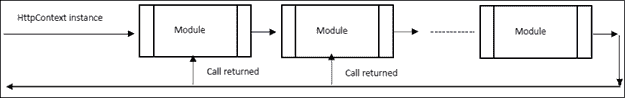
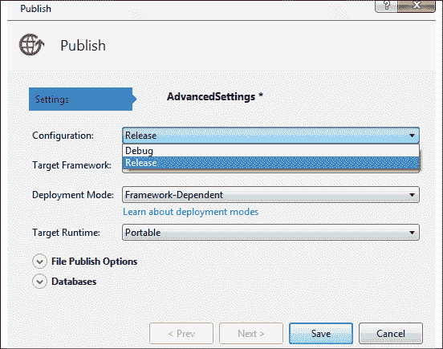
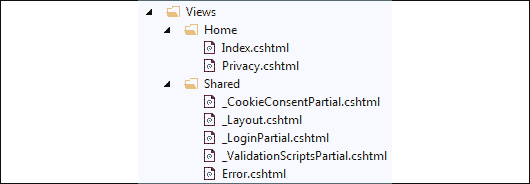
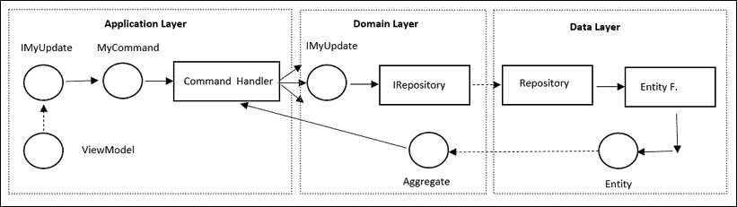
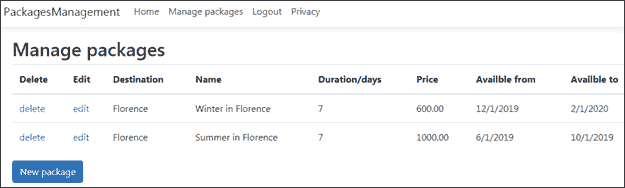

# 15

# 展示 ASP.NET 核心 MVC

在本章中，您将学习如何实现应用程序表示层。更具体地说，您将学习如何实现基于 ASP.NET 核心 MVC 的 web 应用程序。

ASP.NET 核心是用于实现 web 应用程序的.NET 框架。ASP.NET 核心在前几章中已经做了部分描述，因此本章将主要关注 ASP.NET 核心 MVC。更具体地说，本章将涵盖以下主题：

*   了解 web 应用程序的表示层
*   了解 ASP.NET 核心 MVC 结构
*   最新版本的 ASP.NET Core 有哪些新功能？
*   理解 ASP.NET 核心 MVC 与设计原则之间的联系
*   用例–在 ASP.NET 核心 MVC 中实现 web 应用

我们将回顾并进一步详细介绍 ASP.NET 核心框架的结构，部分内容已在*第 14 章*、*应用具有.NET 核心的面向服务架构*、以及*第 4 章*、*中讨论，以确定最佳的基于云的解决方案*。这里主要关注的是如何基于所谓的**模型-视图-控制器**（**MVC**架构模式）实现基于 web 的表示层。

我们还将分析上一个 ASP.NET Core 5.0 版本中提供的所有新功能，以及 ASP.NET Core MVC 框架中包含的和/或典型 ASP.NET Core MVC 项目中使用的体系结构模式。其中一些模式在*第 11 章*、*设计模式和.NET 5 实现*以及*第 12 章*、*理解软件解决方案*中的不同领域中进行了讨论，而其他一些模式，如 MVC 模式本身，则是新的。

通过本章末尾的一个实际示例，您将了解如何实现 ASP.NET 核心 MVC 应用程序，以及如何组织整个 Visual Studio 解决方案。此示例描述了一个完整的 ASP.NET 核心 MVC 应用程序，用于编辑 WWTravelClub book 用例的包。

# 技术要求

本章要求安装有所有数据库工具的免费 Visual Studio 2019 社区版或更高版本。

本章中的所有概念都将通过基于 WWTravelClub book 用例的实例加以澄清。本章代码见[https://github.com/PacktPublishing/Software-Architecture-with-C-9-and-.NET-5](https://github.com/PacktPublishing/Software-Architecture-with-C-9-and-.NET-5) 。

# 了解 web 应用程序的表示层

本章讨论了基于 ASP.NET 核心框架实现基于 web 的应用程序表示层的体系结构。web 应用程序的表示层基于三种技术：

*   **通过 REST 或 SOAP 服务与服务器交换数据的移动或桌面本机应用程序**：我们没有讨论它们，因为它们严格绑定到客户端设备及其操作系统。因此，分析它们需要一本专门的书，这完全超出了本书的范围。
*   **单页应用程序**（**SPAs**）：这些是基于 HTML 的应用程序，其动态 HTML 是在客户端通过 JavaScript 或借助 WebAssembly（一种跨浏览器程序集，可作为 JavaScript 的高性能替代品）创建的。与本机应用程序一样，SPA 通过 REST 或 SOAP 服务与服务器交换数据，但它们具有独立于设备及其操作系统的优势，因为它们在浏览器中运行。*第 16 章**Blazor WebAssembly*描述了 Blazor SPA 框架，该框架基于 WebAssembly，因为它本身基于在 WebAssembly 中编译的.NET 运行时。
*   **由服务器创建的 HTML 页面，其内容取决于向用户显示的数据**：本章将讨论的 ASP.NET 核心 MVC 框架是创建此类动态 HTML 页面的框架。

本章的其余部分将重点介绍如何在服务器端，更具体地说，在 ASP.NET 核心 MVC 上创建 HTML 页面，这将在下一节中介绍。

# 了解 ASP.NET 核心 MVC 结构

ASP.NET 核心基于通用主机的概念，如*第 5 章*中的*使用通用主机*小节所述，*将微服务架构应用于您的企业应用程序*。在*第 14 章*的*ASP.NET 核心简介*小节*中概述了 ASP.NET 核心的基本架构，并将面向服务的架构应用于.NET 核心*。

值得提醒您，主机配置是通过调用`IWebHostBuilder`接口的`.UseStartup<Startup>()`方法委托给`Startup.cs`文件中定义的`Startup`类的。`Startup`类的`ConfigureServices(IServiceCollection services)`定义了所有可以通过**依赖注入**（**DI**注入对象构造函数的服务。在*第 5 章*的*使用通用主机*小节*中对 DI 进行了详细描述，将微服务架构应用于您的企业应用程序*。

另一方面，`Configure(IApplicationBuilder app, IWebHostEnvironment env)`启动方法定义了所谓的 ASP.NET 核心管道，在*第 14 章*的*ASP.NET 核心简介*小节中有简要描述，*应用了具有.NET 核心的面向服务架构*，下一小节将对其进行更详细的描述。

## ASP.NET 核心管道的工作原理

ASP.NET Core 提供了一组可配置的模块，您可以根据需要进行组装。每个模块负责您可能需要或不需要的功能。此类功能的示例包括授权、身份验证、静态文件处理、协议协商、CORS 处理等。由于大多数模块将转换应用于传入请求和最终响应，因此这些模块通常被称为**中间件**。

您可以将所需的所有模块插入一个称为**ASP.NET 核心管道**的公共处理框架中，从而将它们组合在一起。

更具体地说，ASP.NET 核心请求是通过将上下文对象推送到 ASP.NET 核心模块管道来处理的，如下图所示：

<figure class="mediaobject"></figure>

图 15.1:ASP.NET 核心管道

插入管道的对象是包含传入请求数据的`HttpContext`实例。更具体地说，`HttpContext`的`Request`属性包含一个`HttpRequest`对象，其属性以结构化方式表示传入请求。有头、cookie、请求路径、参数、表单字段和请求正文的属性。

如果我们将不同的模块写入包含在`HttpContext`实例的`Response`属性中的`HttpResponse`对象中，则它们可以有助于构建最终响应。`HttpResponse`类与`HttpRequest`类类似，但其属性指的是正在构建的响应。

一些模块可以构建一个中间数据结构，然后供管道中的其他模块使用。通常，这种中间数据可以存储在`IDictionary<object, object>`的自定义条目中，该条目包含在`HttpContext`对象的`Items`属性中。但是，有一个预定义属性`User`，其中包含有关当前登录用户的信息。登录用户不是自动计算的，因此必须由身份验证模块计算。*第 14 章*的*ASP.NET 核心服务授权*小节*将面向服务的架构应用于.NET 核心*中，说明了如何将执行 JWT 令牌身份验证的标准模块添加到 ASP.NET 核心管道中。

`HttpContext`还有一个`Connection`属性，其中包含与客户端建立的基础连接的信息，还有一个`WebSockets`属性，其中包含与客户端建立的可能基于 WebSocket 的连接的信息。

`HttpContext`还有一个包含`IDictionary<Type, object>`的`Features`属性，该属性指定承载 web 应用程序和管道模块的 web 服务器所支持的功能。特征可以用`.Set<TFeature>(TFeature o)`方法设置，也可以用`.Get<TFeature>()`方法检索。

Web 服务器功能由框架自动添加，其他所有功能由管道模块在处理`HttpContext`时添加。

`HttpContext`还允许我们通过依赖项注入引擎的`RequestServices`属性访问依赖项注入引擎。您可以通过调用`.RequestService.GetService(Type t)`方法，或者更好的是，调用建立在依赖项引擎之上的`.GetRequiredService<TService>()`扩展方法，来获取依赖项引擎管理的类型的实例。但是，正如我们将在本章的其余部分中看到的，依赖项注入引擎管理的所有类型通常都会自动注入构造函数，因此这些方法仅在我们构建自定义**中间件**或 ASP.NET 核心引擎的其他自定义时使用。

为处理 web 请求而创建的`HttpContext`实例不仅可用于模块，还可通过 DI 用于应用程序代码。在自动注入依赖项的类的构造函数中插入一个`IHttpContextAccessor`参数就足够了，例如传递给控制器的服务（参见本节后面的内容），然后访问其`HttpContext`属性。

模块是具有以下结构的任何类：

```cs
public class CoreMiddleware
{
    private readonly RequestDelegate _next;
    public CoreMiddleware(RequestDelegate next, ILoggerFactory 
    loggerFactory)
    {
        ...
        _next = next;
        ...
    }
    public async Task Invoke(HttpContext context)
    {
        /*
            Insert here the module specific code that processes the 
            HttpContext instance before it is passed to the next 
            module.

        */

        await _next.Invoke(context);
        /*
            Insert here other module specific code that processes the 
            HttpContext instance, after all modules that follow this
            module finished their processing.
        */
    }
} 
```

通常，每个模块处理管道中前一个模块传递的`HttpContext`实例，然后调用`await _next.Invoke(context)`来调用管道其余部分中的模块。当其他模块完成处理并且为客户端准备好响应后，每个模块可以在`_next.Invoke(context)`调用之后的代码中对响应执行进一步的后处理。

通过调用`Startup.cs`文件的`Configure`方法中的`UseMiddleware<T>`方法，在 ASP.NET 核心管道中注册模块，如下图：

```cs
public void Configure(IApplicationBuilder app, IWebHostEnvironment env, 
IServiceProvider serviceProvider)
{
    ...
    app.UseMiddleware<MyCustomModule>
    ...
} 
```

调用`UseMiddleware`时，模块按相同顺序插入管道。由于添加到应用程序中的每个功能可能需要多个模块，并且可能需要除添加模块之外的其他操作，因此您通常会定义一个`IApplicationBuilder`扩展，例如`UseMyFunctionality`，如下代码所示：

```cs
public static class MyMiddlewareExtensions
{
    public static IApplicationBuilder UseMyFunctionality(this 
    IApplicationBuilder builder,...)
    {
        //other code
        ...
        builder.UseMiddleware<MyModule1>();
        builder.UseMiddleware<MyModule2>();
        ...
        //Other code
        ...
        return builder;
    }
} 
```

之后，可以通过调用`app.UseMyFunctionality(...)`将整个功能添加到应用程序中。例如，可以通过调用`app.UseEndpoints(....)`将 ASP.NET 核心 MVC 功能添加到 ASP.NET 核心管道中。

通常，与每个`app.Use...`一起添加的功能要求将一些.NET 类型添加到应用程序 DI 引擎中。在这些情况下，我们还定义了一个名为`AddMyFunctionality`的`IServiceCollection`扩展名，它必须在`Startup.cs`文件的`ConfigureServices(IServiceCollection services)`方法中调用。例如，ASP.NET Core MVC 需要如下调用：

```cs
services.AddControllersWithViews(o =>
{
    //set here MVC options by modifying the o option parameter
} 
```

如果您不需要更改默认的 MVC 选项，只需调用`services.AddControllersWithViews()`。

下一小节描述 ASP.NET 核心框架的另一个重要特性；即，如何处理应用程序配置数据。

## 加载配置数据并将其与选项框架一起使用

当ASP.NET 核心应用程序启动时，它从`appsettings.json`和`appsettings.[EnvironmentName].json`文件中读取配置信息（如数据库连接字符串），其中`EnvironmentName`是一个字符串值，取决于应用程序部署的位置。`EnvironmentName`的典型值如下：

*   `Production`用于生产部署
*   `Development`在开发过程中使用
*   `Staging`在分期测试应用程序时使用

从`appsettings.json`和`appsettings.[EnvironmentName].json`文件中提取的两个 JSON 树合并成一个唯一的树，`[EnvironmentName].json`中包含的值覆盖`appsettings.json`对应路径中包含的值。这样，应用程序可以在不同的部署环境中以不同的配置运行。特别是，您可以使用不同的数据库连接字符串，从而在每个不同的环境中使用不同的数据库实例。

`[EnvironmentName]`字符串取自`ASPNETCORE_ENVIRONMENT`操作系统环境变量。反过来，`ASPNETCORE_ENVIRONMENT`可以通过两种方式在Visual Studio 部署应用程序时自动设置：

*   During Visual Studio deployment, Visual Studio's **Publish** wizard creates an XML publish profile. If the **Publish** wizard allows you to choose `ASPNETCORE_ENVIRONMENT` from its drop-down list, you are done:

    <figure class="mediaobject"></figure>

    图 15.2:VisualStudio 部署设置

    否则，您可以按以下步骤操作：

    1.  在向导中填写信息后，保存发布配置文件而不发布它。
    2.  然后，使用文本编辑器编辑概要文件，并添加一个 XML 属性，如`<EnvironmentName>Staging</EnvironmentName>`。由于可以在应用程序发布期间选择所有已定义的发布配置文件，因此可以为每个环境定义不同的发布配置文件，然后在每次发布期间选择所需的发布配置文件。

*   您在部署期间必须设置`ASPNETCORE_ENVIRONMENT`的值也可以通过添加以下代码在应用程序的 Visual Studio ASP.NET 核心项目文件（`.csproj`中指定：

    ```cs
    <PropertyGroup> 
        <EnvironmentName>Staging</EnvironmentName>
    </PropertyGroup> 
    ```

在 Visual Studio 中开发期间，可以在 ASP.NET 核心项目的`Properties\launchSettings.json`文件中指定应用程序运行时给予`ASPNETCORE_ENVIRONMENT`的值。`launchSettings.json`文件包含几个命名的设置组。这些设置配置从 Visual Studio 运行 web 应用程序时如何启动。通过使用 Visual Studio 的“运行”按钮旁边的下拉列表选择组名，可以选择应用组的所有设置：

<figure class="mediaobject"></figure>

图 15.3：启动设置组的选择

您在此下拉列表中的选择将显示在运行按钮中，默认选择为**IIS Express**。

以下代码显示了一个典型的`launchSettings.json`文件，您可以在其中添加一组新设置或更改现有默认组的设置：

```cs
{
  "iisSettings": {
    "windowsAuthentication": false, 
    "anonymousAuthentication": true, 
    "iisExpress": {
      "applicationUrl": "http://localhost:2575",
      "sslPort": 44393
    }
  },
  "profiles": {
    "IIS Express": {
      "commandName": "IISExpress",
      "launchBrowser": true,
      "environmentVariables": {
        "ASPNETCORE_ENVIRONMENT": "Development"
      }
    },
    ...
    ...
    }
  }
} 
```

已命名的设置组位于`profiles`属性下。在这里，您可以选择应用程序的宿主位置（`IISExpress`），浏览器的启动位置，以及一些环境变量的值。

在 ASP.NET 核心管道定义期间，可以通过`IWebHostEnvironment`接口测试从`ASPNETCORE_ENVIRONMENT`操作系统环境变量加载的当前环境。这是因为将`IWebHostEnvironment`实例作为参数传递给`Startup.cs`文件的`Configure`方法。`IWebHostEnvironment`也可通过 DI 提供给用户代码的其余部分。

`IWebHostEnvironment.IsEnvironment(string environmentName)`检查`ASPNETCORE_ENVIRONMENT`的当前值是否为`environmentName`。对于测试开发（`.IsDevelopment()`、生产（`.IsProduction()`）和阶段（`.IsStaging()`）也有特定的捷径。`IWebHostEnvironment`还包含 ASP.NET 核心应用程序的当前根目录（`.WebRootPath`和为静态文件保留的目录（`.ContentRootPath`），这些静态文件由 web 服务器按原样提供（CSS、JavaScript、图像等）。

`launchSettings.json`和所有发布配置文件都可以作为 Visual Studio Explorer 中**属性**节点的子级访问，如以下屏幕截图所示：

<figure class="mediaobject"></figure>

图 15.4：启动设置文件

加载`appsettings.json`和`appsettings.[EnvironmentName].json`后，合并后的配置树可以映射到.NET 对象的属性。例如，假设我们有`appsettings`文件的`Email`部分，其中包含连接到电子邮件服务器所需的所有信息，如下所示：

```cs
{
    "ConnectionStrings": {
        "DefaultConnection": "...."
    },
    "Logging": {
        "LogLevel": {
            "Default": "Warning"
        }
    },
    "Email": {
        "FromName": "MyName",
        "FromAddress": "info@MyDomain.com",
        "LocalDomain": "smtps.MyDomain.com",
        "MailServerAddress": "smtps.MyDomain.com",
        "MailServerPort": "465",
        "UserId": "info@MyDomain.com",
        "UserPassword": "mypassword" 
```

然后，整个`Email`部分可以映射到以下类的实例：

```cs
 public class EmailConfig
    {
        public String FromName { get; set; }
        public String FromAddress { get; set; }
        public String LocalDomain { get; set; }
        public String MailServerAddress { get; set; }
        public String MailServerPort { get; set; }
        public String UserId { get; set; }
        public String UserPassword { get; set; }
    } 
```

执行映射的代码必须插入`Startup.cs`文件中的方法`ConfigureServices`中，因为`EmailConfig`实例将通过 DI 可用。我们需要的代码如下所示：

```cs
public Startup(IConfiguration configuration)
{
    Configuration = configuration;
}
....
public void ConfigureServices(IServiceCollection services)
{
    ...
    services.Configure<EmailConfig>(Configuration.GetSection("Email"));
    .. 
```

一旦我们配置了前面的设置，需要`EmailConfig`数据的类必须声明一个`IOptions<EmailConfig> options`参数，该参数将由 DI 引擎提供。`options.Value`中包含一个`EmailConfig`实例。

值得一提的是，选项类的属性可以应用于我们将用于 ViewModels 的相同验证属性（请参见*服务器端和客户端验证*小节）。

下一小节描述 ASP.NET 核心 MVC 应用程序所需的基本 ASP.NET 核心管道模块。

## 定义 ASP.NET 核心 MVC 管道

如果您在 Visual Studio 中创建一个新的 ASP.NET 核心 MVC 项目，则会在`Startup.cs`文件的`Configure`方法中创建一个标准管道。如果需要，您可以在那里添加更多模块或更改现有模块的配置。

`Configure`方法的初始代码处理错误并执行基本 HTTPS 配置：

```cs
if (env.IsDevelopment())
{
    app.UseDeveloperExceptionPage();
}
else
{
    app.UseExceptionHandler("/Home/Error");
    app.UseHsts();
}
app.UseHttpsRedirection(); 
```

如果存在错误，如果应用程序处于开发环境中，`UseDeveloperExceptionPage`安装的模块会在响应中添加详细的错误报告。该模块是一个有价值的调试工具。

如果在应用程序未处于开发模式时发生错误，`UseExceptionHandler`从作为参数接收的路径恢复请求处理；也就是从`/Home/Error`开始。换句话说，它用`/Home/Error`路径模拟一个新的请求。此请求被推送到标准 MVC 处理中，直到它到达与`/Home/Error`路径相关联的端点，开发人员将在该端点放置处理错误的自定义代码。

当应用程序未处于开发阶段时，`UseHsts`将`Strict-Transport-Security`头添加到响应中，通知浏览器只能使用 HTTPS 访问应用程序。在此声明之后，兼容浏览器应在`Strict-Transport-Security`标题中指定的时间内自动将应用程序的任何 HTTP 请求转换为 HTTPS 请求。默认情况下，`UseHsts`在表头指定 30 天的时间，但是您可以通过在`Startup.cs`的`ConfigureServices`方法中添加`options`对象来指定不同的时间和其他表头参数：

```cs
services.AddHsts(options =>     {
    ...
    options.MaxAge = TimeSpan.FromDays(60); 
    ...
}); 
```

`UseHttpsRedirection`在收到 HTTP URL 时，以强制安全连接的方式自动重定向到 HTTPS URL。一旦建立了第一个 HTTPS 安全连接，`Strict-Transport-Security`头将阻止将来可能用于执行中间人攻击的重定向。

以下代码显示默认管道的其余部分：

```cs
app.UseStaticFiles();
app.UseCookiePolicy();
app.UseRouting();
app.UseAuthentication();
app.UseAuthorization();
... 
```

`UseStaticFiles`使项目的`wwwroot`文件夹中包含的所有文件（通常是 CSS、JavaScript、图像和字体文件）可以通过实际路径从 web 访问。

`UseCookiePolicy`已在.NET 5 模板中删除，但您仍可以手动添加。它确保通过 ASP.NET 核心管道处理 cookie，但前提是用户同意使用 cookie。通过同意 cookie 获得对 cookie 使用的同意；也就是说，只有在请求 cookie 中找到此同意 cookie 时，才会启用 cookie 处理。当用户单击同意按钮时，此 cookie 必须由 JavaScript 创建。包含同意 cookie 名称及其内容的整个字符串可以从`HttpContext.Features`中检索，如以下代码段所示：

```cs
var consentFeature = context.Features.Get<ITrackingConsentFeature>();
var showBanner = !consentFeature?.CanTrack ?? false;
var cookieString = consentFeature?.CreateConsentCookie(); 
```

`CanTrack`仅在需要同意且尚未给予同意时才为`true`。当检测到同意 cookie 时，`CanTrack`设置为`false`。这样，只有在需要同意且尚未给予同意的情况下，`showBanner`才是`true`。因此，它告诉我们是否需要征得用户的同意。

同意模块的选项包含在`CookiePolicyOptions`实例中，必须使用选项框架手动配置该实例。以下代码段显示了 Visual Studio 构建的默认配置代码，该代码在代码中配置`CookiePolicyOptions`，而不是使用配置文件：

```cs
services.Configure<CookiePolicyOptions>(options =>
{
    options.CheckConsentNeeded = context => true;
}); 
```

`UseAuthentication`启用身份验证方案，仅在创建项目时选择身份验证方案时显示。

具体的认证方案可以通过`ConfigureServices`方法中的选项对象配置来启用，如下图：

```cs
services.AddAuthentication(o =>
{
    o.DefaultScheme = 
    CookieAuthenticationDefaults.AuthenticationScheme;
})
.AddCookie(o =>
{
    o.Cookie.Name = "my_cookie";
})
.AddJwtBearer(o =>
{
    ...
}); 
```

前面的代码指定了自定义身份验证 cookie 名称，并为应用程序中包含的 REST 服务添加了基于 JWT 的身份验证。`AddCookie`和`AddJwtBearer`都有重载，它们在操作之前接受身份验证方案的名称，您可以在其中定义身份验证方案选项。由于认证方案名称是引用特定认证方案所必需的，因此在未指定该名称时，将使用默认名称：

*   `CookieAuthenticationDefaults.AuthenticationScheme`中包含的用于 cookie 身份验证的标准名称。
*   `JwtBearerDefaults.AuthenticationScheme`中包含的用于 JWT 认证的标准名称。

传入`o.DefaultScheme`的名称选择用于填充`HttpContext`的`User`属性的身份验证方案。与`DefaultScheme`一起，还有其他允许更高级定制的属性。

关于 JWT 认证的更多信息，请参考*第 14 章*中的*ASP.NET 核心服务授权*小节*应用具有.NET 核心的面向服务架构*。

如果您只指定了`services.AddAuthentication()`，则假定使用默认参数进行基于 cookie 的身份验证。

`UseAuthorization`根据`Authorize`属性启用授权。通过将`AddAuthorization`方法置于`ConfigureServices`方法中，可以配置选项。这些选项允许您为基于索赔的授权定义策略。

有关授权的更多信息，请参考*第 14 章*中的*ASP.NET 核心服务授权*小节*应用具有.NET 核心的面向服务架构*。

`UseRouting`和`UseEndpoints`处理所谓的 ASP.NET 核心端点。端点是为特定 URL 类服务的处理程序的抽象。这些 URL 被转换成带有模式的`Endpoint`实例。当模式匹配 URL 时，将创建一个`Endpoint`实例，并填充模式名称和从 URL 提取的数据。这是将 URL 部分与模式的命名部分匹配的结果。这可以在以下代码段中看到：

```cs
Request path: /UnitedStates/NewYork 
Pattern: Name="location", match="/{Country}/{Town}"
Endpoint: DisplayName="Location", Country="UnitedStates", Town="NewYork" 
```

`UseRouting`增加一个模块，处理请求路径获取请求`Endpoint`实例，并将其添加到`IEndpointFeature`类型下的`HttpContext.Features`字典中。实际的`Endpoint`实例包含在`IEndpointFeature`的`Endpoint`属性中。

每个模式还包含处理程序，该处理程序应处理与该模式匹配的所有请求。此处理程序在创建时传递给`Endpoint`。

另一方面，`UseEndpoints`添加了执行`UseRouting`逻辑确定的路由的中间件。它被放置在管道的末端，因为它的中间件产生最终响应。将路由逻辑拆分为两个独立的中间件模块，使授权中间件能够位于它们之间，并基于匹配的端点，决定是否将请求传递给`UseEndpoints`中间件以正常执行，或者是否立即返回 401（未授权）/403（禁止）响应。

如下面的代码片段所示，模式在`UseRouting`中间件中处理，但它们在`UseEndpoints`方法中列出。虽然 URL 模式没有在使用它们的中间件中直接定义似乎有些奇怪，但这主要是为了与以前的 ASP.NET 核心版本保持一致。事实上，以前的版本中没有类似于`UseRouting`的方法，而是在管道末端包含了一个独特的中间件。在新版本中，为了与以前的版本保持一致，模式仍然在管道的末尾定义，但现在，`UseEndpoints`只是在应用程序启动时创建一个包含所有模式的数据结构。然后`UseRouting`中间件对该数据结构进行处理，如下代码所示：

```cs
app.UseRouting();
app.UseAuthentication();
app.UseAuthorization();
app.UseEndpoints(endpoints =>
{
    endpoints.MapControllerRoute(
        name: "default",
        pattern: "{controller=Home}/{action=Index}/{id?}");

}); 
```

`MapControllerRoute`定义与 MVC 引擎相关的模式，将在下一小节中描述。还有其他方法可以定义其他类型的模式。像`.MapHub<MyHub>("/chat")`这样的调用将路径映射到处理**信号器**的集线器，这是在`WebSocket`之上构建的抽象，而`.MapHealthChecks("/health")`将路径映射到返回应用程序运行状况数据的 ASP.NET 核心组件。您还可以直接将模式映射到自定义处理程序，使用`.MapGet`截取 GET 请求，使用`.MapPost`截取 POST 请求。这被称为到代码的**路线。下面的是`MapGet`的一个例子：**

```cs
MapGet("hello/{country}", context => 
    context.Response.WriteAsync(
    $"Selected country is {context.GetRouteValue("country")}")); 
```

模式按定义顺序进行处理，直到找到匹配的模式。由于认证/授权中间件位于路由中间件之后，因此可以处理`Endpoint`请求，以验证当前用户是否具有执行`Endpoint`处理程序所需的授权。否则，将立即返回 401（未授权）或 403（禁止）响应。只有通过身份验证和授权的请求才会由`UseEndpoints`中间件执行其处理程序。

通过*第 14 章*中描述的 ASP.NET Core RESTful API，*将面向服务的体系结构应用于.NET Core*，ASP.NET Core MVC 还使用放置在控制器或控制器方法上的属性来指定授权规则。但是，也可以将`AuthorizeAttribute`的实例添加到模式中，以将其授权约束应用于与该模式匹配的所有 URL，如下例所示：

```cs
endpoints
 .MapHealthChecks("/health")
 .RequireAuthorization(new AuthorizeAttribute(){ Roles = "admin", }); 
```

前面的代码使运行状况检查路径仅对管理用户可用。

在描述了 ASP.NET 核心框架的基本结构之后，我们现在可以转向更多特定于 MVC 的特性。下一小节描述控制器并解释它们如何通过 ViewModels 与称为视图的 UI 组件交互。

## 定义控制器和视图模型

`UseEndpoints`中的各种`.MapControllerRoute`调用将 URL 模式与控制器以及这些控制器的方法相关联，其中控制器是继承自`Microsoft.AspNetCore.Mvc.Controller`类的类。通过检查应用程序的所有`.dll`文件发现控制器，并将其添加到 DI 引擎中。此作业通过在`startup.cs`文件的`ConfigureServices`方法中调用`AddControllersWithViews`来执行。

`UseEndpoints`添加的管道模块从`controller`模式变量获取控制器名称，从`action`模式变量获取要调用的控制器方法名称。由于按照惯例，所有控制器名称都应以`Controller`后缀结尾，因此实际的控制器类型名称是通过添加此后缀从`controller`变量中找到的名称中获得的。因此，例如，如果在`controller`中找到的名称是`"Home"`，则`UseEndpoints`模块尝试从 DI 引擎获取`HomeController`类型的实例。路由规则可以选择所有控制器公共方法。可以通过使用`[NonAction]`属性对控制器公共方法进行修饰来防止其使用。路由规则可用的所有控制器方法都称为操作方法。

MVC 控制器的工作原理与我们在*第 14 章*的*使用 ASP.NET 核心*小节中描述的 API 控制器类似，*使用面向服务的架构和.NET 核心*实现 REST 服务。唯一的区别是，API 控制器应生成 JSON 或 XML，而 MVC 控制器应生成 HTML。因此，虽然 API 控制器继承自`ControllerBase`类，但 MVC 控制器继承自`Controller`类，而`Controller`类又继承自`ControllerBase`类，并添加了对 HTML 生成有用的方法，如调用视图（将在下一小节中描述）和创建重定向响应。

MVC 控制器也可以使用类似于其中一个 API 控制器的路由技术；即，基于控制器和控制器方法属性的路由。通过调用`UseEndpoints`中的`MapControllerRoute()`方法启用此行为。如果此呼叫置于所有其他`MapControllerRoute`呼叫之前，则控制器路由在`MapControllerRoute`模式上具有优先级；否则，情况正好相反。

我们看到的 API 控制器的所有属性也可以用于 MVC 控制器和操作方法（`HttpGet`、`HttpPost`、`...Authorize`等等）。开发人员可以通过继承`ActionFilter`类或其他派生类来编写自己的自定义属性。我现在不会详细说明这一点，但这些细节可以在官方文件中找到，这在*进一步阅读*一节中提到。

当`UseEndpoints`模块调用控制器时，其所有构造函数参数都由 DI 引擎填充，因为控制器实例本身由 DI 引擎返回，并且由于 DI 以递归方式自动使用 DI 填充构造函数参数。

另一方面，动作方法参数取自以下来源：

*   请求头
*   模式中与当前请求匹配的变量
*   查询字符串参数
*   表单参数（在 POST 请求的情况下）
*   依赖注入（DI）

虽然用 DI 填充的参数按类型匹配，但所有其他参数均按*名称*匹配，而忽略字母大小写。也就是说，操作方法参数名称必须与头、查询字符串、表单或模式变量匹配。当参数为复杂类型时，将使用匹配的属性名称在每个属性中搜索匹配项。对于嵌套的复杂类型，将搜索每个嵌套属性的路径的匹配项，并通过链接路径中的所有属性名称并用点分隔来获得与路径关联的名称。例如，`Property1.Property2.Property3...Propertyn`是与嵌套属性`Property1`、`Property2`、`Propertyn`组成的路径相关联的名称。通过这种方式获得的名称必须与头名称、模式变量名称、查询字符串参数名称等匹配。例如，包含复杂`Address`对象的`OfficeAddress`属性将生成`OfficeAddress.Country`、`OfficeAddress.Town`等名称。

默认情况下，简单类型参数与模式变量和查询字符串变量匹配，而复杂类型参数与表单参数匹配。但是，可以通过在参数前面添加属性来更改前面的默认值，如下所述：

*   `[FromForm]`强制与表单参数匹配
*   `[FromHeader]`强制与请求头进行匹配
*   `[FromRoute]`强制与模式变量匹配
*   `[FromQuery]`强制匹配查询字符串变量
*   `[FromServices]`强制使用 DI

在匹配过程中，使用当前线程区域性将从选定源提取的字符串转换为操作方法参数的类型。如果转换失败或未找到强制操作方法参数的匹配项，则整个操作方法调用过程失败，并自动返回 404 响应。例如，在下面的示例中，`id`参数与查询字符串参数或模式变量匹配，因为它是一个简单类型，`myclass`属性和嵌套属性与表单参数匹配，因为`MyClass`是一个复杂类型。最后，`myservice`取自 DI，因为它的前缀是`[FromServices]`属性：

```cs
 public class HomeController : Controller
    {
        public IActionResult MyMethod(
            int id, 
            MyClass myclass, 
            [FromServices] MyService myservice)
        {
            ... 
```

如果没有找到与`id`参数匹配的，并且`id`参数在`UseEndpoints`模式中被声明为必须的，则会自动返回 404 响应，因为模式匹配失败。当参数必须匹配不可为空的单一类型时，通常将参数声明为非可选。相反，如果在 DI 容器中没有找到`MyService`实例，则会引发异常，因为在这种情况下，故障不取决于错误的请求，而是设计错误。

如果 MVC 控制器声明为`async`，则返回`IActionResult`接口或`Task<IActionResult>`结果。`IActionResult`定义了带有`ExecuteResultAsync(ActionContext)`签名的唯一方法，当框架调用该方法时，该方法将生成实际响应。

对于每个不同的`IActionResult`，MVC 控制器都有返回它们的方法。最常用的`IActionResult`是`ViewResult`，通过`View`方法返回：

```cs
public IActionResult MyMethod(...)
{
   ...
   return View("myviewName", MyViewModel)
} 
```

`ViewResult`是控制器创建 HTML 响应的常用方法。更具体地说，控制器与业务/数据层交互，以生成将在 HTML 页面中显示的数据的抽象。这个抽象是一个称为**视图模型**的对象。ViewModel 被作为第二个参数传递给`View`方法，而第一个参数是名为 View 的 HTML 模板的名称，该模板使用 ViewModel 中包含的数据进行实例化。

综上所述，MVC 控制器的处理顺序如下：

1.  控制器执行一些处理来创建 ViewModel，它是要在 HTML 页面上显示的数据的抽象。
2.  然后，控制器通过将视图名称和 ViewModel 传递给`View`方法来创建`ViewResult`。
3.  MVC 框架调用`ViewResult`并使用 ViewModel 中包含的数据实例化视图中包含的模板。
4.  模板实例化的结果用足够的头写入响应中。

通过这种方式，控制器通过构建视图模型来执行 HTML 生成的概念性工作，而视图（即模板）负责所有图形细节。

视图将在下一小节中进行更详细的描述，而模型（ViewModel）视图控制器模式将在本章的*理解 ASP.NET 核心 MVC 与设计原则*部分中进行更详细的讨论。最后，在本章的*使用**案例中，将提供一个实际的例子——在 ASP.NET 核心 MVC*部分中实现*一个 web 应用。*

另一个常见的`IActionResult`是`RedirectResult`，它创建重定向响应，从而迫使浏览器移动到特定的 URL。一旦用户成功提交完成上一个操作的表单，就会使用重定向。在这种情况下，通常会将用户重定向到可以选择其他操作的页面。

返回`RedirectResult`的最简单方法是将 URL 传递给`Redirect`方法。这是执行重定向到 web 应用程序外部 URL 的建议方法。另一方面，当 URL 位于 web 应用程序中时，建议使用`RedirectToAction`方法，该方法接受控制器名称、操作方法名称和目标操作方法所需的参数。框架使用此数据计算 URL，该 URL 使用提供的参数调用所需的操作方法。这样，如果在应用程序的开发或维护过程中路由规则发生了更改，则框架将自动更新新 URL，而无需修改代码中所有出现的旧 URL。

下面的代码显示了如何调用`RedirectToAction`：

```cs
return RedirectToAction("MyActionName", "MyControllerName",
         new {par1Name=par1Value,..parNName=parNValue}); 
```

另一个有用的`IActionResult`是`ContentResult`，可以通过调用`Content`方法创建。`ContentResult`允许您将任何字符串写入响应并指定其 MIME 类型，如下例所示：

```cs
return Content("this is plain text", "text/plain"); 
```

最后，`File`方法返回`FileResult`，在响应中写入二进制数据。此方法有几个重载，允许指定字节数组、流或文件路径的重载，以及二进制数据的 MIME 类型。

现在，让我们继续描述如何在视图中生成实际的 HTML。

## 理解 Razor 视图

ASP.NET 核心 MVC 使用一种称为 Razor 的语言来定义视图中包含的 HTML 模板。Razor 视图是在首次使用、构建应用程序或发布应用程序时编译成.NET 类的文件。默认情况下，每个生成和发布时都启用了预编译，但您也可以启用运行时编译，以便在部署视图后可以对其进行修改。在 Visual Studio 中创建项目时，可通过选中**启用 Razor 运行时编译**复选框启用此选项。还可以通过向 web 应用程序项目文件添加以下代码来禁用每次生成和发布时的编译：

```cs
<PropertyGroup>
  <TargetFramework> net5.0 </TargetFramework>
  <!-- add code below -->
  <RazorCompileOnBuild>false</RazorCompileOnBuild>
  <RazorCompileOnPublish>false</RazorCompileOnPublish>
  <!-- end of code to add -->
    ...
</PropertyGroup> 
```

如果在选择 ASP.NET 核心项目后出现的窗口中选择 Razor 视图库项目，则还可以将视图预编译到视图库中。

此外，在编译之后，视图仍然与它们的路径关联，这些路径将成为它们的全名。每个控制器在**视图**文件夹下都有一个与控制器同名的关联文件夹，该文件夹应包含该控制器使用的所有视图。

以下屏幕截图显示了与`HomeController`关联的文件夹及其视图：

<figure class="mediaobject"></figure>

图 15.5：查看与控制器和共享文件夹关联的文件夹

前面的屏幕截图还显示了**共享**文件夹，该文件夹应包含多个控制器使用的所有视图或部分视图。控制器通过路径引用`View`方法中的视图，没有`.cshtml`扩展名。如果路径以`/`开头，则路径被解释为相对于应用程序根。否则，作为第一次尝试，路径将被解释为相对于与控制器关联的文件夹。如果没有找到视图，则在**共享**文件夹中搜索该视图。

因此，例如，前面截图中的`Privacy.cshtml`视图文件可以从`HomeController`中被称为`View("Privacy", MyViewModel)`。如果视图的名称与动作方法的名称相同，我们可以简单地写下`View(MyViewModel)`。

Razor 视图是 HTML 代码与 C 代码以及一些 Razor 特定语句的混合体。它们都以包含视图预期接收的 ViewModel 类型的标题开头：

```cs
@model MyViewModel 
```

每个视图还可能包含一些`using`语句，其效果与标准代码文件的`using`语句相同：

```cs
@model MyViewModel
@using MyApplication.Models 
```

在特殊的`_ViewImports.cshtml`文件中声明的`@using`语句—即在`Views`文件夹的根目录中—将自动应用于所有视图。

每个视图还需要 DI 引擎在其标题中的类型实例，语法如下所示：

```cs
@model MyViewModel 
@using MyApplication.Models
@inject IViewLocalizer Localizer 
```

前面的代码需要一个`IViewLocalizer`接口的实例，并将其放置在`Localizer`变量中。视图的其余部分混合了 C# 代码、HTML 和 Razor 控件流语句。视图的每个区域都可以是 HTML 模式或 C# 模式。处于 HTML 模式的视图区域中的代码被解释为 HTML，而处于 C# 模式的视图区域中的代码被解释为 C#。

下面的主题解释了控制语句的流程。

### 学习控制语句的流程

如果您想要在 HTML 区域中编写一些 C# 代码，您可以使用`@{..}`Razor flow of control 语句创建一个 C# 区域，如下所示：

```cs
@{
    //place C# code here
    var myVar = 5;
    ...
    <div>
        <!-- here you are in HTML mode again -->
        ...
    </div>
    //after the HTML block you are still in C# mode
    var x = "my string";
} 
```

前面的示例显示，编写一个 HTML 标记，在 C# 区域内递归地创建一个 HTML 区域等，就足够了。一旦 HTML 标记关闭，您就再次处于 C# 模式。

C# 代码不会生成 HTML，而 HTML 代码会按照响应出现的顺序添加到响应中。在 HTML 模式下，您可以添加使用 C# 代码计算的文本，方法是在任何 C# 表达式前面加上`@`。如果表达式很复杂，因为它由一系列属性和方法调用组成，则必须用括号括起来。以下代码显示了一些示例：

```cs
<span>Current date is: </span>
<span>@DateTime.Today.ToString("d")</span>
...
<p>
  User name is: @(myName+ " "+mySurname)
</p>
...
<input type="submit" value="@myUserMessage" /> 
```

使用当前区域性设置将类型转换为字符串（有关如何设置每个请求的区域性的详细信息，请参见*了解 ASP.NET 核心 MVC 与设计原则之间的联系*部分）。此外，字符串自动进行 HTML 编码，以避免可能干扰查看 HTML 的`<`和`>`符号。可以通过`@HTML.Raw`功能防止 HTML 编码，如下图：

```cs
@HTML.Raw(myDynamicHtml) 
```

在 HTML 区域中，可使用`@if`Razor 语句选择备选 HTML：

```cs
@if(myUser.IsRegistered)
{
    //this is a C# code area
    var x=5;
    ...
    <p>
     <!-- This is an HTML area -->
    </p>
    //this is a C# code area again
}
else if(callType == CallType.WebApi)
{
    ...
}
else
{
 ..
} 
```

如前一段代码所示，Razor 控制流语句的每个块的开头都处于 C# 模式，并保持在 C# 模式，直到遇到第一个 HTML 打开标记，然后 HTML 模式开始。C# 模式在相应的 HTML 关闭标记后恢复。

HTML 模板可以使用`for`、`foreach`、`while`和`do`Razor 语句多次实例化，如下例所示：

```cs
@for(int i=0; i< 10; i++)
{
}
@foreach(var x in myIEnumerable)
{
}
@while(true)
{

}
@do 
{

}
while(true) 
```

Razor 视图可以包含不生成任何代码的注释。`@*...*@`中包含的任何文本都被视为注释，并在编译页面时删除。下一个主题介绍在所有视图中可用的属性。

### 了解 Razor 视图属性

在每个视图中预定义了一些标准变量。最重要的变量是`Model`，它包含传递给视图的 ViewModel。例如，如果我们将`Person`模型传递给视图，则`<span>@Model.Name</span>`显示传递给视图的`Person`模型的名称。

`ViewData`变量包含`IDictionary<string, object>`，与调用视图的控制器共享。也就是说，所有控制器都有一个包含`IDictionary<string, object>`的`ViewData`属性，并且在控制器中设置的每个条目在调用视图的`ViewData`变量中也可用。`ViewData`是控制器向其调用视图传递信息的 ViewModel 的替代方案。值得一提的是，`ViewState`字典也可以通过`ViewBag`属性作为动态对象访问。这意味着动态`ViewBag`属性映射到`ViewData`字符串索引，并且它们的值映射到与这些索引对应的`ViewState`条目。

`User`变量包含当前登录的用户；也就是说，当前请求的`Http.Context.User`属性中包含相同的实例。`Url`变量包含`IUrlHelper`接口的实例，其方法是计算应用程序页面 URL 的实用程序。例如，`Url.Action("action", "controller", new {par1=valueOfPar1,...})`计算导致调用*控制器*的动作方法*动作*的 URL，并将匿名对象中指定的所有参数作为其参数传递。

`Context`变量包含整个请求的`HttpContext`。`ViewContext`变量包含有关视图调用上下文的数据，包括有关调用视图的操作方法的元数据。

下一个主题描述 Razor 如何增强 HTML 标记语法。

### 使用 Razor 标签助手

在 ASP.NET 核心 MVC 中，开发人员可以定义所谓的标记帮助器，这些帮助器可以使用新标记属性增强现有 HTML 标记，也可以定义新标记。在编译 Razor 视图时，任何标记都会与现有标记帮助器匹配。当找到匹配项时，源标记将替换为由标记帮助程序创建的 HTML。可以为同一个标记定义多个标记帮助器。它们都是按顺序执行的，可以配置与每个标记帮助器关联的优先级属性。

在处理每个标记实例时，为同一标记定义的所有标记帮助器都可以协作。这是因为它们被传递到一个共享的数据结构中，每个数据结构都可以应用一个贡献。通常，调用的最后一个标记帮助器处理该共享数据结构以生成输出 HTML。

标记帮助程序是从`TagHelper`类继承的类。本主题不讨论如何创建新的标记帮助程序，而是介绍 ASP.NET 核心 MVC 附带的主要预定义标记帮助程序。关于如何定义标签助手的完整指南可在官方文档中找到，该文档在*进一步阅读*部分中引用。

要使用标记帮助器，必须使用如下声明声明包含它的`.dll`文件：

```cs
@addTagHelper *, Dll.Complete.Name 
```

如果您只想使用`.dll`文件中定义的一个标记帮助器，则必须用标记名替换`*`。

前面的声明可以放在使用库中定义的标记帮助程序的每个视图中，也可以放在`Views`文件夹根目录下的`_ViewImports.cshtml`文件中。默认情况下，`_ViewImports.cshtml`使用以下声明添加所有预定义的 ASP.NET 核心 MVC 标记帮助程序：

```cs
@addTagHelper *, Microsoft.AspNetCore.Mvc.TagHelpers 
```

锚定标记通过自动计算 URL 并使用给定参数调用特定操作方法的属性进行了增强，如下所示：

```cs
<a asp-controller="{controller name}"
asp-action="{action method name}" 
asp-route-{action method parameter1}="value1"
...
asp-route-{action method parametern}="valuen"> 
    put anchor text here
</a> 
```

`form`标记中添加了类似的语法：

```cs
<form asp-controller="{controller name}"
asp-action="{action method name}" 
asp-route-{action method parameter1}="value1"
...
asp-route-{action method parametern}="valuen"
...
> 
    ... 
```

`script`标记通过属性进行了增强，这些属性允许我们在下载失败时返回到不同的源。典型的用法是从一些云服务下载脚本，以优化浏览器缓存，并在出现故障时返回到脚本的本地副本。以下代码使用回退技术下载`bootstrap`JavaScript 文件：

```cs
<script src="https://stackpath.bootstrapcdn.com/
bootstrap/4.3.1/js/bootstrap.bundle.min.js"
asp-fallback-src="~/lib/bootstrap/dist/js/
bootstrap.bundle.min.js"
asp-fallback-test="window.jQuery && window.jQuery.fn && window.jQuery.fn.modal" crossorigin="anonymous"
integrity="sha384-xrRywqdh3PHs8keKZN+8zzc5TX0GRTLCcmivcbNJWm2rs5C8PRhcEn3czEjhAO9o">
</script> 
```

`asp-fallback-test`包含验证下载是否成功的 JavaScript 测试。在前面的示例中，测试验证是否已创建 JavaScript 对象。

`environment`标记可用于为不同的环境（开发、登台和生产）选择不同的 HTML。其典型用法是在开发过程中选择 JavaScript文件的调试版本，如本例所示：

```cs
<environment include="Development">
        @*development version of JavaScript files*@
</environment>
<environment exclude="Development">
        @*development version of JavaScript files *@
</environment> 
```

还有一个`cache`标记，将其内容缓存在内存中以优化渲染速度：

```cs
<cache>
    @* heavy to compute content to cache *@
</cache> 
```

默认情况下，内容会被缓存 20 分钟，但标记具有在缓存过期时必须定义的属性，例如`expires-on="{datetime}"`、`expires-after="{timespan}"`和`expires-sliding="{timespan}"`。这里，`expires-sliding`和`expires-after`之间的区别在于，在第二个属性中，每次请求内容时都重置过期时间计数。`vary-by`属性导致为传递给`vary-by`的每个不同值创建不同的缓存项。还有一些属性，如`vary-by-header`，它为属性中指定的请求头假定的每个不同值创建不同的条目；`vary-by-cookie`；等等

所有的`input`标记——即`textarea`、`input`和`select`——都有一个`asp-for`属性，该属性接受以视图的 ViewModel 为根的属性路径作为其值。例如，如果视图有一个`Person`视图模型，我们可能会有如下内容：

```cs
<input type="text" asp-for"Address.Town"/> 
```

前面的代码所做的第一件事是将`Town`嵌套属性的值赋给`input`标记的`value`属性。通常，如果值不是字符串，则使用当前请求区域性将其转换为字符串。

但是，它还将输入字段的名称设置为`Address.Town`，将输入字段的 ID 设置为`Address_Town`。这是因为标记 ID 中不允许使用点。

通过在`ViewData.TemplateInfo.HtmlFieldPrefix`中指定前缀，可以在这些标准名称中添加前缀。例如，如果前一个属性设置为`MyPerson`，则名称变为`MyPerson.Address.Town`。

如果表单提交给一个动作方法，该动作方法的`Person`类与其一个参数相同，则给`input`字段的`Address.Town`名称将导致此参数的`Town`属性填充`input`字段。通常，`input`字段中包含的字符串会转换为使用当前请求区域性匹配的属性类型。综上所述，`input`字段的名称是以这样一种方式创建的，即在发布 HTML 页面时，可以通过 action 方法恢复完整的`Person`模型。

在`label`标记中可以使用相同的`asp-for`属性，以使标签引用具有相同`asp-for`值的输入字段。

以下代码是`input`/`label`对的示例：

```cs
<label asp-for="Address.Town"></label
<input type="text" asp-for="Address.Town"/> 
```

当标签中没有插入文本时，标签中显示的文本取自装饰属性的`Display`属性（本例中为`Town`），如果有的话；否则，将使用属性的名称。

如果`span`或`div`包含`asp-validation-for ="Address.Town"`错误属性，则与`Address.Town`输入相关的验证消息将自动插入该标记中。验证框架将在*理解 ASP.NET 核心 MVC 与设计原则之间的联系*一节中描述。

也可以通过添加`div`或`span`后面的属性自动创建验证错误摘要：

```cs
asp-validation-summary="ValidationSummary.{All, ModelOnly}" 
```

如果该属性设置为`ValidationSummary.ModelOnly`，则摘要中只显示与特定`input`字段无关的消息，如果该值为`ValidationSummary.All`，则显示所有错误消息。

`asp-items`属性可应用于任何`select`标签，以自动生成所有`select`选项。必须传递一个`IEnumerable<SelectListItem>`，其中每个`SelectListItem`都包含一个选项的文本和值。`SelectListItem`还包含一个可选的`Group`属性，您可以使用该属性将`select`中显示的选项分组。

下一个主题演示如何重用视图代码。

## 重用视图代码

ASP.NET 核心 MVC 包括几种重用视图代码的技术。最重要的是布局页面。

在每个web 应用程序中，多个页面共享相同的结构；例如，相同的主菜单或相同的左或右栏。在 ASP.NET 核心中，这种常见结构在称为布局页面/视图的视图中被分解。

每个视图都可以使用以下代码指定要用作其布局页面的视图：

```cs
@{
    Layout = "_MyLayout";
} 
```

如果未指定布局页面，则使用位于`Views`文件夹中的`_ViewStart.cshtml`文件中定义的默认布局页面。`_ViewStart.cshtml`的默认内容如下：

```cs
@{
    Layout = "_Layout";
} 
```

因此，VisualStudio 构建的文件中的默认布局页面是`_Layout.cshtml`，它包含在`Shared`文件夹中。

布局页面包含与其所有子页面共享的 HTML、HTML 页面标题以及对 CSS 和 JavaScript 文件的页面引用。每个视图生成的 HTML 被放置在其布局位置内，布局页面在此调用`@RenderBody()`方法，如下例所示：

```cs
...
<main role="main" class="pb-3">
    ...
    @RenderBody()
    ...
</main>
... 
```

每个`View`的`ViewState`被复制到其布局页面的`ViewState`中，因此`ViewState`可以用来将信息传递到视图布局页面。通常，它用于将视图标题传递给布局页面，然后布局页面使用它组成页面的标题标题，如下所示：

```cs
@*In the view *@
@{
    ViewData["Title"] = "Home Page";  
}
@*In the layout view*@
<head>
    <meta charset="utf-8" />
    ...
    <title>@ViewData["Title"] - My web application</title>
    ... 
```

虽然每个视图生成的主要内容放置在其布局页面的单个区域中，但每个布局页面还可以定义放置在不同区域中的几个部分，每个视图可以在这些区域中放置更多的次要内容。

例如，假设一个布局页面定义了一个`Scripts`部分，如下所示：

```cs
...
<script src="~/js/site.js" asp-append-version="true"></script>
@RenderSection("Scripts", required: false)
... 
```

然后，视图可以使用前面定义的部分来传递一些视图特定的 JavaScript 引用，如下所示：

```cs
.....
@section scripts{
    <script src="~/js/pages/pageSpecificJavaScript.min.js"></script>
}
..... 
```

如果一个操作方法希望将 HTML 返回到 AJAX 调用，那么它必须生成一个 HTML 片段，而不是整个 HTML 页面。因此，在这种情况下，不必使用布局页面。这是通过调用`PartialView`方法而不是控制器动作方法中的`View`方法来实现的。`PartialView`和`View`具有完全相同的重载和参数。

重用视图代码的另一种方法是将多个视图共有的视图片段分解成另一个由所有以前的视图调用的视图。一个视图可以调用另一个带有`partial`标记的视图，如下所示：

```cs
<partial name="_viewname" for="ModelProperty.NestedProperty"/> 
```

前面的代码调用`_viewname`并将`Model.ModelProperty.NestedProperty`中包含的对象作为其`ViewModel`传递给它。当`partial`标记调用视图时，不会使用布局页面，因为被调用的视图将返回 HTML 片段。

被调用视图的`ViewData.TemplateInfo.HtmlFieldPrefix`属性设置为`"ModelProperty.NestedProperty"`字符串。这样，`_viewname.cshtml`中呈现的可能输入字段将具有与调用视图直接呈现的字段相同的名称。

除了通过调用方视图（ViewModel）的属性指定`_viewname`的 ViewModel 之外，还可以通过将`for`替换为`model`直接传递包含在变量中或由 C# 表达式返回的对象，如本例所示：

```cs
<partial name="_viewname" model="new MyModel{...})" /> 
```

在这种情况下，被调用视图的`ViewData.TemplateInfo.HtmlFieldPrefix`属性保持其默认值；即，空字符串。

一个视图也可以调用比另一个视图更复杂的东西；也就是说，另一个控制器方法依次渲染视图。设计为由视图调用的控制器称为**视图组件**。以下代码是组件调用的示例：

```cs
<vc:[view-component-name] par1="par1 value" par2="parameter2 value"> </vc:[view-component-name]> 
```

参数名称必须与视图组件方法中使用的名称匹配。但是，组件名称和参数名称都必须转换为 kebab 大小写；也就是说，如果原始名称中的所有字符都是大写的，那么所有字符都必须转换为小写，尽管第一个单词前面必须有一个`-`。例如，`MyParam`必须转换为`my-param`。

实际上，视图组件是从`ViewComponent`类派生的类。调用组件时，框架会查找`Invoke`方法或`InvokeAsync`方法，并将组件调用中定义的所有参数传递给它。如果方法定义为`async`，则必须使用`InvokeAsync`；否则，我们必须使用`Invoke`。

以下代码是视图组件定义的示例：

```cs
public class MyTestViewComponent : ViewComponent
    {

        public async Task<IViewComponentResult> InvokeAsync(
        int par1, bool par2)
        {
            var model= ....
            return View("ViewName", model);
        }

    } 
```

必须通过以下调用调用先前定义的组件：

```cs
<vc:my-test par1="10" par2="true"></my-test> 
```

如果该组件由名为`MyController`的控制器视图调用，则在以下路径中搜索`ViewName`：

*   `/Views/MyController/Components/MyTest/ViewName`
*   `/Views/Shared/Components/MyTest/ViewName`

现在，让我们看看 ASP.NET 核心的最新相关功能。

# 最新版本的 ASP.NET Core 有哪些新功能？

ASP.NET 核心的主要变化发生在版本 3.0 中：路由引擎是 MVC 引擎的部分，现在也可用于其他处理程序。在以前的版本中，路由和路由是 MVC 处理程序的一部分，并添加了`app.UseMvc(....)`；现在已被`app.UseRouting()`和`UseEndpoints(...)`所取代，它们不仅可以将请求路由到控制器，还可以路由到其他处理程序。

端点及其关联的处理程序现在在`UseEndpoints`中定义，如下所示：

```cs
app.UseEndpoints(endpoints =>
    {
        ...
        endpoints.MapControllerRoute("default", "
        {controller=Home}/{action=Index}/{id?}");
        ...
    }); 
```

`MapControllerRoute`将模式与控制器相关联，但我们也可以使用`endpoints.MapHub<ChatHub>("/chat")`之类的东西，它将模式与处理 WebSocket 连接的集线器相关联。在上一节中，我们看到模式也可以使用`MapPost`和`MapGet`与自定义处理程序相关联。

独立路由器还允许我们不仅向控制器，而且向任何处理程序添加授权，如下所示：

```cs
MapGet("hello/{country}", context => 
    context.Response.WriteAsync(
    $"Selected country is {context.GetRouteValue("country")}"))
    .RequireAuthorization(new AuthorizeAttribute(){ Roles = "admin" }); 
```

此外，ASP.NET Core 现在有一个独立的 JSON 格式化程序，不再依赖第三方 Newtonsoft JSON 序列化程序。但是，如果存在兼容性问题，您仍然可以选择通过安装`Microsoft.AspNetCore.Mvc.NewtonsoftJson`NuGet 软件包并配置控制器，将最小的 ASP.NET 核心 JSON 格式化程序替换为 Newtonsoft JSON 序列化程序，如下所示：

```cs
services.AddControllersWithViews()
    .AddNewtonsoftJson(); 
```

这里，`AddNewtonsoftJson`还有一个重载，它接受 Newtonsoft JSON 序列化程序的配置选项：

```cs
.AddNewtonsoftJson(options =>
           options.SerializerSettings.ContractResolver =
              new CamelCasePropertyNamesContractResolver()); 
```

微软的 JSON 序列化程序是在版本 3 中引入的，但在一开始，它的实现是最小的。现在，在.NET5 中，它提供了与 Newtonsoft JSON 序列化程序类似的选项。

在 3.0 之前的版本中，您被迫向 DI 引擎添加控制器和视图。现在，您仍然可以使用`services.AddControllersWithViews`注入控制器和视图，但如果您只打算实现 REST 端点，还可以使用`AddControllers`添加控制器。

由于.NET 性能的提高，JIT 编译器（现在可以生成更短、更优化的代码）的改进，以及 HTTP/2 协议实现的改进，版本 5 带来了显著的性能改进。基本上，您可以依靠加倍的计算速度，以及更高效的内存和垃圾收集处理。

# 理解 ASP.NET 核心 MVC 与设计原则之间的联系

整个 ASP.NET 核心框架建立在我们在*第 5 章*中分析的设计原则和模式之上，*将微服务架构应用于企业应用程序*、*第 8 章*、*与 C#-实体框架核心*、*中的数据交互第 11 章*、*设计模式与.NET 5 实现*、*第 12 章*、*了解软件解决方案中的不同领域*、*第 13 章*、*在 C# 9*中实现代码重用。

此外，所有的框架功能都是通过 DI 提供的，因此它们中的每一个都可以被一个定制的对应物替换，而不会影响代码的其余部分。但是，这些提供者并没有单独添加到 DI 引擎中；相反，它们被分组到选项对象中（参见*加载配置数据并将其与选项框架*小节一起使用），以符合可靠的单一责任原则。例如，所有模型绑定器、验证提供程序和数据注释提供程序都是如此。

此外，由于我们在本章第一节中介绍的选项框架，配置数据不是从配置文件创建的唯一字典中获得的，而是被组织到选项对象中。这也是固体界面分离原理的一个应用。

然而，ASP.NET 核心还应用了其他模式，这些模式是通用的关注点分离原则的具体实例，这是单一责任原则的推广。详情如下:

*   中间件模块体系结构（ASP.NET 核心管道）
*   从应用程序代码中分解验证和全球化
*   MVC 模式本身

我们将在下面的各个小节中分析每一个问题。

## ASP.NET 核心管道的优点

ASP.NET 核心管道体系结构有两个重要优点：

*   根据单一责任原则，对初始请求执行的所有不同操作都被分解成不同的模块。
*   执行这些不同操作的模块不需要相互调用，因为 ASP.NET 核心框架会一次性调用每个模块。这样，每个模块的代码就不需要执行与分配给其他模块的职责相关的任何操作。

这确保了功能的最大独立性和更简单的代码。例如，一旦启用了授权和身份验证模块，其他模块就不需要再担心授权了。每个控制器代码都可以关注特定于应用程序的业务内容。

## 服务器端和客户端验证

验证逻辑已从应用程序代码中完全分解出来，并且仅限于验证属性的定义。开发人员只需通过使用适当的验证属性装饰属性来指定要应用于每个模型属性的验证规则。

实例化操作方法参数时，将自动检查验证规则。然后将模型中的错误和路径（它们发生的位置）记录在`ModelState`控制器属性中包含的字典中。开发人员有责任通过检查`ModelState.IsValid`来验证是否存在错误，在这种情况下，开发人员必须将相同的 ViewModel 返回到相同的视图，以便用户可以更正所有错误。

错误消息自动显示在视图中，不需要开发人员执行任何操作。开发人员只需执行以下操作：

*   在每个输入字段旁添加带有`asp-validation-for`属性的`span`或`div`，该属性将自动填入可能的错误。
*   添加具有`asp-validation-summary`属性的`div`，该属性将自动填充验证错误摘要。有关更多详细信息，请参见*使用剃刀标签助手*部分。

通过调用带有`partial`标记的`_ValidationScriptsPartial.cshtml`视图，在客户端启用相同的验证规则，从而在表单发布到服务器之前向用户显示错误，就足够添加一些 JavaScript 引用了。一些预定义的验证属性包含在`System.ComponentModel.DataAnnotations`和`Microsoft.AspNetCore.Mvc`名称空间中，包括以下属性：

*   `Required`属性要求用户为其装饰的属性指定一个值。隐式的`Required`属性自动应用于所有不可为空的属性，例如所有浮点、整数和小数，因为它们不能有`null`值。
*   `Range`属性约束范围内的数值。
*   它们还包括约束字符串长度的属性。

自定义错误消息可以直接插入属性中，或者属性可以引用包含它们的资源类型的属性。

开发人员可以通过在 C# 和 JavaScript 中提供用于客户端验证的验证代码来定义其自定义属性。

基于属性的验证可以由其他验证提供程序代替，例如使用 fluent 接口为每种类型定义验证规则的 fluent 验证。在 MVC 选项对象中包含的集合中更改提供程序就足够了。这可以通过传递给`services.AddControllersWithViews`方法的操作进行配置。MVC 选项可按如下方式配置：

```cs
services.AddControllersWithViews(o => {
    ...
    // code that modifies o properties
}); 
```

验证框架根据所选区域性自动检查数字和日期输入是否格式正确。

## ASP.NET 核心全球化

在多文化应用程序中，必须根据每个用户的语言和文化偏好提供页面。通常，多文化应用程序可以用几种语言提供内容，并且可以用多种语言处理日期和数字格式。事实上，虽然所有支持的语言中的内容都必须手动生成，.NET Core 具有格式化和解析所有区域性中的日期和数字的本机功能。

例如，web 应用程序可能不支持所有基于英语的区域性（en）的唯一内容，但可能支持所有已知的基于英语的数字和日期格式的区域性（en US、en GB、en CA 等）。

.NET 线程中用于数字和日期的区域性包含在`Thread.CurrentThread.CurrentCulture`属性中。因此，通过将此属性设置为`new CultureInfo("en-CA")`，数字和日期将根据加拿大文化进行格式化/解析。相反，`Thread.CurrentThread.CurrentUICulture`决定资源文件的文化；也就是说，它选择每个资源文件或视图的区域性特定版本。因此，需要一个多文化应用程序来设置与请求线程相关联的两个文化，并将多语言内容组织到依赖于语言的资源文件和/或视图中。

根据关注点分离原则，用于根据用户偏好设置请求区域性的整个逻辑被分解到 ASP.NET 核心管道的特定模块中。要配置此模块，作为第一步，我们设置支持的日期/数字区域性，如下例所示：

```cs
var supportedCultures = new[]
{
   new CultureInfo("en-AU"),
   new CultureInfo("en-GB"),
   new CultureInfo("en"),
   new CultureInfo("es-MX"),
   new CultureInfo("es"),
   new CultureInfo("fr-CA"),
   new CultureInfo("fr"),
   new CultureInfo("it-CH"),
   new CultureInfo("it")
}; 
```

然后，我们设置内容支持的语言。通常，选择一种不适合任何国家的语言版本以保持足够小的翻译数量，如下所示：

```cs
var supportedUICultures = new[]
{
    new CultureInfo("en"),
    new CultureInfo("es"),
    new CultureInfo("fr"),
    new CultureInfo("it")
}; 
```

然后，我们将文化中间件添加到管道中，如下所示：

```cs
app.UseRequestLocalization(new RequestLocalizationOptions
{
     DefaultRequestCulture = new RequestCulture("en", "en"),
     // Formatting numbers, dates, etc.
     SupportedCultures = supportedCultures,
     // UI strings that we have localized.
     SupportedUICultures = supportedUICultures,
     FallBackToParentCultures = true,
     FallBackToParentUICultures = true
}); 
```

如果在`supportedCultures`或`supportedUICultures`中所列的培养基中明确找到用户请求的培养基，则无需修改即可使用。否则，因为`FallBackToParentCultures`和`FallBackToParentUICultures`是`true`，所以尝试亲本培养；也就是说，例如，如果在列出的区域中找不到所需的`fr-FR`区域性，那么框架将搜索其通用版本`fr`。如果此尝试也失败，框架将使用`DefaultRequestCulture`中指定的区域性。

默认情况下，`culture`中间件使用三个提供程序搜索为当前用户选择的区域性，这些提供程序按此处显示的顺序进行尝试：

1.  中间件查找`culture`和`ui-culture`查询字符串参数。
2.  如果上一步失败，中间件将查找名为`.AspNetCore.Culture`的 cookie，其值应如本例所示：`c=en-US|uic=en`。
3.  如果前面两个步骤都失败，中间件将查找浏览器发送的`Accept-Language`请求标头，该标头可以在浏览器设置中更改，并且最初设置为操作系统区域性。

使用上述策略，用户第一次请求应用程序页面时，将采用浏览器区域性（在*步骤 3*中列出的提供者）。然后，如果用户单击具有正确查询字符串参数的语言更改链接，则提供者 1 将选择一个新的区域性。通常，单击语言链接后，服务器还会生成一个语言 cookie，以通过提供者 2 记住用户的选择。

提供内容本地化的最简单方法是为每种语言提供不同的视图。因此，如果我们想为不同的语言本地化`Home.cshtml`视图，我们必须提供名为`Home.en.cshtml`、`Home.es.cshtml`等的视图。如果未找到特定于`ui-culture`线程的视图，则选择该视图的非本地化`Home.cshtml`版本。

视图本地化必须通过调用`AddViewLocalization`方法启用，如下图：

```cs
services.AddControllersWithViews()
    .AddViewLocalization(LanguageViewLocationExpanderFormat.Suffix) 
```

另一种选择是将简单字符串或 HTML 片段存储在所有受支持语言的特定资源文件中。必须通过调用配置服务部分的`AddLocalization`方法启用资源文件的使用，如下所示：

```cs
services.AddLocalization(options => 
    options.ResourcesPath = "Resources"); 
```

`ResourcesPath`是将放置所有资源文件的根文件夹。如果未指定，则假定为空字符串，资源文件将放置在 web 应用程序根目录中。特定视图（例如，`/Views/Home/Index.cshtml`视图）的资源文件必须具有如下路径：

```cs
<ResourcesPath >/Views/Home/Index.<culture name>.resx 
```

因此，如果`ResourcesPath`为空，则资源必须具有`/Views/Home/Index.<culture name>.resx`路径；也就是说，它们必须与视图放在同一文件夹中。

添加与视图关联的所有资源文件的键值对后，可以将本地化 HTML 片段添加到视图中，如下所示：

*   使用`@inject IViewLocalizer Localizer`将`IViewLocalizer`注入视图。
*   如果需要，将视图中的文本替换为对`Localizer`字典的访问，例如`Localizer["myKey"]`，其中`"myKey"`是资源文件中使用的键。

下面的代码显示了`IViewLocalizer`字典的一个示例：

```cs
@{
    ViewData["Title"] = Localizer["HomePageTitle"];
}
<h2>@ViewData["MyTitle"]</h2> 
```

如果由于在资源文件中找不到密钥而导致本地化失败，则会返回密钥本身。如果启用了数据批注本地化，则数据批注中使用的字符串（如验证属性）将用作资源文件中的键，如下所示：

```cs
 services.AddControllersWithViews()
    .AddViewLocalization(LanguageViewLocationExpanderFormat.Suffix)
    .AddDataAnnotationsLocalization(); 
```

应用于全名为`MyWebApplication.ViewModels.Account.RegisterViewModel`的类的数据注释的资源文件必须具有以下路径：

```cs
<ResourcesPath >/ViewModels/Account/RegisterViewModel.<culture name>.resx 
```

值得指出的是，与`.dll`应用程序名称对应的名称空间的第一段被替换为`ResourcesPath`。如果`ResourcesPath`为空，并且使用 Visual Studio 创建的默认名称空间，则资源文件必须放在包含它们关联的类的同一文件夹中。

通过将每组资源文件与一种类型（如`MyType`）关联，然后为 HTML 片段注入`IHtmlLocalizer<MyType>`，或为需要 HTML 编码的字符串注入`IStringLocalizer<MyType>`，可以在控制器中或任何可以注入依赖项的地方对字符串和 HTML 片段进行本地化。

它们的用法与`IViewLocalizer`的用法相同。与`MyType`相关联的资源文件的路径计算与数据注释的情况相同。如果您想为整个应用程序使用一组唯一的资源文件，通常的选择是使用`Startup`类作为引用类型（`IStringLocalizer<Startup >`和`IHtmlLocalizer<Startup >`。另一个常见的选择是创建各种空类，用作各种资源文件组的引用类型。

现在我们已经了解了如何在 ASP.NET 核心项目中管理全球化，在下一小节中，我们将描述 ASP.NET 核心 MVC 用于实施*关注点分离*的更重要的模式：MVC 模式本身。

## MVC 模式

MVC 是一种用于实现 web 应用程序表示层的模式。基本思想是在表示层的逻辑和图形之间应用*关注点分离*。逻辑由控制器处理，而图形则分解到视图中。控制器和视图通过模型进行通信，该模型通常称为 ViewModel，以区别于业务层和数据层的模型。

但是，表示层的逻辑是什么？在*第 1 章**理解软件架构*的重要性时，我们看到软件需求可以用描述用户与系统之间交互的用例来记录。

粗略地说，表示层的逻辑包括用例的管理；因此，大致上，用例被映射到控制器，用例的每一个操作都被映射到这些控制器的一个动作方法。因此，控制器负责管理与用户的交互协议，并依赖业务层进行每个操作期间涉及的任何业务处理。

每个操作方法从用户接收数据，执行一些业务处理，并根据处理结果决定向用户显示什么，并在 ViewModel 中对其进行编码。视图接收描述要向用户显示的内容并决定要使用的图形的视图模型；也就是说，要使用的 HTML。

将逻辑和图形分为两个不同的组件有什么好处？的主要优点如下：

*   图形中的更改不会影响代码的其余部分，因此您可以尝试使用各种图形选项来优化与用户的交互，而不会危及代码其余部分的可靠性。
*   可以通过实例化控制器和传递参数来测试应用程序，而无需使用在浏览器页面上运行的测试工具。这样，测试更容易实现。此外，它们不依赖于图形的实现方式，因此不需要在每次图形更改时更新它们。
*   在实现控制器的开发人员和实现视图的图形设计人员之间分配工作更容易。通常，图形设计师在使用 Razor 时会遇到困难，因此他们可能只提供一个示例 HTML 页面，开发人员将其转换为对实际数据进行操作的 Razor 视图。

现在，让我们看看如何在 ASP.NET 核心 MVC 中创建 web 应用程序。

# 用例–在 ASP.NET 核心 MVC 中实现 web 应用

在本节中，作为 ASP.NET 核心应用程序的一个示例，我们将实现管理面板，用于管理`WWTravelClub`图书用例的目的地和包。应用程序将采用*第 12 章*中描述的**领域驱动设计**（**DDD**方法，*理解软件解决方案*中的不同领域。因此，充分理解这一章是阅读本节的基本前提。下面的小节描述了整个应用程序规范和组织，然后是各个应用程序部分。

## 定义应用程序规范

在*第 8 章**与 C#-实体框架核心*中的数据交互中描述了目的地和包。在这里，我们将使用完全相同的数据模型，并进行必要的修改以使其适应 DDD 方法。管理面板必须允许对其进行包、目的地列表和 CRUD 操作。为了简化应用程序，这两个列表将非常简单：应用程序将显示根据名称排序的所有目的地，而所有包将从具有更高有效期的包开始排序。

此外，我们假设以下情况：

*   向用户显示目的地和包的应用程序共享管理面板使用的相同数据库。因为只有管理面板应用程序需要修改数据，所以只有一个数据库的写入副本和几个只读副本。
*   价格修改和包删除会立即用于更新用户的购物车。因此，管理应用程序必须发送有关价格变化和包删除的异步通信。我们不会在这里实现整个通信逻辑，但我们只会将所有此类事件添加到一个事件表中，该事件表应作为并行线程的输入，该线程负责将这些事件发送到所有相关的微服务。

在这里，我们将给出 just package management 的完整代码；目的地管理的大部分代码留给您作为练习。完整代码可在与本书相关联的 GitHub 存储库的`ch15`文件夹中找到。在本节的其余部分中，我们将描述应用程序的总体组织，并讨论一些相关的代码示例。

## 定义应用程序体系结构

应用程序是根据*第 12 章**中所述的指导原则组织的，*了解软件解决方案*中的不同领域，同时考虑 DDD 方法，并使用坚实的原则映射您的领域部分。也就是说，应用程序分为三个层，每个层作为不同的项目实施：*

*   有一个数据层，包含存储库的实现和描述数据库实体的类。这是一个.NET 核心库项目。但是，由于它需要一些接口，如`Microsoft.NET.Sdk.web`中定义的`IServiceCollection`，因此我们不仅要添加对.NET Core SDK 的引用，还要添加对 ASP.NET Core SDK 的引用。可按如下方式进行：

    ```cs
     <ItemGroup>
              <FrameworkReference Include="Microsoft.AspNetCore.App" />
         </ItemGroup> 
    ```

    1.  右键单击解决方案浏览器中的项目图标，选择**编辑项目文件**。
    2.  在编辑窗口中添加：
*   还有一个包含存储库规范的域层；也就是说，描述存储库实现和 DDD 聚合的接口。在我们的实现中，我们决定通过在接口后面隐藏根数据实体的禁止操作/属性来实现聚合。因此，例如，作为聚合根的`Package`数据层类在域层中有一个对应的`IPackage`接口，该接口隐藏了`Package`实体的所有属性设置器。域层还包含所有域事件的定义，而相应的事件处理程序在应用程序层中定义。
*   最后是应用程序层，即 ASP.NET 核心 MVC 应用程序，我们在其中定义 DDD 查询、命令、命令处理程序和事件处理程序。控制器填充查询对象并执行它们以获取它们可以传递给视图的视图模型。它们通过填充命令对象并执行其关联的命令处理程序来更新存储。反过来，命令处理程序使用来自域层的`IRepository`接口和`IUnitOfWork`来管理和协调事务。

应用程序使用查询命令分离模式；因此，它使用命令对象来修改存储，使用查询对象来查询存储。

查询易于使用和实现：控制器填充其参数，然后调用其执行方法。反过来，查询对象具有直接 LINQ 实现，该实现将结果直接投影到控制器视图使用`Select`LINQ 方法使用的 ViewModels 上。您还可以决定将 LINQ 实现隐藏在存储更新操作所使用的相同存储库类后面，但这会将简单查询的定义和修改变成非常耗时的任务。

在任何情况下，最好将查询对象隐藏在接口后面，以便在测试控制器时可以用伪实现替换它们的实现。

但是，执行命令所涉及的对象和调用链更为复杂。这是因为它需要构造和修改聚合，以及定义多个聚合之间以及聚合与其他应用程序之间通过域事件进行的交互。

下图是如何执行存储更新操作的示意图。圆是不同层之间交换的数据，而矩形是处理它们的过程。此外，虚线箭头将接口与实现它们的类型连接起来：

<figure class="mediaobject"></figure>

图 15.6：命令执行示意图

以下是通过*图 15.6*的行动流程，作为步骤列表：

1.  控制器的操作方法接收一个或多个 ViewModels 并执行验证。
2.  包含要应用的更改的一个或多个 ViewModel 隐藏在域层中定义的接口（`IMyUpdate`后面。它们用于填充命令对象的属性。这些接口必须在域层中定义，因为它们将用作其中定义的存储库方法的参数。
3.  通过控制器操作方法中的 DI 检索与上一个命令匹配的命令处理程序（通过我们在*定义控制器和视图模型*小节中描述的`[FromServices]`参数属性）。然后，执行处理程序。在执行过程中，处理程序与各种存储库接口方法以及它们返回的聚合进行交互。
4.  当创建*步骤 3*中讨论的命令处理程序时，ASP.NET Core DI 引擎自动注入其构造函数中声明的所有参数。特别是，它注入了执行所有命令处理程序事务所需的所有`IRepository`实现。命令处理程序通过调用构造函数中接收的这些`IRepository`实现的方法来构建聚合并修改构建的聚合来执行其任务。聚合表示已存在的实体或新创建的实体。处理程序使用每个`IRepository`中包含的`IUnitOfWork`接口以及数据层返回的并发异常，将其操作组织为事务。值得指出的是，每个聚合都有自己的`IRepository`，更新每个聚合的整个逻辑是在聚合本身中定义的，而不是在其关联的`IRepository`中定义的，以使代码更模块化。
5.  在幕后，在数据层，`IRepository`实现使用实体框架来执行其工作。聚合由隐藏在域层中定义的接口后面的根数据实体实现，而处理事务并将更改传递给数据库的`IUnitOfWork`方法由`DbContext`方法实现。换句话说，`IUnitOfWork`是通过应用程序的`DbContext`实现的。
6.  域事件在每个聚合过程中生成，并通过调用其`AddDomainEvent`方法添加到聚合中。但是，它们不会立即触发。通常，它们在所有聚合处理结束时以及更改传递到数据库之前触发；然而，这并不是一个普遍的规则。
7.  应用程序通过抛出异常来处理错误。一种更有效的方法是在依赖引擎中定义一个请求范围的对象，其中每个应用程序子部分可以将其错误添加为域事件。然而，虽然这种方法更有效，但它增加了代码的复杂性和应用程序开发时间。

Visual Studio解决方案由三个项目组成：

*   有一个项目包含名为`PackagesManagementDomain`的域层，这是一个.NET 标准 2.0 库。
*   有一个包含整个数据层的项目叫做`PackagesManagementDB`，它是一个.NET5.0 库。
*   最后，还有一个名为`PackagesManagement`的 ASP.NET 核心 MVC5.0 项目，它包含应用程序层和表示层。定义此项目时，选择**无认证**；否则，用户数据库将直接添加到 ASP.NET 核心 MVC 项目，而不是数据库层。我们将在数据层中手动添加用户数据库。

让我们首先创建`PackagesManagement`ASP.NET 核心 MVC 项目，以便整个解决方案与 ASP.NET 核心 MVC 项目同名。然后，我们将另外两个库项目添加到同一个解决方案中。

最后，让 ASP.NET 核心 MVC 项目引用这两个项目，而`PackagesManagementDB`引用`PackagesManagementDomain`。我们建议您定义自己的项目，然后在阅读本节时将本书 GitHub 存储库的代码复制到这些项目中。

下一小节描述`PackagesManagementDomain`数据层项目的代码。

### 定义域层

一旦`PackagesManagementDomain`标准 2.0 库项目添加到解决方案中，我们将向项目根目录添加一个`Tools`文件夹。然后，我们将放置与`chapter 12`关联的代码中包含的所有`DomainLayer`工具。由于此文件夹中包含的代码使用数据注释并定义 DI 扩展方法，因此我们还必须添加对`System.ComponentModel.Annotations`和`Microsoft.Extensions.DependencyInjection`NuGet 包的引用。

然后，我们需要一个包含所有聚合定义的`Aggregates`文件夹（记住，我们将聚合实现为接口）；即`IDestination`、`IPackage`和`IPackageEvent`。这里，`IPackageEvent`是与表关联的聚合，我们将在其中放置要传播到其他应用程序的事件。

举个例子，我们来分析`IPackage`：

```cs
public interface IPackage : IEntity<int>
{
    void FullUpdate(IPackageFullEditDTO o);
    string Name { get; set; }
    string Description { get;}
    decimal Price { get; set; }
    int DurationInDays { get; }
    DateTime? StartValidityDate { get;}
    DateTime? EndValidityDate { get; }
    int DestinationId { get; }

} 
```

它包含`Package`实体的相同属性，我们在*第 8 章*中看到，*与 C#–实体框架核心*中的数据交互。唯一的区别是：

*   它继承了`IEntity<int>`，提供了骨料的所有基本功能。
*   它没有`Id`属性，因为它是从`IEntity<int>`继承的。
*   所有属性都是只读的，并且它有一个`FullUpdate`方法，因为所有聚合只能通过在用户域中定义的更新操作来修改（在我们的例子中，是`FullUpdate`方法）。

现在，我们还要添加一个`DTOs`文件夹。在这里，我们放置所有用于向聚合传递更新的接口。此类接口由用于定义此类更新的应用程序层 ViewModels 实现。在我们的例子中，它包含`IPackageFullEditDTO`，我们可以使用它更新现有的包。如果要添加逻辑来管理目的地，必须为`IDestination`聚合定义一个类似的接口。

`IRepository`文件夹包含所有存储库规范；即`IDestinationRepository`、`IPackageRepository`和`IPackageEventRepository`。这里，`IPackageEventRepository`是与`IPackageEvent`聚合相关联的存储库。作为一个例子，让我们看看`IPackageRepository`存储库：

```cs
public interface IPackageRepository: 
        IRepository<IPackage>
{
    Task<IPackage> Get(int id);
    IPackage New();
    Task<IPackage> Delete(int id);
} 
```

存储库总是只包含几个方法，因为所有业务逻辑都应该表示为聚合方法——在我们的例子中，就是创建新包、检索现有包和删除现有包的方法。修改现有包的逻辑包含在`IPackage`的`FullUpdate`方法中。

最后，与所有域层项目一样，`PackagesManagementDomain`包含一个包含所有域事件定义的事件文件夹。在本例中，文件夹名为`Events`，包含包裹删除事件和价格变更事件：

```cs
public class PackageDeleteEvent: IEventNotification
{
    public PackageDeleteEvent(int id, long oldVersion)
    {
        PackageId = id;
        OldVersion = oldVersion;
    }
    public int PackageId { get; }
    public long OldVersion { get; }

}
public class PackagePriceChangedEvent: IEventNotification
{
    public PackagePriceChangedEvent(int id, decimal price, 
        long oldVersion, long newVersion)
    {
            PackageId = id;
            NewPrice = price;
            OldVersion = oldVersion;
            NewVersion = newVersion;
     }
    public int PackageId { get; }
    public decimal NewPrice { get; }
    public long OldVersion { get; }
    public long NewVersion { get; }
} 
```

当聚合将其所有更改发送到另一个应用程序时，它必须具有 version 属性。接收更改的应用程序使用此版本属性以正确的顺序应用所有更改。显式版本号是必需的，因为更改是异步发送的，因此接收更改的顺序可能不同于发送更改的顺序。为此，用于在应用程序外部发布更改的事件具有`OldVersion`（更改前的版本）和`NewVersion`（更改后的版本）属性。与删除事件关联的事件没有`NewVersion`，因为删除后实体不能存储任何版本。

下一小节将解释如何在数据层中实现域层中定义的所有接口。

### 定义数据层

数据层项目包含对`Microsoft.AspNetCore.Identity.EntityFrameworkCore`和`Microsoft.EntityFrameworkCore.SqlServer`NuGet 包的引用，因为我们使用实体框架核心和 SQL server。它引用了生成数据库迁移所需的`Microsoft.EntityFrameworkCore.Tools`和`Microsoft.EntityFrameworkCore.Design`，如*第 8 章*中的*实体框架核心迁移*部分所述，*与 C#–实体框架核心*中的数据交互。

我们有一个包含所有数据库实体的`Models`文件夹。它们与*第 8 章*中的类似，*与 C#-实体框架核心*中的数据交互。唯一的区别如下：

*   它们继承自`Entity<T>`，包含聚合的所有基本特征。请注意，从`Entity<T>`继承仅适用于聚合根；所有其他实体必须按照*第 8 章*中*与 C#–实体框架核心*中的数据交互的说明进行定义。在我们的示例中，所有实体都是聚合根。
*   他们没有`Id`，因为它是从`Entity<T>`继承的。
*   它们中的一些有一个用`[ConcurrencyCheck]`属性修饰的`EntityVersion`属性。它包含将属性所有实体更改发送到其他应用程序所需的实体版本。更新实体版本时，需要使用`ConcurrencyCheck`属性来防止并发错误。这可以防止遭受事务隐含的性能惩罚。

更具体地说，当保存实体更改时，如果标记有`ConcurrencyCheck`属性的字段的值与在内存中加载该实体时读取的值不同，则抛出并发异常，通知调用方法在读取该实体后有其他人修改了该值，但在我们试图保存其更改之前。这样，调用方法可以重复整个操作，希望这次没有人在执行过程中在数据库中写入相同的实体。

值得分析的是`Package`实体：

```cs
public class Package: Entity<int>, IPackage
{
    public void FullUpdate(IPackageFullEditDTO o)
    {
        if (IsTransient())
        {
            Id = o.Id;
            DestinationId = o.DestinationId;
        }
        else
        {
            if (o.Price != this.Price)
                this.AddDomainEvent(new PackagePriceChangedEvent(
                        Id, o.Price, EntityVersion, EntityVersion+1));
        }
        Name = o.Name;
        Description = o.Description;
        Price = o.Price;
        DurationInDays = o.DurationInDays;
        StartValidityDate = o.StartValidityDate;
        EndValidityDate = o.EndValidityDate;
    }
    [MaxLength(128), Required]
    public string Name { get; set; }
    [MaxLength(128)]
    public string Description { get; set; }
    public decimal Price { get; set; }
    public int DurationInDays { get; set; }
    public DateTime? StartValidityDate { get; set; }
    public DateTime? EndValidityDate { get; set; }
    public Destination MyDestination { get; set; }
    [ConcurrencyCheck]
    public long EntityVersion{ get; set; }
    public int DestinationId { get; set; }
} 
```

`FullUpdate`方法是在价格变化将`PackagePriceChangedEvent`添加到实体事件列表时更新`IPackage`合计的唯一方法。

`MainDBContext.cs`文件包含数据层数据库上下文定义。它不是从`DBContext`继承，而是从以下预定义的上下文类继承：

```cs
IdentityDbContext<IdentityUser<int>, IdentityRole<int>, int> 
```

此上下文定义身份验证所需的用户表。在我们的例子中，我们分别为用户和角色选择了`IdentityUser<T>`标准和`IdentityRole<S>`，并为`T`和`S`实体键使用整数。但是，我们也可以使用继承自`IdentityUser`和`IdentityRole`的类，然后添加更多属性。

在`OnModelCreating`方法中，我们必须调用`base.OnModelCreating(builder)`才能应用`IdentityDbContext`中定义的配置。

`MainDBContext`执行`IUnitOfWork`。以下代码显示启动、回滚和提交事务的所有方法的实现：

```cs
public async Task StartAsync()
{
    await Database.BeginTransactionAsync();
}
public Task CommitAsync()
{
    Database.CommitTransaction();
    return Task.CompletedTask;
}
public Task RollbackAsync()
{
    Database.RollbackTransaction();
    return Task.CompletedTask;
} 
```

然而，它们很少被分布式环境中的命令类使用。这是因为在没有并发异常返回之前重试相同的操作通常比事务确保更好的性能。

值得分析将应用于`DbContext`的所有更改传递到数据库的方法的实现：

```cs
public async Task<bool> SaveEntitiesAsync()
{ 
    try
    {
        return await SaveChangesAsync() > 0;
    }
    catch (DbUpdateConcurrencyException ex)
    {
        foreach (var entry in ex.Entries)
        {
            entry.State = EntityState.Detached; 

        }
        throw;
    }
} 
```

前面的实现只调用`SaveChangesAsync DbContext`上下文方法，该方法保存对数据库的所有更改，但随后它截获所有并发异常，并将并发错误涉及的所有实体从上下文中分离。这样，下次命令重试整个失败的操作时，将从数据库中重新加载更新的版本。

`Repositories`文件夹包含所有存储库实现。`IPackageRepository.Delete`方法的实施值得分析：

```cs
public async Task<IPackage> Delete(int id)
{
    var model = await Get(id);
    if (model is not Package package) return null;
    context.Packages.Remove(package);
    model.AddDomainEvent(
        new PackageDeleteEvent(
            model.Id, package.EntityVersion));
    return model;
} 
```

它从数据库中读取实体，并将其从`Packages`数据集中正式删除。这将在将更改保存到数据库时强制删除数据库中的实体。此外，它还将`PackageDeleteEvent`添加到事件的汇总列表中。

`Extensions`文件夹包含`DBExtensions`静态类，该类反过来定义了两个扩展方法，分别添加到应用程序 DI 引擎和 ASP.NET 核心管道中。一旦添加到管道中，这两种方法将连接数据库层和应用程序层。

`AddDbLayer`的`IServiceCollection`扩展名接受（作为其输入参数）数据库连接字符串和包含所有迁移的`.dll`文件名。然后，它执行以下操作：

```cs
services.AddDbContext<MainDbContext>(options =>
                options.UseSqlServer(connectionString, 
                b => b.MigrationsAssembly(migrationAssembly))); 
```

也就是说，它将数据库上下文添加到 DI 引擎并定义其选项；也就是说，它使用 SQL Server、数据库连接字符串和包含所有迁移的`.dll`文件名。

然后，它执行以下操作：

```cs
services.AddIdentity<IdentityUser<int>, IdentityRole<int>>()
                .AddEntityFrameworkStores<MainDbContext>()
                .AddDefaultTokenProviders(); 
```

也就是说，它添加并配置处理基于数据库的身份验证所需的所有类型。特别是增加了`UserManager`和`RoleManager`类型，应用层可以使用它们来管理用户和角色。`AddDefaultTokenProviders`添加一个提供者，该提供者在用户登录时使用数据库中包含的数据创建身份验证令牌。

最后，它通过调用`AddAllRepositories`方法发现并向 DI 引擎添加所有存储库实现，该方法在我们添加到域层项目的 DDD 工具中定义。

`UseDBLayer`扩展方法通过调用`context.Database.Migrate()`确保迁移应用于数据库，然后用一些初始对象填充数据库。在我们的例子中，它使用`RoleManager`和`UserManager`分别创建一个管理角色和一个初始管理员。然后，它创建一些示例目的地和包。

`context.Database.Migrate()`有助于快速设置和更新暂存和测试环境。在生产环境中部署时，应该使用迁移工具从迁移中生成 SQL 脚本。然后，在负责维护数据库的人员应用该脚本之前，应该检查该脚本。

要创建迁移，我们必须将上述扩展方法添加到 ASP.NET Core MVC`Startup.cs`文件中，如下所示：

```cs
public void ConfigureServices(IServiceCollection services)
{
    ...
    services.AddRazorPages();
    services.AddDbLayer(
        Configuration.GetConnectionString("DefaultConnection"),
        "PackagesManagementDB");
___________________________
public void Configure(IApplicationBuilder app, 
    IWebHostEnvironment env)
    ...
    app.UseAuthentication();
    app.UseAuthorization();
    ...
} 
```

请确保授权和身份验证模块都已添加到 ASP.NET 核心管道中；否则，身份验证/授权引擎将无法工作。

然后，我们必须将连接字符串添加到`appsettings.json`文件中，如下所示：

```cs
{
   "ConnectionStrings": {
        "DefaultConnection": "Server=(localdb)\\mssqllocaldb;Database=package-management;Trusted_Connection=True;MultipleActiveResultSets=true"

    },
    ...
} 
```

最后，让我们将`Microsoft.EntityFrameworkCore.Design`添加到 ASP.NET 核心项目中。

此时，我们打开 Visual Studio Package Manager 控制台，选择`PackageManagementDB`作为默认项目，然后启动以下命令：

```cs
Add-Migration Initial -Project PackageManagementDB 
```

前面的命令将构建第一次迁移。我们可以使用`Update-Database`命令将其应用于数据库。请注意，如果您从 GitHub 复制项目，您不需要构建迁移，因为它们已经创建，但您仍然需要更新数据库。

下一小节描述应用层。

### 定义应用程序层

作为第一步，为了简单起见，让我们通过向 ASP.NET 核心管道中添加所遵循的代码，将应用程序区域性冻结为`en-US`：

```cs
app.UseAuthorization();
// Code to add: configure the Localization middleware
var ci = new CultureInfo("en-US"); 
app.UseRequestLocalization(new RequestLocalizationOptions
{
    DefaultRequestCulture = new RequestCulture(ci),
    SupportedCultures = new List<CultureInfo>
    {
        ci,
    },
     SupportedUICultures = new List<CultureInfo>
    {
        ci,
    }
}); 
```

然后，让我们创建一个`Tools`文件夹并将`ApplicationLayer`代码放在那里，您可以在与本书相关联的 GitHub 存储库的`ch12`代码中找到。有了这些工具，我们可以添加自动发现所有查询、命令处理程序和事件处理程序并将其添加到 DI 引擎的代码，如下所示：

```cs
public void ConfigureServices(IServiceCollection services)
{
    ...
    ...
    services.AddAllQueries(this.GetType().Assembly);
    services.AddAllCommandHandlers(this.GetType().Assembly);
    services.AddAllEventHandlers(this.GetType().Assembly);
} 
```

然后，我们必须添加一个`Queries`文件夹来放置所有查询及其相关接口。例如，让我们看一看列出所有包的查询：

```cs
public class PackagesListQuery:IPackagesListQuery
{
    private readonly MainDbContext ctx;
    public PackagesListQuery(MainDbContext ctx)
    {
        this.ctx = ctx;
    }
    public async Task<IEnumerable<PackageInfosViewModel>> GetAllPackages()
    {
        return await ctx.Packages.Select(m => new PackageInfosViewModel
        {
            StartValidityDate = m.StartValidityDate,
            EndValidityDate = m.EndValidityDate,
            Name = m.Name,
            DurationInDays = m.DurationInDays,
            Id = m.Id,
            Price = m.Price,
            DestinationName = m.MyDestination.Name,
            DestinationId = m.DestinationId
        })
            .OrderByDescending(m=> m.EndValidityDate)
            .ToListAsync();
    }
} 
```

查询对象自动注入到应用数据库上下文中。`GetAllPackages`方法使用 LINQ 将所有需要的信息投影到`PackageInfosViewModel`中，并按降序对`EndValidityDate`属性上的所有结果进行排序。

`PackageInfosViewModel`与所有其他 ViewModels 一起放置在`Models`文件夹中。通过为每个控制器定义不同的文件夹，将 ViewModels 组织到文件夹中是一种很好的做法。值得分析用于编辑包的 ViewModel：

```cs
public class PackageFullEditViewModel: IPackageFullEditDTO
    {
        public PackageFullEditViewModel() { }
        public PackageFullEditViewModel(IPackage o)
        {
            Id = o.Id;
            DestinationId = o.DestinationId;
            Name = o.Name;
            Description = o.Description;
            Price = o.Price;
            DurationInDays = o.DurationInDays;
            StartValidityDate = o.StartValidityDate;
            EndValidityDate = o.EndValidityDate;
        }
        ...
        ... 
```

它有一个接受`IPackage`聚合的构造函数。这样，包数据将复制到用于填充编辑视图的 ViewModel 中。实现域层定义的`IPackageFullEditDTO`DTO 接口。这样，它就可以直接用于向域层发送`IPackage`更新。

所有属性都包含客户端和服务器端验证引擎自动使用的验证属性。每个属性都包含一个`Display`属性，该属性定义了要赋予用于编辑属性的输入字段的标签。最好将字段标签放置在 ViewModels 中，而不是直接放置在视图中，因为这样，使用相同 ViewModel 的所有视图中都会自动使用相同的名称。以下代码块列出了其所有属性：

```cs
public int Id { get; set; }
[StringLength(128, MinimumLength = 5), Required]
[Display(Name = "name")]
public string Name { get; set; }
[Display(Name = "package infos")]
[StringLength(128, MinimumLength = 10), Required]
public string Description { get; set; }
[Display(Name = "price")]
[Range(0, 100000)]
public decimal Price { get; set; }
[Display(Name = "duration in days")]
[Range(1, 90)]
public int DurationInDays { get; set; }
[Display(Name = "available from"), Required]
public DateTime? StartValidityDate { get; set; }
[Display(Name = "available to"), Required]
public DateTime? EndValidityDate { get; set; }
[Display(Name = "destination")]
public int DestinationId { get; set; } 
```

`Commands`文件夹包含所有命令。例如，让我们看一下用来修改包的命令：

```cs
public class UpdatePackageCommand: ICommand
{
    public UpdatePackageCommand(IPackageFullEditDTO updates)
    {
        Updates = updates;
    }
    public IPackageFullEditDTO Updates { get; private set; }
} 
```

它的构造函数必须通过`IPackageFullEditDTO`DTO 接口的实现来调用，在我们的例子中，该接口就是我们前面描述的 edit ViewModel。命令处理程序放置在`Handlers`文件夹中。值得分析更新包的命令：

```cs
IPackageRepository repo;
IEventMediator mediator;
public UpdatePackageCommandHandler(IPackageRepository repo, IEventMediator mediator)
{
    this.repo = repo;
    this.mediator = mediator;
} 
```

其构造函数已自动注入触发事件处理程序所需的`IPackageRepository`存储库和`IEventMediator`实例。下面的代码还显示了标准的`HandleAsync`命令处理程序方法的实现：

```cs
public async Task HandleAsync(UpdatePackageCommand command)
{
    bool done = false;
    IPackage model;
    while (!done)
    {
        try
        {
            model = await repo.Get(command.Updates.Id);
            if (model == null) return;
            model.FullUpdate(command.Updates);
            await mediator.TriggerEvents(model.DomainEvents);
            await repo.UnitOfWork.SaveEntitiesAsync();
            done = true;
        }
        catch (DbUpdateConcurrencyException)
        {
          // add some logging here
        }
    }
} 
```

命令操作将重复执行，直到未返回任何并发异常。`HandleAsync`使用存储库获取要修改的实体实例。如果未找到实体（该实体已被删除），则命令将停止其执行。否则，所有更改将传递给检索到的聚合。更新后，将立即触发聚合中包含的所有事件。特别是，如果价格已更改，则执行与价格更改关联的事件处理程序。使用`Package`实体的`EntityVersion`属性上的`[ConcurrencyCheck`属性声明的并发检查确保包版本正确更新（通过将其以前的版本号增加 1），以及价格更改事件传递正确的版本号。

此外，事件处理程序被放置在`Handlers`文件夹中。作为一个示例，让我们看一看 price changed 事件处理程序：

```cs
public class PackagePriceChangedEventHandler :
    IEventHandler<PackagePriceChangedEvent>
{
    private readonly IPackageEventRepository repo;
    public PackagePriceChangedEventHandler(IPackageEventRepository repo)
    {
        this.repo = repo;
    }
    public Task HandleAsync(PackagePriceChangedEvent ev)
    {
        repo.New(PackageEventType.CostChanged, ev.PackageId, 
            ev.OldVersion, ev.NewVersion, ev.NewPrice);
      return Task.CompletedTask;
    }
} 
```

构造函数已自动注入`IPackageEventRepository`存储库，该存储库处理数据库表和所有要发送给其他应用程序的事件。`HandleAsync`实现只是调用 repository 方法，将新记录添加到此表中。

表中的所有记录由`IPackageEventRepository`处理，可通过 DI 引擎中定义的并行任务通过`services.AddHostedService<MyHostedService>();`等调用检索并发送给所有感兴趣的微服务，详见*第 5 章**中的*使用通用主机*小节将微服务体系结构应用于您的企业应用程序*。但是，与本章相关联的 GitHub 代码中没有实现此并行任务。

下一小节介绍如何设计控制器和视图。

## 控制器和视图

我们需要在 VisualStudio 自动搭建的控制器上再添加两个控制器；即，`AccountController`，负责用户登录/注销和注册，`ManagePackageController`处理所有与包相关的操作。右键点击`Controllers`文件夹，选择**添加****控制器**即可。然后，选择控制器名称并选择空的 MVC 控制器，以避免出现不需要的 Visual Studio 脚手架代码。

为简单起见，`AccountController`只有登录和注销方法，因此您只需使用初始管理员用户即可登录。但是，您可以添加进一步的操作方法，这些方法使用`UserManager`类来定义、更新和删除用户。`UserManager`类可以通过 DI 提供，如下图：

```cs
private readonly UserManager<IdentityUser<int>> _userManager;
private readonly SignInManager<IdentityUser<int>> _signInManager;
public AccountController(
    UserManager<IdentityUser<int>> userManager,
    SignInManager<IdentityUser<int>> signInManager)
{
    _userManager = userManager;
    _signInManager = signInManager;
} 
```

`SignInManager`负责登录/注销操作。`Logout`动作方法非常简单，如下所示：

```cs
[HttpPost]
public async Task<IActionResult> Logout()
{
    await _signInManager.SignOutAsync();
    return RedirectToAction(nameof(HomeController.Index), "Home");
} 
```

它只是调用`signInManager.SignOutAsync`方法，然后将浏览器重定向到主页。为了避免通过点击链接调用它，它用`HttpPost`修饰，因此只能通过表单提交来调用。

另一方面，登录需要两种操作方法。第一个通过`Get`调用，显示登录表单，用户必须在其中输入用户名和密码。如图所示：

```cs
[HttpGet]
public async Task<IActionResult> Login(string returnUrl = null)
{
    // Clear the existing external cookie 
    //to ensure a clean login process
    await HttpContext
         .SignOutAsync(IdentityConstants.ExternalScheme);
    ViewData["ReturnUrl"] = returnUrl;
    return View();
} 
```

当浏览器被授权模块自动重定向到登录页面时，它接收`returnUrl`作为其参数。当未标记的用户试图访问受保护的页面时，会发生这种情况。`returnUrl`存储在传递给登录视图的`ViewState`字典中。登录视图中的表单在提交时将其连同用户名和密码一起传递回控制器，如下代码所示：

```cs
<form asp-route-returnurl="@ViewData["ReturnUrl"]" method="post">
...
</form> 
```

表单帖子被一个与`Login`名称相同但上饰有`[HttpPost]`属性的动作方法截取，如下图：

```cs
[ValidateAntiForgeryToken]
public async Task<IActionResult> Login(
    LoginViewModel model,
    string returnUrl = null)
        {
            ... 
```

前面的方法接收登录视图使用的`Login`模型以及`returnUrl`查询字符串参数。`ValidateAntiForgeryToken`属性验证 MVC 自动形成的令牌（称为防伪令牌）。然后将其添加到隐藏字段以防止跨站点攻击。

作为第一步，如果用户已登录，则操作方法将其注销：

```cs
if (User.Identity.IsAuthenticated)
{
      await _signInManager.SignOutAsync();

} 
```

否则，它将验证是否存在验证错误，在这种情况下，它将显示填充了 ViewModel 数据的同一视图，以便用户更正其错误：

```cs
if (ModelState.IsValid)
{
     ...
}
else
 // If we got this far, something failed, redisplay form
 return View(model); 
```

如果模型有效，`_signInManager`用于用户登录：

```cs
var result = await _signInManager.PasswordSignInAsync(
    model.UserName, 
    model.Password, model.RememberMe, 
    lockoutOnFailure: false); 
```

如果操作返回的结果成功，如果不为空，则动作方法将浏览器重定向到`returnUrl`；否则，它会将浏览器重定向到主页：

```cs
if (result.Succeeded)
{
    if (!string.IsNullOrEmpty(returnUrl))
        return LocalRedirect(returnUrl);
    else
        return RedirectToAction(nameof(HomeController.Index), "Home");
}
else
{
    ModelState.AddModelError(string.Empty, 
        "wrong username or password");
    return View(model);
} 
```

如果登录失败，它会在`ModelState`中添加一个错误，并显示相同的表单，让用户重试。

`ManagePackagesController`包含一个`Index`方法，以表格格式显示所有包：

```cs
[HttpGet]
public async Task<IActionResult> Index(
    [FromServices]IPackagesListQuery query)
{
    var results = await query.GetAllPackages();
    var vm = new PackagesListViewModel { Items = results };
    return View(vm);
} 
```

查询对象由 DI 注入到操作方法中。然后，action 方法调用它并将结果`IEnumerable`插入`PackagesListViewModel`实例的`Items`属性中。在 ViewModels 中包含`IEnumerables`是一种很好的做法，而不是将其直接传递给视图，以便在必要时可以添加其他属性，而无需修改现有视图代码。结果显示在 Bootstrap 4 表中，因为 Bootstrap 4 CSS 由 Visual Studio 自动构建。

结果如下所示：

<figure class="mediaobject"></figure>

图 15.7：应用程序包处理页面

**新包**链接（形状像**引导 4**按钮，但它是链接）调用控制器`Create`动作方法，而每行**删除**和**编辑**链接分别调用`Delete`和`Edit`动作方法，并将行中显示的包的 ID 传递给他们。以下是两行链接的实现：

```cs
@foreach(var package in Model.Items)
{
<tr>
    <td>
        <a asp-controller="ManagePackages"
            asp-action="@nameof(ManagePackagesController.Delete)"
            asp-route-id="@package.Id">
            delete
        </a>
    </td>
    <td>
        <a asp-controller="ManagePackages"
            asp-action="@nameof(ManagePackagesController.Edit)"
            asp-route-id="@package.Id">
            edit
        </a>
    </td>
    ...
    ... 
```

`HttpGet`和`HttpPost``Edit`动作方式的代码值得描述：

```cs
[HttpGet]
public async Task<IActionResult> Edit(
    int id,
    [FromServices] IPackageRepository repo)
{
    if (id == 0) return RedirectToAction(
        nameof(ManagePackagesController.Index));
    var aggregate = await repo.Get(id);
    if (aggregate == null) return RedirectToAction(
        nameof(ManagePackagesController.Index));
    var vm = new PackageFullEditViewModel(aggregate);
    return View(vm);
} 
```

`HttpGet`的`Edit`方法使用`IPackageRepository`检索现有包。如果找不到该包，则表示该包已被其他用户删除，浏览器将再次重定向到列表页面，以显示更新后的包列表。否则，聚合将传递到由`Edit`视图渲染的`PackageFullEditViewModel`视图模型。

用于呈现包的视图必须呈现具有所有可能的包目的地的`select`，因此它需要一个`IDestinationListQuery`查询的实例，该实例被实现以协助目标选择 HTML 逻辑。此查询直接注入视图，因为视图负责决定如何使用户选择目的地。注入查询并使用它的代码如下所示：

```cs
@inject PackagesManagement.Queries.IDestinationListQuery destinationsQuery
@{
    ViewData["Title"] = "Edit/Create package";
    var allDestinations = 
        await destinationsQuery.AllDestinations();
} 
```

处理视图表单 post 的操作方法如下所示：

```cs
[HttpPost]
public async Task<IActionResult> Edit(
    PackageFullEditViewModel vm,
    [FromServices] ICommandHandler<UpdatePackageCommand> command)
{
    if (ModelState.IsValid)
    {
        await command.HandleAsync(new UpdatePackageCommand(vm));
        return RedirectToAction(
            nameof(ManagePackagesController.Index));
    }
    else
        return View(vm);
} 
```

如果`ModelState`有效，则创建`UpdatePackageCommand`并调用其关联的处理程序；否则，将再次向用户显示视图，以使用户能够纠正所有错误。

必须在`_Layout`视图中的主菜单中添加到套餐列表页面和登录页面的新链接，如下所示：

```cs
<li class="nav-item">
    <a class="nav-link text-dark" 
        asp-controller="ManagePackages" 
            asp-action="Index">Manage packages</a>
</li>
@if (User.Identity.IsAuthenticated)
{
    <li class="nav-item">
        <a class="nav-link text-dark"
            href="javascript:document.getElementById('logoutForm').submit()">
            Logout
        </a>
    </li>
}
else
{
    <li class="nav-item">
        <a class="nav-link text-dark" 
            asp-controller="Account" asp-action="Login">Login</a>
    </li>
} 
```

`logoutForm`是一个空的表单，其唯一目的是向`Logout`动作方法发送帖子。已将其添加到主体的末端，如下所示：

```cs
@if (User.Identity.IsAuthenticated)
{
    <form asp-area="" asp-controller="Account" 
            asp-action="Logout" method="post" 
            id="logoutForm" ></form>
} 
```

现在，应用程序已经准备好了！您可以运行它、登录并开始管理包。

# 总结

在本章中，我们详细分析了 ASP.NET 核心管道和构成 ASP.NET 核心 MVC 应用程序的各种模块，如身份验证/授权、选项框架和路由。然后，我们描述了控制器和视图如何将请求映射到响应 HTML。我们还分析了最新版本中引入的所有改进。

最后，我们分析了在 ASP.NET Core MVC 框架中实现的所有设计模式，特别是关注点分离原则的重要性，以及 ASP.NET Core MVC 如何在 ASP.NET Core 管道及其验证和全球化模块中实现它。我们更详细地关注表示层逻辑和图形之间分离关注点的重要性，以及 MVC 模式如何确保这一点。

下一章将介绍如何使用新的 Blazor WebAssembly 框架将表示层实现为**单页应用程序**（**SPA**）。

# 问题

1.  能否列出 Visual Studio 在 ASP.NET 核心项目中构建的所有中间件模块？
2.  ASP.NET 核心管道模块需要从基类继承还是实现一些接口？
3.  标记必须只定义一个标记帮助器，否则会引发异常，这是真的吗？
4.  您还记得如何测试控制器中是否发生验证错误吗？
5.  布局视图中包含主视图输出的指令是什么？
6.  如何在布局视图中调用主视图的辅助部分？
7.  控制器如何调用视图？
8.  默认情况下，全球化模块中安装了多少提供程序？
9.  视图模型是控制器与其调用的视图通信的唯一方式吗？

# 进一步阅读

*   有关 ASP.NET MVC 框架的更多详细信息，请访问其官方文档[https://docs.microsoft.com/en-US/aspnet/core/](https://docs.microsoft.com/en-US/aspnet/core/)
*   有关 Razor 语法的更多详细信息，请参见[https://docs.microsoft.com/en-us/aspnet/core/razor-pages/?tabs=visual-工作室](https://docs.microsoft.com/en-us/aspnet/core/razor-pages/?tabs=visual-studio)。
*   本章中未讨论的有关创建自定义标记帮助程序的文档可在[中找到 https://docs.microsoft.com/en-US/aspnet/core/mvc/views/tag-helpers/authoring](https://docs.microsoft.com/en-US/aspnet/core/mvc/views/tag-helpers/authoring) 。
*   有关创建自定义控制器属性的文档，请参见[https://docs.microsoft.com/en-US/aspnet/core/mvc/controllers/filters](https://docs.microsoft.com/en-US/aspnet/core/mvc/controllers/filters) 。
*   本文讨论了自定义验证属性的定义：[https://blogs.msdn.microsoft.com/mvpawardprogram/2017/01/03/asp-net-core-mvc/](https://blogs.msdn.microsoft.com/mvpawardprogram/2017/01/03/asp-net-core-mvc/) 。