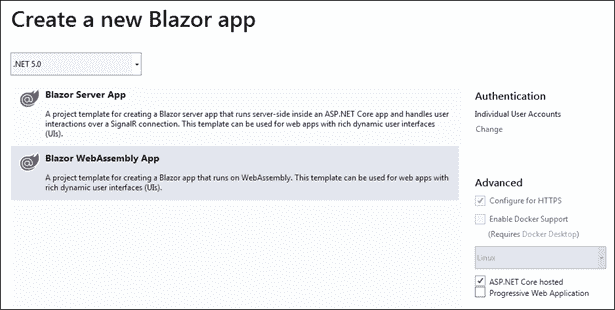

# 16

# Blazor WebAssembly

在本章中，您将学习如何使用 Blazor WebAssembly 实现表示层。Blazor WebAssembly 应用程序是可以在任何支持 WebAssembly 技术的浏览器中运行的 C# 应用程序。它们可以通过导航到特定的 URL 进行访问，并作为标准静态内容在浏览器中下载，由 HTML 页面和可下载文件组成。

Blazor 应用程序使用了我们在*第 15 章*中已经分析过的许多技术，*介绍了 ASP.NET 核心 MVC*，例如依赖注入和 Razor。因此，我们强烈建议在阅读本章之前，先学习*第 15 章*，*介绍 ASP.NET 核心 MVC*。

更具体地说，在本章中，您将了解以下主题：

*   Blazor WebAssembly 体系结构
*   Blazor 页面和组件
*   Blazor 表格和验证
*   Blazor 的高级功能，如全球化、身份验证和 JavaScript 互操作性
*   Blazor WebAssembly 的第三方工具
*   用例：在 Blazor WebAssembly 中实现一个简单的应用程序

虽然还有服务器端 Blazor，它像 ASP.NET Core MVC 一样在服务器上运行，但本章仅讨论 Blazor WebAssembly，它完全在用户浏览器中运行，因为本章的主要目的是提供一个有关如何使用客户端技术实现表示层的示例。此外，作为一种服务器端技术，Blazor 无法提供与其他服务器端技术（如 ASP.NET 核心 MVC）相比的性能，我们已经在*第 15 章**介绍了 ASP.NET 核心 MVC*中对其进行了分析。

第一部分给出了 Blazor WebAssembly 总体架构的草图，其余部分描述了特定的功能。必要时，可以通过分析和修改 Visual Studio 在选择 Blazor WebAssembly 项目模板时自动生成的示例代码来澄清概念。最后一节展示了如何通过基于 WWTravelClub book 用例的简单应用程序的实现来使用在实践中学习到的所有概念。

# 技术要求

本章要求安装有所有数据库工具的免费 Visual Studio 2019 社区版或更高版本。基于 WWTravelClub book 用例，通过一个简单的示例应用程序阐明了所有概念。本章代码见[https://github.com/PacktPublishing/Software-Architecture-with-C-9-and-.NET-5](https://github.com/PacktPublishing/Software-Architecture-with-C-9-and-.NET-5) 。

# Blazor WebAssembly 体系结构

Blazor WebAssembly 利用新的 WebAssembly 浏览器功能在浏览器中执行.NET 运行时。通过这种方式，所有开发人员都可以使用整个.NET 代码库和生态系统来实现能够在任何 WebAssembly 兼容浏览器中运行的应用程序。WebAssembly 被认为是 JavaScript 的高性能替代品。它是一个程序集，能够在浏览器中运行，并遵守与 JavaScript 代码相同的限制。这意味着 WebAssembly 代码，如 JavaScript 代码，在一个对所有机器资源的访问非常有限的隔离执行环境中运行。

WebAssembly 不同于过去类似的选项，如 Flash 和 Silverlight，因为它是 W3C 的官方标准。更具体地说，它于 2019 年 12 月 5 日成为官方标准，因此预计其使用寿命较长。事实上，所有主流浏览器都已经支持它了。

然而，WebAssembly 带来的不仅仅是性能！它还创造了运行与现代和高级面向对象语言相关的完整代码库的机会，如 C++（直接编译）、java（字节码）和 C（net）在浏览器中。

Microsoft 建议使用 Unity 3D 图形框架和 Blazor 在浏览器中运行.NET 代码。

在 WebAssembly 出现之前，浏览器中运行的表示层只能用 JavaScript 实现，而维护这种语言带来的大型代码库会带来所有问题。

现在，有了 Blazor，我们可以在现代和高级 C# 中实现复杂的应用程序，C# 编译器和 Visual Studio 为这种语言提供了一切便利。

此外，通过 Blazor，所有.NET 开发人员都可以使用.NET framework 的全部功能来实现在浏览器中运行的表示层，并与服务器端运行的所有其他层共享库和类。

下面的小节描述了 Blazor 的总体架构。第一小节探讨单页应用程序的一般概念，指出 Blazor 的特性。

## 什么是单页应用程序？

**单页应用程序**（**SPA**）是一个基于 HTML 的应用程序，其中 HTML 由在浏览器本身运行的代码更改，而不是向服务器发出新请求并从头呈现新的 HTML 页面。SPA 能够通过用新的 HTML 替换完整的页面区域来模拟多页面体验。

SPA框架是为实现 SPA 而明确设计的框架。在 WebAssembly 之前，所有 SPA 框架都基于 JavaScript。最著名的基于 JavaScript 的 SPA 框架是 Angular、React.js 和 Vue.js。

所有 SPA 框架都提供了将数据转换为 HTML 以显示给用户的方法，并依靠名为*路由器*的模块来模拟页面更改。通常，数据会填充 HTML 模板的占位符，并选择要呈现的模板部分（如果是类似的构造），以及呈现的次数（对于类似的构造）。

Blazor 模板语言是 Razor，我们已经在*第 15 章**介绍 ASP.NET 核心 MVC*中描述过。

为了增加模块性，代码被组织成组件，这些组件是一种虚拟 HTML 标记，一旦呈现，就会生成实际的 HTML 标记。与 HTML 标记一样，组件也有其属性（通常称为参数）和自定义事件。由开发人员负责确保每个组件使用其参数来创建适当的 HTML，并确保生成足够的事件。组件可以分层方式在其他组件内部使用。

应用程序路由器通过选择组件、充当页面并将其放置在预定义区域来执行其工作。每个页面组件都有一个与之关联的 web 地址路径。这个与 web 应用程序域连接的路径成为一个 URL，它以单音形式标识页面。与通常的 web 应用程序一样，页面 URL 用于与路由器进行通信，通过通常的链接或路由方法/功能加载哪个页面。

一些 SPA 框架还提供了预定义的依赖项注入引擎，以确保在一端的组件和另一端的通用服务以及在浏览器中运行的业务代码之间实现更好的分离。在本小节列出的框架中，只有 Blazor 和 Angular 具有现成的依赖注入引擎。

基于 JavaScript的 SPA框架通常在几个 JavaScript 文件中编译所有 JavaScript 代码，然后执行所谓的树抖动，即删除所有未使用的代码。

目前，Blazor 将主应用程序引用的所有 DLL 保持为单独的，并分别对每个 DLL 执行树抖动。

下一小节开始描述 Blazor 架构。我们鼓励您创建一个名为`BlazorReview`的 Blazor WebAssembly 项目，这样您就可以检查本章中解释的代码和构造。请选择**个人用户账号**进行身份验证，选择**ASP.NET 核心托管**。通过这种方式，VisualStudio 还将创建一个 ASP.NET 核心项目，该项目使用所有身份验证和授权逻辑与 Blazor 客户端应用程序进行通信。

<figure class="mediaobject"></figure>

图 16.1：创建 BlazorReview 应用程序

如果启动应用程序并尝试登录或尝试访问需要登录的页面，则会出现一个错误，说明尚未应用数据库迁移。点击消息旁边的链接就足够应用挂起的迁移了。否则，如*第 8 章*的*实体框架核心迁移*部分所述，*与 C#–实体框架核心*中的数据交互，转到 Visual Studio Package Manager 控制台并运行`Update-Database`命令。

## 加载和启动应用程序

Blazor WebAssembly 应用程序的 URL 始终包含一个`index.html`静态 HTML 页面。在我们的`BlazorReview`项目中，`index.html`在`BlazorReview.Client->wwwroot->index.html`中。此页面是 Blazor 应用程序将在其中创建其 HTML 的容器。它包含一个带有`viewport meta`声明、标题和整个应用程序 CSS 的 HTML 标题。VisualStudio 默认项目模板添加了一个特定于应用程序的 CSS 文件和引导 CSS，样式为中性。您可以使用自定义样式的引导 CSS 或完全不同的 CSS 框架替换默认引导 CSS。

正文包含以下代码：

```cs
<body>
<div id="app">Loading...</div>
<div id="blazor-error-ui">
        An unhandled error has occurred.
<a href="" class="reload">Reload</a>
<a class="dismiss"></a>
</div>
<script 
src="_content/Microsoft.AspNetCore.Components.WebAssembly.Authentication/AuthenticationService.js">
</script>
<script src="_framework/blazor.webassembly.js"></script>
</body> 
```

初始的`div`是应用程序放置其生成的代码的位置。在 Blazor 应用程序加载和启动时，`div`中的任何标记都会出现，然后会被应用程序生成的 HTML 替换。第二个`div`通常不可见，只有 Blazor 截获未处理的异常时才会出现。

`blazor.webassembly.js`包含 Blazor 框架的 JavaScript 部分。除此之外，它还负责下载.NET 运行时以及所有应用程序 DLL。更具体地说，`blazor.webassembly.js`下载`blazor.boot.json`文件，该文件列出了所有应用程序文件及其哈希值。然后，`blazor.webassembly.js`下载此文件中列出的所有资源并验证其哈希。`blazor.webassembly.js`下载的所有资源都是在构建或发布应用程序时创建的。

只有当项目启用身份验证并考虑 Blazor 使用的`OpenID Connect`协议时，才会添加`AuthenticationService.js`，Blazor 使用该协议利用其他身份验证凭据（如 Cookie）获取承载令牌，这是通过 Web API 与服务器交互的客户端的首选身份验证凭据。认证将在本章后面的*认证和授权*小节中详细讨论，而承载令牌将在*第 14 章**的*REST 服务授权和认证*小节中讨论应用以.NET 为核心的面向服务架构*。

Blazor 应用程序入口点位于`BlazorReview.Client->Program.cs`文件中。其结构如下：

```cs
public class Program
{
    public static async Task Main(string[] args)
        {
            var builder = WebAssemblyHostBuilder.CreateDefault(args);
            builder.RootComponents.Add<App>("# app");
            // Services added to the application 
            // Dependency Injection engine declared with statements like:
            // builder.Services.Add...
            await builder.Build().RunAsync();
        }
    } 
```

`WebAssemblyHostBuilder`是创建`WebAssemblyHost`的构建器，这是*第 5 章*的*使用通用主机*小节中讨论的通用主机的特定于 WebAssembly 的实现，*将微服务架构应用于您的企业应用程序*（鼓励您查看该小节）。第一个构建器配置说明声明 Blazor 根组件（`App`），它将包含整个组件树，并在`Index.html`页面的哪个 HTML 标记中放置它（`# app`）。更具体地说，`RootComponents.Add`添加一个托管服务，负责处理整个 Blazor 组件树。我们可以在同一 HTML 页面中运行多个 Blazor WebAssembly 用户界面，方法是多次调用`RootComponents.Add`，每次使用不同的 HTML 标记引用。

`builder.Services`包含向Blazor 应用程序依赖引擎添加服务的所有常用方法和扩展方法：`AddScoped`、`AddTransient`、`AddSingleton`等等。与 ASP.NET 核心 MVC 应用程序一样（*第 15 章*、*介绍 ASP.NET 核心 MVC*），服务是实现业务逻辑和存储共享状态的首选位置。在 ASP.NET 核心 MVC 中，服务通常被传递给控制器，而在 Blazor WebAssembly 中，服务被注入到组件中。

下一小节将解释根`App`组件如何模拟页面更改。

## 路由

主机建筑代码引用的根`App`类在`BlazorReview.Client->App.razor`文件中定义。`App`是一个 Blazor 组件，与所有 Blazor 组件一样，它是在一个扩展名为`.razor`的文件中定义的，并使用了丰富了组件表示法的 Razor 语法，也就是说，带有表示其他 Blazor 组件的类似 HTML 的标记。它包含处理应用程序页面的整个逻辑：

```cs
<CascadingAuthenticationState>
<Router AppAssembly="@typeof(Program).Assembly">
<Found Context="routeData">
<AuthorizeRouteView RouteData="@routeData"
                    DefaultLayout="@typeof(MainLayout)">
<NotAuthorized>
@*Template that specifies what to show 
when user is not authorized *@
</NotAuthorized>
</AuthorizeRouteView>
</Found>
<NotFound>
<LayoutView Layout="@typeof(MainLayout)">
<p>Sorry, there's nothing at this address.</p>
</LayoutView>
</NotFound>
</Router>
</CascadingAuthenticationState> 
```

前面代码中的所有标记表示组件或特定组件参数，称为模板。本章将详细讨论组件。现在，把它们想象成一种自定义 HTML 标记，我们可以用 C# 和 Razor 代码来定义它。相反，模板是接受 Razor 标记作为值的参数。本节后面的*模板和级联参数*小节将讨论模板。

`CascadingAuthenticationState`组件的唯一功能是将身份验证和授权信息传递给其内部组件树的所有组件。只有在项目创建期间选择添加授权时，VisualStudio 才会生成它。

`Router`组件是实际的应用程序路由器。它扫描传入`AppAssembly`参数的程序集，查找包含路由信息的组件，即可以用作页面的组件。VisualStudio 将包含`Program`类的程序集传递给它，即主应用程序。其他程序集中包含的页面可以通过`AdditionalAssemblies`参数添加，该参数接受程序集的`IEnumerable`。

之后，路由器会截获所有页面更改，这些更改可以是通过代码执行的，也可以是通过指向应用程序基址内地址的普通`<a>`HTML 标记执行的。导航可以通过代码处理，需要依赖注入的`NavigationManager`实例。

`Router`组件有两个模板，一个用于找到请求 URI 的页面的情况（`Found`，另一个用于找不到该页面的情况（`NotFound`。当应用程序使用授权时，`Found`模板由`AuthorizeRouteView`组件组成，进一步区分用户是否有权访问所选页面。当应用程序不使用授权时，`Found`模板由`RouteView`组件组成：

```cs
<RouteView RouteData="@routeData" DefaultLayout="@typeof(MainLayout)" /> 
```

`RouteView`获取所选页面，并将其呈现在`DefaultLayout`参数指定的布局页面内。此规范作为默认规范，因为每个页面都可以通过指定不同的布局页面来覆盖它。Blazor 布局页面的工作原理类似于*第 15 章*中*重用视图代码*小节中描述的 ASP.NET 核心 MVC 布局页面，*呈现 ASP.NET 核心 MVC*，唯一的区别是添加页面标记的位置用`@Body`指定：

```cs
<div class="content px-4">
      @Body
</div> 
```

在 Visual Studio 模板中，默认布局页面位于`BlazorReview.Client->Shared->MainLayout.razor`文件中。

如果应用程序使用授权，`AuthorizeRouteView`的工作方式与`RouteView`类似，但它也允许在用户未经授权的情况下指定模板：

```cs
<NotAuthorized>
@if (!context.User.Identity.IsAuthenticated)
{
<RedirectToLogin />
}
else
{
<p>You are not authorized to access this resource.</p>
}
</NotAuthorized> 
```

如果用户未通过身份验证，`RedirectToLogin`组件使用`NavigationManager`实例移动到登录逻辑页面，否则通知用户他们没有足够的权限访问所选页面。

Blazor WebAssembly 还允许延迟加载程序集以缩短初始应用程序加载时间，但由于空间不足，我们将不在这里讨论它。*进一步阅读*部分包含对 Blazor 官方文件的参考。

# Blazor 页面和组件

在本节中，您将学习 Blazor 组件的基础知识，如何定义组件及其结构，如何将事件附加到 HTML 标记，如何定义其属性，以及如何使用组件中的其他组件。我们将所有内容组织成不同的小节。第一小节介绍了组件结构的基本知识。

## 组件结构

组件在扩展名为`.razor`的文件中定义。一旦编译，它们就成为继承自`ComponentBase`的类。与所有其他 Visual Studio 项目元素一样，Blazor 组件可通过**添加新项**菜单获得。通常，用作页面的组件在`Pages`文件夹或其子文件夹中定义，而其他组件在不同的文件夹中组织。默认 Blazor 项目将其所有非页面组件添加到`Shared`文件夹中，但您可以对其进行不同的组织。

默认情况下，将为页面分配一个名称空间，该名称空间对应于页面所在文件夹的路径。因此，例如，在我们的示例项目中，`BlazorReview.Client->Pages`路径中的所有页面都被分配到`BlazorReview.Client.Pages`名称空间。但是，您可以通过在文件顶部的声明区域中放置一个`@namespace`声明来更改此默认名称空间。此区域还可能包含其他重要声明。以下是显示所有声明的示例：

```cs
@page "/counter"
@layout MyCustomLayout
@namespace BlazorApp2.Client.Pages
@using Microsoft.AspNetCore.Authorization
@implements MyInterface
@inherits MyParentComponent
@typeparam T
@attribute [Authorize]
@inject NavigationManager navigation 
```

前两个指令仅适用于必须作为页面工作的组件。更具体地说，`@layout`指令用另一个组件覆盖默认布局页面，而`@page`指令在应用程序基础 URL 中定义页面的路径（**路由**。因此，例如，如果我们的应用程序在`https://localhost:5001`上运行，那么上面页面的 URL 将是`https://localhost:5001/counter`。页面路由也可以包含如下示例中的参数：`/orderitem/{customer}/{order}`。参数名称必须与组件定义为参数的公共特性相匹配。匹配不区分大小写，本小节稍后将解释参数。

实例化每个参数的字符串将转换为参数类型，如果转换失败，将引发异常。可以通过将类型与每个参数关联来防止此行为，在这种情况下，如果对指定类型的转换失败，则与页面 URL 的匹配失败。仅支持基本类型：`/orderitem/{customer:int}/{order:int}`。参数是必须的，也就是说，如果找不到，匹配将失败，路由器将尝试其他页面。但是，通过指定两个`@page`指令，一个带参数，另一个不带参数，可以将参数设置为可选。

`@namespace`覆盖组件的默认名称空间，而`@using`相当于通常的 C# `using`。特殊`{project folder}->_Imports.razor`文件夹中声明的`@using`将自动应用于所有组件。

`@inherits`声明该组件是另一个组件的子类，`@implements`声明它实现了一个接口。

如果组件是泛型类，则使用`@typeparam`，并声明泛型参数的名称，`@attribute`声明应用于组件类的任何属性。属性级属性直接应用于代码区域中定义的属性，因此它们不需要特殊的符号。应用于用作页面的组件类的`[Authorize]`属性可防止未经授权的用户访问该页面。它的工作方式与应用于 ASP.NET 核心 MVC 中的控制器或操作方法时完全相同。

最后，`@inject`指令要求依赖注入引擎有一个类型实例，并将其插入类型名称后声明的字段中；在上例中，`navigation`参数中。

组件文件的中间部分包含 HTML，该 HTML 将由带有 Razor 标记的组件呈现，并通过子组件的可能调用而丰富。

文件的底部由一个`@code`构造封闭，包含实现该组件的类的字段、属性和方法：

```cs
@code{
 ...
 private string myField="0";
 [Parameter]
 public int Quantity {get; set;}=0;
 private void IncrementQuantity ()
 {
         Quantity++;
 }
 private void DecrementQuantity ()
 {
        Quantity--;
        if (Quantity<0) Quantity=0;
 }
 ... 
} 
```

以`[Parameter]`属性修饰的公共属性作为组件参数；也就是说，当该组件被实例化为另一个组件时，它们用于将值传递给修饰的属性，就像值传递给 HTML 标记中的 HTML 元素一样：

```cs
<OrderItem Quantity ="2" Id="123"/> 
```

值也可以通过与大小写不变匹配中的属性名称匹配的页面路由参数传递给组件参数：

```cs
OrderItem/{id}/{quantity} 
```

组件参数也可以接受复杂的类型和功能：

```cs
<modal title='() => "Test title" ' ...../> 
```

如果组件是泛型的，则必须为使用`typeparam`声明的每个泛型参数传递类型值：

```cs
<myGeneric T= "string"……/> 
```

但是，编译器通常能够从其他参数的类型推断泛型类型。

最后，`@code`指令中包含的代码也可以在与组件具有相同名称和命名空间的分部类中声明：

```cs
public partial class Counter
{
  [Parameter] 
public int CurrentCounter {get; set;}=0;
  ...
  ...
} 
```

通常，这些分部类在组件的同一文件夹中声明，文件名等于添加了`.cs`后缀的组件文件名。因此，例如，与`counter.razor`组件关联的部分类将是`counter.razor.cs`。

每个组件还可能有一个关联的 CSS 文件，其名称必须是组件文件的名称加上`.css`后缀。因此，例如，与`counter.razor`组件关联的 CSS 文件将是`counter.razor.css`。此文件中包含的 CSS 仅应用于组件，对页面的其余部分没有影响。这称为 CSS 隔离，目前，它是通过向所有组件 HTML 根添加唯一属性来实现的。然后，组件 CSS 文件的所有选择器的作用域都是此属性，这样它们就不会影响其他 HTML。

每当组件用`[Parameter(CaptureUnmatchedValues = true)]`装饰`IDictionary<string, object>`参数时，插入到标记中的所有不匹配参数，即没有匹配组件属性的所有参数，都会作为键值对添加到`IDictionary`中。

此功能提供了一种将参数转发到 HTML 元素或组件标记中包含的其他子组件的简单方法。例如，如果我们有一个`Detail`组件，它显示在其`Value`参数中传递的对象的详细视图，我们可以使用此功能将所有常用的 HTML 属性转发到该组件的根 HTML 标记，如下例所示：

```cs
<div  @attributes="AdditionalAttributes">
...
</div>
@code{
[Parameter(CaptureUnmatchedValues = true)]
public Dictionary<string, object>
AdditionalAttributes { get; set; }
 [Parameter]
 Public T Value {get; set;}
} 
```

这样，添加到组件标记（例如 class）的常见 HTML 属性被转发到组件的根目录`div`，并以某种方式用于设置组件的样式：

```cs
<Detail Value="myObject" class="my-css-class"/> 
```

下一小节将解释如何将标记生成函数传递给组件。

## 模板和级联参数

Blazor 的工作原理是构建一个名为**呈现树**的数据结构，该结构会随着 UI 的变化而更新。在每次更改时，Blazor 都会定位必须呈现的 HTML 部分，并使用**呈现树**中包含的信息对其进行更新。

`RenderFragment`委托定义了一个函数，该函数能够向**呈现树**的特定位置添加更多标记。还有一个`RenderFragment<T>`接受另一个参数，可以用来驱动标记生成。例如，您可以将一个`Customer`对象传递给`RenderFragment<T>`，这样它就可以呈现该特定客户的所有数据。

您可以使用 C 代码定义一个`RenderFragment`或`RenderFragment<T>`，但最简单的方法是使用 Razor 标记在组件中定义它。Razor 编译器将负责为您生成正确的 C 代码：

```cs
RenderFragment myRenderFragment = @<p>The time is @DateTime.Now.</p>;
RenderFragment<Customer> customerRenderFragment = 
(item) => @<p>Customer name is @item.Name.</p>; 
```

有关添加标记的位置的信息在作为参数接收的`RenderTreeBuilder`参数中传递。只需调用`RenderFragment`即可在组件 Razor 标记中使用`RenderFragment`，如下例所示：

```cs
RenderFragment myRenderFragment = ...
  ...
<div>
  ...
  @myRenderFragment
  ...
</div>
  ... 
```

调用`RenderFragment`的位置定义了它将添加标记的位置，因为组件编译器能够生成要传递给它的正确`RenderTreeBuilder`参数。`RenderFragment<T>`委托被调用，如图所示：

```cs
Customer myCustomer = ...
  ...
<div>
  ...
  @myRenderFragment(myCustomer)
  ...
</div>
  ... 
```

作为函数，渲染片段可以像所有其他类型一样传递给组件参数。但是，Blazor 有一个特定的语法，可以更容易地同时定义和将渲染片段传递给组件，**模板**语法。首先，定义组件中的参数：

```cs
[Parameter]
Public RenderFragment<Customer>CustomerTemplate {get; set;}
[Parameter]
Public RenderFragment Title {get; set;} 
```

然后，当您致电客户时，您可以执行以下操作：

```cs
<Detail>
<Title>
<h5>This is a title</h5>
</Title>
<CustomerTemplate Context=customer>
<p>Customer name is @customer.Name.</p>
</CustomerTemplate >
</Detail> 
```

每个渲染片段参数由一个与参数同名的标记表示。可以将定义渲染片段的标记放置在其中。对于有参数的`CustomerTemplate`，关键字`Context`定义了标记中的参数名称。在我们的示例中，选择的参数名称是`customer`。

当一个组件只有一个渲染片段参数时，如果它被命名为`ChildContent`，则模板标记可以直接包含在组件的打开和结束标记之间：

```cs
[Parameter]
Public RenderFragment<Customer> ChildContent {get; set;}
……………
……………
<IHaveJustOneRenderFragment Context=customer>
<p>Customer name is @customer.Name.</p>
</IHaveJustOneRenderFragment> 
```

为了熟悉组件模板，让我们修改`Pages->FetchData.razor`页面，使其使用`Repeater`组件而不是`foreach`。

让我们右键点击`Shared`文件夹，选择**添加**，然后选择**剃须刀组件**，添加一个新的**Repeater.Razor**组件。然后，将现有代码替换为：

```cs
@typeparam T
@foreach(var item in Values)
{
@ChildContent(item)
}
@code {
    [Parameter]
public RenderFragment<T> ChildContent { get; set; }
    [Parameter]
public IEnumerable<T> Values { get; set; }
} 
```

该组件使用通用参数定义，因此可以与任何`IEnumerable`一起使用。现在让我们用以下内容替换**FetchData.razor**组件`tbody`中的标记：

```cs
<Repeater Values="forecasts" Context="forecast">
<tr>
<td>@forecast.Date.ToShortDateString()</td>
<td>@forecast.TemperatureC</td>
<td>@forecast.TemperatureF</td>
<td>@forecast.Summary</td>
</tr>
</Repeater> 
```

由于`Repeater`组件只有一个模板，并且我们将其命名为`ChildContent`，因此我们可以将模板标记直接放在组件打开和关闭标记中。运行它并验证页面是否正常工作。您已经学习了如何使用模板，并且组件中的标记定义了模板。

一个重要的预定义模板 Blazor 组件是`CascadingValue`组件。它呈现放置在其中的内容，不做任何更改，但将类型实例传递给其所有子组件：

```cs
<CascadingValue  Value="new MyOptionsInstance{...}">
……
</CascadingValue > 
```

放置在`CascadingValue`标记内的所有组件及其所有后代组件现在都可以捕获`CascadingValueValue`参数中传递的`MyOptionsInstance`实例。组件使用与`MyOptionsInstance`兼容的类型声明公共或私有属性，并使用`CascadingParameter`属性对其进行修饰就足够了：

```cs
[CascadingParameter]
privateMyOptionsInstance options {get; set;} 
```

匹配是按类型兼容性执行的。如果与兼容类型的其他级联参数不明确，我们可以指定`CascadingValue`组件的`Name`可选参数，并将相同的名称传递给`CascadingParameter`属性：`[CascadingParameter("myUnique name")]`。

`CascadingValue`标记还有一个`IsFixed`参数，出于性能原因，应尽可能将该参数设置为`true`。事实上，传播级联值对于传递选项和设置非常有用，但它具有非常高的计算成本。

当`IsFixed`设置为`true`时，仅执行一次传播，即第一次呈现每段相关内容，然后在内容的生命周期内不尝试更新级联值。因此，只要在内容的生命周期内级联对象的指针没有改变，就可以使用`IsFixed`。

级联值的一个例子是我们在*路由*小节中遇到的`CascadingAuthenticationState`组件，它将身份验证和授权信息级联到所有呈现的组件。

## 事件

HTML 标记和 Blazor 组件都使用属性/参数来获取输入。HTML 标记通过事件向页面的其余部分提供输出，Blazor 允许将 C# 函数附加到 HTML`on{event name}`属性。语法如`Pages->Counter.razor`组件所示：

```cs
<p>Current count: @currentCount</p>
<button class="btn btn-primary" @onclick="IncrementCount">Click me</button>
@code {
private int currentCount = 0;
private void IncrementCount()
    {
        currentCount++;
    }
} 
```

该函数也可以作为 lambda 内联传递。此外，它接受 C# 等价于通常的`event`参数。*进一步阅读*部分包含指向 Blazor 官方文档页面的链接，该页面列出了所有支持的事件及其参数。

Blazor 还允许组件中的事件，因此它们也可以返回输出。组件事件是类型为`EventCallBack`或`EventCallBack<T>`的参数。`EventCallBack`是不带参数的组件事件类型，`EventCallBack<T>`是带`T`类型参数的组件事件类型。为了触发事件，例如`MyEvent`，组件调用：

```cs
awaitMyEvent.InvokeAsync() 
```

或

```cs
awaitMyIntEvent.InvokeAsync(arg) 
```

这些调用执行绑定到事件的处理程序，如果没有绑定处理程序，则不执行任何操作。

一旦定义，组件事件可以与 HTML 元素事件完全相同的方式使用，唯一的区别是不需要在事件名称前加上`@`，因为 HTML 事件中的`@`需要区分 HTML 属性和 Blazor 添加的同名参数：

```cs
[Parameter]
publicEventCallback MyEvent {get; set;}
[Parameter]
publicEventCallback<int> MyIntEvent {get; set;}
...
...
<ExampleComponent 
MyEvent="() => ..." 
MyIntEvent = "(i) =>..." /> 
```

实际上，HTML 元素事件也是`EventCallBack<T>`，这就是为什么两种事件类型的行为方式完全相同。`EventCallBack`和`EventCallBack<T>`是结构，而不是委托，因为它们包含委托以及指向实体的指针，必须通知实体事件已触发。形式上，该实体由一个`Microsoft.AspNetCore.Components.IHandleEvent`接口表示。不用说，所有组件都实现了这个接口。通知通知`IHandleEvent`状态发生变化。状态更改在 Blazor 更新页面 HTML 的方式中起着重要作用。我们将在下一小节中详细分析它们。

对于 HTML 元素，Blazor 还可以通过向指定事件的属性添加`:preventDefault`和`:stopPropagation`指令来停止事件的默认操作和事件冒泡，如以下示例所示：

```cs
@onkeypress="KeyHandler" @onkeypress:preventDefault="true"
@onkeypress="KeyHandler" @onkeypress:preventDefault="true" @onkeypress:stopPropagation  ="true" 
```

## 绑定

通常，组件参数值必须与外部变量、属性或字段保持同步。这种同步的典型应用是在输入组件或 HTML 标记中编辑对象属性。每当用户更改输入值时，必须一致地更新对象属性，反之亦然。渲染组件后，必须立即将对象特性值复制到组件中，以便用户可以对其进行编辑。

类似的场景由参数事件对处理。更具体地说，从一侧将特性复制到输入组件参数中。另一方面，每次输入更改值时，都会触发更新属性的组件事件。这样，属性值和输入值保持同步。

这个场景非常常见和有用，Blazor 有一个特定的语法来同时定义事件和将属性值复制到参数中。这种简化的语法要求事件与交互中涉及的参数具有相同的名称，但带有`Changed`后缀。

例如，假设一个组件有一个`Value`参数。那么对应的事件必须是`ValueChanged`。此外，每次用户更改组件值时，组件必须通过调用`await ValueChanged.InvokeAsync(arg)`来调用`ValueChanged`事件。有了它，属性`MyObject.MyProperty`可以与`Value`属性同步，语法如下所示：

```cs
<MyComponent @bind-Value="MyObject.MyProperty"/> 
```

前面的语法称为**绑定**。Blazor 负责自动将更新`MyObject.MyProperty`属性的事件处理程序附加到`ValueChanged`事件。

HTML 元素的绑定以类似的方式工作，但由于开发人员无法确定参数和事件的名称，因此必须使用稍微不同的约定。首先，绑定中不需要指定参数名，因为它始终是 HTML 输入`value`属性。因此，绑定被简单地写为`@bind="object.MyProperty"`。默认情况下，对象属性在`change`事件上更新，但您可以通过添加`@bind-event: @bind-event="oninput"`属性来指定不同的事件。

此外，HTML 输入的绑定尝试将输入字符串自动转换为目标类型。如果转换失败，输入将恢复为初始值。这种行为非常原始，因为在发生错误时，不会向用户提供错误消息，并且没有正确考虑区域性设置（HTML5 输入使用不变区域性，但文本输入必须使用当前区域性）。我们建议只将输入绑定到字符串目标类型。Blazor 具有处理日期和数字的特定组件，只要目标类型不是字符串，就应该使用这些组件。我们将在*Blazor 表单和验证*部分对其进行描述。

为了熟悉事件，让我们编写一个组件，在用户单击确认按钮时同步输入类型文本的内容。让我们右键单击`Shared`文件夹并添加一个新的**ConfirmedText.razor**组件。然后将其代码替换为：

```cs
<input type="text" @bind="Value" @attributes="AdditionalAttributes"/>
<button class="btn btn-secondary" @onclick="Confirmed">@ButtonText</button>
@code {
    [Parameter(CaptureUnmatchedValues = true)]
public Dictionary<string, object> AdditionalAttributes { get; set; }
    [Parameter]
public string Value {get; set;}
    [Parameter]
public EventCallback<string> ValueChanged { get; set; }
    [Parameter]
public string ButtonText { get; set; }
async Task Confirmed()
    {
        await ValueChanged.InvokeAsync(Value);
    }
} 
```

`ConfirmedText`组件利用按钮点击事件触发`ValueChanged`事件。此外，组件本身使用`@bind`将其`Value`参数与 HTML 输入同步。值得指出的是，组件使用`CaptureUnmatchedValues`将应用于其标记的所有 HTML 属性转发到 HTML 输入。通过这种方式，`ConfirmedText`组件的用户可以通过简单地向组件标签添加`class`和/或`style`属性来设置输入字段的样式。

现在让我们在`Pages->Index.razor`页面中使用该组件，将以下代码放在`Index.razor`的末尾：

```cs
<ConfirmedText @bind-Value="textValue" ButtonText="Confirm" />
<p>
    Confirmed value is: @textValue
</p>
@code{
private string textValue = null;
} 
```

如果您运行项目并播放输入及其**确认**按钮，您将看到每次点击确认按钮时，不仅会复制`textValue`页面属性中的输入值，而且组件后面的段落内容也会一致更新。

我们将`textValue`与`@bind-Value`组件显式同步，但谁负责将`textValue`与段落内容保持同步？答案在下一小节。

## Blazor 如何更新 HTML

当我们用类似于`@model.property`的东西在 Razor 标记中写入变量、属性或字段的内容时，Blazor 不仅在呈现组件时呈现变量、属性或字段的实际值，而且还尝试在该值每一次更改时更新 HTML，使用一个称为**的过程变更检测**。更改检测是所有主要 SPA 框架的一个特性，但是 Blazor 实现它的方式非常简单和优雅。

其基本思想是，一旦呈现了所有 HTML，只有在事件内部执行代码时才会发生更改。这就是为什么`EventCallBack`和`EventCallBack<T>`包含对`IHandleEvent`的引用。当组件将处理程序绑定到事件时，Razor 编译器会创建一个`EventCallBack`或`EventCallBack<T>`构造函数，将绑定到事件的函数和定义函数的组件传递给它的`struct`构造函数（`IHandleEvent`。

一旦处理程序的代码被执行，Blazor 运行时就会收到通知，`IHandleEvent`可能已经更改。事实上，处理程序代码只能更改定义处理程序的组件的变量、属性或字段的值。反过来，这会触发源于组件的更改检测。Blazor 验证组件标记中使用的变量、属性或字段是否已更改，并更新关联的 HTML。

如果更改的变量、属性或字段是另一个组件的输入参数，则该组件生成的 HTML 也可能需要更新。因此，递归地触发根植于该组件中的另一个变更检测过程。

仅当满足下列条件时，前面绘制的算法才会发现所有相关更改：

1.  没有组件引用属于事件处理程序中其他组件的数据结构。
2.  组件的所有输入都通过其参数到达，而不是通过方法调用或其他公共成员到达。

当由于上述条件之一的失败而未检测到更改时，开发人员必须手动声明组件的可能更改。这可以通过调用`StateHasChanged()`组件方法来实现。由于此调用可能会导致页面 HTML 的更改，因此其执行不能异步进行，但必须在 HTML 页面 UI 线程中排队。这是通过将要执行的函数传递给`InvokeAsync`组件方法来完成的。

综上所述，要执行的指令是`await InvokeAsync(StateHasChanged)`。

下一小节总结了组件的描述，并分析了组件的生命周期和相关的生命周期方法。

## 组件生命周期

每个组件生命周期事件都有一个关联的方法。有些方法既有同步版本也有异步版本，有些方法只有异步版本，有些方法只有同步版本。

组件生命周期从在关联组件属性中传递给要复制的组件的参数开始。您可以通过重写以下方法自定义此步骤：

```cs
public override async Task SetParametersAsync(ParameterView parameters)
{
await ...
await base.SetParametersAsync(parameters);
} 
```

通常，自定义包括修改其他数据结构，因此会调用 base 方法来执行在关联属性中复制参数的默认操作。

之后，将进行与两种方法关联的组件初始化：

```cs
protected override void OnInitialized()
{
    ...
}
protected override async Task OnInitializedAsync()
{
await ...
} 
```

组件创建并添加到渲染树后，将在组件生存期内立即调用它们一次。请将任何初始化代码放在那里，而不要放在组件构造函数中，因为这将提高组件的可测试性，因为在那里，您已经设置了所有参数，而且未来的 Blazor 版本可能会汇集和重用组件实例。

如果组件销毁时初始化代码订阅了某些事件或执行了需要清理的动作，则执行`IDisposable`，并将所有清理代码放入其`Dispose`方法中。事实上，每当组件实现`IDisposable`时，Blazor 都会在销毁它之前调用其`Dispose`方法。

组件初始化后，每次组件参数更改时，将调用以下两种方法：

```cs
protected override async Task OnParametersSetAsync()
{
await ...
}
protected override void OnParametersSet()
{
    ...
} 
```

它们是更新依赖于组件参数值的数据结构的正确位置。

之后，将渲染或重新渲染组件。您可以通过覆盖`ShouldRender`方法来防止更新后组件重新呈现：

```cs
protected override bool ShouldRender()
{
...
} 
```

仅当您确信组件的 HTML 代码将发生更改时，才允许组件重新呈现是组件库实现中使用的一种高级优化技术。

组件呈现阶段还涉及调用其子组件。因此，只有在其所有子组件也完成渲染后，组件渲染才被视为完成。渲染完成后，将调用以下方法：

```cs
protected override void OnAfterRender(bool firstRender)
{
if (firstRender)
    {
    }
...
}
protected override async Task OnAfterRenderAsync(bool firstRender)
{
if (firstRender)
    {
    await...
        ...
    }
    await ...
} 
```

由于调用上述方法时，所有组件 HTML 都已更新，所有子组件都已执行其所有生存期方法，因此上述方法是执行以下操作的正确位置：

*   调用操纵生成的 HTML 的 JavaScript 函数。JavaScript 调用在*JavaScript 互操作性*小节中描述。
*   处理子组件附加到参数或级联参数的信息。事实上，像组件和其他组件这样的选项卡可能需要在根组件中注册它们的一些子部分，因此根组件通常级联一个数据结构，其中一些子组件可以注册。在`AfterRender`和`AfterRenderAsync`中编写的代码可以依赖这一事实，即所有子部分都已完成注册。

下一节介绍用于收集用户输入的 Blazor 工具。

# Blazor 表格和验证

与所有主要 SPA 框架类似，Blazor 还提供了处理用户输入的特定工具，同时向用户提供错误消息和即时视觉线索的有效反馈。整个工具集称为**Blazor Forms**，由一个名为`EditForm`的表单组件、各种输入组件、数据注释验证器、验证错误摘要和验证错误标签组成。

`EditForm`通过级联在表单内部的`EditContext`类实例，负责编排所有输入组件的状态。编排来自输入组件和数据注释验证器与这个`EditContext`实例的交互。验证摘要和错误消息标签不参与编排，而是注册到一些`EditContext`事件，以通知错误。

必须将其属性必须在其`Model`参数中呈现的对象传递给`EditForm`。值得指出的是，绑定到嵌套属性的输入组件没有经过验证，因此必须向`EditForm`传递一个展开的 ViewModel。`EditForm`创建一个新的`EditContext`实例，将在其`Model`参数中接收的对象传递给其构造函数，并将其级联，以便与表单内容交互。

您也可以直接在`EditForm`的`EditContext`参数中传递`EditContext`自定义实例，而不是在`Model`参数中传递对象，在这种情况下`EditForm`将使用您的自定义副本，而不是创建新实例。通常，当您需要订阅`EditContextOnValidationStateChanged`和`OnFieldChanged`活动时，您会这样做。

当使用**提交**按钮提交`EditForm`并且没有错误时，表单调用其`OnValidSubmit`回调，您可以在其中放置使用和处理用户输入的代码。相反，如果存在验证错误，则会显示这些错误，并且表单会调用其`OnInvalidSubmit`回调。

每个输入的状态反映在自动添加到其中的一些 CSS 类中，即：`valid`、`invalid`和`modified`。您可以使用这些类向用户提供足够的视觉反馈。默认的 Blazor Visual Studio 模板已经为它们提供了一些 CSS。

以下是一种典型形式：

```cs
<EditForm Model="FixedInteger"OnValidSubmit="@HandleValidSubmit" >
<DataAnnotationsValidator />
<ValidationSummary />
<div class="form-group">
<label for="integerfixed">Integer value</label>
<InputNumber @bind-Value="FixedInteger.Value"
id="integerfixed" class="form-control" />
<ValidationMessage For="@(() => FixedInteger.Value)" />
</div>
<button type="submit" class="btn btn-primary"> Submit</button>
</EditForm> 
```

标签是标准的 HTML 标签，`InputNumber`是 Blazor 特有的数字属性组件。`ValidationMessage`是仅在发生验证错误时出现的错误标签。默认情况下，它使用`validation-message`CSS 类呈现。与错误消息相关联的属性在`for`参数中通过一个无参数 lambda 传递，如示例所示。

`DataAnnotationsValidator`组件根据通常的.NET 验证属性添加验证，如`RangeAttribute`、`RequiredAttribute`等。您还可以通过继承`ValidationAttribute`类来编写自定义验证属性。

您可以在验证属性中提供自定义错误消息。如果它们包含一个`{0}`占位符，则该占位符将用`DisplayAttribute`中声明的属性显示名称填充，如果找到，则用属性名称填充。

与`InputNumber`组件一起，Blazor 还支持`string`属性的`InputText`组件、要在 HTML`textarea`中编辑的`string`属性的`InputTextArea`组件、用于`bool`属性的`InputCheckbox`组件以及将`DateTime`和`DateTimeOffset`呈现为日期的`InputDate`组件。它们的工作方式与`InputNumber`组件完全相同。没有可用于其他 HTML5 输入类型的组件。特别是，没有任何组件可用于呈现时间或日期和时间，或用于使用`range`小部件呈现数字。

您可以通过继承`InputBase<TValue>`类并重写`BuildRenderTree`、`FormatValueAsString`和`TryParseValueFromString`方法来实现呈现时间或日期和时间。`InputNumber`组件的来源显示了如何执行此操作：[https://github.com/dotnet/aspnetcore/blob/15f341f8ee556fa0c2825cdddfe59a88b35a87e2/src/Components/Web/src/Forms/InputNumber.cs](https://github.com/dotnet/aspnetcore/blob/15f341f8ee556fa0c2825cdddfe59a88b35a87e2/src/Components/We) 。您还可以使用 Blazor WebAssembly 第三方工具一节中描述的第三方库。

Blazor 还有一个用于呈现`select`的特定组件，其工作原理如下例所示：

```cs
<InputSelect @bind-Value="order.ProductColor">
<option value="">Select a color ...</option>
<option value="Red">Red</option>
<option value="Blue">Blue</option>
<option value="White">White</option>
</InputSelect> 
```

由于`InputRadioGroup`和`InputRadio`组件，您还可以使用无线组呈现枚举，如下例所示：

```cs
<InputRadioGroup Name="color" @bind-Value="order.Color">
<InputRadio Name="color" Value="AllColors.Red" /> Red<br>
<InputRadio Name="color" Value="AllColors.Blue" /> Blue<br>
<InputRadio Name="color" Value="AllColors.White" /> White<br>
</InputRadioGroup> 
```

最后，Blazor 还提供了一个`InputFile`组件以及处理和上传文件的所有工具。我们在这里不讨论这一点，但*进一步阅读*部分包含官方文件的链接。

本小节完成 Blazor 基础知识的描述；下一节将分析一些高级功能。

# Blazor 高级功能

本节收集了以小节形式组织的各种 Blazor 高级功能的简短描述。由于篇幅不够，我们无法给出每个功能的所有细节，但缺少的细节将在*进一步阅读*部分的链接中介绍。我们从如何引用 Razor 标记中定义的组件和 HTML 元素开始。

## 对组件和 HTML 元素的引用

有时我们可能需要引用一个组件来调用它的一些方法。例如，对于实现模式窗口的组件，情况就是这样：

```cs
<Modal @ref="myModal">
...
</Modal>
...
<button type="button" class="btn btn-primary" 
@onclick="() => myModal.Show()">
Open modal
</button>
...
@code{
private Modal  myModal {get; set;}
 ...
} 
```

如前面的示例所示，引用是通过`@ref`指令捕获的。同样的`@ref`指令也可用于捕获对 HTML 元素的引用。HTML 引用具有`ElementReference`类型，通常用于调用 HTML 元素上的 JavaScript 函数，如下一小节所述。

## JavaScript 互操作性

由于 Blazor 并没有将所有 JavaScript 特性公开给 C# 代码，而且可以方便地利用巨大的 JavaScript 代码库，因此有时需要调用 JavaScript 函数。Blazor 允许通过`IJSRuntime`接口实现这一点，该接口可以通过依赖项注入注入到组件中。

一旦有了`IJSRuntime`实例，就可以调用返回值的 JavaScript 函数，如下所示：

```cs
T result = await jsRuntime.InvokeAsync<T>(
"<name of JavaScript function or method>", arg1, arg2....); 
```

可以调用不返回任何参数的函数，如下所示：

```cs
awaitjsRuntime.InvokeAsync(
"<name of JavaScript function or method>", arg1, arg2....); 
```

参数可以是基本类型，也可以是可以在 JSON 中序列化的对象，而 JavaScript 函数的名称是一个字符串，可以包含表示访问属性、子属性和方法名称的点，例如，`"myJavaScriptObject.myProperty.myMethod"`字符串。

参数也可以是通过`@ref`指令捕获的`ElementReference`实例，在这种情况下，它们作为 JavaScript 端的 HTML 元素接收。

调用的 JavaScript 函数必须在`Index.html`文件或`Index.html`中引用的 JavaScript 文件中定义。

如果您正在使用 Razor 库项目编写组件库，JavaScript 文件可以与 CSS 文件一起嵌入，作为 DLL 库中的资源。只需在项目根目录中添加一个`wwwroot`文件夹，并将所需的 CSS 和 JavaScript 文件放置在该文件夹或其某个子文件夹中即可。之后，这些文件可以被引用为：

```cs
_content/<dll name>/<file path in wwwroot> 
```

相应地，如果文件名为`myJsFile.js`，dll 名称为`MyCompany.MyLibrary`，且文件位于`wwwroot`内的`js`文件夹中，则其引用为：

```cs
_content/MyCompany.MyLibrary/js/myJsFile.js 
```

如果您的 JavaScript 文件被组织为 ES6 模块，您可以避免在`Index.html`中引用它们，并且可以直接加载模块，如下所示：

```cs
// _content/MyCompany.MyLibrary/js/myJsFile.js  JavaScript file 
export function myFunction ()
{
...
}
...
//C# code
var module = await jsRuntime.InvokeAsync<JSObjectReference>(
    "import", "./_content/MyCompany.MyLibrary/js/myJsFile.js");
...
T res= await module.InvokeAsync<T>("myFunction") 
```

此外，可以通过 JavaScript 代码调用 C# 对象的实例方法，步骤如下：

1.  假设 C# 方法被称为`MyMethod`。用`[JSInvokable]`属性装饰`MyMethod`方法。
2.  将 C# 对象封装在一个`DotNetObjectReference`实例中，并通过一个 JavaScript 调用将其传递给 JavaScript:

    ```cs
    var objRef = DotNetObjectReference.Create(myObjectInstance);
    //pass objRef to JavaScript
    ....
    //dispose the DotNetObjectReference
    objRef.Dispose() 
    ```

3.  在JavaScript 端，假设 C# 对象位于名为`dotnetObject`的变量中。然后就可以调用：

    ```cs
    dotnetObject.invokeMethodAsync("<dll name>", "MyMethod", arg1, ...).
    then(result => {...}) 
    ```

下一节将解释如何处理内容和数字/日期本地化。

## 全球化与本土化

Blazor 应用程序启动后，应用程序区域性和应用程序 UI 区域性都将设置为浏览器区域性。但是，开发人员可以通过将所选培养基分配给`CultureInfo.DefaultThreadCurrentCulture`和`CultureInfo.DefaultThreadCurrentUICulture`来更改这两种培养基。通常，应用程序允许用户选择其支持的区域性之一，或者仅当浏览器区域性受支持时，应用程序才接受浏览器区域性，否则，应用程序将退回到支持的区域性。事实上，只支持合理数量的区域性是可能的，因为所有应用程序字符串都必须在所有支持的区域性中转换。

设置`CurrentCulture`后，日期和数字将根据所选区域性的约定自动格式化。对于 UI 区域性，开发人员必须手动提供资源文件，其中包含所有受支持区域性中所有应用程序字符串的翻译。

有两种方法可以使用资源文件。使用第一个选项，您可以创建一个资源文件，比如说，`myResource.resx`，然后添加所有特定于语言的文件：`myResource.it.resx`、`myResource.pt.resx`等等。在本例中，VisualStudio 创建了一个名为`myResource`的静态类，其静态属性是每个资源文件的键。这些属性将自动包含与当前 UI 区域性对应的本地化字符串。您可以随意使用这些静态属性，也可以使用由资源类型和资源名称组成的对来设置验证属性的`ErrorMessageResourceType`和`ErrorMessageResourceName`属性或其他属性的类似属性。这样，属性将使用一个自动本地化的字符串。

使用第二个选项，您只添加特定于语言的资源文件（`myResource.it.resx`、`myResource.pt.resx`等等）。在这种情况下，Visual Studio 不会创建任何与资源文件关联的类，您可以在 ASP.NET 核心 MVC 视图中使用资源文件时，将其与注入组件中的`IStringLocalizer`和`IStringLocalizer<T>`一起使用（请参见*第 15 章**中的*ASP.NET 核心全球化*部分）展示 ASP.NET 核心 MVC*。

## 认证和授权

在*路由*小节中，我们概述了`CascadingAuthenticationState`和`AuthorizeRouteView`组件如何防止未经授权的用户访问受保护的具有`[Authorize]`属性的页面。让我们深入了解页面授权的工作原理。

在.NET 应用程序中，身份验证和授权信息通常包含在`ClaimsPrincipal`实例中。在服务器应用程序中，此实例是在用户登录时生成的，从数据库中获取所需信息。在 Blazor WebAssembly 中，此类信息也必须由负责 SPA 身份验证的远程服务器提供。由于有几种方法可以为 Blazor WebAssembly 应用程序提供身份验证和授权，Blazor 定义了`AuthenticationStateProvider`抽象。

身份验证和授权提供者从`AuthenticationStateProvider`抽象类继承并重写其`GetAuthenticationStateAsync`方法，该方法返回一个`Task<AuthenticationState>`，其中`AuthenticationState`包含身份验证和授权信息。实际上，`AuthenticationState`只包含一个带有`ClaimsPrincipal`的`User`属性。

一旦我们定义了`AuthenticationStateProvider`的具体实现，我们必须在应用程序`program.cs`文件的依赖引擎容器中注册它：

```cs
services.AddScoped<AuthenticationStateProvider, MyAuthStateProvider>(); 
```

在描述了 Blazor 如何使用注册的`AuthenticationStateProvider`提供的身份验证和授权信息之后，我们将回到 Blazor 提供的`AuthenticationStateProvider`的预定义实现。

`CascadingAuthenticationState`组件调用注册的`AuthenticationStateProvider`的`GetAuthenticationStateAsync`方法，并级联返回的`Task<AuthenticationState>`。您可以使用组件中定义的`[CascadingParameter]`截取此级联值：

```cs
[CascadingParameter]
private Task<AuthenticationState>myAuthenticationStateTask { get; set; }
……
ClaimsPrincipal user = (await myAuthenticationStateTask).User; 
```

然而，Blazor 应用程序通常使用`AuthorizeRouteView`和`AuthorizeView`组件来控制用户对内容的访问。

`AuthorizeRouteView`如果用户不满足页面`[Authorize]`属性的规定，则禁止访问页面，否则呈现`NotAuthorized`模板中的内容。`AuthorizeRouteView`还有一个`Authorizing`模板，在检索用户信息时显示。

`AuthorizeView`可在组件中使用，以仅向授权用户显示其包含的标记。它包含与`[Authorize]`属性相同的`Roles`和`Policy`参数，可用于指定用户访问内容必须满足的约束：

```cs
<AuthorizeView Roles="Admin,SuperUser">
//authorized content
</AuthorizeView> 
```

`AuthorizeView`还可以指定`NotAuthorized`和`Authorizing`模板：

```cs
<AuthorizeView>
<Authorized>
...
</Authorized>
<Authorizing>
        ...
</Authorizing>
<NotAuthorized>
        ...
</NotAuthorized>
</AuthorizeView> 
```

如果在创建 Blazor WebAssembly 项目时添加授权，则会向应用程序依赖项引擎添加以下方法调用：

```cs
builder.Services.AddApiAuthorization(); 
```

此方法添加了一个`AuthenticationStateProvider`，用于从常用的 ASP.NET 核心身份验证 cookie 中提取用户信息。由于身份验证 Cookie 是加密的，因此必须通过联系服务器公开的端点来执行此操作。该操作是在本章*加载和启动应用程序*小节中看到的`AuthenticationService.js`JavaScript 文件的帮助下执行的。服务器端点以承载令牌的形式返回用户信息，该承载令牌也可用于验证与服务器 WEB API 的通信。承载令牌在*第 14 章*的*REST 服务授权和认证*和*ASP.NET 核心服务授权*章节*中有详细描述，应用了面向服务的体系结构和.NET 核心*。Blazor WebAssembly 通信将在下一小节中介绍。

如果未找到有效的身份验证 cookie，则提供程序将创建未经身份验证的`ClaimsPrincipal`。这样，当用户试图访问受`[Authorize]`属性保护的页面时，`AuthorizeRouteView`组件调用`RedirectToLogin`组件，该组件反过来导航到`Authentication.razor`页面，并在其`action`路由参数中向其传递登录请求：

```cs
@page "/authentication/{action}"
@using Microsoft.AspNetCore.Components.WebAssembly.Authentication
<RemoteAuthenticatorView Action="@Action"  />
@code{
    [Parameter] public string Action { get; set; }
} 
```

`RemoteAuthenticatorView`充当普通 ASP.NET 核心用户登录/注册系统的接口，每当它收到要执行的“操作”时，就会将用户从 Blazor 应用程序重定向到正确的 ASP.NET 核心服务器页面（登录、注册、注销、用户配置文件）。

与服务器通信所需的所有信息都基于名称约定，但可以使用`AddApiAuthorization`方法的`options`参数进行定制。例如，您可以在那里更改用户可以注册的 URL，以及 Blazor 为收集服务器设置信息而联系的端点的地址。该端点位于`BlazorReview.Server->Controller->OidcConfigurationController.cs`文件中。

一旦用户登录，他们将被重定向到导致登录请求的 Blazor 应用程序页面。重定向 URL 由`BlazorReview.Client->Shared->RedirectToLogin.razor`组件计算，该组件从`NavigationManager`中提取重定向 URL 并将其传递给`RemoteAuthenticatorView`组件。这一次，`AuthenticationStateProvider`能够从登录操作创建的身份验证 cookie 中获取用户信息。

有关认证过程的更多详细信息，请参见*进一步阅读*部分的官方文件参考

下一小节描述了`HttpClient`类和相关类型的 Blazor WebAssembly 特定实现。

## 与服务器的通信

Blazor WebAssembly 支持与*第 14 章*中*.NET 核心 HTTP 客户端*一节所述的*类`HttpClient`类和`HttpClientFactory`类类相同的*类与*类应用面向服务的架构。但是，由于浏览器的通信限制，它们的实现是不同的，依赖于浏览器**获取 API**。*

在*第 14 章*中*应用以.NET 为核心的面向服务架构*中，我们分析了如何利用`HttpClientFactory`来定义类型化客户端。您还可以使用完全相同的语法在 Blazor 中定义类型化客户机。

但是，由于 Blazor 需要在每个请求中向应用服务器发送身份验证过程中创建的承载令牌，因此通常定义一个命名客户端，如下所示：

```cs
builder.Services.AddHttpClient("BlazorReview.ServerAPI", client =>
    client.BaseAddress = new Uri(builder.HostEnvironment.BaseAddress)
.AddHttpMessageHandler<BaseAddressAuthorizationMessageHandler>(); 
```

`AddHttpMessageHandler`增加了一个`DelegatingHandler`，即`DelegatingHandler`抽象类的一个子类。`DelegatingHandler`的实现覆盖其`SendAsync`方法，以便处理每个请求和每个相对响应：

```cs
protected override async Task<HttpResponseMessage> SendAsync(
        HttpRequestMessage request,
        CancellationToken cancellationToken)
{
//modify request 
   ...
HttpResponseMessage= response = await base.SendAsync(
request, cancellationToken);
//modify response
   ...
return response;
} 
```

`BaseAddressAuthorizationMessageHandler`是通过我们在上一节中看到的`AddApiAuthorization`调用添加到依赖注入引擎的。它将授权过程产生的承载令牌添加到发送到应用程序服务器域的每个请求中。如果此承载令牌已过期或根本找不到，它将尝试从用户身份验证 cookie 获取新的承载令牌。如果此尝试也失败，则抛出一个`AccessTokenNotAvailableException`。通常，会捕获类似的异常并触发重定向到登录页面（默认情况下，重定向到`/authentication/{action}`：

```cs
try
    {
        //server call here
    }
catch (AccessTokenNotAvailableException exception)
    {
        exception.Redirect();
    } 
```

由于大多数请求都指向应用服务器，并且只有少数调用可能会通过 CORS 联系其他服务器，因此名为`client`的`BlazorReview.ServerAPI`也被定义为默认`HttpClient`实例：

```cs
builder.Services.AddScoped(sp =>
                sp.GetRequiredService<IHttpClientFactory>()
                    .CreateClient("BlazorReview.ServerAPI")); 
```

通过向依赖项注入引擎请求一个`HttpClient`实例，可以获得默认客户端。对其他服务器的 CORS 请求可以通过定义使用其他承载令牌的其他命名客户端来处理。通过首先从依赖项注入中获取一个`IHttpClientFactory`实例，然后调用其`CreateClient("<named client name>")`方法，可以获得一个命名客户机。Blazor 提供获取承载令牌和连接知名服务的套餐。在*进一步阅读*一节中引用的授权文件中对其进行了描述。

下一节将简要讨论一些最相关的第三方工具和库，它们完成了 Blazor 的官方功能，并有助于提高 Blazor 项目的生产率。

# Blazor WebAssembly 的第三方工具

尽管 Blazor 是一款年轻的产品，但其第三方工具和产品生态系统已经相当丰富。在开源的免费产品中，值得一提的是**Blazorise**项目（[https://github.com/stsrki/Blazorise](https://github.com/stsrki/Blazorise) ），其中包含各种免费的基本 Blazor 组件（输入、选项卡、模态等），可以使用各种 CSS 框架（如引导和材质）进行样式设置。它还包含一个简单的可编辑网格和一个简单的树状视图。

另外值得一提的是**BlazorStrap**（[https://github.com/chanan/BlazorStrap](https://github.com/chanan/BlazorStrap) ），其中包含所有 Bootstrap 4 组件和小部件的纯 Blazor 实现。

在所有的商业产品中，值得一提的是**Blazor 控件工具包**（[http://blazor.mvc-controls.com/](http://blazor.mvc-controls.com/) ），是实现商业应用的完整工具集。它包含浏览器不支持的所有输入类型及其回退；所有引导组件；其他基本组成部分；以及一个完整、先进的拖放框架；高级可自定义和可编辑组件，如详图视图、详图列表、网格、树中继器（树视图的泛化）。所有组件都基于复杂的元数据表示系统，使用户能够使用数据注释和内联声明以声明方式设计标记。

此外，它还包含其他复杂的验证属性、用于撤消用户输入的工具、用于计算要发送到服务器的更改的工具、基于 OData 协议的复杂客户端和服务器端查询工具，以及用于维护和保存整个应用程序状态的工具。

还值得一提的是**bUnit**开源项目[https://github.com/egil/bUnit](https://github.com/egil/bUnit) ），提供测试 Blazor 组件的所有工具。

下一节将展示如何将通过实现一个简单的应用程序所学到的知识付诸实践。

# 用例–在 Blazor WebAssembly 中实现一个简单的应用程序

在部分中，我们将为*WWTravelClub*图书用例实现一个包搜索应用程序。第一小节说明了如何利用我们在*第 15 章*中已经实现的域层和数据层来建立解决方案，*介绍了**ASP.NET**核心 MVC*。

## 配制溶液

首先，创建我们在*第 15 章*中创建的**PackageManagement**解决方案文件夹的副本*展示 ASP.NET 核心 MVC*，并将其重命名为**PackageManagementBlazor**。

打开解决方案，右击 Web 项目（名为**PackageManagement**的项目）并将其删除。然后，转到解决方案文件夹并删除整个 Web 项目文件夹（名为**PackageManagement**的文件夹）。

现在右击解决方案并选择**添加新项目**。添加一个名为**PackageManagementBlazor**的新 Blazor WebAssembly 项目。选择**无认证**和**ASP.NET 核心托管**。我们不需要身份验证，因为我们将要实现的按位置搜索功能也必须对未注册的用户可用。

确保**PackageManagementBlazor.Server**项目是启动项目（其名称应为粗体）。如果不是，右键点击，点击**设置为启动项目**。

服务器项目需要同时引用数据（**PackageManagementDB**和域（**PackageManagementDomain**项目），请将其添加为引用。

我们也将旧 web 项目的相同连接字符串复制到`PackagesManagementBlazor.Serverappsettings.json`文件中：

```cs
"ConnectionStrings": {
        "DefaultConnection": "Server=(localdb)\\mssqllocaldb;Database=package-management;Trusted_Connection=True;MultipleActiveResultSets=true"
 }, 
```

这样，我们可以重用已经创建的数据库。我们还需要添加与旧 web 项目相同的 DDD 工具。在项目根目录中添加一个名为`Tools`的文件夹，并复制 GitHub 存储库中与该书关联的`ch12->ApplicationLayer`文件夹的内容。

为了完成方案设置，我们只需在`Startup.cs`文件中`ConfigureServices`方法末尾添加以下代码，将**PackageManagementBlazor.Server**与域层连接即可：

```cs
services.AddDbLayer(Configuration
                .GetConnectionString("DefaultConnection"),
                "PackagesManagementDB"); 
```

这与我们添加到旧 Web 项目中的方法相同。最后，我们还可以添加`AddAllQueries`扩展方法，发现 Web 项目中的所有查询：

```cs
services.AddAllQueries(this.GetType().Assembly); 
```

我们不需要其他自动发现工具，因为这是一个仅查询的应用程序。

下一小节将解释如何设计服务器端 RESTAPI。

## 实现所需的 ASP.NET 核心 REST API

作为第一步，让我们定义在服务器和客户端应用程序之间的通信中使用的 ViewModels。它们必须在两个应用程序引用的**PackageManagementBlazor.Shared**项目中定义。

让我们从`PackageInfosViewModel`视图模型开始：

```cs
using System;
namespace PackagesManagementBlazor.Shared
{
    public class PackageInfosViewModel
    {
        public int Id { get; set; }
        public string Name { get; set; }
        public decimal Price { get; set; }
        public int DurationInDays { get; set; }
        public DateTime? StartValidityDate { get; set; }
        public DateTime? EndValidityDate { get; set; }
        public string DestinationName { get; set; }
        public int DestinationId { get; set; }
        public override string ToString()
        {
            return string.Format("{0}. {1} days in {2}, price: {3}",
                Name, DurationInDays, DestinationName, Price);
        }
    }
} 
```

然后，再添加包含所有包的 ViewModel 返回 Blazor 应用程序：

```cs
using System.Collections.Generic;
namespace PackagesManagementBlazor.Shared
{
    public class PackagesListViewModel
    {
        public IEnumerable<PackageInfosViewModel>
            Items { get; set; }
    }
} 
```

现在，我们还可以添加按位置搜索包的查询。让我们在**PackageManagementBlazor.Server**项目的根目录中添加一个`Queries`文件夹，然后添加定义查询的接口`IPackagesListByLocationQuery`：

```cs
using DDD.ApplicationLayer;
using PackagesManagementBlazor.Shared;
using System.Collections.Generic;
using System.Threading.Tasks;
namespace PackagesManagementBlazor.Server.Queries
{
    public interface IPackagesListByLocationQuery: IQuery
    {
        Task<IEnumerable<PackageInfosViewModel>>
            GetPackagesOf(string location); 
    }
} 
```

最后，我们还增加了查询实现：

```cs
public class PackagesListByLocationQuery:IPackagesListByLocationQuery
    {
        private readonly MainDbContext ctx;
        public PackagesListByLocationQuery(MainDbContext ctx)
        {
            this.ctx = ctx;
        }
        public async Task<IEnumerable<PackageInfosViewModel>> GetPackagesOf(string location)
        {
            return await ctx.Packages
                .Where(m => m.MyDestination.Name.StartsWith(location))
                .Select(m => new PackageInfosViewModel
            {
                StartValidityDate = m.StartValidityDate,
                EndValidityDate = m.EndValidityDate,
                Name = m.Name,
                DurationInDays = m.DurationInDays,
                Id = m.Id,
                Price = m.Price,
                DestinationName = m.MyDestination.Name,
                DestinationId = m.DestinationId
            })
                .OrderByDescending(m=> m.EndValidityDate)
                .ToListAsync();
        }
    } 
```

我们终于准备好定义我们的`PackagesController`：

```cs
using Microsoft.AspNetCore.Mvc;
using PackagesManagementBlazor.Server.Queries;
using PackagesManagementBlazor.Shared;
using System.Threading.Tasks;
namespace PackagesManagementBlazor.Server.Controllers
{
    [Route("[controller]")]
    [ApiController]
    public class PackagesController : ControllerBase
    {
        // GET api/<PackagesController>/Flor
        [HttpGet("{location}")]
        public async Task<PackagesListViewModel> Get(string location, 
            [FromServices] IPackagesListByLocationQuery query )
        {
            return new PackagesListViewModel
            {
                Items = await query.GetPackagesOf(location)
            };
        }  
    }
} 
```

服务器端代码完成！让我们继续讨论与服务器通信的 Blazor 服务的定义。

## 在服务中实现业务逻辑

让我们在**PackageManagementBlazor.Client**项目中添加一个`ViewModels`和一个`Services`文件夹。我们需要的大多数视图模型已经在**PackageManagementBlazor.Shared**项目中定义。搜索表单只需要一个 ViewModel。我们将其添加到`ViewModels`文件夹：

```cs
using System.ComponentModel.DataAnnotations;
namespace PackagesManagementBlazor.Client.ViewModels
{
    public class SearchViewModel
    {
        [Required]
        public string Location { get; set; }
    }
} 
```

让我们呼叫我们的服务`PackagesClient`，并将其添加到`Services`文件夹中：

```cs
namespace PackagesManagementBlazor.Client.Services
{
    public class PackagesClient
    {
        private HttpClient client;
        public PackagesClient(HttpClient client)
        {
            this.client = client;
        }
        public async Task<IEnumerable<PackageInfosViewModel>>
            GetByLocation(string location)
        {
            var result =
                await client.GetFromJsonAsync<PackagesListViewModel>
                    ("Packages/" + Uri.EscapeDataString(location));
            return result.Items;
        }
    }
} 
```

代码很简单！`Uri.EscapeDataString`方法 url 对参数进行编码，以便可以安全地将其附加到 url。

最后，让我们在依赖项注入中注册服务：

```cs
builder.Services.AddScoped<PackagesClient>(); 
```

值得指出的是，在商业应用程序中，我们应该通过`IPackagesClient`接口注册服务，以便能够在测试中模拟它（`.AddScoped<IPackagesClient, PackagesClient>()`。

一切就绪；我们只需要构建 UI。

## 实现用户界面

作为第一步，让我们删除不需要的应用程序页面，即`Pages->Counter.razor`和`Pages->FetchData.razor`。让我们从`Shared->NavMenu.razor`的侧菜单中删除他们的链接。

我们将将我们的代码放入`Pages->Index.razor`页面。让我们用以下代码替换此页面的代码：

```cs
@using PackagesManagementBlazor.Client.ViewModels
@using PackagesManagementBlazor.Shared
@using PackagesManagementBlazor.Client.Services
@inject PackagesClient client
@page "/"
<h1>Search packages by location</h1>
<EditForm Model="search"
          OnValidSubmit="Search">
<DataAnnotationsValidator />
<div class="form-group">
<label for="integerfixed">Insert location starting chars</label>
<InputText @bind-Value="search.Location" />
<ValidationMessage For="@(() => search.Location)" />
</div>
<button type="submit" class="btn btn-primary">
        Search
</button>
</EditForm>
@code{
    SearchViewModel search { get; set; } 
= new SearchViewModel();
    async Task Search()
    {
        ...
    }
} 
```

前面的代码添加了所需的`@using`，在页面中注入了我们的`PackagesClient`服务，并定义了搜索表单。当表单成功提交时，它调用`Search`回调，我们将在其中放置检索所有结果的代码。

是时候添加逻辑以显示所有结果并完成`@code`块了。以下代码必须紧跟在搜索表单之后：

```cs
@if (packages != null)
{
...
}
else if (loading)
{
    <p><em>Loading...</em></p>
}
@code{
    SearchViewModel search { get; set; } = new SearchViewModel();
    private IEnumerable<PackageInfosViewModel> packages;
    bool loading;
    async Task Search()
    {
        packages = null;
        loading = true;
        await InvokeAsync(StateHasChanged);
        packages = await client.GetByLocation(search.Location);
        loading = false;
    }
} 
```

`if`块中省略的代码负责呈现一个包含所有结果的表。我们将在注释了前面的代码之后显示它。

在使用`PackagesClient`服务检索结果之前，我们删除所有以前的结果并设置`loading`字段，因此 Razor 代码选择`else if`路径，用加载消息替换以前的表。一旦我们设置了这些变量，我们就不得不调用`StateHasChanged`来触发更改检测并刷新页面。在检索到所有结果并返回回调后，无需再次调用`StateHasChanged`，因为回调本身的终止会触发更改检测并导致所需的页面刷新。

以下是呈现包含所有结果的表格的代码：

```cs
<div class="table-responsive">
  <table class="table">
    <thead>
      <tr>
        <th scope="col">Destination</th>
        <th scope="col">Name</th>
        <th scope="col">Duration/days</th>
        <th scope="col">Price</th>
        <th scope="col">Available from</th>
        <th scope="col">Available to</th>
      </tr>
    </thead>
    <tbody>
      @foreach (var package in packages)
      {
        <tr>
          <td>
            @package.DestinationName
          </td>
          <td>
            @package.Name
          </td>
          <td>
            @package.DurationInDays
          </td>
          <td>
            @package.Price
          </td>
          <td>
            @(package.StartValidityDate.HasValue ?
              package.StartValidityDate.Value.ToString("d")
              :
              String.Empty)
          </td>
          <td>
            @(package.EndValidityDate.HasValue ?
              package.EndValidityDate.Value.ToString("d")
              :
              String.Empty)
          </td>
        </tr>
      }
    </tbody>
  </table>
</div> 
```

运行项目，写出佛罗伦萨的最初人物。因为在前面的章节中，我们在数据库中插入了 Florence 作为一个位置，所以应该会出现一些结果！

# 总结

在本章中，您学习了什么是 SPA，以及如何基于 Blazor WebAssembly 框架构建 SPA。本章的第一部分描述了 Blazor WebAssembly 体系结构，然后本章解释了如何与 Blazor 组件交换输入/输出，以及绑定的概念。

在解释了 Blazor 的一般原则之后，本章重点讨论了如何在出现错误时获得用户输入，同时为用户提供足够的反馈和视觉线索。然后，本章简要介绍了高级功能，如 JavaScript 互操作性、全球化、授权认证和客户机-服务器通信。

最后，一个来自图书用户案例的实际示例展示了如何在实践中使用 Blazor 来实现一个简单的旅游包搜索应用程序。

# 问题

1.  什么是 WebAssembly？
2.  什么是温泉？
3.  Blazor`router`组件的用途是什么？
4.  什么是 Blazor 页面？
5.  `@namespace`指令的目的是什么？
6.  什么是`EditContext`？
7.  初始化组件的正确位置是什么？
8.  什么是处理用户输入的正确位置？
9.  什么是`IJSRuntime`接口？
10.  `@ref`的目的是什么？

# 进一步阅读

*   Blazor 官方文件可在以下网址获取：[https://docs.microsoft.com/en-US/aspnet/core/blazor/webassembly-lazy-load-assemblies](https://docs.microsoft.com/en-US/aspnet/core/blazor/webassembly-lazy-load-assemblies) 。
*   程序集的延迟加载描述如下：[https://docs.microsoft.com/en-US/aspnet/core/blazor/webassembly-lazy-load-assemblies](https://docs.microsoft.com/en-US/aspnet/core/blazor/webassembly-lazy-load-assemblies) 。
*   Blazor 支持的所有 HTML 事件及其事件参数列在：[https://docs.microsoft.com/en-US/aspnet/core/blazor/components/event-handling?# event-参数类型](https://docs.microsoft.com/en-US/aspnet/core/blazor/components/event-handling?# event-argument-types)。
*   Blazor 支持与 ASP.NET MVC 相同的验证属性，除了`RemoteAttribute`：[之外 https://docs.microsoft.com/en-us/aspnet/core/mvc/models/validation# built-在属性](https://docs.microsoft.com/en-us/aspnet/core/mvc/models/validation# built-in-attributes)中。
*   `InputFile`组件的说明以及如何使用，可在此处找到：[https://docs.microsoft.com/en-US/aspnet/core/blazor/file-uploads](https://docs.microsoft.com/en-US/aspnet/core/blazor/file-uploads) 。
*   有关 Blazor 本地化和全球化的更多详细信息，请访问：[https://docs.microsoft.com/en-US/aspnet/core/blazor/globalization-localization](https://docs.microsoft.com/en-US/aspnet/core/blazor/globalization-localization) 。
*   有关 Blazor 身份验证的更多详细信息，请参见此处及其所有相关 URL:[https://docs.microsoft.com/en-US/aspnet/core/blazor/security/webassembly/](https://docs.microsoft.com/en-US/aspnet/core/blazor/security/webassembly/) 。