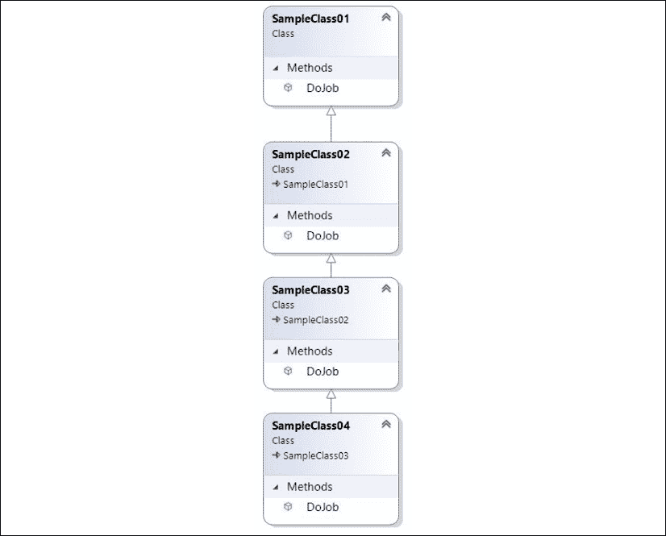
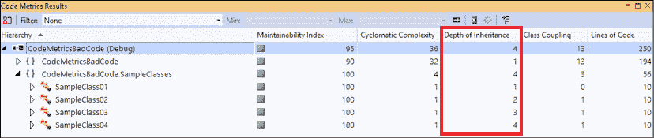
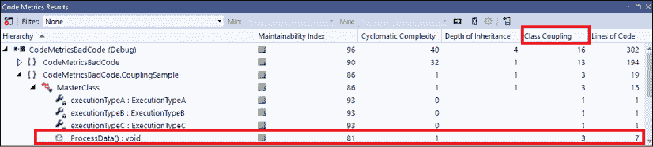
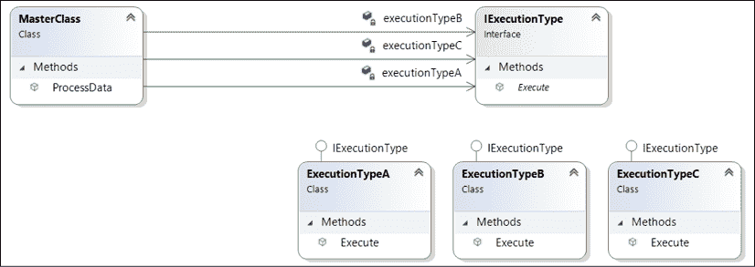
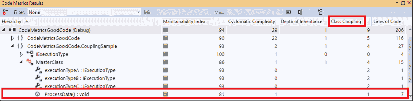
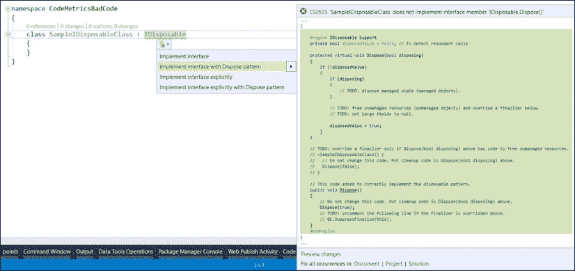

# 17

# C# 9 编码的最佳实践

当您作为项目的软件架构师时，您有责任定义和/或维护编码标准，该标准将指导团队根据公司的期望进行编程。本章介绍了一些编码方面的最佳实践，这些实践将帮助像您这样的开发人员编写安全、简单且可维护的软件。它还包括用 C# 编写代码的技巧和技巧。

本章将介绍以下主题：

*   代码的复杂性如何影响性能
*   使用版本控制系统的重要性
*   用 C 编写安全代码#
*   .NET 核心编码提示和技巧
*   书籍用例–编写代码时的注意事项

C# 9 是与.NET5 一起推出的。然而，这里介绍的实践可以在许多版本的.NET 中使用，但它们涉及到编程 C# 的基础知识。

# 技术要求

本章要求安装有所有数据库工具的 Visual Studio 2019 免费社区版或更高版本。您可以在[找到本章的示例代码 https://github.com/PacktPublishing/Software-Architecture-with-C-9-and-.NET-5](https://github.com/PacktPublishing/Software-Architecture-with-C-9-and-.NET-5) 。

# 你的代码越复杂，你的程序员就越差

对许多人来说，一个好的程序员是一个编写复杂代码的人。然而，软件开发中成熟度的演化意味着有一种不同的思考方式。复杂性并不意味着一份好工作；这意味着代码质量差。一些令人难以置信的科学家和研究人员证实了这一理论，并强调专业代码需要专注于时间、高质量和预算内。

即使您手头上有一个复杂的场景，如果您减少歧义并澄清编码过程，特别是使用好的方法和变量名称，并遵守可靠的原则，您将把复杂性变成简单的代码。

因此，如果你想写好代码，你需要把注意力放在如何写上，因为你不是唯一一个会在以后阅读的人。这是一个很好的技巧，可以改变您编写代码的方式。这就是我们将如何讨论本章的每一点。

如果您对编写好代码的重要性的理解与编写代码时的简单性和清晰性一致，那么您应该查看 Visual Studio 工具**代码度量**：

<figure class="mediaobject"></figure>

图 17.1：在 Visual Studio 中计算代码度量

**代码度量**工具将提供度量，让您了解所交付软件的质量。工具提供的指标可以在以下链接找到：[https://docs.microsoft.com/en-us/visualstudio/code-quality/code-metrics-values?view=vs-2019 年](https://docs.microsoft.com/en-us/visualstudio/code-quality/code-metrics-values?view=vs-2019)。以下小节重点介绍它们在一些实际场景中的用途。

## 维修性指数

此索引表示维护代码有多容易–代码越容易，索引越高（限制为 100）。易于维护是保持软件良好运行的关键之一。很明显，任何软件在未来都需要更改，因为更改是不可避免的。出于这个原因，如果您的可维护性水平较低，请考虑重构代码。编写专用于单个职责的类和方法、避免重复代码以及限制每个方法的代码行数就是如何改进可维护性指数的示例。

## 圈复杂度

*圈复杂度度量*的作者是 Thomas J.McCabe。他根据可用代码路径（图节点）的数量定义软件功能的复杂性。路径越多，函数就越复杂。McCabe 认为每个函数的复杂性分数必须小于 10。这意味着，如果代码有更复杂的方法，则必须对其进行重构，将这些代码的一部分转换为单独的方法。在一些真实场景中，这种行为很容易被检测到：

*   循环中的循环
*   大量连续`if-else`
*   `switch`同一方法内各`case`进行编码处理

例如，查看此方法的第一个版本，用于处理信用卡交易的不同响应。正如你所看到的，圈复杂度比 McCabe 认为的基数要大。之所以会发生这种情况，是因为主体`switch`的每个外壳内的`if-else`数量：

```cs
/// <summary>
/// This code is being used just for explaining the concept of cyclomatic complexity. 
/// It makes no sense at all. Please Calculate Code Metrics for understanding 
/// </summary>
private static void CyclomaticComplexitySample()
{
  var billingMode = GetBillingMode();
  var messageResponse = ProcessCreditCardMethod();
  switch (messageResponse)
    {
      case "A":
        if (billingMode == "M1")
          Console.WriteLine($"Billing Mode {billingMode} for " +
            $"Message Response {messageResponse}");
        else
          Console.WriteLine($"Billing Mode {billingMode} for " +
            $"Message Response {messageResponse}");
        break;
      case "B":
        if (billingMode == "M2")
          Console.WriteLine($"Billing Mode {billingMode} for " +
            $"Message Response {messageResponse}");
        else
          Console.WriteLine($"Billing Mode {billingMode} for " +
            $"Message Response {messageResponse}");
        break;
      case "C":
        if (billingMode == "M3")
          Console.WriteLine($"Billing Mode {billingMode} for " +
            $"Message Response {messageResponse}");
        else
          Console.WriteLine($"Billing Mode {billingMode} for " +
            $"Message Response {messageResponse}");
        break;
      case "D":
        if (billingMode == "M4")
          Console.WriteLine($"Billing Mode {billingMode} for " +
            $"Message Response {messageResponse}");
        else
          Console.WriteLine($"Billing Mode {billingMode} for " +
            $"Message Response {messageResponse}");
        break;
      case "E":
        if (billingMode == "M5")
          Console.WriteLine($"Billing Mode {billingMode} for " +
            $"Message Response {messageResponse}");
        else
          Console.WriteLine($"Billing Mode {billingMode} for " +
            $"Message Response {messageResponse}");
        break;
      case "F":
        if (billingMode == "M6")
          Console.WriteLine($"Billing Mode {billingMode} for " +
            $"Message Response {messageResponse}");
        else
          Console.WriteLine($"Billing Mode {billingMode} for " +
            $"Message Response {messageResponse}");
        break;
      case "G":
        if (billingMode == "M7")
          Console.WriteLine($"Billing Mode {billingMode} for " +
            $"Message Response {messageResponse}");
        else
          Console.WriteLine($"Billing Mode {billingMode} for " +
            $"Message Response {messageResponse}");
        break;
      case "H":
        if (billingMode == "M8")
          Console.WriteLine($"Billing Mode {billingMode} for " +
            $"Message Response {messageResponse}");
        else
          Console.WriteLine($"Billing Mode {billingMode} for " +
            $"Message Response {messageResponse}");
        break;
      default:
        Console.WriteLine("The result of processing is unknown");
        break;
    }
} 
```

如果您计算此代码的代码度量，当涉及圈复杂度时，您将发现一个糟糕的结果，如您在以下屏幕截图中所示：

<figure class="mediaobject"></figure>

图 17.2：高度圈复杂度

代码本身毫无意义，但这里的重点是向您展示为编写更好的代码可以做的改进：

*   `switch-case`中的选项可以使用`Enum`写入
*   每个`case`处理都可以用特定的方法完成
*   `switch-case`可替换为`Dictionary<Enum, Method>`

通过使用前面的技术重构这段代码，结果是一段更容易理解的代码，正如您在其主要方法的以下代码片段中所看到的：

```cs
static void Main()
{
    var billingMode = GetBillingMode();
    var messageResponse = ProcessCreditCardMethod();
Dictionary<CreditCardProcessingResult, CheckResultMethod>
methodsForCheckingResult =GetMethodsForCheckingResult();
    if (methodsForCheckingResult.ContainsKey(messageResponse))
        methodsForCheckingResult[messageResponse](billingMode, 
        messageResponse);
    else
        Console.WriteLine("The result of processing is unknown");
} 
```

完整的代码可以在本章的 GitHub 存储库中找到，并演示了如何实现较低复杂性的代码。以下屏幕截图根据代码度量显示了这些结果：

<figure class="mediaobject"></figure>

图 17.3：重构后圈复杂度的降低

正如您在前面的屏幕截图中所看到的，重构后的复杂性大大降低。在*第 13 章*中*在 C# 9*中实现代码重用，我们讨论了重构对于代码重用的重要性。我们在这里这样做的原因是一样的——我们希望消除重复。

这里的关键点是，随着技术的应用，对代码的理解增加，复杂性降低，这证明了圈复杂度的重要性。

## 继承深度

此度量表示连接到正在分析的类的类数。继承的类越多，度量标准就越差。这类似于类耦合，表明更改代码有多困难。例如，以下屏幕截图有四个继承类：

<figure class="mediaobject"></figure>

图 17.4：遗传样本的深度

您可以在下面的屏幕截图中看到，考虑到还有三个其他类可以改变其行为，较深的类具有更差的度量：

<figure class="mediaobject"></figure>

图 17.5：继承深度度量

继承是面向对象分析的基本原则之一。但是，它有时会对代码有害，因为它会导致依赖关系。因此，如果这样做有意义，而不是使用继承，考虑使用构图。

## 类耦合

当你在一个类中连接太多的类时，显然你会得到耦合，这会导致你的代码维护不好。例如，请参考以下屏幕截图。它显示了一个已经执行了大量聚合的设计。代码本身没有意义：

<figure class="mediaobject"></figure>

图 17.6：类耦合示例

一旦您计算了前面设计的代码度量，您将看到`ProcessData()`方法调用`ExecuteTypeA()`、`ExecuteTypeB()`和`ExecuteTypeC()`的类耦合实例数等于三个（`3`：

<figure class="mediaobject"></figure>

图 17.7：等级耦合度量

一些论文指出，类耦合实例的最大数量应该是 9 个（`9`。由于聚合是比继承更好的实践，接口的使用将解决类耦合问题。例如，具有以下设计的相同代码将为您提供更好的结果：

<figure class="mediaobject"></figure>

图 17.8：异径级联轴器

请注意，在设计中使用接口将允许您在不增加解决方案的类耦合的情况下增加执行类型的数量：

<figure class="mediaobject"></figure>

图 17.9：应用聚合后的类耦合结果

作为软件架构师，您必须考虑设计解决方案以比耦合具有更多的凝聚力。文献表明，好的软件具有低耦合和高内聚性。在软件开发中，高内聚性表示一种场景，在这种场景中，您应该拥有一个软件，其中每个类都必须有其方法和数据，并且它们之间具有良好的关系。另一方面，低耦合表示类没有紧密直接连接的软件。这是一个基本原则，可以指导您使用更好的体系结构模型。

## 代码行

这个度量在让您了解正在处理的代码的大小方面非常有用。没有办法连接代码行和复杂度，因为行数并不表示这一点。另一方面，代码行显示软件大小和软件设计。例如，如果一个类中有太多的代码行（超过 1000 行代码–1KLOC），这表明这是一个糟糕的设计。

# 使用版本控制系统

你可能会在这本书中发现这个主题有点明显，但许多人和公司仍然不把版本控制系统作为软件开发的基本工具！写作的目的是强迫你去理解它。如果不使用版本控制系统，则没有体系结构模型或最佳实践可以节省软件开发。

在过去几年中，我们一直在享受在线版本控制系统的优势，如 GitHub、BitBucket 和 Azure DevOps。事实上，在你的软件开发生命周期中，你必须有一个这样的工具，没有理由不再拥有它，因为大多数提供商都为小团体提供免费版本。即使您自己开发，这些工具对于跟踪更改、管理软件版本以及保证代码的一致性和完整性都很有用。

## 在团队中处理版本控制系统

单独使用版本控制系统工具是显而易见的。你想保护你的代码安全。但开发这种系统是为了在编写代码时解决团队问题。出于这个原因，引入了一些特性，例如分支和合并，以保持代码的完整性，即使在开发人员数量相当大的场景中也是如此。

作为一名软件架构师，您必须决定在您的团队中执行哪个分支策略。Azure DevOps 和 GitHub 提出了不同的方法来实现这一点，并且在某些场景中都很有用。

有关 Azure DevOps 团队如何处理此问题的信息可在此处找到：[https://devblogs.microsoft.com/devops/release-flow-how-we-do-branching-on-the-vsts-team/](https://devblogs.microsoft.com/devops/release-flow-how-we-do-branching-on-the-vsts-team/) 。GitHub 在[中描述了其流程 https://guides.github.com/introduction/flow/](https://guides.github.com/introduction/flow/) 。我们不知道哪一个最适合您的需要，但我们希望您理解，您需要有一个控制代码的策略。

在*第 20 章**理解 DevOps 原则*中，我们将对此进行更详细的讨论。

# 用 C 编写安全代码#

从设计上看，C# 可以被认为是一种安全的编程语言。除非您强制执行，否则不需要指针，而且在大多数情况下，内存释放是由垃圾收集器管理的。即便如此，还是应该注意一些，以便从代码中获得更好、更安全的结果。让我们看一下一些确保 C# 中代码安全的常见做法。

## 试一试

编码中的异常是如此频繁，以至于无论何时发生，您都应该有一种方法来管理它们。`try-catch`语句是为管理异常而构建的，它们对于确保代码安全非常重要。在很多情况下，应用程序崩溃，原因是没有使用`try-catch`。下面的代码显示了一个缺少使用`try-catch`语句的示例。值得一提的是，这只是一个理解在没有正确处理的情况下抛出异常概念的示例。考虑使用 AutoT3AL 处理解析不成功的情况：

```cs
private static int CodeWithNoTryCatch(string textToConvert)
{
    return Convert.ToInt32(textToConvert);
} 
```

另一方面，错误的`try-catch`使用也会对代码造成损害，特别是因为您无法看到该代码的正确行为，并且可能会误解提供的结果。

下面的代码显示了空`try-catch`语句的示例：

```cs
private static int CodeWithEmptyTryCatch(string textToConvert)
{
    try
    {
        return Convert.ToInt32(textToConvert);
    }
    catch
    {
        return 0;
    }
} 
```

`try-catch`语句必须始终连接到日志记录解决方案，以便您可以从系统获得一个指示正确行为的响应，同时不会导致应用程序崩溃。下面的代码显示了一个理想的带有日志管理的`try-catch`语句。值得一提的是，应尽可能捕获特定异常，因为捕获一般异常将隐藏意外异常：

```cs
private static int CodeWithCorrectTryCatch(string textToConvert)
{
    try
    {
        return Convert.ToInt32(textToConvert);
    }
    catch (FormatException err)
    {
        Logger.GenerateLog(err);
        return 0;
    }
} 
```

作为软件架构师，您应该进行代码检查，以修复代码中发现的此类行为。系统的不稳定性通常与代码中缺少`try-catch`语句有关。

## 最后尝试并使用

内存泄漏可以被认为是软件最糟糕的行为之一。它们会导致不稳定、计算机资源的不良使用，以及意外的应用程序崩溃。C# 试图用垃圾收集器解决这个问题，垃圾收集器在意识到对象可以被释放时，会自动从内存中释放对象。

与 I/O 交互的对象通常不由垃圾收集器管理：文件系统、套接字等。以下代码是一个错误使用`FileStream`对象的示例，因为它认为垃圾收集器会释放所使用的内存，但不会：

```cs
private static void CodeWithIncorrectFileStreamManagement()
{
    FileStream file = new FileStream("C:\\file.txt",
        FileMode.CreateNew);
    byte[] data = GetFileData();
    file.Write(data, 0, data.Length);
} 
```

此外，垃圾收集器需要一段时间才能与需要释放的对象进行交互，有时您可能需要自己进行交互。对于这两种情况，使用`try-finally`或`using`语句是最佳实践：

```cs
private static void CorrectFileStreamManagementFirstOption()
{
    FileStream file = new FileStream("C:\\file.txt",
        FileMode.CreateNew);
    try
    {
        byte[] data = GetFileData();
        file.Write(data, 0, data.Length);
    }
    finally
    {
        file.Dispose();
    }
}
private static void CorrectFileStreamManagementSecondOption()
{
    using (FileStream file = new FileStream("C:\\file.txt", 
        FileMode.CreateNew))
    {
        byte[] data = GetFileData();
        file.Write(data, 0, data.Length);
    }
}
private static void CorrectFileStreamManagementThirdOption()
{
    using FileStream file = new FileStream("C:\\file.txt", 
        FileMode.CreateNew);
    byte[] data = GetFileData();
    file.Write(data, 0, data.Length);
} 
```

前面的代码准确地显示了如何处理不由垃圾收集器管理的对象。您已经实现了`try-finally`和`using`。作为一名软件架构师，您确实需要注意这种代码。缺少`try-finally`或`using`语句可能会在软件运行时对软件行为造成巨大损害。值得一提的是，使用代码分析工具（现在与.NET5 一起发布）会自动提醒您这些问题。

## IDisposable 接口

同样，如果您不使用`try-finally`/`using`语句管理在方法中创建的对象，您也会遇到麻烦，在类中创建的对象如果没有正确实现接口，可能会导致应用程序内存泄漏。因此，当您有一个处理和创建对象的类时，您应该实现一次性模式，以保证释放由它创建的所有资源：

<figure class="mediaobject"></figure>

图 17.10:IDisposable 接口实现

好消息是 VisualStudio 提供了实现此接口的代码片段，只需在代码中指出它，然后右键单击**快速操作**和**重构**选项，如前面的屏幕截图所示。

插入代码后，您需要按照 TODO 说明进行操作，以便实现正确的模式。

# .NET 5 编码提示和技巧

.NET5 实现了一些很好的功能，帮助我们编写更好的代码。拥有更安全代码的最有用的之一是**依赖注入**（**DI**），这已经在*第 11 章*、*设计模式和.NET 5 实现*中进行了讨论。考虑这一点有一些很好的理由。第一个问题是，您不需要担心如何处理注入的对象，因为您不会成为它们的创建者。

此外，DI 使您能够注入`ILogger`，这是调试异常的有用工具，需要在代码中使用`try-catch`语句来管理异常。此外，使用.NET5 进行 C# 编程必须遵循任何编程语言的常见良好实践。下面的列表显示了其中的一些：

*   **类、方法和变量应该有可理解的名称**：名称应该解释读者需要知道的一切。除非这些声明是公开的，否则不需要解释性评论。
*   **方法的复杂度不能太高**：应该检查圈复杂度，这样方法就不会有太多的代码行。
*   **成员必须具有正确的可见性**：作为一种面向对象的编程语言，C# 支持使用不同的可见性关键字进行封装。C# 9.0 正在呈现*Init only setters*，因此您可以创建`init`属性/索引访问器而不是`set`，在对象构造之后将这些成员定义为只读。
*   **应避免重复代码**：在高级编程语言（如 C#）中没有理由有重复代码。
*   **使用前需要检查对象**：因为空对象可以存在，所以代码必须进行空类型检查。值得一提的是，自 C# 8 以来，我们使用了可空引用类型来避免与可空对象相关的错误。
*   **应使用常数和枚举数**：避免代码中的幻数和文本的一个好方法是将这些信息转换为常数和枚举数，这通常更容易理解。
*   **应避免使用不安全代码**：不安全代码使您能够处理 C# 中的指针。除非没有其他方法来实现解决方案，否则应避免不安全代码。
*   **try-catch 语句不能为空**：没有理由在`catch`区域内不进行处理而生成`try-catch`语句。除此之外，捕获的异常应该尽可能具体，而不仅仅是“异常”，以避免吞咽意外异常。
*   Apple T0.处理你所创建的对象，如果它们是一次性的 Ty1T.：即使对于对象 Ty2 T2，垃圾收集器将处理对象的处理，考虑处理负责创建自己的对象。
*   **至少应该注释公共方法**：考虑到公共方法是在您的库之外使用的方法，必须解释它们的正确外部用法。
*   **switch case 语句必须有一个默认处理**：由于`switch-case`语句在某些情况下可能会收到未知的入口变量，默认处理将保证在这种情况下代码不会中断。

您可以参考[https://docs.microsoft.com/en-us/dotnet/csharp/language-reference/builtin-types/nullable-reference-types](https://docs.microsoft.com/en-us/dotnet/csharp/language-reference/builtin-types/nullable-reference-t) 了解有关可空引用类型的更多信息。

作为一个软件架构师，您可以考虑为开发人员提供代码模式的良好实践，这些代码模式将用于保持代码风格的一致性。您还可以使用此代码模式作为编码检查的检查表，这将丰富软件代码质量。

# WWTravelClub–编写代码时的注意事项

作为一名软件架构师，您必须定义一个符合您所在公司需求的代码标准。

在本书的示例项目中（在*第 1 章**了解软件架构*的重要性中，查看更多关于 WWTravelClub 项目的信息），这与本书没有什么不同。我们决定展示标准的方式是描述我们在编写我们制作的样本时遵循的应做和不应做的事情的列表。值得一提的是，该列表是启动标准的一个好方法，作为软件架构师，您应该与团队中的开发人员讨论该列表，以便以实用且良好的方式对其进行改进。

此外，这些声明旨在澄清团队成员之间的沟通，并改进您正在开发的软件的性能和维护：

*   一定要用英语写代码
*   使用 CamelCase 时一定要遵循 C# 编码标准
*   使用可理解的名称编写类、方法和变量
*   不要注释公共类、方法和属性
*   尽可能使用`using`语句
*   尽可能使用`async`实现
*   不要写空的`try-catch`语句
*   不要编写圈复杂度得分超过 10 的方法
*   不要在`for/while/do-while/foreach`语句中使用`break`和`continue`

这些应做和不应做的事情很容易遵循，而且比这更好的是，它们将为您的团队生成的代码产生巨大的结果。在*第 19 章*中*使用工具编写更好的代码*，我们将讨论帮助您实现这些规则的工具。

# 总结

在本章中，我们讨论了编写安全代码的一些重要技巧。本章介绍了一种用于分析代码度量的工具，以便您能够管理正在开发的软件的复杂性和可维护性。最后，我们提供了一些好的提示，以确保您的软件不会因内存泄漏和异常而崩溃。在现实生活中，软件架构师总是被要求解决此类问题。

在下一章中，我们将学习一些单元测试技术、单元测试的原理以及一个专注于 C# 测试项目的软件过程模型。

# 问题

1.  为什么我们需要关心可维护性？
2.  什么是圈复杂度？
3.  列出使用版本控制系统的优点。
4.  什么是垃圾收集器？
5.  实现`IDisposable`接口的重要性是什么？
6.  在编码方面，我们从.NET5 中获得了哪些优势？

# 进一步阅读

以下是一些书籍和网站，您可以在其中找到有关本章主题的更多信息：

*   *清洁代码：敏捷软件工艺手册*，马丁、罗伯特·C·皮尔逊教育出版社，2012 年。
*   *设计嵌入式系统的艺术*，作者：杰克·G·甘斯勒。爱思唯尔，1999 年。
*   *重构*，作者：马丁·福勒。艾迪生·韦斯利，2018 年。
*   *一种复杂性度量*，托马斯·麦卡贝（Thomas J.McCabe）著。IEEE Trans。软件工程 2（4）：308-3201976（[https://dblp.uni-trier.de/db/journals/tse/tse2.html](https://dblp.uni-trier.de/db/journals/tse/tse2.html) ）。
*   [https://blogs.msdn.microsoft.com/zainnab/2011/05/25/code-metrics-class-coupling/](https://blogs.msdn.microsoft.com/zainnab/2011/05/25/code-metrics-class-coupling/)
*   [https://docs.microsoft.com/en-us/visualstudio/code-quality/code-metrics-values?view=vs-2019](https://docs.microsoft.com/en-us/visualstudio/code-quality/code-metrics-values?view=vs-2019)
*   [https://github.com/](https://github.com/)
*   [https://bitbucket.org/](https://bitbucket.org/)
*   [https://azure.microsoft.com/en-us/services/devops/](https://azure.microsoft.com/en-us/services/devops/)
*   [https://guides.github.com/introduction/flow/](https://guides.github.com/introduction/flow/)
*   [https://blogs.msdn.microsoft.com/devops/2018/04/19/release-flow-how-we-do-branching-on-the-vsts-team/](https://blogs.msdn.microsoft.com/devops/2018/04/19/release-flow-how-we-do-branching-on-the-vsts-team)
*   [https://docs.microsoft.com/aspnet/core/fundamentals/logging/](https://docs.microsoft.com/aspnet/core/fundamentals/logging/)
*   [https://docs.microsoft.com/en-us/dotnet/csharp/whats-new/csharp-9](https://docs.microsoft.com/en-us/dotnet/csharp/whats-new/csharp-9)