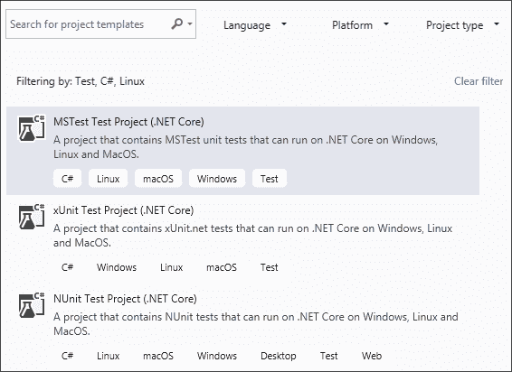
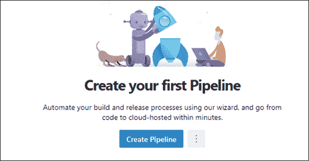
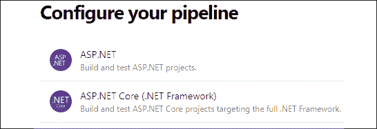
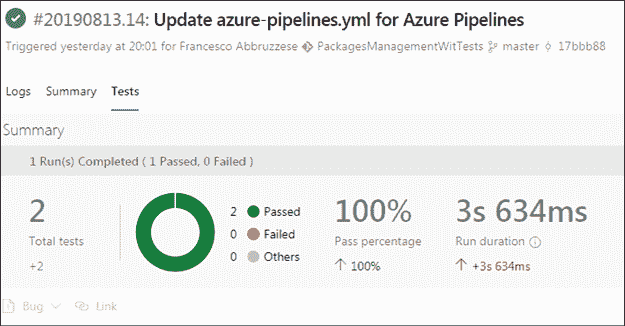

# 18

# 使用单元测试用例和 TDD 测试代码

在开发软件时，必须确保应用程序没有 bug 并且满足所有要求。这可以通过在开发过程中测试所有模块，或者在整个应用程序已经完全或部分实现时测试所有模块来实现。

手动执行所有测试不是一个可行的选择，因为大多数测试必须在每次修改应用程序时执行，并且正如本书通篇所述，现代软件正在不断修改，以使应用程序适应快速变化的市场需求。本章讨论交付可靠软件所需的所有类型的测试，以及如何组织和自动化这些测试。

更具体地说，本章涵盖以下主题：

*   理解单元和集成测试及其使用
*   了解**测试驱动开发**（**TDD**的基础知识
*   在 VisualStudio 中定义 C# 测试项目
*   用例–在 DevOps Azure 中自动化单元测试

在本章中，我们将看到哪些类型的测试值得实现，哪些是单元测试。我们将看到不同类型的可用项目以及如何在其中编写单元测试。在本章结束时，本书的用例将帮助我们在应用程序的**持续集成/持续交付**（**CI/CD**周期中自动在 Azure DevOps 中执行测试。

# 技术要求

本章要求安装有所有数据库工具的 Visual Studio 2019 免费社区版或更高版本。它还需要一个免费的 Azure 帐户。如果您尚未创建 Azure 帐户，请参阅*第 1 章*中的*创建 Azure 帐户*部分*了解软件架构的重要性*。

本章中的所有概念都通过基于 WWTravelClub book 用例的实际示例加以澄清。本章代码见[https://github.com/PacktPublishing/Software-Architecture-with-C-9-and-.NET-5](https://github.com/PacktPublishing/Hands-On-Software-Architecture-with-C-9-and-.NET-5) 。

# 理解单元和集成测试

必须避免将应用程序测试延迟到其大部分功能完全实现之后，原因如下：

*   如果类或模块的设计或实现不正确，则可能已经影响了其他模块的实现方式。因此，在这一点上，解决问题的成本可能非常高。
*   测试执行可能采取的所有可能路径所需的输入的可能组合随着一起测试的模块或类的数量呈指数增长。因此，例如，如果一个类方法`A`的执行可以采用三条不同的路径，而另一个方法`B`的执行可以采用四条路径，那么同时测试`A`和`B`将需要 3 x 4 条不同的输入。通常，如果我们一起测试多个模块，则要测试的路径总数是每个模块中要测试的路径数的乘积。如果模块单独测试，则所需输入的数量仅为测试每个模块所需路径的总和。
*   如果对由*N*模块组成的聚合进行的测试失败，那么在*N*模块中定位错误的来源通常是一项非常耗时的活动。
*   当*N*模块一起测试时，我们必须重新定义涉及*N*模块的所有测试，即使*N*模块中只有一个在应用程序的 CI/CD 周期中发生变化。

这些考虑表明，单独测试每个模块方法更方便。不幸的是，一组独立于上下文验证所有方法的测试是不完整的，因为一些错误可能是由模块之间不正确的交互引起的。

因此，测试分为两个阶段：

*   **单元测试**：这些测试验证每个模块的所有执行路径都正常工作。它们非常完整，通常覆盖所有可能的路径。这是可行的，因为与整个应用程序的可能执行路径相比，每个方法或模块的可能执行路径并不多。
*   **集成测试**：软件通过所有单元测试后执行。集成测试验证所有模块正确交互以获得预期结果。集成测试不需要完成，因为单元测试已经验证了每个模块的所有执行路径都正常工作。他们需要验证所有的交互模式，也就是说，各种模块可以合作的所有可能方式。

通常，每个交互模式都有多个与之相关联的测试：一个模式的典型激活和一些极端激活情况。例如，如果一个完整的交互模式接收到一个数组作为输入，我们将为该数组的典型大小编写一个测试，一个使用`null`数组的测试，一个使用空数组的测试，以及一个使用非常大数组的测试。通过这种方式，我们验证了单个模块的设计方式与整个交互模式的需求是兼容的。

使用上述策略，如果我们修改单个模块而不更改其公共接口，则需要更改该模块的单元测试。

相反，如果更改涉及某些模块的交互方式，那么我们还必须添加新的集成测试或修改现有的测试。然而，通常情况下，这不是一个大问题，因为大多数测试都是单元测试，所以重写大部分集成测试并不需要太大的工作量。此外，如果应用程序是根据**单一责任**、**打开/关闭**、**利斯科夫替代**、**接口分离**或**依赖倒置**（**固态**原则设计的，那么，在单个代码修改之后必须更改的集成测试的数量应该很小，因为修改只会影响与修改后的方法或类直接交互的几个类。

## 自动化单元和集成测试

此时，应该清楚的是，单元测试和集成测试都必须在软件的整个生命周期内重用。这就是为什么自动化它们是值得的。单元和集成测试的自动化避免了手动测试执行可能出现的错误，并节省了时间。数千个自动化测试组成的整个电池可以在几分钟内完成每一次小修改后验证软件的完整性，从而实现现代软件 CI/CD 周期所需的频繁更改。

当发现新的 bug 时，会添加新的测试来发现它们，这样它们就不会在软件的未来版本中再次出现。通过这种方式，自动化测试总是变得更加可靠，并且能够更好地保护软件免受由于新更改而添加的 bug 的影响。因此，添加新 bug（不会立即被发现）的概率大大降低。

下一个部分将向我们介绍组织和设计自动化单元和集成测试的基础知识，以及如何在*定义**C# 测试项目*部分中使用 C# 编写测试的实际细节。

## 编写自动化（单元和集成）测试

测试不是从头开始编写的；所有的软件开发平台都有一些工具可以帮助我们编写测试并启动它们（或其中一些）。一旦选定的测试执行完毕，所有工具都会显示一份报告，并允许调试所有失败测试的代码。

更具体地说，所有单元和集成测试框架都由三个重要部分组成：

*   **定义所有测试的设施**：验证实际结果是否符合预期结果。通常，测试被组织成测试类，其中每个测试调用测试单个应用程序类或单个类方法。每个测试分为三个阶段：
    1.  **试验准备**：准备好试验所需的一般环境。此阶段仅为测试准备全局环境，如对象注入类内构造函数或模拟数据库表；它没有为我们要测试的每个方法准备单独的输入。通常，在几个测试中使用相同的准备程序，因此测试准备被分解成专用模块。
    2.  **测试执行**：在充分输入的情况下调用要测试的方法，并使用`Assert.Equal(x, y)`和`Assert.NotNull(x)`等构造将其执行的所有结果与预期结果进行比较。
    3.  **拆除**：对整个环境进行清理，避免某项测试的执行影响其他测试。此步骤与*步骤 1*相反。
*   **模拟设施**：当集成测试使用对象协作模式中涉及的所有（或几乎所有）类时，在单元测试中，禁止使用其他应用程序类。因此，如果一个被测试的类，比如说`A`，使用另一个应用程序类`B`的方法，该方法被注入其构造函数中的一个方法`M`，那么为了测试`M`，我们必须注入`B`的假实现。值得指出的是，在单元测试期间，只有执行某些处理的类才不允许使用另一个类，而纯数据类可以。模拟框架包含定义接口和接口方法实现的工具，接口和接口方法返回可在测试中定义的数据。通常，模拟实现还能够报告所有模拟方法调用的信息。此类模拟实现不需要定义实际的类文件，而是通过调用`new Mock<IMyInterface>()`等方法在测试代码中在线完成。
*   **执行和报告工具**：这是一个基于可视化配置的工具，开发者可以使用它来决定启动哪些测试以及何时启动它们。此外，它还将测试的最终结果显示为一份报告，其中包含所有成功的测试、所有失败的测试、每个测试的执行时间以及取决于特定工具及其配置方式的其他信息。通常，在开发 ide（如 visualstudio）中执行的执行和报告工具还允许您在每个失败的测试上启动调试会话。

由于只有接口允许对其所有方法进行完整的模拟定义，我们应该在类构造函数和方法中注入接口或纯数据类（不需要模拟）；否则，类就不能进行单元测试。因此，对于我们想要注入到另一个类中的每个协作类，我们必须定义相应的接口。

此外，类应该使用注入到其构造函数或方法中的实例，而不是在其他类的公共静态字段中可用的类实例；否则，编写测试时可能会忘记隐藏的交互，这可能会使测试的*准备*步骤复杂化。

以下部分描述了软件开发中使用的其他类型的测试。

## 书面验收和性能测试

验收测试定义了项目干系人和开发团队之间的合同。它们用于验证所开发的软件的实际行为是否与一致。验收测试不仅验证功能规范，还验证对软件可用性和用户界面的约束。由于它们还用于显示软件在实际计算机监视器和显示器上的显示和行为，因此它们从来不是完全自动的，而是主要由操作员必须遵循的配方和验证列表组成。

有时，开发自动测试只是为了验证功能规范，但此类测试通常绕过用户界面，将测试输入直接注入用户界面后面的逻辑中。例如，在 ASP.NET 核心 MVC 应用程序的情况下，整个网站在一个完整的环境中运行，该环境包括所有必要的存储和测试数据。输入不提供给 HTML 页面，而是直接注入 ASP.NET 核心控制器。绕过用户界面的测试称为皮下测试。ASP.NET Core 提供了各种工具来执行皮下测试，还提供了自动化与 HTML 页面交互的工具。

在自动测试的情况下，皮下测试通常是首选的，而完全测试是手动执行的，原因如下：

*   没有自动测试可以验证用户界面的外观和可用性。
*   自动化与用户界面的实际交互是一项非常耗时的任务。
*   用户界面经常更改以提高其可用性并添加新功能，单个应用程序屏幕中的小更改可能会迫使完全重写在该屏幕上运行的所有测试。

简言之，用户界面测试非常广泛，并且重用性很低，因此很少值得将其自动化。然而，ASP.NET 核心提供了`Microsoft.AspNetCore.Mvc.Testing`NuGet 包，以便在测试环境中运行整个网站。将它与将 HTML 页面解析为 DOM 树的`AngleSharp`NuGet 包结合使用，您可以通过可接受的编程工作编写自动化的完整测试。自动化 ASP.NET 旧件验收测试将在*第 22 章*、*功能测试自动化*中详细描述。

性能测试将假负载应用于应用程序，以查看它是否能够处理典型的生产负载，发现其负载限制，并找到瓶颈。应用程序部署在临时环境中，该环境是实际生产环境的硬件资源副本。

然后，创建假请求并将其应用于系统，并收集响应时间和其他指标。假请求批次应具有与实际生产批次相同的成分。如果实际生产请求日志可用，则可以从这些日志生成。

如果响应时间不令人满意，则收集其他指标以发现可能的瓶颈（内存不足、存储速度慢或软件模块速度慢）。定位后，负责问题的软件组件可以在调试器中进行分析，以测量典型请求中涉及的各种方法调用的执行时间。

性能测试中的故障可能导致重新定义应用程序所需的硬件，或导致某些软件模块、类或方法的优化。

Azure 和 Visual Studio 都提供了创建虚假加载和报告执行度量的工具。但是，它们已被宣布为过时并将停止使用，因此我们将不描述它们。作为替代方案，可以使用开源和第三方工具。其中一些在*进一步阅读*部分中列出。

下一节描述了一种软件开发方法，它为测试提供了一个中心角色。

# 理解测试驱动开发（TDD）

**测试驱动开发**（**TDD**）是一种软件开发方法，它为单元测试提供了核心作用。根据这种方法，单元测试是每个类规范的形式化，因此必须在类的代码之前编写。事实上，覆盖所有代码路径的完整测试以单音形式定义代码行为，因此可以将其视为代码的规范。它不是通过某种形式语言定义代码行为的形式规范，而是基于行为示例的规范。

测试软件的理想方法是编写整个软件行为的正式规范，并使用一些全自动工具验证实际生产的软件是否符合规范。在过去，一些研究工作花费在定义用于描述代码规范的正式语言上，但是用类似的语言表达开发人员心目中的行为是一项非常困难且容易出错的任务。因此，这些尝试很快被放弃，取而代之的是基于实例的方法。当时，主要目的是自动生成代码。

如今，自动代码生成基本上已被放弃，并在小型应用领域得以生存，如设备驱动程序的创建。在这些领域中，用形式化语言形式化行为的努力值得在测试难以重现的并行线程行为时节省时间。

单元测试最初被认为是一种以完全独立的方式对基于实例的规范进行编码的方法，作为称为**极限编程**的特定敏捷开发方法的一部分。然而，如今，TDD 是独立于极限编程使用的，并且是其他敏捷方法中的一个强制性处方。

尽管毫无疑问，在发现数百个 bug 后改进的单元测试可以作为可靠的代码规范，但开发人员是否能够轻松地设计出可以立即用作待编写代码的可靠规范的单元测试并不明显。事实上，通常，如果示例是随机选择的，则需要无限或至少大量的示例来单音定义代码的行为。

只有在您理解了所有可能的执行路径之后，才能使用可接受数量的示例来定义行为。事实上，此时，为每个执行路径选择一个典型示例就足够了。因此，在方法完全编码之后为该方法编写单元测试是很容易的：它只需要为已经存在的代码的每个执行路径选择一个典型实例。然而，以这种方式编写单元测试并不能防止执行路径本身的设计中出现错误。可以说，事先编写测试并不能防止有人忘记测试某个值或值的组合——没有人是完美的！然而，它确实迫使您在实现之前明确地考虑它们，这就是为什么您不太可能意外地忽略测试用例的原因。

我们可以得出结论，在编写单元测试时，开发人员必须通过寻找极端情况并可能添加比严格要求更多的示例，以某种方式预测所有执行路径。然而，开发人员在编写应用程序代码时可能会出错，在设计单元测试时，他或她也可能在预测所有可能的执行路径时出错。

我们已经确定了 TDD 的主要缺点：单元测试本身可能是错误的。也就是说，不仅应用程序代码，而且其相关的 TDD 单元测试，可能与开发人员心目中的行为不一致。因此，在一开始，单元测试不能被认为是软件规范，而是对软件行为的可能错误和不完整的描述。因此，我们对所考虑的行为有两种描述：应用程序代码本身及其在应用程序代码之前编写的 TDD 单元测试。

TDD 工作的原因是，在编写测试和代码时发生完全相同错误的概率非常低。因此，每当测试失败时，测试或应用程序代码中都存在错误，相反，如果应用程序代码或测试中存在错误，则测试失败的概率非常高。也就是说，TDD 的使用确保了大多数 bug 都能立即被发现！

使用 TDD 编写类方法或代码块是一个由三个阶段组成的循环：

*   **红色阶段**：在此阶段，开发人员编写抛出`NotImplementedException`或具有空主体的空方法，并为它们设计新的单元测试，而必须失败，因为此时没有实现它们描述的行为的代码。
*   **绿色阶段**：在此阶段，开发人员编写最低限度的代码或对现有代码进行最低限度的修改，以通过所有单元测试。
*   **重构阶段**：测试通过后，对代码进行重构，以确保良好的代码质量以及最佳实践和模式的应用。特别是，在此阶段，一些代码可以在其他方法或其他类中分解出来。在这个阶段，我们还可能发现需要其他单元测试，因为发现或创建了新的执行路径或新的极端情况。

所有测试通过后，循环停止，无需编写新代码或修改现有代码。

有时，设计初始单元测试非常困难，因为很难想象代码可能如何工作以及它可能采取的执行路径。在这种情况下，您可以通过编写应用程序代码的初始草图来更好地了解要使用的特定算法。在这个初始阶段，我们需要只关注主执行路径，完全忽略极端情况和输入验证。一旦我们清楚地了解了算法背后应该起作用的主要思想，我们就可以进入标准的三阶段 TDD 循环。

在下一节中，我们将列出 VisualStudio 中可用的所有测试项目，并详细描述 xUnit。

# 定义 C# 测试项目

Visual Studio包含三种单元测试框架的项目模板，即 MSTest、xUnit 和 NUnit。启动新项目向导后，为了可视化适合.NET 核心 C 应用程序的所有项目的版本，请将**项目类型**设置为**测试**，**语言**设置为**C**，**平台**设置为**Linux**，因为.NET 核心项目是唯一可以部署在 Linux 上的项目。

以下屏幕截图显示了应显示的选择：

<figure class="mediaobject"></figure>

图 18.1：添加测试项目

前面的所有项目都自动包含 NuGet 包，用于运行Visual Studio 测试用户界面（Visual Studio test runner）中的所有测试。但是，它们不包含任何模拟接口的工具，因此您需要添加`Moq`NuGet 包，其中包含一个流行的模拟框架。

所有测试项目都必须包含对要测试的项目的引用。

在下一节中，我们将描述 xUnit，因为它可能是三种框架中最流行的。然而，这三个框架非常相似，主要区别在于断言方法的名称以及用于修饰各种测试类和方法的属性的名称。

## 使用 xUnit 测试框架

在 xUnit 中，测试是用`[Fact]`或`[Theory]`属性修饰的方法。测试由测试运行者自动发现，并在用户界面中列出所有测试，因此用户可以运行所有测试，也可以只运行其中的一部分。

在运行每个测试之前会创建一个测试类的新实例，因此类构造函数中包含的*测试准备*代码会在类的每个测试之前执行。如果您还需要*分解*代码，测试类必须实现`IDisposable`接口，以便分解代码可以包含在`IDisposable.Dispose`方法中。

测试代码调用要测试的方法，然后使用来自`Assert`静态类的方法测试结果，例如`Assert.NotNull(x)`、`Assert.Equal(x, y)`和`Assert.NotEmpty(IEnumerable x)`。还有一些方法可以验证调用是否引发特定类型的异常，例如：

```cs
 Assert.Throws<MyException>(() => {/* test code */ ...}). 
```

当断言失败时，将引发异常。如果测试代码或断言引发未拦截的异常，则测试将失败。

以下是定义单个测试的方法示例：

```cs
[Fact]
public void Test1()
{
    var myInstanceToTest = new ClassToTest();
    Assert.Equal(5, myInstanceToTest.MethodToTest(1));
} 
```

当一个方法只定义一个测试时使用`[Fact]`属性，而当同一个方法定义多个测试时使用`[Theory]`属性，每个测试都在不同的数据元组上。可以通过多种方式指定数据元组，并将其作为方法参数注入测试中。

可以修改前面的代码，在几个输入上测试`MethodToTest`，如下所示：

```cs
[Theory]
[InlineData(1, 5)]
[InlineData(3, 10)]
[InlineData(5, 20)]
public void Test1(int testInput, int testOutput)
{
    var myInstanceToTest = new ClassToTest();
    Assert.Equal(testOutput, 
        myInstanceToTest.MethodToTest(testInput));
} 
```

每个`InlineData`属性指定要注入方法参数中的元组。因为只有简单的常量数据可以包含为属性参数，所以 xUnit 还为您提供了从实现`IEnumerable`的类中获取所有数据元组的可能性，如下例所示：

```cs
public class Test1Data: IEnumerable<object[]>
{
    public IEnumerator<object[]> GetEnumerator()
    {
        yield return new object[] { 1, 5};
        yield return new object[] { 3, 10 };
        yield return new object[] { 5, 20 };
    }
    IEnumerator IEnumerable.GetEnumerator()=>GetEnumerator();

}
...
...
[Theory]
[ClassData(typeof(Test1Data))]
public void Test1(int testInput, int testOutput)
{
    var myInstanceToTest = new ClassToTest();
    Assert.Equal(testOutput, 
        myInstanceToTest.MethodToTest(testInput));
} 
```

提供测试数据的类的类型由`ClassData`属性指定。

还可以从类的静态方法获取数据，该类返回一个带有`MemberData`属性的`IEnumerable`，如下例所示：

```cs
[Theory]
[MemberData(nameof(MyStaticClass.Data), 
    MemberType= typeof(MyStaticClass))]
public void Test1(int testInput, int testOutput)
{
    ... 
```

将方法名作为第一个参数传递给`MemberData`属性，并在`MemberType`命名参数中传递类类型。如果静态方法是同一测试类的一部分，`MemberType`参数可以省略。

下一节将介绍如何处理一些高级准备和拆卸场景。

## 高级测试准备和拆卸场景

有时，准备代码包含非常耗时的操作，例如打开与数据库的连接，这些操作在每次测试之前不需要重复，但可以在同一类中包含的所有测试之前执行一次。在 xUnit 中，这种测试准备代码不能包含在测试类构造函数中；由于测试类的不同实例是在每次测试之前创建的，因此必须在称为 fixture 类的单独类中进行分解。

如果我们还需要相应的分解代码，fixture 类必须实现`IDisposable`。在其他测试框架中，例如 NUnit，测试类实例只创建一次，因此它们不需要在其他类中分解 fixture 代码。但是，在每次测试之前不创建新实例的测试框架（如 NUnit）可能会因为测试方法之间不必要的交互而遭受错误。

以下是打开和关闭数据库连接的 xUnit fixture 类的示例：

```cs
public class DatabaseFixture : IDisposable
{
    public DatabaseFixture()
    {
        Db = new SqlConnection("MyConnectionString");
    }
    public void Dispose()
    {
        Db.Close()
    }
    public SqlConnection Db { get; private set; }
} 
```

由于在执行与该装置相关联的所有测试之前只创建了一个装置类实例，并且在测试之后立即处理了同一个实例，因此在时只创建了一次数据库连接将创建 fixture 类，并在测试结束后立即释放 fixture 对象。

fixture 类通过让测试类实现空的`IClassFixture<T>`接口与每个测试类关联，如下所示：

```cs
public class MyTestsClass : IClassFixture<DatabaseFixture>
{
    private readonly DatabaseFixture fixture;
    public MyDatabaseTests(DatabaseFixture fixture)
    {
        this.fixture = fixture;
    }
    ...
    ...
} 
```

夹具类实例将自动注入测试类构造函数中，以使夹具测试准备中计算的所有数据可用于测试。例如，通过这种方式，在前面的示例中，我们可以获得数据库连接实例，以便该类的所有测试方法都可以使用它。

如果我们希望对测试类集合中包含的所有测试执行一些测试准备代码，而不是单个测试类，那么我们必须将 fixture 类与表示测试类集合的空类相关联，如下所示：

```cs
[CollectionDefinition("My Database collection")]
public class DatabaseCollection : ICollectionFixture<DatabaseFixture>
{
    // this class is empty, since it is just a placeholder
} 
```

`CollectionDefinition`属性声明集合的名称，`IClassFixture<T>`接口已替换为`ICollectionFixture<T>`。

然后我们通过将测试类应用于具有集合名称的`Collection`属性，声明属于先前定义的集合，如下所示：

```cs
[Collection("My Database collection")]
public class MyTestsClass 
{
    DatabaseFixture fixture;
    public MyDatabaseTests(DatabaseFixture fixture)
    {
        this.fixture = fixture;
    }
    ...
    ...
} 
```

`Collection`属性声明使用哪个集合，而测试类构造函数中的`DataBaseFixture`参数提供了一个实际的 fixture 类实例，因此它可以在所有类测试中使用。

下一节将展示如何使用`Moq`框架模拟接口。

## 用 Moq 模拟接口

模拟功能不包括在我们在本节中列出的任何测试框架中，因为它们不包括在 xUnit 中。因此，必须通过安装特定的 NuGet 包来提供它们。`Moq`NuGet 包中提供的`Moq`框架是.NET 中最流行的模拟框架。它很容易使用，本节将简要介绍。

一旦我们安装了 NuGet 包，我们需要在测试文件中添加一个`using Moq`语句。模拟实现很容易定义，如下所示：

```cs
 var myMockDependency = new Mock<IMyInterface>(); 
```

模拟依赖于特定方法的特定输入的行为可以通过`Setup/Return`方法对定义如下：

```cs
myMockDependency.Setup(x=>x.MyMethod(5)).Returns(10); 
```

我们可以为同一方法添加多个`Setup/Return`指令。这样，我们可以指定无限数量的输入/输出行为。

我们也可以使用与特定类型匹配的通配符，而不是特定的输入值，如下所示：

```cs
myMockDependency.Setup(x => x.MyMethod(It.IsAny<int>()))
                  .Returns(10); 
```

一旦我们配置了模拟依赖项，我们就可以从其`Object`属性中提取模拟实例，并将其当作实际实现来使用，如下所示：

```cs
var myMockedInstance=myMockDependency.Object;
...
myMockedInstance.MyMethod(10); 
```

然而，模拟的方法通常由被测试的代码调用，所以我们只需要提取模拟的实例，并将其作为测试的输入。

我们还可以按如下方式模拟属性和异步方法：

```cs
myMockDependency.Setup(x => x.MyProperty)
                  .Returns(42);
...
myMockDependency.Setup(x => x.MyMethodAsync(1))
                    .ReturnsAsync("aasas");
var res=await myMockDependency.Object
    .MyMethodAsync(1); 
```

对于异步方法，`Returns`必须替换为`ReturnsAsync`。

每个模拟实例记录对其方法和属性的所有调用，因此我们可以在测试中使用这些信息。以下代码显示了一个示例：

```cs
myMockDependency.Verify(x => x.MyMethod(1), Times.AtLeast(2)); 
```

前面的语句断言，`MyMethod`已被给定参数调用至少两次。还有`Times.Never`、`Times.Once`（声明该方法只调用了一次）等等。

到目前为止总结的 Moq 文档应该涵盖测试中可能出现的 99%的需求，但 Moq 也提供了更复杂的选项。*进一步阅读*部分包含完整文档的链接。

下一个部分将展示如何在实践中定义单元测试，以及如何借助本书的用例在 VisualStudio 和 Azure DevOps 中运行它们。

# 用例–在 DevOps Azure 中自动化单元测试

在本节中，我们在*第 15 章*中构建的示例应用程序中添加了一些单元测试项目，*展示了 ASP.NET 核心 MVC*。如果您没有，可以从与本书相关联的 GitHub 存储库的*第 15 章**展示 ASP.NET 核心 MVC*部分下载。

作为第一步，让我们制作解决方案文件夹的新副本，并将其命名为`PackagesManagementWithTests`。然后，打开解决方案并将其添加到名为`PackagesManagementTest`的 xUnit.NET 核心 C# 测试项目中。最后，添加对 ASP.NET 核心项目（`PackagesManagement`的引用，因为我们将对其进行测试；添加对`Moq`NuGet 包最新版本的引用，因为我们需要模拟功能。现在，我们已经准备好编写测试了。

以`ManagePackagesController`控制器`[HttpPost]`修饰的`Edit`方法为例，编写单元测试，如下图：

```cs
[HttpPost]
public async Task<IActionResult> Edit(
    PackageFullEditViewModel vm,
    [FromServices] ICommandHandler<UpdatePackageCommand> command)
{
    if (ModelState.IsValid)
    {
        await command.HandleAsync(new UpdatePackageCommand(vm));
        return RedirectToAction(
            nameof(ManagePackagesController.Index));
    }
    else
        return View(vm);
} 
```

在编写测试方法之前，让我们将自动包含在测试项目中的测试类重命名为`ManagePackagesControllerTests`。

第一个测试验证，如果`ModelState`中存在错误，action 方法将使用它作为参数接收的相同模型呈现视图，以便用户可以更正所有错误。我们删除现有的测试方法，编写一个空的`DeletePostValidationFailedTest`方法，如下所示：

```cs
[Fact]
public async Task DeletePostValidationFailedTest()
{
} 
```

方法必须是`async`，返回类型必须是`Task`，因为我们必须测试的`Edit`方法是`async`。在这个测试中，我们不需要模拟对象，因为不会使用注入对象。因此，作为测试的准备，我们只需要创建一个控制器实例，我们必须在`ModelState`中添加一个错误，如下所示：

```cs
var controller = new ManagePackagesController();
controller.ModelState
    .AddModelError("Name", "fake error"); 
```

然后我们调用该方法，注入`ViewModel`和`null`命令处理程序作为其参数，因为不会使用命令处理程序：

```cs
var vm = new PackageFullEditViewModel();
var result = await controller.Edit(vm, null); 
```

在验证阶段，我们验证结果为`ViewResult`，并且它包含注入控制器的相同模型：

```cs
var viewResult = Assert.IsType<ViewResult>(result);
Assert.Equal(vm, viewResult.Model); 
```

现在，我们还需要一个测试来验证，如果没有错误，将调用命令处理程序，然后将浏览器重定向到`Index`控制器操作方法。我们称之为`DeletePostSuccessTest`方法：

```cs
[Fact]
public async Task DeletePostSuccessTest()
{
} 
```

这一次，准备代码必须包括命令处理程序 mock 的准备，如下所示：

```cs
var controller = new ManagePackagesController();
var commandDependency =
    new Mock<ICommandHandler<UpdatePackageCommand>>();
commandDependency
    .Setup(m => m.HandleAsync(It.IsAny<UpdatePackageCommand>()))
    .Returns(Task.CompletedTask);
var vm = new PackageFullEditViewModel(); 
```

由于处理程序`HandleAsync`方法没有返回`async`值，我们不能使用`ReturnsAsync`，但我们只需要使用`Returns`方法返回一个完成的`Task`（`Task.Complete`）。使用`ViewModel`和模拟处理程序调用要测试的方法：

```cs
var result = await controller.Edit(vm, 
    commandDependency.Object); 
```

在这种情况下，验证代码如下所示：

```cs
commandDependency.Verify(m => m.HandleAsync(
    It.IsAny<UpdatePackageCommand>()), 
    Times.Once);
var redirectResult=Assert.IsType<RedirectToActionResult>(result);
Assert.Equal(nameof(ManagePackagesController.Index), 
    redirectResult.ActionName);
Assert.Null(redirectResult.ControllerName); 
```

作为第一步，我们验证命令处理程序是否实际被调用过一次。更好的验证还应该包括检查是否使用包含传递给 action 方法的`ViewModel`的命令调用它。我们将把它作为一种练习。

然后，我们验证 action 方法返回的`RedirectToActionResult`具有正确的 action 方法名称，并且没有指定控制器名称。

一旦所有测试就绪，如果 Visual Studio 的左侧栏上没有出现测试窗口，我们可以从 Visual Studio**测试**菜单中选择**运行所有测试**项。一旦出现测试窗口，就可以在此窗口内启动进一步的调用。

如果某个测试失败，我们可以在其代码中添加一个断点，这样我们就可以在测试窗口中右键点击它，然后选择**调试所选测试**来启动调试会话。

## 连接到 Azure DevOps 存储库

测试在应用程序 CI/CD 循环中起着基础性作用，特别是在持续集成中。它们必须至少在每次修改应用程序存储库的主分支时执行，以验证更改不会引入 bug。

以下步骤显示了如何将我们的解决方案连接到 Azure DevOps 存储库，我们将定义一个 Azure DevOps 管道来构建项目并启动其测试。通过这种方式，每天在所有开发人员完成更改后，我们都可以启动管道来验证存储库代码是否编译并通过了所有测试：

1.  作为第一步，我们需要免费订阅 DevOps。如果您还没有，请点击此页面上的**免费开始**按钮创建一个：[https://azure.microsoft.com/en-us/services/devops/](https://azure.microsoft.com/en-us/services/devops/) 。在这里，让我们定义一个组织，但在创建项目之前停止，因为我们将从 VisualStudio 中创建项目。
2.  Ensure you are logged in to Visual Studio with your Azure account (the same used in the creation of the DevOps account). At this point, you may create a DevOps repository for your solution by right-clicking on the solution and by selecting **Configure continuous delivery to Azure...**. In the window that appears, an error message will inform you that you have no repository configured for your code:

    <figure class="mediaobject"></figure>

    图 18.2：无存储库错误消息

3.  Click the **Add to source control now** link. After that, the DevOps screen will appear in the Visual Studio **Team Explorer** tab:

    <figure class="mediaobject"></figure>

    图 18.3：将存储库发布到 DevOps 面板

    如*第 3 章*所示，*使用 Azure DevOps*记录需求，团队资源管理器正被 Git 更改所取代，但如果此自动向导将您带到团队资源管理器，请使用它创建存储库。然后可以使用 Git 更改窗口。

4.  Once you click the **Publish Git Repo** button, you will be prompted to select your DevOps organization and a name for the repository. After you successfully publish your code to a DevOps repository, the DevOps screen should change as follows:

    <figure class="mediaobject"></figure>

    图 18.4：发布后的 DevOps 按钮

    DevOps 屏幕显示指向联机 DevOps 项目的链接。以后，当您打开解决方案时，如果没有出现链接，请单击 DevOps 屏幕**连接**按钮或**管理连接**链接（以出现的为准），选择并连接您的项目。

5.  单击此链接可转到联机项目。到达后，如果单击左侧菜单上的**回购**项，您将看到刚刚发布的存储库。
6.  Now, click the **Pipelines** menu item to create a DevOps pipeline to build and test your project. In the window that appears, click the button to create a new pipeline:

    <figure class="mediaobject"></figure>

    图 18.5：管道页面

7.  You will be prompted to select where your repository is located:

    <figure class="mediaobject"></figure>

    图 18.6：存储库选择

8.  Select **Azure Repos Git** and then your repository. Then you will be prompted about the nature of the project:

    <figure class="mediaobject"></figure>

    图 18.7：管道配置

9.  Select **ASP.NET Core**. A pipeline for building and testing your project will be automatically created for you. Save it by committing the newly created `.yaml` file to your repository:

    <figure class="mediaobject"></figure>

    图 18.8：管道特性

10.  The pipeline can be run by selecting the **Queue** button, but since the standard pipeline scaffolded by DevOps has a trigger on the master branch of the repository, it is automatically launched each time changes to this branch are committed and each time the pipeline is modified. The pipeline can be modified by clicking the **Edit** button:

    <figure class="mediaobject"></figure>

    图 18.9：管道代码

11.  进入编辑模式后，可以通过单击每个管道步骤上方显示的**设置**链接编辑所有管道步骤。可以按如下方式添加新的管道步骤：
    1.  在必须添加新步骤的地方写入`- task:`，然后接受在键入任务名称时出现的建议之一。
    2.  写入有效的任务名称后，新步骤上方会出现一个**设置**链接。点击它。
    3.  在出现的窗口中插入所需的任务参数，然后保存。
12.  为了让测试正常工作，我们需要指定条件来定位包含测试的所有程序集。在我们的例子中，因为我们有一个包含测试的唯一的`.dll`文件，所以指定它的名称就足够了。点击`VSTest@2`测试任务的**设置**链接，将**测试文件**字段自动建议的内容替换为：

    ```cs
    **\PackagesManagementTest.dll
    !**\*TestAdapter.dll
    !**\obj\** 
    ```

13.  Then click **Add** to modify the actual pipeline content. As soon as you confirm your changes in the **Save and run** dialog, the pipeline is launched, and if there are no errors, test results are computed. The results of tests launched during a specific build can be analyzed by selecting the specific build in the pipeline **History** tab and by clicking the **Tests** tab on the page that appears. In our case, we should see something like the following screenshot:

    <figure class="mediaobject"></figure>

    图 18.10：试验结果

14.  If you click the **Analytics** tab of the pipeline page, you will see analytics relating to all builds, including analytics about the test results:

    <figure class="mediaobject"></figure>

    图 18.11：构建分析

15.  点击**分析**页面的测试区域，我们可以得到一份关于所有管道测试结果的详细报告。

总之，我们创建了一个新的 Azure DevOps 存储库，将解决方案发布到新的存储库，然后创建了一个构建管道，在每次构建之后执行我们的测试。构建管道将在我们保存它时立即执行，并且将在每次有人提交到主分支时执行。

# 总结

在本章中，我们解释了为什么自动化软件测试是值得的，然后我们重点讨论了单元测试的重要性。我们还列出了所有类型的测试及其主要特性，主要关注单元测试。我们分析了 TDD 的优点，以及如何在实践中使用它。有了这些知识，您应该能够生产出既可靠又易于修改的软件。

最后，我们分析了所有可用于.NET 核心项目的测试工具，重点介绍了 xUnit 和 Moq，并在本书的用例帮助下，展示了如何在 Visual Studio 和 Azure DevOps 中实际使用它们。

下一章将介绍如何测试和度量代码的质量。

# 问题

1.  为什么值得自动化单元测试？
2.  TDD 能够立即发现大多数 bug 的主要原因是什么？
3.  xUnit 的`[Theory]`和`[Fact]`属性之间有什么区别？
4.  测试断言中使用了哪个 xUnit 静态类？
5.  哪些方法允许定义 Moq 模拟依赖项？
6.  可以用 Moq 模拟异步方法吗？如果是，如何进行？

# 进一步阅读

虽然本章中包含的关于 xUnit 的文档非常完整，但它不包括 xUnit 提供的一些配置选项。完整的 xUnit 文档可在[上获得 https://xunit.net/](https://xunit.net/) 。MSTest 和 NUnit 的文档可在[中找到 https://github.com/microsoft/testfx](https://github.com/microsoft/testfx) 和[https://github.com/nunit/docs/wiki/NUnit-Documentation 分别为](https://github.com/nunit/docs/wiki/NUnit-Documentation)。

完整的 Moq 文件可在[上获得 https://github.com/moq/moq4/wiki/Quickstart](https://github.com/moq/moq4/wiki/Quickstart) 。

以下是指向 web 应用程序性能测试框架的一些链接：

*   [https://jmeter.apache.org/](https://jmeter.apache.org/) （免费开源）
*   [https://www.neotys.com/neoload/overview](https://www.neotys.com/neoload/overview)
*   [https://www.microfocus.com/en-us/products/loadrunner-load-testing/overview](https://www.microfocus.com/en-us/products/loadrunner-load-testing/overview)
*   [https://www.microfocus.com/en-us/products/silk-performer/overview](https://www.microfocus.com/en-us/products/silk-performer/overview)