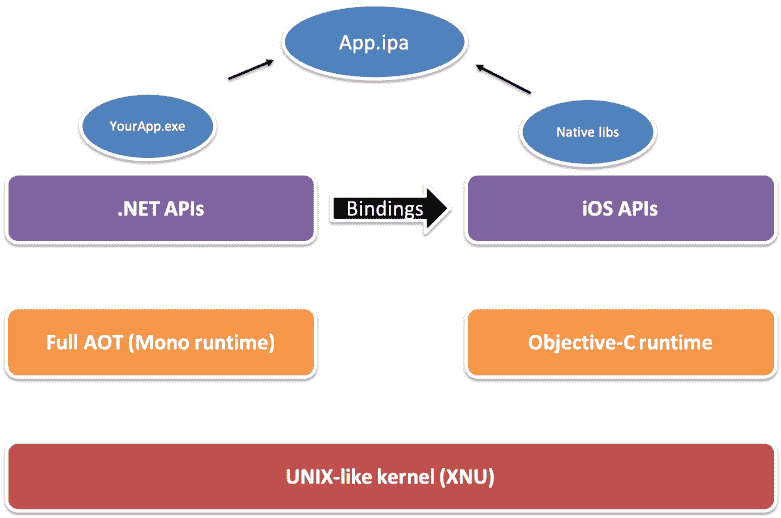
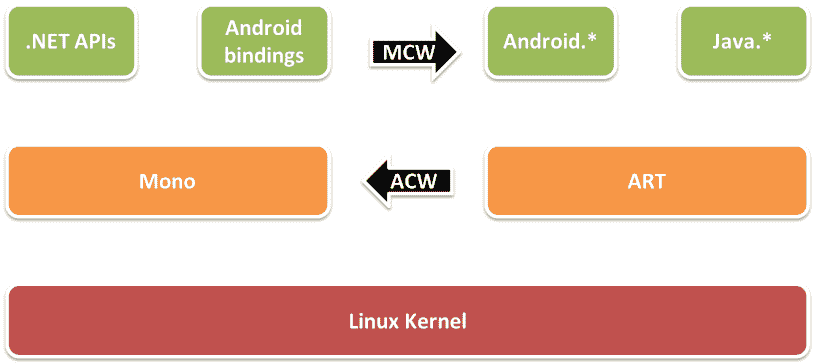
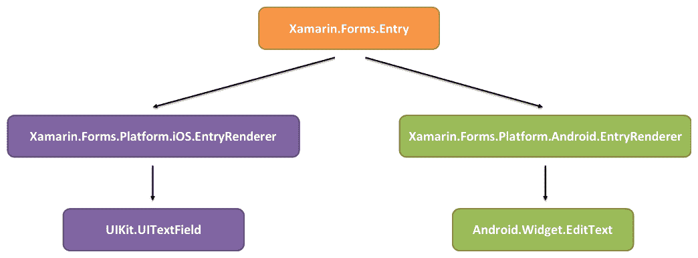
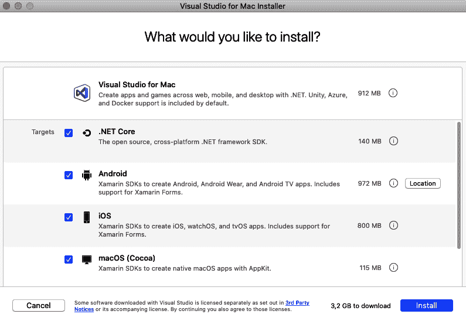
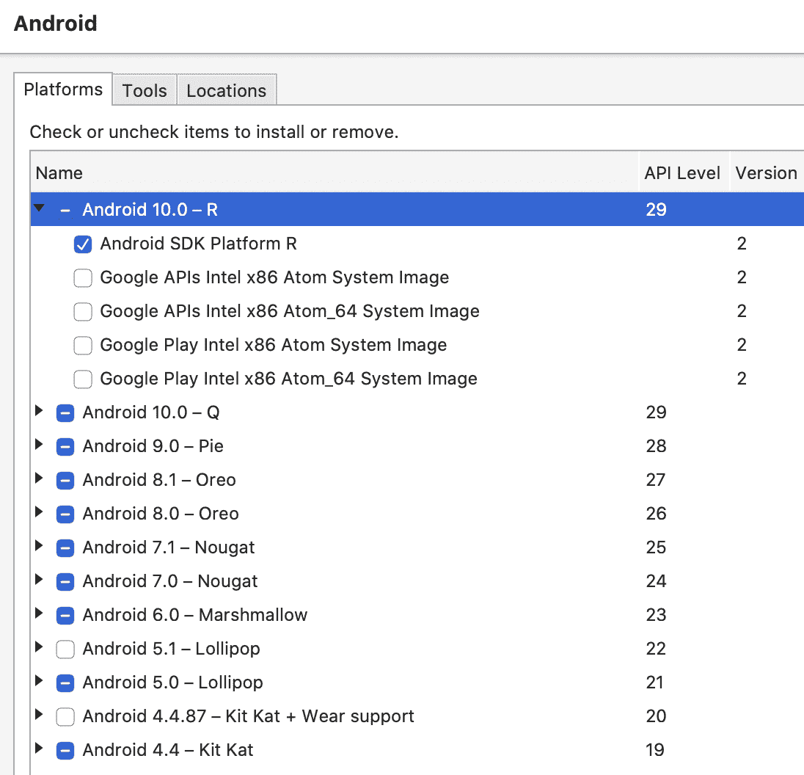
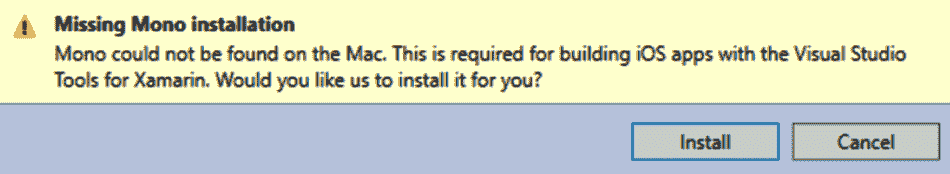
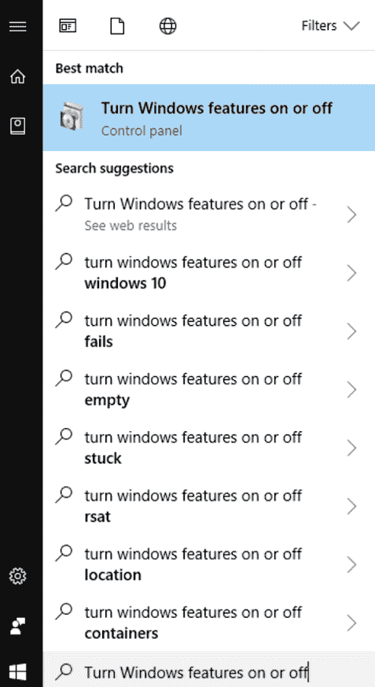
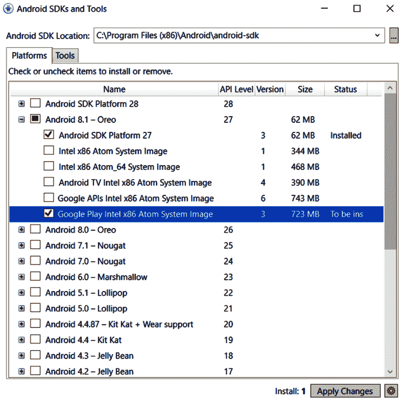
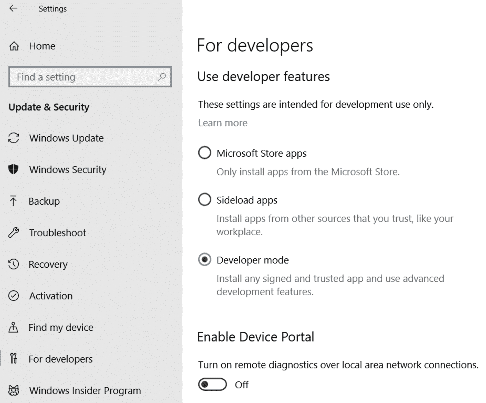

# 一、Xamarin 简介

这一章是关于了解 Xamarin 以及从中可以得到什么。这是唯一纯理论的一章；所有其他项目都涉及实践项目。此时您不需要编写任何代码，只需通读本章，就可以从较高的层次了解 Xamarin 是什么，Xamarin.Forms 与 Xamarin 的关系以及如何设置开发机器。

我们将首先定义什么是原生应用，以及.NET 作为一种技术带来了什么。之后，我们将了解 Xamarin.Forms 如何适应更大的范围，并了解何时适合使用传统的 Xamarin 和 Xamarin.Forms 应用。我们经常使用术语**传统 Xamarin**来描述不使用 Xamarin.Forms 的应用，即使 Xamarin.Forms 应用是通过传统 Xamarin 应用引导的。

在本章中，我们将介绍以下主题：

*   本机应用
*   Xamarin 和 Mono
*   Xamarin.表格
*   设置开发机器

让我们开始吧！

# 本机应用

术语**本地应用**对不同的人意味着不同的事情。对于某些人来说，它是一个使用平台创建者指定的工具开发的应用，例如使用 Objective-C 或 Swift 为 iOS 开发的应用，使用 Java 或 Kotlin 开发的 Android 应用，或使用.NET 开发的 Windows 应用。其他人使用术语“本机应用”来指编译成本机机器代码的应用。在本书中，我们将本机应用定义为具有本机 UI、性能和 API 访问权限的应用。下表更详细地解释了这三个概念：

*   **原生 UI**：**使用 Xamarin 构建的应用使用每个平台的标准控件。这意味着，例如，使用 Xamarin 构建的 iOS 应用的外观和行为将符合 iOS 用户的预期，而使用 Xamarin 构建的 Android 应用的外观和行为将符合 Android 用户的预期。**

 ***   **本机性能**：使用 Xamarin 构建的应用是针对本机性能编译的，可以使用特定于平台的硬件加速。

*   **原生 API 访问：**原生 API 访问意味着使用 Xamarin 构建的应用可以使用目标平台和设备提供给开发人员的一切。

# Xamarin 和 Mono

Xamarin 是一个开发平台，用于为 iOS（Xamarin.iOS）、Android（Xamarin.Android）和 macOS（Xamarin.Mac）开发本机应用。从技术上讲，它是这些平台之上的绑定层。绑定到平台 API 使.NET 开发人员能够使用 C#（和 F#）以每个平台的全部容量开发本机应用。我们在使用 Xamarin 开发应用时使用的 C# API 或多或少与平台 API 相同，但它们是**。网络化**。例如，API 通常根据.NET 命名约定进行定制，Android`set`和`get`方法通常由属性替代。这样做的原因是，对于.NET 开发人员来说，API 应该更易于使用。

单声道（[https://www.mono-project.com](https://www.mono-project.com/) 是微软.NET 框架的开源实现，基于**欧洲计算机制造商协会**（**ECMA**）C# 标准和**公共语言运行库**（**CLR**）。Mono 的创建是为了将.NET 框架引入 Windows 以外的平台。它是.NET 基金会的一部分 http://www.dotnetfoundation.org ），一个独立的组织，支持涉及.NET 生态系统的开放式开发和协作。

通过 Xamarin 平台和 Mono 的组合，我们可以使用特定于平台的 API 和.NET 的独立于平台的部分，包括名称空间、系统、`System.Linq`、`System.IO`、`System.Net`和`System.Threading.Tasks`。

使用 Xamarin 进行移动应用开发有几个原因，我们将在以下部分介绍这些原因。

When .NET 5 is released, it will partly replace Mono. We will get one unified **Base Class Library** (**BCL**) for all the .NET platforms. Xamarin.iOS will still run on the Mono runtime because iOS apps need to be **Ahead Of Time** (**AOT**) compiled. The .NET runtime (currently called .NET Core Runtime) will not support AOT.

## 代码共享

如果我们对多个移动平台（甚至服务器平台）使用一种通用编程语言，那么我们可以在目标平台之间共享大量代码，如下图所示。所有与目标平台无关的代码都可以与其他.NET 平台共享。通常以这种方式共享的代码包括业务逻辑、网络调用和数据模型：


还有一个基于.NET 平台的大型社区，以及可以从 NuGet（[下载的各种第三方库和组件 https://nuget.org](https://nuget.org) ），并跨.NET 平台使用。

跨平台的代码共享缩短了开发时间。它还可以生成质量更高的应用，例如，我们只需要为业务逻辑编写一次代码。有一个较低的错误风险，也可以保证计算返回相同的结果，无论我们的用户使用什么平台。

## 利用现有知识

对于希望开始构建本机移动应用的.NET 开发人员来说，学习新平台的 API 比学习新旧平台的编程语言和 API 更容易。

类似地，希望构建本机移动应用的组织可以使用现有的开发人员以及他们对.NET 的了解来开发应用。由于.NET 开发人员比 Objective-C 和 Swift 开发人员多，因此更容易为移动应用开发项目找到新的开发人员。

# 沙马林平台

可用的不同 Xamarin 平台有 Xamarin.iOS、Xamarin.Android 和 Xamarin.Mac。在本节中，我们将逐一介绍它们。

## 沙马林

Xamarin.iOS 用于使用.NET 为 iOS 构建应用，并包含与前面提到的 iOS API 的绑定。Xamarin.iOS 使用 AOT 编译将 C# 代码编译成**高级 RISC 机器**（**ARM**汇编语言。Mono 运行时与 Objective-C 运行时一起运行。使用.NET 名称空间的代码（如`System.Linq`或`System.Net`）由 Mono 运行时执行，而使用 iOS 特定名称空间的代码由 Objective-C 运行时执行。运行在**X 之上的 Mono 运行时和 Objective-C 运行时都不是 Unix**（**XNU**）类 Unix 内核（[https://github.com/apple/darwin-xnu](https://github.com/apple/darwin-xnu) ），由苹果公司开发。下图显示了 iOS 体系结构的概述：



## 泽马林，安卓

Android 用于使用.NET 为 Android 构建应用，并包含到 Android API 的绑定。Mono 运行时和**Android 运行时**（**艺术**）在 Linux 内核上并排运行。Android 应用可以是**实时**（**JIT**）编译的，也可以是 AOT 编译的，但要进行 AOT 编译，我们需要使用 Visual Studio Enterprise。

Mono 运行时和 ART 之间的通信通过一个**Java 本机接口**（**JNI**桥进行。JNI 桥有两种类型：**M****管理可调用包装器**（**MCW**）和**Android 可调用包装器**（**ACW**）。当代码需要在 ART 中运行时，使用 MCW；当 ART 需要在 Mono 运行时运行代码时，使用 ACW，如图所示：



## 哈马林，麦克

Mac 用于使用.NET 为 macOS 构建应用，并包含到 macOS API 的绑定。Mac 与 Xamarin.iOS 具有相同的体系结构，唯一的区别是 Xamarin.Mac 应用是 JIT 编译的，而 Xamarin.iOS 应用是 AOT 编译的。如下图所示：


# Xamarin.表格

Forms 是在 Xamarin（用于 iOS 和 Android）和**通用 Windows 平台**（**U****WP**之上构建的 UI 框架。Forms 允许开发人员使用一个共享代码库为 iOS、Android 和 UWP 创建 UI，如下图所示。如果我们使用 Xamarin.Forms 构建应用，我们可以使用 XAML、C# 或两者的组合来创建 UI：


## 沙马林的建筑形式

Forms 或多或少只是每个平台顶部的一个抽象层。Forms 有一个供所有平台使用的共享层，以及一个特定于平台的层。平台特定层包含渲染器。渲染器是将 Xamarin.Forms 控件映射到特定于平台的本机控件的类。每个 Xamarin.Forms 控件都有一个特定于平台的呈现程序。

下图说明了在 iOS 应用中使用共享的 Xamarin.Forms 代码时，如何将 Xamarin.Forms 中的条目控制从`UIKit`命名空间呈现给`UITextField`控件。Android 中的相同代码呈现来自`Android.Widget`命名空间的`EditText`控件：



## 使用 XAML 定义 UI

在 Xamarin.Forms 中声明 UI 最常用的方法是在 XAML 文档中定义它。也可以用 C# 创建 GUI，因为 XAML 实际上只是一种用于实例化对象的标记语言。理论上，我们可以使用 XAML 创建任何类型的对象，只要它具有无参数构造函数。XAML 文档是具有特定模式的**可扩展标记语言**（**XML**文档）。

### 定义标签控件

作为一个简单的示例，让我们看一下 XAML 文档的以下片段：

```cs
<Label Text="Hello World!" />
```

当 XAML 解析器遇到这个片段时，它会创建一个`Label`对象的实例，然后设置与 XAML 中的属性相对应的对象属性。这意味着如果我们在 XAML 中设置一个`Text`属性，它将在所创建的`Label`对象的实例上设置`Text`属性。上例中的 XAML 具有与以下相同的效果：

```cs
var obj = new Label()
{
    Text = "Hello World!"
};
```

XAML 的存在使我们能够更容易地查看创建 GUI 所需的对象层次结构。GUI 的对象模型也是按设计分层的，因此 XAML 支持添加子对象。我们可以简单地将它们添加为子节点，如下所示：

```cs
<StackLayout>
    <Label Text="Hello World" />
    <Entry Text="Ducks are us" />
</StackLayout>
```

`StackLayout`是一个容器控件，它在容器中垂直或水平地组织子对象。垂直组织是默认值，除非我们另行指定，否则将使用垂直组织。还有许多其他容器，如`Grid`和`FlexLayout`。这些将在以下章节的许多项目中使用。

### 在 XAML 中创建页面

单个控件没有任何用处，除非它有一个承载它的容器。让我们看看整个页面是什么样子。XAML 中定义的完全有效的`ContentPage`对象是 XML 文档。这意味着我们必须从 XML 声明开始。之后，我们必须有一个且只有一个根节点，如图所示：

```cs
<?xml version="1.0" encoding="UTF-8"?>
<ContentPage

     xmlns:x="http://schemas.microsoft.com/winfx/2009/xaml"
     x:Class="MyApp.MainPage">

    <StackLayout>
        <Label Text="Hello world!" />
    </StackLayout>
</ContentPage>
```

在前面的示例中，我们定义了一个`ContentPage`对象，该对象在每个平台上转换为单个视图。为了使其成为有效的 XAML，我们需要指定一个默认名称空间（`) and then add the `x`名称空间（`xmlns:x="http://schemas.microsoft.com/winfx/2009/xaml"`）。`

默认名称空间允许我们创建对象而无需前缀，例如`StackLayout`对象。`x`名称空间允许我们访问`x:Class`等属性，它告诉 XAML 解析器在创建`ContentPage`对象时实例化哪个类来控制页面。

一个`ContentPage`对象只能有一个子对象。在这种情况下，它是一个`StackLayout`控件。除非另行指定，否则默认布局方向为垂直。因此，`StackLayout`对象可以有多个子对象。稍后，我们将讨论更高级的布局控件，例如`Grid`和`FlexLayout`控件。

在这个特定的示例中，我们将创建一个`Label`控件作为`StackLayout`的第一个子控件。

### 用 C 语言创建页面#

为了清楚起见，下面的代码向您展示了前面的示例在 C# 中的外观：

```cs
public class MainPage : ContentPage
{
}
```

`page`是从`Xamarin.Forms.ContentPage`继承的类。如果我们创建一个 XAML 页面，这个类会自动生成，但是如果我们只使用代码，我们需要自己定义它。

让我们使用以下代码创建与前面定义的 XAML 页面相同的控件层次结构：

```cs
var page = new MainPage();

var stacklayout = new StackLayout();
stacklayout.Children.Add(
    new Label()
    {
        Text = "Welcome to Xamarin.Forms"
    });

page.Content = stacklayout;
```

第一条语句创建一个`page`对象。理论上，我们可以直接创建一个新的`ContentPage`页面，但这将禁止我们在其背后编写任何代码。出于这个原因，将我们计划创建的每个页面分为子类是一个很好的实践。

第一条语句后面的块创建了`StackLayout`控件，其中包含添加到`Children`集合的`Label`控件。

最后，我们需要将`StackLayout`分配给页面的`Content`属性。

### XAML 还是 C#？

通常，使用 XAML 可以提供更好的概述，因为页面是对象的层次结构，而 XAML 是定义该结构的一种非常好的方法。在代码中，由于我们需要首先定义最里面的对象，所以结构会被翻转，这使得阅读页面的结构变得更加困难。这在本章的 XAML 部分的*创建页面中得到了演示。话虽如此，如何定义 GUI 通常是一个偏好问题。本书将在接下来的项目中使用 XAML 而不是 C#。*

## Xamarin.形式与传统 Xamarin

虽然这本书是关于 Xamarin.Forms 的，但我们也将强调使用传统 Xamarin 和 Xamarin.Forms 之间的区别。传统的 Xamarin 用于开发使用 iOS 和 Android**软件开发工具包**（**SDK**）的应用，无需任何抽象手段。例如，我们可以创建一个 iOS 应用，该应用在情节提要或直接在代码中定义其 UI。这段代码不会被其他平台重用，比如 Android。使用这种方法构建的应用仍然可以通过引用.NET 标准库共享非平台特定的代码。此关系如下图所示：


另一方面，Forms 是 GUI 的抽象，它允许我们以平台无关的方式定义 UI。它仍然构建在 Xamarin.iOS、Xamarin.Android 和所有其他受支持的平台之上。可以将 Xamarin.Forms 应用创建为.NET 标准库或共享代码项目，其中源文件作为副本链接，并在与我们当前构建的平台相同的项目中构建。此关系如下图所示：


话虽如此，没有传统的 Xamarin.Forms 是不可能存在的，因为它是通过每个平台的应用引导的。这使我们能够使用自定义呈现器和平台特定代码在每个平台上扩展 Xamarin.Forms，这些代码可以通过接口公开给我们的共享代码库。我们将在本章后面更详细地介绍这些概念。

### 何时使用 Xamarin.Forms

我们可以在大多数情况下和大多数类型的应用中使用 Xamarin.Forms。如果我们需要使用 Xamarin.Forms 中没有的控件，我们可以始终使用特定于平台的 API。然而，在某些情况下，Xamarin.Forms 是无用的。我们可能希望避免使用 Xamarin.Forms 的最常见情况是，如果我们构建的应用在不同的目标平台上看起来应该非常不同。

# 设置开发机器

为多个平台开发应用对我们的开发机器提出了更高的要求。这样做的一个原因是，我们通常希望在开发机器上运行一个或多个模拟器。对于开始开发所需的内容，不同的平台也有不同的要求。无论我们使用 macOS 还是 Windows，Visual Studio 都将是我们的**集成开发环境**（**IDE**。VisualStudio 有几个版本，包括免费社区版。转至[https://visualstudio.microsoft.com/](https://visualstudio.microsoft.com/) 比较可用版本。以下列表总结了我们需要为每个平台开始开发的内容：

*   **iOS**：**要开发 iOS 应用，我们需要一台**Macintosh**（**Mac**设备。这可能是我们正在开发的机器，也可能是我们网络上的机器，如果我们正在使用的话。我们需要连接到 Mac 的原因是我们需要使用 Xcode 来编译和调试应用。Xcode 还提供了一个 iOS 模拟器。可以在没有连接 Mac 的情况下在 Windows 上进行一些 iOS 开发；您可以在本章的*Xamarin 热重启*部分了解更多信息。**
***   **安卓**：**安卓应用可以在 macOS 或 Windows 上开发。我们需要的所有东西，包括 SDK 和模拟器，都是用 Visual Studio 安装的。*****   **UWP**：**UWP 应用只能在 Windows 机器上的 Visual Studio 中开发。******

 ******## 设置 Mac

在 Mac 上使用 Xamarin 开发 iOS 和 Android 应用需要两个主要工具。这些是 Visual Studio for Mac（如果我们只开发 Android 应用，这是我们唯一需要的工具）和 Xcode。在以下部分中，我们将了解如何为应用开发设置 Mac。

### 安装 Xcode

在安装 VisualStudio 之前，我们需要下载并安装 Xcode。Xcode 是苹果公司的官方开发 IDE，包含所有可用于 iOS 开发的工具，包括用于 iOS、macOS、tvOS 和 watchOS 的 SDK。

我们可以从苹果开发者门户网站（[下载 Xcodehttps://developer.apple.com](https://developer.apple.com) 或从苹果应用商店购买。我建议你从应用商店下载，因为这保证了你有最新的稳定版本。从开发者门户下载 Xcode 的唯一原因是，如果您想使用预发布版本的 Xcode 为 iOS 预发布版进行开发。

在第一次安装之后，以及每次更新 Xcode 之后，打开它是很重要的。Xcode 通常需要在安装或更新后安装其他组件。我们还需要打开 Xcode 以接受与苹果的许可协议。

### 安装 Visual Studio

要安装 Visual Studio，我们首先需要从[下载它 https://visualstudio.microsoft.com](https://visualstudio.microsoft.com) 。

当我们通过下载的文件启动 VisualStudio 安装程序时，它将开始检查我们已经在机器上安装的内容。检查完成后，我们可以选择要安装的平台和工具。

选择了要安装的平台后，Visual Studio 将下载并安装使用 Xamarin 开始应用开发所需的所有内容，如图所示：



### 配置 Android 仿真器

VisualStudio 使用谷歌提供的 Android 模拟器。如果我们希望模拟器速度更快，那么我们需要确保它是硬件加速的。为了硬件加速 Android emulator，我们需要安装**Intel****硬件加速执行管理器**（**HAXM**，可以从[下载 https://software.intel.com/en-us/articles/intel-hardware-accelerated-execution-manager-intel-haxm](https://software.intel.com/en-us/articles/intel-hardware-accelerated-execution-manager-intel-haxm) 。

下一步是创建 Android 仿真器。首先，我们需要确保安装了 Android emulator 和 Android 操作系统映像。为此，请执行以下步骤：

1.  转到“工具”选项卡以安装 Android emulator：


2.  我们还需要安装一个或多个映像以与 emulator 一起使用。例如，如果我们想在不同版本的 Android 上运行我们的应用，我们可以安装多个图像。我们可以选择使用 Google Play 的模拟器（如下面的屏幕截图所示），这样我们就可以在我们的应用中使用 Google Play 服务，即使我们在模拟器中运行它。例如，如果我们想在我们的应用中使用谷歌地图，这是必需的：



3.  然后，要创建和配置仿真器，请转到 VisualStudio 中“工具”选项卡 Android 部分的“设备管理器”。从 Android 设备管理器，我们可以启动一个模拟器，如果我们已经创建了一个；或者，我们可以创建新的模拟器，如图所示：


4.  如果我们点击 NewDevice 按钮，我们就可以创建一个具有我们需要的规范的新模拟器。在这里创建新仿真器的最简单方法是选择符合我们需要的基本设备。这些基本设备是预配置的，这通常就足够了。但是，也可以编辑设备的属性，这样我们就有了一个符合我们特定需求的模拟器。

因为我们不会在带有 ARM 处理器的设备上运行 emulator，所以我们必须选择 x86 处理器或 x64 处理器，如下面的屏幕截图所示。如果我们尝试使用 ARM 处理器，模拟器将非常慢：


## 设置 Windows 计算机

我们可以使用虚拟或物理 Windows 机器来开发 Xamarin。例如，我们可以在 Mac 电脑上运行一台虚拟 Windows 机器。我们在 Windows 机器上开发应用所需的唯一工具是 Visual Studio。

### 安装 Xamarin for Visual Studio

如果我们已经安装了 VisualStudio，我们首先需要打开 VisualStudio 安装程序；否则，我们需要转到[https://visualstudio.microsoft.com](https://visualstudio.microsoft.com) 下载安装文件。

在安装开始之前，我们需要选择要安装的工作负载。

如果我们想为 Windows 开发应用，我们需要选择通用 Windows 平台开发工作负载，如下所示：


对于 Xamarin 开发，我们需要使用.NET 安装移动开发。如果要使用 Hyper-V 进行硬件加速，可以取消选中“移动开发详细说明”中的“英特尔 HAXM”复选框，左侧显示.NET 工作负载，如下面的屏幕截图所示。取消选择“英特尔 HAXM”时，也会取消选择 Android emulator，但您可以稍后重新安装：


当我们第一次启动 Visual Studio 时，系统会询问我们是否要登录。除非我们想使用 Visual Studio Professional 或 Enterprise，否则我们没有必要登录，在这种情况下，我们需要登录以便验证我们的许可证。

### 将 Visual Studio 与 Mac 配对

如果我们想运行、调试和编译 iOS 应用，那么我们需要将其连接到 Mac。如本章前面所述，我们可以手动设置 Mac，也可以使用自动 Mac 配置。这将在我们连接的 Mac 上安装 Mono 和 Xamarin.iOS。它不会安装 VisualStudioIDE，但如果我们只想将其用作构建机器，则不需要安装。但是，我们确实需要手动安装 Xcode。

为了能够手动或使用自动 Mac 配置连接到 Mac，我们需要能够通过网络访问 Mac，并且需要在 Mac 上启用远程登录。要执行此操作，请转到设置|共享并选中远程登录复选框。在窗口左侧，我们可以选择允许哪些用户使用远程登录进行连接，如图所示：


要从 Visual Studio 连接到 Mac，请使用工具栏中的 Pair To Mac 按钮（如以下屏幕截图所示）；或者，在顶部菜单中，转到工具| iOS |配对到 Mac：


将出现一个对话框，显示网络上可以找到的所有 Mac。如果您的 Mac 电脑没有出现在可用 Mac 电脑列表中，我们可以使用添加 Mac。。。按钮，输入 IP 地址，如图所示：


如果我们需要的所有东西都安装在 Mac 上，那么 VisualStudio 将连接，我们可以开始构建和调试 iOS 应用。如果 Mac 上缺少 Mono，则会出现警告。此警告还将为我们提供安装选项，如图所示：



### 配置 Android 仿真器和硬件加速

如果我们想要一个运行平稳的快速 Android 仿真器，我们需要启用硬件加速。这可以使用 Intel HAXM 或 Hyper-V 来完成。Intel HAXM 的缺点是，它不能在配备**高级微设备**（**AMD**处理器的机器上使用；我们必须使用带有英特尔处理器的机器。我们无法将 Intel HAXM 与 Hyper-V 并行使用。

因此，Hyper-V 是在 Windows 机器上硬件加速 Android 仿真器的首选方式。要在 Android emulator 中使用 Hyper-V，我们需要在 2018 年 4 月安装 Windows 和 Visual Studio 15.8 版（或更高版本）的更新（或更高版本）。要启用 Hyper-V，我们需要采取以下步骤：

1.  打开“开始”菜单，依次键入打开或关闭 Windows 功能。单击显示的选项将其打开，如图所示：



2.  要启用 Hyper-V，请选中 Hyper-V 复选框。此外，展开 Hyper-V 选项并选中 Hyper-V 平台复选框。我们还需要选中 Windows 虚拟机监控程序平台复选框，如图所示：


3.  当 Windows 提示您重新启动计算机时，请重新启动计算机。

因为我们在安装 VisualStudio 期间没有安装 Android 仿真器，所以现在需要安装它。转到 VisualStudio 中的工具菜单，然后单击 Android，然后单击 Android SDK 管理器。

在 Android SDK 管理器中的工具下，我们可以通过选择 Android emulator 来安装 emulator，如下面的屏幕截图所示。此外，我们还应确保安装了最新版本的 Android SDK 构建工具：


我们还建议安装本机开发工具包（NDK）。NDK 使得可以导入用 C 或 C++编写的库。如果我们想要 AOT 编译应用，还需要 NDK。

Android SDK 允许同时安装多个模拟器映像。例如，如果我们想在不同版本的 Android 上运行我们的应用，我们可以安装多个图像。选择带有 Google Play 的模拟器（如下面的屏幕截图所示），这样我们就可以在我们的应用中使用 Google Play 服务，即使我们在模拟器中运行它。

例如，如果我们想在我们的应用中使用谷歌地图，这是必需的：



下一步是创建一个虚拟设备来使用仿真器映像。要创建和配置仿真器，请转到 Android 设备管理器，我们可以从 VisualStudio 的“工具”选项卡打开它。在设备管理器中，我们可以启动模拟器（如果已经创建了模拟器），也可以创建新的模拟器，如图所示：


如果我们点击 NewDevice 按钮，我们就可以创建一个具有我们需要的规范的新模拟器。在这里创建新仿真器的最简单方法是选择符合我们需要的基本设备。这些基本设备是预配置的，这通常就足够了。但是，可以编辑设备的属性，这样我们就有了一个符合我们特定需求的模拟器。

我们必须选择 x86 处理器（如下屏幕截图所示）或 x64 处理器，因为我们没有在带有 ARM 处理器的设备上运行模拟器。如果我们尝试使用 ARM 处理器，模拟器将非常慢：


### 配置 UWP 开发人员模式

如果我们想开发 UWP 应用，我们需要在开发机器上激活开发者模式。要执行此操作，请转到开发者设置|更新与安全|。然后，点击开发者模式，如下图所示。这使我们能够通过 Visual Studio 侧向加载和调试应用：



如果我们选择 Sideload 应用而不是开发者模式，我们将只能安装应用，而无需进入 Microsoft 应用商店。如果我们有一台机器要测试，而不是调试我们的应用，我们可以只选择侧载应用。

# Xamarin 生产工具

Xamarin 热重启和 Xamarin 热重新加载是提高 Xamarin 开发人员生产率的两个工具。

## Xamarin 热重启

热重启是 VisualStudio 的一项功能，目前正在预览中，以提高开发人员的工作效率。它还为我们提供了一种在 iPhone 上运行和调试 iOS 应用的方法，而无需使用连接到 Visual Studio 的 Mac。Microsoft 对热重启的描述如下：

“<q>Xamarin 热重启使您能够在开发过程中快速测试对应用的更改，包括多文件代码编辑、资源和引用。它将新更改推送到调试目标上的现有应用包，从而加快构建和部署周期。</q>

要使用热重启，您需要以下内容：

*   Visual Studio 2019 版本 16.5 或更高版本
*   iTunes（64 位）
*   苹果开发者账户和付费苹果开发者程序（[https://developer.apple.com/programs/](https://developer.apple.com/programs/) 报名

热重启当前只能用于 Xamarin.Forms 应用。

要激活热重启，请转到工具|选项|环境|预览功能|启用 Xamarin 热重启。

在[阅读更多关于热重启当前状态的信息 https://docs.microsoft.com/en-us/xamarin/xamarin-forms/deploy-test/hot-restart](https://docs.microsoft.com/en-us/xamarin/xamarin-forms/deploy-test/hot-restart) 。

## Xamarin XAML 热重新加载

Xamarin XAML 热重新加载允许我们对 XAML 进行更改，而无需重新部署应用。当我们对 XAML 进行更改时，只需保存文件，它就会更新模拟器/仿真器或设备上的页面。XAML 热重新加载目前仅受 iOS 和 Android 支持。

要在 Windows 上为 Visual Studio 启用 XAML 热加载，请转到 Visual Studio |首选项| Xamarin 工具| XAML 热加载。

要在 Mac 上为 Visual Studio 启用 XAML 热加载，请转到工具|选项| Xamarin |热加载。

要使用 XAML 热重新加载，我们必须将 Xamarin.Forms 4.1+与 Visual Studio 2019 16.4+或 Visual Studio for Mac 8.4+结合使用。

# 总结

您现在应该对 Xamarin 是什么以及 Xamarin.Forms 与 Xamarin 本身的关系感到更舒服一些。

在本章中，我们建立了本机应用的定义，并了解了本机应用如何具有本机 UI、本机性能和本机 API 访问。我们讨论了 Xamarin 是如何基于 Mono 的，Mono 是.NET framework 的开源实现，并讨论了 Xamarin 的核心是如何绑定到特定于平台的 API。然后我们看了 Xamarin.iOS 和 Xamarin.Android 如何在引擎盖下工作。

在那之后，我们开始接触这本书的核心主题，那就是 Xamarin.Forms。我们首先概述了平台无关控件如何呈现为平台特定控件，以及如何使用 XAML 定义控件层次结构以组装页面。然后，我们花了一些时间研究 Xamarin.Forms 应用和传统 Xamarin 应用之间的区别。

传统的 Xamarin 应用直接使用特定于平台的 API，除了.NET 作为平台添加的 API 之外，没有任何抽象。Forms 是一个构建在传统 Xamarin API 之上的 API，允许我们在 XAML 或呈现给特定于平台的控件的代码中定义与平台无关的 GUI。Xamarin 的形式不止这些，但这是它的核心。

在本章的最后一部分，我们讨论了如何在 Windows 或 macOS 上设置开发机器。

现在，是时候利用我们新学到的知识了！在下一章中，我们将从头开始创建一个待办应用。我们将研究**模型–视图–视图模型**（**MVVM**）等概念，以实现业务逻辑和 UI 之间的清晰分离，以及 SQLite.NET 将数据持久保存到设备上的本地数据库。我们将同时为三个平台执行此操作，请继续阅读！********