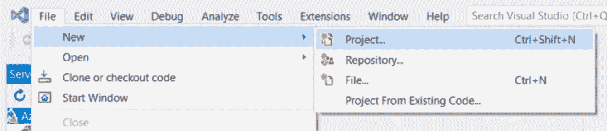
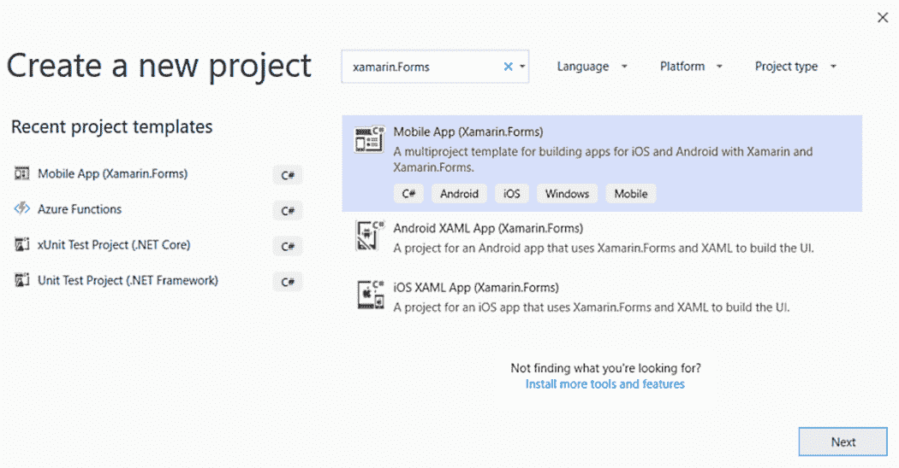
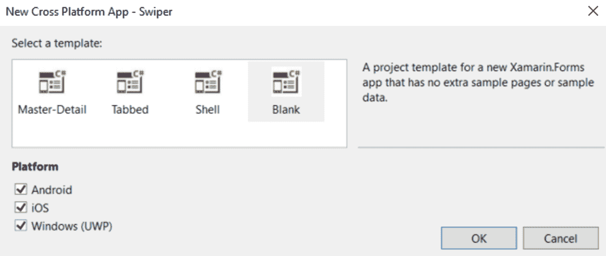
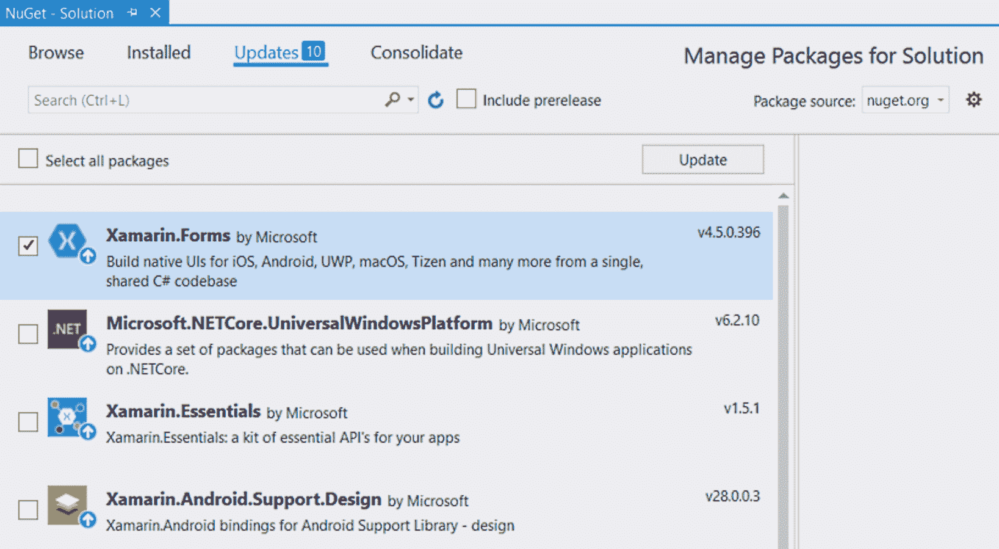
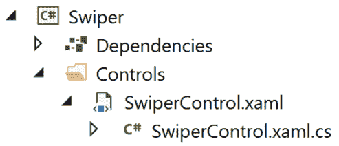

A Matchmaking App with a Rich UX Using Animations

在本章中，我们将为婚介应用程序创建基本功能。然而，由于隐私问题，我们不会对人们进行评级。相反，我们将从互联网上随机下载图片。这个项目是为任何想要介绍如何编写可重用控件的人准备的。我们还将研究如何使用动画使我们的应用程序使用起来感觉更好。此应用程序将不是**模型视图视图模型**（**MVVM**应用程序，因为我们希望将控件的创建和使用与 MVVM 的轻微开销隔离开来。

本章将介绍以下主题：

*   创建自定义控件
*   将应用程序设置为照片样式，并在其下方添加描述性文本
*   使用 Xamarin.Forms 的动画
*   订阅自定义事件
*   反复使用自定义控件
*   处理平底锅手势

# 技术要求

要完成此项目，您需要安装 Visual Studio for Mac 或 Windows，以及必要的 Xamarin 组件。请参见[第 1 章](04.html)、*Xamarin 简介*，了解有关如何设置您的环境的更多详细信息。

# 项目概述

我们中的许多人都去过那里，面临着向左还是向右滑动的难题。突然间，你可能会发现自己在想：*这是如何工作的？刷卡魔术是如何发生的？*好的，在这个项目中，我们将学习所有关于它的知识。我们将首先定义一个`MainPage`文件，应用程序的图像将驻留在该文件中。之后，我们将创建图像控件，并逐步添加**图形用户界面**（**GUI**和功能，直到我们确定了完美的刷卡体验。

此项目的构建时间约为 90 分钟。

# 创建配对应用程序

在本项目中，我们将了解更多有关创建可重用控件的信息，这些控件可以添加到**可扩展应用程序标记语言**（**XAML**页面中。为了简单起见，我们将不使用 MVVM，而是使用没有任何数据绑定的裸机 Xamarin.Forms。我们的目标是创建一个应用程序，让用户可以像大多数流行的婚介应用程序一样，左右滑动图像。

那么，让我们从创建项目开始吧！

## 创建项目

正如[第 2 章](04.html)中的待办事项列表应用程序一样，*构建我们的第一个 Xamarin.Forms 应用程序，*本章将从一个干净的文件“新”项目方法开始。

让我们开始吧！

### 创建新项目

那么，让我们开始，如下所示：

1.  打开 Visual Studio 并单击文件|新建**项目，如以下屏幕截图所示：**

 **

2.  在搜索字段中输入 Xamarin.Forms 并选择移动应用程序（Xamarin.Forms）模板，如以下屏幕截图所示：



3.  通过命名项目完成向导的下一步。在这种情况下，我们将调用我们的应用程序`Swiper`。单击“创建”转到下一个对话框，如以下屏幕截图所示：


4.  现在，我们将选择一个项目模板。选择 Blank 创建一个最小的 Xamarin.Forms 应用程序。确保检查了所有平台。请注意，Windows（UWP）仅在您使用 Windows 时可用。
5.  单击“确定”完成安装向导，然后让 Visual Studio 为您搭建项目。这可能需要几分钟。

请参阅以下屏幕截图以查看上述信息：



就这样，应用程序被创建了。让我们继续将 Xamarin.Forms 更新到最新版本。

### 更新 Xamarin.Forms NuGet 包

目前，创建项目时使用的 Xamarin.Forms 版本很可能有点旧。为了纠正这一点，我们需要更新**NuGet 包**。请注意，您应该只更新 Xamarin.Forms 包，而不更新 Android 包；执行后一种操作可能会导致软件包彼此不同步，导致应用程序根本无法构建。要更新 NuGet 软件包，请执行以下步骤：

1.  在解决方案资源管理器中右键单击我们的解决方案。
2.  单击管理解决方案的 NuGet Packages…，如以下屏幕截图所示：


这将在 Visual Studio 中打开 NuGet 软件包管理器，如以下屏幕截图所示：



要将 Xamarin.Forms 更新至最新版本，请执行以下步骤：

1.  单击更新选项卡。
2.  选中 Xamarin.Forms 并单击更新。
3.  接受任何许可协议。

更新最多需要几分钟。检查输出窗格以查找有关更新的信息。在这一点上，我们可以运行应用程序，以确保它的工作。我们应该看到文本欢迎来到 Xamarin.Forms！在屏幕中间，如下面的截图所示：


## 设计主页文件

创建了一个名为`Swiper`的全新空白 Xamarin.Forms 应用程序，其中有一个名为`MainPage.xaml`的页面。它位于所有特定于平台的项目所引用的.NET 标准项目中。我们需要将 XAML 模板替换为包含`Swiper`控件的新布局。

让我们编辑已经存在的`MainPage.xaml`文件，用我们需要的内容替换默认内容，如下所示：

1.  打开`MainPage.xaml`文件。
2.  用以下粗体标记的 XAML 代码替换页面内容：

```cs
<?xml version="1.0" encoding="utf-8"?>
<ContentPage  
             xmlns:x="http://schemas.microsoft.com/winfx/2009/xaml" 
             xmlns:local="clr-namespace:Swiper" 
             x:Class="Swiper.MainPage">

 <Grid Padding="0,40" x:Name="MainGrid">
 <Grid.RowDefinitions>
 <RowDefinition Height="400" />
 <RowDefinition Height="*" />
 </Grid.RowDefinitions>
<Grid Grid.Row="1" Padding="30"> <!-- Placeholder for later --> </Grid>
 </Grid>
</ContentPage>
```

`ContentPage`节点中的 XAML 代码在应用程序中定义了两个网格。网格只是其他控件的容器。它基于行和列定位这些控件。在本例中，外部网格定义了两行，这两行将覆盖屏幕的整个可用区域。第一行为`400`单位高，第二行为`Height="*"`，使用剩余可用空间。

在第一个网格中定义的内部网格被分配给具有属性`Grid.Row="1"`的第二行。行和列索引都是从零开始的，所以`"1"`实际上是指第二行。我们将在本章后面的部分向该网格中添加一些内容，但暂时将其保留为空。

两个网格都定义了它们的填充。您可以输入一个数字，这意味着所有边都有相同的填充，或者在本例中输入两个数字。我们已经输入了`0,40`，这意味着左侧和右侧应该有`0`单位的填充，顶部和底部应该有`40`单位的填充。还有第三个选项，有四位数字，按特定顺序设置*左侧*侧、*顶部*、*右侧*侧和*底部*的填充。

最后要注意的是，我们给外部网格起了一个名字，`x:Name="MainGrid"`。这将使它可以直接从`MainPage.xaml.cs`文件中定义的代码隐藏中访问。由于本例中没有使用 MVVM，因此需要一种无需数据绑定即可访问网格的方法。

## 创建 Swiper 控件

本项目的主要部分涉及创建`Swiper`控件。控件是一个独立的**用户界面**（**用户界面**），后面有一个代码。它可以作为元素或代码隐藏文件中的代码添加到任何 XAML 页面。我们将在此项目中添加来自代码的控件。

### 创建控件

创建`Swiper`控件是一个简单的过程。我们只需通过执行以下操作来确保选择正确的项目模板，即内容视图：

1.  在.NET 标准库项目中，创建一个名为`Controls`的文件夹。
2.  右键点击`Controls`文件夹，选择添加，然后点击新建项目。
3.  在“添加新项”对话框的左窗格中选择 Visual C#Items，然后选择 Xamarin.Forms。
4.  选择内容视图项目。确保您没有选择**内容视图（****C#】**选项；这只会创建一个 C#文件，而不是一个`XAML`文件。
5.  将控件命名为`SwiperControl.xaml`。
6.  点击添加**。**

请参阅以下屏幕截图以查看上述信息：


这将为 UI 添加一个 XAML 文件和一个 C 代码隐藏文件。它应该类似于以下屏幕截图：



### 定义主栅格

我们来设置`Swiper`控件的基本结构，如下所示：

1.  打开`SwiperControl.xaml`文件。
2.  将内容替换为以下代码块中以粗体标记的代码：

```cs
<?xml version="1.0" encoding="UTF-8"?>
<ContentView  
             xmlns:x="http://schemas.microsoft.com/winfx/2009/xaml" 
             x:Class="Swiper.Controls.SwiperControl">
    <ContentView.Content>
 <Grid>
 <Grid.ColumnDefinitions>
 <ColumnDefinition Width="100" />
 <ColumnDefinition Width="*" />
 <ColumnDefinition Width="100" />
 </Grid.ColumnDefinitions> 
 <!-- ContentView for photo here -->

            <!-- StackLayout for like here -->

            <!-- StackLayout for deny here -->
        </Grid> 
    </ContentView.Content>
</ContentView>
```

这定义了一个包含三列的网格。最左边和最右边的柱将占据`100`单位的空间，而中心将占据剩余的可用空间。侧面的空间将是我们将添加标签以突出用户所做选择的区域。我们还添加了三条注释作为 XAML 代码的占位符。

### 为照片添加内容视图

现在，我们将通过添加我们希望照片看起来像什么的定义来扩展`SwiperControl.xaml`文件。我们的最终结果将如下图所示。因为我们将从互联网上提取图像，所以我们将显示一个加载文本，以确保用户获得关于正在发生的事情的反馈。为了使它看起来像一张即时打印的照片，我们在照片下添加了一些手写文本，如以下屏幕截图所示：


前面的照片是我们希望照片看起来的样子。为了实现这一点，我们需要通过执行以下操作向`SwiperControl`文件添加一些 XAML 代码：

1.  打开`SwiperControl.xaml`。
2.  将粗体的 XAML 代码添加到以下注释中：`<!-- ContentView for photo here -->`。确保不要更换页面的整个`ContentView`控件；只需将其添加到注释下，如下面的代码块所示。页面的其余部分应保持不变：

```cs
<!-- ContentView for photo here -->
<ContentView x:Name="photo" Padding="40" Grid.ColumnSpan="3" >
    <Grid x:Name="photoGrid" BackgroundColor="Black" Padding="1" >
        <Grid.RowDefinitions>
            <RowDefinition Height="*" />
            <RowDefinition Height="40" />
         </Grid.RowDefinitions>

        <BoxView BackgroundColor="White" Grid.RowSpan="2" />

        <Image x:Name="image" Margin="10"
               BackgroundColor="#AAAAAA"
               Aspect="AspectFill" />

        <Label x:Name="loadingLabel"
                Text="Loading..."
                TextColor="White"
                FontSize="Large"
                FontAttributes="Bold"
                HorizontalOptions="Center"
                VerticalOptions="Center" />

        <Label x:Name="descriptionLabel" 
               Margin="10,0" 
               Text="A picture of grandpa" 
               Grid.Row="1"
               FontFamily="Bradley Hand" />
    </Grid>
</ContentView>
```

`ContentView`控件定义了一个新区域，我们可以在其中添加其他控件。`ContentView`控件的一个非常重要的特性是它只需要一个子控件。大多数情况下，我们会添加一个可用的布局控件。在本例中，我们将使用`Grid`控件来布置控件，如前面的代码所示。

网格定义了两行，如下所示：

*   照片本身的一行，当其他行已分配空间时，它会占用所有可用空间
*   注释的一行，高度正好为`40`单位

`Grid`控件本身设置为使用黑色背景和`1`填充。这与带有白色背景的`BoxView`控件相结合，创建了我们在控件周围看到的帧。`BoxView`控件也被设置为跨越网格的两行（`Grid.RowSpan="2"`，占据网格的整个区域，减去填充。

接下来是`Image`控制。它的背景色设置为漂亮的灰色（`#AAAAAA`）和`40`的边距，这将使它与周围的帧稍微分开。它还有一个硬编码的名称（`x:Name="image"`，这将允许我们从后面的代码与它进行交互。最后一个名为`Aspect`的属性决定了如果图像控件与源图像的比率不同，我们应该怎么做。在这种情况下，我们希望填充整个图像区域，但不显示任何空白区域。这可以有效地在高度或宽度上裁剪图像。

最后，我们添加了两个标签，它们也有硬编码的名称以供以后参考。

### 创建 DescriptionGenerator 类

在图像的底部，我们看到一个描述。因为我们没有任何来自即将发布的图像源的图像的一般描述，所以我们需要创建一个生成器来组成描述。下面是我们将如何做到这一点：

1.  在.NET 标准项目中创建名为`Utils`的文件夹。
2.  在该文件夹中创建一个名为`DescriptionGenerator`的新类。
3.  为`System.Linq`（`using System.Linq;`添加`using`语句。
4.  将以下代码添加到类中：

```cs
public class DescriptionGenerator
{
    private string[] _adjectives = { "nice", "horrible", "great", 
    "terribly old", "brand new" };                           
    private string[] _other = { "picture of grandpa", "car", "photo 
    of a forest", "duck" };
    private static Random random = new Random();

    public string Generate()
    {
        var a = _adjectives[random.Next(_adjectives.Count())];
        var b = _other[random.Next(_other.Count())];
        return $"A {a} {b}";
    }
} 
```

这门课只有一个目的。它从`_adjectives`数组中提取一个随机字，并将其与`_other`数组中的一个随机字组合。通过调用`Generate()`方法，我们得到了一个新的组合。在数组中输入您自己的单词。注意，`Random`实例是一个静态字段。这是因为，如果我们创建的`Random`类的新实例在时间上过于接近，它们将使用相同的值作为种子并返回相同的随机数序列。

### 创建图片类

为了抽象出要显示的图像的所有信息，我们将创建一个类来封装这些信息。我们的`Picture`课程中没有太多的信息，但这样做是一种很好的编码实践。进行如下工作：

1.  在`Utils`文件夹中创建一个名为`Picture`的新类。
2.  将以下代码添加到类中：

```cs
public class Picture
{
 public Uri Uri { get; set; }
  public string Description { get; set; }

 public Picture()
 {
 Uri = new Uri($"https://picsum.photos/400/400/?random&ts= 
 {DateTime.Now.Ticks}");

 var generator = new DescriptionGenerator();
 Description = generator.Generate();
 }
}
```

`Picture`类具有以下两个公共属性：

*   作为`Uri`属性公开的图像的**统一资源标识符**（**URI**），指向其在互联网上的位置
*   作为`Description`属性公开的图像的描述。

在构造函数中，我们创建了一个新的**URI**，它指向我们可以使用的测试照片的公共来源。宽度和高度在 URI 的查询字符串部分指定。我们还附加了一个随机时间戳，以避免 Xamarin.Forms 缓存图像。这会在每次请求图像时生成一个唯一的 URI。

然后，我们使用我们创建的`DescriptionGenerator`类为图像生成随机描述。

### 将图片绑定到控件

让我们开始连接`Swiper`控件，以便它开始显示图像。我们需要设置图像的源，然后根据图像的状态控制加载标签的可见性。由于我们使用的是从互联网上获取的图像，下载可能需要几秒钟的时间。这必须传达给用户，以避免混淆正在发生的事情。

#### 设置源

我们首先设置图像的来源。`image`控件（代码中称为`image`）具有`source`属性。此属性属于`ImageSource`抽象类型。您可以使用几种不同类型的图像源。我们感兴趣的是`UriImageSource`类型，它接受 URI，下载图像，并允许图像控件显示它。

让我们通过执行以下操作来扩展`Swiper`控件以设置源代码和描述：

1.  打开`Controls/Swiper.Xaml.cs`文件（隐藏在`Swiper`控件后面的代码）。
2.  为`Swiper.Utils`（`using Swiper.Utils;`添加`using`语句。
3.  将以下以粗体标记的代码添加到构造函数中：

```cs
public SwiperControl()
{
    InitializeComponent();

   var picture = new Picture();
 descriptionLabel.Text = picture.Description;
 image.Source = new UriImageSource() { Uri = picture.Uri };
} 
```

我们创建了一个`Picture`类的新实例，并通过设置该控件的 text 属性将描述分配给 GUI 中的`descriptionLabel`控件。然后，我们将图像的源设置为`UriImageSource`类的一个新实例，并从`picture`实例分配 URI。这将开始从 internet 下载图像，并在下载后立即显示。

#### 控制加载标签

下载图像时，我们希望在图像的中心显示加载文本。这已经在我们之前创建的 XAML 文件中，所以我们真正需要做的是在下载图像后将其隐藏。我们将通过设置与图像的`IsLoading`属性的绑定来控制`loadingLabel`控件的`IsVisibleProperty`属性（该属性实际上命名为`IsVisibleProperty`）。任何时候更改图像上的`IsLoading`属性时，绑定都会更改标签上的`IsVisible`属性。这是一个很好的用火忘却的方法。

让我们添加控制`loadingLabel`控件所需的代码，如下所示：

1.  打开`Swiper.xaml.cs`代码隐藏文件。
2.  将以下以粗体标记的代码添加到构造函数中：

```cs
public SwiperControl()
{
    InitializeComponent();

    var picture = new Picture();
    descriptionLabel.Text = picture.Description;
    image.Source = new  UriImageSource() { Uri = picture.Uri };
 loadingLabel.SetBinding(IsVisibleProperty, "IsLoading");
    loadingLabel.BindingContext = image; 
} 
```

在前面的代码中，`loadingLabel`控件设置了对`IsVisibleProperty`属性的绑定，该属性实际上属于所有控件继承自的`VisualElement`类。它告诉`loadingLabel`侦听分配给绑定上下文的任何对象的`IsLoading`属性中的更改。在本例中，这是`image`控件。

### 处理平底锅手势

该应用程序的一个核心功能是平移手势。平移手势是当用户按下控件并在屏幕上移动它时。我们还将向`Swiper`控件添加一个随机旋转，使其在添加多个图像时看起来像是一堆照片。

我们首先向`SwiperControl`类添加一些字段，如下所示：

1.  打开`SwiperControl.xaml.cs`文件。
2.  将代码中的以下字段添加到类中：

```cs
private readonly double _initialRotation;
private static readonly Random _random = new Random();
```

第一个字段`_initialRotation`存储图像的初始旋转。我们将在构造函数中设置它。第二个字段是包含`Random`对象的`static`字段。您可能还记得，最好创建一个静态随机对象，以确保不会使用同一种子创建多个随机对象。种子是基于时间的，所以如果我们创建的对象在时间上彼此太近，它们会生成相同的随机序列，所以实际上根本不会是随机的。

接下来我们要做的是为`PanUpdated`事件创建一个事件处理程序，我们将在本节末尾绑定该事件，如下所示：

1.  打开`SwiperControl.xaml.cs`代码隐藏文件。
2.  将`OnPanUpdated`方法添加到类中，如下所示：

```cs
private void OnPanUpdated(object sender, PanUpdatedEventArgs e)
{
    switch (e.StatusType)
    {
        case GestureStatus.Started:
             PanStarted();
             break;

        case GestureStatus.Running:
             PanRunning(e);
             break;

        case GestureStatus.Completed:
             PanCompleted();
             break;
     }
} 
```

代码非常简单。我们处理以`PanUpdatedEventArgs`对象作为第二个参数的事件。这是处理事件的标准方法。然后我们有一个`switch`子句来检查事件所指的状态。

平移手势可以有以下三种状态：

*   `GestureStatus.Started`：当摇摄开始时，事件在该状态下引发一次。
*   `GestureStatus.Running`：**然后，事件被引发多次，每次移动手指一次。**
***   `GestureStatus.Completed`：**当您放手时，事件将最后一次引发。****

 ****对于每个状态，我们调用处理不同状态的特定方法。我们现在将继续添加这些方法，如下所示：

1.  打开`SwiperControl.xaml.cs`代码隐藏文件。
2.  向类中添加以下三个方法，如下所示：

```cs
private void PanStarted()
{
    photo.ScaleTo(1.1, 100);
}

private void PanRunning(PanUpdatedEventArgs e)
{
    photo.TranslationX = e.TotalX;
    photo.TranslationY = e.TotalY;
    photo.Rotation = _initialRotation + (photo.TranslationX / 25);
}

private void PanCompleted()
{
    photo.TranslateTo(0, 0, 250, Easing.SpringOut);
    photo.RotateTo(_initialRotation, 250, Easing.SpringOut);
    photo.ScaleTo(1, 250);
}

```

让我们从`PanStarted()`开始。当用户开始拖动图像时，我们希望添加图像在曲面上稍微升高的效果。这是通过将图像缩放 10%来实现的。Forms 有一组出色的函数来实现这一点。在本例中，我们调用图像控件（名为`Photo`上的`ScaleTo()`方法，并告诉它缩放到`1.1`，它对应于其原始大小的 10%。我们还告诉它在`100`**毫秒**（**毫秒**的持续时间内完成此操作。这个调用也是可以等待的，这意味着我们可以在执行下一个调用之前等待控件完成动画。在这种情况下，我们将使用“先开火，后忘记”的方法。

接下来我们有`PanRunning()`，在 pan 操作中多次调用。这将从调用`PanRunning()`的事件处理程序中获取一个参数，即`PanUpdatedEventArgs`参数。我们也可以只传入一个`X`和`Y`值作为参数，以减少代码的耦合。这是你可以尝试的东西。该方法从事件的`TotalX`/`TotalY`属性中提取`X`和`Y`组件，并将它们分配给图像控件的`TranslationX`/`TranslationY`属性。我们还根据图像移动的距离稍微调整旋转。

最后要做的是在图像发布时将所有内容恢复到其初始状态。这可以在`PanCompleted()`中完成。首先，我们在`250`毫秒内将图像转换（或移动）回其原始局部坐标（`0,0`）。我们还添加了一个缓和功能，使其稍微超出目标，然后重新设置动画。我们可以玩不同的预定义的放松功能；这些对于创建漂亮的动画非常有用。我们也会将图像移回初始旋转。最后，我们在`250`毫秒内将其缩小到原来的大小。

现在是在构造函数中添加代码的时候了，该代码将连接平移手势并设置一些初始旋转值。进行如下工作：

1.  打开`SwiperControl.xaml.cs`代码隐藏文件。
2.  将粗体代码添加到构造函数中。注意，构造函数中有更多的代码，所以不要复制和粘贴整个方法；只需添加以下代码块中显示的粗体文本：

```cs
public SwiperControl()
{
    InitializeComponent();

    var panGesture = new PanGestureRecognizer();
 panGesture.PanUpdated += OnPanUpdated;
 this.GestureRecognizers.Add(panGesture); _initialRotation = _random.Next(-10, 10);
    photo.RotateTo(_initialRotation, 100, Easing.SinOut); 

    <!-- other code omitted for brevity -->
}
```

所有 Xamarin.Forms 控件都有一个名为`GestureRecognizers`的属性。有不同类型的手势识别器，例如`TapGestureRecognizer`或`SwipeGestureRecognizer`。在我们的案例中，我们对`PanGestureRecognizer`类型感兴趣。我们创建了一个新的`PanGestureRecognizer`实例，并通过将`PanUpdated`事件连接到我们之前创建的`OnPanUpdated()`方法来订阅它。然后我们将其添加到`Swiper`控件`GestureRecognizers`集合中。

然后，我们设置图像的初始旋转，并确保存储它，以便修改旋转，然后将其旋转回原始状态。

## 测试控件

我们现在已经编写了所有代码来获取测试运行的控件。进行如下工作：

1.  打开`MainPage.xaml.cs`。
2.  为`Swiper.Controls`（`using Swiper.Controls;`添加`using`语句。
3.  将以下以粗体标记的代码添加到构造函数中：

```cs
public MainPage()
{
    InitializeComponent();
    MainGrid.Children.Add(new SwiperControl());
} 
```

如果构建过程一切顺利，我们应该最终得到一张照片，如以下屏幕截图所示：


我们还可以拖动照片（平移）。请注意开始拖动时的轻微提升效果，以及基于平移量（即总移动量）的照片旋转。如果您放开照片，它会重新设置动画。

## 创建决策区

如果没有屏幕两侧的特殊放置区，婚介应用程序就什么都不是了。我们想在这里做几件事，如下所示：

*   当用户将图像拖动到任意一侧时，文本应显示为*类似*或*拒绝*（决策区域）。
*   当用户将图像放置在决策区域时，应用程序应将图像从页面中删除。

我们将通过向`SwiperControl.xaml`文件中添加一些 XAML 代码来创建区域，然后继续添加必要的代码以实现这一点。这里值得注意的是，分区实际上不是用于放置图像的热点，而是用于在控件曲面顶部显示标签。实际放置区域是根据您拖动图像的距离计算和确定的。

### 扩展网格

`Swiper`控件定义了三列（左、右和中）。如果将图像拖到页面的任意一侧，我们希望向用户添加某种视觉反馈。我们将通过在每侧添加一个带有一个`Label`控件的`StackLayout`控件来实现这一点。

#### 添加喜欢照片的 StackLayout

首先要做的是在控件的右侧添加喜欢照片的`StackLayout`控件，如下所示：

1.  打开`Controls/SwiperControl.xaml`。
2.  在注释`<!-- StackLayout for like here -->`下添加以下代码：

```cs
<StackLayout x:Name="likeStackLayout" Grid.Column="2"
             Opacity="0" Padding="0, 100">
    <Label Text="LIKE" 
           TextColor="Lime" 
           FontSize="30" 
           Rotation="30" 
           FontAttributes="Bold" />
</StackLayout>
```

`StackLayout`控件是我们要显示的子元素的容器。它有一个名称，并被指定在第三列中呈现（由于零索引，代码中显示为`Grid.Column="2"`）。`Opacity`属性设置为`0`，使其完全不可见，`Padding`属性进行调整，使其从顶部向下移动一点。

在`StackLayout`控件中，我们将添加`Label`控件。

#### 添加用于拒绝照片的 StackLayout

下一步是在控件左侧添加拒绝照片的`StackLayout`，如下所示：

1.  打开`Controls/SwiperControl.xaml`。
2.  在注释`<!-- StackLayout for deny here -->`下添加以下代码：

```cs
<StackLayout x:Name="denyStackLayout" Opacity="0" 
             Padding="0, 100" HorizontalOptions="End">
    <Label Text="DENY" 
           TextColor="Red"
           FontSize="30"
           Rotation="-20" 
           FontAttributes="Bold" />
</StackLayout> 
```

左侧`StackLayout`的设置相同，只是应该在第一列，这是默认设置，因此不需要添加`Grid.Column`属性。我们还指定了`HorizontalOptions="End"`，这意味着内容应该是正确的。

### 确定屏幕大小

为了能够计算用户拖动图像的距离的百分比，我们需要知道控件的大小。直到 Xamarin.Forms 对控件进行布局后才能确定。

我们将覆盖`OnSizeAllocated()`方法，并在类中添加`_screenWidth`字段，以跟踪窗口的当前宽度，方法如下：

1.  打开`SwiperControl.xaml.cs`。
2.  将以下代码添加到文件中，将字段放在类的开头，并将`OnSizeAllocated()`方法放在构造函数的下面：

```cs
private double _screenWidth = -1;

protected override void OnSizeAllocated(double width, double height)
{
    base.OnSizeAllocated(width, height);

    if (Application.Current.MainPage == null)
    {
        return;
    }

    _screenWidth = Application.Current.MainPage.Width;
} 
```

`_screenWidth`字段用于在解析宽度后立即存储宽度。我们通过在分配控件大小时重写 Xamarin.Forms 调用的`OnSizeAllocated()`方法来实现这一点。这被称为多次。第一次调用它实际上是在设置宽度和高度之前，以及在设置当前应用程序的`MainPage`属性之前。此时，宽度和高度设置为`-1`，并且`Application.Current.MainPage`属性为空。我们通过空检查`Application.Current.MainPage`并返回是否为空来查找此状态。我们还可以检查宽度上的`-1`值。这两种方法都可行。但是，如果它确实有一个值，我们希望将其存储在`_screenWidth`字段中以供以后使用。

只要应用程序的框架发生变化，Forms 就会调用`OnSizeAllocated()`方法。这与**通用 Windows 平台**（**UWP**应用程序）最相关，因为它们位于用户可以轻松更改的窗口中。Android 和 iOS 应用程序不太可能第二次调用这种方法，因为该应用程序将占据整个屏幕的空间。

### 添加钳制函数

为了能够计算状态，我们需要稍后钳制一个值。在编写本文时，这个函数已经存在于 Xamarin.Forms 中，但它被标记为一个内部函数，这意味着我们不应该真正使用它。据传闻，它将很快在 Xamarin.Forms 的后续版本中公开，但目前，我们需要自己重新定义它，如下所示：

1.  打开`SwiperControl.xaml.cs`。
2.  将以下`static`方法添加到类中：

```cs
private static double Clamp(double value, double min, double max)
{
     return (value < min) ? min : (value > max) ? max : value;
} 
```

该方法获取一个要钳制的值、一个最小边界和一个最大边界。它返回值本身或边值（如果大于或大于设置的边界）。

### 添加代码以计算状态

为了计算图像的状态，我们需要定义我们的区域是什么，然后创建一个函数来获取当前的移动量，并根据我们平移图像的距离来更新 GUI 决策区域的不透明度。

#### 定义计算状态的方法

让我们添加`CalculatePanState()`方法，通过以下几个步骤来计算平移图像的距离，以及它是否会开始影响 GUI：

1.  打开`Controls/SwiperControl.xaml.cs`。
2.  在类的顶部添加属性，在类的任意位置添加`CalculatePanState()`方法，如下代码块所示：

```cs
private const double DeadZone = 0.4d;
private const double DecisionThreshold = 0.4d;

private void CalculatePanState(double panX)
{
    var halfScreenWidth = _screenWidth / 2;
    var deadZoneEnd = DeadZone * halfScreenWidth;

    if (Math.Abs(panX) < deadZoneEnd)
    {
        return;
    }

    var passedDeadzone = panX < 0 ? panX + deadZoneEnd : panX - 
    deadZoneEnd;
    var decisionZoneEnd = DecisionThreshold * halfScreenWidth;
    var opacity = passedDeadzone / decisionZoneEnd;

    opacity = Clamp(opacity, -1, 1);

    likeStackLayout.Opacity = opacity;
    denyStackLayout.Opacity = -opacity;
} 
```

我们将以下两个值定义为常量：

*   `DeadZone`定义在平移图像时，中心点两侧 40%的可用空间（`0.4`为死区。如果我们在这个区域中释放图像，它将返回到屏幕的中心，而不采取任何行动。
*   下一个常量是`DecisionThreshold`常量，它定义了可用空间的另一个 40%（`0.4`）。这用于插值布局两侧的`StackLayout`的不透明度。

然后，每当平移发生变化时，我们使用这些值来检查平移操作的状态。如果`X`（`panX`的绝对平移值小于死区，我们将返回而不采取任何操作。如果没有，我们计算我们已经越过了死区多远，我们已经进入了决策区多远。我们基于此插值计算不透明度值，并将值钳制在`-1`和`1`之间。

最后，我们将`likeStackLayout`和`denyStackLayout`的不透明度设置为该值。

#### 将 pan 状态检查接线

在平移图像时，我们希望更新状态，如下所示：

1.  打开`Controls/SwiperControl.xaml.cs`。
2.  在`PanRunning()`方法中添加以下粗体代码：

```cs
private void PanRunning(PanUpdatedEventArgs e)
{
    photo.TranslationX = e.TotalX;
    photo.TranslationY = e.TotalY;
    photo.Rotation = _initialRotation + (photo.TranslationX / 25);

    CalculatePanState(e.TotalX);
} 
```

对`PanRunning()`方法的添加将*x*轴上的总移动量传递给`CalculatePanState()`方法，以确定我们是否需要调整控件右侧或左侧`StackLayout`的不透明度。

### 添加退出逻辑

到目前为止，一切都很好，除了这样一个事实：如果我们将一个图像拖到边缘并放开，文本将保持不变。我们需要确定用户何时停止拖动图像，如果是，则确定图像是否处于决策区域。

#### 检查图像是否应退出

我们需要一个简单的函数来确定图像是否已平移到足够远的程度，从而可以算作该图像的出口。要创建此函数，请按以下步骤进行：

1.  打开`Controls/SwiperControl.xaml.cs`。
2.  将`CheckForExitCriteria()`方法添加到类中，如下代码段所示：

```cs
private bool CheckForExitCriteria()
{
    var halfScreenWidth = _screenWidth / 2;
    var decisionBreakpoint = DeadZone * halfScreenWidth;
    return (Math.Abs(photo.TranslationX) > decisionBreakpoint); 
} 
```

此函数计算我们是否已越过死区进入决策区。我们需要使用`Math.Abs()`方法获得总绝对值，以便与之进行比较。我们也可以使用`<`和`>`操作符，但我们使用这种方法，因为它更具可读性。这是一个关于代码风格和品味的问题。请随意使用您自己的方式。

#### 删除图像

如果我们确定图像已平移到足以使其退出的程度，我们希望在屏幕外设置动画，然后从页面中删除图像。要执行此操作，请执行以下操作：

1.  打开`Controls/SwiperControl.xaml.cs`。
2.  将`Exit()`方法添加到类中，如下代码块所示：

```cs
private void Exit()
{
    Device.BeginInvokeOnMainThread(async () =>
    {
        var direction = photo.TranslationX < 0 ? -1 : 1;

        await photo.TranslateTo(photo.TranslationX + 
        (_screenWidth * direction),
        photo.TranslationY, 200, Easing.CubicIn);
        var parent = Parent as Layout<View>;
        parent?.Children.Remove(this);
    });
}      
```

让我们对前面的代码块进行分解，以了解`Exit()`方法的作用，如下所示：

1.  我们首先要确保这个调用是在 UI 线程上完成的，这个线程也称为`MainThread`线程。这是因为只有 UI 线程可以制作动画。
2.  我们还需要异步运行这个线程，以便一举两得。由于此方法的全部内容是为屏幕两侧的图像设置动画，因此我们需要确定向哪个方向设置动画。
3.  我们通过确定图像的总平移是正还是负来实现这一点。
4.  然后，我们使用该值等待通过`photo.TranslateTo()`调用进行转换。
5.  我们等待这个调用，因为我们不希望代码执行继续，直到它完成。一旦完成，我们将从父对象的子对象集合中移除该控件，使其永远消失。

#### 更新已完成

在`PanCompleted()`方法中触发关于图像是应该消失还是仅仅恢复其原始状态的决定。在这里，我们将前两部分中创建的两个方法连接起来。进行如下工作：

1.  打开`Controls/SwiperControl.xaml.cs`。
2.  在`PanCompleted()`方法中添加以下粗体代码：

```cs
private void PanCompleted()
{
 if (CheckForExitCriteria())
 {
 Exit();
 }

 likeStackLayout.Opacity = 0;
 denyStackLayout.Opacity = 0;

    photo.TranslateTo(0, 0, 250, Easing.SpringOut);
    photo.RotateTo(_initialRotation, 250, Easing.SpringOut);
    photo.ScaleTo(1, 250);
} 
```

本节的最后一步是使用`CheckForExitCriteria()`方法，如果符合这些标准，则使用`Exit()`方法。如果不符合退出标准，我们需要重置状态和`StackLayout`的不透明度，使一切恢复正常。

### 向控件添加事件

在控件本身中，我们要做的最后一件事是添加一些事件，这些事件指示图像是否已被*l**iked*或*denied*。我们将使用一个干净的接口，允许简单地使用控件，同时隐藏所有实现细节。

#### 宣布两个事件

为了使控件更容易从应用程序本身进行交互，我们需要为`Like`和`Deny`添加事件，如下所示：

1.  打开`Controls/SwiperControl.xaml.cs`。
2.  在类的开头添加两个事件声明，如以下代码段所示：

```cs
public event EventHandler OnLike;
public event EventHandler OnDeny; 
```

这是两个带有现成事件处理程序的标准事件声明。

#### 提出事件

我们需要在`Exit()`方法中添加代码来引发我们之前创建的事件，如下所示：

1.  打开`Controls/SwiperControl.xaml.cs`。
2.  在`Exit()`方法中添加以下粗体代码：

```cs
private void Exit()
{
    Device.BeginInvokeOnMainThread(async () =>
    {
        var direction = photo.TranslationX < 0 ? -1 : 1;

 if (direction > 0)
 {
 OnLike?.Invoke(this, new EventArgs());
 }

 if (direction < 0)
 {
 OnDeny?.Invoke(this, new EventArgs());
 }

        await photo.TranslateTo(photo.TranslationX + (_screenWidth 
        * direction),
        photo.TranslationY, 200, Easing.CubicIn);
        var parent = Parent as Layout<View>;
        parent?.Children.Remove(this);
    });
}
```

在这里，我们注入代码来检查我们是喜欢还是拒绝图像。然后，我们根据此信息引发正确的事件。

## 连接开关控制装置

我们现在已经到了本章的最后一部分。在本节中，我们将连接图像，使我们的应用程序成为一个可以永远使用的闭环应用程序。我们将添加 10 张图片，在应用程序启动时从互联网下载。每次删除一个图像时，我们只需添加另一个图像。

### 添加图像

让我们先创建一些代码，将图像添加到`MainView`类中。我们将首先添加初始图像，然后创建一个逻辑模型，用于在每次喜欢或拒绝图像时将新图像添加到堆栈底部。

#### 添加初始照片

要使照片看起来像是叠在一起的，我们至少需要 10 张照片。进行如下工作：

1.  打开`MainPage.xaml.cs`。
2.  将`AddInitalPhotos()`方法和`InsertPhotoMethod()`添加到类中，如下代码块所示：

```cs
private void AddInitialPhotos()
{
    for (int i = 0; i < 10; i++)
    {
        InsertPhoto();
    }
}

private void InsertPhoto()
{
    var photo = new SwiperControl();
    this.MainGrid.Children.Insert(0, photo);
}
```

首先，我们创建一个名为`AddInitialPhotos()`的方法，该方法将在启动时调用。此方法只需调用`InsertPhoto()`方法`10`次，每次向`MainGrid`添加一个新的`SwiperControl`。它将控件插入堆栈中的第一个位置，有效地将其放在堆栈的底部，因为控件集合是从头到尾呈现的。

#### 从构造函数发出调用

我们需要调用此方法才能实现魔术，因此请按照以下步骤进行操作：

1.  打开`MainPage.xaml.cs`。
2.  将以下粗体代码添加到构造函数中：

```cs
public MainPage()
{
    InitializeComponent();
    AddInitialPhotos();
} 
```

这里没什么好说的。在`MainPage`对象初始化后，我们调用该方法添加 10 张随机照片，我们将从互联网下载这些照片。

### 添加计数标签

我们还想为应用程序添加一些值。我们可以通过在`Swiper`控件集合下面添加两个标签来实现这一点。每次用户对图像进行评级时，我们将增加两个计数器中的一个，并显示结果。

因此，让我们添加显示标签所需的 XAML 代码，如下所示：

1.  打开`MainPage.xaml`。
2.  将注释`<!-- Placeholder for later -->`替换为以下黑体代码：

```cs
<Grid Grid.Row="1" Padding="30">
    <Grid.RowDefinitions>
 <RowDefinition Height="auto" />
 <RowDefinition Height="auto" />
 <RowDefinition Height="auto" />
 <RowDefinition Height="auto" />
 </Grid.RowDefinitions>

 <Label Text="LIKES" />
 <Label x:Name="likeLabel" 
 Grid.Row="1"
 Text="0" 
 FontSize="Large" 
 FontAttributes="Bold" />

 <Label Grid.Row="2" 
 Text="DENIED" />
 <Label x:Name="denyLabel"
 Grid.Row="3" 
 Text="0" 
 FontSize="Large" 
 FontAttributes="Bold" />
</Grid> 
```

此代码添加了一个新的`Grid`控件，该控件具有四个自动高度行。这意味着我们计算每行内容的高度，并将其用于布局。它与`StackLayout`基本相同，但我们想展示一种更好的方法。

我们在每行中添加一个`Label`控件，并将其中两个命名为`likeLabel`和`denyLabel`。这两个命名标签将保存关于有多少图像被喜欢和有多少图像被拒绝的信息。

### 订阅活动

最后一步是连接`OnLike`和`OnDeny`事件，并向用户显示总计数。

#### 添加更新 GUI 和响应事件的方法

我们需要一些代码来更新 GUI 并跟踪计数。进行如下工作：

1.  打开`MainPage.xaml.cs`。
2.  将以下代码添加到类中：

```cs
private int _likeCount;
private int _denyCount;

private void UpdateGui()
{
    likeLabel.Text = _likeCount.ToString();
    denyLabel.Text = _denyCount.ToString();
}

private void Handle_OnLike(object sender, EventArgs e)
{
    _likeCount++;
    InsertPhoto();
    UpdateGui();
}

private void Handle_OnDeny(object sender, EventArgs e)
{
    _denyCount++;
    InsertPhoto();
    UpdateGui();
} 
```

前面代码块顶部的两个字段跟踪喜欢和拒绝的数量。由于它们是值类型变量，因此默认为零。

为了使这些标签的更改显示在 UI 中，我们创建了一个名为`UpdateGui()`的方法。这将获取上述两个字段的值，并将其分配给两个标签的`Text`属性。

接下来的两种方法是处理`OnLike`和`OnDeny`事件的事件处理程序。他们增加适当的字段，添加新照片，然后更新 GUI 以反映更改。

#### 连接事件

每次创建一个新的`SwiperControl`实例时，我们都需要连接事件，如下所示：

1.  打开`MainPage.xaml.cs`。
2.  在`InsertPhoto()`方法中添加以下粗体代码：

```cs
private void InsertPhoto()
{
    var photo = new SwiperControl();
 photo.OnDeny += Handle_OnDeny;
 photo.OnLike += Handle_OnLike;

    this.MainGrid.Children.Insert(0, photo);
} 
```

添加的代码连接了我们前面定义的事件处理程序。这些事件使得与我们的新控件进行交互变得非常容易。您可以自己尝试，并与您创建的应用程序玩一玩。

# 总结

干得好在本章中，我们学习了如何创建一个可重用、美观的控件，该控件可用于任何 Xamarin.Forms 应用程序。为了增强应用程序的**用户体验**（**UX**），我们使用了一些动画，给用户更多的视觉反馈。我们还创造性地使用 XAML 来定义控件的 GUI，它看起来像一张照片，带有手写的描述。

之后，我们使用事件将控件的行为暴露回`MainPage`页面，以限制应用程序和控件之间的接触面。最重要的是，我们谈到了**手势识别器**这一主题，它可以使我们在处理常见手势时的生活更加轻松。

在下一章中，我们将了解如何在 iOS 和 Android 设备上使用跟踪用户在后台的位置。为了可视化我们正在跟踪的内容，我们将使用 Xamarin.Forms 中的**map**组件。******