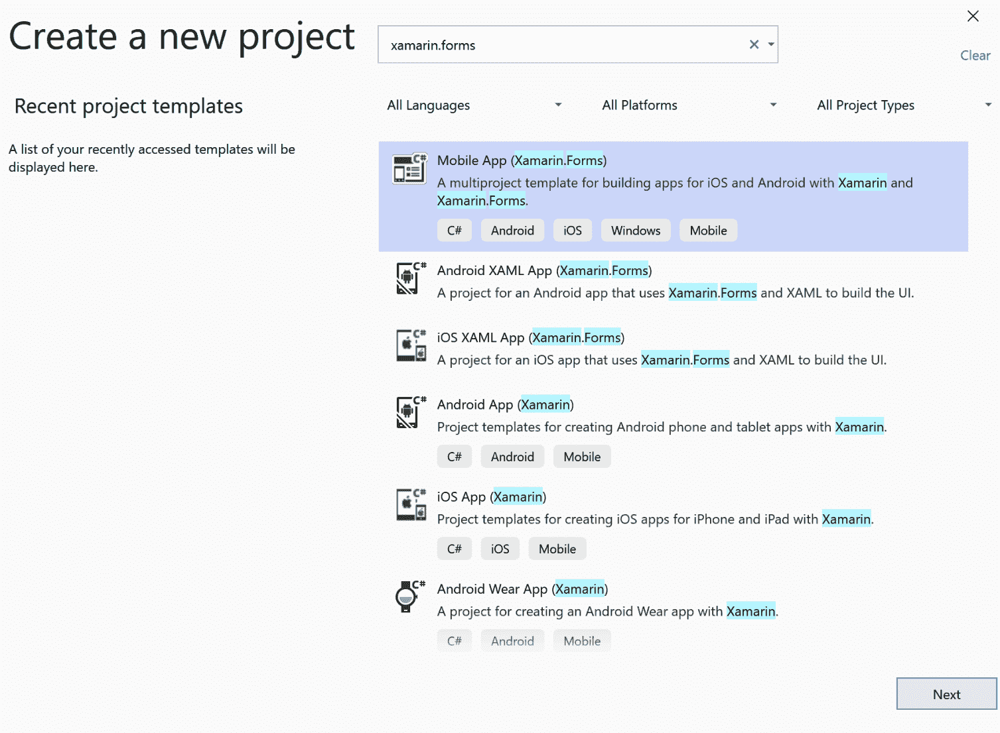
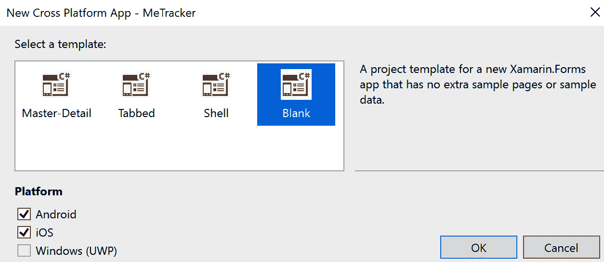
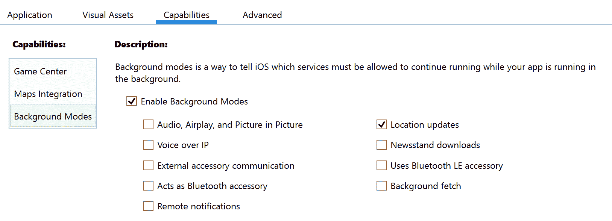

Building a Location Tracking App Using GPS and Maps

在本章中，我们将创建一个位置跟踪应用，用于保存用户的位置并将其显示为热图。我们将学习如何在 iOS 和 Android 设备上在后台运行任务，以及如何使用自定义渲染器来扩展 Xamarin.Forms 映射的功能。

本章将介绍以下主题：

*   在 iOS 设备上跟踪用户在后台的位置
*   在 Android 设备上跟踪用户在后台的位置
*   如何在 Xamarin.Forms 应用中显示地图
*   如何使用自定义渲染器扩展 Xamarin.Forms 映射的功能

让我们开始吧！

# 技术要求

要完成此项目，您需要安装 Visual Studio for Mac 或 PC 以及 Xamarin 组件。请参见[第 1 章](06.html)、*Xamarin 简介*，了解有关如何设置您的环境的更多详细信息。要使用 Visual Studio for PC 构建 iOS 应用，必须连接 Mac。如果你根本无法访问 Mac，你可以完成这个项目的 Android 部分。

# 项目概述

通过添加地图和位置服务，许多应用可以变得更加丰富。在这个项目中，我们将建立一个位置跟踪应用，我们将称之为**MeTracker**。该应用将跟踪用户的位置并将其保存到 SQLite 数据库中，以便我们能够以热图的形式可视化结果。为了构建这个应用，我们将学习如何在 iOS 和 Android 上设置后台进程，因为我们无法在 iOS 和 Android 之间共享代码。对于 map，我们将使用`Xamarin.Forms.Maps`组件并扩展其功能以构建热图。为此，我们将为 iOS 使用一个自定义渲染器，为 Android 使用一个自定义渲染器，以便使用平台的 API。

此项目的估计生成时间为 180 分钟。

# 构建 MeTracker 应用

是时候开始构建应用了。使用**移动应用（Xamarin.Forms）**模板。查找此模板的最简单方法是在启动 Visual Studio 时出现的对话框顶部的搜索栏中搜索`xamarin.forms`：



我们将项目命名为**MeTracker**：


我们将使用**空白**模板，为**Android**和**iOS**平台构建：



确保您正在使用 Android 版本 Oreo（API 级别 26）或更高版本进行编译。我们可以在项目的属性中，在应用**选项卡下进行设置。**

 **更新模板添加的 NuGet 软件包，以确保我们使用的是最新版本。

## 创建存储库以保存用户的位置

我们要做的第一件事是创建一个可用于保存用户位置的存储库。

### 为位置数据创建模型

在创建存储库之前，我们将创建一个表示用户位置的模型类。请按照以下步骤执行此操作：

1.  创建一个名为`Models`的新文件夹，我们可以将其用于此模型和其他模型。
2.  在`Models`文件夹中创建一个名为`Location`的类，并为`Id`、`Latitude`和`Longitude`添加属性。
3.  创建两个构造函数——一个为空，另一个以`latitude`和`longitude`为参数。请使用以下代码执行此操作：

```cs
using System;

namespace MeTracker.Models
{
    public class Location
    {
        public Location() {}

        public Location(double latitude, double longitude)
        {
            Latitude = latitude;
            Longitude = longitude;
        }

        public int Id { get; set; }
        public double Latitude { get; set; }
        public double Longitude { get; set; }
    }
}
```

### 创建存储库

现在我们已经创建了一个模型，可以开始创建存储库了。首先，我们将为存储库创建一个接口。请按照以下步骤执行此操作：

1.  在`MeTracker`项目中，创建一个名为`Repositories`的新文件夹。
2.  在我们的新文件夹中，创建一个名为`ILocationRepository`的接口。
3.  在我们为`interface`创建的新文件中编写以下代码：

```cs
using MeTracker.Models;
using System;
using System.Threading.Tasks;

namespace MeTracker.Repositories
{
    public interface ILocationRepository
    {
        Task Save(Location location);
    }
}
```

4.  为`MeTracker.Models`和`System.Threading.Tasks`添加`using`指令，以解析`Location`和`Task`的引用。

现在我们有了一个`interface`，我们需要创建它的一个实现。请按照以下步骤执行此操作：

1.  在`MeTracker`项目中，创建一个名为`LocationRepository`的新类。
2.  实现`ILocationRepository`接口，使用以下代码将`async`关键字添加到`Save`**方法中：**

```cs
using System;
using System.Threading.Tasks;
using MeTracker.Models;

namespace MeTracker.Repositories
{
    public class LocationRepository : ILocationRepository 
    {
        public async Task Save(Location location)
        {
        }
    }
}
```

为了存储数据，我们将使用 SQLite 数据库和名为 SQLite net 的**对象关系映射器**（**ORM**），这样我们就可以针对域模型编写代码，而不是使用 SQL 对数据库执行操作。这是一个由 Frank A.Krueger 创建的开源库。让我们通过以下步骤进行设置：

1.  为`MeTracker`项目安装 NuGet 软件包`sqlite-net-pcl`。
2.  转到`Location`模型类，将`PrimaryKeyAttribute`和`AutoIncrementAttribute`属性添加到`Id`属性中。当我们添加这些属性时，`Id`属性将成为数据库中的主键，并自动为其创建一个值。
3.  在`LocationRepository`类中编写以下代码，以创建到 SQLite 数据库的连接。`if`语句用于检查我们是否已经创建了连接。如果我们有，我们不会创造一个新的；相反，我们将使用我们已经创建的连接：

```cs
private SQLiteAsyncConnection connection;

private async Task CreateConnection()
{
    if (connection != null)
    {
        return;
    }

   var databasePath = 
   Path.Combine(Environment.GetFolderPath
   (Environment.SpecialFolder .MyDocuments), "Locations.db");

 connection = new SQLiteAsyncConnection(databasePath);
 await connection.CreateTableAsync<Location>();
} 
```

现在，是时候实现`Save`方法了，该方法将位置对象作为参数存储在数据库中。

我们现在将使用`Save`方法中的`CreateConnection`**方法，以确保在尝试将数据保存到数据库时创建连接。当我们知道我们有一个活动连接时，我们可以使用`InsertAsync`方法并将`Save`方法的`location`参数作为参数传递。**

 **编辑`LocationRepository`类中的`Save`方法，如下所示：

```cs
public async Task Save(Location location)
{
    await CreateConnection();
    await connection.InsertAsync(location);
}
```

## 沙马林精华

**Xamarin.Essentials**是一个由微软和 Xamarin 创建的库，开发人员可以从共享代码中使用特定于平台的 API。Essentials 的目标是 Xamarin.iOS、Xamarin.Android 和 UWP。在这个项目中，我们将使用 Xamarin.Essentials 完成各种任务，包括获取位置和在主线程上执行代码。

## 创建位置跟踪服务

为了跟踪用户的位置，我们需要根据平台编写代码。Essentials 提供了在共享代码中获取用户位置的方法，但不能在后台使用。为了能够使用我们将为每个平台编写的代码，我们需要创建一个接口。对于`ILocationRepository`接口，两个平台将只使用一个实现，而对于位置跟踪服务，我们将有一个 iOS 平台和一个 Android 平台的实现。

通过以下步骤创建`ILocationRepository`界面：

1.  在`MeTracker`项目中，创建一个名为`Services`的新文件夹。
2.  在`Services`文件夹中创建一个名为`ILocationTrackingService`的新接口。
3.  在界面中增加一个名为`StartTracking`的方法，如下代码所示：

```cs
 public interface ILocationTrackingService
 {
      void StartTracking();
 } 
```

目前，我们将通过以下步骤在 iOS 和 Android 项目中创建一个空的接口实现。我们将在本章后面的部分中回到每个实现：

1.  在 iOS 和 Android 项目中创建一个名为`Services`的文件夹。
2.  在 iOS 和 Android 项目的新`Service`文件夹中，在名为`LocationTrackingService`的类中创建一个空实现，如下所示：

```cs
public class LocationTrackingService : ILocationTrackingService
{
     public void StartTracking()
     {
     }
}
```

## 设置应用逻辑

现在我们已经创建了接口，我们需要跟踪用户的位置并将其保存在设备上的本地位置。是时候写一些代码了，这样我们就可以开始跟踪用户了。我们仍然没有任何代码能够真正跟踪用户的位置，但是如果我们已经编写了启动跟踪过程的代码，那么编写这个代码就更容易了。

### 使用地图创建视图

首先，我们将创建一个以用户位置为中心的简单地图视图。让我们通过以下步骤进行设置：

1.  在`MeTracker`项目中，创建一个名为`Views`的新文件夹。
2.  在`Views`文件夹中，创建一个基于 XAML 的`ContentPage`并命名为`MainView`：


Xamarin.Forms 包没有地图控件，但有一个来自 Microsoft 和 Xamarin 的官方包，可用于在 Xamarin.Forms 应用中显示地图。此包名为`Xamarin.Forms.Maps`，我们可以通过以下步骤从 NuGet 安装：

1.  在`MeTracker`、`MeTracker.Android`和`MeTracker.iOS`项目中安装`Xamarin.Forms.Maps`。
2.  使用以下代码将`Xamarin.Forms.Maps`的命名空间添加到`MainView`：

```cs
 <ContentPage  
              xmlns:x="http://schemas.microsoft.com/winfx/2009/xaml" 
              xmlns:map="clr- 
              namespace:Xamarin.Forms.Maps;assembly
              =Xamarin.Forms.Maps"
              x:Class="MeTracker.Views.MainView"> 
```

现在，我们可以在视图中使用地图。因为我们希望`Map`覆盖整个页面，所以可以将其添加到`ContentPage`的根目录中。让我们通过以下步骤进行设置：

1.  将`Map`添加到`ContentPage`中。
2.  为映射指定一个名称，以便我们可以从代码隐藏文件访问它。将其命名为`Map`，如下代码所示：

```cs
<ContentPage  
              xmlns:x="http://schemas.microsoft.com/winfx/2009/xaml" 
              xmlns:map="clr-namespace:Xamarin.Forms.Maps;assembly=Xamarin.Forms.Maps"
              x:Class="MeTracker.Views.MainView"> 
 <map:Map x:Name="Map" /> 
</ContentPage>
```

要使用`map`控件，我们需要在每个平台上运行代码来初始化它。请按照以下步骤执行此操作：

1.  在 iOS 项目中，转到`AppDelegate.cs`。
2.  在`FinishedLaunching`方法中，在`Xamarin.Forms`的`Init`部分后，添加`global::Xamarin.FormsMaps.Init()`初始化 iOS app 的`map`控件，代码如下：

```cs
public override bool FinishedLaunching(UIApplication app, NSDictionary options)
{
     global::Xamarin.Forms.Forms.Init();
     global::Xamarin.FormsMaps.Init();

     LoadApplication(new App());

     return base.FinishedLaunching(app, options);
} 
```

对 Android 执行相同的初始化：

1.  在 Android 项目中，转到`MainActivity.cs`。
2.  在`OnCreate`方法中，在`Xamarin.Forms`的`Init`部分后，添加`global::Xamarin.FormsMaps.Init(this, savedInstanceState)`**对安卓`map`控件进行初始化。**

 **3.  使用`Xamarin.Essentials.Platform.Init(this, savedInstanceState)`初始化 Xamarin.Essentials，如下代码所示：

```cs
protected override void OnCreate(Bundle savedInstanceState)
{
    TabLayoutResource = Resource.Layout.Tabbar;
    ToolbarResource = Resource.Layout.Toolbar;

     base.OnCreate(savedInstanceState);
     global::Xamarin.Forms.Forms.Init(this, savedInstanceState);
     global::Xamarin.FormsMaps.Init(this, savedInstanceState);

     Xamarin.Essentials.Platform.Init(this, savedInstanceState); 

     LoadApplication(new App());
} 
```

对于 Android，我们还需要决定当用户响应了权限请求对话框并将结果发送到 Xamarin.Essentials 时会发生什么。我们将在`MainActivity.cs`中添加以下代码：

```cs
public override void OnRequestPermissionsResult(int requestCode,                     
                 string[] permissions, 
                 [GeneratedEnum] Android.Content.PM.Permission[]          
                 grantResults)
{     Xamarin.Essentials.Platform.OnRequestPermissionsResult(requestCode,   
                 permissions, grantResults);
                 base.OnRequestPermissionsResult(requestCode,   
                 permissions, grantResults);
}
```

对于 Android，我们需要一个用于谷歌地图的**API 键**才能让地图正常工作。有关如何获取 API 密钥的 Microsoft 文档可在[中找到 https://docs.microsoft.com/en-us/xamarin/android/platform/maps-and-location/maps/obtaining-a-google-maps-api-key](https://docs.microsoft.com/en-us/xamarin/android/platform/maps-and-location/maps/obtaining-a-google-maps-api-key) 。下面是获取 API 密钥的方法：

1.  打开安卓项目中`Properties`文件夹中的`AndroidMainfest.xml`。
2.  插入元数据元素作为应用元素的子元素，如以下代码所示：

```cs
<application android:label="MeTracker.Android">
     <meta-data android:name="com.google.android.maps.v2.API_KEY" 
     android:value="{YourKeyHere}" />
</application> 
```

我们还希望地图以用户的位置为中心。我们将在`MainView.xaml.cs`的构造函数中执行此操作。因为我们希望异步获取用户的位置，并且这需要在主线程上执行，所以我们将把它包装在`MainThread.BeginInvokeOnMainThread`中。要获取用户的当前位置，我们将使用 Xamarin.Essentials。当我们有位置时，我们可以使用`Map`的`MoveToRegion`方法。我们可以通过以下步骤进行设置：

1.  在`MeTracker`项目中，打开`MainView.xaml.cs`。
2.  将以下代码段中粗体显示的代码添加到`MainView.xaml.cs`类的构造函数中：

```cs
public MainView ()
{
    InitializeComponent ();

MainThread.BeginInvokeOnMainThread(async() =>
 {
        var location = await Geolocation.GetLastKnownLocationAsync();

        if(location == null)        {
 location = await Geolocation.GetLocationAsync();        }

 Map.MoveToRegion(MapSpan.FromCenterAndRadius(
 new Position(location.Latitude, location.Longitude), 
 Distance.FromKilometers(5)));
 });
}
```

### 创建视图模型

在创建实际的`ViewModel`之前，我们将创建一个抽象的基本视图模型，所有视图模型都可以从中继承。这个基本视图模型背后的想法是，我们可以在其中编写通用代码。在这种情况下，我们将通过以下步骤实现`INotifyPropertyChanged`接口：

1.  在`MeTracker`项目中创建一个名为`ViewModels`的文件夹。
2.  创建一个名为`ViewModel`的新类。
3.  编写以下代码并解析所有引用：

```cs
public abstract class ViewModel : INotifyPropertyChanged
{
    public event PropertyChangedEventHandler PropertyChanged;

    public void RaisePropertyChanged(params string[] propertyNames)
    {
        foreach(var propertyName in propertyNames)
        {
            PropertyChanged?.Invoke(this, new  
            PropertyChangedEventArgs(propertyName));
        }
    }
} 
```

下一步是创建实际视图模型，该模型将使用`ViewModel`作为基类。让我们通过以下步骤进行设置：

1.  在`MeTracker`项目中，在`ViewModels`文件夹中创建一个名为`MainViewModel`的新类。
2.  使`MainViewModel`继承`ViewModel`。
3.  添加一个`ILocationTrackingService`类型的只读字段，并将其命名为`locationTrackingService`。
4.  添加一个`ILocationRepository`类型的只读字段，并将其命名为`locationRepository`。
5.  创建一个以`ILocationTrackingService`和`ILocationRepository`为参数的构造函数。
6.  用参数值设置我们在*步骤**3*和*4*中创建的字段值，如下代码所示：

```cs
public class MainViewModel : ViewModel
{
         private readonly ILocationRepository locationRepository;
         private readonly ILocationTrackingService 
         locationTrackingService;

         public MainViewModel(ILocationTrackingService 
         locationTrackingService,
         ILocationRepository locationRepository)
         {
             this.locationTrackingService = 
             locationTrackingTrackingService;
             this.locationRepository = locationRepository;
         } 
}
```

要使 iOS 应用开始跟踪用户的位置，我们需要在主线程上运行启动跟踪过程的代码。遵循以下步骤：

1.  在新创建的`MainViewModel`的构造函数中，使用 Xamarin.Essentials 中的`MainThread.BeginInvokeOnMainThread`添加对主线程的调用。

Forms 有一个 helper 方法来调用主线程上的代码，但是如果我们使用 Xamarin.Essentials 中的方法，我们可以拥有一个视图模型，而不依赖于 Xamarin.Forms。如果我们对 ViewModels 中的 Xamarin.Forms 没有任何依赖关系，那么如果我们希望将来添加其他平台，我们可以在不使用 Xamarin.Forms 的应用中重用它们。

2.  在传递给`BeginInvokeOnMainThread`方法的动作中调用`locationService.StartTracking`。这显示在以下代码中，以粗体标记：

```cs
public MainViewModel(ILocationTrackingService 
                     locationTrackingService, 
                     ILocationRepository locationRepository)
{
    this.locationTrackingService = locationTrackingTrackingService;
    this.locationRepository = locationRepository;

 MainThread.BeginInvokeOnMainThread(async() =>
 {
 locationTrackingService.StartTracking();
 });
}

```

最后，我们需要将一个`MainViewModel`注入`MainView`的构造函数中，并将`MainViewModel`实例分配给视图的绑定上下文。这将允许处理我们所做的数据绑定，并且`MainViewModel`的属性将绑定到用户界面中的控件。遵循以下步骤：

1.  在`MeTracker`项目中，找到`Views/MainView.xaml.cs`文件的建造商。
2.  添加`MainViewModel`作为构造函数的参数，调用`viewModel`。
3.  将`BindingContext`**设置为`MainViewModel`的实例，如下代码所示：**

```cs
public MainView(MainViewModel viewModel)
{
    InitializeComponent();

 BindingContext = viewModel; 

    MainThread.BeginInvokeOnMainThread(async () =>
    {
 var location = await Geolocation.GetLastKnownLocationAsync();

        if(location == null)        {
 location = await Geolocation.GetLocationAsync();        }

        Map.MoveToRegion(MapSpan.FromCenterAndRadius(
           new Position(location.Latitude, location.Longitude), 
           Distance.FromKilometers(5))); });
}
```

### 创建冲突解决程序

我们将在这个项目中使用依赖注入。我们将使用一个名为 Autofac 的库来实现这一点。**Autofac 是一个开源的**控制反转**（**IoC**容器。我们将创建一个`Resolver`类，以便轻松解析将在本章后面添加到容器中的类型。要执行此操作，请执行以下步骤：**

 **1.  在`MeTracker`、`MeTracker.Android`和`MeTracker.iOS`项目中安装 NuGet 的 Autofac。
2.  在`MeTracker`项目中，在项目的根目录中创建一个名为`Resolver`的新类。
3.  创建一个名为`container`的`private static IContainer`字段。
4.  创建一个名为`Initialized`的`static`方法，该方法有一个`IContainer`参数。设置`container`字段的值，如下所示：

```cs
using Autofac;
using System;
using System.Collections.Generic;
using System.Text;

namespace MeTracker
{
    public class Resolver
    {
        private static IContainer container;

        public static void Initialize(IContainer container)
        {
            Resolver.container = container;
        }
    }
}
```

`Initialize`方法将在 Autofac 配置完成后调用，我们将在创建引导程序时执行此操作。这个方法只是将它得到的`container`字段作为参数存储在`static`容器字段中。

现在，我们需要一个方法来访问它。再创建一个名为`Resolve`的`static`方法。这个方法是泛型的，当我们使用它时，我们将把它的类型指定为要解析的类型。使用`container`字段解析类型，如下代码所示：

```cs
public static T Resolve<T>()
{
     return container.Resolve<T>();
} 
```

`Resolve<T>`方法将类型作为参数，并查看容器中是否有关于如何构造此类型的信息。如果有，我们就退回。

因此，现在我们有了一个`Resolver`，我们将使用它来解析对象类型的实例，我们需要配置它。这是引导者的工作。

### 创建引导程序

要配置依赖注入并初始化`Resolver`，我们需要创建一个引导程序。我们将为每个平台提供一个共享引导程序，以及满足其特定配置的其他引导程序。我们之所以需要它们特定于平台，是因为我们将在 iOS 和 Android 上实现不同的`ILocationTrackingService`。要创建引导程序，请执行以下操作：

1.  在`MeTracker`项目中创建一个名为`Bootstrapper`的新类。
2.  在新类中编写以下代码：

```cs
using Autofac;
using MeTracker.Repositories;
using MeTracker.ViewModels;
using System;
using System.Collections.Generic;
using System.Linq;
using System.Reflection;
using System.Text;
using Xamarin.Forms;

namespace MeTracker
{
    public class Bootstrapper
    {
        protected ContainerBuilder ContainerBuilder { get; private 
        set; }

        public Bootstrapper()
        {
            Initialize();
            FinishInitialization();
        }

        protected virtual void Initialize()
        {
            ContainerBuilder = new ContainerBuilder();

            var currentAssembly = Assembly.GetExecutingAssembly();

            foreach (var type in currentAssembly.DefinedTypes.
                     Where(e => e.IsSubclassOf(typeof(Page))))
            {
                ContainerBuilder.RegisterType(type.AsType());
            }

            foreach (var type in currentAssembly.DefinedTypes.
                     Where(e => e.IsSubclassOf(typeof(ViewModel))))
            {
                ContainerBuilder.RegisterType(type.AsType());
            }

            ContainerBuilder.RegisterType<LocationRepository>
            ().As<ILocationRepository>();
        }

        private void FinishInitialization()
        {
            var container = ContainerBuilder.Build();
            Resolver.Initialize(container);
        }
    }
}
```

#### 创建 iOS 引导程序

在 iOS 引导程序中，我们将拥有特定于 iOS 应用的配置。要创建 iOS 应用，请执行以下步骤：

1.  在 iOS 项目中，创建一个名为`Bootstrapper`的新类。
2.  使新类从`MeTracker.Bootstrapper`继承。
3.  编写以下代码：

```cs
using Autofac;
using MeTracker.iOS.Services;
using MeTracker.Services;

namespace MeTracker.iOS
{
    public class Bootstrapper : MeTracker.Bootstrapper
    {
        public static void Execute()
        {
            var instance = new Bootstrapper();
        }

        protected override void Initialize()
        {
            base.Initialize();

            ContainerBuilder.RegisterType<LocationTrackingService>()
            .As<ILocationTrackingService>().SingleInstance();
        }
    }
}
```

4.  转到 iOS 项目中的`AppDelegate.cs`。
5.  在调用`LoadApplication`之前，在`FinishedLaunching`方法中，调用平台特定引导程序的`Init`方法，如下代码所示：

```cs
public override bool FinishedLaunching(UIApplication app, NSDictionary options)
{
      global::Xamarin.Forms.Forms.Init();
      global::Xamarin.FormsMaps.Init();
      Bootstrapper.Init();

      LoadApplication(new App());

      return base.FinishedLaunching(app, options);
} 
```

#### 创建 Android 引导程序

在 Android 引导程序中，我们将有特定于 Android 应用的配置。要在 Android 中创建引导程序，请执行以下步骤：

1.  在 Android 项目中，创建一个名为`Bootstrapper`的新类。
2.  使新类从`MeTracker.Bootstrapper`继承。
3.  编写以下代码：

```cs
using Autofac;
using MeTracker.Droid.Services;
using MeTracker.Services;

namespace MeTracker.Droid
{ 
    public class Bootstrapper : MeTracker.Bootstrapper
    {
         public static void Init()
         {
             var instance = new Bootstrapper();
         }

         protected override void Initialize()
         {
             base.Initialize();

             ContainerBuilder.RegisterType<LocationTrackingService()
             .As<ILocationTrackingService>().SingleInstance();
         }
    }
} 
```

4.  转到 Android 项目中的`MainActivity.cs`文件。
5.  在调用`LoadApplication`之前，在`OnCreate`方法中，调用平台特定引导程序的`Init`方法，如下代码所示：

```cs
protected override void OnCreate(Bundle savedInstanceState)
{
     TabLayoutResource = Resource.Layout.Tabbar;
     ToolbarResource = Resource.Layout.Toolbar;

     base.OnCreate(savedInstanceState);
     Xamarin.Essentials.Platform.Init(this, savedInstanceState);

     global::Xamarin.Forms.Forms.Init(this, savedInstanceState);
     global::Xamarin.FormsMaps.Init(this, savedInstanceState);

 Bootstrapper.Init();

     LoadApplication(new App());
} 
```

### 设置主页面

第一次启动应用之前的最后一步是在`App.xaml.cs`文件中设置`MainPage`属性。但首先，我们将删除启动项目时创建的`MainPage.xaml`和`MainPage.xaml.cs`文件，因为我们不会在这里使用它们：

1.  删除`MeTracker`项目中的`MainPage.xaml`和`MainPage.xaml.cs`文件，因为我们将把`MainView`设置为用户看到的第一个视图。
2.  使用`Resolver`创建`MainView`的实例。
3.  将构造函数中的`MainPage`设置为`MainView`实例，如下代码所示：

```cs
public App()
{
     InitializeComponent();
     MainPage = Resolver.Resolve<MainView>();
} 
```

解析程序使用 Autofac 计算出创建`MainView`实例所需的所有依赖项。它查看了`MainView`的构造函数，并决定它需要一个`MainViewModel`。如果`MainViewModel`有更多的依赖项，那么流程将遍历所有这些依赖项并构建我们需要的所有实例。

现在，我们将能够运行该应用。它将向我们显示一张以用户当前位置为中心的地图。让我们添加一些代码，这样我们就可以使用后台位置跟踪来跟踪用户的位置。

## iOS 上的背景位置跟踪

我们需要为每个平台编写位置跟踪代码。对于 iOS，我们将使用来自`CoreLocation`名称空间的`CLLocationManager`。

### 在后台启用位置更新

当我们想要在 iOS 应用的后台执行任务时，我们需要在`info.plist`文件中声明我们想要做什么。以下步骤显示了我们如何进行此操作：

1.  在`MeTracker.iOS`项目中，打开`info.plist`。
2.  转到“功能”选项卡。
3.  选择启用背景模式和位置更新，如以下屏幕截图所示：



如果我们用 XML 编辑器打开`info.plist`文件，也可以直接在该文件中启用后台模式。在本例中，我们将添加以下 XML：

```cs
<key>UIBackgroundModes</key>
<array>
     <string>location</string>
</array>
```

### 正在获取使用用户位置的权限

在请求权限以便使用用户的位置之前，我们需要添加一个描述，说明我们将使用该位置的目的。自从 iOS 11 发布以来，我们不再被允许只要求允许随时跟踪用户的位置；用户在使用应用时，必须能够向我们授予仅跟踪其位置的权限。我们可以在`info.plist`文件中添加如下描述：

1.  使用可在`MeTracker.iOS`项目中找到的 XML（文本）编辑器打开`info.plist`。
2.  添加`NSLocationWhenInUseUsageDescription`键以及说明。
3.  添加`NSLocationAlwaysAndWhenInUsageDescription`键及说明，如下代码所示：

```cs
<key>NSLocationWhenInUseUsageDescription</key>
<string>We will use your location to track you</string>
<key>NSLocationAlwaysAndWhenInUseUsageDescription</key>
<string>We will use your location to track you</string>
```

### 订阅位置更新

现在我们已经为位置跟踪准备了`info.plist`文件，现在是时候编写跟踪用户位置的实际代码了。如果我们不将`CLLocationManager`设置为不暂停位置更新，则当位置数据不太可能更改时，iOS 可以自动暂停位置更新。在这个应用中，我们不希望发生这种情况，因为我们希望多次保存位置，以便确定用户是否经常访问特定位置。让我们设置一下：

1.  在`MeTracker.iOS`项目中，打开`LocationTrackingService`。
2.  为`CLLocationManager`添加一个私有字段。
3.  在`StartTracking`方法中创建`CLLocationMananger`的实例。
4.  将`PausesLocationUpdatesAutomatically`设置为`false`。
5.  将`AllowBackgroundLocationUpdates`设置为`true`**（如下代码所示）**，这样即使应用在后台运行，位置更新也会继续：****

```cs
public void StartTracking()
{
    locationManager = new CLLocationManager
 {
 PausesLocationUpdatesAutomatically = false,
 AllowsBackgroundLocationUpdates = true }; // Add code here
}

```

下一步是请求用户允许跟踪他们的位置。我们将请求获得跟踪其位置的权限，但用户可以选择仅在使用应用时授予我们跟踪其位置的权限。因为用户还可以选择拒绝我们跟踪其位置的权限，所以我们需要在开始之前检查这一点。让我们设置一下：

1.  通过将`AuthorizationChanged`事件连接到`locationManager`为授权更改时添加事件侦听器。
2.  在事件侦听器中，创建一个`if`语句来检查用户是否允许我们跟踪他们的位置。
3.  调用我们最近在`CLLocationManager`中创建的实例的`RequestAlwaysAuthorization`方法。
4.  代码应放在`// Add code here`注释下，如下代码中以粗体显示：

```cs
public void StartTracking()
{
    locationManager = new CLLocationManager
    {
        PausesLocationUpdatesAutomatically = false,
        AllowsBackgroundLocationUpdates = true
    };

    // Add code here
 locationManager.AuthorizationChanged += (s, args) =>
 { 
 if (args.Status == CLAuthorizationStatus.Authorized)
 {
            // Next section of code goes here
 }
 };

    locationManager.RequestAlwaysAuthorization();
}
```

在开始跟踪用户的位置之前，我们需要设置希望从`CLLocationManager`接收的数据的准确性。我们还将添加一个事件处理程序来处理位置更新。让我们设置一下：

1.  将`DesiredAccuracy`设置为`CLLocation.AccurracyBestForNavigation`。在后台运行应用时的一个限制是`DesiredAccuracy`需要设置为`AccurracyBest`或`AccurracyBestForNavigation`。
2.  为`LocationsUpdated`添加事件处理程序，然后调用`StartUpdatingLocation`方法。
3.  代码应该放在`// Next section goes here`注释之后。它应该类似于以下代码段中以粗体显示的代码：

```cs
 locationManager.AuthorizationChanged += (s, args) =>
    {
        if (args.Status == CLAuthorizationStatus.Authorized)
        {
            // Next section of code goes here
 locationManager.DesiredAccuracy = 
            CLLocation.AccurracyBestForNavigation;
            locationManager.LocationsUpdated += 
            async (object sender, CLLocationsUpdatedEventArgs e) =>
                {
                    // Final block of code goes here
                };

            locationManager.StartUpdatingLocation();
        }
    };

```

The higher the accuracy is, the higher the battery consumption. If we only want to track where the user has been and not how popular a place is, we could also set `AllowDeferredLocationUpdatesUntil`. This way, we can specify that the user has to move a specific distance before the location is updated. We can also specify how often we want location to be updated using the `timeout` argument. The most power-efficient solution to track how long a user has been at a place is to use the `StartMonitoringVisits` method of `CLLocationManager`.

现在，是处理`LocationsUpdated`事件的时候了。让我们完成以下步骤：

1.  添加一个名为`locationRepository`的私有字段，该字段属于`ILocationRepository`类型。
2.  添加一个以`ILocationRepository`为参数的构造函数。将参数值设置为`locationRepository`字段。
3.  阅读`CLLocationsUpdatedEventArgs`的`Locations`属性的最新位置。
4.  创建一个`MeTracker.Models.Location`实例，并将最新位置的纬度和经度传递给它。
5.  使用`ILocationRepository`的`Save`方法保存位置。
6.  代码应该放在`// Final block of code goes here`注释之后。它应该类似于以下片段中以粗体显示的代码：

```cs
locationManager.LocationsUpdated += 
    async (object sender, CLLocationsUpdatedEventArgs e) =>
    {
 var lastLocation = e.Locations.Last();
 var newLocation = new 
        Models.Location(lastLocation.Coordinate.Latitude,

        lastLocation.Coordinate.Longitude);

 await locationRepository.Save(newLocation);
    };

```

至此，我们完成了 iOS 应用的跟踪部分。现在，我们将为 Android 实现背景跟踪。之后，我们将可视化数据。

## 基于 Android 的背景位置跟踪

Android 进行后台更新的方式与我们在 iOS 上实现的方式非常不同。使用 Android，我们需要创建一个`JobService`并安排它。

### 添加使用用户位置所需的权限

要使用 Android 在后台跟踪用户的位置，我们需要请求五个权限，如下表所示：

| `ACCESS_COARSE_LOCATION` | 以获取用户的大致位置。 |
| `ACCESS_FINE_LOCATION` | 以获取用户的精确位置。 |
| `ACCESS_NETWORK_STATE` | 我们需要这样做，因为 Android 中的位置服务使用来自网络的信息来确定用户的位置。 |
| `ACCESS_WIFI_STATE` | 我们需要这个，因为 Android 中的定位服务使用来自 Wi-Fi 网络的信息来确定用户的位置。 |
| `RECEIVE_BOOT_COMPLETED` | 以便在设备重新启动后可以再次启动后台作业。 |

可以通过`MeTracker.Android`项目属性中的 Android 清单选项卡或`Properties`文件夹中的`AndroidManifest.xml`文件设置权限。当从 Android Manifest 选项卡进行更改时，这些更改也将写入`AndroidMainfest.xml`文件，因此选择哪种方法无关紧要。

以下屏幕截图显示了如何在`MeTracker.Android`项目属性中的 Android 清单选项卡中设置所需权限：


`uses-permission`元素应该添加到`AndroidManifest.xml`**文件中的`manifest`元素中，如下代码所示：**

```cs
<uses-permission android:name="android.permission.ACCESS_FINE_LOCATION" />
<uses-permission android:name="android.permission.ACCESS_COARSE_LOCATION" />
<uses-permission android:name="android.permission.RECEIVE_BOOT_COMPLETED" />
<uses-permission android:name="android.permission.ACCESS_NETWORK_STATE" />
<uses-permission android:name="android.permission.ACCESS_WIFI_STATE" /> 
```

### 创建后台作业

为了跟踪用户在后台的位置，我们需要创建一个后台作业。遵循以下步骤：

1.  在 Android 项目中，在`Services`文件夹中创建一个名为`LocationJobService`的新类。
2.  创建类`public`并添加`Android.App.Job.JobService`作为基类。
3.  实现`OnStartJob`和`OnStopJob`抽象方法，如下代码所示：

```cs
public class LocationJobService : JobService
{ 
     public override bool OnStopJob(JobParameters @params)
     {
         return true;
     }

     public override bool OnStartJob(JobParameters @params)
     {
         return true;
     } 
}
```

Android 应用中的所有服务都需要添加到`AndroidManifest.xml`文件中。我们不必手动执行此操作；相反，我们可以向类添加一个属性，然后在`AndroidManifest.xml`文件中生成该属性。我们将使用`Name`和`Permission`属性设置所需信息，如下代码所示：

```cs
 [Service(Name = "MeTracker.Droid.Services.LocationJobService",
 Permission = "android.permission.BIND_JOB_SERVICE")]
          public class LocationJobService : JobService

```

### 安排后台作业

当我们创建了一个作业后，我们可以安排它。我们将在`MeTracker.Android`项目中从`LocationTrackingService`开始执行此操作。要配置作业，我们将使用`JobInfo.Builder`类。

我们将使用`SetPersisted`方法确保重新启动后作业再次启动。这就是我们之前添加`RECEIVE_BOOT_COMPLETED`许可的原因。

要安排作业，至少需要一个约束。在这种情况下，我们将使用`SetOverrideDeadline`。这将指定作业需要在指定时间（以毫秒为单位）过去之前运行。

`SetRequiresDeviceIdle`方法可用于确保作业仅在用户未使用设备时运行。如果我们想确保在用户使用设备时不会减慢设备的速度，我们可以将`true`传递给该方法。

`SetRequiresBatteryNotLow`方法可用于指定电池电量低时不应运行作业。如果在电池电量不足时没有充分的理由运行它，我们建议将其设置为`true`。这是因为我们不希望我们的应用耗尽用户的电池。

那么，让我们实现`LocationTrackingService`，它可以在`Services`文件夹中的 Android 项目中找到。请按照以下步骤执行此操作：

1.  基于我们将在`StartTracking`方法中指定的 ID（这里我们将使用`1`和组件名称（我们将从应用上下文和 Java 类创建）创建`JobInfo.Builder`。组件名称用于指定作业期间将运行的代码。
2.  使用`SetOverrideDeadline`方法并将`1000`传递给它，使作业在创建作业后 1 秒内运行。
3.  使用`SetPersisted`方法并通过`true`使作业持续，即使在设备重新启动后也是如此。
4.  使用`SetRequiresDeviceIdle`方法并通过`false`，作业将运行，即使用户正在使用设备。
5.  使用`SetRequiresBatteryLow`方法并通过`true`以确保我们不会耗尽用户的电池。此方法是在 Android API 级别 26 中添加的。
6.  `LocationTrackingService`的代码现在应该如下所示：

```cs
using Android.App;
using Android.App.Job;
using Android.Content;
using MeTracker.Services;

namespace MeTracker.Droid.Services
{
    public class LocationTrackingService : ILocationTrackingService
    { 
        var javaClass = 
        Java.Lang.Class.FromType(typeof(LocationJobService));
        var componentName = new ComponentName(Application.Context, 
        javaClass);
        var jobBuilder = new JobInfo.Builder(1, componentName);

        jobBuilder.SetOverrideDeadline(1000);
        jobBuilder.SetPersisted(true);
        jobBuilder.SetRequiresDeviceIdle(false);
        jobBuilder.SetRequiresBatteryNotLow(true);

        var jobInfo = jobBuilder.Build();
    }
}
```

`JobScheduler`服务是一种系统服务。要获取系统服务的实例，我们将使用应用上下文。请按照以下步骤执行此操作：

1.  使用`Application.Context`上的`GetSystemService`方法获得`JobScheduler`服务。
2.  将结果投射到`JobScheduler`。
3.  使用`JobScheduler`类上的`Schedule`方法，传递`JobInfo`对象调度作业，如下代码所示：

```cs
var jobScheduler =    
  (JobScheduler)Application.Context.GetSystemService
  (Context.JobSchedulerService);
  jobScheduler.Schedule(jobInfo); 
```

### 订阅位置更新

一旦我们安排了作业，我们就可以编写代码来指定作业应该做什么，即跟踪用户的位置。为此，我们将使用`LocationManager`，这是一个`SystemService`。使用`LocationManager`，我们可以请求单个位置更新，也可以订阅位置更新。在这种情况下，我们希望订阅位置更新。

我们将首先创建一个`ILocationRepository`接口的实例。我们将使用它将位置保存到 SQLite 数据库。让我们设置一下：

1.  为`LocationJobService`创建一个构造函数。
2.  为名为`locationRepository`的`ILocationRepository`接口创建一个私有只读字段。
3.  在构造函数中使用`Resolver`创建`ILocationRepository`实例，如下代码所示：

```cs
private ILocationRepository locationRepository;
public LocationJobService()
{
     locationRepository = Resolver.Resolve<ILocationRepository>();
}
```

在订阅位置更新之前，我们将添加一个侦听器。为此，我们将使用`Android.Locations.ILocationListener`**接口。遵循以下步骤：**

 **1.  将`Android.Locations.ILocationListener`接口
    添加到`LocationJobService`。
2.  实现接口。
3.  删除`throw new NotImplementedException();`的所有实例。如果让 VisualStudio 生成接口的实现，则会将其添加到方法中。
4.  在`OnLocationChanged`方法中，将`Android.Locations.Location`对象映射到`Model.Location`对象。
5.  在`LocationRepository`类上使用`Save`方法，如下代码所示：

```cs
public void OnLocationChanged(Android.Locations.Location location)
{
    var newLocation = new Models.Location(location.Latitude, 
    location.Longitude);
 locationRepository.Save(newLocation);
} 
```

现在我们已经创建了一个侦听器，可以订阅位置更新了。遵循以下步骤：

1.  创建一个`LocationManager`类型的静态字段。确保它与应用具有相同的生存期。
2.  进入`LocationJobService`中的`StartJob`方法。
3.  在`ApplicationContext`上使用`GetSystemService`获取`LocationManager`。
4.  要订阅位置更新，请使用`RequestLocationUpdates`方法，如下代码所示：

```cs
public override bool OnStartJob(JobParameters @params)
{      
     locationManager =  
     (LocationManager)ApplicationContext.GetSystemService
     (Context.LocationService);
 locationManager.RequestLocationUpdates
     (LocationManager.GpsProvider, 1000L, 0.1f, this);

     return true;
}
```

我们传递给`RequestLocationUpdates`**方法的第一个参数确保我们从 GPS 获取位置。第二种方法确保位置更新之间至少间隔`1000`毫秒。第三个参数确保用户必须移动至少`0.1`米才能获得位置更新。最后一个参数指定我们应该使用哪个侦听器。因为当前类实现了`Android.Locations.ILocationListener`接口，所以我们会通过`this`。**

 **## 创建热图

为了可视化我们收集的数据，我们将创建一个热图。我们将在地图上添加许多点，并根据用户在某个特定位置花费的时间，使它们具有不同的颜色。最受欢迎的地方会有暖色，而最不受欢迎的地方会有冷色。

### 将 GetAll 方法添加到 LocationRepository

为了使数据可视化，我们需要编写一些代码，以便可以从数据库中读取数据。让我们设置一下：

1.  在`MeTracker`项目中，打开`ILocationRepository.cs`文件。
2.  添加一个`GetAll`方法，使用以下代码返回`Location`对象列表：

```cs
 Task<List<Location>> GetAll() ;
```

3.  在`MeTracker`项目中，打开**`LocationRepository.cs`文件，实现`ILocationRepository`。**
***   执行新的`GetAll`方法，返回数据库中所有保存的位置，如下代码所示：**

```cs
public async Task<List<Location>> GetAll()
{
      await CreateConnection();

      var locations = await connection.Table<Location>
      ().ToListAsync();

      return locations;
}
```

### 为可视化准备数据

在我们能够在地图上可视化数据之前，我们需要准备数据。我们要做的第一件事是创建一个新模型，用于准备好的数据。让我们设置一下：

1.  在`MeTracker`项目的`Models`文件夹中，创建一个名为`Point`的新类。
2.  为`Location`、`Count`、`Heat`添加属性，如下代码所示：

```cs
namespace MeTracker.Models
{ 
    public class Point
    {
         public Location Location { get; set; }
         public int Count { get; set; } = 1;
         public Xamarin.Forms.Color Heat { get; set; }
    }
}
```

`MainViewModel`将存储我们稍后将找到的位置。让我们添加一个用于存储`Points`的属性：

1.  在`MeTracker`项目中，打开`MainViewModel`类。
2.  添加一个名为`points`的`private`字段，该字段为`List<Point>`类型。
3.  创建一个名为`Points`的属性，该属性属于`List<Point>`类型。
4.  在`get`方法中，返回`points`字段的值。
5.  在`set`方法中，将`points`字段设置为新值，并以属性名称作为参数调用`RaisePropertyChanged`。
6.  在`LoadData`方法的末尾，将`pointList`变量赋给`Points`属性，如下代码所示：

```cs
private List<Models.Point> points;
public List<Models.Point> Points
{
      get => points;
      set
      {
           points = value;
           RaisePropertyChanged(nameof(Points));
      }
}
```

现在我们已经有了点的存储空间，我们必须添加一些代码以便添加位置。我们将通过实现`MainViewModel`类的`LoadData`方法来实现这一点，并确保在位置跟踪开始后立即在主线程上调用它。

我们要做的第一件事是将保存的位置分组，以便将 200 米内的所有位置作为一个点处理。我们将跟踪记录该点位置的次数，以便确定该点在地图上的颜色。让我们设置一下：

1.  添加一个名为`LoadData`的`async`方法。这将返回一个`Task`到`MainViewModel`。
2.  在`ILocationTrackingService`上调用`StartTracking`方法后，从构造函数调用`LoadData`方法，如下代码所示：

```cs
public MainViewModel(ILocationTrackingService 
                     locationTrackingService, 
                     ILocationRepository locationRepository)
{
    this.locationTrackingService = locationTrackingService;
    this.locationRepository = locationRepository;

    MainThread.BeginInvokeOnMainThread(async() => 
    {
         locationTrackingService.StartTracking();
 await LoadData();
    });
}
```

`LoadData`方法的第一步是从 SQLite 数据库中读取所有跟踪的位置。当我们有了所有的位置，我们将循环通过它们并创建点。为了计算一个位置和一个点之间的距离，我们将使用`Xamarin.Essentials.Location`中的`CalculateDistance`方法，如下代码所示：

```cs
private async Task LoadData()
{ 
    var locations = await locationRepository.GetAll();
 var pointList = new List<Models.Point>();

 foreach (var location in locations)
 {
 //If no points exist, create a new one an continue to the next  
        location in the list
 if (!pointList.Any())
 {
 pointList.Add(new Models.Point() { Location = location });
 continue;
 }

 var pointFound = false;

 //try to find a point for the current location
 foreach (var point in pointList)
 {
 var distance =   
            Xamarin.Essentials.Location.CalculateDistance(
 new Xamarin.Essentials.Location(
            point.Location.Latitude, point.Location.Longitude),
 new Xamarin.Essentials.Location(location.Latitude,                             
            location.Longitude), DistanceUnits.Kilometers);

 if (distance < 0.2)
 {
 pointFound = true;
 point.Count++;
 break;
 }
 }

 //if no point is found, add a new Point to the list of points
 if (!pointFound)
 {
 pointList.Add(new Models.Point() { Location = location });
 }

        // Next section of code goes here
    }
} 
```

当我们有一个点列表时，我们可以计算每个点的热颜色。我们将使用颜色的**色调、s****饱和度和亮度**（**HSL**）表示，如下所述：

*   **色调**：**色调是色轮上从 0 到 360 的一个度，0 表示红色，240 表示蓝色。因为我们希望我们最受欢迎的地方是红色（热）而最不受欢迎的地方是蓝色（冷），所以我们将根据用户到达该点的次数，计算每个点的值在 0 到 240 之间。这意味着我们将只使用三分之二的比例。**
***   **饱和度**：**饱和度是一个百分比值：0%是灰色阴影，100%是全色。在我们的应用中，我们将始终使用 100%（这将在代码中表示为`1`。*****   **亮度**：亮度是光量的百分比值：0%为黑色，100%为白色。我们希望它是中性的，所以我们将使用 50%（这将在代码中表示为`0.5`。****

 ****我们需要做的第一件事是找出用户去过最受欢迎和最不受欢迎的地方的次数。让我们来看一看：

1.  首先，检查点列表是否为空。
2.  获取点列表中`Count`属性的`Min`和`Max`值。
3.  计算最小值和最大值之间的差值。
4.  需要在`LoadData`方法底部`// Next section of code goes here`注释后添加代码，如下代码所示：

```cs
private async Task LoadData()
{ 
    // The rest of the method has been commented out for brevity

    // Next section of code goes here
 if (pointList == null || !pointList.Any())
 {
 return;
 } 
 var pointMax = pointList.Select(x => x.Count).Max();
 var pointMin = pointList.Select(x => x.Count).Min();
 var diff = (float)(pointMax - pointMin);

    // Last section of code goes here
}
```

现在，我们可以计算每个点的热量，如下所示：

1.  循环通过所有点。
2.  以下代码应添加在`LoadData()`方法底部的`// Last section of code goes here`注释之后。这以粗体显示：

```cs
private async Task LoadData()
{ 
    // The rest of the method has been commented out for brevity

    // Next section of code goes here
  if (pointList == null || !pointList.Any())
    {
        return;
    }

    var pointMax = pointList.Select(x => x.Count).Max();
    var pointMin = pointList.Select(x => x.Count).Min();
    var diff = (float)(pointMax - pointMin);

 // Last section of code goes here
 foreach (var point in pointList)
 {
 var heat = (2f / 3f) - ((float)point.Count / diff);
 point.Heat = Color.FromHsla(heat, 1, 0.5);
 }

    Points = pointList;
}
```

这就是我们在`MeTracker`项目中设置位置跟踪所需要做的一切。现在，让我们把注意力转向可视化我们收到的数据。

### 创建自定义渲染器

**自定义渲染器**是扩展 Xamarin.Forms 的一种强大方式。正如我们在[第 1 章](06.html)、*Xamarin 简介*中提到的，Xamarin.Forms 是使用渲染器构建的，因此对于每个 Xamarin.Forms 控件，都有一个渲染器来创建本机控件。通过覆盖现有的呈现器或创建新的呈现器，我们可以扩展和自定义 Xamarin.Forms 控件呈现为本机控件的方式。我们还可以使用渲染器从头开始创建新的 Xamarin.Forms 控件。

渲染器是特定于平台的，因此当我们创建自定义渲染器时，我们必须为每个要更改或用于扩展控件行为的平台创建一个渲染器。为了使 Xamarin.Forms 的渲染器可见，我们将使用`ExportRenderer`assembly 属性。其中包含有关渲染器用于哪个控件以及将使用哪个渲染器的信息。

#### 为地图创建自定义控件

要在地图上显示热图，我们将创建一个新控件。我们将使用自定义渲染器来完成此操作。遵循以下步骤：

1.  在`MeTracker`项目中，创建一个名为`Controls`的新文件夹。
2.  创建一个名为`CustomMap`的新类。
3.  将`Xamarin.Forms.Maps.Map`作为基类添加到新类中，如下代码所示：

```cs
using System.Collections.Generic;
using Xamarin.Forms;
using Xamarin.Forms.Maps;

namespace MeTracker.Controls
{
    public class CustomMap : Map
    {
    }
}
```

如果我们想要将数据绑定到属性，我们需要创建一个`BindableProperty`。这应该是类中的`public static`字段。我们还需要创建一个*常规*属性。属性的命名非常重要。`BindableProperty`名称需为`{NameOfTheProperty}Property`；例如，我们将在以下步骤中创建的`BindableProperty`的名称将是`PointsProperty`，因为该属性的名称是`Points`。在`BindableProperty`类上使用静态`Create`方法创建`BindableProperty`。这至少需要四个参数，如下所示：

*   `propertyName`：**这是以字符串形式表示的属性名称。**
***   `returnType`：这是将从属性返回的类型。*   `declaringType`：**这是`BindableProperty`在其中声明的类的类型。*****   `defaultValue`：**这是默认值，如果没有设置值将返回。这是一个可选参数。如果未设置，Xamarin.Forms 将使用`null`作为默认值。******

 ******属性的`set`和`get`方法将基类中的方法调用为`BindableProperty`中的`set`或`get`值：

1.  在`MeTracker`项目中，创建一个名为`PointsProperty`的`BindableProperty`，如下代码所示。
2.  创建一个名为`Points`的`List<Models.Point>`类型的属性。记住强制转换`GetValue`的结果，使其与属性的类型相同。我们需要这样做，因为`GetValue`将以类型对象的形式返回值：

```cs
public static BindableProperty PointsProperty =   
  BindableProperty.Create(nameof(Points), 
  typeof(List<Models.Point>), typeof(CustomMap), new   
  List<Models.Point>());

public List<Models.Point> Points
{
      get => GetValue(PointsProperty) as List<Models.Point>;
      set => SetValue(PointsProperty, value);
} 
```

现在我们已经创建了一个自定义映射控件，我们将使用它替换`MainView`中的`Map`控件。遵循以下步骤：

1.  在`MainView.xaml`文件中，声明自定义控件的名称空间。
2.  用我们创建的新控件替换`Map`控件。
3.  为`MainViewModel`中的`Points`属性添加绑定，如下代码所示：

```cs
<ContentPage  
              xmlns:x="http://schemas.microsoft.com/winfx/2009/xaml" 
              xmlns:map="clr-namespace:MeTracker.Controls;"
              x:Class="MeTracker.Views.MainView">
         <ContentPage.Content>
         <map:CustomMap x:Name="Map" Points="{Binding Points}" />
         </ContentPage.Content>
</ContentPage> 
```

#### 在 iOS 应用中创建自定义渲染器以扩展地图

首先，我们将通过以下步骤为 iOS 创建一个自定义渲染器。因为我们想扩展它的功能，所以我们将使用`MapRenderer`作为基类：

1.  在`MeTracker.iOS`项目中创建一个名为`Renderers`的文件夹。
2.  在此文件夹中创建一个名为`CustomMapRenderer`的新类。
3.  添加`MapRenderer`作为基类。
4.  添加`ExportRenderer`属性，如下代码所示：

```cs
 using System.ComponentModel;
 using System.Linq;
 using MapKit;
 using MeTracker.Controls;
 using MeTracker.iOS.Renderers;
 using Xamarin.Forms;
 using Xamarin.Forms.Maps.iOS;
 using Xamarin.Forms.Platform.iOS; 

  [assembly:ExportRenderer(typeof(CustomMap),
  typeof(CustomMapRenderer))]
  namespace MeTracker.iOS.Renderers
{
     public class CustomMapRenderer : MapRenderer
     { 
     }
}
```

当我们正在为其编写自定义呈现程序的控件的属性发生更改时，将调用`OnElementPropertyChanged`方法。这个方法是一个虚拟方法，这意味着我们可以重写它。我们想要监听对`CustomMap`控件中`Points`属性的任何更改。

要执行此操作，请执行以下步骤：

1.  覆盖`OnElementPropertyChanged`**方法。每次在元素（Xamarin.Forms 控件）中更改属性值时，都将运行此方法。**
***   添加一条`if`语句，检查`Points`属性是否有变化，如下代码所示：**

```cs
protected override void OnElementPropertyChanged(object sender, 
     PropertyChangedEventArgs e)
{
     base.OnElementPropertyChanged(sender, e);

     if (e.PropertyName == CustomMap.PointsProperty.PropertyName)
     { 
          //Add code here
     }
}
```

要创建热图，我们将添加圆作为贴图的覆盖，每个点一个圆。但是，在执行此操作之前，我们需要添加一些代码来指定如何渲染覆盖。让我们设置一下：

1.  创建一个`mapView`变量。将`Control`属性强制转换为`MKMapView`并将其分配给变量。
2.  创建一个`customMap`变量。将`Element`属性强制转换为`CustomMap`并将其分配给变量。
3.  使用带有`MKMapView`和`IMKOverlay`**参数的表达式创建动作，并将其分配给`map`视图上的`OverlayRenderer`属性。**
***   将`overlay`参数强制转换为`MKCircle`并将其分配给名为`circle`的新变量。*   确认圆变量不是`null`。*   使用坐标从`CustomMap`对象上的点列表中查找点对象。*   创建一个新的`MKCircleRenderer`对象，并将圆变量传递给构造函数。**

 **8.  将`FillColor`属性设置为点的热颜色。使用`ToUIColor`扩展方法将其转换为`UIColor`。
9.  将`Alpha`属性设置为`1.0f`以确保圆不是透明的。
10.  返回`circleRenderer`变量。
11.  如果圆变量为`null`，则返回`null`。
12.  此代码应类似于以下代码段中以粗体显示的代码：

```cs
protected override void OnElementPropertyChanged(object sender,    
    PropertyChangedEventArgs e)
{
    base.OnElementPropertyChanged(sender, e);

    if (e.PropertyName == CustomMap.PointsProperty.PropertyName)
    { 
        var mapView = (MKMapView)Control; 
 var customMap = (CustomMap)Element;

 mapView.OverlayRenderer = (map, overlay) =>
 {
 var circle = overlay as MKCircle;

 if (circle != null)
 { 
 var point = customMap.Points.Single
 (x => x.Location.Latitude == 
                circle.Coordinate.Latitude &&
 x.Location.Longitude == 
                circle.Coordinate.Longitude);

 var circleRenderer = new MKCircleRenderer(circle)
 {
 FillColor = point.Heat.ToUIColor(),
 Alpha = 1.0f
 };

 return circleRenderer;
 }

 return null;
 };

        // Next section of code goes here
    }
}
```

有了它，我们实现了我们希望如何渲染地图的每个覆盖。我们现在需要做的是检查我们目前收集的所有点，并为每个点创建一个`Overlay`。让我们设置一下：

1.  循环通过所有点。
2.  在`MKCircle`类上用`static`方法的`Circle`创建一个圆覆盖，如下代码所示。第一个参数是圆的位置，第二个参数是圆的半径。
3.  使用`AddOverlay`方法将覆盖添加到地图。
4.  此代码现在应该类似于以下代码段中以粗体显示的代码：

```cs
// Next section of code goes hereforeach (var point in customMap.Points)
{
        var overlay = MKCircle.Circle(
        new CoreLocation.CLLocationCoordinate2D
        (point.Location.Latitude, point.Location.Longitude), 100);

    mapView.AddOverlay(overlay);
}
```

关于如何扩展 iOS 的`Maps`控制，本节到此结束。让我们为 Android 做同样的事情。

#### 在 Android 应用中创建自定义渲染器以扩展地图

现在，我们将为 Android 创建一个自定义渲染器。该结构与我们用于 iOS 的结构相同。我们将以同样的方式使用`ExportRenderer`属性，我们还将添加`MapRenderer`类作为基类。然而，这是 Android 特有的`MapRenderer`。

我们将首先为`CustomMap`控件创建一个自定义渲染器。渲染器将继承`MapRenderer`基类，以便我们可以扩展任何现有功能。要执行此操作，请执行以下步骤：

1.  在`MeTracker.Android`项目中创建一个名为`Renderers`的文件夹。
2.  在此文件夹中创建一个名为`CustomMapRenderer`的新类。
3.  添加`MapRenderer`作为基类。
4.  添加`ExportRenderer`属性。
5.  添加一个以`Context`为参数的构造函数。将此参数传递给基类的构造函数。

6.  解析所有引用，如以下代码所示：

```cs
using System.ComponentModel;
using Android.Content;
using Android.Gms.Maps;
using Android.Gms.Maps.Model;
using MeTracker.Controls;
using MeTracker.Droid.Renderers;
using Xamarin.Forms;
using Xamarin.Forms.Maps;
using Xamarin.Forms.Maps.Android;
using Xamarin.Forms.Platform.Android; 

[assembly: ExportRenderer(typeof(CustomMap), typeof(CustomMapRenderer))]
namespace MeTracker.Droid.Renderers
{
     public class CustomMapRenderer : MapRenderer
     {
         public CustomMapRenderer(Context context) : base(context)
         {
         } 
     }
}
```

要获得要使用的映射对象，我们需要请求一个。我们通过覆盖所有自定义渲染器都具有的`OnElementChanged`方法来实现这一点。每次元素更改时（例如在解析 XAML 时第一次设置该元素，或者在代码中替换该元素时）都会调用该方法。让我们设置一下：

1.  覆盖`OnElementChanged`方法。
2.  如果`ElementChangedEventArgs`的`NewElement`属性不是`null`，则通过`Control`属性上的`GetMapAsync`方法请求 map 对象，如下代码所示：

```cs
protected override void OnElementChanged
                        (ElementChangedEventArgs<Map> e)
{
     base.OnElementChanged(e);

     if (e.NewElement != null)
     {
          Control.GetMapAsync(this);
     }
} 
```

当我们有一个映射要处理时，将调用虚拟的`OnMapReady`方法。要添加我们自己的代码以便处理此问题，我们需要重写此方法：

1.  创建一个名为`map`的`GoogleMap`类型的私有字段。
2.  覆盖`OnMapReady`方法。
3.  使用方法主体中的参数分配新字段，如以下代码所示：

```cs
protected override void OnMapReady(GoogleMap map)
{
     this.map = map;

     base.OnMapReady(map);
}
```

正如我们对 iOS 渲染器所做的那样，我们需要处理自定义映射的`Points`属性中的更改。为此，我们重写了`OnElementPropertyChanged`方法，每当我们编写渲染器进行更改时，控件上的属性都会调用该方法。现在让我们这样做：

1.  覆盖`OnElementPropertyChanged`**方法。每次在`Element`（Xamarin.Forms 控件）中更改属性值时，都将运行此方法。**
***   添加一条`if`语句，检查是否是`Points`属性发生了变化，如下代码所示：**

```cs
protected override void OnElementPropertyChanged(object sender,    
     PropertyChangedEventArgs e)
{
     base.OnElementPropertyChanged(sender, e);

     if(e.PropertyName == CustomMap.PointsProperty.PropertyName)
     { 

     }
}
```

现在，我们可以添加代码，通过在地图上绘制位置来处理正在设置的`Points`属性。要执行此操作，请执行以下步骤：

1.  对于每个点，创建一个`CircleOptions`类的实例。
2.  使用`InvokeStrokeWidth`方法将圆的笔划宽度设置为`0`。
3.  使用`InvokeFillColor`方法设置圆的颜色。使用`ToAndroid`扩展方法将颜色转换为`Android.Graphics.Color`。

4.  使用`InvokeRadius`方法将圆的大小设置为`200`。
5.  使用`InvokeCenter`方法设置圆在地图上的位置。
6.  在`map`对象上使用`AddCircle`方法将圆添加到`map`。
7.  此代码现在应该类似于以下代码段中以粗体显示的代码：

```cs
protected override void OnElementPropertyChanged(object sender, 
     PropertyChangedEventArgs e)
{
     base.OnElementPropertyChanged(sender, e);

     if(e.PropertyName == CustomMap.PointsProperty.PropertyName)
     { 
    var element = (CustomMap)Element;

        foreach (var point in element.Points)
 {
 var options = new CircleOptions();
 options.InvokeStrokeWidth(0);
 options.InvokeFillColor(point.Heat.ToAndroid());
 options.InvokeRadius(200);
 options.InvokeCenter(new 
            LatLng(point.Location.Latitude, 
            point.Location.Longitude));
            map.AddCircle(options);
 }
    }
}
```

## 恢复应用时刷新地图

我们将要做的最后一件事是确保地图在应用恢复时是最新的。最简单的方法是将`App.xaml.cs`文件中的`MainPage`属性设置为`MainView`的新实例，方法与构造函数相同，如下代码所示：

```cs
protected override void OnResume()
{
     MainPage = Resolver.Resolve<MainView>();
} 
```

# 总结

在本章中，我们为 iOS 和 Android 构建了一个跟踪用户位置的应用。当我们构建应用时，我们学习了如何在 Xamarin.Forms 中使用地图，以及在后台运行时如何使用位置跟踪。我们还学习了如何使用自定义控件和自定义渲染器扩展 Xamarin.Forms。有了这些知识，我们可以创建在后台执行其他任务的应用。我们还学习了如何在 Xamarin.Forms 中扩展大多数控件。

下一个项目将是一个实时聊天应用。在下一章中，我们将基于 Microsoft Azure 中的服务设置一个无服务器后端。我们将在[第 9 章](09.html)*构建实时聊天应用*中构建的应用中使用该后端。****************************************