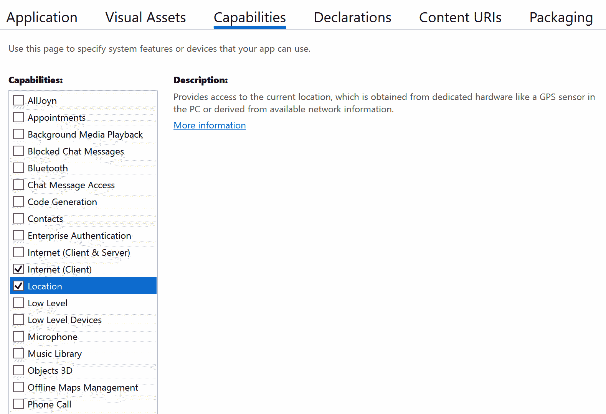

Building a Weather App for Multiple Form Factors

表单不仅仅用于创建手机应用；它还可用于为平板电脑和台式电脑创建应用。在本章中，我们将构建一个可以在所有这些平台上运行的应用。除了使用三种不同的外形，我们还将在三种不同的操作系统上工作：iOS、Android 和 Windows。

本章将介绍以下主题：

*   如何在 Xamarin.Forms 中使用`FlexLayout`
*   如何使用`VisualStateManager`
*   如何针对不同的形状因素使用不同的视图
*   如何使用行为

让我们开始吧！

# 技术要求

为了完成这个项目，我们需要安装 Visual Studio for Mac 或 PC，以及 Xamarin 组件。有关如何设置您的环境的详细信息，请参见[第 1 章](07.html)、*Xamarin 简介、*。要使用 Visual Studio for PC 构建 iOS 应用，必须连接 Mac。如果你根本无法使用 Mac 电脑，你可以选择只使用该项目的 Windows 和 Android 部分。类似地，如果您只有 Windows，那么您可以选择只使用此项目的 iOS 和 Android 部分。

# 项目概述

iOS 和 Android 应用可以在手机和平板电脑上运行。通常，应用只是针对手机进行了优化。在本章中，我们将构建一个适用于不同外形的应用，但我们不会只局限于手机和平板电脑，我们还将瞄准台式电脑。桌面版将用于**通用 Windows 平台**（**UWP**）。

我们将要构建的应用是一个天气应用，它根据用户的位置显示天气预报。

# 构建天气应用

是时候开始构建应用了。使用.NET 标准作为代码共享策略创建一个新的空白 Xamarin.Forms 应用，并选择 iOS、Android 和 Windows（UWP）作为平台。我们将把项目命名为`Weather`。

作为此应用的数据源，我们将使用外部天气 API。该项目将使用`OpenWeatherMap`，这是一项提供两个免费 API 的服务。您可以在[找到这项服务 https://openweathermap.org/api](https://openweathermap.org/) 。我们将在本项目中使用`5 day / 3 hour forecast`服务，以 3 小时为间隔提供 5 天的预测。要使用`OpenWeather`API，我们必须创建一个帐户来获取 API 密钥。如果不想创建 API 键，可以改为模拟数据。

## 为天气数据创建模型

在编写从外部天气服务获取数据的代码之前，我们将创建模型，以便对服务的结果进行反序列化。我们将这样做，这样我们就有了一个通用模型，可以用来从服务返回数据。

当我们从服务中反序列化结果时，生成要使用的模型的最简单方法是在浏览器中或使用工具（如 Postman）调用服务以查看 JSON 的结构。我们可以手动创建类，也可以使用一个可以从 JSON 生成 C# 类的工具。可以使用的工具之一是**quicktype**，可在[找到 https://quicktype.io/](https://quicktype.io/) 。

如果手动生成，请确保将名称空间设置为`Weather.Models`。

如前所述，您还可以手动创建这些模型。我们将在下一节介绍如何做到这一点。

### 手动添加天气 API 模型

如果要手动添加模型，请按照以下说明进行操作。我们将添加一个名为`WeatherData.cs`的代码文件，该文件将包含多个类：

1.  在`Weather`项目中，创建一个名为`Models`的文件夹。
2.  添加一个名为`WeatherData.cs`的文件。
3.  添加以下代码：

```cs
using System.Collections.Generic;

namespace Weather.Models
{
    public class Main
    {
        public double temp { get; set; }
        public double temp_min { get; set; }
        public double temp_max { get; set; }
        public double pressure { get; set; }
        public double sea_level { get; set; }
        public double grnd_level { get; set; }
        public int humidity { get; set; }
        public double temp_kf { get; set; }
    }

    public class Weather
    {
        public int id { get; set; }
        public string main { get; set; }
        public string description { get; set; }
        public string icon { get; set; }
    }

    public class Clouds
    {
        public int all { get; set; }
    }

    public class Wind
    {
        public double speed { get; set; }
        public double deg { get; set; }
    }

    public class Rain
    {
    }

    public class Sys
    {
        public string pod { get; set; }
    }

    public class List
    {
        public long dt { get; set; }
        public Main main { get; set; }
        public List<Weather> weather { get; set; }
        public Clouds clouds { get; set; }
        public Wind wind { get; set; }
        public Rain rain { get; set; }
        public Sys sys { get; set; }
        public string dt_txt { get; set; }
    }

    public class Coord
    {
        public double lat { get; set; }
        public double lon { get; set; }
    }

    public class City
    {
        public int id { get; set; }
        public string name { get; set; }
        public Coord coord { get; set; }
        public string country { get; set; }
    }

    public class WeatherData
    {
        public string cod { get; set; }
        public double message { get; set; }
        public int cnt { get; set; }
        public List<List> list { get; set; }
        public City city { get; set; }
    }
}
```

正如你所看到的，有相当多的类。这直接映射到我们从服务获得的响应。

### 添加特定于应用的模型

在本节中，我们将创建应用将天气 API 模型转换为的模型。让我们从添加`WeatherData`类开始（除非您在上一节中手动创建了该类）：

1.  在`Weather`项目中创建一个名为`Models`的新文件夹。
2.  添加一个名为`WeatherData`的新文件。
3.  基于 JSON 粘贴或编写类的代码。如果生成的代码不是属性，请忽略它，只使用属性。
4.  重命名`MainClass`（这是 quicktype 为根对象命名的名称）`WeatherData`。

现在，我们将根据感兴趣的数据创建模型。这将使代码的其余部分更松散地耦合到数据源。

### 添加 ForecastItem 模型

我们要添加的第一个模型是`ForecastItem`，它表示某个时间点的特定预测。我们的做法如下：

1.  在`Weather`项目和`Models`文件夹中，创建一个名为`ForecastItem`的新类。
2.  添加以下代码：

```cs
using System;
using System.Collections.Generic;

namespace Weather.Models
{  
    public class ForecastItem
    {
        public DateTime DateTime { get; set; }
        public string TimeAsString => DateTime.ToShortTimeString();
        public double Temperature { get; set; }
        public double WindSpeed { get; set; }
        public string Description { get; set; }
        public string Icon { get; set; }
    }
}     
```

### 添加预测模型

接下来，我们将创建一个名为`Forecast`的模型，该模型将跟踪一个城市的单一预测。`Forecast`保存多个`ForeCastItem`对象的列表，每个对象表示特定时间点的预测。让我们设置一下：

1.  在`Weather`项目中，创建一个名为`Forecast`的新类。
2.  添加以下代码：

```cs
using System;
using System.Collections.Generic;

namespace Weather.Models
{ 
    public class Forecast
    {
        public string City { get; set; }
        public List<ForecastItem> Items { get; set; }
    }
}
```

现在我们有了天气 API 和应用的模型，我们需要从天气 API 获取数据。

## 创建获取天气数据的服务

为了更容易更改外部天气服务并使代码更易于测试，我们将为该服务创建一个接口。以下是我们的做法：

1.  在`Weather`项目中，创建一个名为`Services`的新文件夹。
2.  创建一个名为`IWeatherService`的新`public interface`。
3.  添加一个基于用户位置获取数据的方法，如以下代码所示。将方法命名为`GetForecast`：

```cs
 public interface IWeatherService
 {
      Task<Forecast> GetForecast(double latitude, double longitude);
 }
```

当我们有一个接口时，我们可以为它创建一个实现，如下所示：

1.  在`Services`文件夹中，创建一个名为`OpenWeatherMapWeatherService`的新类。
2.  实现接口，将`async`关键字添加到`GetForecast`方法中。
3.  代码应如下所示：

```cs
using System;
using System.Globalization;
using System.Linq;
using System.Net.Http;
using System.Threading.Tasks;
using Newtonsoft.Json;
using Weather.Models; 

namespace Weather.Services
{ 
    public class OpenWeatherMapWeatherService : IWeatherService
    {
        public async Task<Forecast> GetForecast(double latitude, 
        double longitude)
        { 
        }
    }
}
```

在调用`OpenWeatherMap`API 之前，我们需要为调用天气 API 构建一个 URI。这将是一个`GET`调用，位置的纬度和经度将被添加为查询参数。我们还将添加 API 密钥和希望响应使用的语言。让我们设置一下：

1.  在`WeatherProject`中，打开`OpenWeatherMapWeatherService`类。

2.  在以下代码段中添加以粗体标记的代码：

```cs
public class OpenWeatherMapWeatherService : IWeatherService
{
    public async Task<Forecast> GetForecast(double latitude, double 
    longitude)
    { 
        var language =  
        CultureInfo.CurrentUICulture.TwoLetterISOLanguageName;
 var apiKey = "{AddYourApiKeyHere}";
 var uri = 
        $"https://api.openweathermap.org/data/2.5/forecast?
        lat={latitude}&lon={longitude}&units=metric&lang=
        {language}&appid={apiKey}";
    }
}
```

为了反序列化我们将从外部服务获得的 JSON，我们将使用`Json.NET`，这是在.NET 应用中用于序列化和反序列化 JSON 的最流行的 NuGet 包。我们可以这样安装：

1.  打开 NuGet 包管理器。
2.  安装`Json.NET`包。包的 ID 为`Newtonsoft.Json`。

要调用`Weather`服务，我们将使用`HttpClient`类和`GetStringAsync`方法，如下所示：

1.  创建`HttpClient`类的新实例。
2.  调用`GetStringAsync`并传递 URL 作为参数。
3.  使用`JsonConvert`类和`Json.NET`中的`DeserializeObject`方法将 JSON 字符串转换为对象。
4.  将`WeatherData`对象映射到`Forecast`对象。
5.  此代码应类似于以下代码段中显示的粗体代码：

```cs
public async Task<Forecast> GetForecast(double latitude, double  
                                        longitude)
{ 
    var language = 
    CultureInfo.CurrentUICulture.TwoLetterISOLanguageName;
    var apiKey = "{AddYourApiKeyHere}";
    var uri = $"https://api.openweathermap.org/data/2.5/forecast?
    lat={latitude}&lon={longitude}&units=metric&lang=
    {language}&appid={apiKey}";

    var httpClient = new HttpClient();
    var result = await httpClient.GetStringAsync(uri);

    var data = JsonConvert.DeserializeObject<WeatherData>(result);

    var forecast = new Forecast()
    {
        City = data.city.name,
        Items = data.list.Select(x => new ForecastItem()
        {
            DateTime = ToDateTime(x.dt),
            Temperature = x.main.temp,
            WindSpeed = x.wind.speed,
            Description = x.weather.First().description,
            Icon = 
            $"http://openweathermap.oimg/w/{
                      x.weather.First().icon}.png"
     }).ToList()
    };
    return forecast;
}

```

To optimize the performance of the app, we can use `HttpClient` as a singleton and reuse it for all network calls in the application. The following information is from Microsoft's documentation: *HttpClient* *is intended to be instantiated once and reused throughout the life of an application. Instantiating an HttpClient class for every request will exhaust the number of sockets available under heavy loads. This will result in SocketException errors.* This can be found at [https://docs.microsoft.com/en-gb/dotnet/api/system.net.http.httpclient?view=netstandard-2.0](https://docs.microsoft.com/en-gb/dotnet/api/system.net.http.httpclient?view=netstandard-2.0).

在前面的代码中，我们调用了一个`ToDateTime`方法，这是我们需要创建的方法。此方法将日期从 Unix 时间戳转换为`DateTime`对象，如下代码所示：

```cs
private DateTime ToDateTime(double unixTimeStamp)
{
     DateTime dateTime = new DateTime(1970, 1, 1, 0, 0, 0, 0, 
     DateTimeKind.Utc);
     dateTime = dateTime.AddSeconds(unixTimeStamp).ToLocalTime();
     return dateTime;
}
```

By default, `HttpClient` uses the Mono implementation of `HttpClient` (iOS and Android). To increase performance, we can use a platform-specific implementation instead. For iOS, use `NSUrlSession`. This can be set in the project settings of the iOS project under the iOS Build tab. For Android, use Android. This can be set in the project settings of the Android project under Android Options | Advanced.

## 配置应用以使其使用位置服务

为了能够使用定位服务，我们需要在每个平台上进行一些配置。我们将使用 Xamarin.Essentials 及其包含的类。在完成以下部分中的步骤之前，请确保您已从 NuGet 为解决方案中的所有项目安装了 Xamarin.Essentials。

### 配置 iOS 应用以使用位置服务

要在 iOS 应用中使用位置服务，我们需要添加一个说明，说明我们为什么要在`info.plist`文件中使用位置。在这个应用中，我们只需要在使用该应用时获取位置，因此我们只需要为此添加一个描述。让我们设置一下：

1.  用 XML（文本）编辑器打开`Weather.iOS`中的`info.plist`。
2.  使用以下代码添加`NSLocationWhenInUseUsageDescription`键：

```cs
<key>NSLocationWhenInUseUsageDescription</key>
<string>We are using your location to find a forecast for you</string>
```

### 配置 Android 应用以使用位置服务

对于 Android，我们需要设置应用，使其需要以下两个权限：

*   访问\u 粗略\u 位置
*   访问\u FINE\u 位置

我们可以在`AndroidManifest.xml`文件中进行设置，可以在`Weather.Android`项目的`Properties`文件夹中找到。但是，我们也可以在 Android 清单选项卡上的项目属性中设置，如以下屏幕截图所示：


当我们在 Android 应用中请求权限时，我们还需要在 Android 项目的`MainActivity.cs`文件中添加以下代码：

```cs
public override void OnRequestPermissionsResult(int requestCode, string[] permissions, 
[GeneratedEnum] Android.Content.PM.Permission[] grantResults)
{
     Xamarin.Essentials.Platform.OnRequestPermissionsResult(requestCode, permissions, grantResults); base.OnRequestPermissionsResult(requestCode, permissions, grantResults);
}
```

对于 Android，我们还需要初始化 Xamarin.Essentials。我们将按照`MainActivity`的`OnCreate`方法进行：

```cs
protected override void OnCreate(Bundle savedInstanceState)
{
    TabLayoutResource = Resource.Layout.Tabbar;
    ToolbarResource = Resource.Layout.Toolbar;

    base.OnCreate(savedInstanceState);

    global::Xamarin.Forms.Forms.Init(this, savedInstanceState);
    Xamarin.Essentials.Platform.Init(this, savedInstanceState);
    LoadApplication(new App());
}
```

### 配置 UWP 应用以使用位置服务

由于我们将在 UWP 应用中使用定位服务，我们需要在`Weather.UWP`项目的`Package.appxmanifest`文件中的功能下添加定位功能，如下图所示：



## 创建 ViewModel 类

现在我们有了一个从外部天气源获取天气数据的服务，是时候创建一个`ViewModel`。但是，首先，我们将创建一个基本视图模型，在该模型中，我们可以放置可在应用的所有`ViewModels`之间共享的代码。让我们设置一下：

1.  创建一个名为`ViewModels`的新文件夹。
2.  创建一个名为`ViewModel`的新类。

3.  创建新类`public`和`abstract`。
4.  添加并实现`INotifiedPropertyChanged`接口。这是必要的，因为我们希望使用数据绑定。
5.  添加一个`Set`方法。这将更容易从`INotifiedPropertyChanged`接口引发`PropertyChanged`事件。该方法将检查值是否已更改。如果有，它将引发事件：

```cs
public abstract class ViewModel : INotifyPropertyChanged
{
     public event PropertyChangedEventHandler PropertyChanged; 
     protected void Set<T>(ref T field, T newValue, 
     [CallerMemberName] string propertyName = null)
     {
          if (!EqualityComparer<T>.Default.Equals(field, 
          newValue))
          {
               field = newValue;
               PropertyChanged?.Invoke(this, new 
               PropertyChangedEventArgs(propertyName));
          }
     }
} 
```

The `CallerMemberName` attribute can be used in a method body if you want the name of the method or the property that made the call to the method to be a parameter. Note that we can always override this by simply passing a value to it. The default value of the parameter is required when you are using the `CallerMember` attribute.

我们现在有了一个基础视图模型。我们可以将其用于我们现在创建的视图模型，以及我们稍后将添加的所有其他视图模型。

现在，是时候创建`MainViewModel`，这将是我们在应用中的`MainView`的`ViewModel`。执行以下步骤以执行此操作：

1.  在`ViewModels`文件夹中，创建一个名为`MainViewModel`的新类。
2.  添加抽象`ViewModel`类作为基类。
3.  因为我们将要使用构造函数注入，所以我们将添加一个带有`IWeatherService`接口作为参数的构造函数。

4.  创建一个只读的`private`字段。我们将使用它来存储`IWeatherService`实例：

```cs
public class MainViewModel : ViewModel
{
     private readonly IWeatherService weatherService;

     public MainViewModel(IWeatherService weatherService)
     {
          this.weatherService = weatherService;
     } 
}
```

`MainViewModel`获取实现`IWeatherService`的任何对象，并在字段中存储对该服务的引用。我们将在下一节中添加获取天气数据的功能。

### 获取天气数据

现在，我们将创建一个加载数据的新方法。这将是一个三步过程。首先，我们将获得用户的位置。一旦我们有了这个，我们就可以获取与该位置相关的数据。最后一步是准备视图可以使用的数据，以便为用户创建用户界面。

为了获取用户的位置，我们将使用 Xamarin.Essentials（我们之前作为 NuGet 软件包安装）和`Geolocation`类，后者公开可以获取用户位置的方法。执行以下步骤：

1.  创建一个名为`LoadData`的新方法。使其成为一个异步方法，返回一个`Task`。
2.  使用`Geolocation`类上的`GetLocationAsync`方法获取用户的位置。
3.  从`GetLocationAsync`调用的结果中传递纬度和经度，并使用以下代码将其传递给实现`IWeatherService`的对象上的`GetForecast`方法：

```cs
public async Task LoadData()
{
     var location = await Geolocation.GetLocationAsync();
     var forecast = await weatherService.GetForecast
     (location.Latitude, location.Longitude); 
}
```

### 将天气数据分组

当我们呈现天气数据时，我们将按天对其进行分组，以便一天的所有预测都位于同一标题下。为此，我们将创建一个名为`ForecastGroup`的新模型。为了使这个模型能够与 Xamarin.Forms`CollectionView`一起使用，它必须有一个`IEnumerable`类型作为基类。让我们设置一下：

1.  在`Models`文件夹中创建一个名为`ForecastGroup`的新类。
2.  添加`List<ForecastItem>`作为新模型的基类。
3.  添加一个空构造函数和一个将`ForecastItem`实例列表作为参数的构造函数。
4.  添加一个`Date`属性。
5.  添加一个属性`DateAsString`，该属性以短日期字符串的形式返回`Date`属性。
6.  添加一个属性`Items`，返回`ForecastItem`实例列表，如下代码所示：

```cs
using System;
using System.Collections.Generic;

namespace Weather.Models
{ 
    public class ForecastGroup : List<ForecastItem>
    {
        public ForecastGroup() { }
        public ForecastGroup(IEnumerable<ForecastItem> items)
        {
            AddRange(items);
        }

        public DateTime Date { get; set; }
        public string DateAsString => Date.ToShortDateString();
        public List<ForecastItem> Items => this;
    }
} 
```

完成此操作后，我们可以使用两个新属性更新`MainViewModel`，如下所示：

1.  为获取天气数据的城市名称创建一个名为`City`的属性。
2.  创建一个名为`Days`的属性，该属性将包含分组的天气数据。

3.  `MainViewModel`类应该像下面代码片段中显示的粗体代码：

```cs
public class MainViewModel : ViewModel
{ 
 private string city;
 public string City
 {
 get => city;
 set => Set(ref city, value);
 }

 private ObservableCollection<ForecastGroup> days;
 public ObservableCollection<ForecastGroup> Days
 {
 get => days;
 set => Set(ref days, value);
 }

    // Rest of the class is omitted for brevity
} 
```

现在，我们准备对数据进行分组。我们将使用`LoadData`方法进行此操作。我们将循环浏览服务中的数据，并将项目添加到各个组中，如下所示：

1.  创建一个`List<ForecastGroup>`**类型的`itemGroups`变量。**
***   创建一个`foreach`循环，循环`forecast`变量中的所有项。*   添加一个检查`itemGroups`属性是否为空的`if`语句。如果为空，则在变量中添加一个新的`ForecastGroup`，并继续执行项目列表中的下一项。*   在`itemGroups`变量上使用`SingleOrDefault`方法（这是`System.Linq`的扩展方法）根据当前`ForecastItem`的日期得到一个组。将结果添加到新变量`group`。*   如果组属性为`null`，则组列表中没有当前日期的组。如果是这种情况，则应在`itemGroups`变量的列表中添加一个新的`ForecastGroup`。代码将继续执行，直到到达`forecast.Items`列表中的下一个`forecast`项。如果找到组，则应将其添加到`itemGroups`变量中的列表中。*   在`foreach`循环之后，使用新的`ObservableCollection<ForecastGroup>`**设置`Days`属性，并将`itemGroups`变量用作构造函数中的参数。*****   将`City`属性设置为`forecast`变量的`City`属性。****

 ****8.  `LoadData`方法现在应该如下所示：

```cs
public async Task LoadData()
{ 
    var itemGroups = new List<ForecastGroup>();

    foreach (var item in forecast.Items)
    {
        if (!itemGroups.Any())
        {
            itemGroups.Add(new ForecastGroup(
             new List<ForecastItem>() { item }) 
             { Date = item.DateTime.Date});
             continue;
        }

        var group = itemGroups.SingleOrDefault(x => x.Date == 
        item.DateTime.Date);

        if (group == null)
        {
            itemGroups.Add(new ForecastGroup(
            new List<ForecastItem>() { item }) 
            { Date = item.DateTime.Date });

                      continue;
        }

        group.Items.Add(item);
    }

    Days = new ObservableCollection<ForecastGroup>(itemGroups);
    City = forecast.City;
}
```

Don't use the `Add` method on `ObservableCollection` when you want to add more than a couple of items. It is better to create a new instance of `ObservableCollection` and pass a collection to the constructor. The reason for this is that every time you use the `Add` method, you will have a binding to it from the view, which will cause the view to be rendered. We will get better performance if we avoid using the `Add` method.

## 创建冲突解决程序

现在，我们需要为**控制反转**（**IoC**创建一个助手类。这将帮助我们基于配置的 IoC 容器创建类型。在本项目中，我们将使用 Autofac 作为 IoC 库。让我们设置一下：

1.  在`Weather`项目中安装 Autofac NuGet 软件包。
2.  在`Weather`项目中创建一个名为`Resolver`的新类。
3.  添加一个名为`container`的`IContainer`类型的`private static`字段（来自 Autofac）。
4.  添加一个名为`Initialize`的`public static`方法，参数为`IContainer`。将参数值设置为`container`字段。
5.  添加一个名为`Resolve<T>`的泛型`public static`方法，该方法将返回使用`T`参数指定类型的对象的实例。然后，`Resolve<T>`方法将在初始化期间传递给它的`IContainer`实例上调用`Resolve<T>`方法。
6.  代码现在应该如下所示：

```cs
using Autofac;

namespace Weather
{ 
    public class Resolver
    {
        private static IContainer container;

        public static void Initialize(IContainer container)
        {
            Resolver.container = container;
        }

        public static T Resolve<T>()
        {
            return container.Resolve<T>();
        }
    }
} 
```

## 创建引导程序

在本节中，我们将创建一个`Bootstrapper`类。我们将使用它来设置应用启动阶段所需的通用配置。通常，每个目标平台都有一个引导程序部分，所有平台共享一个引导程序部分。在这个项目中，我们只需要共享部分。让我们设置一下：

1.  在`Weather`项目中，创建一个名为`Bootstrapper`的新类。
2.  添加一个名为`Init`的新`public static`方法。
3.  创建一个新的`ContainerBuilder`并将类型注册到`container`。
4.  使用`ContainerBuilder`的`Build`方法创建一个`Container`。创建一个名为`container`的变量，该变量包含`Container`的实例。
5.  使用`Resolver`上的`Initialize`方法，并将`container`变量作为参数传递。
6.  `Bootstrapper`类现在应该如下所示：

```cs
using Autofac;
using TinyNavigationHelper.Forms;
using Weather.Services;
using Weather.ViewModels;
using Weather.Views;
using Xamarin.Forms;

namespace Weather
{ 
    public class Bootstrapper
    {
        public static void Init()
        {
            var containerBuilder = new ContainerBuilder();
            containerBuilder.RegisterType
            <OpenWeatherMapWeatherService>().As
            <IWeatherService>();
            containerBuilder.RegisterType<MainViewModel>();

            var container = containerBuilder.Build();

            Resolver.Initialize(container);
        }
    }
}
```

调用`InitializeComponent`方法后，在`App.xaml.cs`文件的构造函数中调用`Bootstrapper`的`Init`方法。另外，将`MainPage`属性设置为`MainView`，如下代码所示：

```cs
public App()
{
    InitializeComponent();
    Bootstrapper.Init();
    MainPage = new NavigationPage(new MainView());
} 
```

## 为平板电脑和台式计算机创建视图

下一步是创建应用在平板电脑或台式计算机上运行时将使用的视图。让我们设置一下：

1.  在`Weather`项目中创建一个名为`Views`的新文件夹。
2.  使用 XAML 创建一个名为`MainView`的新内容页。
3.  在视图的构造函数中使用`Resolver`将`BindingContext`设置为`MainViewModel`，如下代码所示：

```cs
public MainView ()
{
    InitializeComponent ();
    BindingContext = Resolver.Resolve<MainViewModel>();
} 
```

要触发`MainViewModel`中的`LoadData`方法，可以通过重写主线程上的`OnAppearing`方法来调用`LoadData`方法。我们需要确保调用在 UI 线程上执行，因为它将与用户界面交互。

为此，请执行以下步骤：

1.  在`Weather`项目中，打开`MainView.xaml.cs`文件。
2.  创建对`OnAppearing`方法的重写。

3.  在以下代码段中添加粗体显示的代码：

```cs
protected override void OnAppearing()
{
    base.OnAppearing();

 if (BindingContext is MainViewModel viewModel)
 {
 MainThread.BeginInvokeOnMainThread(async () =>
 {
 await viewModel.LoadData();
 });
 }
} 
```

在 XAML 中，将`ContentPage`的`Title`属性的绑定添加到`ViewModel`的`City`属性中，如下所示：

1.  在`Weather`项目中，打开`MainView.xaml`文件。
2.  将`Title`绑定添加到`ContentPage`元素，如以下代码段中以粗体突出显示的：

```cs
<ContentPage 
    xmlns:x="http://schemas.microsoft.com/winfx/2009/xaml"
    xmlns:controls="clr-namespace:Weather.Controls" 
    x:Class="Weather.Views.MainView" 
    Title="{Binding City}">
```

### 使用 FlexLayout

在 Xamarin.Forms 中，如果我们想显示数据集合，可以使用`CollectionView`或`ListView`。在大多数情况下，同时使用`CollectionView`和`ListView`效果很好，我们将在本章后面使用`CollectionView`，但`ListView`只能垂直显示数据。在这个应用中，我们希望在两个方向上显示数据。在垂直方向上，我们将有天数（我们根据天数对预测进行分组），而在水平方向上，我们将有特定日期内的预测。如果没有足够的空间将所有预测放在一行中，我们还希望在一天内完成。`CollectionView`可以在水平方向上显示数据，但不会换行。使用`FlexLayout`，我们可以在两个方向上添加项目，并且可以使用`BindableLayout`将项目绑定到它。当我们使用`BindableLayout`时，我们将使用`ItemSource`和`ItemsTemplate`作为附加属性。

执行以下步骤以生成视图：

1.  添加一个`Grid`作为页面的根视图。
2.  在`Grid`中添加一个`ScrollView`。如果内容高于页面高度，我们需要它来滚动。
3.  将`FlexLayout`添加到`ScrollView`并将方向设置为`Column`，使内容处于垂直方向。
4.  使用`BindableLayout.ItemsSource`向`MainViewModel`中的`Days`属性添加绑定。
5.  将`DataTemplate`设置为`ItemsTemplate`的内容，如下代码所示：

```cs
<Grid>
    <ScrollView BackgroundColor="Transparent">
        <FlexLayout BindableLayout.ItemsSource="{Binding Days}"  
                 Direction="Column">
            <BindableLayout.ItemTemplate>
                <DataTemplate>
                  <!--Content will be added here -->
                </DataTemplate>
            </BindableLayout.ItemTemplate>
        </FlexLayout>
    </ScrollView>
</Grid>
```

每个项目的内容将是带有日期的标题和带有当天预测的水平`FlexLayout`。让我们设置一下：

1.  在`Weather`项目中，打开`MainView.xaml`文件。
2.  添加`StackLayout`以便我们添加到其中的子对象将垂直放置。
3.  将`ContentView`添加到`StackLayout`，将`Padding`设置为`10`，将`BackgroundColor`设置为`# 9F5010`。这将是标题。我们需要`ContentView`的原因是我们希望文本周围有填充。
4.  将`Label`**添加到`ContentView`，将`TextColor`设置为`White`，将`FontAttributes`设置为`Bold`。**
***   为`Label`的`Text`属性添加对`DateAsString`的绑定。*   代码应放在`<!-- Content will be added here -->`注释处，如下所示：**

```cs
<StackLayout>
    <ContentView Padding="10" BackgroundColor="# 9F5010">
        <Label Text="{Binding DateAsString}" TextColor="White" 
         FontAttributes="Bold" />
    </ContentView> 
</StackLayout>
```

现在我们在用户界面中有了日期，我们需要添加一个`FlexLayout`，它将在`MainViewModel`中的任何`Items`中重复。执行以下步骤以执行此操作：

1.  在`</ContentView>`标记后，但在`</StackLayout>`标记前添加一个`FlexLayout`。
2.  将`JustifyContent`设置为`Start`**以设置`Items`以便从左侧添加，而不将其分布在可用空间上。**
***   将`AlignItems`设置为`Start`将`FlexLayout`中每一项的内容设置在左侧，如下代码所示：**

```cs
 <FlexLayout BindableLayout.ItemsSource="{Binding Items}" Wrap="Wrap"  
  JustifyContent="Start" AlignItems="Start"> 
```

在定义了`FlexLayout`之后，我们需要提供一个`ItemsTemplate`，定义列表中的每个项目应该如何呈现。继续直接在刚才添加的`<FlexLayout>`标记下添加 XAML。详情如下:

1.  将`ItemsTemplate`属性设置为`DataTemplate`。
2.  用元素填充`DataTemplate`，如下代码所示：

If we want to add formatting to a binding, we can use `StringFormat`. In this case, we want to add the degree symbol after the temperature. We can do this by using the `{Binding Temperature, StringFormat='{0}° C'}` phrase. With the `StringFormat` property of the binding, we can format data with the same arguments that we would use if we were to do this in C#. This is the same as `string.Format("{0}° C", Temperature)` in C#. We can also use it to format a date; for example, `{Binding Date, StringFormat='yyyy'}`. In C#, this would look like `Date.ToString("yyyy")`.

```cs
<BindableLayout.ItemTemplate>
    <DataTemplate>
        <StackLayout Margin="10" Padding="20" WidthRequest="150" 
             BackgroundColor="# 99FFFFFF">
            <Label FontSize="16" FontAttributes="Bold" 
              Text="{Binding TimeAsString}" 
               HorizontalOptions="Center" />
            <Image WidthRequest="100" HeightRequest="100" 
              Aspect="AspectFit" HorizontalOptions="Center" 
               Source="{Binding Icon}" />
            <Label FontSize="14" FontAttributes="Bold" 
              Text="{Binding Temperature, StringFormat='{0}° C'}"  
              HorizontalOptions="Center" /> 
            <Label FontSize="14" FontAttributes="Bold" 
              Text="{Binding Description}" 
              HorizontalOptions="Center" />
        </StackLayout>
    </DataTemplate>
</BindableLayout.ItemTemplate>

```

The `AspectFill` phrase, as a value of the `Aspect` property for `Image`, means that the whole image will always be visible and that the aspects will not be changed. The `AspectFit`phrase will also keep the aspect of an image, but the image can be zoomed into and out of and cropped so that it fills the whole `Image` element. The last value that `Aspect` can be set to, `Fill`, means that the image can be stretched or compressed to match the `Image` view to ensure that the aspect ratio is kept.

### 添加工具栏项以刷新天气数据

为了能够在不重新启动应用的情况下刷新数据，我们将在工具栏上添加一个刷新按钮。`MainViewModel`负责处理我们想要执行的任何逻辑，我们必须将任何操作公开为我们可以绑定的`ICommand`。

我们先在`MainViewModel`上创建`Refresh`命令属性：

1.  在`Weather`项目中，打开`MainViewModel`类。
2.  添加名为`Refresh`的`ICommand`属性和返回新`Command`的`get`方法。
3.  在调用`LoadData`方法的`Command`**的构造函数中添加一个 action 作为表达式，如下代码所示：**

```cs
public ICommand Refresh => new Command(async() => 
{
    await LoadData();
}); 
```

现在我们已经定义了`Command`，我们需要将其绑定到用户界面，这样当用户单击工具栏按钮时，操作将被执行。

为此，请执行以下步骤：

1.  在`Weather`应用中，打开`MainView.xaml`文件。
2.  将`Text`属性设置为`Refresh`的新`ToolbarItem`添加到`ContentPage`的`ToolbarItems`属性中，并将`Icon`属性设置为`refresh.png`（图标可从 GitHub 下载；请参见[https://github.com/PacktPublishing/Xamarin.Forms-Projects/tree/master/Chapter-5](https://github.com/PacktPublishing/Xamarin.Forms-Projects/tree/master/Chapter-5) 。
3.  将`Command`属性绑定到`MainViewModel`中的`Refresh`属性，如下代码所示：

```cs
<ContentPage.ToolbarItems>
    <ToolbarItem Icon="refresh.png" Text="Refresh" Command="{Binding 
     Refresh}" />
</ContentPage.ToolbarItems> 
```

这就是刷新数据的全部内容。现在，我们需要某种指示数据正在加载的指示器。

#### 添加加载指示器

当我们刷新数据时，我们希望显示一个加载指示器，以便用户知道发生了什么。为此，我们将添加`ActivityIndicator`，这就是该控件在 Xamarin.Forms 中的名称。让我们设置一下：

1.  在`Weather`项目中，打开`MainViewModel`类。
2.  将名为`IsRefreshing`的布尔属性添加到`MainViewModel`。
3.  在`LoadData`方法的开头将`IsRefreshing`属性设置为`true`。
4.  在`LoadData`方法的末尾，将`IsRefreshing`属性设置为`false`，如下代码所示：

```cs
private bool isRefreshing;
public bool IsRefreshing
{
    get => isRefreshing;
    set => Set(ref isRefreshing, value);
} 

public async Task LoadData()
{
    IsRefreshing = true; 
    .... // The rest of the code is omitted for brevity
    IsRefreshing = false;
}
```

现在我们已经为`MainViewModel`添加了一些代码，我们需要将`IsRefreshing`属性绑定到一个用户界面元素，当`IsRefreshing`属性为`true`时，该元素将显示，如下代码所示：

1.  在`MainView.xaml`中，在`ScrollView`之后添加`Frame`作为`Grid`中的最后一个元素。
2.  将`IsVisible`属性绑定到我们在`MainViewModel`中创建的`IsRefreshing`方法。
3.  将`HeightRequest`和`WidthRequest`设置为`100`。
4.  设置 To T0 和 To T1 至 T2 T2，使 AUT T3 将位于视图的中间。
5.  将`BackgroundColor`设置为`# 99000000`可将背景设置为白色，并带有一点透明度。
6.  将`ActivityIndicator`添加到`Frame`，将`Color`设置为`Black`，将`IsRunning`设置为`True`，如下代码所示：

```cs
 <Frame IsVisible="{Binding IsRefreshing}" 
      BackgroundColor="# 99FFFFFF" 
      WidthRequest="100" HeightRequest="100" 
      VerticalOptions="Center" 
      HorizontalOptions="Center">
      <ActivityIndicator Color="Black" IsRunning="True" />
</Frame> 
```

这将创建一个在加载数据时可见的微调器，这在创建任何用户界面时都是一个非常好的实践。现在，我们将添加一个背景图像，使应用看起来更好。

### 设置背景图像

目前，我们对该视图所做的最后一件事是添加背景图像。我们将在本例中使用的图像是谷歌搜索免费使用图像的结果。让我们设置一下：

1.  在`Weather`项目中，打开`MainView.xaml`文件。
2.  将`ScrollView`的`Background`属性设置为`Transparent`。

3.  在`Grid`中添加一个`Image`元素，将`UriImageSource`作为`Source`属性的值。
4.  将`CachingEnabled`属性设置为`true`，将`CacheValidity`属性设置为`5`。这意味着映像将在 5 天内缓存。
5.  XAML 现在应该如下所示：

```cs
<ContentPage 
             xmlns:x="http://schemas.microsoft.com/winfx/2009/xaml"
             xmlns:controls="clr-namespace:Weather.Controls" 
             x:Class="Weather.Views.MainView" Title="{Binding 
                                                       City}">
    <ContentPage.ToolbarItems>
        <ToolbarItem Icon="refresh.png" Text="Refresh" Command="
        {Binding Refresh}" />
    </ContentPage.ToolbarItems>

 <Grid>
 <Image Aspect="AspectFill">
 <Image.Source>
 <UriImageSource 
           Uri="https://upload.wikimedia.org/wikipedia/commons/7/79/
           Solnedg%C3%A5ng_%C3%B6ver_Laholmsbukten_augusti_2011.jpg"            
           CachingEnabled="true" CacheValidity="1" />
 </Image.Source> </Image>
    <ScrollView BackgroundColor="Transparent"> 
        <!-- The rest of the code is omitted for brevity -->
```

我们也可以使用`<Image Source="https://ourgreatimage.url" />`直接在`Source`属性中设置 URL。但是，如果我们这样做，就不能为图像指定缓存。

## 为手机创建视图

在平板电脑和台式电脑上构建内容在许多方面非常相似。然而，在手机上，我们能做的事情要有限得多。因此，在本节中，我们将为该应用在手机上使用时创建一个特定视图。为此，请执行以下步骤：

1.  在`Views`文件夹中创建新的基于 XAML 的内容页。
2.  调用新视图`MainView_Phone`。

3.  在视图的构造函数中使用`Resolver`将`BindingContext`设置为`MainViewModel`，如下代码所示：

```cs
public MainView_Phone ()
{
    InitializeComponent ();
    BindingContext = Resolver.Resolve<MainViewModel>();
} 
```

要触发`MainViewModel`中的`LoadData`方法，可以通过重写主线程上的`OnAppearing`方法来调用`LoadData`方法。为此，请执行以下步骤：

1.  在`Weather`项目中，打开`MainView_Phone.xaml.cs`文件。
2.  添加`OnAppearing`方法的覆盖，如下代码所示：

```cs
protected override void OnAppearing()
{
    base.OnAppearing();

    if (BindingContext is MainViewModel viewModel)
    {
        MainThread.BeginInvokeOnMainThread(async () =>
        {
            await viewModel.LoadData();
        });
    }
} 
```

在 XAML 中，将`ContentPage`的`Title`属性的绑定添加到`ViewModel`的`City`属性中，如下所示：

1.  在`Weather`项目中，打开`MainView_Phone.xaml`文件。
2.  将带绑定的`Title`属性添加到`MainViewModel`的`City`属性，如下代码所示：

```cs
<ContentPage 
    xmlns:x="http://schemas.microsoft.com/winfx/2009/xaml"
    xmlns:controls="clr-namespace:Weather.Controls" 
    x:Class="Weather.Views.MainView_Phone" 
    Title="{Binding City}">
```

### 使用分组的 CollectionView

我们可以使用`FlexLayout`查看手机，但因为我们希望我们的用户体验尽可能好，所以我们将使用`CollectionView`。为了获取每天的标题，我们将对`CollectionView`进行分组。对于`FlexLayout`，我们有`ScrollView`，但是对于`CollectionView`，我们不需要这个，因为`CollectionView`可以默认处理滚动。

让我们继续为手机视图创建用户界面：

1.  在`Weather`项目中，打开`MainView_Phone.xaml`文件。
2.  在页面的根目录中添加一个`CollectionView`。
3.  为`ItemSource`属性设置`MainViewModel`中`Days`属性的绑定。
4.  将`IsGrouped`设置为`True`可在`CollectionView`中进行分组。
5.  将`BackgroundColor`设置为`Transparent`，如下代码所示：

```cs
<CollectionView ItemsSource="{Binding Days}" IsGrouped="True" 
          BackgroundColor="Transparent">
</CollectionView>
```

为了格式化每个标题的外观，我们将创建一个`DataTemplate`，如下所示：

1.  在`CollectionView`的`GroupHeaderTemplate`属性中添加`DataTemplate`。
2.  将该行内容添加到`DataTemplate`中，如下代码所示：

```cs
<CollectionView ItemsSource="{Binding Days}" IsGrouped="True" 
                   BackgroundColor="Transparent">
       <CollectionView.GroupHeaderTemplate>
         <DataTemplate>
                 <ContentView Padding="15,5"  
                  BackgroundColor="# 9F5010">
              <Label FontAttributes="Bold" TextColor="White"  
              Text="{Binding DateAsString}"   
              VerticalOptions="Center"/>
                  </ContentView>
         </DataTemplate>
    </CollectionView.GroupHeaderTemplate> 
</CollectionView>
```

为了格式化每个预测的外观，我们将创建一个`DataTemplate`，就像我们对组标题所做的那样。让我们设置一下：

1.  在`CollectionView`的`ItemTemplate`属性中添加`DataTemplate`。
2.  在`DataTemplate`中，添加一个包含四列的`Grid`。使用`ColumnDefinition`属性指定列的宽度。第二列为`50`；其他三个将共享剩余空间。我们将通过将`Width`设置为`*`来实现这一点。
3.  在`Grid`中增加以下内容：

```cs
<CollectionView.ItemTemplate>
    <DataTemplate>
            <Grid Padding="15,10" ColumnSpacing="10" 
                BackgroundColor="# 99FFFFFF">
                <Grid.ColumnDefinitions>
                    <ColumnDefinition Width="*" />
                    <ColumnDefinition Width="50" />
                    <ColumnDefinition Width="*" />
                    <ColumnDefinition Width="*" />
                </Grid.ColumnDefinitions>
                <Label FontAttributes="Bold" Text="{Binding 
                  TimeAsString}" VerticalOptions="Center" />
                <Image Grid.Column="1" HeightRequest="50" 
                  WidthRequest="50" Source="{Binding Icon}"   
                  Aspect="AspectFit" VerticalOptions="Center" />
                <Label Grid.Column="2" Text="{Binding Temperature, 
                StringFormat='{0}°  C'}" 
                 VerticalOptions="Center" />
                <Label Grid.Column="3" Text="{Binding Description}" 
                 VerticalOptions="Center" />
            </Grid>
    </DataTemplate>
</CollectionView.ItemTemplate> 
```

### 添加拉入刷新功能

对于平板电脑和桌面版本的视图，我们在工具栏上添加了一个按钮来刷新天气预报。然而，在手机版的视图中，我们将添加 pull-to-refresh 功能，这是刷新数据列表中内容的常用方法。`CollectionView`在 Xamarin 中。表单没有像`ListView`那样内置的对拉刷新的支持。

相反，我们可以使用`RefreshView`。`RefreshView`可用于向任何控件添加拉刷新行为。让我们设置一下：

1.  转到`MainView_Phone.xaml`。
2.  将`CollectionView`包裹在`RefreshView`内。
3.  将`MainViewModel`中的`Refresh`属性绑定到`RefreshView`的`Command`属性，当用户执行拉刷新手势时触发刷新。
4.  要在刷新过程中显示加载图标，请将`MainViewModel`中的`IsRefreshing`属性绑定到`RefreshView`的`IsRefreshing`属性。当我们进行设置时，我们还将在初始加载运行时获得一个加载指示器，如以下代码所示：

```cs
<RefreshView Command="{Binding Refresh}" IsRefreshing="{Binding IsRefreshing}>
<CollectionView ItemsSource="{Binding Days}" IsGrouped="True" 
 BackgroundColor="Transparent">
....
</CollectionView>
</RefreshView>
```

## 根据形状因素导航到不同的视图

我们现在有两个不同的视图，应该在应用的同一个位置加载。如果应用在平板电脑或桌面上运行，则应加载`MainView`，如果应用在手机上运行，则应加载`MainView_Phone`。

Xamarin.Forms 中的`Device`类有一个静态`Idiom`属性，我们可以使用它来检查应用运行在哪个形状因子上。`Idiom`的值可以是`Phone`、`Table`、`Desktop`、`Watch`或`TV`。因为我们在这个应用中只有一个视图，所以当我们在`App.xaml.cs`中设置`MainPage`时，我们可以使用`if`语句并检查`Idiom`值是多少。然而，在这里，我们将构建一个解决方案，我们也可以用于更大的应用。

一个解决方案是构建一个导航服务，我们可以使用它根据一个键导航到不同的视图。启动应用时，将加载哪个视图并配置哪个密钥。使用此解决方案，我们可以在不同类型的设备上配置同一密钥上的不同视图。我们可以使用的开源导航服务是`TinyNavigationHelper`，可以在[找到 https://github.com/TinyStuff/TinyNavigationHelper](https://github.com/TinyStuff/TinyNavigationHelper) 。它是由这本书的作者创作的。

There is also an MVVM library called `TinyMvvm` that includes `TinyNavigationHelper` as a dependency. The `TinyMvvm` library is a library that contains helper classes so that you can get started quickly with MVVM in a Xamarin.Forms app. We created `TinyMvvm` because we wanted to avoid writing the same code again and again. You can read more about this at [https://github.com/TinyStuff/TinyMvvm](https://github.com/TinyStuff/TinyMvvm).

执行以下步骤将`TinyNavigationHelper`添加到应用：

1.  在`Weather`项目中安装`TinyNavigationHelper.Forms`NuGet 包。
2.  转到`Bootstrapper.cs`。
3.  在`Execute`方法开始时，创建一个`FormsNavigationHelper`并将当前应用传递给构造函数。
4.  增加一条`if`语句，检查`Idiom`是否为`Phone`。如果这是真的，`MainView_Phone`视图应该为`MainView`键注册。
5.  添加一个`else`语句，为`MainView`键注册`MainView`。
6.  `Bootstrapper`类现在应该如下所示，新代码用粗体标记：

```cs
public class Bootstrapper
{
    public static void Init()
    {
 var navigation = new FormsNavigationHelper();

 if (Device.Idiom == TargetIdiom.Phone)
 {
 navigation.RegisterView("MainView",  
            typeof(MainView_Phone));
 }
 else
 {
 navigation.RegisterView("MainView", typeof(MainView));
 }

        var containerBuilder = new ContainerBuilder();
        containerBuilder.RegisterType<OpenWeatherMapWeatherService>
        ().As<IWeatherService>();
        containerBuilder.RegisterType<MainViewModel>();

        var container = containerBuilder.Build();

        Resolver.Initialize(container);
    }
}

```

现在，我们可以使用`NavigationHelper`类在`App`类的构造函数中设置应用的根视图，如下所示：

1.  在`Weather`应用中，打开`App.xaml.cs`文件。
2.  找到`App`类的构造函数。
3.  移除`MainPage`属性的分配。
4.  通过`NavigationHelper`添加设置根视图的代码。
5.  构造器现在看起来应该像以下代码段中显示的粗体代码：

```cs
public App()
{
    InitializeComponent();
    Bootstrapper.Init();
 NavigationHelper.Current.SetRootView("MainView", true);
} 
```

如果我们想在不同的操作系统上加载不同的视图，我们可以在 Xamarin.Forms`Device`类上使用静态`RuntimePlatform`方法–例如，`if(Device.RuntimePlatform == Device.iOS)`。

## 使用 VisualStateManager 处理状态

`VisualStateManager`在 Xamarin.Forms 3.0 中引入。这是一种通过代码在 UI 中进行更改的方法。我们可以为选定属性定义状态并设置值以应用于特定状态。`VisualStateManager`在我们希望对具有不同屏幕分辨率的设备使用相同视图的情况下非常有用。它最早是在 UWP 中引入的，以便更容易为多个平台创建 Windows 10 应用。这是因为 Windows 10 可以在 Windows Phone 上运行，也可以在台式机和平板电脑上运行（该操作系统被称为 Windows 10 Mobile）。然而，Windows Phone 现在已经贬值。`VisualStateManager`对于 Xamarin.Forms 开发者来说非常有趣，尤其是当 iOS 和 Android 都可以在手机和平板电脑上运行时。

在这个项目中，当应用在平板电脑或桌面上以横向模式运行时，我们将使用它使预测项变大。我们还将使天气图标更大。让我们设置一下：

1.  在`Weather`项目中，打开`MainView.xaml`文件。
2.  在第一个`FlexLayout`和`DataTemplate`中，在第一个`StackLayout`中插入一个`VisualStateManager.VisualStateGroups`元素：

```cs
<StackLayout Margin="10" Padding="20" WidthRequest="150"  
    BackgroundColor="# 99FFFFFF">
    <VisualStateManager.VisualStateGroups>
 <VisualStateGroup> 
 </VisualStateGroup>
 </VisualStateManager.VisualStateGroups> 
</StackLayout>
```

关于`VisualStateGroup`，我们应该添加两个状态，如下所示：

1.  在`VisualStateGroup`中添加一个名为`Portrait`的新`VisualState`。
2.  在`VisualState`中创建一个 setter，并将`WidthRequest`设置为`150`。
3.  将另一个名为`Landscape`的`VisualState`添加到`VisualStateGroup`。
4.  在`VisualState`中创建一个 setter，并将`WidthRequest`设置为`200`，如下代码所示：

```cs
 <VisualStateGroup>
     <VisualState Name="Portrait">
 <VisualState.Setters>
 <Setter Property="WidthRequest" Value="150" />
 </VisualState.Setters>
 </VisualState>
 <VisualState Name="Landscape">
 <VisualState.Setters>
 <Setter Property="WidthRequest" Value="200" />
 </VisualState.Setters>
 </VisualState>
</VisualStateGroup> 
```

我们还希望预测项目中的图标在项目本身变大时变大。为此，我们将再次使用`VisualStateManager`。让我们设置一下：

1.  在第二个`FlexLayout`和`DataTemplate`中的`Image`元素中插入一个`VisualStateManager.VisualStateGroups`元素。
2.  为`Portrait`和`Landscape`添加`VisualState`。
3.  将设置器添加到要设置的状态`WidthRequest`和`HeightRequest`。数值应为`Portrait`状态下的`1oo`和`Landscape`状态下的`150`，如下代码所示：

```cs
<Image WidthRequest="100" HeightRequest="100" Aspect="AspectFit" HorizontalOptions="Center" Source="{Binding Icon}">
    <VisualStateManager.VisualStateGroups>
 <VisualStateGroup>
 <VisualState Name="Portrait">
 <VisualState.Setters>
 <Setter Property="WidthRequest" Value="100" />
 <Setter Property="HeightRequest" Value="100" />
 </VisualState.Setters>
 </VisualState>
 <VisualState Name="Landscape">
 <VisualState.Setters>
 <Setter Property="WidthRequest" Value="150" />
 <Setter Property="HeightRequest" Value="150" />
 </VisualState.Setters>
 </VisualState>
 </VisualStateGroup>
 </VisualStateManager.VisualStateGroups>
</Image> 
```

### 创建行为以设置状态更改

通过`Behavior`，我们可以向控件添加功能，而无需对其进行子类化。通过行为，我们还可以创建比子类化控件更多的可重用代码。我们创建的`Behavior`越具体，它的可重用性就越强。例如，继承自`Behavior<View>`的`Behavior`可以用于所有控件，但继承自`Button`的`Behavior`只能用于按钮。因此，我们总是希望使用不太特定的基类创建行为。

当我们创建一个`Behavior`时，我们需要覆盖两个方法：`OnAttached`和`OnDetachingFrom`。如果我们已经将事件侦听器添加到了`OnAttached`方法中，那么删除`OnDeattached`方法中的事件侦听器是非常重要的。这将使应用使用更少的内存。将值设置回`OnAppearing`方法运行之前的值也很重要；否则，我们可能会看到一些奇怪的行为，特别是在重复使用细胞的`CollectionView`或`ListView`中。

在这个应用中，我们将为`FlexLayout`创建一个`Behavior`。这是因为我们无法从代码隐藏中设置`FlexLayout`中项目的状态。我们本可以在`FlexLayout`中添加一些代码来检查应用是纵向运行还是横向运行，但如果我们改用`Behavior`，我们可以将该代码与`FlexLayout`分开，以便更易于重用。执行以下步骤以执行此操作：

1.  在`Weather`项目中，创建一个名为`Behaviors`的新文件夹。
2.  创建一个名为`FlexLayoutBehavior`的新类。
3.  添加`Behavior<FlexLayoutView>`作为基类。
4.  创建一个名为`view`的`FlexLayout`类型的`private`字段。
5.  代码应如下所示：

```cs
using System;
using Weather.Controls;
using Xamarin.Essentials;
using Xamarin.Forms;

namespace Weather.Behaviors
{ 
    public class FlexLayoutBehavior : Behavior<FlexLayout>
    {
        private FlexLayout view;
    }
}
```

`FlexLayout`是从`Behavior<FlexLayout>`基类继承的类。这将使我们能够覆盖一些虚拟方法，这些方法将在我们从`FlexLayout`附加和分离行为时被调用。

但首先，我们需要创建一个处理状态变化的方法。执行以下步骤以执行此操作：

1.  在`Weather`项目中，打开`FlexlayoutBehavior.cs`文件。
2.  创建一个名为`SetState`的私有方法。此方法将有一个`VisualElement`和一个`string`参数。
3.  调用`VisualStateManager.GoToState`并将参数传递给它。
4.  如果视图为`Layout`类型，则可能存在也需要获取新状态的子元素。为此，我们将遍历布局的所有子级。我们将调用`SetState`方法，而不是直接将状态设置为子对象，这是我们已经在其中的方法。原因是，有些孩子可能有自己的孩子：

```cs
private void SetState(VisualElement view, string state)
{
     VisualStateManager.GoToState(view, state);

     if (view is Layout layout)
     {
          foreach (VisualElement child in layout.Children)
          {
                SetState(child, state);
          }   
     }
}
```

现在我们已经创建了`SetState`方法，我们需要编写一个使用它的方法，并确定要设置的状态。执行以下步骤以执行此操作：

1.  创建一个名为`UpdateState`的`private`方法。
2.  在`MainThread`上运行代码，检查应用是以纵向模式还是横向模式运行。
3.  创建一个名为`page`的变量，并将其值设置为`Application.Current.MainPage`。

4.  检查`Width`是否大于`Height`。如果这是真的，请将视图变量的`VisualState`属性设置为`Landscape`。如果不正确，请将 view 变量的`VisualState`属性设置为`Portrait`，如下代码所示：

```cs
private void UpdateState()
{
    MainThread.BeginInvokeOnMainThread(() =>
    {
        var page = Application.Current.MainPage;

        if (page.Width > page.Height)
        {
            SetState(view,"Landscape");
            return;
        }

        SetState(view, "Portrait");
    });
} 
```

在此基础上，增加了`UpdateState`方法。现在，我们需要重写`OnAttachedTo`方法，该方法将在行为添加到`FlexLayout`时调用。如果是，我们希望通过调用此方法来更新状态，并将其连接到`MainPage`的`SizeChanged`事件，以便在大小更改时再次更新状态。

让我们设置一下：

1.  在`Weather`项目中，打开`FlexLayoutBehavior`**文件。**
***   重写基类中的`OnAttachedTo`方法。*   将`view`属性设置为`OnAttachedTo`方法中的参数。*   将事件侦听器添加到`Application.Current.MainPage.SizeChanged`。在事件侦听器中，添加对`UpdateState`方法的调用，如下代码所示：**

```cs
protected override void OnAttachedTo(FlexLayout view)
{
    this.view = view;

    base.OnAttachedTo(view);

    UpdateState();

    Application.Current.MainPage.SizeChanged += 
    MainPage_SizeChanged;
} 

    void MainPage_SizeChanged(object sender, EventArgs e)
{
    UpdateState();
} 
```

当我们从控件中删除行为时，还必须从控件中删除任何事件处理程序，以避免内存泄漏，最糟糕的情况是应用崩溃。让我们这样做：

1.  在`Weather`项目中，打开`FlexLayoutBehavior.cs`**文件。**
***   从基类重写`OnDetachingFrom`。*   从`Application.Current.MainPage.SizeChanged`中删除事件侦听器。*   将`view`字段设置为`null`，如下代码所示：**

```cs
protected override void OnDetachingFrom(FlexLayout view)
{
    base.OnDetachingFrom(view);

    Application.Current.MainPage.SizeChanged -= 
    MainPage_SizeChanged;
    this.view = null;
}
```

执行以下步骤将`behavior`添加到视图中：

1.  在`Weather`项目中，打开`MainView.xaml`文件。
2.  导入`Weather.Behaviors`名称空间，如下代码所示：

```cs
<ContentPage  
              xmlns:x="http://schemas.microsoft.com/winfx/2009/xaml" 
              xmlns:controls="clr-namespace:Weather.Controls" 
 xmlns:behaviors="clr-                          
 namespace:Weather.Behaviors"
              x:Class="Weather.Views.MainView" Title="{
                Binding City}"> 
```

我们最后要做的是在第二个`FlexLayout`中添加`FlexLayoutBehavior`，如下代码所示：

```cs
 <FlexLayout ItemsSource="{Binding Items}" Wrap="Wrap"  
 JustifyContent="Start" AlignItems="Start">
    <FlexLayout.Behaviors>
 <behaviors:FlexLayoutBehavior />
 </FlexLayout.Behaviors>
    <FlexLayout.ItemsTemplate> 
```

# 总结

在本章中，我们成功地为三种不同的操作系统（iOS、Android 和 Windows）以及三种不同的外形因素（手机、平板电脑和台式电脑）创建了一个应用。为了在所有平台和形式因素上创造良好的用户体验，我们使用了`FlexLayout`和`VisualStateManager`。我们还学习了如何处理对不同形状因素使用不同视图，以及如何使用`Behaviors`。

我们将构建的下一个应用将是一个具有实时通信的聊天应用。在下一章中，我们将了解如何使用 Azure 中的 SignalR 服务作为聊天应用的后端。**************