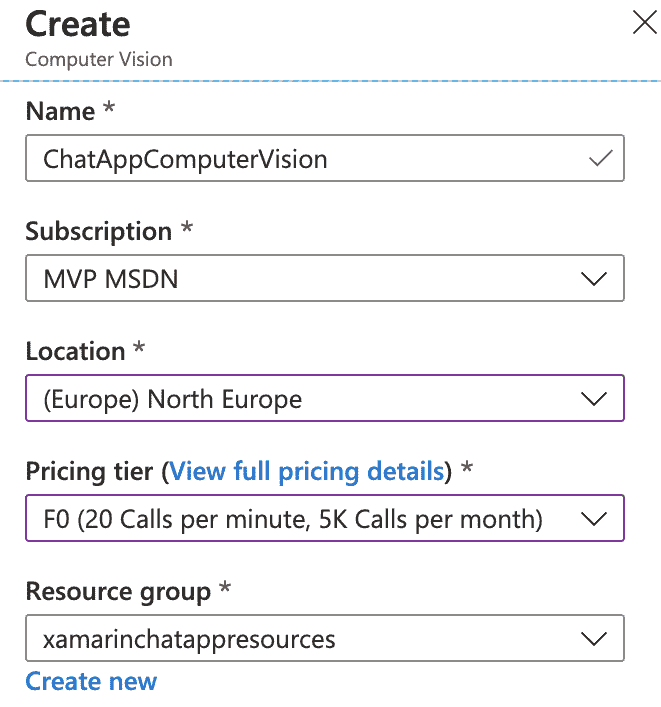
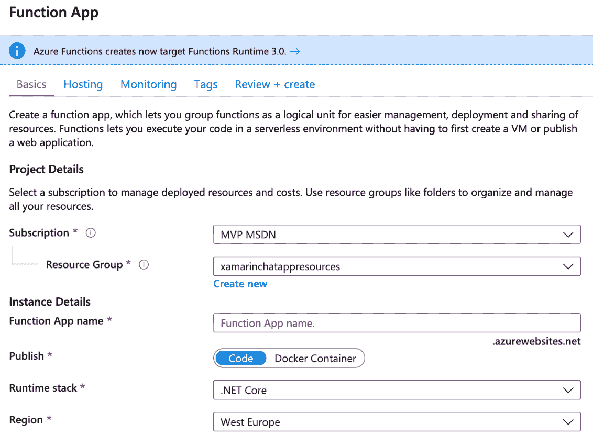
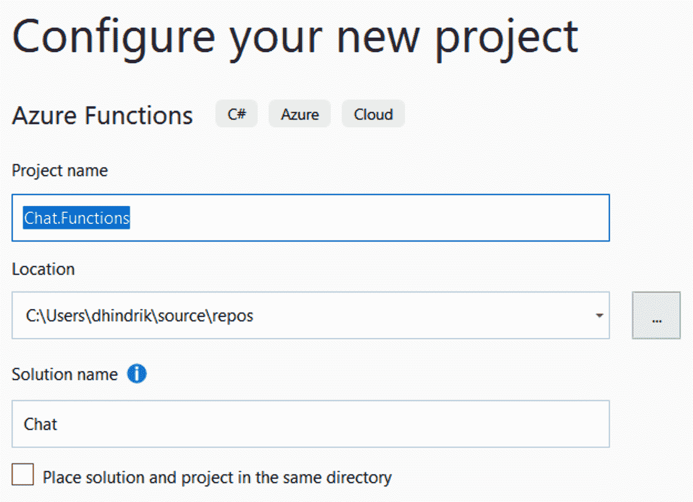
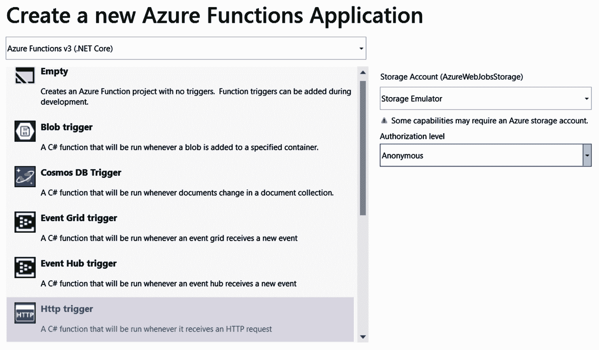
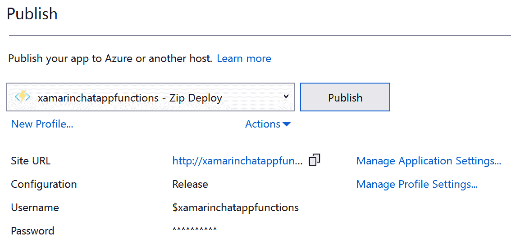

Setting Up a Backend for a Chat App Using Azure Services

在本章中，我们将为具有实时通信的聊天应用程序设置后端。我们将创建一个后端，它可以向上扩展以处理大量用户，但在用户数量减少时也可以向下扩展。为了构建该后端，我们将使用基于 Microsoft Azure 中的服务的无服务器体系结构。

本章将介绍以下主题：

*   了解不同的 Azure 无服务器服务
*   在 Microsoft Azure 中创建信号器服务
*   使用 Azure 函数作为**应用程序编程接口**（**API**）
*   使用 Azure 函数调度作业
*   使用 Azure Blob 存储来存储照片
*   使用 Azure 认知服务和 Customer Vision API 扫描照片中的成人内容

# 技术要求

要完成此项目，您需要安装 Visual Studio for Mac 或 PC。请参阅[第 1 章](08.html)*Xamarin 简介*，了解如何设置您的环境的详细信息。

您还需要一个 Azure 帐户。如果您有 VisualStudio 订阅，则每个月都会包含特定数量的 Azure 积分。要激活您的 Azure 权益，请转到以下链接：[https://my.visualstudio.com](https://my.visualstudio.com)

您还可以创建一个免费帐户，通过该帐户，您可以在 12 个月内免费使用选定的服务。您将获得价值 200 美元的积分，可以在 30 天内浏览任何 Azure 服务，您还可以随时使用免费服务。请在以下链接中阅读更多内容：[https://azure.microsoft.com/en-us/free/](https://azure.microsoft.com/en-us/free/)

# 了解不同的 Azure 无服务器服务

在开始使用无服务器架构构建后端之前，我们需要定义*无服务器*的实际含义。当然，在无服务器架构中，代码将在服务器上运行，但我们不需要担心这一点；我们唯一需要关注的是构建我们的软件。我们让其他人处理与服务器有关的所有事情。我们不需要考虑服务器需要多少内存或**CPU**（**中央处理器】**，甚至不需要考虑我们需要多少服务器。当我们在 Azure 中使用服务时，Microsoft 会为我们解决这一问题。

## Azure 信号服务

**Azure 信号服务**是**Microsoft Azure**中的一项服务，用于服务器和客户端之间的实时通信。该服务将向客户端推送内容，而客户端无需轮询服务器即可获得内容更新。SignalR 可用于多种类型的应用程序，包括移动应用程序、web 应用程序和桌面应用程序。

如果该选项可用，信号器将使用 WebSocket。如果不是，信号器将使用其他通信技术，如**服务器发送事件**（**SSE**）或**长轮询**。Signal 将检测可用的传输技术并使用它，而开发人员根本不必考虑它。

信号器可用于以下示例：

*   **聊天应用程序**：当新消息可用时，该应用程序需要服务器进行更新
*   **协同应用**：例如，会议应用或多台设备上的用户使用同一文档时
*   **多人游戏**：所有用户都需要其他用户的实时更新
*   **仪表板应用**：用户需要实时更新的地方

## Azure 函数

Azure Functions 是 Microsoft Azure 服务，它允许我们以无服务器的方式运行代码。我们将部署称为**函数**的小块代码。**功能分组部署，称为**功能应用**。当我们创建一个功能应用程序时，我们需要选择是在消费计划上运行还是在应用程序服务计划上运行。如果我们希望应用程序完全没有服务器，那么我们选择一个消费计划，而对于应用程序服务计划，我们必须指定服务器的要求。使用消耗计划时，我们需要支付执行时间和函数使用的内存量。应用程序服务计划的一个好处是，您可以将其配置为始终打开，并且只要不必扩展到更多实例，就不会有任何冷启动。消费计划的最大好处在于，它将始终根据当时需要的资源进行扩展。**

 **有几种方法可以触发函数运行。两个例子是`HttpTrigger`和`TimeTrigger`。`HttpTrigger`将在 HTTP 请求调用函数时触发函数运行。使用`TimeTrigger`，函数将以我们可以指定的间隔运行。还有其他 Azure 服务的触发器。例如，我们可以将一个函数配置为在将文件上载到 Azure Blob 存储、将新消息发布到事件中心或服务总线，或者在 Azure Cosmos DB 服务中更改数据时运行。

## Azure Blob 存储

Azure Blob 存储用于存储非结构化数据对象，如图像、视频、音频和文档。对象或 blob 可以组织到容器中。Blob 存储可以在 Azure 中的多个数据中心上冗余。这是为了保护数据不受意外事件的影响，这些事件包括瞬时硬件故障、网络或电源中断，甚至是大规模自然灾害。Azure 中的 Blob 存储可以有不同的层，这取决于我们希望使用存储的对象的频率。其中包括归档层和冷层，以及热层和高级层，它们用于我们需要更频繁地访问数据的应用程序。除了 Blob 存储，我们还可以添加一个**内容交付网络**（**CDN**，使存储中的内容更接近用户。如果我们的用户遍布全球，这一点很重要。如果我们能够从离用户较近的地方交付内容，我们可以减少内容的加载时间，并为用户提供更好的体验。

## Azure 认知服务

描述**Azure 认知服务**最简单的方式是将**机器学习**作为一项服务。只需一个简单的 API 调用，我们就可以在应用程序中使用机器学习，没有机器学习，我们就必须使用复杂的数据科学技术。当我们使用 API 时，我们是在对微软为我们培训的模型进行预测。

Azure 认知服务中的服务分为五类，具体如下：

*   **视觉**：视觉服务是关于图像处理的。这些包括用于人脸识别、成人内容检测、图像分类和**光学字符识别**（**OCR**的 API。
*   **知识**：知识服务的一个例子是**问答**（**QnA**）制作者，允许我们使用知识库训练模型。当我们训练了模型后，我们可以在提问时使用它来获得答案。
*   **语言**：语言服务是关于理解文本的，例如文本分析、语言理解和翻译。
*   **语音**：语音 API 的示例包括说话人识别、语音文本功能和语音翻译。
*   **搜索**：搜索服务是利用网络搜索引擎的强大功能来找到问题的答案。这些包括从图像中获取知识、自动完成搜索查询以及识别相似的人。

# 项目概述

该项目的主要目标是为聊天应用程序设置后端。该项目最大的部分将是我们将在 Azure 门户中执行的配置。我们还将为 Azure 函数编写一些代码，这些函数将处理信号器连接。将有一个函数返回有关信号机连接的信息，还有一个函数向信号机服务发送消息。我们将向其发布消息的函数还将确定消息是否包含图像。如果有，它将被发送到 Azure 认知服务中的 Vision API，以分析它是否包含成人内容。如果有，它将不会被发布到信号服务，其他用户也不会得到它。由于信令服务对消息的大小有限制，我们需要将图像存储在 Blob 存储器中，只需将图像的**统一资源定位符**（**URL**）发布给用户即可。因为我们不在此应用程序中保存任何聊天历史记录，所以我们还希望在特定时间间隔清除 Blob 存储。为此，我们将创建一个使用`TimeTrigger`的函数。

下图显示了此应用程序体系结构的概述：


完成这部分工程的预计时间约为 2 小时。

# 构建无服务器后端

让我们根据上一节中描述的服务开始设置后端。

## 创建信号机服务

我们将设置的第一个服务是信号机服务。要创建此类服务，请按以下步骤进行：

1.  转到 Azure 门户，位于[https://portal.azure.com](https://portal.azure.com) 。
2.  创建一个新资源。**信号机服务**资源属于 Web 类别。
3.  在表单中填写资源的名称。
4.  选择要用于此项目的订阅。
5.  我们建议您创建一个新的资源组，并将其用于我们将为此项目创建的所有资源。我们需要一个资源组的原因是，跟踪与此项目相关的资源更容易，同时删除所有资源也更容易。
6.  选择靠近用户的位置。
7.  选择定价层。对于这个项目，我们可以使用免费层。我们可以始终使用免费层进行开发，然后扩展到可以处理更多连接的层。
8.  将 ServiceMode 设置为无服务器。
9.  在创建信号机服务之前，单击“查看+创建”以查看设置。
10.  单击“创建”以创建存储帐户。

请参阅以下屏幕截图以查看上述信息：


这就是建立信号服务所需要做的一切。稍后，我们将在 Azure 门户中返回到它，以获取到它的连接字符串。

## 创建存储帐户

下一步是建立一个存储帐户，我们可以在其中存储用户上传的图像。要创建这样一个帐户，请按以下步骤操作：

1.  创建新的存储帐户资源。存储帐户位于存储类别下。
2.  选择订阅和资源组。我们建议您使用与信号机服务相同的设备。
3.  为存储帐户指定一个名称。

4.  选择靠近用户的位置。
5.  选择一个性能选项。如果我们使用高级存储，数据将存储在**固态驱动器**（**SSD**磁盘上。为此项目选择标准存储。
6.  将 StorageV2 用于帐户种类字段。
7.  在复制字段中，我们可以选择希望数据在数据中心之间复制的方式。
8.  对于访问层，我们将使用 Hot，因为我们需要经常访问此应用程序中的数据。
9.  在创建存储帐户之前，单击“查看+创建”以查看设置。
10.  单击“创建”以创建存储帐户。

请参阅以下屏幕截图以查看上述信息：


Blob 存储配置的最后一步是转到资源并为聊天图像创建一个容器。要执行此操作，请执行以下操作：

1.  转到资源并选择容器。
2.  创建一个名为`chatimages`的新容器。
3.  将公共访问级别设置为 Blob（仅限 Blob 的匿名读取访问）。这意味着它将具有公共读取权限，但您必须获得上传内容的授权。

请参阅以下屏幕截图以查看上述信息：


## 创建 Azure 认知服务

为了能够使用 Azure**认知服务**扫描成人内容的图像，我们需要在 Azure 门户中创建一个资源。这将为我们提供一个在调用 API 时可以使用的密钥。进行如下工作：

1.  创建一个新的计算机视觉资源。
2.  为资源指定名称并选择订阅。
3.  选择靠近用户的位置。
4.  选择定价层。
5.  选择与为其他资源选择的资源组相同的资源组。
6.  单击“确定”创建新资源。

请参阅以下屏幕截图以查看上述信息：



我们现在已经完成了认知服务的创建。稍后我们将回来获取一个密钥，我们将使用该密钥对 API 进行调用。

## 使用 Azure 函数作为 API

我们将在后端编写的所有代码都将在 Azure 函数中。那么，让我们开始吧。

### 为函数创建 Azure 服务

在开始编写任何代码之前，我们将创建函数应用程序。这将包含 Azure 门户中的功能。进行如下工作：

1.  创建新的**F****功能**应用资源。函数 app 位于 Compute 类别下。
2.  为函数应用程序命名。该名称也将是函数 URL 的开始。
3.  选择功能应用程序的订阅。
4.  为功能应用程序选择一个资源组，该资源组应与我们在本章中创建的其他资源相同。
5.  选择.NET Core 作为函数的运行时堆栈。然后，它将在.NETCore3 运行时的顶部运行。
6.  选择离用户最近的位置。

请参阅以下屏幕截图以查看上述信息：



7.  转到主机选项卡。
8.  对于存储，我们可以创建一个新的存储帐户，也可以使用我们在本项目前面创建的帐户。
9.  我们将使用消费计划作为我们的托管计划，所以我们只为我们使用的东西付费。如果我们选择了一个消费计划，功能应用程序将根据我们的需求进行上下扩展，而无需我们考虑。
10.  在创建功能应用程序之前，单击“查看+创建”以查看设置。
11.  单击“创建”以创建功能应用程序。

请参阅以下屏幕截图以查看上述信息：


### 创建函数以返回信号器服务的连接信息

如果需要，可以在 Azure 门户中创建函数。但是，我更喜欢使用 VisualStudio，因为代码编辑体验要好得多，而且您可以使用源代码管理。进行如下工作：

1.  在 Visual Studio 中创建新项目。
2.  在搜索字段中搜索`function`以查找 Azure 功能的模板。
3.  单击 Azure 函数模板继续，如以下屏幕截图所示：


4.  将项目命名为`Chat.Functions`。
5.  将解决方案命名为`Chat`，如下图所示：



下一步是创建第一个函数，如下所示：

1.  在对话框顶部选择 Azure Functions v3（.NET Core）。
2.  选择 Http 触发器作为第一个函数的触发器。
3.  将**授权级别**从 Admin 更改为 Anonymous。
4.  单击 OK 继续，我们的 functions 项目将被创建。

请参阅以下屏幕截图以查看上述信息：



我们的第一个函数将返回信号器服务的连接信息。为此，我们需要通过向信号器服务添加连接字符串来连接函数，如下所示：

1.  转到 Azure 门户中的信号器服务资源。
2.  转到“键”选项卡并复制连接字符串。
3.  转到函数应用程序资源并在应用程序设置下添加连接字符串。使用`AzureSignalRConnectionString`作为设置的名称。

4.  将连接字符串添加到 Visual Studio 项目中`local.settings.json`文件中的`Values`数组中，以便能够在开发机器上本地运行该函数，如以下代码块所示：

```cs
 {
    "IsEncrypted": false,
    "Values": {
    "AzureWebJobsStorage": "",
    "AzureWebJobsDashboard": ""
    "AzureSignalRConnectionString": "{EnterTheConnectingStringHere}"
   }
 } 
```

现在，我们可以为返回连接信息的函数编写代码。转到 Visual Studio 并按照以下说明操作：

1.  在 Functions 项目中安装`Microsoft.Azure.WebJobs.Extensions.SignalRService`NuGet 包。该包包含我们需要与信号器服务通信的类。如果在此过程中发生错误，并且您无法安装该软件包，请确保您拥有项目中所有其他软件包的最新版本，然后重试。
2.  将创建函数项目时创建的函数重命名为`GetSignalRInfo`。
3.  另外，将该类重命名为`GetSignalRInfo`。
4.  为了实现与信号器服务的绑定，我们将在函数的方法中添加一个`SignalRConnectionInfo`类型的参数。该参数还将具有`SignalRConnectionInfo`属性，该属性指定`HubName`。
5.  返回连接信息参数，如以下代码块所示：

```cs
using Microsoft.AspNetCore.Http;
using Microsoft.Azure.WebJobs;
using Microsoft.Azure.WebJobs.Extensions.Http;
using Microsoft.Azure.WebJobs.Extensions.SignalRService;

    [FunctionName("GetSignalRInfo")]
    public static SignalRConnectionInfo GetSignalRInfo(
    [HttpTrigger(AuthorizationLevel.Anonymous)] HttpRequest req,
    [SignalRConnectionInfo(HubName = "chat")] SignalRConnectionInfo   
    connectionInfo)
{
    return connectionInfo;
}
```

### 创建消息库

现在我们将定义两个消息类，用于发送聊天消息。我们将创建一个基本消息类，该类将包含所有类型消息之间共享的信息。我们还将为这些消息创建一个单独的项目，它将是一个.NET 标准库。我们将它创建为一个单独的.NET 标准库的原因是，我们可以在下一章构建的应用程序中重用它。进行如下工作：

1.  创建一个新的.NET 标准 2.1 项目并将其命名为`Chat.Messages`。
2.  在`Chat.Functions`项目中添加对`Chat.Messages`的引用。
3.  在`Chat.Messages`项目中创建一个新类，并将其命名为`Message`。
4.  在`Message`类中添加`TypeInfo`属性。稍后在[第 9 章](09.html)中*构建实时聊天应用程序*中我们将需要该属性，届时我们将执行消息序列化。
5.  为`Id`添加一个`string`**类型的属性。**
***   为`Timestamp`添加一个`DateTime`**类型的属性。*****   为`Username`添加一个`string`**类型的属性。*****   添加一个空构造函数。*   添加以用户名作为参数的构造函数。*   设置所有特性的值，如以下代码块所示：******

```cs
public class Message
{
    public Type TypeInfo { get; set; }
    public string Id {get;set;}
    public string Username { get; set; }
    public DateTime Timestamp { get; set; }

    public Message(){}
    public Message(string username)
    {
        Id = Guid.NewGuid().ToString();
        TypeInfo = GetType();
        Username = username;
        Timestamp = DateTime.Now;
    }
}
```

当新客户端正在连接时，将向其他用户发送一条消息，指示他们已连接。要创建此消息，请按以下步骤进行操作：

1.  创建一个名为`UserConnectedMessage`的新类。
2.  将`Message`设置为基类。
3.  添加一个空构造函数。
4.  添加一个以用户名为参数的构造函数，并将其发送给基类的构造函数，如以下代码段所示：

```cs
public class UserConnectedMessage : Message
{
    public UserConnectedMessage() { }
    public UserConnectedMessage(string username) : base(username) { }
} 
```

当客户端发送带有文本的消息时，它将发送一个`SimpleTextMessage`。要创建此消息，请按以下步骤进行操作：

1.  创建一个名为`SimpleTextMessage`的新类。
2.  添加`Message`作为基类。
3.  添加一个空构造函数。
4.  添加一个将用户名作为参数的构造函数，并将其发送给基类的构造函数。
5.  添加一个名为`Text`的`string`属性。请参阅以下代码段：

```cs
public class SimpleTextMessage : Message
{
    public SimpleTextMessage(){}
    public SimpleTextMessage(string username) : base(username){} 
    public string Text { get; set; }
} 
```

如果用户上传图像，它将作为`base64`字符串发送给函数。要创建这样的字符串，请按以下步骤进行操作：

1.  创建一个名为`PhotoMessage`的新类。
2.  添加`Message`作为基类。
3.  添加一个空构造函数。
4.  添加一个将用户名作为参数的构造函数，并将其发送给基类的构造函数。

5.  添加一个名为`Base64Photo`的`string`属性。
6.  添加一个名为`FileEnding`的`string`属性，如下代码段所示：

```cs
public class PhotoMessage : Message
{
    public PhotoMessage() { }
    public PhotoMessage(string username) : base(username) { }

    public string Base64Photo { get; set; }
    public string FileEnding { get; set; }
} 
```

我们将创建的最后一条消息用于向用户发送有关照片的信息。进行如下工作：

1.  创建一个名为`PhotoUrlMessage`的新类。
2.  添加`Message`作为基类。
3.  添加一个空构造函数。
4.  添加一个将用户名作为参数的构造函数，并将其发送给基类的构造函数。
5.  添加一个名为`Url`的`string`属性。请参阅以下代码段：

```cs
public class PhotoUrlMessage : Message
{
    public PhotoUrlMessage() {}
    public PhotoUrlMessage(string username) : base(username){}

    public string Url { get; set; }
} 
```

### 创建存储辅助程序

我们将创建一个助手，在我们将创建的`SendMessages`函数和`ClearPhotos`函数之间共享我们将为 Azure Blob 存储编写的一些代码。要在本地使用 Aure Blob 存储，我们需要将连接字符串添加到我们的`local.settings.json`文件中。

如果导航到 Azure 门户中的存储帐户资源，您将在 Access Key 下找到连接字符串，如以下屏幕截图所示：


连接字符串的名称将为`StorageConnection`。另外，向`AzureWebJobsStorage`键添加相同的连接字符串，如以下代码块所示：

```cs
{
     "IsEncrypted": false,
     "Values": {
          "AzureWebJobsStorage": "{EnterTheConnectingStringHere}",
          "AzureWebJobsDashboard": "",
          "AzureSignalRConnectionString": "{EnterTheConnectingStringHere}"
          "StorageConnection": "{EnterTheConnectingStringHere}"
       }
 }
```

您还需要向 Azure 门户中的函数添加键和值。导航到功能应用程序资源并将其添加到应用程序设置中。

对于帮助器，我们将创建一个新的静态类，如下步骤所述：

1.  在`Chat.Functions`项目中安装`Microsoft.Azure.Storage.Blob NuGet`包。这是为了获得使用 Azure Blob 存储所需的类。
2.  在`Chat.Functions`项目中创建一个名为`StorageHelper`的新类。
3.  上课`static`。
4.  创建一个名为`GetContainer`的新静态方法。

5.  使用`Environment`类上的静态`GetEnvironmentVariable`方法读取要存储的连接字符串。
6.  在`CloudStorageAccount`类上使用静态`Parse`方法创建它的`CloudStorageAccount`对象。
7.  在`CloudStorageAccount`类上使用`CreateCloudBlobClient`方法创建一个新的`CloudBlobClient`实例。
8.  使用`CloudBlobClient`类上的`GetContainerReference`方法获取容器引用，并将我们在本章前面创建的容器的名称作为参数传递。

所有这些都在以下代码块中进行了说明：

```cs
using Microsoft.WindowsAzure.Storage;
using Microsoft.WindowsAzure.Storage.Blob;
using System;
using System.IO;
using System.Threading.Tasks;
using System.Linq;

public static class StorageHelper
{

    private static CloudBlobContainer GetContainer()
    {    
        string storageConnectionString =  
        Environment.GetEnvironmentVariable("StorageConnection");
        var storageAccount =   
        CloudStorageAccount.Parse(storageConnectionString);
        var blobClient = storageAccount.CreateCloudBlobClient();

        var container = 
        blobClient.GetContainerReference("chatimages");

        return container;
    } 
}
```

要将文件上载到 Blob 存储，我们将创建一个方法，该方法将照片的字节和照片的类型作为参数。照片类型将由其文件结尾定义，操作如下：

1.  创建一个新的返回`Task<string>`的`async static`方法。
2.  在方法中添加一个`byte[]`和一个`string`参数。命名参数`bytes`和`fileEnding`。
3.  调用`GetContainer`方法获取对容器的引用。
4.  为新 blob 定义一个文件名，并将其用作`CloudBlobContainer`类中`GetBlockBlobReference`的参数。使用`GUID`作为文件名以确保其唯一性。
5.  创建一个字节的`MemoryStream`。
6.  使用`BlockBlobReference`类上的`UploadFromStreamAsync`方法将照片上传到云端。
7.  返回水滴的`AbsoluteUri`。

所有这些都在以下代码块中进行了说明：

```cs
public static async Task<string> Upload(byte[] bytes, string fileEnding)
{
  var container = GetContainer();
  var blob = container.GetBlockBlobReference($"  
  {Guid.NewGuid().ToString()}.{fileEnding}");

  var stream = new MemoryStream(bytes);
  await blob.UploadFromStreamAsync(stream);

  return blob.Uri.AbsoluteUri;
} 
```

我们将添加到帮助器的第二个公共方法是删除所有超过一小时的照片的方法。进行如下工作：

1.  创建一个名为`Clear`的新`async static`方法，该方法返回`Task`。
2.  使用`GetContainer`方法获取容器的引用。
3.  使用下面的代码块中显示的参数调用`ListBlobsSegmentedAsync`方法，获取容器中的所有 blob。
4.  循环通过`CloudBlob`类型的所有 blob。

5.  添加一个`if`语句，检查照片是否是一个多小时前创建的。如果是，则应删除 blob。请参阅以下代码块：

```cs
public static async Task Clear()
{
    var container = GetContainer();
    var blobList = await 
    container.ListBlobsSegmentedAsync(string.Empty, false, 
    BlobListingDetails.None, int.MaxValue, null, null, null);

    foreach(var blob in blobList.Results.OfType<CloudBlob>())
    {
        if(blob.Properties.Created.Value.AddHours(1) < 
          DateTime.Now)
        {
            await blob.DeleteAsync();
        }
    }
} 
```

### 创建用于发送消息的函数

为了处理用户发送的消息，我们将创建一个新函数，如下所示：

1.  创建具有`HttpTrigger`和匿名访问权限的函数。
2.  将函数命名为`Messages`。
3.  添加`SignalRMessages`的集合。
4.  使用`SignalR`属性指定集线器名称。请参阅以下代码段：

```cs
[FunctionName("Messages")]
  public async static Task SendMessages(
    [HttpTrigger(AuthorizationLevel.Anonymous, "post")] object 
     message,
    [SignalR(HubName = "chat")] IAsyncCollector<SignalRMessage>    
     signalRMessages)
  { 
```

`message`参数将是用户发送的消息。它将是`JObject`类型（从`Newtonsoft.Json`开始）。我们需要将其转换为之前创建的`Message`类型。为此，我们需要添加对`Chat.Messages`项目的引用。但是，由于参数是`object`类型，我们首先需要将其强制转换为`JObject`。完成此操作后，我们可以使用`ToObject`方法获取消息，如以下代码段所示：

```cs
var jsonObject = (JObject)message;
var msg = jsonObject.ToObject<Message>();
```

如果消息是`PhotoMessage`，我们会将照片上传到 Blob 存储。所有其他消息将使用`signalRmessages`参数上的`AddAsync`方法直接发送至信号机服务，如以下代码块所示：

```cs
if (msg.TypeInfo.Name == nameof(PhotoMessage))
{
    //ToDo: Upload the photo to blob storage.
}

await signalRMessages.AddAsync(new SignalRMessage
  {
    Target = "newMessage",
    Arguments = new[] { message }
 }); 
```

在使用我们创建的助手将照片上载到 Blob 存储之前，我们需要将`base64`字符串转换为`byte[]`。进行如下工作：

1.  使用`Converter`类上的静态`FromBase64String`方法将`base64`字符串转换为`byte[]`。
2.  使用`StorageHelper`上的静态`Upload`方法将照片上传到 Blob 存储器。
3.  创建一个新的`PhotoUrlMessage`类，将用户名传递给构造函数，并将其设置为`msg`变量的值。
4.  将`Timestamp`属性设置为原始消息的值，因为我们感兴趣的是用户何时创建消息。
5.  将`Id`属性设置为原始消息的值，以便在客户端将其作为同一消息处理。
6.  将`Url`属性设置为上传照片时`StorageHelper`返回的 URL。

7.  使用`signalRMessages`变量上的`AddAsync`方法向信号机服务发送消息。
8.  添加一个空的`return`语句。请参阅以下代码块：

```cs
if (msg.TypeInfo.Name == nameof(PhotoMessage))
{
    var photoMessage = jsonObject.ToObject<PhotoMessage>(); 
    var bytes = Convert.FromBase64String(photoMessage.Base64Photo);
    var url = await StorageHelper.Upload(bytes, 
    photoMessage.FileEnding);
 msg = new PhotoUrlMessage(photoMessage.Username)
 {
        Id = photoMessage.Id,
 Timestamp = photoMessage.Timestamp,
 Url = url
 }; await signalRMessages.AddAsync(new SignalRMessage
                                   {
                                    Target = "newMessage",
                                    Arguments = new[] { message }
                                    }); 
    return;
}
```

# 使用计算机视觉 API 扫描成人内容的照片

为了最大限度地降低在聊天应用程序中显示攻击性照片的风险，我们将使用机器学习来尝试查找有问题的内容，并防止将其发布到聊天应用程序中。为此，我们将在 Azure 中使用**计算机视觉 API**，它是**Azure 认知服务**的一部分。要使用 API，我们需要一个密钥。我们将其添加到功能应用程序的应用程序设置中。进行如下工作：

1.  转到 Azure 门户。
2.  转到我们为计算机视觉 API 创建的资源。
3.  可以在“关键点和端点”选项卡下找到该关键点。您可以使用键 1 或键 2，如以下屏幕截图所示：


4.  转到功能应用程序的资源。
5.  将密钥添加为名为`ComputerVisionKey`的应用程序设置。另外，将密钥添加到`local.settings.json`。
6.  另外，将端点添加为应用程序设置。使用名称`ComputerVisionEndpoint`。端点可以在 Function App 资源的 Overview 选项卡下找到。另外，将端点添加到`local.settings.json`。
7.  在 Visual Studio 的`Chat.Functions`项目中安装
    `Microsoft.Azure.CognitiveServices.Vision.ComputerVision`NuGet 包。这是**获取使用计算机视觉 API 所需的类。**
***   调用计算机视觉 API 的代码将添加到`Message`函数中。之后，我们将`base 64`字符串转换为`byte[]`。*   基于`byte[]`创建`MemoryStream`。*   创建一个`ComputerVisonClient`，并将凭证发送给构造函数。*   创建一个列表，列出我们在分析照片时将使用的功能。在这种情况下，我们将使用`VisualFeatureTypes.Adult`特性。**

 **12.  使用`ComputerVisionClient`上的`AnalyzeImageInStreamAsync`方法，将流和特征列表传递给构造器分析照片。
13.  如果结果为`IsAdultContent`，则使用空的`return`语句停止函数的执行，如下代码块所示：

```cs
var stream = new MemoryStream(bytes); 
  var subscriptionKey =   
  Environment.GetEnvironmentVariable("ComputerVisionKey");
  var computerVision = new ComputerVisionClient(new   
  ApiKeyServiceClientCredentials(subscriptionKey), new 
  DelegatingHandler[] { });

  computerVision.Endpoint =   
  Environment.GetEnvironmentVariable("ComputerVisionEndpoint");

  var features = new List<VisualFeatureTypes>() { 
  VisualFeatureTypes.Adult };

  var result = await   
  computerVision.AnalyzeImageInStreamAsync(stream, features);

if (result.Adult.IsAdultContent)
{
    return;
} 
```

## 创建计划作业以从存储中清除照片

我们要做的最后一件事是定期清理 Blob 存储，并删除超过 1 小时的照片。我们将通过创建一个由`TimeTrigger`触发的函数来实现这一点。进行如下工作：

1.  要创建新功能，请右键单击`Chat.Functions`项目，然后单击“添加”菜单下的“新建 Azure 功能”。
2.  将函数命名为`ClearPhotos`。
3.  选择函数将使用计时器触发器的选项，因为我们希望它按时间间隔运行。
4.  使用 CRON 表达式使其每 60 分钟运行一次。将日程**设置为`0 */60 * * * *`，如下图所示：**

 **

If you want to read more about CRON expressions, you can do so by going to the following URL: [https://docs.microsoft.com/en-us/azure/azure-functions/functions-bindings-timer?tabs=csharp#ncrontab-expressions](https://docs.microsoft.com/en-us/azure/azure-functions/functions-bindings-timer?tabs=csharp#ncrontab-expressions)

在`ClearPhotos`函数中，我们要做的唯一一件事就是调用我们在本章前面创建的`StorageHelper`类的`Clear`方法，并将`void`替换为`async Task`，如下代码片段所示：

```cs
[FunctionName("ClearPhotos")]
  public static async Task Run(
    [TimerTrigger("0 */60 * * * *")]TimerInfo myTimer, ILogger log)
{
    await StorageHelper.Clear();
} 
```

## 将函数部署到 Azure

本章的最后一步是将函数部署到 Azure。您可以将其作为**持续集成/持续部署**（**CI/CD**）管道的一部分，例如，使用 Azure DevOps。但在本例中，部署函数的最简单方法是直接从 VisualStudio 进行部署。执行以下步骤以部署功能：

1.  右键点击`Chat.Functions`项目，选择发布。
2.  选择“选择现有”选项。此外，请选中`Run from package`文件选项。
3.  单击“创建配置文件”按钮。
4.  登录到我们创建**功能应用程序**资源时在 Azure 门户中使用的同一个 Microsoft 帐户。
5.  选择包含功能应用程序的订阅。现在将加载订阅中的所有功能应用程序。
6.  选择功能应用程序并单击“确定”。
7.  创建配置文件后，单击“发布”按钮。

下面的屏幕截图显示了最后一步。之后，将创建发布配置文件：



# 总结

在本章中，我们学习了如何设置无服务器后端，以便与 Azure 功能和 Azure Signal 服务进行实时通信。我们还学习了如何使用 Azure Blob 存储和机器学习**以及 Azure 认知服务来扫描照片中的成人内容。**

 **在下一章中，我们将构建一个聊天应用程序，它将使用我们在这个项目中构建的后端。**************