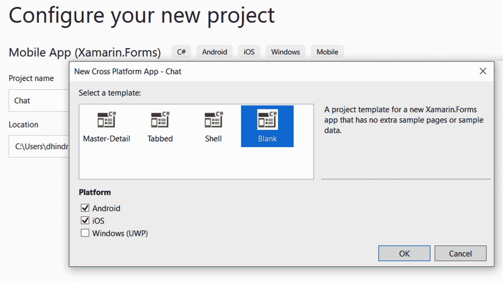

Building a Real-Time Chat Application

在本章中，我们将构建一个实时通信的聊天应用程序。在该应用程序中，您将能够向其他用户发送和接收消息以及来自其他用户的照片，这些信息和照片无需手动刷新即可显示。我们将研究如何使用 signar 实现与服务器的实时连接。

本章将介绍以下主题：

*   如何在 Xamarin.Forms 应用程序中使用 SignalR
*   如何为 CollectionView 使用模板选择器
*   如何在 Xamarin.Forms 应用程序中使用 CSS 样式

让我们开始吧。

# 技术要求

在为本项目构建应用程序之前，您需要构建我们在[第 8 章](08.html)*中详细介绍的后端，为使用 Azure 服务*的聊天应用程序设置后端。您还需要安装 Visual Studio for Mac 或 PC，以及 Xamarin 组件。有关如何设置您的环境的详细信息，请参见[第 1 章](09.html)、*Xamarin 简介*。本章的源代码可在本书的 GitHub 存储库中获得：[https://github.com/PacktPublishing/Xamarin.Forms-4-Projects](https://github.com/PacktPublishing/Xamarin.Forms-4-Projects) 。

# 项目概述

在构建聊天应用程序时，实时通信非常重要，因为用户希望消息或多或少立即到达。为了实现这一点，我们将使用 Signal，这是一个用于实时通信的库。如果 WebSocket 可用，Signaler 将使用 WebSocket，如果不可用，它将有几个备用选项可以替代。在应用程序中，用户可以从设备上的照片库发送文本和照片。

此项目的构建时间约为 180 分钟。

# 开始

我们可以在 PC 上使用 Visual Studio 2019，也可以在 Mac 上使用 Visual Studio 来完成此项目。要使用 Visual Studio for PC 构建 iOS 应用程序，必须连接 Mac。如果你根本无法访问 Mac，你可以选择只构建应用程序的 Android 部分。

# 构建聊天应用程序

是时候开始构建应用程序了。我们建议您使用我们在[第 8 章](08.html)中使用的相同解决方案*为使用 Azure 服务*的聊天应用程序设置后端，因为这将使代码共享更容易。在该解决方案中，我们创建了一个名为`Chat`的移动应用程序（Xamarin.Forms）：


选择空白模板和 iOS 和 Android 作为平台。现在我们已经创建了项目，我们将把所有 NuGet 软件包更新为最新版本，因为项目模板的更新频率不如模板中使用的软件包的更新频率：



## 创建聊天服务

我们要做的第一件事是创建一个聊天服务，iOS 和 Android 应用程序都将使用该服务。为了使代码更易于测试，并且如果我们将来想使用另一个提供商，则更容易更换聊天服务，我们需要执行以下步骤：

1.  在`Chat`项目中，添加对`Chat.Messages`项目的引用。
2.  在`Chat`项目中创建一个名为`Services`的新文件夹。
3.  在`Services`文件夹中创建一个名为`IChatService`的新接口。
4.  创建一个名为`IsConnected`的`bool`属性。
5.  创建一个名为`SendMessage`**的方法，该方法将`Message`作为参数并返回`Task`。**

 **6.  创建一个名为`CreateConnection`的方法，该方法返回`Task`。此方法将创建并启动到信号器服务的连接。
7.  创建一个名为`Dispose`的方法，该方法返回`Task`。此方法将在应用程序进入睡眠状态时使用，以确保与信号服务的连接已正确关闭：

```cs
using Chat.Events;
using Chat.Messages;
using System;
using System.Threading.Tasks;

namespace Chat.Services
{
    public interface IChatService
    {        
        bool IsConnected { get; }

        Task CreateConnection();
        Task SendMessage(Message message);
        Task Dispose();
    }     
}
```

接口也将包含一个事件，但是在我们将事件添加到接口之前，我们将创建一个事件将使用的`EventArgs`类。执行以下步骤：

1.  在`Chat`项目中，创建一个名为`Events`的新文件夹。
2.  在`Events`文件夹中创建一个名为`NewMessageEventArgs`的新类。
3.  添加`EventArgs`作为基类。
4.  使用公共 getter 和私有 setter 创建一个名为`Message`的`Message`类型的属性。
5.  创建一个空构造函数。
6.  创建一个以`Message`为参数的构造函数。
7.  将构造函数的参数设置为`Message`属性。

以下代码是完成这些步骤的结果：

```cs
using Chat.Messages;
using System;
namespace Chat.Events
{
    public class NewMessageEventArgs : EventArgs
    {
        public Message Message { get; private set; }

        public NewMessageEventArgs(Message message)
        {
            Message = message;
        }
    } 
}
```

现在我们已经创建了一个新的`EventArgs`类，我们可以使用它并向接口添加一个事件。我们将把活动命名为`NewMessage`：

```cs
public interface IChatService
{
 event EventHandler<NewMessageEventArgs> NewMessage;

    bool IsConnected { get; }

    Task CreateConnection();
    Task SendMessage(Message message);
    Task Dispose();
} 
```

我们在该服务中要做的第一件事是调用我们在[第 8 章](08.html)中创建的`GetSignalRInfo`服务*使用 Azure Services*为聊天应用程序设置后端，以获取有关如何连接信号机服务的信息。要序列化该信息，我们将创建一个新类，如下所示：

1.  在`Chat`项目中，创建一个名为`Models`的新文件夹。
2.  创建一个名为`ConnectionInfo`的新类。
3.  为我们的`string`添加一个名为`Url`的字符串属性。
4.  为我们的`string`添加一个名为`AccessToken`的字符串属性：

```cs
public class ConnectionInfo
{
   public string Url { get; set; }
   public string AccessToken { get; set; }
} 
```

现在我们有了接口和模型来获取连接信息，现在是时候创建一个`IChatService`接口的实现了。要使用 signar，我们需要为 NuGet 添加一个包，该包将为我们提供必要的类。执行以下步骤：

1.  在`Chat`项目中，安装`Microsoft.AspNetCore.SignalR.Client`和`Newtonsoft.Json`NuGet 软件包。
2.  在`Services`文件夹中，创建一个名为`ChatService`的新类。

3.  将`IChatService`接口添加到`ChatService`并实现。
4.  为名为`httpClient`的`HttpClient`添加一个私有字段。
5.  为名为`hub`的`HubConnection`添加一个私有字段。
6.  为名为`semaphoreSlim`的`SemaphoreSlim`添加一个私有字段，并在构造函数中创建一个初始和最大计数为`1`的新实例：

```cs
using Chat.Events;
using Chat.Messages;
using Microsoft.AspNetCore.SignalR.Client;
using Newtonsoft.Json;
using System;
using System.Net.Http;
using System.Text;
using System.Threading;
using System.Threading.Tasks;

public class ChatService : IChatService
{
    private HttpClient httpClient;
    private HubConnection hub;
    private readonly SemaphoreSlim semaphoreSlim = 
       new SemaphoreSlim(1, 1);     

    public event EventHandler<NewMessageEventArgs> NewMessage;
    public bool IsConnected { get; set; }

    public async Task CreateConnection() 
    {
    }

    public async Task SendMessage(Message message) 
    {
    }

    public async Task Dispose()
    {
    } 
}
```

我们将从`CreateConnection`开始，它将调用`GetSignalRInfo`函数。然后，我们将使用响应中的信息连接到信号器服务并开始侦听消息。为此，请执行以下步骤：

1.  添加对`SemaphoreSlim`的`WaitAsync`方法的调用，以确保在任何时候只有一个线程可以使用该方法。

2.  检查`httpClient`是否为`null`。如果是，请创建一个新实例。我们将重用`httpClient` 实例，因为从性能角度来看这更好。
3.  调用`GetSignalRInfo`并将结果序列化到`ConnectionInfo`对象：

```cs
public async Task CreateConnection()
{
    await semaphoreSlim.WaitAsync();

 if(httpClient == null)
 { 
 httpClient = new HttpClient();
 }

 var result = await     httpClient.GetStringAsync("https://{theNameOfTheFunctionApp}.azurewebsites.net/api/GetSignalRInfo");

 var info = JsonConvert.DeserializeObject<Models.ConnectionInfo>
    (result); 
}
```

当我们掌握了有关如何连接信号机服务的必要信息时，我们可以使用`HubConnectionBuilder`创建连接。然后，我们可以开始监听消息：

1.  创建一个新的`HubConnectionBuilder`。
2.  使用`WithUrl`方法指定信号器服务的 URL 作为第一个参数。第二个参数是一个`HttpConnectionObject`类型的`Action`。这意味着您将获得一个`HttpConnectionObject`类型的对象作为参数。
3.  在操作中，将`AccessTokenProvider`设置为返回`ConnectionInfo`对象的`AccessToken`属性值的`Func`。
4.  使用`HubConnectionBuilder`的`Build`方法创建连接对象。
5.  使用`HubConnection`对象上的`On<object>`方法添加一个`Action`，在新消息到达时运行。该操作将被指定为第二个参数。对于第一个参数，我们将指定目标的名称（我们在[第 8 章](08.html)中指定了目标，*在发送消息时为使用 Azure 服务*的聊天应用程序设置后端），即`newMessage`。

6.  在`Action`中，使用`ToString`方法将传入消息转换为字符串，并将其反序列化为`Message`对象，以便读取其`TypeInfo`属性。为此，请使用`JsonConvert`类和`DeserializeObject<Message>`方法。

The reason we have to deserialize the object twice is that we only get the value of properties in the `Message` class the first time we use it. When we know which subclass of `Message` we've received, we can use this to deserialize that information for that class. We are casting it to `Message` so that we can pass it to the `NewMessageEventArgs` object. In this case, we will not lose the properties of the subclass. To access the properties, we just cast the class back to the subclass.

7.  当我们知道消息是什么类型时，我们可以使用它将对象反序列化为实际类型。使用`JsonConvert`的`DeserializeObject`方法，将 JSON 字符串和`TypeInfo`传递给它，然后将其强制转换为`Message`。
8.  调用`NewMessage`事件，并将`ChatService`的当前实例和一个新的`NewMessageEventArgs`对象传递给它。将`Message`对象传递给`NewMessageEventArgs`的构造函数。
9.  一旦我们有了一个连接对象，并且配置了消息到达时会发生什么，我们就可以使用`HubConnection`的`StartAsync`方法开始监听消息。
10.  将`IsConnected`属性设置为`true`。
11.  使用`SemaphoreSlim`的`Release`方法让其他线程进入`CreateConnection`方法：

```cs
var connectionBuilder = new HubConnectionBuilder();
connectionBuilder.WithUrl(info.Url, (Microsoft.AspNetCore.Http.Connections.Client.HttpConnectionOptions obj) =>
    {
        obj.AccessTokenProvider = () => Task.Run(() => 
        info.AccessToken);
    });

hub = connectionBuilder.Build();
hub.On<object>("newMessage", (message) =>
{
     var json = message.ToString();
     var obj = JsonConvert.DeserializeObject<Message>(json);
     var msg = (Message)JsonConvert.DeserializeObject(json, obj.TypeInfo);
     NewMessage?.Invoke(this, new NewMessageEventArgs(msg));
});

await hub.StartAsync();

IsConnected = true;
semaphoreSlim.Release();
```

我们需要实现的下一个方法是`SendMessage`。这将向 Azure 功能发送消息，该功能将向信号器服务添加消息：

1.  使用`JsonConvert`类上的`Serialize`方法将`Message`对象序列化为 JSON。
2.  创建一个`StringContent`对象，并将 JSON 字符串作为第一个参数，`Encoding.UTF8`作为第二个参数，`application/json`内容类型作为最后一个参数传递给构造函数。
3.  如果`httpClient`变量为`null`，则创建`HttpClient`的新实例。
4.  在`HttpClient`对象上使用`PostAsync`方法，URL 作为第一个参数，`StringContent`对象作为第二个参数，以便将消息发布到函数：

```cs
public async Task SendMessage(Message message)
{
    var json = JsonConvert.SerializeObject(message);

    var content = new StringContent(json, Encoding.UTF8, 
    "application/json");

   if (httpClient == null)
   {
       httpClient = new HttpClient();
   }   

    await 
    httpClient.PostAsync
("https://{TheNameOfTheFunctionApp}.azurewebsites.net/api/messages"
, content);
} 
```

我们需要实现的最后一种方法是`Dispose`。这将在应用程序进入后台状态时关闭连接，例如，当用户点击主页按钮或切换应用程序时：

1.  使用`WaitAsync`方法确保在运行该方法时，没有线程试图创建连接或处理连接。
2.  添加一个`if`语句以确保中心字段不是`null`。
3.  如果不是`null`，则调用`HubConnection`的`StopAsync`和`DisposeAsync`方法。
4.  将`httpClient`字段设置为`null`。
5.  将`IsConnected`设置为`false`。
6.  用`Release`方法释放`SemaphoreSlim`**：**

```cs
public async Task Dispose()
{
    await semaphoreSlim.WaitAsync();

    if(hub != null)
    {
        await hub.StopAsync();
        await hub.DisposeAsync();
    }

    httpClient = null;

    IsConnected = false;

    semaphoreSlim.Release();
} 
```

## 初始化应用程序

现在，我们准备编写应用程序的初始化代码。我们将设置**控制反转**（**IoC**并进行必要的配置。

### 创建冲突解决程序

我们需要创建一个助手类，该类将简化通过`Autofac`解析对象图的过程。这将帮助我们基于配置的 IoC 容器创建类型。

在本项目中，我们将使用`Autofac`作为国际奥委会图书馆：

1.  在`Chat`项目中安装`Autofac`NuGet 包。
2.  在`Chat`项目中创建一个名为`Resolver`的新类。
3.  添加一个名为`container`的`IContainer`类型的`private static`字段（来自`Autofac`。
4.  添加一个名为`Initialize`的公共静态方法，参数为`IContainer`。将参数值设置为`container`字段。
5.  添加一个名为`Resolve`的通用静态公共方法，该方法将返回一个基于参数类型的实例，`Resolve`方法为`IContainer`：

```cs
using Autofac;

public class Resolver
{
     private static IContainer container;

     public static void Initialize(IContainer container)
{
          Resolver.container = container;
     }

     public static T Resolve<T>()
     {
          return container.Resolve<T>();
     }
} 
```

### 创建引导程序

在这里，我们将创建一个`Bootstrapper`类，以便我们可以在应用程序的启动阶段设置我们需要的通用配置。通常，每个目标平台都有`Bootstrapper`类的一部分，所有平台都共享一部分。在本项目中，我们只需要共享部分：

1.  在**`Chat`**项目中创建一个名为`Bootstrapper`的新类。****
*****   添加一个名为`Init`的新公共静态方法。*   创建一个新的`ContainerBuilder`并将类型注册到`container`。****

 ****4.  使用`ContainerBuilder`的`Build`方法创建一个`Container`。创建一个名为`container`的变量，该变量包含`Container`实例。
5.  使用`Resolver`上的`Initialize`方法，将`container`变量作为参数传递，如下代码所示：

```cs
using Autofac;
using Chat.Chat;
using System;
using System.Reflection;

public class Bootstrapper
{
     public static void Init()
     {
            var builder = new ContainerBuilder();

             builder.RegisterType<ChatService>().As<IChatService>
             ().SingleInstance();

             var currentAssembly = Assembly.GetExecutingAssembly();

             builder.RegisterAssemblyTypes(currentAssembly)
                      .Where(x => x.Name.EndsWith("View", 
                      StringComparison.Ordinal));

             builder.RegisterAssemblyTypes(currentAssembly)
                     .Where(x => x.Name.EndsWith("ViewModel", 
                     StringComparison.Ordinal));

             var container = builder.Build();

             Resolver.Initialize(container); 
     }
} 
```

调用`InitializeComponents`后，在`App.xaml.cs`文件的构造函数中调用`Bootstrapper`的`Init`方法：

```cs
public App()
{
    InitializeComponent();
    Bootstrapper.Init();
    MainPage = new MainPage();
} 
```

## 创建基础视图模型

我们现在有一个服务，负责处理与后端的通信。现在，是时候创建一个`View``Model`。但是，首先，我们将创建一个基本视图模型，在该模型中，我们可以放置将在应用程序的所有视图模型之间共享的代码：

1.  创建一个名为`ViewModels`的新文件夹。
2.  创建一个名为`ViewModel`的新类。
3.  使新类公开和抽象。
4.  添加一个名为`Navigation`的`INavigation`类型的静态字段。这将用于存储对 Xamarin.Forms 提供的导航服务的引用。
5.  添加一个名为`User`的`string`类型的静态字段。该字段将在连接聊天室服务时使用，以便显示您发送的消息并附上您的姓名。
6.  添加并实现`INotifiedPropertyChanged`接口。这是必要的，因为我们希望使用数据绑定。
7.  添加一个`Set`方法。这将使我们更容易从`INotifiedPropertyChanged`接口引发`PropertyChanged`事件。此方法将检查值是否已更改。如果有，它将引发事件：

```cs
using System.Collections.Generic;
using System.ComponentModel;
using System.Runtime.CompilerServices;
using Xamarin.Forms;

public abstract class ViewModel : INotifyPropertyChanged
{
     public static INavigation Navigation { get; set; }
     public static string User { get; set; } 

     public event PropertyChangedEventHandler PropertyChanged; 
     protected void Set<T>(ref T field, T newValue, 
                           [CallerMemberName] string propertyName = 
                           null)
     {
          if (!EqualityComparer<T>.Default.Equals(field, newValue))
          {
               field = newValue;
               PropertyChanged?.Invoke(this, new 
               PropertyChangedEventArgs(propertyName));
          }
     }
} 
```

## 创建主视图

现在我们已经建立了`ViewModel`基类，以及接收和发送消息的所有代码，是时候创建这两个视图了。这些将作为应用程序的用户界面。

我们将从创建主视图开始。这是用户启动应用程序时将显示的视图。我们将添加一个输入控件（一个输入文本框），这样用户就可以输入用户名并添加一个命令来导航到聊天视图。

主视图将由以下部分组成：

*   一个名为`MainViewModel.cs`的`ViewModel`文件
*   一个名为`MainView.xaml`的 XAML 文件，其中包含布局
*   一个名为`MainView.xaml.cs`的代码隐藏文件，将执行数据绑定过程

让我们从为`MainView`创建`ViewModel`开始。

### 创建 MainViewModel

我们将要创建的`MainViewModel`将保存一个用户名，用户将在 UI 中输入该用户名。它还将包含一个名为`Start`的`Command`属性。这将绑定到用户输入用户名后单击的`Button`：

1.  在`ViewModel`文件夹中，创建一个名为`MainViewModel.cs`的类。
2.  从`ViewModel`继承类。
3.  上课`public`。
4.  添加一个名为`Username`的`string`类型的属性。
5.  添加一个名为`Start`的`ICommand`类型的属性并实现它，如下代码所示。`Start`命令将从`Username`属性中分配`Username`并将其分配给基础`ViewModel`中的静态`User`属性。然后，它将使用`Resolver`创建`ChatView`的新实例，并将其推送到导航堆栈上。

`MainViewModel`现在应该如下所示：

```cs
using System.Windows.Input;
using Chat.Views;
using Xamarin.Forms;
 namespace Chat.ViewModels
 {
     public class MainViewModel : ViewModel
     {
         public string Username { get; set; }

         public ICommand Start => new Command(() =>
         {
             User = Username;

             var chatView = Resolver.Resolve<ChatView>();
             Navigation.PushAsync(chatView);
         });
     }
 }

```

现在我们有了`MainViewModel`，我们需要一个视图来配合它。现在是创建`MainView`的时候了。

### 创建主视图

`MainView`将显示一个用户界面，允许用户在开始聊天前输入姓名。本节将介绍如何创建`MainView`XAML 文件以及该视图背后的代码。

我们将首先删除生成的模板`MainPage`，并将其替换为 MVVM 友好的`MainView`。

#### 替换主页

当我们创建应用程序时，模板生成了一个名为`MainPage`的页面。由于我们使用 MVVM 作为模式，因此需要删除此页面，并将其替换为名为`MainView`的视图：

1.  在`Chat`项目的根目录中，删除名为`MainPage`的页面。
2.  创建一个名为`Views`的新文件夹。
3.  在`Views`文件夹中添加一个名为`MainView`的新 XAML 页面。

#### 编辑 XAML

现在，是时候向新创建的`MainView.xaml`文件添加一些内容了。这里提到的图标可以在添加到的同一文件夹中找到（您可以通过查看 GitHub 上的项目来检查这一点–GitHub URL 可以在本章开头找到）。这里发生了很多事情，因此请确保对照代码检查您编写的内容：

1.  将`chat.png`图标添加到 Android 项目中`Resources`文件夹内的`Drawable`文件夹中。
2.  将`chat@2x.png`图标添加到 iOS 项目的`Resources`文件夹中。
3.  打开`MainView.xaml`文件。
4.  将`Title`属性添加到`ContentPage`节点。这是将显示在应用程序导航栏中的标题。
5.  添加一个`Grid`并在其中定义两行。第一个应具有`"*"`高度，第二个应具有`"2*"`高度。这将把空间分成两行，第一行将占据空间的`1/3`，第二行将占据空间的`2/3`。
6.  添加一个`Image`，其中`Source`设置为`"chat.png"`，其`VerticalOptions`和`HorizontalOptions`设置为`"Center"`。

7.  添加`StackLayout`，将`Grid.Row`设置为`"1"`、`Padding`设置为`"10"`、`Spacing`设置为`"20"`。`Grid.Row`属性位置`StackLayout`在第二行。`Padding`在`StackLayout`周围增加 10 个空间单位，`Spacing`定义`StackLayout`中增加的每个元素之间的空间量。
8.  在`StackLayout`中，添加一个`Entry`节点，该节点的`Text`属性设置为`"{Binding UserName}"`，而`Placeholder`属性设置为`"Enter a username"`。绑定`Text`节点将确保当用户在`Entry`控件中输入值时，它在`ViewModel`中更新。
9.  在`StackLayout`中，添加一个`Button`控件，该控件的`Text`属性设置为`"Start"`，其`Command`属性设置为`"{Binding Start}"`。当用户点击按钮时，`Command`属性绑定将执行。它将运行我们在`MainViewModel`类中定义的代码。

完成后，代码应如下所示（以粗体显示）：

```cs
 <?xml version="1.0" encoding="UTF-8"?>
 <ContentPage  
              xmlns:x="http://schemas.microsoft.com/winfx/2009/xaml" 
              x:Class="Chat.Views.MainView" Title="Welcome">
     <Grid>
 <Grid.RowDefinitions>
 <RowDefinition Height="*" />
 <RowDefinition Height="2*" />
 </Grid.RowDefinitions>
 <Image Source="chat.png" VerticalOptions="Center" 
                                  HorizontalOptions="Center" />
 <StackLayout Grid.Row="1" Padding="10" Spacing="20">
 <Entry Text="{Binding Username}" 
             Placeholder="Enter a username" />
 <Button Text="Start" Command="{Binding Start}" />
 </StackLayout>
 </Grid>
 </ContentPage> 
```

布局完整。现在，我们需要把注意力转向这个视图背后的代码，这样我们就可以把一些零散的东西联系起来。

#### 修复视图背后的代码

与所有视图一样，在使用 MVVM 时，我们需要传递`ViewModel`的视图。因为我们在这个项目中使用依赖项注入，所以我们将把它传递给构造函数，然后将它分配给视图的`BindingContext`。我们还将确保启用安全区域，以避免控件部分隐藏在顶部的 iPhone X 凹槽后面：

1.  打开`MainView.xaml.cs`文件。
2.  在`MainView`类的构造函数中添加`MainViewModel`类型的参数`viewModel`。此参数的参数将在运行时由`Autofac`注入。
3.  添加一条`platform-specific`语句，指示应用程序使用 iOS 上的安全区域。安全区域确保应用程序不会占用 iPhone X 屏幕顶部凹口一侧的空间。
4.  将`viewModel`参数指定给视图的`BindingContext`属性。

需要进行的更改已在以下代码中以粗体标记：

```cs
using Chat.ViewModels;
using Xamarin.Forms;
using Xamarin.Forms.PlatformConfiguration.iOSSpecific;

using Xamarin.Forms.Xaml;

public partial class MainView : ContentPage
{
         public MainView(MainViewModel viewModel)
         {
             InitializeComponent();

             On<Xamarin.Forms.PlatformConfiguration.iOS>
             ().SetUseSafeArea(true);

             BindingContext = viewModel;
         }
     } 
```

现在，我们的`MainView`已经完成，但是我们仍然需要告诉应用程序使用它作为入口点视图。

### 设置主视图

入口点视图，也称为应用程序的`MainPage`，是在 Xamarin.Forms 应用程序初始化期间设置的。通常在`App`类的构造函数中设置。我们将通过前面创建的解析器创建`MainView`，并将其包装在`NavigationPage`中，以便在应用程序运行的设备上启用特定于平台的导航。我们也可以使用 Shell，但在这种情况下，没有理由使用它：

1.  打开`App.xaml.cs`文件。
2.  使用`Resolver`将实例解析为`MainView`类，并将其存储在名为`mainView`的变量中。
3.  通过将`mainView`变量作为构造函数参数传递并将其分配给名为`navigationPage`的变量，创建`NavigationPage`的新实例。
4.  将`navigationPage.Navigation`属性分配给`ViewModel`类型的静态`Navigation`属性。稍后在页面之间导航时将使用此属性。
5.  将`navigationPage`变量赋给`App`类的`MainPage`属性。这将设置应用程序的起始视图：

```cs
public App()
{
    InitializeComponent();
    Boostrapper.Init();

 var mainView = Resolver.Resolve<MainView>();
 var navigationPage = new NavigationPage(mainView);
 ViewModel.Navigation = navigationPage.Navigation;
 MainPage = navigationPage;
} 
```

`MainView`就是这样；又好又容易。现在，让我们转到更有趣的话题：`ChatView`。这将用于发送和接收消息。

## 创建聊天室视图

`ChatView`是标准的聊天客户端。它将有一个显示传入和传出消息的区域，底部还有一个文本字段，用户可以在其中键入消息。如果用户没有点击屏幕键盘上的*返回*，它还将有一个拍照按钮和一个发送消息的按钮。

我们将从创建`ChatViewModel`开始，它包含所有必要的逻辑，充当视图和模型之间的粘合剂。在本例中，我们的模型由我们的`ChatService`表示。

之后我们将创建`ChatView`，处理**图形用户界面**（**GUI**的呈现方式。

### 创建 ChatViewModel

正如我们前面提到的，`ChatViewModel`是视觉表现（`View`和模型（基本上是我们的`ChatService`）之间的粘合剂。`ChatViewModel`将通过连接发送和接收消息所需的功能来存储消息以及与`ChatService`进行的任何通信。

#### 创建类

`ChatViewModel`是一个简单的类，它继承了我们之前创建的`ViewModel`基类。在第一个代码练习中，我们将创建一个类，添加相关的`using`语句和一个名为`Messages`的属性，我们将使用该属性存储我们收到的消息。视图将使用`Message`集合在`ListView`中显示消息。

由于这是一大块代码，我们建议您先编写它，然后查看编号列表，以了解添加到类中的内容：

1.  在`Chat`项目的`ViewModels`文件夹中创建一个名为`ChatViewModel`的新类。
2.  创建类`public`并从`ViewModel`基类继承，从基类获得公共基类功能。
3.  添加一个名为`chatService`的`readonly`属性，其类型为`IChatService`。这将存储对实现`IChatService`的对象的引用，并使`ChatService`的具体实现可替换。最好将任何服务公开为接口。
4.  使用私有 setter 添加一个名为`Messages`的`public ObservableCollection<Message>`**类型的公共属性。此集合将保存所有邮件。私有 setter 使属性从此类外部无法访问。这通过确保消息不会插入类内部以外的任何位置来维护集合的完整性。**
***   添加一个名为`chatService`的构造函数参数，其类型为`IChatService`。当我们使用依赖注入时，`Autofac`将在这里注入一个实现`IChatService`的对象。*   在构造函数中，将`chatService`参数指定给`chatService`属性。这将存储对`ChatService`的引用，以便我们可以在`ChatViewModel`的生命周期内使用它。*   在构造函数中，将`Messages`属性实例化为新的`ObservableCollection<Message>`。*   在构造函数中，创建一个`Task.Run`语句，如果`chatService.IsConnected`属性为`false`，该语句将调用`chatService.CreateConnection()`方法。我们之所以使用`Task.Run`是因为我们希望代码异步运行，即使这是从构造函数中完成的。通过发送新的`UserConnected`消息结束`Task.Run`语句：**

```cs
 using System;
 using System.Collections.ObjectModel;
 using System.IO;
 using System.Linq;
 using System.Threading.Tasks;
 using System.Windows.Input;
 using Acr.UserDialogs;
 using Chat.Messages;
 using Chat.Services;
 using Plugin.Media;
 using Plugin.Media.Abstractions;
 using Xamarin.Forms;

 namespace Chat.ViewModels
 {
     public class ChatViewModel : ViewModel
     {
         private readonly IChatService chatService;
         public ObservableCollection<Message> Messages { get; 
         private set; }

         public ChatViewModel(IChatService chatService)
         {
             this.chatService = chatService;

             Messages = new ObservableCollection<Message>();

             Task.Run(async() =>
             {
                 if(!chatService.IsConnected)
                 {
                     await chatService.CreateConnection();
                 }

                 await chatService.SendMessage(new 
                 UserConnectedMessage(User));
             });
         }
    }
}
```

现在我们已经实例化了我们的`ChatViewModel`，是时候添加一个属性来保存用户当时键入的内容了。

#### 添加文本属性

在 GUI 的底部，将有一个文本字段（入口控件），允许用户输入消息。此条目将是绑定到我们将在`ChatViewModel`中调用`Text`的属性的数据。每当用户更改文本时，将设置此属性。这是数据绑定的典型案例：

1.  添加一个名为`text`的`string`**类型的新私有字段。**
***   添加一个名为`Text`的公共属性，该属性在 getter 中返回私有文本字段，并调用 setter 中基类的`Set()`方法。`Set`方法是在`ViewModel`基类中定义的，如果`ChatViewModel`中的属性发生变化，则会将事件发回视图，有效地保持它们的同步：**

```cs
private string text;
public string Text
{
    get => text;
    set => Set(ref text, value);
} 
```

现在，我们有了一个可以用于数据绑定的属性。让我们看看我们将用于接收来自`ChatService`的消息的代码。

#### 接收消息

当从服务器发送消息时，通过信号器，`ChatService`将解析该消息并将其转换为`Message`对象。然后，它将引发一个名为`NewMessage`的事件，该事件在`ChatService`中定义。

在本节中，我们将实现一个事件处理程序来处理这些事件，并将它们添加到`Messages`集合中，除非已经存在具有相同 ID 的消息。

同样，执行以下步骤并查看代码以掌握它：

1.  在`ChatViewModel`中，创建一个名为`ChatService_NewMessage`的方法，它将是一个标准事件处理程序。这有两个参数：`sender`属于`object`类型，而`e`属于`Events.NewMessageEventArgs`类型。
2.  将此方法中的代码包装在`Device.BeginInvokeOnMainThread()`中。我们之所以这样做，是因为我们将向`Message`集合添加消息。添加到此集合的项将修改视图，修改视图的任何代码都必须在 UI 线程上运行。
3.  在`Device.BeginInvokeOnMainThread`中，如果尚未出现具有特定`Message.Id`的消息，则将来自`e.Message`的传入消息添加到`Messages`集合中。这是为了避免消息重复。

该方法应如下所示：

```cs
private void ChatService_NewMessage(object sender, Events.NewMessageEventArgs e)
{
    Device.BeginInvokeOnMainThread(() =>
    {
        if (!Messages.Any(x => x.Id == e.Message.Id))
        {
            Messages.Add(e.Message);
        }
    });
} 
```

既然已经定义了事件处理程序，我们需要将其连接到构造函数中：

1.  找到`ChatViewModel`类的构造函数。
2.  将一个`chatService.NewMessage`事件连接到我们刚刚创建的`ChatService_NewMessage`处理程序。这样做的一个好地方是在`Messages`集合的实例化下。

粗体标记的代码是我们应该添加到`ChatViewModel`类中的代码：

```cs
public ChatViewModel(IChatService chatService)
{
    this.chatService = chatService;

    Messages = new ObservableCollection<Message>();

    chatService.NewMessage += ChatService_NewMessage;

    Task.Run(async() =>
    {
        if(!chatService.IsConnected)
        {
            await chatService.CreateConnection();
        }

        await chatService.SendMessage(new UserConnectedMessage(User));
    });
} 
```

该应用程序现在将能够接收消息。送去怎么样？好的，请继续收看！

#### 创建 LocalSimpleTextMessage 类

为了更容易识别消息是来自服务器还是由执行代码的设备的用户发送，我们将创建一个`LocalSimpleTextMessage`：

1.  在`Chat.Messages`项目中创建一个名为`LocalSimpleTextMessage`的新类。

2.  添加`SimpleTextMessage`作为基类。

3.  创建一个以`SimpleTextMessage`为参数的构造函数。

4.  使用参数中的值将值设置为所有基本特性，如以下代码所示：

```cs
public class LocalSimpleTextMessage : SimpleTextMessage
{
    public LocalSimpleTextMessage(SimpleTextMessage message)
    {
        Id = message.Id;
        Text = message.Text;
        Timestamp = message.Timestamp;
        Username = message.Username;
        TypeInfo = message.TypeInfo;
    }
}
```

#### 发送短信

发送短信也很简单。我们需要创建一个可以为 GUI 绑定的命令。该命令将在用户点击*返回*或用户点击发送按钮时执行。当用户执行这两项操作中的任何一项时，该命令将创建一个新的`SimpleTextMessage`并传入当前用户以识别其他用户的消息。我们将使用`ChatViewModel`文本属性中的文本，该属性反过来绑定到`Entry`控件。

然后，我们将消息添加到`Messages`集合中，触发`ListView`，该集合将处理需要更新的消息。之后，我们将消息传递给`ChatService`并清除`ChatViewModel`文本属性。通过这样做，我们通知 GUI 它已经更改，并让数据绑定魔法清除该字段。

请参考以下步骤并查看代码以掌握它：

1.  创建一个名为`Send`的`ICommand`类型的新属性。
2.  给它分配一个新的`Command`实例。
3.  通过将基类的`User`属性作为参数传递，创建`SimpleTextMessage`类的新实例。将实例分配给名为`message`的变量。
4.  将消息变量的`Text`属性设置为`ChatViewModel`类的`Text`属性。这将复制 GUI 稍后定义的聊天条目中的当前文本。
5.  创建一个`LocalSimpleTextMessage`对象，并将消息变量作为构造函数参数传入。`LocalSimpleTextMessage`是一个`SimpleTextMessage`，使得视图能够将其识别为应用程序用户发送的消息，有效地将其呈现在聊天区的右侧。将`LocalSimpleTextMessage`实例添加到`Messages`集合中。这将在视图中显示消息。
6.  调用`chatService.SendMessage()`方法并将消息变量作为参数传递。

7.  清空`ChatViewModel`的`Text`属性，清除 GUI 中的入口控件：

```cs
public ICommand Send => new Command(async()=> 
{
    var message = new SimpleTextMessage(User)
    {
        Text = this.Text
    };

    Messages.Add(new LocalSimpleTextMessage(message));

    await chatService.SendMessage(message);

    Text = string.Empty;
}); 
```

如果我们不能发送照片，聊天应用有什么用？我们将在下一节中实现这一点。

#### 安装 Acr.UserDialogs 插件

`Acr.UserDialogs`是一个插件，可以使用平台间共享的代码中的多个标准用户对话框。要安装和配置它，我们需要遵循以下几个步骤：

1.  为`Chat-`、`Chat.iOS`和`Chat.Android`项目安装`Acr.UserDialogs`**NuGet 软件包。**
***   在`MainActivity.cs`文件中，将`UserDialogs.Init(this)`添加到`OnCreate`方法中：**

```cs
protected override void OnCreate(Bundle savedInstanceState)
{
    TabLayoutResource = Resource.Layout.Tabbar;
    ToolbarResource = Resource.Layout.Toolbar;

    base.OnCreate(savedInstanceState);

    UserDialogs.Init(this);

    global::Xamarin.Forms.Forms.Init(this, savedInstanceState);
    LoadApplication(new App());
}
```

#### 安装媒体插件

我们将使用`Xam.Plugin.Media`NuGet 软件包访问设备的照片库。我们需要为解决方案中的`Chat-`、`Chat.iOS`和`Chat.Android`项目安装此软件包。然而，在使用该软件包之前，我们需要对每个平台进行一些配置。我们将从 Android 开始：

1.  插件需要`WRITE_EXTERNAL_STORAGE`**和`READ_EXTERNAL_STORAGE`权限。插件会为我们添加这些，但我们需要先覆盖`MainActivity.cs`中的`OnRequestPermissionResult`。**
***   调用`OnRequestPermissionsResult`方法。*   在`MainActivity.cs`文件中`OnCreate`方法初始化 Xamarin.Forms 后，增加`CrossCurrentActivity.Current.Init(this, savedInstanceState)`**，如下代码：****

```cs
public override void OnRequestPermissionsResult(int requestCode, string[] permissions, Android.Content.PM.Permission[] grantResults)
{
    Xamarin.Essentials.Platform.OnRequestPermissionsResult(requestCode, permissions, grantResults);
} 
```

我们还需要为用户能够从中挑选照片的文件路径添加一些配置：

1.  在 Android 项目的`Resources`文件夹中添加一个名为`xml`的文件夹。
2.  在新文件夹中创建一个名为`file_paths.xml`的新 XML 文件。
3.  将以下代码添加到`file_paths.xml`：

```cs
<?xml version="1.0" encoding="utf-8"?>
<paths xmlns:android="http://schemas.android.com/apk/res/android">
    <external-files-path name="my_images" path="Pictures" />
    <external-files-path name="my_movies" path="Movies" />
</paths>
```

我们需要为 Android 项目设置插件的最后一件事是在应用程序元素内的`AndroidManifest.xml`字段中添加以下代码：

```cs
<manifest xmlns:android="http://schemas.android.com/apk/res/android" android:versionCode="1" android:versionName="1.0" package="xfb.Chat">
<uses-sdk android:minSdkVersion="21" android:targetSdkVersion="27" />
     <application android:label="Chat.Android">
      <provider 
      android:name="android.support.v4.content.FileProvider"   
      android:authorities="${applicationId}.fileprovider" 
      android:exported="false" android:grantUriPermissions="true">
 <meta-data android:name="android.support.FILE_PROVIDER_PATHS" 
      android:resource="@xml/file_paths"></meta-data>
 </provider>
     </application>
 </manifest> 
```

对于 iOS 项目，我们只需要在`info.plist`中添加以下四个使用说明：

```cs
<key>NSPhotoLibraryUsageDescription</key>
<string>This app needs access to photos.</string>
<key>NSPhotoLibraryAddUsageDescription</key>
<string>This app needs access to the photo gallery.</string>
```

#### 发送照片

为了能够发送照片，我们必须使用照片来源。在我们的例子中，我们将使用手机的摄像头作为源。相机将在拍摄后以流的形式返回照片。我们需要将该流转换为字节数组，然后 Base64 将其编码为易于通过信号器发送的字符串。

我们将要创建的方法称为`ReadFully()`，它获取一个流并将其转换为字节数组，这是实现 Base64 编码字符串的一个步骤。这是一段标准代码，它创建了一个缓冲区，当我们读取`Stream`参数并将其分块写入`MemoryStream`时将使用该缓冲区，直到我们读取了整个流，因此该方法的名称。

执行以下步骤，并检查代码以掌握它：

1.  创建一个名为`ReadFully`的方法，该方法将名为`input`的`stream`作为参数，并返回一个`byte`数组。
2.  在`using`语句中，创建一个名为`ms`的新`MemoryStream`。
3.  将输入`Stream`复制到内存流中。
4.  使用`ToArray`方法返回`MemoryStream`作为数组：

```cs
private byte[] ReadFully(Stream input)
{
    using (MemoryStream ms = new MemoryStream())
    {
        ms.CopyTo(input);
        return ms.ToArray();
    }
}
```

这样做之后，我们就剩下一大块代码了。此代码公开了当用户单击应用程序中的照片按钮时将执行的命令。首先配置`CrossMedia`（一个媒体插件），指示照片的质量，然后启动照片选择器。当照片采集器从`async`呼叫返回`PickPhotoAsync()`时，我们开始上传照片。为了通知用户，我们使用`UserDialogs.Instance.ShowLoading`创建一个加载覆盖，并显示一条消息，表明我们正在上载照片。

然后，我们将获取照片流，使用`ReadFully()`方法将其转换为字节数组，并将其 Base64 编码为字符串。字符串将被包装在一个`PhotoMessage`实例中，添加到`ChatViewModel`的本地`Message`集合中，然后发送到服务器。

执行以下步骤并学习代码以掌握它：

1.  创建一个名为`Photo`的`ICommand`类型的新属性。给它分配一个新的`Command`实例。
2.  创建一个匿名的`async`方法（一个 lambda 表达式），并将在接下来的步骤中定义的代码添加到该方法中。您可以在下面的代码段中看到此方法的完整代码。
3.  创建`PickMediaOptions`类的新实例，并将`CompressionQuality`属性设置为`50`。
4.  使用`async`方法调用调用`CrossMedia.Current.PickPhotoAsync`，并将结果保存到名为`photo`的局部变量中。
5.  安装 NuGet 软件包。
6.  通过使用文本`"Uploading photo"`调用`UserDialogs.Instance.ShowLoading()`显示消息对话框。
7.  通过调用 photo 变量的`GetStream()`方法获取 photostream，并将其保存为名为`stream`的变量。

8.  通过调用`ReadFully()`方法将流转换为字节数组。
9.  使用`Convert.ToBase64String()`方法将字节数组转换为 Base64 编码字符串。将字符串另存为名为`base64photo`的变量。

10.  创建一个新的`PhotoMessage`实例并传递`User`作为构造函数参数。使用 string 对象的`Split`函数将`Base64Photo`属性设置为`base64photo`变量，将`FileEnding`属性设置为`photo.Path`字符串的文件结尾。将新的`PhotoMessage`实例存储在名为`message`的变量中。
11.  将消息对象添加到`Messages`集合中。
12.  通过调用异步`chatService.SendMessage()`方法将消息发送到服务器。
13.  通过调用`UserDialogs.Instance.HideLoading()`隐藏加载对话框。

下面的代码显示了如何实现这一点：

```cs
public ICommand Photo => new Command(async() =>
{
    var options = new PickMediaOptions();
    options.CompressionQuality = 50;

    var photo = await CrossMedia.Current.PickPhotoAsync();

    UserDialogs.Instance.ShowLoading("Uploading photo");

    var stream = photo.GetStream();
    var bytes = ReadFully(stream);

    var base64photo = Convert.ToBase64String(bytes);

    var message = new PhotoMessage(User)
    {
        Base64Photo = base64photo,
        FileEnding = photo.Path.Split('.').Last()
    };

    Messages.Add(message);
    await chatService.SendMessage(message);

    UserDialogs.Instance.HideLoading();
}); 
```

`ChatViewModel`已完成。现在，是时候创建我们的 GUI 了。

### 创建聊天室视图

`ChatView`负责创建用户将与之交互的用户界面。它将显示本地和远程消息，包括文本和照片，并在其他用户加入聊天时通知用户。我们将首先创建一个转换器，它将以 Base64 编码字符串表示的照片转换为一个`ImageSource`，可以用作 XAML 中图像控制过程的源。

#### 创建 Base64ToImageConverter

当我们使用手机摄像头拍照时，它将作为字节数组传递给我们。要将其发送到服务器，我们将其转换为 Base64 编码字符串。要在本地显示该消息，我们需要将其转换回字节数组，然后将该字节数组传递给`ImageSource`类的助手方法，以创建`ImageSource`对象的实例。此对象对`Image`控件有意义，并显示图像。

由于这里有很多代码，我们建议您执行以下步骤，并在遵循这些步骤时详细查看每一行代码：

1.  在`Chat`项目中创建一个名为`Converters`的文件夹。
2.  在`Converters`文件夹中新建一个名为`Base64ImageConverter`的类；确保类实现了`IValueConverter`接口。
3.  在类的`Convert()`方法中，将`value`对象参数强制转换为一个名为`base64String`的字符串。
4.  使用`System.Convert.FromBase64String()`方法将`base64String`转换成字节数组。将结果保存在名为`bytes`的变量中。
5.  通过将字节数组传递到其构造函数中，创建一个新的`MemoryStream`。将流保存在名为`stream`的变量中。
6.  调用`ImageSource.FromStream()`方法并将流作为返回流变量的 lambda 表达式传递。返回通过此操作创建的`ImageSource`对象。
7.  不需要实现`ConvertBack()`方法，因为我们永远不会通过数据绑定将图像转换回 Base64 编码字符串。我们就让它抛出一个`NotImplementedException`：

```cs
using System;
using System.Globalization;
using Xamarin.Forms;
using System.IO;

namespace Chat.Converters
{
    public class Base64ToImageConverter : IValueConverter
    {
        public object Convert(object value, Type targetType, 
                              object parameter, CultureInfo 
                               culture)
        {
            var base64string = (string)value;
            var bytes = 
            System.Convert.FromBase64String(base64string);
            var stream = new MemoryStream(bytes);
            return ImageSource.FromStream(() => stream);
        }

        public object ConvertBack(object value, Type targetType,
                                  object parameter, CultureInfo 
                                  culture)
        {
            throw new NotImplementedException();
        }
    }
} 
```

现在，开始向视图添加一些实际的 XAML 代码。我们将从创建主布局框架开始，然后逐步构建主布局框架，直到完成视图。

#### 创建骨架视图

这个 XAML 文件将包含一个视图，其中列出了我们发送的消息和接收的消息。要创建的文件相当大，因此对于这一部分，我建议您复制 XAML 并仔细研究每个步骤：

1.  在名为`ChatView`的`Views`文件夹中创建一个新的 XAML`ContentPage`。
2.  为`Chat.Selectors`和`Chat.Converters`添加 XML 名称空间，并将其命名为`selectors`和`converters`。
3.  添加一个`ContentPage.Resources`节点。这将包含此视图的资源。
4.  添加`ScrollView`作为页面内容。`ScrollView`只有在屏幕键盘可见时才能在 iOS 上滚动处理。在 Android 上，这是不必要的，并且会导致一些其他问题。对于 Android，使用`OnPlatform`将`Orientation`设置为`Neither`，对于 iOS，使用`Vertical`。
5.  添加`Grid`作为`ScrollView`的唯一子项，并通过将`x:Name`属性设置为`MainGrid`将其命名为`MainGrid`。

6.  创建一个包含三行的`RowDefinitions`元素。第一个应具有`*`高度，第二个应具有`1`高度，第三个应具有基于平台的平台特定高度，使用`OnPlatform`元素。
7.  为稍后插入的`CollectionView`节省一些空间。
8.  添加一个`BoxView`。通过将`HeightRequest`属性设置为`1`、`BackgroundColor`属性设置为`#33000000`、`Grid.Row`属性设置为`1`，这将充当视觉分隔符。这将把`BoxView`定位在一个单位高的网格行中，有效地在屏幕上画出一条线。
9.  添加另一个`Grid`。这将通过将`Grid.Row`属性设置为`2`来使用第三行的空间。另外，通过将`Padding`属性设置为`10`来添加一些填充。在网格中定义高度为`30`、`*`和`30`的三行：

```cs
<?xml version="1.0" encoding="UTF-8"?>
<ContentPage  
             xmlns:x="http://schemas.microsoft.com/winfx/2009/xaml" 
             xmlns:selectors="clr-namespace:Chat.Selectors" 
             xmlns:converters="clr-namespace:Chat.Converters" 
             x:Class="Chat.Views.ChatView">
    <ContentPage.Resources>
        <!-- TODO Add resources -->
    </ContentPage.Resources>
    <ScrollView>
    <ScrollView.Orientation>
          <OnPlatform x:TypeArguments="ScrollOrientation">
              <On Platform="iOS" Value="Vertical" />
              <On Platform="Android" Value="Neither" />
          </OnPlatform>
      </ScrollView.Orientation>
        <Grid x:Name="MainGrid">
            <Grid.RowDefinitions>
                <RowDefinition Height="*" />
                <RowDefinition Height="1" />
                <RowDefinition>
                    <RowDefinition.Height>
                        <OnPlatform x:TypeArguments="GridLength">
                            <On Platform="iOS" Value="50" />
                            <On Platform="Android" Value="100" />
                        </OnPlatform>
                    </RowDefinition.Height>
                </RowDefinition>
            </Grid.RowDefinitions>

            <!-- TODO Add CollectionView -->

            <BoxView Grid.Row="1" HeightRequest="1" 
            BackgroundColor="#33000000" />
            <Grid Grid.Row="2" Padding="10">
                <Grid.ColumnDefinitions>
                    <ColumnDefinition Width="30" />
                    <ColumnDefinition Width="*" />
                    <ColumnDefinition Width="30" />
                </Grid.ColumnDefinitions>
                <!-- TODO Add buttons and entry controls -->

             </Grid>
         </Grid>
     </ScrollView>
 </ContentPage> 
```

现在我们已经完成了页面的主要框架，我们需要开始添加一些特定的内容。首先，我们将添加`ResourceDictionary`以创建`DataTemplate`选择器。这将为不同的聊天信息选择正确的布局。然后，我们需要使用`Base64ToImageConverter`。为此，我们需要在视图中定义它。

#### 添加 ResourceDictionary

现在，是向视图添加一些资源的时候了。在本例中，我们将添加一个模板选择器，稍后我们将创建该选择器，以及前面创建的`Base64ToImageConverter`。模板选择器将查看我们将绑定到`ListView`的每一行。这将显示消息并选择适合该消息的最佳布局模板：

1.  在`ContentPage.Resources`元素中找到`<!-- TODO Add resources -->`注释。
2.  在*步骤 1*中提到的注释正下方，向样本添加 XAML，如下所示：

```cs
        <ResourceDictionary>
            <selectors:ChatMessageSelector 
            x:Key="SelectMessageTemplate" />
            <converters:Base64ToImageConverter x:Key="ToImage" />
        </ResourceDictionary>
```

这将为我们定义的每个资源创建一个实例，并使视图的其余部分可以访问它们。

#### 添加 CollectionView

我们将使用`CollectionView`在聊天应用程序中显示消息。再次执行以下步骤并查看代码，以确保您理解每个步骤：

1.  在`ChatView.xaml`文件中找到`<!-- TODO Add CollectionView -->`注释。
2.  添加一个`CollectionView`并将`x:Name`属性设置为`MessageList`。

3.  通过将`ItemsSource`属性设置为`{Binding Messages}`进行数据绑定`CollectionView`。这将使`CollectionView`了解`ObservableCollection<Message>`中所做的任何更改，这些更改通过`Messages`属性公开。无论何时添加或删除消息，`ListView`都将更新以反映此更改。

4.  将上一节中定义的`SelectMessageTemplate`资源添加到`ItemTemplate`属性中。这将在每次添加项时运行一些代码，以确保以编程方式为特定消息选择正确的可视模板。现在不要担心这个问题，我们很快就会为此编写代码。
5.  现在，我们需要定义一个占位符来添加资源。我们将添加的资源是用于呈现不同类型消息的不同*数据模板*。

XAML 应如下所示：

```cs
<CollectionView x:Name="MessageList" ItemsSource="{Binding Messages}" 
 ItemTemplate="{StaticResource SelectMessageTemplate}">
   <CollectionView.Resources>
     <ResourceDictionary>
       <!-- Resources go here later on --> 
     </ResourceDictionary>
   </CollectionView.Resources>
</CollectionView>
```

#### 添加模板

现在，我们将添加五个不同的模板，每个模板对应于应用程序发送或接收的特定消息类型。这些模板中的每一个都在上一节代码片段的`<!-- Resources go here later on -->`注释下。

我们不会一步一步地解释这些模板中的每一个，因为它们所包含的 XAML 现在应该开始让您感到熟悉了。

每个模板都以相同的方式启动：根元素是一个带有名称的`DataTemplate`。名称很重要，因为我们很快就会在代码中引用它。该元素后面的内容是构建行的实际内容。

`DataTemplate`中的绑定也将是`CollectionView`呈现的每个项目或行的本地绑定。在本例中，它将是一个`Message`类的实例，因为我们将`CollectionView`数据绑定到`Message`对象的集合。您将在代码中看到一些`StyleClass`属性。这些将在我们使用**层叠样式表**（**CSS**完成应用程序的样式设置时使用。

我们在这里的任务是在`<!-- Resources go here later on -->`注释下编写每个模板。

`SimpleText`是当`Message`是远程消息时选择的`DataTemplate`。它将呈现在列表视图的左侧，正如您所期望的那样。显示`username`和`text`信息：

```cs
<DataTemplate x:Key="SimpleText">
        <Grid Padding="10">
            <Grid.ColumnDefinitions>
                <ColumnDefinition Width="*" />
                <ColumnDefinition Width="*" />
            </Grid.ColumnDefinitions>
            <Frame StyleClass="remoteMessage" HasShadow="false">
                <StackLayout>
                 <Label Text="{Binding Username}" 
                  StyleClass="chatHeader" />
                 <Label Text="{Binding Text}" StyleClass="chatText" />
                </StackLayout>
            </Frame>
        </Grid>
</DataTemplate>
```

`LocalSimpleText`模板与`SimpleText`数据模板相同，只是通过将`Grid.Column`属性设置为`1`在`CollectionView`右侧进行渲染，有效地使用了右侧列：

```cs
<DataTemplate x:Key="LocalSimpleText">
        <Grid Padding="10">
            <Grid.ColumnDefinitions>
                <ColumnDefinition Width="*" />
                <ColumnDefinition Width="*" />
            </Grid.ColumnDefinitions>
            <Frame Grid.Column="1" StyleClass="localMessage" 
            HasShadow="false">
                <StackLayout>
                  <Label Text="{Binding Username}" 
                  StyleClass="chatHeader" />
                  <Label Text="{Binding Text}" StyleClass="chatText" />
                </StackLayout>
            </Frame>
        </Grid>
</DataTemplate> 
```

`DataTemplate`在用户连接聊天室时使用：

```cs
<DataTemplate x:Key="UserConnected">
        <StackLayout Padding="10" BackgroundColor="#33000000" 
        Orientation="Horizontal">
            <Label Text="{Binding Username}" StyleClass="chatHeader" 
            VerticalOptions="Center" />
            <Label Text="connected" StyleClass="chatText" 
            VerticalOptions="Center" />
        </StackLayout>
</DataTemplate>
```

上传到服务器的照片可以通过 URL 访问。此`DataTemplate`显示基于 URL 的图像，用于远程图像：

```cs
<DataTemplate x:Key="Photo">
        <Grid Padding="10">
            <Grid.ColumnDefinitions>
                <ColumnDefinition Width="*" />
                <ColumnDefinition Width="*" />
            </Grid.ColumnDefinitions>
            <StackLayout>
                <Label Text="{Binding Username}" 
                 StyleClass="chatHeader" />
                <Image Source="{Binding Url}" Aspect="AspectFill" 
                HeightRequest="150" HorizontalOptions="Fill" />
            </StackLayout>
        </Grid>
</DataTemplate>
```

包含照片的消息由用户发送，并直接基于我们从相机生成的 Base64 编码图像进行渲染。因为我们不想等待图像上传，所以我们使用这个`DataTemplate`，它利用我们之前编写的`Base64ImageConverter`将字符串转换为`Image`控件可以显示的`ImageSource`：

```cs
<DataTemplate x:Key="LocalPhoto">
        <Grid Padding="10">
            <Grid.ColumnDefinitions>
                <ColumnDefinition Width="*" />
                <ColumnDefinition Width="*" />
            </Grid.ColumnDefinitions>
            <StackLayout Grid.Column="1">
                <Label Text="{Binding Username}" 
                StyleClass="chatHeader" />
                <Image Source="{Binding Base64Photo, Converter=
                {StaticResource ToImage}}" 
                Aspect="AspectFill" HeightRequest="150" 
                HorizontalOptions="Fill" />
            </StackLayout>
        </Grid>
</DataTemplate>
```

这些都是我们需要的模板。现在，是时候添加一些代码来确保我们为要显示的消息选择正确的模板了。

#### 创建模板选择器

使用模板选择器是一种基于数据绑定的项注入不同布局的强大方法。在本例中，我们将查看要显示的每条消息，并为它们选择最佳的`DataTemplate`。代码有点重复，因此我们将使用与 XAML 相同的方法—只需添加代码并让您自己研究：

1.  在`Chat`项目中创建一个名为`Selectors`的文件夹。

2.  在`Selectors`文件夹中创建一个名为`ChatMessageSelector`的新类，并从`DataTemplateSelector`继承它。

3.  添加以下代码，它将查看数据绑定的每个对象，并从我们刚才添加的资源中提取正确的`DataTemplate`：

```cs
using Chat.Messages;
using Xamarin.Forms;

namespace Chat.Selectors
{
    public class ChatMessageSelector : DataTemplateSelector
    {
        protected override DataTemplate OnSelectTemplate(object 
        item, BindableObject container)
        {
            var list = (CollectionView)container;

            if(item is LocalSimpleTextMessage)
            {
                return   
            (DataTemplate)list.Resources["LocalSimpleText"];
            }
            else if(item is SimpleTextMessage)
            {
                return (DataTemplate)list.Resources["SimpleText"];
            }
            else if(item is UserConnectedMessage)
            {
                return 
            (DataTemplate)list.Resources["UserConnected"];
            }
            else if(item is PhotoUrlMessage)
            {
                return (DataTemplate)list.Resources["Photo"];
            }
            else if (item is PhotoMessage)
            {
                return (DataTemplate)list.Resources["LocalPhoto"];
            }

            return null;
        }
    }
}
```

#### 添加按钮和入口控件

现在，我们将添加用户用来编写聊天信息的按钮和条目。我们将要使用的图标可以在本章的 GitHub 存储库中找到。对于 Android，图标将被放置在`Resource`文件夹内的`Drawable`文件夹中，对于 iOS，图标将被放置在`Resource`文件夹中。图标位于 GitHub 上的同一文件夹中：

1.  在`ChatView.xaml`文件中找到`<!-- TODO Add buttons and entry controls -->`注释。
2.  添加一个`Image`。`Source`应设置为`photo.png`且`VerticalOptions`和`HorizontalOptions`应设置为`Center`。将使用 To.T6A.来显示图像，而 Po.T7 和 Ty8 T8 将用于在控制的中间对图像进行中心处理。
3.  将一个`TapGestureRecognizer`对象添加到`Image`的`GestureRecognizers`属性中。当用户点击图像时，将执行`Command`。将`Image`的`Command`属性绑定到`ViewModel`的`Photo`属性。

4.  添加一个`Entry`控件，允许用户输入要发送的消息。`Text`属性应设置为`{Binding Text}`。将`Grid.Column`属性设置为`1`，将`ReturnCommand`属性设置为`{Binding Send}`，以便在用户点击*Enter*时执行`ChatViewModel`中的`send`命令。
5.  添加一个`Image`，其`Grid.Column`属性设置为`2`、`Source`属性设置为`send.png`、`Command`属性设置为`{Binding Send}`（与`return`命令相同）。水平和垂直居中。
6.  在`Image`的`GestureRecognizers`属性中添加`TapGestureRecognizer`。当用户点击图像时，将执行`Command`。将`Image`的`Command`属性绑定到`ViewModel`的`Send`属性：

```cs
<Image Source="photo.png" VerticalOptions="Center" HorizontalOptions="Center">
    <Image.GestureRecognizers>
        <TapGestureRecognizer Command="{Binding Photo}" />
    </Image.GestureRecognizers>
</Image>
<Entry Text="{Binding Text}" Grid.Column="1" 
             ReturnCommand="{Binding Send}" />
<Image Grid.Column="2" Source="send.png" VerticalOptions="Center" HorizontalOptions="Center">    
    <Image.GestureRecognizers>
        <TapGestureRecognizer Command="{Binding Photo}" />
    </Image.GestureRecognizers>
</Image>
```

#### 修复代码隐藏

既然 XAML 已经完成，我们还需要在代码背后做一些工作。我们将首先添加一些`using`语句：

1.  打开`ChatView.xaml.cs`文件。
2.  为`Chat.ViewModels`、`Xamarin.Forms`和`Xamarin.Forms.PlatformConfiguration.iOSSpecific`添加`using statements`。
3.  添加一个名为`viewModel`的`ChatViewModel`类型的`private`字段，该字段将保存对`ChatViewModel`的本地引用。

这个类现在应该如下所示。粗体代码表示应该更改的内容：

```cs
using System.Linq;
using Chat.ViewModels;
using Xamarin.Forms;
using Xamarin.Forms.PlatformConfiguration.iOSSpecific;

namespace Chat.Views
{
    public partial class ChatView : ContentPage
    {
        private ChatViewModel viewModel;

        public ChatView()
        {
            InitializeComponent();
        }
    }
}
```

当新消息到达时，该消息将添加到`ChatViewModel`中的`Messages`集合中。为了确保`CollectionView`能够正确滚动，以便新消息可见，我们需要编写一些附加代码：

1.  创建一个名为`Messages_CollectionChanged`的新方法，该方法将对象作为第一个参数，`NotifyCollectionChangedEventArgs`作为第二个参数。
2.  添加对`MessageList.ScrollTo()`方法的调用，通过调用`viewModel.Messages.Last()`传递`viewModel.Messages`集合中的最后一个`Message`。通过`null`作为第二个参数。第三个参数应该设置为`ScrollPosition.End`，表示我们希望使整个消息的`CollectionView`行可见。最后一个参数应设置为`true`以启用动画。

该方法现在应如下所示：

```cs
private void Messages_CollectionChanged(object sender, 
       System.Collections.Specialized.NotifyCollectionChangedEventArgs e)
{
    MessageList.ScrollTo(viewModel.Messages.Last(), null, 
    ScrollToPosition.End, true);
}
```

现在，是时候扩展构造函数了，以便它将`ChatViewModel`作为参数，并按照我们习惯的方式设置`BindingContext`。构造器还将确保我们在呈现控件时使用安全区域，并连接到将处理`ChatViewModel`的`Messages`集合中的更改的事件：

1.  修改`ChatView`类中的构造函数，使其以`ChatViewModel`作为唯一参数。命名为`viewModel`。
2.  将构造函数中的`viewModel`参数赋给类中的本地`viewModel`字段。
3.  然后，调用`InitializeComponent()`方法。在`SetUseSafeArea(true)`方法中添加特定于平台的调用，以确保应用程序在 iPhone X 上使用时在视觉上是安全的，并且不会部分隐藏在顶部的凹口后面：

```cs
 public ChatView(ChatViewModel viewModel)
 {
     this.viewModel = viewModel;

     InitializeComponent();
     On<Xamarin.Forms.PlatformConfiguration.iOS>
     ().SetUseSafeArea(true);

 viewModel.Messages.CollectionChanged += 
     Messages_CollectionChanged;
 BindingContext = viewModel;
 }
```

每次出现视图时，都会调用`OnAppearing()`方法。此方法是虚拟的，可以重写。我们将使用此功能确保`MainGrid`上的高度正确。这是因为我们必须在`ScrollView`中包装所有内容，因为当键盘出现时，视图必须能够滚动。如果我们不计算`MainGrid`的宽度，它可能会比屏幕大，因为`ScrollView`允许它扩展：

1.  覆盖`OnAppearing()`方法。
2.  通过调用特定于平台的`On<Xamarin.Forms.PlatformConfiguration.iOS>().SafeAreaInsets()`方法计算要使用的安全区域。这将返回一个`Xamarin.Forms.Thickness`对象，其中包含计算`MainGrid`高度所需的插入信息。将`Thickness`对象分配给名为`safeArea`的变量。

3.  将`MainGrid.HeightRequest`属性设置为视图的高度（`this.Height`，然后减去`safeArea`的`Top`和`Bottom`**属性：**

```cs
protected override void OnAppearing()
{
    base.OnAppearing();
    var safeArea = On<Xamarin.Forms.PlatformConfiguration.iOS>
    ().SafeAreaInsets();
    MainGrid.HeightRequest = this.Height - safeArea.Top - 
    safeArea.Bottom;
} 
```

### 造型

样式是应用程序的重要组成部分。就像我们可以使用 HTML 一样，我们可以通过直接在每个控件上设置属性，或者通过在应用程序的资源字典中设置`Style`元素来设置样式。然而，最近，Xamarin.Forms 中出现了一种新的样式设计方法，它使用级联样式表，即 CSS。

由于 CSS 并没有涵盖所有情况，我们也将回到标准的应用程序资源字典样式。

#### 用 CSS 设计样式

表单支持通过 CSS 文件进行样式设置。对于 web 开发人员来说，与 XAML 样式相比，它的使用更加直观。它提供了您期望从普通 CSS 获得的功能的子集，但每个版本的支持都在提高。我们将使用两个不同的选择器来应用我们需要的样式。

首先，让我们创建样式表。我们将在后面讨论它的内容：

1.  在`Chat`项目中创建一个名为`Css`的文件夹。
2.  在名为`Styles.css`的`Css`文件夹中创建一个新的文本文件。
3.  将样式表复制到该文件中，如下所示：

```cs
button {
 background-color: #A4243B;
 color: white;
}

.chatHeader {
 color: white;
 font-style: bold;
 font-size: small;
}

.chatText {
 color: white;
 font-size: small;
}

.remoteMessage {
 background-color: #F04D6A;
 padding: 10;
}

.localMessage {
 background-color: #24A43B;
 padding: 10;
}

```

第一个选择器`button`适用于整个应用程序中的每个按钮控件。它将背景色设置为`#A4243B`，前景色设置为`white`。您可以对 Xamarin.Forms 中几乎每种类型的控件执行此操作。

我们将使用的第二种选择器是类选择器，它们是以句点开头的选择器，例如`.chatHeader`。这些选择器用于具有`StyleClass`属性的 XAML 中。请看一下我们前面创建的`ChatView.xaml`文件，您可以在模板资源中找到这些文件。

CSS 中的每个属性都映射到控件本身的一个属性。也可以使用一些特定于 Xamarin.Forms 的属性，但这些属性超出了本书的范围。如果你在互联网上搜索 Xamarin.Forms 和 CSS，你会找到所有需要深入研究的信息。

#### 应用样式表

单凭样式表是不行的。我们需要将其应用到我们的应用程序中。我们还需要在`NavigationPage`上设置一些样式，因为我们无法直接从 CSS 访问它。

我们将添加一些资源和对样式表的引用。复制下面的代码并参考以下步骤来研究每一行的功能：

1.  打开`Chat`项目中的`App.xaml`文件。
2.  在`Application.Resources`节点中，添加`<StyleSheet Source="/Css/Styles.css" />`节点以引用样式表。

3.  我们需要处理的下一个节点是`StyleSheet`节点。添加一个将`TargetType`设置为`"NavigationPage"`的`Style`节点。为`BarBackgroundColor`属性创建一个值为`"#273E47"`的 setter，为`BarTextColor`属性创建一个值为`"White"`的 setter。

`App.xaml`文件现在应该如下所示：

```cs
<?xml version="1.0" encoding="utf-8"?>
<Application  
             xmlns:x="http://schemas.microsoft.com/winfx/2009/xaml" 
             x:Class="Chat.App">
    <Application.Resources>
        <StyleSheet Source="/Css/Styles.css" />
        <ResourceDictionary>
 <Style TargetType="NavigationPage">
 <Setter Property="BarBackgroundColor" Value="#273E47" />
 <Setter Property="BarTextColor" Value="White" />
 </Style>
 </ResourceDictionary>
    </Application.Resources>
</Application> 
```

## 处理生命周期事件

最后，我们需要添加一些生命周期事件，这些事件将在应用程序进入睡眠或再次唤醒时处理我们的信号器连接：

1.  打开`App.xaml.cs`文件。
2.  在`App`类中的某处添加以下代码：

```cs
protected override void OnSleep()
{
    var chatService = Resolver.Resolve<IChatService>();
    chatService.Dispose();
}

protected override void OnResume()
{
    Task.Run(async() =>
    {
        var chatService = Resolver.Resolve<IChatService>();

        if (!chatService.IsConnected)
        {
            await chatService.CreateConnection();
        }
    });

    Page view = null;

    if(ViewModel.User != null)
    {
        view = Resolver.Resolve<ChatView>();
    }
    else
    {
        view = Resolver.Resolve<MainView>();
    }

    var navigationPage = new NavigationPage(view);
    MainPage = navigationPage;
} 
```

当用户最小化应用程序时，将调用`OnSleep()`方法。它将通过关闭活动连接来处理任何正在运行的活动`chatService`。`OnResume()`方法做的比这多一点。如果没有一个连接处于活动状态，它将重新创建连接，并且根据用户是否已设置，它将解析为正确的视图。如果用户不在场，则显示`MainView`；否则显示`ChatView`。最后，它将设置所选视图，并将其包装在导航页面中。

# 总结

就是这样，干得好！在本章中，我们创建了一个连接到后端的聊天应用程序。我们已经学习了如何使用 Signal，如何使用 CSS 设计应用程序，如何在`CollectionView`中使用模板选择器，以及如何使用值转换器将`byte[]`转换为 Xamarin.Forms`ImageSource`。

在下一章中，我们将深入到一个增强的世界！我们将使用 UrhoSharp 以及 ARKit（iOS）和 ARCore（Android）为 iOS 和 Android 创建 AR 游戏。********************