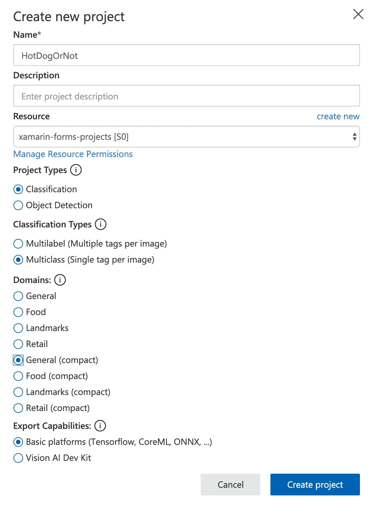
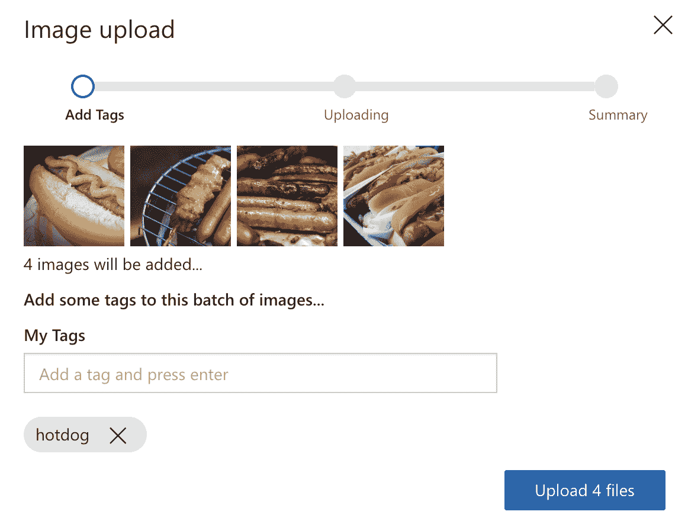
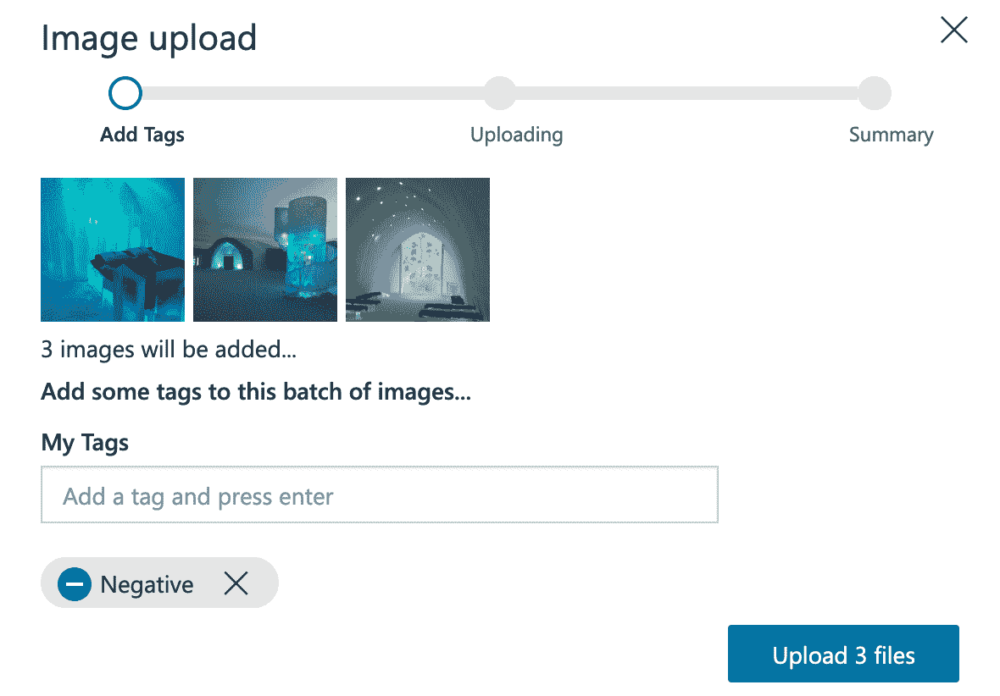
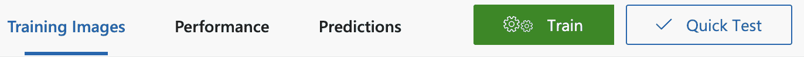
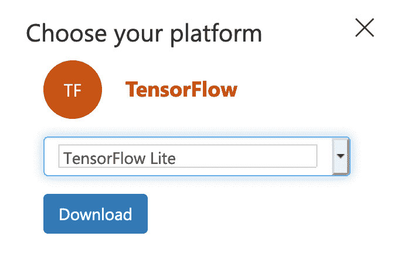

Hot Dog or Not Hot Dog Using Machine Learning

在本章中，我们将学习如何使用机器学习创建一个可用于图像分类的模型。我们将把该模型导出为 TensorFlow 模型，可以在 Android 设备上使用，也可以导出为核心 ML 模型，可以在 iOS 设备上使用。为了训练和导出模型，我们将使用 Azure 认知服务和定制视觉服务。

一旦我们导出了这些模型，我们将学习如何在 Android 和 iOS 应用程序中使用它们。

本章将介绍以下主题：

*   使用 Azure 认知服务和自定义 Vision 服务培训模型
*   在 Android 设备上使用 TensorFlow 模型进行图像分类
*   在 iOS 设备上使用 Core ML 模型进行图像分类

# 技术要求

要完成此项目，您需要安装 Visual Studio for Mac 或 PC 以及 Xamarin 组件。有关如何设置环境的详细信息，请参见[第 1 章](11.html)、*Xamarin 简介、*。您还需要一个 Azure 帐户。如果您有 VisualStudio 订阅，则每个月都会包含特定数量的 Azure 积分。要激活您的 Azure 权益，请转到[https://my.visualstudio.com](https://my.visualstudio.com) 。

您还可以创建一个免费帐户，在该帐户中，您可以在 12 个月内免费使用选定的服务。您将获得价值 200 美元的积分，可以在 30 天内浏览任何 Azure 服务，您还可以随时使用免费服务。更多信息请参见[https://azure.microsoft.com/en-us/free/](https://azure.microsoft.com/en-us/free/) 。

本章的源代码可从位于[的 GitHub 存储库获取 https://github.com/PacktPublishing/Xamarin.Forms-4-Projects/tree/master/Chapter11](https://github.com/PacktPublishing/Xamarin.Forms-4-Projects/tree/master/Chapter11) 。

# 机器学习

术语**机器学习**由美国**人工智能**（**AI**的先驱亚瑟·塞缪尔于 1959 年创造。美国计算机科学家汤姆·米切尔（Tom M.Mitchell）后来对机器学习给出了以下更正式的定义：

"A computer program is said to learn from experience E with respect to some class of tasks T and performance measure P if its performance at tasks in T, as measured by P, improves with experience E." – Tom M. Mitchell

更简单地说，这段引文描述了一种计算机程序，它能够在没有明确编程的情况下进行学习。在机器学习中，算法用于建立样本数据或训练数据的数学模型。这些模型用于计算机程序进行预测和决策，而无需对相关任务进行明确编程。

## Azure 认知服务–定制愿景

自定义视觉是一种工具或服务，可用于训练图像分类模型和检测图像中的对象。使用自定义 Vision，我们可以上传自己的图像并对其进行标记，以便对其进行图像分类培训。如果我们训练一个目标检测模型，我们还可以标记图像的特定区域。因为模型已经为基本的图像识别进行了预训练，所以我们不需要大量的数据就能得到很好的结果。建议每个标签至少有 30 个图像。

当我们对模型进行培训后，我们可以将其与**应用程序编程接口**（**API**一起使用，该接口是定制 Vision 服务的一部分。我们还可以将核心 ML（iOS）、TensorFlow（Android）、开放式神经网络交换（**ONNX**）（Windows）的模型导出到 Dockerfile（Azure IoT 边缘、Azure 函数和 Azure ML）。这些模型可用于执行分类或对象检测，而无需连接到自定义视觉服务。

您需要 Azure 订阅才能使用它，请转到[https://azure.com/free](https://azure.com/free) 创建一个免费订阅，应该足以完成此项目。

## 核心 ML

CoreML 是 iOS 11 中引入的一个框架。Core ML 使机器学习模型能够集成到 iOS 应用程序中。在 Core ML 之上，我们有三个高级 API，如下所示：

*   用于图像分析的视觉 API
*   用于自然语言处理的自然语言 API
*   GameplayKit，用于评估学习的决策树

More information about Core ML can be found in the official documentation from Apple at [https://developer.apple.com/documentation/coreml](https://developer.apple.com/documentation/coreml).

## 张量流

TensorFlow 是一个开源的机器学习框架。但 TensorFlow 不仅可以用于在移动设备上运行模型，还可以用于培训模型。为了在移动设备上运行它，我们有 TensorFlow Lite。从 Azure 认知服务导出的模型是针对 TensorFlow Lite 的。TensorFlow Lite 也有 Xamarin 绑定，可以作为 NuGet 包提供。

More information about TensorFlow can be found in the official documentation at [https://www.tensorflow.org/](https://www.tensorflow.org/).

# 项目概述

如果你看过电视连续剧*硅谷*，你可能听说过*非热狗*应用程序。在本章中，我们将学习如何构建该应用程序。本章的第一部分将涉及收集数据，我们将使用这些数据创建一个机器学习模型，该模型可以检测照片是否包含热狗。

在本章的第二部分，我们将构建一个 iOS 应用程序和一个 Android 应用程序，用户可以在照片库中选择一张照片，以便分析它是否包含热狗。完成该项目的预计时间为 120 分钟。

# 开始

我们可以使用 PC 上的 Visual Studio 2019 或 Mac 上的 Visual Studio 来完成此项目。要使用 Visual Studio for PC 构建 iOS 应用程序，必须连接 Mac。如果你根本无法访问 Mac，你可以选择只做这个项目的 Android 部分。同样，如果你只有一台 Mac 电脑，你可以选择只做这个项目的 iOS 或 Android 部分。

# 使用机器学习构建热狗或非热狗应用程序

让我们开始吧！我们将首先训练一个图像分类模型，我们可以在本章后面使用该模型来确定照片是否包含热狗。

## 培养一个模范

为了训练图像分类的模型，我们需要收集热狗的照片和非热狗的照片。因为世界上大多数物品都不是热狗，所以我们需要更多不含热狗的照片。如果热狗的照片涵盖了很多不同的热狗场景，比如面包、番茄酱或芥末，那就更好了。这样模型就能够在不同的情况下识别热狗。当我们收集不属于热狗的照片时，我们还需要有各种各样的照片，它们都是类似于热狗的物品，并且与热狗完全不同。

GitHub 解决方案中的模型接受了 240 张照片的训练，其中 60 张是热狗照片，180 张不是。

收集完所有照片后，我们将通过以下步骤开始训练模型：

1.  转到[https://customvision.ai](https://customvision.ai) 。
2.  登录并创建一个新项目。
3.  在我们的案例中，为项目命名为`HotDogOrNot`。

4.  选择资源或通过单击“新建”创建新资源。填写对话框并在种类下拉列表中选择 CustomVision.Training。
5.  项目类型应为分类，分类类型应为**多类（每幅图像单个标签）**。
6.  选择 General（compact）作为域。如果我们想导出模型并在移动设备上运行它们，我们就使用压缩域。
7.  单击“创建项目”继续，如以下屏幕截图所示：



### 标记图像

一旦我们创建了一个项目，我们就可以开始上传图像并标记它们。获取图像最简单的方法是去谷歌搜索。首先，我们将通过以下步骤添加热狗的照片：

1.  单击添加图像。
2.  选择应上传的热狗照片。
3.  用`hotdog`标记照片，如下图所示：



一旦我们上传了所有热狗的照片，就可以通过以下步骤上传那些不是热狗的照片了。为了获得最佳效果，我们还应该包括看起来像热狗但不是热狗的物体的照片。进行如下工作：

1.  单击添加图像。
2.  选择不是热狗的照片。
3.  用负片标记照片。负片标记用于不包含我们为其创建其他标记的任何对象的照片。在这种情况下，我们将上传的照片中没有一张包含热狗，如以下截图所示：



### 培养一个模范

一旦我们上传了照片，是时候训练一个模特了。并非我们上传的所有照片都将用于培训；一些将用于验证，给我们一个关于模型有多好的分数。如果我们分块上传照片，并在每一块之后训练模型，我们将能够看到我们的分数提高。要训练模型，请单击页面顶部的绿色训练按钮，如以下屏幕截图所示：



以下屏幕截图显示了训练迭代的结果，其中模型的精度为 91.7%：


### 导出模型

一旦我们训练了一个模型，我们就可以将其导出，以便在设备上使用。如果我们愿意，我们可以使用 API，但是为了快速分类并能够离线完成，我们将把模型添加到应用程序包中。导出并下载 CoreML 模型和 TensorFlow 模型，如以下屏幕截图所示：


对于 TensorFlow，我们可以使用不同类型的模型。对于本项目，我们将使用 TensorFlow Lite，如以下屏幕截图所示：



## 构建应用程序

一旦我们有了一个核心 ML 模型和一个 TensorFlow 模型，就到了构建应用程序的时候了。我们的应用程序将使用经过训练的模型根据照片是否是热狗的照片对照片进行分类。我们从定制 Vision 服务导出的核心 ML 模型将用于 iOS，TensorFlow 模型将用于 Android。

使用空白 Xamarin.Forms 应用程序的模板创建新项目。使用`HotDotOrNot`作为项目名称。

在执行任何其他操作之前，我们将更新 Xamarin.Forms NuGet 包，以确保我们拥有最新版本。

### 基于机器学习的图像分类

我们将用于图像分类的代码不能在 iOS 和 Android 项目之间共享。然而，为了能够从共享代码（即`HotDogOrNot`项目）中进行分类，我们将创建一个接口。但是，首先，我们将通过以下步骤为我们将在接口中使用的`EventArgs`创建一个类：

1.  在`HotDogOrNot`项目中，创建一个名为`ClassificationEventArgs`的新类。
2.  添加`EventArgs`作为基类，如下代码块所示：

```cs
using System;
using System.Collections.Generic; 

public class ClassificationEventArgs : EventArgs
{
    public Dictionary<string, float> Classifications { get; private  
    set; }

    public ClassificationEventArgs(Dictionary<string, float> 
    classifications)
    {
        Classifications = classifications;
    }
}
```

现在我们已经创建了`ClassificationEventArgs`类，我们可以通过以下步骤创建接口：

1.  在`HotDogOrNot`项目中，创建一个名为`IClassifier`的新接口。
2.  添加一个名为`Classify`的方法，该方法不返回任何内容，但将`byte``[]`作为参数。
3.  添加一个使用`ClassificationEventArgs`类的事件，并调用它`ClassificationCompleted`，如下代码块所示：

```cs
using System;
using System.Collections.Generic; 

public interface IClassifier
{
    void Classify(byte[] bytes);
    event EventHandler<ClassificationEventArgs> 
    ClassificationCompleted;
}
```

#### 用核 ML 进行图像分类

我们要做的第一件事是通过以下步骤将核心 ML 模型添加到`HotDogOrNot.iOS`项目中：

1.  提取我们从 Custom Vision 服务获得的`.zip`文件。
2.  找到`.mlmodel`文件并将其重命名为`hotdog-or-not.mlmodel`。
3.  将其添加到 iOS 项目中的`Resources`文件夹中。
4.  确保构建操作为`BundleResource`。如果您在 Mac 上使用 Visual Studio，将创建一个`.cs`文件。删除此文件，因为在没有代码的情况下使用模型会更容易。

当我们将文件添加到 iOS 项目中后，我们将通过以下步骤准备创建`IClassifier`接口的 iOS 实现：

1.  在`HotDogOrNotDog.iOS`项目中创建一个名为`CoreMLClassifier`的新类。
2.  添加`IClassifier`接口。
3.  从接口执行`ClassificationCompleted`事件和`Classify`方法，如下代码块所示：

```cs
using System;
using System.Linq;
using CoreML;
using Foundation;
using ImageIO;
using Vision;
using System.Collections.Generic; 

namespace HotDogOrNot.iOS
{
    public class CoreMLClassifier : IClassifier
    {
        public event EventHandler<ClassificationEventArgs> 
        ClassificationCompleted;

        public void Classify(byte[] bytes)
        {
            //Code will be added here
        }
    } 
}
```

在`Classify`方法中，我们要做的第一件事是通过以下步骤编译核心 ML 模型：

1.  通过`NSBundle.MainBundle.GetUrlForResource`方法得到模型的路径。
2.  用`MLModel.CompileModel`方法编译模型。传递模型的**统一资源定位器**（**URL**）和一个错误对象，该错误对象将指示模型编译期间是否发生了一个或多个错误。
3.  使用`CompileModel`方法中的 URL 并将其传递给`MLModel.Create`以创建我们可以使用的模型对象，如下面的代码片段所示：

```cs
var modelUrl = NSBundle.MainBundle.GetUrlForResource("hotdog-or-not", "mlmodel");
var compiledUrl = MLModel.CompileModel(modelUrl, out var error);
var compiledModel = MLModel.Create(compiledUrl, out error);
```

因为我们将为核心 ML 模型使用照片，所以我们可以使用构建在核心 ML API 之上的 Vision API。为此，我们将使用`VNCoreMLRequest`。但是，在创建请求之前，我们将通过以下步骤创建一个回调，该回调将在请求完成时处理：

1.  打开`CoreMLClassifier.cs`文件。
2.  创建一个名为`HandleVNRequest`**的新私有方法，该方法有两个参数，一个是`VNRequst`类型，另一个是`NSError`类型。**

 **3.  如果错误为`null`，则使用`ClassificationEventArgs`调用`ClassificationCompleted`事件，其中包含空的`Dictionary`。
4.  如果错误不为空，则使用`VNRequest`对象上的`GetResults`方法获取结果。
5.  按`Confidence`对分类进行排序，使置信度最高的分类排在第一位。
6.  使用`ToDictionary`方法将结果转换为`Dictionary`。
7.  使用包含已排序字典的`ClassificationEventArgs`调用`ClassificationCompleted`事件。这在以下代码块中显示：

```cs
private void HandleVNRequest(VNRequest request, NSError error)
{
    if (error != null) 
    {
    ClassificationCompleted?.Invoke(this, new 
    ClassificationEventArgs(new Dictionary<string, float>())); 
    }

    var result = request.GetResults<VNClassificationObservation>();
    var classifications = result.OrderByDescending(x => 
    x.Confidence).ToDictionary(x => x.Identifier, x => 
    x.Confidence);

    ClassificationCompleted?.Invoke(this, new 
    ClassificationEventArgs(classifications));  
}
```

创建回调后，我们将返回到`Classify`方法，通过以下步骤进行分类：

1.  将模型转换为`VNCoreMLModel`对象，因为我们需要它来使用 Vision API。使用`VNCoreMLModel.FromMLModel`方法转换模型。
2.  创建一个新的`VNCoreMLRequest`对象，并将`VNCoreMLModel`和我们创建的回调作为参数传递给构造函数。
3.  使用`NSData.FromArray`方法将输入数据转换为`NSData`对象。
4.  创建一个新的`VNImageRequestHandler`对象，并将`CGImagePropertyOrientation.Up`数据对象和一个新的`VNImageOptions`对象传递给构造函数。

5.  在`VNImageRequestHandler`对象上使用`Perform`方法，将`VNCoreMLRequest`对象作为数组和错误对象作为参数传递，如下代码块所示：

```cs
public void Classify(byte[] bytes)
{
    var modelUrl = NSBundle.MainBundle.GetUrlForResource("hotdog-
     or-not", "mlmodel");
    var compiledUrl = MLModel.CompileModel(modelUrl, out 
     var error);
    var compiledModel = MLModel.Create(compiledUrl, out error); 

    var vnCoreModel = VNCoreMLModel.FromMLModel(compiledModel, out 
    error);

 var classificationRequest = new VNCoreMLRequest(vnCoreModel,    
    HandleVNRequest); 

 var data = NSData.FromArray(bytes);
 var handler = new VNImageRequestHandler(data,  
    CGImagePropertyOrientation.Up, new VNImageOptions()); 
 handler.Perform(new[] { classificationRequest }, out error);
}
```

我们现在已经在 iOS 中编写了识别热狗的代码。

#### 使用 TensorFlow 进行图像分类

现在是为 Android 编写代码的时候了。首先要做的是将我们从 CustomVision 服务导出的文件添加到 Android 项目中。对于 TensorFlow，实际模型和标签（标记）被分为两个文件。让我们通过以下步骤进行设置：

1.  提取我们从 Custom Vision 服务获得的`.zip`文件。
2.  找到`model.tflite`文件并将其重命名为`hotdog-or-not-model.tflite`。
3.  找到`labels.txt`文件并将其重命名为`hotdog-or-not-labels.txt`。
4.  将文件导入 Android 项目中的`Assets`文件夹。确保构建操作为`AndroidAsset`。

当我们将这些文件导入到 Android 项目中后，我们就可以开始编写代码了。要获得 TensorFlow 所需的库，我们还需要通过以下步骤安装 NuGet 软件包：

1.  在`HotDogOrNotDog.Android`项目中，安装`Xamarin.Tensorflow.Lite`NuGet 包。
2.  然后，在`HotDogOrNotDog.Android`项目中创建一个名为`TensorflowClassifier`的新类。
3.  将`IClassifier`接口添加到`TensorflowClassifier`类中。
4.  从接口执行`ClassificationCompleted`事件和`Classify`方法，如下代码块所示：

```cs
using System;
using System.Collections.Generic;
using System.IO;
using System.Linq;
using Android.App;
using Android.Graphics; 

public class TensorflowClassifier : IClassifier
{
         public event EventHandler<ClassificationEventArgs> 
         ClassificationCompleted;

         public void Classify(byte[] bytes)
         {
            //Code will be added here
         }
}
```

我们要做的第一件事是从 assets 文件夹导入 TensorFlow Lite 模型，并将其转换为一个`MappedByteBuffer`对象。按照以下步骤创建一个可执行此操作的方法：

1.  创建一个新的私有方法，该方法返回一个名为`GetModelAsMappedByteBuffer`的`MappedByteBuffer`。
2.  使用`Application.Context.Assets.OpenFd`方法为名为`assetDescriptor`的变量创建一个`AssetFileDescriptor`对象，并将模型的文件名作为参数传递。
3.  创建一个新的`FileInputStream`对象，并将`assetDescriptor.FileDescriptor`作为参数传递到名为`inputStream`的变量中。

4.  使用`inputStream`变量上`Channel`属性的`Map`方法，将`MappedByteByffer`对象创建为名为`mappedByteBuffer`的变量。通过`FileChannel.MapMode.ReadOnly`、`fileDescriptor`变量的`StartOffset`属性值和`fileDescriptor`变量的`DeclaredLength`属性值。
5.  返回`mappedByteBuffer`变量，如下代码块所示：

```cs
private MappedByteBuffer GetModelAsMappedByteBuffer()
{
    var assetDescriptor = Application.Context.Assets.OpenFd("hotdog-or-not-model.tflite");
    var inputStream = new FileInputStream(assetDescriptor.FileDescriptor);

    var mappedByteBuffer = inputStream.Channel.Map(FileChannel.MapMode.ReadOnly, assetDescriptor.StartOffset, assetDescriptor.DeclaredLength);

    return mappedByteBuffer;
}
```

现在，当我们有`MappedByteBuffer`时，我们可以创建一个`Xamarin.TensorFlow.Lite.Interpreter`对象，用于预测。但在进行预测之前，我们需要确定发送到模型的图像的大小。遵循以下步骤：

1.  使用`GetModelAsMappedByteBuffer`对象在名为`mappedByteBuffer`的变量中创建`MappedByteBuffer`。
2.  创建一个新的`Xamarin.TensorFlow.Lite.Interpreter`并将`mappedByteBuffer`变量传递给它。
3.  使用`Interpreter`的`GetInputTensor`方法获取输入张量。将`0`作为参数传递给它。将其保存在名为`tensor`的变量中。
4.  使用`Shape`方法从张量中获取形状。将其保存在名为`shape`的变量中。
5.  创建一个宽度变量和一个高度变量。`width`在`shape`数组的索引 1 处，`height`在索引 2 处，如下代码块所示：

```cs
public void Classify(byte[])
{
    var mappedByteBuffer = GetModelAsMappedByteBuffer();
    var interpreter = new Xamarin.TensorFlow.Lite.Interpreter(mappedByteBuffer);

 var tensor = interpreter.GetInputTensor(0);
 var shape = tensor.Shape();

 var width = shape[1];
 var height = shape[2];
}
```

现在，我们将创建一个私有方法，将输入的照片转换为`ByteBuffer`对象，以便我们可以将其传递给`Interpreter`进行预测。但首先，我们将向类中添加两个常量-`FloatSize`的值为`4`，因为浮点值大 4 字节，`PixelSize`的值为 3，因为像素具有**红绿蓝**（**RGB**颜色通道，如以下代码片段所示：

```cs
public const int FloatSize = 4;
public const int PixelSize = 3;
```

现在，我们可以继续使用该方法，如下所示：

1.  创建一个新方法，该方法返回一个名为`GetPhotoAsByteBuffer`的`ByteBuffer`，该名称具有以下参数：`bytes`（照片作为字节数组）、`width`（调整照片大小的宽度）和`height`（调整照片大小的高度）。
2.  首先，我们需要创建字节数组的位图，以便调整其大小。我们将使用`BitmapFactory`类的`DecodeByteArray`静态方法来完成。
3.  使用`Bitmap.CreateScaledBitmap`方法调整图像大小，传递上一步中的位图，并传递`width`以调整大小，传递`height`以调整大小，传递`true`作为最后一个参数。
4.  计算`ByteBuffer`、`FontSize`*`height`*`width`*`PixelSize`的大小，保存在名为`modelInputSize`的变量中。
5.  在名为`byteBuffer`的变量中创建`ByteBuffer`对象。使用`ByteBuffer.AllocateDirect`方法并传递`modelInputSize`变量来完成此操作。
6.  使用`ByteBuffer`的`Order`方法将`ByteBuffer`的顺序设置为`NativeOrder`，并将`ByteBuffer.NativeOrder()`传递给它。
7.  接下来，我们将遍历照片的所有像素，将其添加到`ByteBuffer`。首先，我们将创建一个包含照片所有像素的`int`数组，创建一个名为`pixels`的变量，并创建一个大小等于照片中像素数（宽度*高度）的`int`数组。
8.  循环遍历像素并将像素值传递到`ByteBuffer`，如下面代码块中以粗体标记的代码所示。

9.  循环使用位图以释放内存。
10.  返回`byteBuffer`变量。

所有这些都在以下代码块中进行了说明：

```cs
private ByteBuffer GetPhotoAsByteBuffer(byte[] bytes, int width, int height)
{
     var bitmap = BitmapFactory.DecodeByteArray(bytes, 0, bytes.Length);
     var resizedBitmap = Bitmap.CreateScaledBitmap(bitmap, width, height,
      true);

     var modelInputSize = FloatSize * height * width * PixelSize;

     var byteBuffer = ByteBuffer.AllocateDirect(modelInputSize);
     byteBuffer.Order(ByteOrder.NativeOrder());

     var pixels = new int[width * height];
     resizedBitmap.GetPixels(pixels, 0, resizedBitmap.Width, 0, 0, 
      resizedBitmap.Width, resizedBitmap.Height);

     var pixel = 0;

 for (var i = 0; i < width; i++)
 {
 for (var j = 0; j < height; j++)
 {
 var pixelVal = pixels[pixel++];
 byteBuffer.PutFloat(pixelVal >> 16 & 0xFF);
 byteBuffer.PutFloat(pixelVal >> 8 & 0xFF);
 byteBuffer.PutFloat(pixelVal & 0xFF);
 }
 }

     bitmap.Recycle();

     return byteBuffer;
}
```

现在，当我们准备好模型和照片后，最后要准备的是输出对象。输入应该是一个二维浮点数数组。输出对象的大小将基于我们从 CustomVision 服务导出的标签。按照以下步骤创建输出对象：

1.  转到`Classify`方法的末尾。
2.  使用`StreamReader`类读取`hotdog-or-not-labels.txt`文件中的标签。使用`Application.Context.Assets.Open`方法打开文件并将其传递给`StreamReader`对象的构造函数。
3.  用`ReadToEnd`方法将文件读到底，并从中创建标签列表（`List<string>`。根据新行从文件中拆分文本，并使用`Linq`从空值中筛选文本并将其转换为`List<string>`对象。别忘了修剪每件物品。
4.  创建二维浮点数组，如下面代码块中第一个粗体行所示。
5.  因为`Interpreter`要求输出对象是`Java.Lang.Object`对象，所以我们需要将其转换为该类型。我们将使用`Java.Lang.Object.FromArray`方法进行此操作，如以下代码块所示：

```cs
var sr = new StreamReader(Application.Context.Assets.Open("hotdog-or-not-labels.txt"));
var labels = sr.ReadToEnd().Split('\n').Select(s => s.Trim()).Where(s => !string.IsNullOrEmpty(s)).ToList();

var outputLocations = new float[1][] { new float[labels.Count] };
var outputs = Java.Lang.Object.FromArray(outputLocations);
```

现在，一切都准备好用`Interpreter`运行预测。按照以下步骤运行预测并处理结果：

1.  使用我们之前创建的`GetPhotoAsByteBuffer`方法，以`ByteBuffer`的形式获取照片。将其保存在名为`byteBuffer`的变量中。
2.  使用`Interpreter`的`Run`方法运行预测，将`byteBuffer`和`output`变量传递给它。
3.  现在，我们在`output`变量中得到了结果。要使用它，请使用`ToArray`方法将其转换回二维浮点数组。
4.  为结果创建一个新的`Dictionary<string, float>`，并将变量命名为`result`。

5.  循环遍历`labels`列表并将结果映射到标签，如下面代码块中的粗体所示。
6.  调用`ClassificationCompleted`方法，使用`this`关键字传递`TensorFlowClassifier`实例，并向其传递一个新的`ClassificationEventArgs`对象。将`result`变量传递给`ClassificationEventArgs`类的构造函数，如下代码块所示：

```cs
var byteBuffer = GetPhotoAsByteBuffer(bytes, width, height);

interpreter.Run(byteBuffer, outputs);

var predictionResult = outputs.ToArray<float[]>();

var result = new Dictionary<string, float>();

for (var i = 0; i < labels.Count; i++)
{
    var label = labels[i];
    result.Add(label, predictionResult[0][i]);
}

ClassificationCompleted?.Invoke(this, new ClassificationEventArgs(result));
```

### 创建基本 ViewModel 类

在初始化应用程序之前，我们将创建一个基本`ViewModel`类，以便在注册其他`ViewModel`实例时使用它。在这里，我们将放置可在应用程序的所有`ViewModel`实例之间共享的代码。让我们通过以下步骤进行设置：

1.  在`HotDogOrNot`项目中，创建一个名为`ViewModels`的新文件夹。
2.  在我们创建的`ViewModels`文件夹中创建一个名为`ViewModel`的新类。
3.  使课堂公开和抽象。
4.  添加并实现`INotifiedPropertyChanged`接口。这是必要的，因为我们希望使用数据绑定。
5.  添加一个`Set`方法，使我们更容易从`INotifiedPropertyChanged`接口引发`PropertyChanged`事件。该方法将检查值是否已更改。如果有，它将引发事件。

6.  添加一个名为`Navigation`的`INavigation`类型的静态属性，如下代码块所示：

```cs
using System;
using System.Collections.Generic;
using System.ComponentModel;
using System.Runtime.CompilerServices;
using Xamarin.Forms; 

namespace HotDogOrNot
{
    public abstract class ViewModel : INotifyPropertyChanged
    {
         public event PropertyChangedEventHandler PropertyChanged; 
         protected void Set<T>(ref T field, T newValue, 
         [CallerMemberName] string propertyName = null)
         {
              if (!EqualityComparer<T>.Default.Equals(field, 
                 newValue))
              {
                   field = newValue;
                   PropertyChanged?.Invoke(this, new 
                   PropertyChangedEventArgs(propertyName));
              }    
         }    

         public static INavigation Navigation { get; set; } 
    } 
}
```

### 初始化应用程序

我们现在已经准备好为应用程序编写初始化代码。我们将设置**控制反转**（**IoC**，创建一个`Resolver`类和一个引导程序，用于处理应用程序的初始配置。

#### 创建冲突解决程序类

现在我们将创建一个帮助器类，它将简化通过`Autofac`解析对象图的过程。这将帮助我们基于配置的 IoC 容器创建类型。在本项目中，我们将通过以下步骤使用`Autofac`作为 IoC 库：

1.  在`HotDogOrNot`项目中，将`Autofac`NuGet 包安装到`HotDogOrNot`项目中。
2.  在根目录中创建一个名为`Resolver`的新类。
3.  添加一个名为`container`的`IContainer`类型的私有静态字段（来自`Autofac`。
4.  添加一个名为`Initialize`的公共静态方法，参数为`IContainer`。将参数值设置为`container`字段。
5.  添加一个名为`Resolve`的泛型`public static`方法，返回一个基于`IContainer`的`Resolve`方法的类型参数的实例，如下代码块所示：

```cs
using System;
using Autofac; 

namespace HotDogOrNot
{    
    public class Resolver
    {
         private static IContainer container;

         public static void Initialize(IContainer container)
         {
              Resolver.container = container;
         }

         public static T Resolve<T>()
         {
              return container.Resolve<T>();
         }
    } 
}
```

#### 创建引导程序

为了配置依赖注入并初始化`Resolver`类，我们将创建一个引导程序。我们将为每个平台提供一个共享引导程序和一个引导程序，以匹配它们的特定配置。我们将在 iOS 和 Android 中使用不同的`IClassifier`对象实现。要创建引导程序，请执行以下步骤：

1.  在`HotDogOrNot`项目中创建一个新类，并将其命名为`Bootstrapper`。
2.  在新类中编写以下代码：

```cs
using System.Linq;
using System.Reflection;
using Autofac;
using HotdogOrNot.ViewModels;
using Xamarin.Forms;

namespace HotDogOrNot
{
    public class Bootstrapper
    {
         protected ContainerBuilder ContainerBuilder { get; private 
         set; }

         public Bootstrapper()
         {
             Initialize();
             FinishInitialization();
         }

         protected virtual void Initialize()
         {
             ContainerBuilder = new ContainerBuilder();

             var currentAssembly = Assembly.GetExecutingAssembly();

             foreach (var type in 
             currentAssembly.DefinedTypes.Where(e => 
             e.IsSubclassOf(typeof(Page))))
             {
                 ContainerBuilder.RegisterType(type.AsType());
             }

             foreach (var type in 
             currentAssembly.DefinedTypes.Where(e => 
             e.IsSubclassOf(typeof(ViewModel))))
             {
                 ContainerBuilder.RegisterType(type.AsType());
             }
         }

         private void FinishInitialization()
         {
             var container = ContainerBuilder.Build();

             Resolver.Initialize(container);
         }
    } 
}
```

#### 创建 iOS 引导程序

在 iOS 引导程序中，我们将拥有特定于 iOS 应用程序的配置。要创建 iOS 应用程序，我们将执行以下步骤：

1.  在`HotDogOrNot.iOS`项目中，创建一个新类，并将其命名为`Bootstrapper`。
2.  使新类从`HotDogOrNot.Bootstrapper`继承。
3.  编写以下代码并解析所有引用：

```cs
using System;
using Autofac; 

public class Bootstrapper : HotdogOrNot.Bootstrapper
{
    public static void Init()
    {
        var instance = new Bootstrapper();
    }

    protected override void Initialize()
    {
        base.Initialize();

        ContainerBuilder.RegisterType<CoreMLClassifier>
        ().As<IClassifier>();
    }
}
```

4.  转到 iOS 项目中的`AppDelegate.cs`。
5.  在调用`LoadApplication`之前，在`FinishedLaunching`方法中，调用平台特定引导程序的`Init`方法，如下代码块所示：

```cs
public override bool FinishedLaunching(UIApplication app, NSDictionary options)
{
      global::Xamarin.Forms.Forms.Init();
      Bootstrapper.Init();

      LoadApplication(new App());

      return base.FinishedLaunching(app, options);
}
```

#### 创建 Android 引导程序

在 Android 引导程序中，我们将有特定于 Android 应用程序的配置。要在 Android 中创建引导程序，我们将执行以下步骤：

1.  在 Android 项目中，创建一个新类并将其命名为`Bootstrapper`。
2.  使新类从`HotDogOrNot.Bootstrapper`继承。
3.  编写以下代码并解析所有引用：

```cs
using System;
using Autofac; 

public class Bootstrapper : HotDogOrNot.Bootstrapper
{
         public static void Init()
         {
             var instance = new Bootstrapper();
         }

         protected override void Initialize()
         {
             base.Initialize();

             ContainerBuilder.RegisterType<TensorflowClassifier>
             ().As<IClassifier>().SingleInstance();
         }
}
```

4.  转到 Android 项目中的`MainActivity.cs`文件。
5.  在调用`LoadApplication`之前，在`OnCreate`方法中，调用平台特定引导程序的`Execute`方法，如下代码块所示：

```cs
protected override void OnCreate(Bundle savedInstanceState)
{
     TabLayoutResource = Resource.Layout.Tabbar;
     ToolbarResource = Resource.Layout.Toolbar;

     base.OnCreate(savedInstanceState);
     global::Xamarin.Forms.Forms.Init(this, savedInstanceState);

 Bootstrapper.Init();

     LoadApplication(new App());
}
```

### 构建第一视图

此应用程序中的第一个视图将是带有两个按钮的简单视图。一个按钮将用于启动相机，以便用户可以拍摄某个东西的照片，以确定它是否是热狗。另一个按钮用于从设备的照片库中拾取照片。

#### 构建 ViewModel 类

我们将从创建`ViewModel`类开始，该类将处理当用户点击其中一个按钮时发生的事情。让我们通过以下步骤进行设置：

1.  在`ViewModels`文件夹中创建一个名为`MainViewModel`的新类。
2.  添加`ViewModel`作为`MainViewModel`的基类。
3.  创建一个`IClassifier`类型的私有字段，并将其命名为`classifier`。
4.  创建一个以`IClassifier`为参数的构造函数。
5.  将`classifier`字段的值设置为构造函数中参数的值，如下代码块所示：

```cs
using System.IO;
using System.Linq;
using System.Windows.Input;
using HotdogOrNot.Models;
using HotdogOrNot.Views;
using Xamarin.Forms; 

public class MainViewModel : ViewModel
{
    private IClassifier classifier;

    public MainViewModel(IClassifier classifier)
    {
        this.classifier = classifier;
    } 
}
```

我们将使用`Xam.Plugin.Media`NuGet 软件包拍摄照片并访问设备的照片库。我们需要使用 NuGet 软件包管理器为解决方案中的所有项目安装软件包。然而，在使用该软件包之前，我们需要对每个平台进行一些配置。我们将从 Android 开始。让我们通过以下步骤进行设置：

1.  插件需要`WRITE_EXTERNAL_STORAGE`**和
    `READ_EXTERNAL_STORAGE`权限。插件将为我们添加这些，但我们需要重写`MainActivity.cs`类中的`OnRequestPermissionResult`方法。**
***   调用`OnRequestPermissionsResult`方法，如下面的代码块所示。*   在`MainActivity.cs`文件的`OnCreate`方法中初始化 Xamarin.Forms 后添加`CrossCurrentActivity.Current.Init(this, savedInstanceState)`，如下代码块所示：**

```cs
public override void OnRequestPermissionsResult(int requestCode, string[] permissions, Android.Content.PM.Permission[] grantResults)
{
   Xamarin.Essentials.Platform.OnRequestPermissionsResult(requestCode, permissions, grantResults);
} 
```

我们还需要添加一些关于用户可以从中拾取照片的文件路径的配置。这是因为用户需要授予我们使用它们的权限。让我们通过以下步骤进行设置：

1.  在`HotDogOrNot.Android`项目中，将名为`xml`的文件夹添加到`Resources`文件夹中。
2.  在新文件夹中创建名为`file_paths.xml`的新**可扩展标记语言**（**XML**文件）。

3.  将以下代码添加到`file_paths.xml`：

```cs
<?xml version="1.0" encoding="utf-8"?>
<paths xmlns:android="http://schemas.android.com/apk/res/android">
    <external-files-path name="my_images" path="Pictures" />
    <external-files-path name="my_movies" path="Movies" />
</paths>
```

我们需要为 Android 项目设置插件的最后一件事是在应用程序元素内的`AndroidManifest.xml`文件（可在 Android 项目的`Properties`文件夹中找到）中添加代码，如下所示：

```cs
 <manifest xmlns:android="http://schemas.android.com/apk/res/android"   
  android:versionCode="1" android:versionName="1.0"   
  package="xfb.HotdogOrNot">
     <uses-sdk android:minSdkVersion="21" android:targetSdkVersion="27"  
      />
     <application android:label="HotdogOrNot.Android">
     <provider android:name="android.support.v4.content.FileProvider" 
     android:authorities="${applicationId}.fileprovider" 
     android:exported="false" android:grantUriPermissions="true">
 <meta-data android:name="android.support.FILE_PROVIDER_PATHS" 
     android:resource="@xml/file_paths"></meta-data>
 </provider>
     </application>
 </manifest> 
```

对于 iOS 项目，我们只需要在`info.plist`文件中添加以下四个使用说明：

```cs
<key>NSCameraUsageDescription</key>
<string>This app needs access to the camera to take photos.</string>
<key>NSPhotoLibraryUsageDescription</key>
<string>This app needs access to photos.</string>
<key>NSMicrophoneUsageDescription</key>
<string>This app needs access to microphone.</string>
<key>NSPhotoLibraryAddUsageDescription</key>
<string>This app needs access to the photo gallery.</string>
```

一旦我们完成了插件的配置，我们就可以开始使用它了。我们将从创建一个方法开始，该方法将处理在用户拍照和用户拾取照片时获得的媒体文件。

让我们通过以下步骤进行设置：

1.  打开`MainViewModel.cs`文件。
2.  创建一个名为`HandlePhoto`的私有方法，该方法的参数为`MediaFile`**类型。**
***   增加一条`if`语句，检查`MediaFile`参数是否为`null`。如果是，则执行空返回。*   使用`MediaFile`类的`GetStream`方法获取照片流。*   添加一个名为`bytes`的`byte []`类型的私有字段。*   使用我们将在下一步中创建的`ReadFully`方法将流转换为字节数组。*   将事件处理程序添加到分类器的`ClassificationCompleted`事件中。我们将在本章后面创建事件处理程序。*   最后，添加对分类器的`Classify`方法的调用，并使用字节数组作为参数，如下代码块所示：**

```cs
private void HandlePhoto(MediaFile photo)
{
    if(photo == null)
    {
        return;
    }

    var stream = photo.GetStream();
    bytes = ReadFully(stream);

    classifier.ClassificationCompleted += 
    Classifier_ClassificationCompleted;
    classifier.Classify(bytes);
} 
```

现在我们将创建前面代码中调用的`ReadFully`方法。我们将使用它将整个流读入字节数组。代码如下所示：

```cs
private byte[] ReadFully(Stream input)
{
    using (MemoryStream memoryStream = new MemoryStream())
    {
        using (MemoryStream memoryStream = new MemoryStream())
        {
            input.CopyTo(memoryStream);

            return memoryStream.ToArray();
        }
    }

}
```

在创建事件处理程序之前，我们将通过以下步骤创建一个将在事件处理程序内部使用的模型：

1.  在`HotDogOrNot`项目中，创建一个名为`Models`的新文件夹。
2.  在`Models`文件夹中创建一个名为`Result`的新类。
3.  添加一个名为`IsHotdog`的`bool`类型的属性。
4.  添加一个名为`Confidence`的`float`类型的属性。
5.  添加一个名为`PhotoBytes`的`byte[]`类型的属性，如下代码块所示：

```cs
public class Result
{
    public bool IsHotdog { get; set; }
    public float Confidence { get; set; }
    public byte[] PhotoBytes { get; set; }
} 
```

我们现在可以通过以下步骤向`ViewModel`类添加事件处理程序：

1.  创建一个名为`Classifier_ClassificationCompleted`的方法，该方法有一个`object`参数和一个`ClassificationEventArgs`参数。
2.  从分类器中删除事件处理程序，这样我们就不会分配不必要的内存。
3.  检查`Classifications`字典是否包含任何项目。如果有，请对字典进行排序，以使具有最高置信值的分类排在第一位。
4.  创建一个新的`Result`对象并设置属性，如下代码块所示：

```cs
void Classifier_ClassificationCompleted(object sender, ClassificationEventArgs e)
{
    classifier.ClassificationCompleted -= 
    Classifier_ClassificationCompleted;

     Result result = null;

     if (e.Classifications.Any())
     {
         var classificationResult = 
         e.Classifications.OrderByDescending(x => x.Value).First();

         result = new Result()
         {
             IsHotdog = classificationResult.Key == "hotdog",
             Confidence = classificationResult.Value,
             PhotoBytes = bytes
         };
    }
    else
    {
        result = new Result()
        {
            IsHotDog = false,
            Confidence = 1.0f,
            PhotoBytes = bytes
        };
    } 
} 
```

创建结果视图后，我们将返回事件处理程序，将导航添加到此视图。在这个`ViewModel`类中，我们要做的最后一件事是为视图中的按钮创建`Command`属性，以处理当用户点击按钮时应该发生的事情。让我们先设置“拍照”按钮，然后执行以下步骤：

1.  在`MainViewModel.cs`文件中创建一个名为`TakePhoto`的`ICommand`类型的新属性。
2.  使用表达式返回新的`Command`。
3.  将一个`Action`作为表达式传递给`Command`的构造函数。
4.  在`Action`中，使用`CrossMedia.Current.TakePhotoAsync`方法，将`StoreCameraMediaOptions`对象传递给它。
5.  在`StoreCameraMediaOptions`中，使用`DefaultCamera`属性将默认摄像机设置为后摄像机。
6.  将调用`TakePhotoAsync`方法的结果传递给`HandlePhoto`方法，如下代码块所示：

```cs
public ICommand TakePhoto => new Command(async() =>
{
     var photo = await CrossMedia.Current.TakePhotoAsync(new 
     StoreCameraMediaOptions()
     {
       DefaultCamera = CameraDevice.Rear
     });

   HandlePhoto(photo);
});

```

现在我们在`MainViewModel`中要做的最后一件事是处理点击“从库中拾取照片”按钮时发生的情况。让我们通过以下步骤进行设置：

1.  创建一个名为`PickPhoto`的`ICommand`类型的新属性。
2.  使用表达式返回新的`Command`。
3.  将一个`Action`作为表达式传递给`Command`的构造函数。
4.  在`Action`中，使用`CrossMedia.Current.PickPhotoAsync`方法打开操作系统默认的 photo picker。
5.  将调用结果传递给`HandlePhoto`方法的`TakePhotoAsync`方法，如下代码块所示：

```cs
 public ICommand PickPhoto => new Command(async () =>
 {
     var photo = await CrossMedia.Current.PickPhotoAsync();

     HandlePhoto(photo);
 });
```

#### 构建视图

现在，一旦我们创建了`ViewModel`类，就可以为**图形用户界面**（**GUI**创建代码了。按照以下步骤为`MainView`视图创建 GUI：

1.  在`HotDogOrNot`项目中创建一个名为`Views`的新文件夹。
2.  添加一个名为`MainView`的新 XAML 内容页。
3.  将`ContentPage`的`Title`属性设置为`Hotdog or Not hotdog`。
4.  在页面中添加一个`StackLayout`，并将其`VerticalOptions`属性设置为`Center`。
5.  在`StackLayout`中添加一个`Button`，文本为`Take Photo`。对于`Command`属性，向`ViewModel`类中的`TakePhoto`属性添加绑定。

6.  在`StackLayout`中添加一个`Button`，文本为`Pick Photo`。对于`Command`属性，向`ViewModel`类中的`Pick Photo`属性添加绑定，如下代码块所示：

```cs
<ContentPage  
              xmlns:x="http://schemas.microsoft.com/winfx/2009/xaml" 
              x:Class="HotDogOrNot.Views.MainView"
              Title="Hot dog or Not hot dog">
     <ContentPage.Content>
         <StackLayout VerticalOptions="Center">
             <Button Text="Take Photo" Command="{Binding TakePhoto}" />
             <Button Text="Pick Photo" Command="{Binding PickPhoto}" />
         </StackLayout>
     </ContentPage.Content>
</ContentPage>
```

在`MainView.xaml.cs`文件的代码隐藏中，我们将通过以下步骤设置视图的绑定上下文：

1.  添加`MainViewModel`作为构造函数的参数。
2.  在`InitialComponent`方法调用之后，将视图的`BindingContext`属性设置为`MainViewModel`参数。
3.  在`NavigationPage`类上使用`SetBackButtonTitle`静态方法，以便返回该视图的导航箭头将显示在结果视图的导航栏中，如以下代码块所示：

```cs
public MainView(MainViewModel viewModel)
{
    InitializeComponent();

    BindingContext = viewModel;
    NavigationPage.SetBackButtonTitle(this, string.Empty);
}
```

现在，我们可以通过以下步骤进入`App.xaml.cs`并将`MainPage`设置为`MainView`：

1.  在`HotDogOrNot`项目中，进入`App.xaml.cs`。
2.  在`Resolver`类上使用`Resolve`方法创建`MainView`的实例。
3.  创建一个`NavigationPage`对象并将`MainView`传递给构造函数。
4.  将`ViewModel`上的静态`Navigation`属性设置为`NavigationPage`上的`Navigation`属性值。

5.  将`MainPage`属性设置为我们在*步骤 3*中创建的`NavigationPage`实例。
6.  删除`MainPage.xaml`，因为我们不再需要它。您应该留下以下代码：

```cs
public App()
{
    InitializeComponent();

    var mainView = Resolver.Resolve<MainView>();
 var navigationPage = new NavigationPage(mainView);

 ViewModel.Navigation = navigationPage.Navigation;

 MainPage = navigationPage;
}
```

### 构建结果视图

在这个项目中，我们需要做的最后一件事是创建结果视图。此视图将显示输入的照片，以及它是否是热狗。

#### 构建 ViewModel 类

在创建视图之前，我们将通过以下步骤创建一个`ViewModel`类，该类将处理视图的所有逻辑：

1.  在`HotdogOrNot`项目的`ViewModels`文件夹中创建一个名为`ResultViewModel`的类。
2.  将`ViewModel`作为基类添加到`ResultViewModel`类中。
3.  创建一个名为`Title`的`string`类型的属性。为属性添加专用字段。
4.  创建一个名为`Description`的`string`类型的属性。为属性添加专用字段。
5.  创建一个名为`PhotoBytes`的`byte[]`类型的属性。为属性添加专用字段，如以下代码块所示：

```cs
using HotdogOrNot.Models;

namespace HotDogOrNot.ViewModels
{
    public class ResultViewModel : ViewModel
    { 
        private string title;
        public string Title
        {
            get => title;
            set => Set(ref title, value);
        }

        private string description;
        public string Description
        {
            get => description;
            set => Set(ref description, value);
        }

        private byte[] photoBytes;
        public byte[] PhotoBytes
        {
            get => photoBytes;
            set => Set(ref photoBytes, value);
        } 
    }
}
```

我们在`ViewModel`中要做的最后一件事是创建一个`Initialize`方法，该方法将结果作为参数。让我们通过以下步骤进行设置：

1.  在`Initialize`方法中，将`PhotoBytes`属性设置为`result`参数的`PhotoBytes`属性值。
2.  添加一条`if`语句，检查`result`参数的`IsHotDog`属性是否为`true`，以及`Confidence`是否高于 90%。如果是这种情况，则将`Title`设置为`"Hot dog"`，将`Description`设置为`"This is for sure a hotdog"`。
3.  增加一条`else if`语句，检查`result`参数的`IsHotdog`属性是否为`true`。如果是这种情况，则将`Title`设置为`"Maybe"`，将`Description`设置为`"This is maybe a hotdog"`。
4.  添加一条`else`语句，将`Title`设置为`"Not a hot dog"`，将`Description`设置为`"This is not a hot dog"`，如下代码块所示：

```cs
public void Initialize(Result result)
{
    PhotoBytes = result.PhotoBytes;

    if (result.IsHotdog && result.Confidence > 0.9)
    {
        Title = "Hot dog";
        Description = "This is for sure a hot dog";
    }
    else if (result.IsHotdog)
    {
        Title = "Maybe";
        Description = "This is maybe a hot dog";
    }
    else
    {
        Title = "Not a hot dog";
        Description = "This is not a hot dog";
    }
} 
```

#### 构建视图

因为我们想在输入视图中显示输入照片，所以需要将其从`byte[]`转换为`Xamarin.Forms.ImageSource`。我们将在一个值转换器中执行此操作，通过以下步骤，我们可以将其与**XAML**中的绑定一起使用：

1.  在`HotDogOrNot`项目中创建一个名为`Converters`的新文件夹。
2.  创建一个名为`BytesToImageConverter`的新类。
3.  添加并实现`IValueConverter`接口，如下代码块所示：

```cs
using System;
using System.Globalization;
using System.IO;
using Xamarin.Forms;

public class BytesToImageConverter : IValueConverter
{ 
    public object Convert(object value, Type targetType, object 
    parameter, CultureInfo culture)
    {
        throw new NotImplementedException();
    }

   public object ConvertBack(object value, Type targetType, object 
   parameter, CultureInfo culture)
    {
        throw new NotImplementedException();
    }
}

```

当`ViewModel`更新视图时，将使用`Convert`方法。当`View`更新`ViewModel`时，`ConvertBack`方法将用于双向绑定。在这种情况下，我们只需要通过以下步骤为`Convert`方法编写代码：

1.  首先检查`value`参数是否为`null`。如果是，我们应该返回`null`。
2.  如果该值不是`null`，则将其转换为`byte[]`。
3.  从字节数组创建一个`MemoryStream`对象。
4.  返回我们将向其传递流的`ImageSource.FromStream`方法的结果，如下代码块所示：

```cs
public object Convert(object value, Type targetType, object parameter, CultureInfo culture)
{
    if(value == null)
    {
        return null;
    }

    var bytes = (byte[])value;
    var stream = new MemoryStream(bytes);

    return ImageSource.FromStream(() => stream);
} 
```

视图将包含照片，照片将占据屏幕的三分之二。在照片下方，我们将添加对结果的描述。让我们通过以下步骤进行设置：

1.  在`Views`文件夹中，创建一个新的 XAML ContentPage 并将其命名为`ResultView`。
2.  导入转换器的命名空间。
3.  将`BytesToImageConverter`添加到页面的`Resources`中，并为其提供`"ToImage"`键。
4.  将`ContentPage`的`Title`属性绑定到`ViewModel`的`Title`属性。
5.  在有两行的页面中添加一个`Grid`。第一个`RowDefinition`的`Height`值应为`2*`。第二排的高度应为`*`。这些是相对值，意味着第一行将占据`Grid`的三分之二，而第二行将占据`Grid`的三分之一。
6.  将`Image`添加到`Grid`中，并将`Source`属性绑定到`ViewModel`中的`PhotoBytes`属性。使用转换器将字节转换为`ImageSource`对象并设置`Source`属性。
7.  添加一个`Label`并将`Text`属性绑定到`ViewModel`的`Description`属性，如下代码块所示：

```cs
<ContentPage  
             xmlns:x="http://schemas.microsoft.com/winfx/2009/xaml" 
             xmlns:converters="clr-namespace:HotdogOrNot.Converters"
             x:Class="HotdogOrNot.Views.ResultView"
             Title="{Binding Title}">
<ContentPage.Resources>
         <converters:BytesToImageConverter x:Key="ToImage" />
</ContentPage.Resources>
    <Grid>
        <Grid.RowDefinitions>
            <RowDefinition Height="2*" />
            <RowDefinition Height="*" />
        </Grid.RowDefinitions>

        <Image Source="{Binding PhotoBytes, Converter=
        {StaticResource ToImage}}" Aspect="AspectFill" />
        <Label Grid.Row="1" HorizontalOptions="Center" 
        FontAttributes="Bold" Margin="10" Text="{Binding 
        Description}" />
    </Grid>
</ContentPage> 
```

我们还需要设置视图的`BindingContext`。我们将以与在代码隐藏文件（`ResultView.xaml.cs`中的`MainView`中相同的方式执行此操作，如以下代码片段所示：

```cs
public ResultView (ResultViewModel viewModel)
{
    InitializeComponent ();

    BindingContext = viewModel;
}
```

我们需要做的最后一件事是将导航从`MainView`添加到`ResultView`。我们将在`MainViewModel`中`Classifier_ClassificationCompleted`方法的末尾添加以下代码：

```cs
var view = Resolver.Resolve<ResultView>();
((ResultViewModel)view.BindingContext).Initialize(result);

Navigation.PushAsync(view);
```

现在，我们已经准备好运行该应用程序。如果我们使用模拟器/仿真器，如果我们需要照片进行测试，我们可以将照片拖放到其中。当应用程序启动后，我们现在可以选择一张照片并根据模型运行它。下面的屏幕截图显示了如果我们上传热狗的照片，应用程序的外观：


Note: The prediction result for Android is not as accurate as compared to iOS and the web portal, [https://github.com/Azure-Samples/cognitive-services-android-customvision-sample/issues/12](https://github.com/Azure-Samples/cognitive-services-android-customvision-sample/issues/12). As it is not accurate for exported model and we recommend to use the rest apis to get a better result.

You can also check out my other app with same code as an exercise: [https://github.com/dhindrik/MushroomDetector](https://github.com/dhindrik/MushroomDetector)

# 总结

在本章中，我们构建了一个可以识别照片是否包含热狗的应用程序。我们通过使用 Azure 认知服务和定制视觉服务训练图像分类的机器学习模型来实现这一点。

我们导出了 Core ML 和 TensorFlow 的模型，并学习了如何在 iOS 和 Android 应用程序中使用它们。在这些应用程序中，用户可以拍照或从照片库中挑选照片。这张照片将被发送到模型进行分类，我们将得到一个结果，告诉我们这张照片是否是一个热狗。

现在，我们可以继续构建其他应用程序，并使用本章中关于机器学习的内容，无论是在设备上还是在使用 Azure 认知服务的云中。即使我们正在构建其他应用程序，概念也将是相同的。

现在，我们已经完成了本书的所有章节。我们学到了以下几点：

*   Xamarin 是什么以及我们如何开始构建应用程序
*   如何使用 Xamarin.Forms 的基本布局和控件
*   如何使用导航
*   如何通过动画改善用户体验
*   如何在后台使用**全球定位系统**（**GPS**等传感器
*   如何为多个外形因素构建应用程序
*   如何构建 Azure 支持的实时应用程序
*   如何使用 Xamarin 构建**增强现实**（**AR**应用
*   如何通过机器学习使应用程序更智能

下一步是开始构建自己的应用程序。要了解更多关于 Xamarin 的最新信息，我们建议您阅读官方的 Microsoft 开发博客，观看 Twitch 上的实时流，以及 Xamarin 团队的 YouTube 视频。

谢谢你读这本书！******